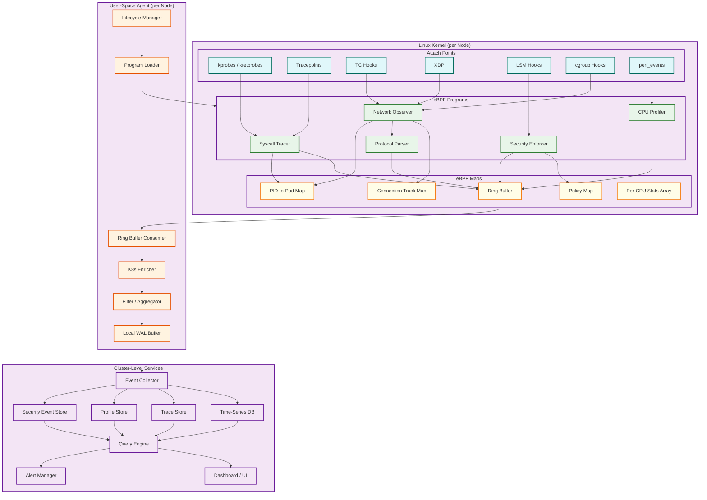
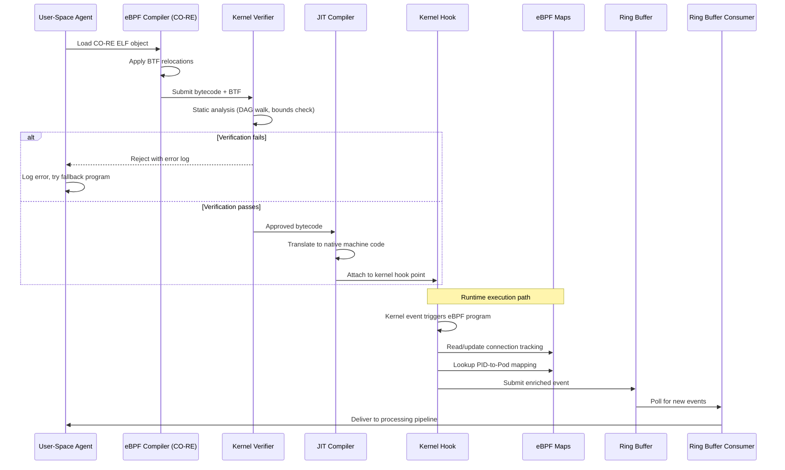
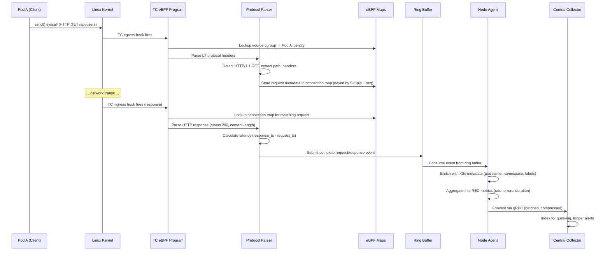

# High-Level Design — eBPF-based Observability Platform

## System Architecture

The platform follows a three-layer architecture: **kernel data plane** (eBPF programs attached to kernel hooks), **node-level control plane** (user-space agent managing eBPF lifecycle and event processing), and **cluster-level analytics plane** (central collectors, storage, and query engines).

---

## eBPF Program Lifecycle

---

## Data Flow: Network Request Observation

This sequence shows how a single HTTP request between two Kubernetes pods is captured, enriched, and delivered — all without any application instrumentation.

---

## Key Architectural Decisions

### 1. In-Kernel Filtering vs. User-Space Filtering

| Aspect | In-Kernel (Chosen) | User-Space |
|--------|-------------------|------------|
| **Volume reduction** | 10-100x before crossing kernel boundary | Full event volume crosses boundary |
| **CPU overhead** | Higher per-event eBPF cost, but far fewer events processed user-side | Lower per-event kernel cost, but massive user-space processing |
| **Flexibility** | Limited by verifier (no unbounded loops, 512B stack) | Arbitrary processing logic |
| **Latency** | Sub-microsecond filtering | Millisecond-scale (context switch + copy) |
| **Recommendation** | Filter aggressively in-kernel: drop uninteresting events, aggregate counters, pre-compute RED metrics | Only use for complex correlation that exceeds verifier limits |

### 2. Ring Buffer vs. Perf Buffer

| Aspect | Ring Buffer (Chosen) | Perf Buffer |
|--------|---------------------|-------------|
| **Memory efficiency** | Single shared buffer across all CPUs | Per-CPU buffers (N × buffer_size total) |
| **Event ordering** | Globally ordered (MPSC) | Per-CPU ordered; requires user-space merge |
| **Overhead (32-core node)** | ~7% CPU overhead | ~35% CPU overhead |
| **Kernel requirement** | Linux 5.8+ | Linux 4.x+ |
| **Back-pressure** | Atomic reserve/commit; events can be dropped with counter | Per-CPU watermarks; harder to detect global pressure |
| **Recommendation** | Use ring buffer for all event streaming; fall back to perf buffer only on pre-5.8 kernels |

### 3. CO-RE vs. Per-Kernel Compilation

| Aspect | CO-RE (Chosen) | Per-Kernel Compilation |
|--------|---------------|----------------------|
| **Portability** | Single binary runs across kernel versions (with BTF) | Must compile on each target kernel |
| **Build complexity** | Compile once with target-agnostic headers | Requires kernel headers on every node |
| **Runtime cost** | BTF relocation at load time (negligible) | Full compilation at load time (seconds) |
| **Kernel requirement** | BTF-enabled kernel (5.2+, most distros since 2020) | Any kernel with headers |
| **Recommendation** | CO-RE as primary path; ship pre-compiled fallbacks for known non-BTF kernels |

### 4. Push vs. Pull for Event Delivery

| Aspect | Push (Chosen) | Pull |
|--------|--------------|------|
| **Freshness** | Events delivered within seconds of capture | Bounded by poll interval |
| **Back-pressure** | Requires flow control (agent buffers when collector is slow) | Collector controls consumption rate |
| **Network efficiency** | Batching + compression over persistent gRPC streams | HTTP polling overhead |
| **Failure handling** | Agent buffers locally during collector outage | Collector simply stops pulling |
| **Recommendation** | Push with flow control: persistent gRPC streams, local WAL buffer, exponential backoff on failure |

### 5. Synchronous vs. Asynchronous Security Enforcement

| Aspect | Synchronous In-Kernel (Chosen for enforcement) | Async User-Space (for detection) |
|--------|-----------------------------------------------|----------------------------------|
| **Latency** | <10μs — decision made before syscall returns | Milliseconds — event reaches user space after syscall completes |
| **Blocking capability** | Can prevent the operation (kill process, deny syscall) | Can only alert; operation already completed |
| **Policy complexity** | Limited by eBPF constraints (no external lookups) | Arbitrary rule engines, ML models |
| **Use case** | Runtime enforcement: block unauthorized exec, file access | Behavioral detection: anomaly scoring, correlation |
| **Recommendation** | Layered approach: synchronous in-kernel enforcement for high-confidence policies, async user-space detection for complex behavioral analysis |

---

## Architecture Pattern Checklist

- [x] **Sync vs Async communication decided** — Synchronous in-kernel enforcement; async event streaming for observability
- [x] **Event-driven vs Request-response decided** — Event-driven: kernel events trigger eBPF programs; ring buffer delivers events asynchronously
- [x] **Push vs Pull model decided** — Push from agents to collectors via persistent gRPC streams
- [x] **Stateless vs Stateful services identified** — eBPF programs are stateless (maps provide shared state); agents are stateless (WAL provides durability); collectors are stateless behind a load balancer
- [x] **Read-heavy vs Write-heavy optimization applied** — Write-heavy: optimized for event ingestion throughput; read path is query-time aggregation
- [x] **Real-time vs Batch processing decided** — Real-time for event streaming and security; batch for profile aggregation and long-term analytics
- [x] **Edge vs Origin processing considered** — Heavy edge processing (in-kernel filtering, per-node aggregation) to minimize central load

---

## Component Interaction Summary

| Component | Inputs | Outputs | State |
|-----------|--------|---------|-------|
| eBPF Programs | Kernel events (syscalls, packets, scheduling) | Filtered events → ring buffer; map updates | Connection tracking maps, per-CPU counters |
| Node Agent | Ring buffer events, K8s API watch | Enriched events → collector; metrics → local Prometheus | K8s metadata cache, WAL buffer |
| Central Collector | gRPC event streams from all agents | Indexed events → storage backends | Deduplication state, routing rules |
| Time-Series DB | Aggregated metrics | Query results for dashboards | Metric time series with retention policies |
| Trace Store | Distributed trace spans | Trace queries, dependency graphs | Span storage with trace ID indexing |
| Profile Store | Compressed pprof profiles | Flame graph queries, diff profiles | Profile storage with time-range indexing |
| Security Event Store | Policy violation events | Security alerts, audit queries | Immutable audit log |
| Query Engine | User queries (PromQL, TraceQL, custom) | Aggregated results, visualizations | Query cache |

---

## Component Responsibility Matrix

| Component | Primary Responsibility | Inputs | Outputs | Scaling Strategy | Failure Impact | Recovery |
|-----------|----------------------|--------|---------|-----------------|----------------|----------|
| eBPF Programs (kernel) | Event capture, in-kernel filtering, protocol parsing, security enforcement | Kernel events (syscalls, packets, scheduling) | Filtered events → ring buffer; map updates | Vertical (per-node CPU budget) | Observability gap for that node | Re-load from pinned BPF filesystem |
| Ring Buffer | Kernel-to-user-space event transport | Events from eBPF programs | Events to user-space consumer | Vertical (buffer size) | Event loss if full | Self-recovers as consumer drains |
| Node Agent: Loader | eBPF program lifecycle management | CO-RE ELF objects, kernel feature probes | Loaded and attached eBPF programs | N/A (one per node) | Programs not loaded; fall to degraded mode | Feature re-probe + graduated loading |
| Node Agent: Consumer | Ring buffer consumption, deserialization | Ring buffer events | Deserialized event structs | Vertical (thread count, CPU) | Ring buffer fills; eventual event loss | Resume from last consumed position |
| Node Agent: Enricher | Kubernetes metadata attachment | Raw events + K8s metadata cache | Enriched events with pod/service identity | N/A (CPU-bound) | Events lack K8s identity | Cache rebuild from K8s API |
| Node Agent: Aggregator | Pre-compute RED metrics, dedup profiles | Enriched events | Aggregated metrics + sampled events | N/A (memory-bound) | Raw events forwarded (higher bandwidth) | Reset accumulators |
| Node Agent: WAL | Local persistence during collector outage | Aggregated events | Buffered events for retry | Vertical (disk size) | Data loss if disk fills | Oldest events evicted; sampling activated |
| Regional Collector | Fan-in from node agents, routing to storage | gRPC event streams from agents | Routed events to storage backends | Horizontal (stateless) | Agents buffer locally (WAL) | Load balancer redirects to healthy instance |
| Central Collector | Cross-region aggregation, global routing | Events from regional collectors | Storage writes + alert triggers | Horizontal (sharded by event type) | Regional data remains regional-only | Per-shard independent recovery |
| Time-Series DB | Metric storage with time-range queries | Aggregated metric writes | PromQL query results | Horizontal (hash sharding) | Metric dashboards unavailable | Restore from replica |
| Trace Store | Span storage with trace-id-based queries | Distributed trace spans | TraceQL query results | Horizontal (trace_id sharding) | Trace queries unavailable | Restore from backup |
| Profile Store | Compressed profile storage | Aggregated pprof profiles | Flame graph renders, diff profiles | Horizontal (time-partitioned) | Flame graphs unavailable | Regenerate from raw data |
| Security Event Store | Immutable audit log | Security policy events | Audit queries, compliance reports | Horizontal (append-only) | Compliance gap | Restore from sync-replicated copy |
| Query Engine | Unified query across all storage backends | User queries | Aggregated results, visualizations | Horizontal (stateless) | Dashboards unavailable | Auto-scale replacements |
| Alert Manager | Alert rule evaluation, notification routing | Query results, real-time event stream | Alerts via PagerDuty, Slack, webhook | Horizontal (active-passive per rule) | Missed alerts during leader election | Raft-based leader election (<5s) |

---

## Architectural Decision Records

### ADR-1: Separate Ring Buffers Per Event Class

**Status:** Accepted

**Context:** The platform produces four distinct event classes (network flows, syscall traces, security events, CPU profiles) with different volume characteristics, priority levels, and consumer processing requirements.

**Decision:** Use separate ring buffers per event class rather than a single shared ring buffer.

**Rationale:**
- **Bulkhead isolation:** A burst in network flow events (e.g., DDoS) cannot starve security event delivery
- **Independent consumer tuning:** Network event consumer can batch-process at 10ms intervals; security event consumer polls at 1ms
- **Memory accounting:** Each ring buffer's size is tuned to its event class's volume (network: 128 MB, security: 32 MB, syscall: 64 MB, profile: 64 MB)
- **Priority enforcement:** During overload, non-critical ring buffers engage sampling while security ring buffer remains at 100%

**Trade-offs:**
- Higher total memory usage (4 × buffer overhead vs. 1 shared buffer)
- More complex agent lifecycle (4 consumers instead of 1)
- Events across classes cannot be globally ordered (acceptable — cross-class ordering is rarely needed)

### ADR-2: Push Model with WAL-Backed Local Buffering

**Status:** Accepted

**Context:** Events generated by eBPF programs must be delivered to central storage. The choice is between agents pushing events to collectors or collectors pulling from agents.

**Decision:** Push model with persistent local WAL buffer for resilience.

**Rationale:**
- **Freshness:** Push delivers events within seconds; pull is bounded by poll interval
- **Failure tolerance:** WAL ensures zero data loss during collector outages (up to 1 hour)
- **Network efficiency:** Persistent gRPC streams with ZSTD compression; no HTTP polling overhead
- **Back-pressure:** Collector signals back-pressure via StreamAck; agent adapts sending rate

**Trade-offs:**
- Agent must handle flow control complexity (buffering, retry, rate limiting)
- Collector cannot control ingestion rate directly (only via back-pressure signals)
- WAL adds disk I/O overhead and local storage requirement

### ADR-3: CO-RE as Primary with Pre-Compiled Fallbacks

**Status:** Accepted

**Context:** The platform must run across a heterogeneous kernel fleet (4.15 to 6.x) with varying BTF availability.

**Decision:** CO-RE (Compile Once - Run Everywhere) as the primary deployment strategy, with pre-compiled fallback binaries for known non-BTF kernels.

**Rationale:**
- **Portability:** Single eBPF ELF binary runs across all BTF-enabled kernels (5.2+, ~95% of production)
- **Build simplicity:** No kernel headers needed on target nodes; no runtime compilation dependency
- **Load speed:** CO-RE relocation at load time is sub-millisecond vs. multi-second BCC-style compilation
- **Fallback coverage:** Pre-compiled binaries target the top-10 non-BTF kernel versions in production

**Trade-offs:**
- CO-RE cannot handle all struct layout changes (some require manual relocation handling)
- Pre-compiled fallbacks increase binary size and test matrix
- Non-BTF kernels get reduced feature set (no CO-RE means fixed struct offsets)

### ADR-4: Hierarchical Collection for 500+ Node Clusters

**Status:** Accepted

**Context:** At 1,000 nodes with 50K events/sec/node, the aggregate event rate is 50M events/sec — exceeding what a single collector tier can handle.

**Decision:** Three-tier hierarchy: node agents → regional collectors (rack-level) → central collectors (cluster-level).

**Rationale:**
- **Fan-in reduction:** Each regional collector serves 50-100 nodes, reducing central fan-in by 10-20x
- **Edge aggregation:** Regional collectors can further aggregate RED metrics, reducing bandwidth to central by 5x
- **Locality:** Rack-level collectors are network-local to agents (low latency, high bandwidth)
- **Independent scaling:** Regional and central collectors scale independently

**Trade-offs:**
- Additional infrastructure layer (more components to deploy, monitor, and manage)
- Latency increase: one additional network hop (~1ms) between regional and central
- Partial aggregation at regional level means central collector sees pre-aggregated data (loss of raw-event granularity for non-sampled events)

### ADR-5: Synchronous In-Kernel Enforcement for High-Confidence Policies Only

**Status:** Accepted

**Context:** eBPF can enforce security policies synchronously (block/kill) via LSM hooks, but false positives in enforcement mode cause application outages.

**Decision:** Use synchronous enforcement only for high-confidence, well-tested policies. Use asynchronous detection for complex behavioral patterns.

**Rationale:**
- **Blast radius:** False-positive enforcement kills processes; false-positive detection generates an alert
- **Policy maturity lifecycle:** Policies start in observe → alert → enforce-staging → enforce-production
- **Verifier constraints:** Complex policies (behavioral patterns, ML-based) cannot run in eBPF anyway
- **Layered defense:** High-confidence policies (binary allowlist, namespace isolation) in kernel; complex patterns (data exfiltration, lateral movement) in user space

**Trade-offs:**
- Attacks matching complex behavioral patterns are detected, not prevented
- User-space detection adds 10-100ms latency (operation completes before alert)
- Policy promotion lifecycle requires weeks of observation before enforcement

---

## Cross-Cutting Concerns

| Concern | Implementation | Details |
|---------|---------------|---------|
| **Authentication** | mTLS for agent-collector; OIDC for API users | Certificate rotation every 24h; API keys with scoped permissions |
| **Authorization** | RBAC with 4 roles (admin, security-operator, SRE, developer) | Namespace-level isolation for developers; cross-namespace for SRE/security |
| **Distributed tracing** | Causal event IDs (not traditional tracing — avoids circular dependency) | batch_id propagated from agent → collector → storage |
| **Error handling** | Fail-open for observability; fail-close for security enforcement | Observability degradation is acceptable; security gap is not |
| **Idempotency** | Deduplication at collector based on (node_id, batch_id, event_seq) | Handles retry after WAL replay; at-least-once → effectively-once |
| **Configuration management** | Agent config via ConfigMap + hot-reload; eBPF programs via DaemonSet rolling update | Policy changes via TracingPolicy CRD with operator reconciliation |
| **Versioning** | eBPF program version embedded in event header; collector handles multi-version streams | Rolling upgrades produce mixed-version events during transition |

---

## Real-World Architecture Case Studies

### Case Study 1: Cilium + Hubble Architecture

**Pattern:** Cilium uses eBPF for CNI-level networking and attaches Hubble's observability layer as a secondary data consumer on the same TC hooks.

**Key Decision:** Shared eBPF programs serve both networking (packet forwarding, policy enforcement) and observability (flow logging, L7 parsing). This avoids duplicating hook attachments but creates a coupling: observability bugs could affect networking.

**Lesson for Platform Design:** If the platform coexists with a CNI that already uses eBPF (Cilium, Calico eBPF), coordinate program attachment to avoid exceeding per-hook limits or creating conflicting TC filters. Use tail call chaining to extend existing programs rather than attaching competing programs to the same hook.

### Case Study 2: Pixie's In-Cluster Data Plane

**Pattern:** Pixie stores all telemetry data within the cluster (on-node, never sent to an external SaaS) and queries it in real-time via a distributed query engine.

**Key Decision:** No central collector — data remains on the node where it was captured. A distributed query engine (Vizier) fans out queries to all nodes in parallel.

**Lesson for Platform Design:** In-cluster storage eliminates egress bandwidth costs and data sovereignty concerns but limits retention (nodes have limited storage) and complicates cross-node queries. Suitable for debugging/investigation use cases; less suitable for long-term observability and compliance.

### Case Study 3: Grafana Beyla's Auto-Instrumentation

**Pattern:** Beyla uses eBPF to auto-detect and instrument Go, Java, NodeJS, Python, and Rust HTTP/gRPC services, producing OpenTelemetry-compatible traces and metrics without any code changes.

**Key Decision:** Protocol detection + language detection (via binary inspection of the executable format) to select the appropriate eBPF programs. Go binaries have different calling conventions than C-based runtimes, requiring different uprobe attachment strategies.

**Lesson for Platform Design:** Language-aware eBPF instrumentation significantly improves trace quality (capturing Go goroutine IDs, Java thread names) but increases the program matrix (N languages × M protocols × K kernel versions). Feature probing and graduated loading are essential to manage this combinatorial explosion.

---

## Data Flow: End-to-End Event Lifecycle

### Phase 1: Kernel Capture

Kernel event triggers eBPF program → program reads context (syscall args, packet headers, process metadata) → checks rate limit map → applies in-kernel filter → writes to ring buffer with minimal enrichment (cgroup ID, timestamp, CPU ID).

### Phase 2: User-Space Consumption

Ring buffer consumer reads events in batches (256-1024) → deserializes event structs → enriches with K8s metadata from local cache (cgroup_id → pod name, namespace, service) → applies user-space filters (label-based routing).

### Phase 3: Aggregation

Events aggregated into RED metrics per (source_service, dest_service, method, status_code) per 1-minute window → profile samples deduplicated by stack hash → security events tagged with policy context.

### Phase 4: Delivery

Aggregated metrics + sampled events serialized and compressed (ZSTD) → streamed to regional collector via persistent gRPC connection → WAL buffer absorbs collector unavailability.

### Phase 5: Storage and Query

Collector routes events to appropriate storage backend (TSDB for metrics, trace store for spans, profile store for pprof, security store for audit events) → query engine serves dashboard and API requests → alert manager evaluates rules against streaming events.
