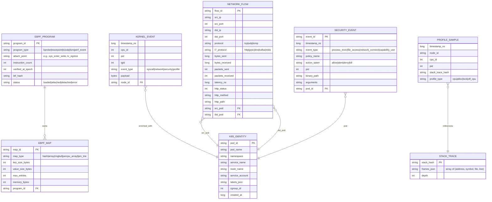

# Low-Level Design — eBPF-based Observability Platform

## Data Model

### Core Entities



### eBPF Map Schemas (In-Kernel Data Structures)

#### Connection Tracking Map

```
Map Type: BPF_MAP_TYPE_HASH
Key Size: 16 bytes
Value Size: 64 bytes
Max Entries: 262,144 (per node)

Key (connection_key):
  src_ip:     4 bytes (u32, network byte order)
  dst_ip:     4 bytes
  src_port:   2 bytes (u16)
  dst_port:   2 bytes
  protocol:   1 byte  (TCP=6, UDP=17)
  _padding:   3 bytes

Value (connection_info):
  request_ts:      8 bytes (u64, kernel timestamp ns)
  response_ts:     8 bytes
  bytes_sent:      8 bytes (u64)
  bytes_received:  8 bytes
  packets_sent:    4 bytes (u32)
  packets_received:4 bytes
  http_status:     2 bytes (u16)
  l7_protocol:     1 byte  (enum: HTTP=1, gRPC=2, DNS=3, ...)
  flags:           1 byte  (bit flags: request_seen, response_seen, ...)
  src_cgroup_id:   8 bytes (u64, for K8s identity lookup)
  dst_cgroup_id:   8 bytes
  _reserved:       4 bytes
```

#### PID-to-Pod Identity Map

```
Map Type: BPF_MAP_TYPE_HASH
Key Size: 4 bytes (pid as u32)
Value Size: 128 bytes
Max Entries: 65,536

Value (pod_identity):
  pod_name:        64 bytes (null-terminated string)
  namespace:       32 bytes
  service_name:    32 bytes
```

#### Security Policy Map

```
Map Type: BPF_MAP_TYPE_HASH
Key Size: 256 bytes (binary_path as string)
Value Size: 16 bytes
Max Entries: 4,096

Value (policy_decision):
  action:          1 byte (ALLOW=0, ALERT=1, DENY=2, KILL=3)
  policy_id:       4 bytes (u32)
  match_flags:     1 byte (bit flags: exact_match, prefix_match, ...)
  _padding:        2 bytes
  audit_counter:   8 bytes (per-CPU atomic, for rate limiting alerts)
```

---

## API Design

### Agent-to-Collector gRPC API

```
Service: ObservabilityCollector

RPC: StreamEvents
  Request (stream): EventBatch
    - node_id: string
    - batch_id: string (for deduplication)
    - events: repeated Event
    - compression: enum (NONE, ZSTD, LZ4)
    - timestamp_range: TimeRange
  Response: StreamAck
    - batch_id: string
    - accepted_count: int
    - back_pressure_signal: enum (NONE, SLOW_DOWN, PAUSE)

RPC: StreamProfiles
  Request (stream): ProfileBatch
    - node_id: string
    - profile_type: enum (CPU, ALLOC, LOCK, OFF_CPU)
    - samples: repeated ProfileSample
    - stack_traces: map<string, StackTrace>  (hash → frames)
  Response: ProfileAck
    - batch_id: string
    - accepted: bool

RPC: ReportAgentStatus
  Request: AgentStatus
    - node_id: string
    - loaded_programs: repeated ProgramStatus
    - map_memory_bytes: int64
    - ring_buffer_drops: int64
    - events_per_second: float
    - kernel_version: string
    - btf_available: bool
  Response: AgentDirective
    - programs_to_load: repeated ProgramSpec
    - programs_to_unload: repeated string
    - sampling_rate_override: float (0.0 = no override)
```

### Query API (Dashboard / External Consumers)

```
Service: ObservabilityQuery

RPC: QueryMetrics
  Request: MetricQuery
    - query: string (PromQL-compatible)
    - time_range: TimeRange
    - step: Duration
    - filters: map<string, string> (namespace, pod, service)
  Response: MetricResult
    - series: repeated TimeSeries

RPC: QueryFlows
  Request: FlowQuery
    - source_filter: IdentityFilter (namespace, pod, labels)
    - destination_filter: IdentityFilter
    - protocol_filter: repeated string (http, grpc, dns)
    - time_range: TimeRange
    - aggregation: enum (NONE, BY_SERVICE, BY_POD, BY_ENDPOINT)
    - limit: int
  Response: FlowResult
    - flows: repeated AggregatedFlow

RPC: QueryTraces
  Request: TraceQuery
    - trace_id: string (optional, for direct lookup)
    - service_filter: string
    - min_duration_ms: int
    - status_filter: enum (ALL, ERROR, SLOW)
    - time_range: TimeRange
    - limit: int
  Response: TraceResult
    - traces: repeated Trace
    - spans: repeated Span

RPC: QueryProfiles
  Request: ProfileQuery
    - service_filter: string
    - pod_filter: string
    - profile_type: enum (CPU, ALLOC, LOCK, OFF_CPU)
    - time_range: TimeRange
    - diff_base_range: TimeRange (optional, for differential flame graphs)
  Response: ProfileResult
    - flame_graph: FlameGraph
    - total_samples: int64
    - top_functions: repeated FunctionSummary

RPC: QuerySecurityEvents
  Request: SecurityQuery
    - event_type_filter: repeated string
    - action_filter: repeated string (allow, alert, deny, kill)
    - pod_filter: IdentityFilter
    - time_range: TimeRange
    - limit: int
  Response: SecurityResult
    - events: repeated SecurityEvent
    - policy_hit_counts: map<string, int64>
```

### Idempotency Handling

- **Event deduplication**: Each `EventBatch` carries a `batch_id` (composed of `node_id + sequence_number`). The collector maintains a sliding window of seen batch IDs (last 5 minutes) in a Bloom filter, with a backing hash set for false-positive resolution. Duplicate batches receive an ACK without re-processing.
- **Profile deduplication**: Stack trace hashes ensure the same trace is stored once regardless of how many times it appears across batches.
- **Security event guarantee**: Security events use a separate high-priority stream with explicit ACK. Unacknowledged events are retransmitted with exponential backoff.

### Rate Limiting

| Endpoint | Rate Limit | Strategy |
|----------|-----------|----------|
| StreamEvents | 100K events/sec per node | Token bucket with burst allowance (2x sustained rate) |
| StreamProfiles | 10K samples/sec per node | Fixed window; excess samples are downsampled |
| QueryMetrics | 100 queries/sec per user | Sliding window with complexity weighting |
| QueryFlows | 50 queries/sec per user | Sliding window |
| QuerySecurityEvents | 200 queries/sec per user | Token bucket (security events are high priority) |

---

## Core Algorithms

### Algorithm 1: In-Kernel HTTP Protocol Detection and Parsing

**Purpose:** Detect HTTP/1.1 requests and responses in TCP payload and extract method, path, and status code — entirely within eBPF (no user-space round-trip).

```
FUNCTION detect_and_parse_http(skb, payload_offset):
    // Read first 8 bytes of TCP payload
    data = skb_load_bytes(skb, payload_offset, 8)

    // HTTP request detection: check for method signatures
    IF data[0:3] == "GET" AND data[3] == ' ':
        method = HTTP_GET
        path_start = 4
    ELSE IF data[0:4] == "POST" AND data[4] == ' ':
        method = HTTP_POST
        path_start = 5
    ELSE IF data[0:3] == "PUT" AND data[3] == ' ':
        method = HTTP_PUT
        path_start = 4
    ELSE IF data[0:4] == "HTTP":
        // This is a response: "HTTP/1.1 200 OK"
        RETURN parse_http_response(skb, payload_offset)
    ELSE:
        RETURN PROTOCOL_UNKNOWN

    // Extract path (bounded loop for verifier)
    path_buf = ARRAY[128]
    FOR i = 0 TO 127:  // Fixed upper bound required by verifier
        byte = skb_load_byte(skb, payload_offset + path_start + i)
        IF byte == ' ' OR byte == '?' OR byte == '\0':
            path_buf[i] = '\0'
            BREAK
        path_buf[i] = byte

    // Store in connection map for later correlation with response
    key = extract_connection_key(skb)
    value = {
        request_ts: bpf_ktime_get_ns(),
        method: method,
        path: path_buf,
        path_len: i
    }
    bpf_map_update_elem(connection_map, key, value, BPF_ANY)

    RETURN HTTP_REQUEST_PARSED


FUNCTION parse_http_response(skb, payload_offset):
    // Parse "HTTP/1.1 XXX" — extract 3-digit status code
    status_hundreds = skb_load_byte(skb, payload_offset + 9) - '0'
    status_tens     = skb_load_byte(skb, payload_offset + 10) - '0'
    status_ones     = skb_load_byte(skb, payload_offset + 11) - '0'

    IF status_hundreds < 1 OR status_hundreds > 5:
        RETURN PROTOCOL_UNKNOWN

    status_code = status_hundreds * 100 + status_tens * 10 + status_ones

    // Correlate with stored request
    key = extract_reverse_connection_key(skb)  // Swap src/dst
    request = bpf_map_lookup_elem(connection_map, key)

    IF request IS NOT NULL:
        latency_ns = bpf_ktime_get_ns() - request.request_ts
        event = {
            type: EVENT_HTTP,
            method: request.method,
            path: request.path,
            status_code: status_code,
            latency_ns: latency_ns,
            src_cgroup: get_cgroup_id(),
            dst_cgroup: request.dst_cgroup
        }
        bpf_ringbuf_output(ring_buffer, event, sizeof(event), 0)
        bpf_map_delete_elem(connection_map, key)

    RETURN HTTP_RESPONSE_PARSED
```

**Complexity:** O(1) for detection, O(n) for path extraction where n is bounded at 128 characters. Total per-packet cost: ~200ns.

### Algorithm 2: CPU Stack Trace Sampling and Aggregation

**Purpose:** Sample CPU stack traces at 19 Hz and aggregate identical traces in-kernel using stack trace hashing to reduce user-space transfer volume by 100-1000x.

```
FUNCTION on_perf_event(ctx):  // Attached to perf_event (CPU cycles, 19 Hz)
    pid = bpf_get_current_pid_tgid() >> 32

    // Skip kernel threads and idle
    IF pid == 0:
        RETURN 0

    // Capture kernel + user stack traces
    kernel_stack_id = bpf_get_stackid(ctx, kernel_stack_map, 0)
    user_stack_id   = bpf_get_stackid(ctx, user_stack_map, BPF_F_USER_STACK)

    // Create composite key: (pid, kernel_stack_id, user_stack_id)
    key = {
        pid: pid,
        kernel_stack_id: kernel_stack_id,
        user_stack_id: user_stack_id
    }

    // Increment count in per-CPU hash map (no lock contention)
    count = bpf_map_lookup_elem(profile_counts, key)
    IF count IS NOT NULL:
        *count += 1  // Atomic per-CPU increment
    ELSE:
        initial = 1
        bpf_map_update_elem(profile_counts, key, initial, BPF_NOEXIST)

    RETURN 0


// User-space periodic flush (every 10 seconds)
FUNCTION flush_profiles():
    FOR EACH (key, count) IN profile_counts:
        // Resolve stack trace symbols from stack_map
        kernel_frames = resolve_stack(kernel_stack_map, key.kernel_stack_id)
        user_frames   = resolve_stack(user_stack_map, key.user_stack_id)

        // Emit aggregated profile sample
        sample = {
            pid: key.pid,
            kernel_frames: kernel_frames,
            user_frames: user_frames,
            count: count,
            timestamp: current_time()
        }
        send_to_collector(sample)

    // Clear maps for next interval
    clear_map(profile_counts)
    // Note: stack_maps are cleared by bpf_get_stackid when full (LRU behavior)
```

**Complexity:** O(1) per sample (hash map lookup + increment). User-space flush is O(unique_stacks) which is typically 1,000-10,000 per 10-second interval — far less than the 190 raw samples/sec × 10s = 1,900 raw events.

### Algorithm 3: Security Policy Evaluation with Tail Call Chaining

**Purpose:** Evaluate multi-stage security policies using eBPF tail calls to chain policy evaluations without exceeding the instruction limit in a single program.

```
// Program 0: Entry point — attached to LSM hook (e.g., bprm_check_security)
FUNCTION security_entry(ctx):
    // Extract process info
    binary_path = bpf_get_current_comm()  // 16 bytes
    full_path = read_file_path(ctx)       // From LSM context
    pid = bpf_get_current_pid_tgid() >> 32

    // Stage 1: Fast path — check binary allowlist
    policy = bpf_map_lookup_elem(binary_allowlist, full_path)
    IF policy IS NOT NULL AND policy.action == ALLOW:
        emit_audit_event(ctx, ALLOW, "allowlist_match")
        RETURN LSM_ALLOW

    // Stage 2: Check binary denylist
    policy = bpf_map_lookup_elem(binary_denylist, full_path)
    IF policy IS NOT NULL AND policy.action == DENY:
        emit_audit_event(ctx, DENY, "denylist_match")
        RETURN LSM_DENY

    // Stage 3: Complex policy — tail call to next program
    // Store context in per-CPU scratch map for tail call chain
    scratch = bpf_map_lookup_elem(percpu_scratch, 0)
    IF scratch IS NOT NULL:
        scratch.pid = pid
        scratch.path = full_path
        scratch.stage = STAGE_NAMESPACE_CHECK

    bpf_tail_call(ctx, prog_array, PROGRAM_NAMESPACE_CHECK)

    // Tail call failed (program not loaded) — default allow
    RETURN LSM_ALLOW


// Program 1: Namespace-based policy check
FUNCTION namespace_policy_check(ctx):
    scratch = bpf_map_lookup_elem(percpu_scratch, 0)
    IF scratch IS NULL:
        RETURN LSM_ALLOW

    // Get cgroup ID → pod namespace
    cgroup_id = bpf_get_current_cgroup_id()
    identity = bpf_map_lookup_elem(cgroup_to_namespace, cgroup_id)

    IF identity IS NOT NULL:
        // Check namespace-specific policy
        ns_policy = bpf_map_lookup_elem(namespace_policies, identity.namespace)
        IF ns_policy IS NOT NULL:
            IF ns_policy.deny_binary_execution:
                emit_audit_event(ctx, DENY, "namespace_policy")
                RETURN LSM_DENY

    // Continue to next stage
    scratch.stage = STAGE_CAPABILITY_CHECK
    bpf_tail_call(ctx, prog_array, PROGRAM_CAPABILITY_CHECK)

    RETURN LSM_ALLOW
```

**Complexity:** O(1) per stage (hash map lookups). Tail call chain depth is bounded (max 33 tail calls). Total policy evaluation: <5μs for 3-stage chain.

### Algorithm 4: Ring Buffer Back-Pressure with Adaptive Sampling

**Purpose:** Prevent ring buffer overflow under burst load by dynamically adjusting the sampling rate based on ring buffer fill level.

```
FUNCTION adaptive_sample_check(event_type):
    // Read ring buffer fill level from per-CPU stats map
    stats = bpf_map_lookup_percpu_elem(stats_map, RINGBUF_STATS_KEY)
    IF stats IS NULL:
        RETURN SAMPLE  // Default to sampling if stats unavailable

    // Calculate fill ratio (updated by user-space agent periodically)
    fill_ratio = stats.ring_buf_used / stats.ring_buf_size

    // Tiered sampling based on fill level
    IF fill_ratio < 0.5:
        RETURN SAMPLE  // Normal: capture everything

    IF fill_ratio < 0.75:
        // Moderate pressure: sample non-critical events
        IF event_type == EVENT_NETWORK_FLOW:
            // Sample 50% using hash of connection key
            hash = bpf_get_prandom_u32()
            IF hash % 2 == 0:
                RETURN DROP
        RETURN SAMPLE

    IF fill_ratio < 0.9:
        // High pressure: aggressive sampling
        IF event_type == EVENT_NETWORK_FLOW:
            // Sample 10%
            IF bpf_get_prandom_u32() % 10 != 0:
                RETURN DROP
        IF event_type == EVENT_SYSCALL_TRACE:
            // Sample 25%
            IF bpf_get_prandom_u32() % 4 != 0:
                RETURN DROP
        RETURN SAMPLE  // Always keep security events

    // Critical pressure (>90%): only security events
    IF event_type == EVENT_SECURITY:
        RETURN SAMPLE
    RETURN DROP


// Usage in eBPF program:
FUNCTION on_syscall_enter(ctx):
    IF adaptive_sample_check(EVENT_SYSCALL_TRACE) == DROP:
        // Increment drop counter (always, for observability)
        increment_percpu_counter(dropped_events_counter)
        RETURN 0

    // ... normal event processing ...
```

**Complexity:** O(1) per event. The sampling decision adds ~10ns overhead per event.

---

## Indexing Strategy

| Data Type | Primary Index | Secondary Indices | Partitioning |
|-----------|--------------|-------------------|-------------|
| Network Flows | (timestamp, flow_id) | (src_service, dst_service), (l7_protocol, http_status), (namespace) | Time-based (hourly buckets) |
| Security Events | (timestamp, event_id) | (event_type, action), (policy_name), (pod_id) | Time-based (hourly) + action-based (deny events in hot tier) |
| Profile Samples | (timestamp, node_id) | (pid, profile_type), (stack_hash) | Time-based (10-minute buckets) |
| Trace Spans | (trace_id, span_id) | (service_name, operation), (duration), (status) | Time-based (hourly) + trace_id hash |
| K8s Identity | (pod_id) | (namespace, pod_name), (cgroup_id), (node_name) | None (small dataset, fully cached) |

## Data Retention Policy

| Tier | Duration | Storage | Resolution |
|------|----------|---------|------------|
| Hot | 3 days | SSD-backed time-series DB | Full resolution |
| Warm | 30 days | Compressed columnar storage | 1-minute aggregation for metrics; sampled events |
| Cold | 1 year | Object storage | 5-minute aggregation; security events only at full resolution |
| Archive | 7 years (compliance) | Object storage (immutable) | Security audit events only |

---

## Additional eBPF Map Schemas

### Per-CPU Ring Buffer Stats Map

```
Map Type: BPF_MAP_TYPE_PERCPU_ARRAY
Key Size: 4 bytes (u32 index)
Value Size: 32 bytes
Max Entries: 8 (one per ring buffer class + global stats)

Value (ringbuf_stats):
  ring_buf_used:     8 bytes (u64, bytes currently in buffer)
  ring_buf_size:     8 bytes (u64, total buffer capacity)
  events_submitted:  8 bytes (u64, cumulative events submitted)
  events_dropped:    8 bytes (u64, cumulative events dropped due to full buffer)
```

### Tail Call Program Array

```
Map Type: BPF_MAP_TYPE_PROG_ARRAY
Key Size: 4 bytes (u32 program index)
Value Size: 4 bytes (u32 program fd)
Max Entries: 33 (maximum tail call chain depth)

Slot Allocation:
  0:  Protocol classifier (entry point)
  1:  HTTP/1.1 parser
  2:  HTTP/2 parser (HPACK header decoding)
  3:  gRPC parser (protobuf framing)
  4:  DNS parser
  5:  Kafka parser
  6:  MySQL parser
  7:  PostgreSQL parser
  8:  Redis parser
  9:  TLS uprobe handler
  10: Security policy evaluator stage 1 (binary allowlist)
  11: Security policy evaluator stage 2 (namespace check)
  12: Security policy evaluator stage 3 (capability check)
  13-20: Reserved for future protocols
  21-33: Reserved for custom user-defined programs
```

### Connection State Machine Map

```
Map Type: BPF_MAP_TYPE_LRU_HASH
Key Size: 16 bytes (same connection_key as connection tracking)
Value Size: 48 bytes
Max Entries: 131,072 (LRU eviction when full)

Value (connection_state):
  state:             1 byte (enum: SYN_SENT, ESTABLISHED, FIN_WAIT, CLOSED)
  l7_state:          1 byte (enum: DETECTING, REQUEST_PARTIAL, REQUEST_COMPLETE, RESPONSE_PARTIAL)
  protocol_detected: 1 byte (enum: UNKNOWN, HTTP1, HTTP2, GRPC, DNS, ...)
  confidence:        1 byte (0-100, protocol detection confidence)
  request_bytes:     4 bytes (u32, bytes seen in current request)
  partial_buf:       32 bytes (buffer for multi-packet reassembly, first 32 bytes only)
  last_activity_ns:  8 bytes (u64, for LRU and timeout tracking)
```

---

## Algorithm 5: TLS Traffic Observation via Library Uprobes

**Purpose:** Capture plaintext HTTP data from TLS-encrypted connections by hooking into the crypto library's read/write functions before encryption and after decryption.

```
// Attach to OpenSSL's SSL_write — captures plaintext before encryption
FUNCTION on_ssl_write_entry(ctx):
    ssl_ptr = PT_REGS_PARM1(ctx)  // SSL* ssl
    buf_ptr = PT_REGS_PARM2(ctx)  // const void* buf
    num     = PT_REGS_PARM3(ctx)  // int num (bytes to write)

    pid = bpf_get_current_pid_tgid()

    // Store parameters for retrieval in return probe
    write_args = {
        ssl: ssl_ptr,
        buf: buf_ptr,
        num: MIN(num, MAX_CAPTURE_SIZE)  // Bounded capture
    }
    bpf_map_update_elem(active_ssl_writes, pid, write_args, BPF_ANY)
    RETURN 0

FUNCTION on_ssl_write_return(ctx):
    pid = bpf_get_current_pid_tgid()
    args = bpf_map_lookup_elem(active_ssl_writes, pid)
    IF args IS NULL:
        RETURN 0

    bytes_written = PT_REGS_RC(ctx)  // Return value = bytes written
    IF bytes_written <= 0:
        bpf_map_delete_elem(active_ssl_writes, pid)
        RETURN 0

    // Capture plaintext (before encryption)
    capture_size = MIN(bytes_written, MAX_CAPTURE_SIZE)
    event = bpf_ringbuf_reserve(tls_ringbuf, sizeof(header) + capture_size, 0)
    IF event IS NOT NULL:
        event.pid = pid >> 32
        event.direction = TLS_WRITE
        event.size = capture_size
        event.timestamp = bpf_ktime_get_ns()
        bpf_probe_read_user(event.data, capture_size, args.buf)
        bpf_ringbuf_submit(event, 0)

    bpf_map_delete_elem(active_ssl_writes, pid)
    RETURN 0

// Similar probes for SSL_read (captures plaintext after decryption)
// Also support: GnuTLS gnutls_record_send/recv, BoringSSL
```

**Challenge:** Library detection. The agent must discover which crypto library each process uses:
- Check `/proc/<pid>/maps` for loaded shared libraries (`libssl.so`, `libgnutls.so`)
- For statically linked Go binaries: scan the ELF symbol table for `crypto/tls.(*Conn).Write`
- For Java: attach to JNI functions that wrap native TLS calls

---

## Algorithm 6: Cgroup-Based Per-Pod Event Rate Limiting

**Purpose:** Prevent noisy pods from monopolizing ring buffer capacity by enforcing per-cgroup event rate limits directly in eBPF.

```
// Rate limit map: per-cgroup token bucket
Map Type: BPF_MAP_TYPE_HASH
Key: cgroup_id (u64)
Value: rate_limit_state { tokens: u32, last_refill_ns: u64, limit: u32 }

FUNCTION check_rate_limit(cgroup_id, event_type):
    state = bpf_map_lookup_elem(rate_limit_map, cgroup_id)

    IF state IS NULL:
        // First event from this cgroup: initialize with default budget
        new_state = {
            tokens: DEFAULT_TOKENS_PER_SEC,  // e.g., 10,000
            last_refill_ns: bpf_ktime_get_ns(),
            limit: DEFAULT_TOKENS_PER_SEC
        }
        bpf_map_update_elem(rate_limit_map, cgroup_id, new_state, BPF_NOEXIST)
        RETURN ALLOW

    // Refill tokens based on elapsed time
    now = bpf_ktime_get_ns()
    elapsed_ns = now - state.last_refill_ns
    tokens_to_add = (elapsed_ns * state.limit) / 1_000_000_000  // tokens per second
    state.tokens = MIN(state.tokens + tokens_to_add, state.limit)
    state.last_refill_ns = now

    // Security events bypass rate limit
    IF event_type == EVENT_SECURITY:
        RETURN ALLOW

    // Consume a token
    IF state.tokens > 0:
        state.tokens -= 1
        RETURN ALLOW
    ELSE:
        INCREMENT(rate_limited_counter[cgroup_id])
        RETURN DROP
```

---

## Indexing Strategy Details

### Time-Series Metrics Indexing

```
Write-Path Index:
  Primary: (metric_name_hash, label_set_hash, timestamp_bucket)
  Purpose: Fast write routing to the correct shard and time partition

  Shard selection: metric_name_hash % NUM_SHARDS
  Time partition:  floor(timestamp / PARTITION_INTERVAL)  // 2-hour buckets

Read-Path Index:
  Inverted index: label_value → set of (metric_name, label_set_hash)
  Purpose: PromQL label matchers (e.g., namespace="production") resolve
           to the set of affected time series before scanning data

  Bloom filter: per-partition bloom filter for metric_name membership
  Purpose: Skip partitions that definitely don't contain the queried metric
```

### Trace Store Indexing

```
Primary index: trace_id → (shard_id, partition, offset)
  Uses: Direct trace lookup (most common query pattern)
  Sharding: trace_id_hash % NUM_SHARDS (all spans of a trace on same shard)

Secondary indices:
  (service_name, timestamp) → list of trace_ids
  (status_code, timestamp) → list of trace_ids  (for error trace queries)
  (duration_bucket, timestamp) → list of trace_ids  (for slow trace queries)

  Bucket strategy for duration:
    <10ms, 10-50ms, 50-100ms, 100-500ms, 500ms-1s, 1-5s, >5s
```

### Security Event Indexing

```
Primary index: (event_id, timestamp)
  Append-only, immutable after write

Secondary indices:
  (event_type, action, timestamp) → event_ids
  (policy_name, timestamp) → event_ids
  (pod_id, timestamp) → event_ids
  (binary_path_hash, timestamp) → event_ids

  Compliance index: (timestamp, event_hash)
  Purpose: Cryptographic chain for tamper evidence
  Each event_hash = SHA-256(event_data || previous_event_hash)
  Enables verification that no events were inserted, modified, or deleted
```

---

## ConnectorAdapter Interface (Agent Plugin System)

```
Interface: ProgramProvider

FUNCTION get_programs() → List<ProgramSpec>
  // Returns the list of eBPF programs this provider wants to load
  // Each ProgramSpec includes: ELF object bytes, attach point, priority, fallback variants

FUNCTION get_maps() → List<MapSpec>
  // Returns the list of maps this provider needs created
  // Maps may be shared with other providers (e.g., connection tracking map)

FUNCTION on_event(event: KernelEvent) → ProcessingResult
  // Called by the agent when an event from this provider's programs arrives
  // Provider enriches, filters, and transforms the event for downstream consumption

FUNCTION on_map_update(map_id: string, key: bytes, value: bytes)
  // Called when the agent needs to update a map owned by this provider
  // Used for user-space → kernel communication (e.g., policy updates)

FUNCTION get_feature_requirements() → List<FeatureProbe>
  // Returns the kernel features this provider requires
  // Agent runs feature probes at startup and only loads providers whose requirements are met

FUNCTION get_metrics() → List<MetricDefinition>
  // Returns the metrics this provider exposes for meta-monitoring
```

**Usage:** Third-party protocol support can be implemented as a ProgramProvider plugin. The agent loads the provider, runs its feature probes, creates its maps, loads its eBPF programs, and routes events to its `on_event` handler. This enables extensibility without modifying the core agent code.
