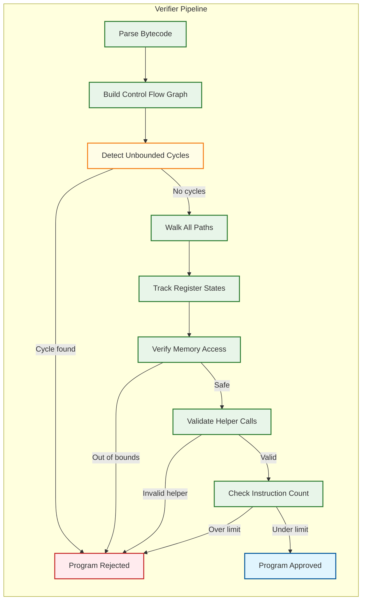

# Deep Dive & Bottlenecks — eBPF-based Observability Platform

## Critical Component 1: The eBPF Verifier — The Gatekeeper That Shapes Architecture

### Why It Is Critical

The eBPF verifier is the single most architecturally significant component in the entire platform. Every design decision — how protocol parsers are structured, how policies are evaluated, how data flows from kernel to user space — is constrained by what the verifier will accept. Unlike traditional software where you write code and handle errors at runtime, eBPF programs that fail verification simply do not load. The verifier is not a nice-to-have safety check; it is a hard compile-time gate that shapes the entire system architecture.

### How It Works Internally

The verifier performs a full static analysis of the eBPF bytecode before allowing it to execute in kernel context:

1. **DAG Construction:** The verifier builds a directed acyclic graph (DAG) of all possible execution paths. Any cycle that cannot be proven to terminate (unbounded loops) causes immediate rejection.

2. **State Tracking Per Path:** For each path through the program, the verifier tracks the state of all 10 registers (R0-R9) and the 512-byte stack. It knows whether each register holds a scalar value, a pointer to a map value, a pointer to the stack, a context pointer, or is uninitialized.

3. **Memory Safety Verification:** Every memory access is checked:
   - Pointer arithmetic must be within bounds
   - Map lookups return nullable pointers — the program must check for NULL before dereferencing
   - Stack accesses must be within the 512-byte limit
   - Context (ctx) access must be within the allowed range for the program type

4. **Helper Function Validation:** Each `bpf_helper_call` is validated against an allowlist for the program type. For example, `bpf_probe_read_kernel()` is allowed in kprobes but not in XDP programs.

5. **Instruction Limit Check:** The verifier counts the total number of instructions it must analyze across all paths. Prior to kernel 5.2, this limit was 4,096 instructions. Since kernel 5.2, it is 1 million verified instructions — but complex programs with many branches can cause exponential path explosion, hitting the limit even with modest source code.



### Failure Modes

| Failure | Cause | Impact |
|---------|-------|--------|
| **Instruction limit exceeded** | Complex protocol parser with many branches | Program cannot load; observability gap for that protocol |
| **Stack overflow** | Deep function nesting or large local variables | Program rejected; must refactor to use maps for large state |
| **Unbounded loop detected** | Loop without provable upper bound | Program rejected; must use `#pragma unroll` or bounded loop idiom |
| **Type mismatch** | Passing map value pointer where scalar expected | Program rejected; must add explicit casts or restructure |
| **Verifier OOM** | Extreme path explosion in complex programs | Verifier itself runs out of memory during analysis; program rejected |
| **Kernel version incompatibility** | Using helper not available in target kernel | Program fails to load on older kernels; must use CO-RE feature detection |

### How We Handle Failures

1. **Tail Call Decomposition:** Split complex programs into smaller programs chained via `bpf_tail_call()`. Each sub-program passes verification independently, and the chain provides the full logic. Maximum chain depth: 33 tail calls.

2. **Graduated Complexity:** Ship multiple variants of each eBPF program: a "full" version that uses advanced features, a "reduced" version with fewer protocol parsers, and a "minimal" version that captures only basic syscall events. The agent tries to load the full version; if verification fails, it falls back to reduced, then minimal.

3. **Verifier Log Analysis:** When verification fails, the verifier emits a detailed log explaining which instruction on which path failed. The agent captures this log and reports it as a structured error event, enabling operators to diagnose compatibility issues.

4. **Feature Probing:** Before loading programs, the agent probes for specific kernel features (BTF availability, ring buffer support, specific helper functions) by attempting to load minimal test programs. This builds a capability matrix that determines which program variants to load.

---

## Critical Component 2: Ring Buffer Back-Pressure and Event Ordering

### Why It Is Critical

The ring buffer is the sole conduit between the kernel data plane and user-space processing. Its behavior under load determines whether the platform degrades gracefully (sampling) or fails catastrophically (silent event loss). At 500K events/sec per node, the ring buffer must handle 4 GB/sec of event throughput with sub-microsecond per-event overhead.

### How It Works Internally

The BPF ring buffer (`BPF_MAP_TYPE_RINGBUF`, Linux 5.8+) is a multi-producer, single-consumer (MPSC) circular buffer:

1. **Reserve-Commit Protocol:**
   - Producer (eBPF program) calls `bpf_ringbuf_reserve(rb, size, 0)` to atomically reserve space
   - If space is available, returns a pointer to the reserved region
   - If buffer is full, returns NULL (event must be dropped)
   - Producer writes data to the reserved region
   - Producer calls `bpf_ringbuf_submit(data, 0)` to make the event visible to the consumer
   - Alternative: `bpf_ringbuf_discard(data, 0)` to release without submitting

2. **Atomic Ordering:** The reserve operation uses a compare-and-swap (CAS) on the producer position. Multiple CPUs can reserve concurrently. The consumer position advances only when all events up to that position have been committed (no holes).

3. **Memory Layout:** The buffer is backed by a contiguous memory region mapped as 2× the logical size (the second half is a mirror of the first) to avoid wrap-around checks during writes.

4. **Notification:** The consumer is notified via an epoll fd when new events are committed. The `BPF_RB_FORCE_WAKEUP` flag forces immediate notification; `BPF_RB_NO_WAKEUP` skips it (useful for batching).

### Failure Modes

| Failure | Cause | Symptom | Impact |
|---------|-------|---------|--------|
| **Buffer full** | Consumer too slow; burst of events exceeds capacity | `bpf_ringbuf_reserve()` returns NULL | Events silently dropped; drop counter increments |
| **Consumer stall** | Agent GC pause, CPU contention, or bug | Buffer fills, all new events dropped | Total observability blackout until consumer resumes |
| **Ordering anomaly** | Event reserved on CPU 0 but committed after CPU 1's event | Events appear out-of-order within the same ring buffer | Mild — user-space sort-merge within timestamp window fixes this |
| **Memory pressure** | Ring buffer mapped memory competes with application workloads | OOM killer may target the agent process | Ring buffer persists in kernel; agent restart recovers it |

### How We Handle Failures

1. **Adaptive Sampling (In-Kernel):** As described in Algorithm 4 (Low-Level Design), the eBPF programs monitor ring buffer fill level via a per-CPU stats map updated by the user-space agent. When fill exceeds 50%, non-critical events are sampled; above 90%, only security events pass.

2. **Prioritized Event Channels:** Critical events (security policy violations, enforcement actions) use a separate ring buffer with its own memory allocation. This ensures security observability is never sacrificed for high-volume network flow data.

3. **Consumer Parallelism:** The user-space agent runs multiple consumer threads — but the ring buffer is single-consumer. The solution is to use multiple ring buffers (one per event class) with a dedicated consumer thread per buffer.

4. **Ring Buffer Sizing:** Default ring buffer size is 64 MB per event class. For high-throughput nodes (>100K events/sec), auto-scale to 256 MB. The formula: `buffer_size = events_per_sec × avg_event_size × target_drain_interval × safety_factor` where target_drain_interval = 2 seconds and safety_factor = 4.

---

## Critical Component 3: Protocol Parsing Under Verifier Constraints

### Why It Is Critical

The zero-instrumentation promise depends on parsing application-layer protocols (HTTP, gRPC, DNS, Kafka, etc.) in kernel space. This is where the verifier's constraints are most acutely felt: protocol parsing inherently requires variable-length string processing, branching on dynamic content, and stateful tracking across packets — all things the verifier makes difficult.

### How It Works Internally

Protocol parsing in eBPF uses a combination of techniques:

1. **Signature-Based Detection:** Read the first few bytes of the TCP payload and match against known protocol signatures:
   - HTTP/1.x: `"GET "`, `"POST"`, `"PUT "`, `"HTTP"`
   - HTTP/2: Connection preface `"PRI * HTTP/2.0\r\n\r\nSM\r\n\r\n"`
   - gRPC: HTTP/2 with `content-type: application/grpc`
   - DNS: UDP port 53 with valid header structure
   - Kafka: API key in first 2 bytes with valid request structure

2. **Bounded Parsing:** All string/buffer operations use fixed upper bounds:
   ```
   // Verifier-safe bounded copy
   FOR i = 0 TO MAX_PATH_LENGTH - 1:
       IF offset + i >= payload_end:
           BREAK
       buf[i] = payload[offset + i]
       IF buf[i] == delimiter:
           BREAK
   ```

3. **Stateful Tracking via Maps:** Multi-packet protocols (HTTP/2 streams, gRPC calls) require state across packets. The connection tracking map stores per-connection state keyed by the 5-tuple, enabling correlation between request and response packets.

4. **TLS Inspection Without Decryption:** For encrypted traffic, the platform hooks into the kernel TLS layer (kTLS) or traces OpenSSL/BoringSSL library calls via uprobes to capture plaintext before encryption and after decryption — without breaking the TLS session.

### Key Challenges

| Challenge | Constraint | Solution |
|-----------|-----------|----------|
| **Variable-length headers** | Cannot use while loops to scan for `\r\n` | Unrolled fixed-bound loops (parse up to 128 bytes) |
| **Multi-packet requests** | eBPF sees individual packets, not streams | Connection map stores partial parse state; reassemble across packets |
| **HTTP/2 multiplexing** | Multiple streams in one connection; HPACK header compression | Track stream state per (connection, stream_id); limited HPACK decoding (static table only) |
| **gRPC framing** | Protobuf-encoded payloads require variable-length integer decoding | Only extract metadata (method, status); skip protobuf body parsing |
| **DNS compression** | DNS name compression uses backward pointers | Follow up to 4 pointer hops (bounded); reject deeper compression |

### Failure Modes

| Failure | Cause | Impact |
|---------|-------|--------|
| **Protocol misclassification** | Ambiguous payload signatures (binary protocol resembling HTTP bytes) | Garbled metrics for misclassified connections; mitigated by confidence scoring |
| **Partial parse** | Request split across packet boundary; first packet too small for detection | Connection shows as "unknown protocol" until enough data arrives |
| **Verifier rejection** | Parser too complex for a specific kernel version | Fallback to simpler parser that extracts fewer fields |
| **State map exhaustion** | Too many concurrent connections for the map size | Oldest entries evicted (LRU); partial request-response correlation loss |

---

## Concurrency & Race Conditions

### Race 1: PID-to-Pod Map Update Race

**Scenario:** A pod starts (container runtime assigns PIDs), the K8s informer notifies the agent, and the agent updates the PID-to-Pod map. But eBPF programs may capture events from the new PIDs before the map is updated.

**Impact:** Events from newly-started pods show as "unknown pod" for a brief window (typically 100-500ms).

**Mitigation:**
- The agent watches cgroup events via `BPF_PROG_TYPE_CGROUP_DEVICE` to detect new cgroups immediately (faster than K8s informer)
- Cgroup-to-pod mapping uses cgroup IDs (stable, assigned by kernel) rather than PIDs
- Events with unknown identity are buffered in user space and retroactively enriched when the mapping becomes available

### Race 2: Security Policy Update vs. Event Evaluation

**Scenario:** The operator updates a security policy (e.g., deny execution of `/bin/curl`). The agent updates the policy map. But between the map update and the next event, a process may have already started executing.

**Impact:** A window of 1-10ms where the old policy is still enforced.

**Mitigation:**
- Policy map updates are atomic (single `bpf_map_update_elem` call)
- For critical policies, the agent first adds the deny entry, then removes any allow entry (deny-before-allow ordering)
- Accept the inherent race: eBPF operates at syscall granularity, not at instruction granularity. A process that started before the policy update completes its current syscall under the old policy; the next syscall is caught.

### Race 3: Ring Buffer Producer-Consumer Race

**Scenario:** An eBPF program reserves space in the ring buffer, but is preempted before calling `bpf_ringbuf_submit()`. The consumer sees a "hole" in the buffer.

**Impact:** The consumer cannot advance past the uncommitted entry, potentially stalling event delivery.

**Mitigation:**
- The kernel's ring buffer implementation handles this: the consumer waits for all entries up to the current position to be committed. Preempted producers complete their commit when rescheduled.
- If a producer is preempted for an extended period (rare: would require the CPU to be entirely consumed by higher-priority work), the ring buffer may appear "stuck" to the consumer. The user-space agent monitors ring buffer drain rate and alerts on stalls.

---

## Slowest part of the process Analysis

### Slowest part of the process 1: Map Lookup Contention on Hot Maps

**Description:** The connection tracking map is accessed by every network eBPF program on every packet. On a 32-core node processing 1M packets/sec, this map receives 1M lookups/sec — all serialized through the hash map's per-bucket spinlock.

**Impact:** Under high contention, map lookup latency increases from ~100ns to ~500ns-1μs, adding measurable overhead to packet processing.

**Mitigation Strategies:**
- **Per-CPU hash maps (`BPF_MAP_TYPE_PERCPU_HASH`):** Each CPU has its own copy of the map. Eliminates cross-CPU contention but increases memory by Nx and complicates cross-CPU connection tracking.
- **Lock-free LRU maps (`BPF_MAP_TYPE_LRU_HASH`):** Built-in LRU eviction with per-bucket locks. Better for connection tracking where old entries should be evicted.
- **Map sharding:** Use multiple smaller maps with a hash-based routing function to distribute load. E.g., 4 maps of 64K entries each instead of 1 map of 256K entries.
- **Chosen approach:** LRU hash map with map sharding (4 shards), reducing per-shard contention by 4x while maintaining bounded memory.

### Slowest part of the process 2: User-Space Event Processing Throughput

**Description:** The ring buffer consumer must deserialize, enrich (K8s metadata lookup), aggregate, and buffer events for forwarding. At 50K events/sec per node, the consumer has a budget of 20μs per event.

**Impact:** If processing exceeds 20μs/event average, the ring buffer fills and events are dropped.

**Mitigation Strategies:**
- **Batch processing:** Read events from the ring buffer in batches of 256-1024 using `ring_buffer__consume()`. Amortizes epoll/syscall overhead.
- **Zero-copy processing:** The ring buffer consumer receives a pointer to the kernel-mapped memory. Process events in-place without copying to a separate buffer.
- **Pre-computed enrichment:** The K8s metadata cache is a simple hash map (cgroup_id → pod_identity) kept in agent memory. Lookup is O(1) with no serialization.
- **Parallel aggregation:** Use lock-free concurrent data structures for metric aggregation. Multiple consumer threads for different ring buffers aggregate into per-thread accumulators that merge every flush interval.

### Slowest part of the process 3: Collector Ingestion Fan-In

**Description:** 1,000 nodes each pushing 5-50 MB/s of events to the central collector creates a fan-in of 5-50 GB/s aggregate bandwidth.

**Impact:** Collector becomes a Slowest part of the process if not horizontally scaled; network bandwidth between nodes and collector may saturate.

**Mitigation Strategies:**
- **Hierarchical collection:** Deploy regional collectors (1 per rack or availability zone) that aggregate and pre-process events before forwarding to the central collector. Reduces fan-in by 10-50x.
- **Edge aggregation:** Agents compute aggregated metrics (RED metrics per service pair, per minute) locally and send only aggregated counters, not raw events. Raw events are sent only for sampled traces and security events.
- **Protocol compression:** ZSTD compression on the gRPC stream reduces bandwidth by 5-10x for structured event data.
- **Flow control:** The collector's `StreamAck` includes a `back_pressure_signal`. When the collector is overloaded, agents reduce their sending rate and buffer locally (WAL-backed, up to 1 hour of events).

---

## Failure Mode Analysis

### Failure Mode 1: Verifier Regression After Kernel Upgrade

**Trigger:** Cluster rolling upgrade from kernel 5.15 → 6.1 introduces stricter verifier rules (e.g., tighter pointer arithmetic bounds).

**Symptom:** Agent logs show `BPF_PROG_LOAD` failure for previously-working protocol parser programs. Network L7 observability disappears on upgraded nodes while L3/L4 and syscall tracing continue.

**Impact Matrix:**

| Component | Impact | Severity |
|-----------|--------|----------|
| Network flow metrics | Unaffected (TC/XDP programs still load) | None |
| L7 protocol parsing | Protocol parser rejected; connections show as "unknown" | High |
| Security enforcement | LSM programs may have different verifier requirements | Variable |
| CPU profiling | perf_event programs typically simple enough to pass | Low |

**Recovery:**
```
FUNCTION handle_verifier_regression(program, error_log):
    // Step 1: Diagnose
    failed_instruction = parse_verifier_log(error_log)
    kernel_version = detect_kernel_version()

    // Step 2: Attempt fallback chain
    FOR variant IN [FULL, REDUCED, MINIMAL]:
        result = try_load_program(program.variant[variant], kernel_version)
        IF result.success:
            LOG_WARN("Loaded {variant} variant for {program.name}")
            EMIT_METRIC("verifier_fallback", variant=variant)
            RETURN result

    // Step 3: Report observability gap
    EMIT_ALERT("verifier_regression", program=program.name,
               kernel=kernel_version, error=failed_instruction)
    REGISTER_GAP(program.name, node_id, kernel_version)
    RETURN FAILURE
```

### Failure Mode 2: Ring Buffer Memory Exhaustion Under Sustained Burst

**Trigger:** A DDoS attack or flash crowd generates 10x normal event volume for >60 seconds, exceeding the ring buffer's capacity even with adaptive sampling.

**Symptom:** `bpf_ringbuf_reserve()` returns NULL for all event types including security events. Drop counters spike. Adaptive sampling reaches maximum (95% drop) but volume still exceeds capacity.

**Cascading Effects:**
1. Non-critical events dropped (expected)
2. Security event ring buffer fills if security event volume also spikes
3. Agent consumer falls behind → GC pressure increases → consumer further slows
4. Agent WAL buffer fills → agent memory pressure → OOM risk

**Recovery:**
```
FUNCTION emergency_ring_buffer_protocol():
    // Phase 1: Engage emergency sampling (kernel-side)
    SET_SAMPLING_RATE(security=100%, network=1%, syscall=0.1%, profile=OFF)

    // Phase 2: Flush ring buffer backlog
    WHILE ring_buffer.fill_ratio > 0.5:
        batch = ring_buffer.consume(max_batch=4096)
        IF batch.has_security_events:
            FORWARD_IMMEDIATELY(batch.security_events)
        AGGREGATE_IN_PLACE(batch.non_security_events)

    // Phase 3: Dynamic ring buffer resize (if supported)
    IF kernel_supports_ringbuf_resize:
        new_size = MIN(ring_buffer.size * 2, MAX_RINGBUF_SIZE)
        ring_buffer.resize(new_size)

    // Phase 4: Gradual sampling recovery
    SCHEDULE_RECOVERY(target_fill=0.3, step_interval=30s)
```

### Failure Mode 3: BTF Data Corruption or Absence

**Trigger:** Node image built without BTF enabled, or BTF vmlinux file corrupted/missing at `/sys/kernel/btf/vmlinux`.

**Symptom:** CO-RE relocations fail at program load time. All CO-RE programs fail to load. Agent falls back to pre-compiled binaries which may not match the kernel's struct layouts.

**Impact:** Without BTF, the agent loses access to field offsets for kernel data structures. Pre-compiled fallback binaries are only available for a subset of known kernel versions. If no matching fallback exists, the agent enters passive mode (no eBPF) with only log/metric forwarding.

**Mitigation:**
- Include BTF data as a separate artifact shipped with the agent
- Use `bpftool btf dump file /sys/kernel/btf/vmlinux` at build time to capture BTF for known target kernels
- Maintain a BTF archive for common distribution kernels (matching what BTFHub provides)
- Agent startup probes BTF availability within the first 2 seconds and reports capability level

### Failure Mode 4: Map State Divergence Between eBPF and User Space

**Trigger:** Agent crashes during a map update sequence (e.g., updating the cgroup-to-pod map while also updating the policy map). Agent restarts and reads stale map state.

**Symptom:** Events enriched with incorrect pod identity. Security policies enforced against wrong workloads. Metrics attributed to terminated pods.

**Recovery:**
```
FUNCTION reconcile_maps_on_restart():
    // Step 1: Read all pinned maps from /sys/fs/bpf/
    pinned_maps = enumerate_bpf_pins("/sys/fs/bpf/agent/")

    // Step 2: Reconcile cgroup-to-pod map against live state
    live_cgroups = read_cgroup_hierarchy()
    k8s_pods = fetch_pod_list(node=SELF)

    FOR EACH cgroup_id IN pinned_maps["cgroup_to_pod"]:
        IF cgroup_id NOT IN live_cgroups:
            DELETE_MAP_ENTRY("cgroup_to_pod", cgroup_id)
            LOG_INFO("Removed stale cgroup mapping: {cgroup_id}")

    FOR EACH pod IN k8s_pods:
        cgroup_id = resolve_cgroup_id(pod)
        UPDATE_MAP_ENTRY("cgroup_to_pod", cgroup_id, pod.identity)

    // Step 3: Reconcile policy map against latest policy state
    latest_policies = fetch_policies_from_management_server()
    REPLACE_MAP_CONTENTS("policy_map", latest_policies)

    // Step 4: Log reconciliation delta
    EMIT_METRIC("map_reconciliation_entries_fixed", count=fixes)
```

### Failure Mode 5: JIT Spray / Spectre Gadget via eBPF

**Trigger:** Adversary exploits a JIT compilation vulnerability to create speculative execution gadgets within eBPF JIT-compiled native code.

**Symptom:** No immediate observable symptom — this is a covert attack that may leak kernel memory via side channels.

**Impact:** Potential kernel memory disclosure; complete compromise of tenant isolation guarantees.

**Mitigation:**
- Enable `net.core.bpf_jit_harden = 2` (full JIT hardening with constant blinding)
- Disable unprivileged BPF (`kernel.unprivileged_bpf_disabled = 1`)
- Use BPF token delegation (kernel 5.18+) to restrict program loading to authenticated agent
- Monitor for unusual BPF program loading patterns (programs loaded from unexpected namespaces)
- Keep kernel patched for Spectre/Meltdown mitigations

---

## Additional Race Conditions

### Race 4: Tail Call Map Update During Active Execution

**Scenario:** The agent updates a tail call program array (replacing one program with an updated version) while the existing program is being actively invoked on another CPU.

**Impact:** For a brief window, one CPU may tail-call into the old program while another uses the new program. If the old and new programs have incompatible map assumptions, this can cause incorrect event generation.

**Mitigation:**
- Tail call map updates are atomic per-entry (`bpf_map_update_elem`), but the full map replacement is not
- Use a double-buffering strategy: maintain two tail call arrays, switch the root program to point to the new array atomically after all entries are updated
- For critical security programs, use `BPF_F_LOCK` flag where supported

### Race 5: Concurrent Map Resize and Lookup

**Scenario:** The user-space agent resizes a hash map (creates a new, larger map and copies entries) while eBPF programs continue lookups and updates on the old map.

**Impact:** Events captured during the migration window may see stale or missing map entries.

**Mitigation:**
- Use `BPF_MAP_TYPE_HASH` with sufficient initial capacity to avoid runtime resizing
- For maps that must grow: implement shadow map pattern — create the new map, populate it, swap the reference in the program atomically, then drain the old map
- Accept that a few events during the swap may miss lookups (self-healing: next event will find the entry)

### Race 6: Profile Sampling During Context Switch

**Scenario:** A perf_event eBPF program samples a CPU stack trace at the exact moment the kernel is performing a context switch. The stack trace captured is a mix of the outgoing process's user-space frames and the kernel scheduler's frames.

**Impact:** Flame graph shows phantom "scheduler hot path" attributed to user processes. Misleading performance analysis.

**Mitigation:**
- Filter stack traces where the top kernel frame is in the `__schedule()` or `finish_task_switch()` path — these indicate a mid-switch sample
- Tag such samples as "context switch overhead" rather than attributing them to the interrupted process
- Use `PERF_SAMPLE_CGROUP` (kernel 5.7+) to identify the actual cgroup at sample time rather than relying on the PID which may be mid-switch

---

## Edge Cases

### Edge Case (Unusual or extreme situation) 1: Short-Lived Processes

**Problem:** Processes that start and exit within microseconds (e.g., shell one-liners in scripts) may complete before the agent can enrich them with Kubernetes metadata. The `exec` tracepoint fires, the process runs, exits, and the cgroup is cleaned up — all before the Kubernetes informer has even registered the pod.

**Impact:** Security events for short-lived processes may lack pod context. A malicious `curl` command that starts and exits in 5ms might be detected but not attributed to the correct pod.

**Mitigation:**
- The eBPF program captures the cgroup ID at exec time and embeds it in the event — even if the process exits, the event retains the cgroup ID
- Agent maintains a "recently exited" cgroup cache (TTL: 60 seconds) that maps cgroup IDs to pod identities even after the pod terminates
- For security enforcement (LSM hooks), the decision is made synchronously at exec time using the policy map — no enrichment delay

### Edge Case (Unusual or extreme situation) 2: Containers Sharing PID Namespace

**Problem:** When multiple containers share a PID namespace (pod with `shareProcessNamespace: true`), multiple containers appear as the same cgroup from eBPF's perspective.

**Impact:** Events cannot be attributed to specific containers within the pod, only to the pod as a whole. Process execution monitoring may see cross-container signals.

**Mitigation:**
- Accept pod-level granularity as sufficient for most observability use cases
- For security enforcement, use binary path + container ID (from cgroup v2 hierarchy) to distinguish containers
- Document this limitation — per-container attribution requires cgroup v2 with nested cgroup-per-container layout

### Edge Case (Unusual or extreme situation) 3: eBPF Program on CPU During NUMA Migration

**Problem:** On NUMA systems, a process may be migrated from one NUMA node to another while its eBPF program is accessing a per-CPU map. The map entry is local to the original CPU's NUMA node.

**Impact:** Per-CPU maps may show stale data for the migrated process until the next event on the new CPU. Aggregate metrics are unaffected (they sum across all CPUs).

**Mitigation:**
- Use `BPF_MAP_TYPE_PERCPU_ARRAY` which guarantees the lookup returns the entry for the current CPU (not the process's original CPU)
- For connection tracking (which needs cross-CPU visibility), use a regular hash map with per-bucket locking rather than per-CPU maps

---

## Algorithm Complexity Analysis

### Connection Tracking Map Operations

The connection tracking map is accessed on every network event:

| Operation | Frequency | Complexity | Latency |
|-----------|-----------|------------|---------|
| Lookup by 5-tuple | 1M/sec/node (32 cores) | O(1) average, O(n) worst (hash collision) | 100ns avg, 500ns p99 |
| Insert new connection | 40K/sec/node | O(1) amortized | 200ns avg (includes spinlock) |
| Delete closed connection | 40K/sec/node | O(1) | 150ns avg |
| LRU eviction | Proportional to insert rate | O(1) (built into LRU map) | Included in insert |
| Cross-shard lookup (4 shards) | 250K/sec/shard | O(1) within shard | 100ns + shard selection overhead |

**Memory budget:** 256K entries × 128 bytes/entry = 32 MB per node. With 4 shards: 4 × 64K entries × 128 bytes = 32 MB total (same total, distributed).

### In-Kernel Aggregation Cost Model

```
Per-event kernel processing budget:

  Event arrival at hook:             ~50ns (hook dispatch)
  Map lookup (pod identity):         ~100ns
  Map lookup (connection state):     ~100ns
  Protocol classification:           ~200ns (signature matching)
  Bounded protocol parsing:          ~500ns (128 bytes max)
  RED metric update (per-CPU array): ~50ns
  Ring buffer reserve + submit:      ~100ns
  ──────────────────────────────────────────
  Total per-event budget:            ~1.1μs

  At 500K events/sec/node:
    CPU overhead = 500K × 1.1μs = 0.55 seconds of CPU per second
    On 32-core node: 0.55 / 32 = 1.7% of total CPU capacity
    Distributed across cores: <0.1% per core
```

### Adaptive Sampling Controller Dynamics

```
FUNCTION adaptive_sampling_controller():
    // PI controller for ring buffer fill level
    TARGET_FILL = 0.5
    Kp = 2.0          // Proportional gain
    Ki = 0.1          // Integral gain
    ENGAGE_THRESHOLD = 0.75
    DISENGAGE_THRESHOLD = 0.50

    integral_error = 0
    sampling_active = false

    EVERY 100ms:
        fill_ratio = ring_buffer.used / ring_buffer.capacity

        // Hysteresis: engage at 75%, disengage at 50%
        IF fill_ratio > ENGAGE_THRESHOLD:
            sampling_active = true
        IF fill_ratio < DISENGAGE_THRESHOLD AND integral_error < 0.1:
            sampling_active = false

        IF NOT sampling_active:
            SET_ALL_SAMPLING_RATES(1.0)  // No sampling
            RETURN

        // PI control
        error = fill_ratio - TARGET_FILL
        integral_error = CLAMP(integral_error + error * 0.1, 0, 5.0)

        // Calculate drop rate
        drop_rate = CLAMP(Kp * error + Ki * integral_error, 0, 0.95)

        // Apply tiered sampling: security events exempt
        SET_SAMPLING_RATE("security", 1.0)         // Never sample
        SET_SAMPLING_RATE("network", 1.0 - drop_rate * 0.8)
        SET_SAMPLING_RATE("syscall", 1.0 - drop_rate)
        SET_SAMPLING_RATE("profile", 1.0 - drop_rate * 1.2)
```

---

## Real-World Case Studies

### Case Study 1: Datadog's eBPF-Based Universal Service Monitoring

**Problem:** Datadog needed to provide service-level RED metrics for customers who hadn't instrumented their applications with Datadog APM SDKs.

**Approach:**
- Deployed eBPF-based kernel probes via a per-node agent (system-probe) that parses HTTP, gRPC, and DNS traffic at the kernel level
- Used kprobes on `tcp_sendmsg` and `tcp_recvmsg` to capture encrypted traffic by hooking at the socket layer (after TLS decryption)
- CO-RE-based deployment across heterogeneous kernel fleet (4.14+ with BTF backports)

**Key Lesson:** The biggest operational challenge was not eBPF itself but the enrichment pipeline — mapping socket events to Kubernetes service identities at scale required aggressive caching and accepting 200-500ms enrichment lag for new pods.

### Case Study 2: Cilium Tetragon's Runtime Enforcement at Scale

**Problem:** Enterprise customers needed in-kernel security enforcement (process execution control, file access monitoring) with Kubernetes-native policy management.

**Approach:**
- TracingPolicy CRD defines security policies (selectors + actions) declaratively
- Policies are compiled into eBPF programs attached to LSM hooks and kprobes
- Synchronous enforcement: `bprm_check_security` hook kills unauthorized binary execution before `execve` returns
- Event pipeline uses per-CPU ring buffers with priority channels for enforcement events

**Key Lesson:** The most challenging production issue was policy ordering. When multiple TracingPolicy resources match the same event, the evaluation order must be deterministic and configurable. The solution was a priority field in the CRD with lower-number-wins semantics and a "first match" evaluation mode.

### Case Study 3: Netflix's eBPF Fleet-Wide Profiling

**Problem:** Netflix needed continuous CPU profiling across their entire fleet (hundreds of thousands of instances) to identify performance regressions before they impact customer experience.

**Approach:**
- perf_event-based eBPF programs sample stack traces at 49 Hz across all CPUs
- In-kernel stack trace deduplication via `BPF_MAP_TYPE_STACK_TRACE` map — only unique stack hashes are forwarded
- Stack traces enriched with JVM/Python symbol tables in user space
- Hierarchical aggregation: per-instance → per-service → fleet-wide

**Key Lesson:** The stack trace deduplication ratio is the key efficiency metric. For a Java service under steady-state load, the dedup ratio is typically 100:1 (100 samples map to 1 unique stack). This means in-kernel dedup reduces the profile data volume by 100x before it crosses to user space. Services with diverse workloads (handling many different request types) have lower dedup ratios (10:1) and require proportionally more bandwidth.

### Case Study 4: Meta's Katran Load Balancer Performance Debugging

**Problem:** Meta's XDP-based load balancer (Katran) experienced intermittent latency spikes that were invisible to traditional monitoring because they occurred within the kernel networking stack, below the application layer.

**Approach:**
- Attached kprobes to specific kernel networking functions (`ip_forward`, `nf_conntrack_in`, `tc_classify`) to measure per-packet processing time
- Used `bpf_ktime_get_ns()` timestamps at each probe point to build a per-packet latency breakdown
- Identified that conntrack table lock contention was causing 100μs+ delays under specific traffic patterns

**Key Lesson:** eBPF's ability to instrument the kernel itself (not just applications) is uniquely powerful for infrastructure debugging. The latency spike was invisible to tcpdump (which only sees the final packet), invisible to application metrics (which only see end-to-end latency), and only visible by placing probes inside the kernel networking stack.

---

## Performance Optimization Deep Dive

### Ring Buffer Consumer Optimization

The ring buffer consumer is the single most performance-critical user-space component:

| Optimization | Technique | Impact |
|-------------|-----------|--------|
| **Batch consumption** | `ring_buffer__consume()` reads up to 4096 events per call | 10x throughput vs. single-event polling |
| **Zero-copy processing** | Process events in-place on the memory-mapped ring buffer page | Eliminates memcpy; ~200ns saved per event |
| **CPU affinity** | Pin consumer thread to a dedicated CPU core | Eliminates context-switch jitter; consistent latency |
| **NAPI-style polling** | Switch from epoll notification to busy-polling when queue depth >100 | Eliminates epoll syscall overhead during bursts |
| **Vectorized deserialization** | Use SIMD instructions for fixed-field extraction from event structs | 2-4x faster for batch deserialization of homogeneous events |

### Map Access Optimization

| Pattern | Anti-Pattern | Optimized Pattern |
|---------|-------------|-------------------|
| **Connection lookup** | Full 5-tuple hash on every packet | Pre-compute hash on first packet of flow; store hash in per-CPU cache |
| **Pod identity** | Hash map lookup by cgroup ID | Cgroup IDs are small integers; use array map (`BPF_MAP_TYPE_ARRAY`) for O(1) indexed lookup |
| **Policy evaluation** | Iterate through all policy rules | Use LPM trie (`BPF_MAP_TYPE_LPM_TRIE`) for CIDR-based network policies; bloom filter for binary allowlist |
| **Counter updates** | Shared counter with atomic increment | Per-CPU array (`BPF_MAP_TYPE_PERCPU_ARRAY`); agent sums across CPUs at read time |

### Tail Call Chain Optimization

```
Tail Call Performance Characteristics:

  Direct function call within eBPF:    ~5ns
  Tail call (bpf_tail_call):           ~20ns
  Context switch (kernel → user):      ~1-5μs

  Optimization: Minimize tail calls by inlining small functions

  Protocol Detection Chain (optimized):
    Program 0: Entry point + protocol signature matching (no tail call for common cases)
      ├── HTTP/1.1 detected: inline parse path + protocol fields + submit (1 program, no tail call)
      ├── DNS detected: inline parse path + query fields + submit (1 program, no tail call)
      ├── HTTP/2 detected: TAIL_CALL → Program 1 (complex HPACK requires separate program)
      ├── gRPC detected: TAIL_CALL → Program 2 (protobuf framing requires separate program)
      └── Unknown: emit raw event (no tail call)

  Result: 80% of events (HTTP/1.1, DNS) avoid tail calls entirely
  Remaining 20% (HTTP/2, gRPC) use 1 tail call = 20ns overhead
```
