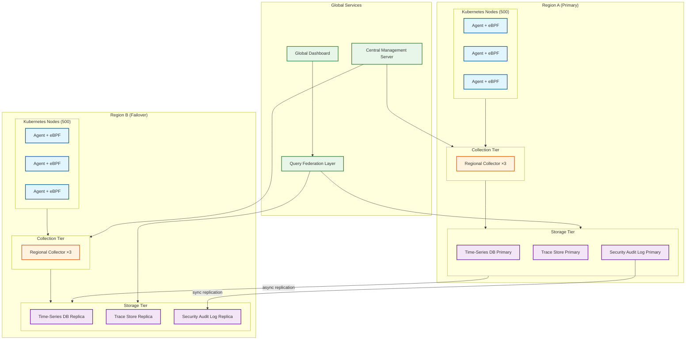

# Scalability & Reliability — eBPF-based Observability Platform

## Scalability

### Horizontal vs. Vertical Scaling

| Component | Scaling Strategy | Rationale |
|-----------|-----------------|-----------|
| eBPF data plane (per-node) | **Vertical (per-node capacity)** | eBPF programs run on every node; more powerful nodes generate more events but also have more CPU for eBPF overhead |
| Node agent | **Vertical** | One agent per node; scale by increasing ring buffer size and consumer thread count |
| Regional collector | **Horizontal** | Stateless; add more collector instances behind a load balancer per region |
| Central collector | **Horizontal** | Partition by event type (metrics/traces/profiles/security) for independent scaling |
| Time-series DB | **Horizontal (sharding)** | Shard by metric name hash; each shard handles a subset of time series |
| Trace store | **Horizontal (sharding)** | Shard by trace_id; all spans of a trace land on the same shard |
| Profile store | **Horizontal (time-partitioned)** | Partition by time window; each partition is independently queryable |
| Query engine | **Horizontal** | Stateless query workers; auto-scale based on query QPS |

### Auto-Scaling Triggers

| Component | Metric | Scale-Up Threshold | Scale-Down Threshold | Cooldown |
|-----------|--------|-------------------|----------------------|----------|
| Regional collector | CPU utilization | >70% for 3 min | <30% for 10 min | 5 min |
| Regional collector | gRPC queue depth | >10K pending | <1K pending | 5 min |
| Central collector | Ingestion lag (newest event age) | >30s | <5s | 5 min |
| Query engine | Query latency p99 | >5s | <1s | 3 min |
| Profile store | Write throughput | >80% capacity | <40% capacity | 10 min |

### Database Scaling Strategy

#### Time-Series Data (Metrics)

- **Write path:** Events are pre-aggregated by the node agent into 1-minute windows. Each agent emits ~1,000 unique time series (service pairs × metric types). Across 1,000 nodes: 1M active time series.
- **Sharding:** Hash-based sharding on `metric_name + label_set_hash`. 16 shards provide even distribution.
- **Read replicas:** 2 read replicas per shard for dashboard queries. Dashboard queries are read-heavy (100:1 read:write ratio on the query path).
- **Compaction:** Time-series data is compacted from per-second resolution to 1-minute after 3 days, 5-minute after 30 days.

#### Trace Data

- **Write path:** Sampled traces (1-10% of traffic depending on configuration) are written as spans indexed by `trace_id`.
- **Sharding:** Hash on `trace_id` ensures all spans of a trace are co-located.
- **TTL-based eviction:** Trace data expires after 7 days (hot tier) + 30 days (warm tier, compressed).

#### Profile Data

- **Write path:** Aggregated profiles (one per 10-second window per node per profile type) are written as compressed pprof-format blobs.
- **Time-partitioned:** Each hour is a separate partition. Queries specify a time range, and only relevant partitions are scanned.
- **Stack trace deduplication:** Unique stack traces are stored in a content-addressed store (keyed by hash). Profile samples reference stack hashes, reducing storage by 10-100x.

### Caching Layers

| Layer | What Is Cached | Size | TTL | Invalidation |
|-------|---------------|------|-----|-------------|
| L1: Node agent | K8s pod metadata (cgroup_id → pod_identity) | 10-50 MB | Until pod deletion event | K8s API watch stream |
| L1: Node agent | Recently seen connection states | 50-200 MB | 30 seconds (LRU) | Auto-eviction |
| L2: Query engine | Frequently queried metric aggregations | 1-10 GB | 60 seconds | Time-based; cache-aside |
| L2: Query engine | Profile flame graph renders (pre-computed) | 500 MB | 10 minutes | Time-based |
| L3: Dashboard | Pre-rendered dashboard panels | Per-user browser cache | 15 seconds (auto-refresh) | Polling |

### Hot Spot Mitigation

| Hot Spot | Description | Mitigation |
|----------|-------------|------------|
| **Noisy neighbor pod** | One pod generates 10x more events than others, dominating ring buffer | Per-pod rate limiting in eBPF: a per-cgroup counter map limits events/sec per pod |
| **High-cardinality labels** | Service emitting unique request IDs as metric labels → cardinality explosion | Agent-side label sanitization: drop labels with >1000 unique values per minute |
| **Query of death** | Unbounded query scanning all time series across all shards | Query complexity analysis: reject queries with estimated cost >10M data points; require time range <24h for high-cardinality queries |
| **Profile sampling storm** | Runaway process consuming 100% CPU → every sample hits the same stack | In-kernel deduplication: the profile aggregation map counts occurrences per (pid, stack_hash), so 100% single-stack CPU still produces one map entry |

---

## Reliability & Fault Tolerance

### Single Points of Failure (SPOF) Identification

| Component | SPOF? | Mitigation |
|-----------|-------|------------|
| eBPF data plane | No — runs in each node's kernel independently | Self-healing: programs persist across agent restarts |
| Node agent | **Partial** — agent crash stops event forwarding | eBPF programs and maps persist in kernel; agent restart (<10s) resumes collection. WAL buffer on disk survives crashes |
| Regional collector | No — multiple stateless instances behind LB | Health-check-based failover; agents retry on next collector |
| Central collector | No — horizontally scaled and sharded | Per-shard failover; cross-region replication for DR |
| K8s API server (for metadata) | No — standard K8s HA setup | Agent caches metadata locally; operates with stale cache during API server outage |

### Redundancy Strategy

#### Data Plane Redundancy

- **eBPF program pinning:** Programs and maps are pinned to the BPF filesystem (`/sys/fs/bpf/`). If the agent crashes, the eBPF programs continue running in the kernel, writing events to the ring buffer. When the agent restarts, it re-attaches to the pinned programs and ring buffers, resuming event consumption from where it left off (events accumulated during the restart window are consumed in a burst).

- **Dual ring buffers:** For security events, maintain a primary and a secondary ring buffer. The primary feeds the normal event pipeline; the secondary is consumed only when the primary's consumer is down. This provides defense-in-depth against consumer stalls.

#### Control Plane Redundancy

- **Policy replication:** Security policy maps are written to the BPF filesystem. If the agent crashes, the in-kernel policies remain active — no enforcement gap during restart.

- **Configuration checkpointing:** The agent persists its configuration (which programs to load, map sizes, sampling rates) to local disk. On restart, it replays the configuration without needing to contact the central management server.

### Failover Mechanisms

```mermaid
flowchart TB
    subgraph Normal["Normal Operation"]
        AGENT[Node Agent] -->|gRPC stream| RC[Regional Collector]
        RC --> CC[Central Collector]
    end

    subgraph AgentFailure["Agent Crash Recovery"]
        KERNEL[eBPF Programs<br>Continue Running] --> RB[Ring Buffer<br>Accumulates Events]
        RB --> RESTART[Agent Restarts<br>in less than 10s]
        RESTART --> DRAIN[Drain Accumulated<br>Ring Buffer Events]
        DRAIN --> RC2[Resume Streaming<br>to Collector]
    end

    subgraph CollectorFailure["Collector Unavailable"]
        AGENT2[Node Agent] -->|Connection fails| WAL[Write to Local<br>WAL Buffer]
        WAL -->|Retry with backoff| RC3[Regional Collector<br>Recovers]
        WAL -->|Buffer full after 1h| SAMPLE[Switch to<br>Sampling Mode]
    end

    classDef normal fill:#e8f5e9,stroke:#2e7d32,stroke-width:2px
    classDef failure fill:#fff3e0,stroke:#e65100,stroke-width:2px
    classDef recovery fill:#e1f5fe,stroke:#01579b,stroke-width:2px

    class AGENT,RC,CC normal
    class KERNEL,RB,AGENT2,WAL failure
    class RESTART,DRAIN,RC2,RC3,SAMPLE recovery
```



### Circuit Breaker Patterns

| Circuit | Trigger (Open) | Recovery (Half-Open) | Close |
|---------|---------------|---------------------|-------|
| Agent → Collector | 3 consecutive connection failures or p99 latency >5s | Try 1 request every 30s | 3 consecutive successes |
| Agent → K8s API | 5 failures in 60s | Try 1 list/watch every 60s | Successful re-watch |
| Collector → Storage | Write latency >2s for 30s | Reduced write rate (50%) for 60s | Latency <500ms for 60s |

### Retry Strategies

| Operation | Strategy | Max Retries | Backoff |
|-----------|----------|-------------|---------|
| Agent → Collector (event batch) | Exponential backoff with jitter | Unlimited (WAL-backed) | 1s, 2s, 4s, 8s, 16s, max 60s |
| Agent → K8s API (watch reconnect) | Exponential backoff | 10, then full re-list | 1s, 2s, 4s, 8s, max 30s |
| eBPF program load (after verification failure) | Graduated fallback | 3 (full → reduced → minimal) | Immediate (different program, not retry) |
| Profile upload | Fixed interval retry | 5 | 10s fixed |

### Graceful Degradation

| Condition | Degradation Mode | User Impact |
|-----------|-----------------|-------------|
| Collector unavailable | Agent buffers locally (WAL, up to 1 hour) | Dashboard shows stale data; no data loss |
| WAL buffer full | Switch to sampling (10% of non-security events) | Reduced metric accuracy; security events preserved |
| Kernel lacks BTF | Load pre-compiled fallback programs (no CO-RE) | Reduced protocol parsing; basic syscall tracing only |
| Ring buffer contention | Adaptive sampling kicks in | Lower event volume; counters track sampling ratio |
| K8s API unavailable | Use cached metadata (stale) | Pod names may be stale for recently-changed pods |

### Bulkhead Pattern

- **Event type isolation:** Separate ring buffers, consumer threads, and collector channels for: (1) network flows, (2) syscall traces, (3) security events, (4) profiles. A burst in network flow events cannot starve security event processing.
- **Per-node resource isolation:** Each agent is deployed as a DaemonSet with resource limits (CPU: 500m, memory: 512 MB). The agent cannot consume more than its allocated share, preventing it from impacting application workloads.
- **Per-pod event budgets:** eBPF programs enforce per-cgroup event rate limits. A runaway pod generating millions of events/sec cannot fill the ring buffer and cause observability loss for other pods on the same node.

---

## Disaster Recovery

### RTO / RPO

| Data Type | RTO (Recovery Time Objective) | RPO (Recovery Point Objective) |
|-----------|-------------------------------|-------------------------------|
| Real-time event streaming | 10 seconds (agent restart) | 0 (eBPF programs persist; ring buffer retains events during restart) |
| Historical metrics | 30 minutes (restore from replica) | 1 minute (replication lag) |
| Trace data | 1 hour (restore from backup) | 5 minutes (batch backup interval) |
| Security audit events | 15 minutes (restore from replica) | 0 (synchronous replication for audit events) |
| Profile data | 2 hours (restore from backup) | 10 minutes (batch backup interval) |

### Backup Strategy

- **Metrics:** Continuous replication to a standby time-series cluster in a secondary region. Daily snapshots to object storage.
- **Traces:** Hourly batch export to object storage (compressed). Recent traces (last 24h) are replicated synchronously.
- **Profiles:** Daily batch export to object storage. No real-time replication (profiles are regenerable from raw data).
- **Security events:** Synchronous replication to secondary region (guaranteed delivery). Immutable append-only log with cryptographic chaining for tamper evidence.

### Multi-Region Considerations

- **eBPF data plane and agents:** Run independently in each region. No cross-region dependency for event capture.
- **Collector:** Each region has its own collector cluster. Cross-region query federation allows querying metrics/traces across regions from a single dashboard.
- **Storage:** Active-active for metrics (each region writes independently). Active-passive for security audit logs (single source of truth with synchronous replication).
- **Kernel compatibility:** Different regions may run different kernel versions. CO-RE ensures the same eBPF programs work across kernel versions, but the agent's feature probe results may differ per region.

---

## Kernel Compatibility Management

### Version Matrix Management

The platform maintains a kernel compatibility matrix that maps kernel versions to available eBPF features:

| Feature | Kernel 4.15-4.x | Kernel 5.0-5.7 | Kernel 5.8-5.15 | Kernel 5.16-6.x | Kernel 6.1+ |
|---------|-----------------|----------------|-----------------|-----------------|-------------|
| kprobes/tracepoints | Yes | Yes | Yes | Yes | Yes |
| BTF/CO-RE | No | Partial (5.2+) | Yes | Yes | Yes |
| Ring buffer | No | No | Yes | Yes | Yes |
| LSM hooks | No | No (5.7 partial) | Yes | Yes | Yes |
| Bloom filter map | No | No | No | Yes (5.16+) | Yes |
| User ring buffer | No | No | No | No | Yes |
| BPF arena | No | No | No | No | Partial (6.9+) |

### Graduated Feature Deployment

```
FUNCTION determine_program_suite(kernel_version, btf_available, features):
    IF btf_available AND kernel_version >= 5.8:
        // Full suite: CO-RE programs with ring buffer
        RETURN FULL_SUITE

    IF btf_available AND kernel_version >= 5.2:
        // Reduced: CO-RE programs with perf buffer fallback
        RETURN REDUCED_SUITE

    IF kernel_version >= 4.15:
        // Minimal: Pre-compiled programs, basic tracing only
        RETURN MINIMAL_SUITE

    // Too old: agent runs in passive mode (no eBPF)
    RETURN PASSIVE_MODE
```

---

## Multi-Region Deployment

### Architecture



### Region Failover Strategy

| Component | Failover Mechanism | RPO | RTO |
|-----------|-------------------|-----|-----|
| eBPF data plane | Independent per node — no cross-region dependency | 0 | 0 (no failover needed) |
| Node agent | Independent per node — restarts locally | 0 (ring buffer retains events) | <10s |
| Regional collector | Agents retry to next regional collector instance | 0 (WAL-backed buffering) | <30s |
| Time-series DB | Async replication to secondary region | 1 minute | 30 min (promote replica) |
| Trace store | Async replication | 5 minutes | 1 hour |
| Security audit log | Sync replication (cross-region) | 0 | 15 min (promote replica) |
| Query federation | Active-active — queries routed to available region | N/A | 0 (automatic rerouting) |

### Cross-Region Data Consistency

- **Metrics:** Eventually consistent. Each region writes independently. Cross-region queries may show slight divergence during replication lag. Dashboard timestamps indicate data freshness per region.
- **Traces:** Eventually consistent. Distributed traces spanning both regions will have gaps during replication lag. Query federation stitches spans from both regions with a configurable wait window (default: 60 seconds).
- **Security audit logs:** Strongly consistent (synchronous replication). Critical for compliance — a security event in Region A is immediately queryable in Region B. Sync replication adds ~5ms write latency.

---

## Back-Pressure Mechanisms

### Mechanism 1: Ring Buffer Adaptive Sampling (Kernel → User Space)

```
FUNCTION ring_buffer_back_pressure():
    // Shared stats map updated by user-space agent every 100ms
    fill_ratio = PERCPU_STATS_MAP[FILL_RATIO_KEY]

    IF fill_ratio > 0.90:
        // Emergency: only security events
        IF event.type != SECURITY:
            INCREMENT(drop_counter[event.type])
            RETURN DROP
    ELSE IF fill_ratio > 0.75:
        // High pressure: sample non-critical events
        sampling_rate = 1.0 - ((fill_ratio - 0.75) / 0.15)  // Linear from 100% to 0%
        IF event.type == NETWORK AND random() > sampling_rate:
            INCREMENT(drop_counter[NETWORK])
            RETURN DROP
    ELSE IF fill_ratio > 0.50:
        // Moderate pressure: sample verbose events only
        IF event.type == SYSCALL_VERBOSE AND random() > 0.5:
            INCREMENT(drop_counter[SYSCALL_VERBOSE])
            RETURN DROP

    RETURN PASS
```

### Mechanism 2: Agent → Collector Flow Control

```
FUNCTION agent_collector_flow_control(stream, batch):
    ack = stream.send(batch)

    IF ack.back_pressure == SLOW_DOWN:
        // Collector is busy: reduce send rate
        send_interval = send_interval * 2
        LOG_WARN("Collector back-pressure: slowing to {send_interval}ms")

    ELSE IF ack.back_pressure == PAUSE:
        // Collector overwhelmed: buffer locally
        wal.write(batch)
        LOG_WARN("Collector paused: buffering to WAL")

        // Wait for resume signal with exponential backoff
        backoff = 1s
        WHILE NOT stream.is_ready():
            SLEEP(backoff)
            backoff = MIN(backoff * 2, 60s)

    ELSE IF ack.back_pressure == REDIRECT:
        // Collector wants us to use a different instance
        stream = connect(ack.redirect_target)
        stream.send(batch)

    // Monitor WAL size
    IF wal.size > WAL_MAX_SIZE:
        ACTIVATE_LOCAL_AGGREGATION()  // Aggregate instead of raw events
```

### Mechanism 3: Collector → Storage Back-Pressure

```
FUNCTION collector_storage_flow_control(batch):
    // Storage write with timeout
    result = storage.write_with_timeout(batch, timeout=2s)

    IF result == TIMEOUT:
        // Storage is slow: activate write buffer
        write_buffer.enqueue(batch)
        EMIT_METRIC("storage_write_buffer_depth", write_buffer.size)

        IF write_buffer.size > HIGH_WATERMARK:
            // Signal agents to reduce sending rate
            FOR EACH agent IN connected_agents:
                agent.send_ack(back_pressure=SLOW_DOWN)

        IF write_buffer.size > CRITICAL_WATERMARK:
            // Drop non-critical data to protect storage
            write_buffer.drop_oldest(type=PROFILE)
            write_buffer.drop_oldest(type=TRACE_NON_SAMPLED)
            FOR EACH agent IN connected_agents:
                agent.send_ack(back_pressure=PAUSE)

    ELSE IF result == SUCCESS:
        // Drain write buffer if we have one
        WHILE NOT write_buffer.empty AND storage.is_healthy():
            storage.write(write_buffer.dequeue())
```

---

## Chaos Engineering Experiments

### Experiment 1: Ring Buffer Starvation

**Hypothesis:** When ring buffer utilization exceeds 90% for 60 seconds, adaptive sampling maintains security event delivery at 100% while non-critical events are sampled at ≤10%.

**Injection:** Generate synthetic events from a test pod at 10x normal rate using a stress-test eBPF program that floods the ring buffer.

**Validation:**
- Security event delivery rate remains 100% (verified by comparing generated vs. received counts)
- Network event sampling rate drops to <10%
- Agent CPU does not exceed resource limits
- Ring buffer does not reach 100% (which would cause uncontrolled drops including security events)

### Experiment 2: Agent Process Kill

**Hypothesis:** Killing the agent process (SIGKILL) results in <10 seconds of event delivery delay with zero event loss (up to ring buffer capacity).

**Injection:** `kill -9 <agent_pid>` on a test node.

**Validation:**
- eBPF programs continue running (verify via `bpftool prog list`)
- Ring buffer accumulates events (verify via ring buffer stats)
- DaemonSet restarts agent within 5 seconds
- Agent re-attaches to pinned programs and drains buffered events
- No security enforcement gap (verify by attempting a blocked action during agent downtime)

### Experiment 3: Collector Network Partition

**Hypothesis:** A 30-minute network partition between agents and the collector results in zero data loss, with events buffered in the agent's local WAL.

**Injection:** Network policy blocking agent → collector traffic for 30 minutes.

**Validation:**
- Agent WAL buffer grows at expected rate (~5-50 MB/min)
- No ring buffer overflow (agent continues consuming even when collector is unreachable)
- After partition heals, agent drains WAL buffer and catches up
- Collector deduplicates any events that were partially sent during partition onset

### Experiment 4: Kernel OOM Near Agent

**Hypothesis:** When system memory pressure triggers the OOM killer, the agent is killed (acceptable) but eBPF programs persist and resume operation after agent restart.

**Injection:** Deploy a memory-consuming pod on the test node until OOM killer activates. Agent should be killed before critical system processes due to OOM score adjustment.

**Validation:**
- Agent is killed (OOM score set to make it killable before system processes)
- eBPF programs survive (they are kernel memory, not subject to user-space OOM)
- Ring buffer survives (kernel memory)
- Agent restarts and resumes within 10 seconds
- No kernel stability issues from eBPF programs running without their agent

### Experiment 5: BTF Removal Simulation

**Hypothesis:** Removing BTF data from `/sys/kernel/btf/vmlinux` (simulating a non-BTF kernel) causes graceful fallback to pre-compiled programs with reduced but functional observability.

**Injection:** Rename the BTF file; restart the agent.

**Validation:**
- Agent detects missing BTF during feature probe
- Agent loads pre-compiled fallback programs (reduced suite)
- Basic syscall tracing and network flow monitoring continue
- L7 protocol parsing may be degraded (fewer protocols supported)
- Agent reports reduced capability level in its status

### Experiment 6: Clock Skew Between Nodes

**Hypothesis:** A 5-second clock skew between two nodes does not cause event ordering anomalies in the collector because the collector uses a configurable reorder window (default: 30 seconds).

**Injection:** Adjust the test node's system clock by +5 seconds.

**Validation:**
- Events from the skewed node arrive "from the future" at the collector
- Collector's reorder window absorbs the skew
- Cross-node traces are correctly stitched (timestamp normalization)
- Dashboard shows consistent timelines despite underlying skew

---

## Capacity Planning Formulas

### Ring Buffer Sizing

```
ring_buffer_size = events_per_sec × avg_event_size × drain_interval × safety_factor

Example (standard workload):
  events_per_sec = 50,000 (post-filter)
  avg_event_size = 256 bytes
  drain_interval = 2 seconds (target consumer lag)
  safety_factor  = 4 (handle bursts)

  ring_buffer_size = 50,000 × 256 × 2 × 4 = 102,400,000 ≈ 128 MB (round up to power of 2)

Example (high-throughput node):
  events_per_sec = 200,000
  avg_event_size = 256 bytes
  drain_interval = 2 seconds
  safety_factor  = 4

  ring_buffer_size = 200,000 × 256 × 2 × 4 = 409,600,000 ≈ 512 MB
```

### Agent Memory Budget

```
agent_memory = ring_buffers + map_cache + wal_buffer + k8s_cache + processing

Ring buffers:   4 × 64 MB (network, syscall, security, profile) = 256 MB
Map cache:      connection_map (32 MB) + pod_map (8 MB) + policy_map (4 MB) = 44 MB
WAL buffer:     max 100 MB (configurable, disk-backed)
K8s metadata:   50 pods/node × 2 KB/pod = 100 KB (negligible)
Processing:     event batch buffers + gRPC buffers = 64 MB

Total: ~364 MB → set resource limit at 512 MB (40% headroom)
```

### Collector Throughput Sizing

```
collector_capacity = events_per_sec × enrichment_cost + storage_write_overhead

Per collector instance:
  Max events/sec:      500,000
  Enrichment cost:     10μs/event (dedup + routing)
  Storage write:       batch of 1000 events every 100ms
  CPU per instance:    ~5 cores (500K × 10μs = 5 seconds of CPU/sec)
  Memory:              2 GB (deserialization buffers + dedup state)

Fleet sizing (1000 nodes, 50K events/sec/node):
  Total events/sec = 50,000,000
  Collectors needed = 50M / 500K = 100 instances
  With 2x headroom: 200 instances across regions
```

### Storage Growth Rate

```
storage_daily = (metric_series × resolution × bytes_per_point × seconds_per_day)
              + (trace_volume × sampling_rate)
              + (security_events × event_size)
              + (profile_volume)

Metrics: 1M series × 1 point/15s × 16 bytes × 86,400s/day ÷ 15 = 92 GB/day
Traces:  500K RPS × 1% sampling × 2KB/span × 86,400 = 864 GB/day
Security: 100K events/day × 1KB = 100 MB/day (negligible)
Profiles: 1000 nodes × 6 profiles/min × 10KB × 1440 min/day = 86 GB/day

Total: ~1 TB/day → 30 TB/month (hot) → compressed to ~10 TB/month (warm)
```

---

## Data Lifecycle Management

### Tiered Storage Strategy

| Tier | Duration | Storage Type | Resolution | Access Pattern |
|------|----------|-------------|------------|----------------|
| Hot | 0-3 days | Fast SSD-backed columnar store | Full resolution (15s metrics, all spans) | Real-time dashboards, incident investigation |
| Warm | 3-30 days | Standard block storage, compressed | Downsampled (1m metrics, sampled spans) | Trend analysis, capacity planning |
| Cold | 30-365 days | Object storage, heavily compressed | Downsampled (5m metrics, aggregated spans) | Compliance, historical comparison |
| Archive | 1-7 years | Object storage, glacier tier | Daily aggregates only | Legal hold, regulatory audit |

### Compaction Pipeline

```
FUNCTION run_compaction(tier_transition):
    IF tier_transition == HOT_TO_WARM:
        // Downsample metrics from 15s to 1m resolution
        FOR EACH metric_series IN hot_tier.expiring_series():
            warm_data = downsample(metric_series, "1m", aggregation="avg,max,min,count")
            warm_tier.write(warm_data)

        // Retain only sampled traces
        FOR EACH trace IN hot_tier.expiring_traces():
            IF trace.is_sampled OR trace.has_errors OR trace.duration > SLO_THRESHOLD:
                warm_tier.write(compress(trace))
            // Non-sampled, non-interesting traces are dropped

        // Security events: keep all
        warm_tier.write(hot_tier.expiring_security_events())

    IF tier_transition == WARM_TO_COLD:
        // Further downsample metrics to 5m
        FOR EACH metric_series IN warm_tier.expiring_series():
            cold_data = downsample(metric_series, "5m", aggregation="avg,max")
            cold_tier.write(cold_data)

        // Traces: keep only error traces and SLO-violating traces
        FOR EACH trace IN warm_tier.expiring_traces():
            IF trace.has_errors:
                cold_tier.write(trace)

        // Security events: keep all (compliance requirement)
        cold_tier.write(warm_tier.expiring_security_events())
```

---

## Real-World Scaling Case Studies

### Case Study 1: Scaling from 100 to 10,000 Nodes

**Phase 1 (100 nodes):** Flat collector architecture. 3 collector instances behind a load balancer. Single time-series DB. All events forwarded.

**Phase 2 (1,000 nodes):** Introduced hierarchical collection. 4 regional collectors (rack-level) aggregate before forwarding to 3 central collectors. Edge aggregation enabled — agents send RED metrics, not raw events. Raw events only for sampled traces and security.

**Phase 3 (10,000 nodes):** Full multi-region deployment. 20 regional collector clusters (5 per region, 4 regions). Federated query layer. Per-region storage with cross-region replication for security events. Agent-side protocol parser limited to top-5 protocols (HTTP/1, HTTP/2, gRPC, DNS, Redis) to control event volume. Custom protocols handled via user-space fallback.

**Key Scaling Slowest part of the process:** At 5,000 nodes, the Kubernetes API server informer became a Slowest part of the process (watch events for 250,000 pods). Solution: shared informer cache with a dedicated K8s metadata service that all agents query, reducing API server load by 1000x.

### Case Study 2: eBPF on ARM64 Fleet

**Challenge:** Mixed fleet with x86_64 and ARM64 (Graviton) nodes. eBPF programs compiled for x86 won't run on ARM.

**Solution:** CO-RE produces architecture-independent bytecode; the JIT compiler on each node translates to the native instruction set. The same `.o` file runs on both architectures. However, some BTF struct layouts differ between x86 and ARM64 kernel builds — CO-RE relocations handle this, but required additional testing.

**Gotcha:** ARM64 kernels had fewer eBPF helper functions available in early builds. Feature probing was essential to avoid loading programs that used unsupported helpers.
