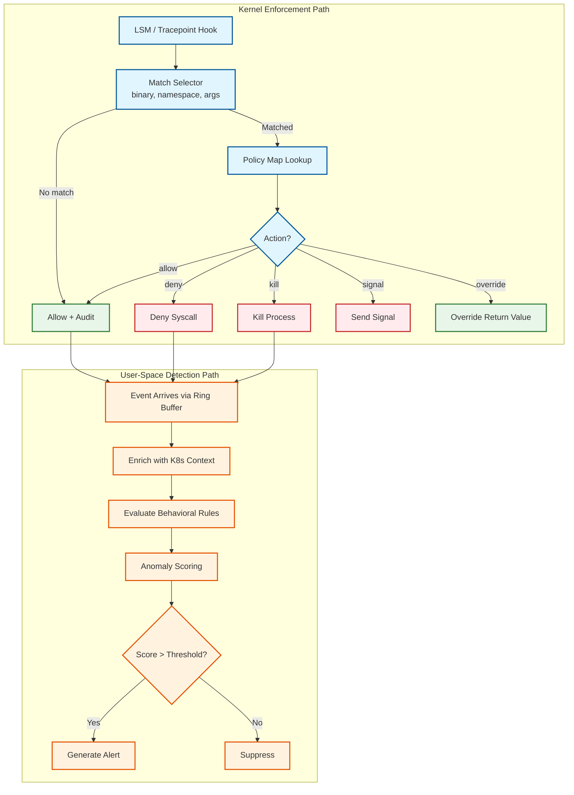

# Security & Compliance — eBPF-based Observability Platform

## The eBPF Security Model

eBPF occupies a unique position in the security landscape: it is both a **security enforcement mechanism** (Tetragon, Falco use eBPF to enforce security policies) and a **potential attack surface** (eBPF programs run in kernel space with elevated privileges). This duality makes the security design of an eBPF-based observability platform fundamentally different from traditional user-space monitoring tools.

---

## Authentication & Authorization

### Who Can Load eBPF Programs?

| Privilege Level | Capability Required | Allowed Operations |
|----------------|--------------------|--------------------|
| **Root (CAP_SYS_ADMIN)** | `CAP_SYS_ADMIN` or `CAP_BPF` + `CAP_PERFMON` | Load any eBPF program type, create any map type, access kernel memory |
| **CAP_BPF only** | `CAP_BPF` (Linux 5.8+) | Load eBPF programs, create most map types; cannot access raw kernel memory |
| **CAP_PERFMON** | `CAP_PERFMON` (Linux 5.8+) | Attach to perf events for profiling; read stack traces |
| **CAP_NET_ADMIN** | `CAP_NET_ADMIN` | Attach TC and XDP programs for network processing |
| **Unprivileged** | None | Load `BPF_PROG_TYPE_SOCKET_FILTER` only (if `kernel.unprivileged_bpf_disabled=0`) |

### Platform Authorization Model

```
RBAC Model for eBPF Observability Platform:

Roles:
  - platform-admin:
      Permissions: load/unload eBPF programs, modify security policies,
                   access all event streams, manage collector configuration
      Required for: initial deployment, kernel compatibility troubleshooting

  - security-operator:
      Permissions: create/modify TracingPolicy resources, view security events,
                   enable/disable enforcement actions
      Cannot: modify eBPF programs directly, access raw kernel events

  - sre-operator:
      Permissions: view metrics, traces, profiles; create dashboards and alerts;
                   adjust sampling rates
      Cannot: modify security policies, load custom eBPF programs

  - developer:
      Permissions: view metrics/traces/profiles for their namespace only;
                   query service maps and flame graphs
      Cannot: view cross-namespace data, modify any configuration

  - auditor:
      Permissions: read-only access to security audit logs; export audit data
      Cannot: modify any state; full audit trail of their own access
```

### Agent Authentication

- The node agent authenticates to the central collector using **mutual TLS (mTLS)** with certificates provisioned via a Kubernetes cert-manager or equivalent PKI.
- Certificate rotation: automatic, every 24 hours, with zero-downtime rollover.
- The collector validates that the agent's certificate CN matches the node's identity (node name or unique ID), preventing impersonation.

### API Authentication

- Dashboard and query APIs use **OIDC (OpenID Connect)** for user authentication.
- API keys for programmatic access (CI/CD integration, external alerting systems) with scoped permissions and expiration.
- All API keys are hashed (bcrypt) in storage; never logged or exposed in responses.

---

## Data Security

### Encryption at Rest

| Data Type | Encryption | Key Management |
|-----------|-----------|----------------|
| eBPF maps (kernel memory) | Not encrypted (performance-critical kernel memory) | Protected by kernel memory isolation; not accessible from user space without BPF syscall |
| Ring buffer events (transit) | Not encrypted in shared memory | Protected by memory mapping permissions; only the agent process can read |
| WAL buffer (local disk) | Encrypted with node-local encryption key | Key stored in platform secret management; rotated weekly |
| Time-series storage | Encrypted at rest (storage-level encryption) | Key managed by storage backend (e.g., encrypted volumes) |
| Security audit logs | Encrypted with separate key | Dedicated audit key; dual-key control for decryption |
| Profile data | Encrypted at rest | Standard storage encryption |

### Encryption in Transit

| Path | Protocol | Encryption |
|------|----------|-----------|
| Agent → Collector | gRPC | TLS 1.3 (mTLS) |
| Collector → Storage | Backend-specific | TLS 1.3 |
| Dashboard → Query Engine | HTTPS | TLS 1.3 |
| Inter-collector (cross-region) | gRPC | TLS 1.3 (mTLS) |
| Agent → K8s API | HTTPS | TLS 1.3 (using ServiceAccount token) |

### PII Handling

eBPF-based observability can inadvertently capture sensitive data because it operates at the kernel level:

| Data Source | PII Risk | Mitigation |
|-------------|----------|------------|
| HTTP request paths | May contain user IDs, tokens in URL | Path normalization: replace dynamic segments with `{id}` patterns before storage |
| HTTP headers | Authorization headers, cookies | Header filtering: configurable allowlist of headers to capture; default drops `Authorization`, `Cookie`, `Set-Cookie` |
| DNS queries | Reveals user browsing patterns | DNS query logging is opt-in; default captures only internal service DNS |
| Process arguments | May contain passwords, API keys in CLI args | Argument scrubbing: regex-based redaction of known secret patterns (`--password=*`, `-token *`) |
| Request/response bodies | Full payload content | Body capture is disabled by default; opt-in with size limit (first 256 bytes) and content-type filter |

### Data Masking Pipeline

```
FUNCTION sanitize_event(event):
    // Stage 1: Path normalization
    IF event.http_path IS NOT NULL:
        event.http_path = normalize_path(event.http_path)
        // "/users/12345/orders" → "/users/{id}/orders"

    // Stage 2: Header filtering
    IF event.headers IS NOT NULL:
        FOR EACH header IN event.headers:
            IF header.name IN SENSITIVE_HEADERS:
                REMOVE header FROM event.headers

    // Stage 3: Argument redaction
    IF event.process_args IS NOT NULL:
        event.process_args = redact_secrets(event.process_args)
        // "--db-password=s3cret" → "--db-password=[REDACTED]"

    // Stage 4: IP anonymization (if configured for privacy compliance)
    IF privacy_mode == ANONYMIZE:
        event.src_ip = truncate_ip(event.src_ip, /24)  // Keep first 3 octets
        event.dst_ip = truncate_ip(event.dst_ip, /24)

    RETURN event
```

---

## Threat Model

### Attack Surface: eBPF as a Target

| Threat | Attack Vector | Severity | Mitigation |
|--------|--------------|----------|------------|
| **Malicious eBPF program loading** | Attacker gains CAP_BPF/CAP_SYS_ADMIN and loads a rootkit eBPF program | Critical | Restrict BPF capability to the agent service account only; enable `kernel.unprivileged_bpf_disabled=1`; use signed eBPF programs (kernel 5.18+ BPF token) |
| **eBPF map data exfiltration** | Attacker reads sensitive data from eBPF maps (connection tracking, pod metadata) | High | Maps are only accessible via BPF syscall (requires CAP_BPF); pin maps with restrictive file permissions; disable `bpf_obj_get` for non-agent processes |
| **Verifier bypass** | Kernel bug allows unsafe eBPF program to pass verification | Critical | Keep kernel up to date; monitor CVEs for eBPF verifier bugs (historically 2-3 per year); use seccomp to restrict BPF syscall to the agent |
| **Ring buffer data interception** | Attacker maps the ring buffer memory to read captured events | High | Ring buffer fd is only accessible to the agent process; not shareable via SCM_RIGHTS without explicit agent cooperation |
| **Agent compromise** | Attacker compromises the user-space agent, gains access to eBPF programs and maps | Critical | Run agent with minimal capabilities (drop all except CAP_BPF, CAP_NET_ADMIN, CAP_PERFMON); read-only filesystem; no shell; network policy restricts outbound to collector only |

### Attack Surface: eBPF as a Defense

| Security Use Case | eBPF Mechanism | Detection/Enforcement |
|-------------------|----------------|----------------------|
| **Unauthorized process execution** | LSM hook `bprm_check_security` | Detect or block execution of binaries not in allowlist |
| **Container escape** | Syscall tracepoint `sys_enter_*` for `setns`, `unshare`, `mount` | Detect namespace manipulation; block mount of host filesystem |
| **Cryptominer detection** | Profiling perf_event sampling | Detect sustained high-CPU processes with mining-characteristic stack traces |
| **Data exfiltration** | TC egress hook + DNS tracepoint | Detect unusual outbound data volume; detect DNS tunneling (high entropy query names) |
| **Privilege escalation** | LSM hook `capable` + tracepoint `sys_enter_setuid` | Alert on capability acquisition; block `setuid` in containers |

### eBPF-Specific Security Hardening

```
Kernel Parameters:
  kernel.unprivileged_bpf_disabled = 1    # Prevent unprivileged users from loading BPF
  kernel.bpf_stats_enabled = 0             # Disable BPF runtime stats (unless debugging)
  net.core.bpf_jit_harden = 2             # Full JIT hardening (constant blinding)

Agent Container Security Context:
  securityContext:
    runAsNonRoot: false          # Must run as root for CAP_BPF (or CAP_SYS_ADMIN on older kernels)
    capabilities:
      add: [BPF, PERFMON, NET_ADMIN, SYS_RESOURCE]
      drop: [ALL]                # Drop everything except required capabilities
    readOnlyRootFilesystem: true
    allowPrivilegeEscalation: false

BPF Program Signing (Kernel 5.18+):
  - Require BPF token delegation for program loading
  - Agent holds a token granted by the cluster admin at deployment time
  - Token is bound to specific program types and attach points
  - Revocable without restarting the agent
```

### Rate Limiting & DDoS Protection

| Layer | Protection |
|-------|-----------|
| eBPF event generation | Per-cgroup rate limits prevent any single pod from flooding the ring buffer |
| Agent → Collector | Token bucket rate limiter on the gRPC stream; collector drops excess events |
| Query API | Per-user rate limiting (sliding window); query complexity analysis rejects expensive queries |
| Dashboard | Client-side request throttling; server-side caching of frequently-queried panels |

---

## Compliance Considerations

### SOC 2

| Control | Implementation |
|---------|---------------|
| **Access control** | RBAC with namespace-level isolation; all API access logged |
| **Change management** | eBPF program changes tracked via version-controlled TracingPolicy CRDs; deployment audit trail |
| **Monitoring** | The platform is itself the monitoring system; meta-monitoring covers the observer (see 07-observability.md) |
| **Incident response** | Security events trigger alerts within 30 seconds; audit logs are immutable and cryptographically chained |

### GDPR

| Requirement | Implementation |
|-------------|---------------|
| **Data minimization** | Capture only necessary metadata; disable body capture by default; path normalization removes PII |
| **Right to erasure** | Telemetry data has fixed retention (30 days default); security audit logs exempt under legitimate interest |
| **Data processing agreement** | Clear documentation of what kernel-level data is captured and how it flows through the system |
| **Cross-border transfer** | Regional collectors process data in-region; cross-region query federation does not copy data |

### PCI-DSS (for environments processing payment data)

| Requirement | Implementation |
|-------------|---------------|
| **Network segmentation** | eBPF network flows verify that payment services only communicate with approved services |
| **Access logging** | All access to security events and audit logs is itself logged |
| **Encryption** | All data in transit encrypted (TLS 1.3); data at rest encrypted with managed keys |
| **Vulnerability management** | eBPF verifier CVE monitoring; automated kernel patch assessment for eBPF-relevant vulnerabilities |

---

## Runtime Security Enforcement Architecture

### Tetragon-Style TracingPolicy Evaluation



### Enforcement vs. Detection Trade-Offs

| Aspect | In-Kernel Enforcement | User-Space Detection |
|--------|----------------------|---------------------|
| **Speed** | Synchronous (<10μs); blocks the operation | Asynchronous (10-100ms); operation already completed |
| **False positive impact** | Catastrophic — blocks legitimate operations | Manageable — generates an alert for human review |
| **Policy complexity** | Simple (binary match on path, namespace, capability) | Complex (behavioral patterns, anomaly scoring, correlation) |
| **Blast radius** | Can kill processes; must be right | Can only alert; safe to be aggressive |
| **Recommendation** | Use for high-confidence, simple policies (known-bad binaries, namespace isolation) | Use for complex behavioral detection (unusual process trees, data exfiltration patterns) |

---

## Domain-Specific Threats

### eBPF-Specific Attack Patterns

| Threat | Attack Pattern | Detection | Mitigation |
|--------|---------------|-----------|------------|
| **BPF rootkit** | Load a malicious eBPF program that intercepts and hides attacker activity (stealth network connections, hidden processes) | Monitor `bpf()` syscalls for unexpected program loads; maintain allowlist of expected program hashes | BPF token delegation (kernel 5.18+); seccomp filter restricting BPF syscall to agent PID; signed programs |
| **Map poisoning** | Compromise agent, modify policy maps to whitelist attacker's processes | Cryptographic checksums on policy map contents; periodic reconciliation against management server | Read-only policy maps with copy-on-write updates; policy map integrity monitoring |
| **Side-channel via timing** | Measure eBPF program execution time to infer presence of specific security rules | Constant-time policy evaluation (pad shorter evaluations); JIT hardening with constant blinding | `net.core.bpf_jit_harden = 2`; avoid branching on sensitive policy details |
| **Ring buffer eavesdropping** | Compromise agent to exfiltrate captured network traffic from ring buffer | Agent integrity monitoring; ring buffer fd not shareable | Minimal agent capabilities; read-only filesystem; network policy restricting agent egress |
| **Verifier DoS** | Repeatedly submit complex programs to exhaust verifier CPU, delaying legitimate program loads | Rate-limit `bpf()` syscalls per namespace; monitor verifier CPU time | BPF token with rate limit; fail-safe: existing programs continue running during verifier DoS |

### Supply Chain Security for eBPF Programs

```
eBPF Program Supply Chain:

  Source Code (.c)
    ↓ [Developer signs commit]
  Compile (clang -target bpf)
    ↓ [Build system generates SBOM]
  CO-RE ELF Object (.o)
    ↓ [Sign with code signing key]
  Signed Binary (.o + .sig)
    ↓ [Store in OCI registry with provenance attestation]
  Distribution (Container image with agent + eBPF objects)
    ↓ [Image signature verification at pull time]
  Node Agent loads eBPF program
    ↓ [Verify signature before bpf() syscall]
  Kernel Verifier (final safety gate)
    ↓ [Static analysis — no malicious code patterns]
  JIT Compilation + Execution

  Trust boundary: Agent trusts eBPF binary IFF:
    1. OCI image signature valid
    2. eBPF object signature matches known signing key
    3. eBPF object hash matches SBOM
    4. Kernel verifier approves the program
```

---

## Incident Response Plan

### Phase 1: Detection (0-5 minutes)

```
FUNCTION detect_security_incident():
    // Automated detection signals
    IF unauthorized_bpf_program_loaded:
        ALERT(severity=CRITICAL, "Unauthorized eBPF program detected")
        CAPTURE_PROGRAM_BYTECODE()
        ISOLATE_NODE(node_id)

    IF policy_map_modified_unexpectedly:
        ALERT(severity=CRITICAL, "Policy map integrity violation")
        RESTORE_POLICY_MAP_FROM_MANAGEMENT_SERVER()

    IF agent_process_replaced:
        ALERT(severity=CRITICAL, "Agent binary replaced")
        COMPARE_BINARY_HASH(expected=KNOWN_HASH)
        IF mismatch:
            QUARANTINE_NODE(node_id)
```

### Phase 2: Containment (5-15 minutes)

```
FUNCTION contain_ebpf_incident(node_id, incident_type):
    // Step 1: Isolate the node
    APPLY_NETWORK_POLICY(node_id, DENY_ALL_EXCEPT_MANAGEMENT)

    // Step 2: Preserve evidence
    DUMP_ALL_BPF_PROGRAMS(node_id, "/evidence/{incident_id}/")
    DUMP_ALL_BPF_MAPS(node_id, "/evidence/{incident_id}/")
    CAPTURE_RING_BUFFER_CONTENTS()

    // Step 3: Prevent further damage
    IF incident_type == UNAUTHORIZED_PROGRAM:
        UNLOAD_UNAUTHORIZED_PROGRAMS()
        RELOAD_KNOWN_GOOD_PROGRAMS()
    IF incident_type == MAP_POISONING:
        RESTORE_ALL_MAPS_FROM_CHECKPOINT()
```

### Phase 3: Eradication and Recovery (15-60 minutes)

- Reimage the affected node if compromise is confirmed
- Rotate all certificates and tokens associated with the node
- Verify eBPF programs on all other nodes match expected hashes
- Review audit logs for lateral movement indicators
- Restore security policy maps from the management server

---

## API Security

### Authentication Methods

| API Endpoint | Auth Method | Token Lifetime | Rotation |
|-------------|-------------|---------------|----------|
| Agent → Collector (gRPC) | mTLS (X.509 certificate) | 24 hours | Automatic; zero-downtime rollover |
| Dashboard API | OIDC (JWT) | 1 hour (access token); 7 days (refresh) | On expiry; refresh rotation on each use |
| Management API | API key (scoped) | 90 days max | Manual; must be rotated before expiry |
| K8s CRD (TracingPolicy) | ServiceAccount token | Cluster-bound | Automatic via K8s token rotation |
| Inter-collector (cross-region) | mTLS (X.509 certificate) | 24 hours | Automatic; separate CA per region |

### Rate Limiting by Tier

| Tier | Query API | Management API | Event Ingestion |
|------|-----------|---------------|-----------------|
| **Developer** | 100 req/min per namespace | N/A (no access) | N/A (agents only) |
| **SRE** | 500 req/min | 50 req/min (read-only) | N/A |
| **Security Operator** | 200 req/min | 100 req/min | N/A |
| **Platform Admin** | 1000 req/min | 200 req/min | N/A |
| **Node Agent** | N/A | N/A | 500K events/sec per node |

### Penetration Testing Schedule

| Test Type | Frequency | Scope | Performed By |
|-----------|-----------|-------|-------------|
| eBPF program fuzzing | Monthly | Submit malformed BPF bytecode to verifier; attempt privilege escalation | Internal security team |
| Agent binary analysis | Quarterly | Reverse-engineer agent binary for hardcoded secrets, debug endpoints | External vendor |
| API endpoint testing | Monthly | OWASP top 10 against query and management APIs | Automated scanner + manual review |
| Policy bypass testing | Monthly | Craft workloads that attempt to evade in-kernel security policies | Red team |
| Cross-tenant isolation | Quarterly | Verify namespace-level RBAC isolation; attempt cross-namespace data access | Internal security team |
