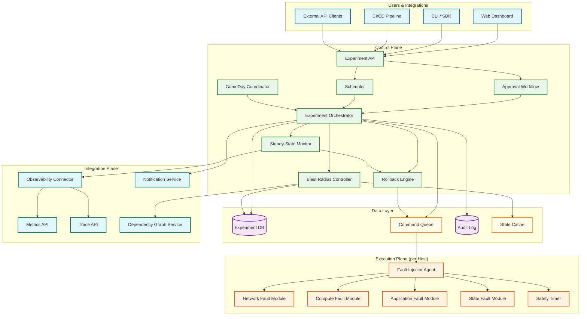
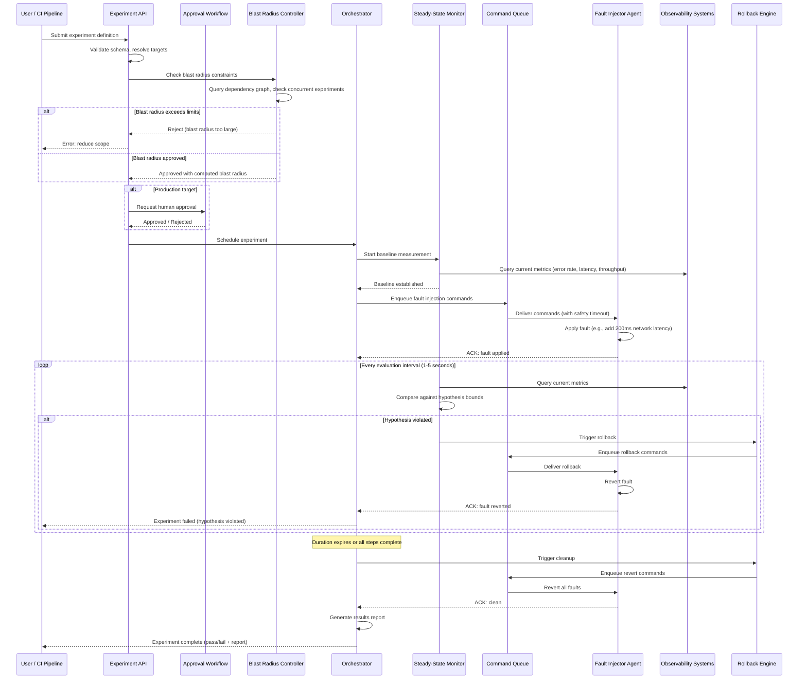
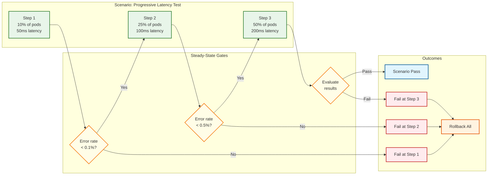

# High-Level Design — Chaos Engineering Platform

## System Architecture

The platform follows a three-tier architecture: **control plane** (experiment API, scheduler, blast radius controller, steady-state monitor), **execution plane** (fault injector agents deployed on target hosts), and **integration plane** (observability connectors, notification channels, CI/CD hooks).

---

## Experiment Lifecycle

---

## Data Flow: Multi-Step Scenario Execution

This diagram shows how a multi-step chaos scenario (progressive escalation) flows through the system — starting with a small blast radius and increasing if the system handles the initial fault.

---

## Component Dependency Matrix

| Component | Depends On | Depended On By | Failure Impact |
|-----------|-----------|---------------|----------------|
| **Experiment API** | DB, BRC, Approval Workflow | Users, CI/CD, Scheduler | No new experiments; active experiments unaffected |
| **Orchestrator** | DB, Queue, BRC, SSM, RB | API, Scheduler, GameDay | Active experiments lose coordination; agent safety timers take over |
| **BRC** | DB, Dependency Graph Service, Cache | Orchestrator, API | New experiments blocked (safe); active experiments continue |
| **SSM** | Observability Connector, Metrics/Traces | Orchestrator, RB | No hypothesis evaluation; experiments must abort (fail-closed) |
| **Rollback Engine** | Queue, Agent fleet | SSM, Orchestrator | Rollback commands delayed; agent safety timers provide backup |
| **Command Queue** | Persistent storage | Orchestrator, RB, Agents | All agent communication blocked; agents start partition timers |
| **Fault Injector Agent** | Queue, local disk | Orchestrator (via Queue) | Host cannot be targeted; active faults on that host continue until safety timeout |
| **Dependency Graph Service** | Service registry, observability | BRC | BRC uses cached graph; staleness risk but not blocked |
| **Audit Log** | Append-only storage | Compliance, reporting | Non-blocking; buffered writes tolerate brief unavailability |

## Failure Domain Analysis

| Domain | Components | Blast Radius on Failure | Isolation Strategy |
|--------|-----------|------------------------|-------------------|
| **Control Plane** | API, Orchestrator, BRC, SSM | Active experiments lose orchestration; agents provide safety fallback | Leader election with hot standby; agent-side autonomy |
| **Data Plane** | Command Queue, DB | Command delivery stops; state unavailable | Multi-AZ replication; WAL on orchestrator for partition survival |
| **Execution Plane** | Agents per host | Individual host loses chaos capability; faults may orphan on agent crash | Per-agent fault registry; startup reconciliation |
| **Integration Plane** | Observability, Notifications, Dep Graph | SSM cannot evaluate; notifications delayed; BRC uses stale graph | Circuit breakers; cached fallbacks; fail-closed policy |
| **Regional** | All components in one region | Region-scoped experiments affected; cross-region experiments continue | Regional relays; independent agent safety timers per region |

## Architectural Decision Records (ADRs)

### ADR-001: Agent-Side Autonomous Safety over Central-Only Control

**Status:** Accepted

**Context:** During a control plane failure, injected faults persist without monitoring or rollback capability. The question is whether to invest in extreme control plane HA (five-nines+) or provide an independent safety layer on the agent.

**Decision:** Each agent carries an independent safety timer that reverts all faults after a configurable timeout, regardless of control plane state.

**Consequences:** (+) Bounded impact window even during total control plane failure. (+) Agent safety is orthogonal to control plane reliability. (-) Agent may revert prematurely during network latency (conservative timeout). (-) Agent and control plane must reconcile after autonomous revert.

### ADR-002: Persistent Command Queue over Direct RPC

**Status:** Accepted

**Context:** Fault injection and rollback commands must reach agents reliably. Options: direct gRPC from orchestrator to agents, or queue-based delivery.

**Decision:** Use a persistent message queue for command delivery, with at-least-once semantics.

**Consequences:** (+) Commands survive broker restarts. (+) Decouples orchestrator from agent availability. (+) Natural fan-out for multi-agent experiments. (-) Added latency (queue hop). (-) Queue itself becomes a dependency requiring HA.

### ADR-003: Fail-Closed over Fail-Open for All Safety Mechanisms

**Status:** Accepted

**Context:** When a safety mechanism fails (SSM query error, BRC connectivity loss, agent heartbeat timeout), should the platform continue (fail-open) or abort (fail-closed)?

**Decision:** All safety mechanisms fail-closed: if safety cannot be verified, the experiment is aborted.

**Consequences:** (+) Safety is never compromised by component failures. (+) Simple reasoning model: "when in doubt, stop." (-) Higher false-abort rate. (-) Observability backend issues can cause experiment waste.

### ADR-004: Database-Backed State Machine over Event Sourcing

**Status:** Accepted

**Context:** Experiment lifecycle state transitions could be managed via a relational database with strict state machine constraints or via an event-sourced log.

**Decision:** Relational database with optimistic locking and explicit state transition validation.

**Consequences:** (+) Simple query model for dashboards and compliance. (+) Strong consistency via database transactions. (+) Easy crash recovery (read current state from DB). (-) State machine logic in application layer requires careful validation. (-) Schema evolution for new states requires migrations.

---

## Key Architectural Decisions

### 1. Agent-Based vs. Agentless Fault Injection

| Aspect | Agent-Based (Chosen) | Agentless (API-driven) |
|--------|---------------------|----------------------|
| **Fault types** | Full range: network (iptables/tc), compute (cgroups), process kill, disk fill, clock skew | Limited to cloud-provider API faults (instance stop, network ACL) |
| **Rollback reliability** | Agent has local timer — can autonomously revert if control plane is unreachable | Depends on control plane reaching cloud API for revert |
| **Deployment overhead** | Requires agent installation on every target host | No deployment; uses existing cloud/platform APIs |
| **Latency** | Sub-second fault application (local execution) | Seconds to minutes (API call → provider propagation) |
| **Recommendation** | Agent-based for host/container/network faults (precision + autonomous rollback); supplement with agentless for cloud-level faults (zone failure, managed service disruption) |

### 2. Push vs. Pull for Fault Commands

| Aspect | Push via Queue (Chosen) | Pull (Agent polls) |
|--------|------------------------|--------------------|
| **Latency** | Sub-second delivery via persistent connection | Bounded by poll interval (1-10 seconds) |
| **Rollback speed** | Immediate command delivery | Up to one poll interval delay |
| **Connection overhead** | Persistent WebSocket/gRPC connections from all agents | Periodic HTTP requests |
| **Partition behavior** | Agent detects disconnect immediately, starts safety timer | Agent may not know it's partitioned until next poll fails |
| **Recommendation** | Push for commands (latency-critical); pull as fallback reconciliation (agent periodically confirms its fault state matches control plane expectations) |

### 3. Centralized vs. Distributed Steady-State Evaluation

| Aspect | Centralized (Chosen) | Distributed (per-agent) |
|--------|---------------------|------------------------|
| **Global view** | Can evaluate aggregate metrics (cluster-wide error rate, cross-service latency) | Agent only sees local metrics |
| **Single point of failure** | SSM failure means no hypothesis checking — must be highly available | No central dependency |
| **Query efficiency** | Batches metric queries to observability backend | Each agent queries independently (N × query load) |
| **Recommendation** | Centralized SSM with HA (leader election); agents carry a local "safety kill switch" for hard limits (e.g., local CPU > 95% → auto-revert, regardless of SSM) |

### 4. Experiment State: Database vs. State Machine Service

| Aspect | Database-Backed State Machine (Chosen) | In-Memory State Service |
|--------|---------------------------------------|------------------------|
| **Durability** | Survives control plane restart; experiment state is always recoverable | Lost on crash unless checkpointed |
| **Consistency** | Database transactions enforce valid state transitions | Requires distributed consensus protocol |
| **Recovery** | On restart, load active experiments from DB and reconcile with agent states | Must rebuild state from agents or WAL |
| **Recommendation** | Database (relational) with strict state machine constraints; use optimistic locking for concurrent updates |

### 5. Safety Timeout: Server-Side vs. Agent-Side

| Aspect | Agent-Side Safety Timeout (Chosen) | Server-Side Only |
|--------|-----------------------------------|------------------|
| **Partition safety** | Agent autonomously reverts after timeout even if control plane is unreachable | If control plane is down, fault persists indefinitely |
| **Accuracy** | May revert prematurely if network is slow but experiment is still healthy | Central authority has full context |
| **Complexity** | Agents must maintain local experiment state and timers | Simpler agent logic |
| **Recommendation** | Defense-in-depth: agent-side timeout (conservative, e.g., 2× expected duration) + server-side orchestration (normal path). Agent timeout is a safety net, not the primary control mechanism |

---

## Architecture Pattern Checklist

- [x] **Sync vs Async communication decided** — Sync for API calls and approval workflows; async (message queue) for agent commands
- [x] **Event-driven vs Request-response decided** — Event-driven for experiment lifecycle (state transitions emit events to SSM, audit log, notifications); request-response for API and metric queries
- [x] **Push vs Pull model decided** — Push for fault commands via persistent connections; pull for reconciliation
- [x] **Stateless vs Stateful services identified** — Orchestrator is stateful (experiment lifecycle); API servers are stateless; agents are stateful (local fault state + safety timer)
- [x] **Read-heavy vs Write-heavy optimization applied** — Write-light (experiment CRUD is low-volume); read-heavy during experiments (continuous metric queries)
- [x] **Real-time vs Batch processing decided** — Real-time for steady-state monitoring and rollback; batch for post-experiment analytics and report generation
- [x] **Defense-in-depth for safety** — Multiple independent safety mechanisms: blast radius controller, steady-state monitor, agent safety timeout, concurrent experiment limits

---

## Component Interaction Summary

| Component | Inputs | Outputs | State |
|-----------|--------|---------|-------|
| Experiment API | User requests, CI/CD triggers | Validated experiment definitions | Stateless (delegates to DB) |
| Blast Radius Controller | Experiment targets, dependency graph | Approved/rejected blast radius | Active experiment registry, dependency cache |
| Experiment Orchestrator | Scheduled experiments, approval results | Fault commands, rollback triggers, results | Experiment state machine (DB-backed) |
| Steady-State Monitor | Real-time metrics from observability | Hypothesis pass/fail signals | Baseline measurements, evaluation history |
| Rollback Engine | Abort triggers from SSM, timeouts, manual | Revert commands to agents | Rollback state per experiment |
| Fault Injector Agent | Fault commands from queue | ACK/NACK, health heartbeats | Local fault state, safety timers |
| GameDay Coordinator | GameDay definitions, participant actions | Orchestrated experiment sequences, reports | GameDay state, team assignments |
| Scheduler | Cron definitions, one-time schedules | Experiment triggers at scheduled times | Schedule registry |

---

## Architecture Case Studies

### Case Study 1: From Chaos Monkey to ChAP — Evolution at a Streaming Giant

**Phase 1 (2011-2014):** Random instance termination (Chaos Monkey). No blast radius control, no steady-state hypothesis. Engineers watched dashboards manually. Coverage: ~20% of services ever tested.

**Phase 2 (2015-2018):** FIT (Failure Injection Testing) added L7 injection capabilities via service mesh sidecars. Introduced steady-state hypotheses and automated rollback. Coverage increased to ~60% of services.

**Phase 3 (2019-present):** ChAP (Chaos Automation Platform) integrated chaos into CI/CD — every deployment triggers a targeted experiment. ML-based experiment selection prioritizes services with high deployment frequency and low chaos coverage. Coverage: ~95% of services with continuous re-validation.

**Architectural lesson:** The evolution from "random kills" to "targeted, deployment-integrated experiments" shows that the platform's experiment selection intelligence and CI/CD integration are ultimately more valuable than raw fault injection capabilities. The architecture must plan for this evolution — starting with a simple fault injector but designing the experiment API, result storage, and scoring engine to support progressive automation.

### Case Study 2: Cell-Based Chaos at an E-Commerce Giant

A large e-commerce platform uses cell-based architecture where each "cell" serves a subset of customers. Their chaos platform leverages cell boundaries as natural blast radius containment:

- Experiments target individual cells, limiting customer impact to the fraction of users routed to that cell (~2% of total traffic per cell)
- The blast radius controller integrates with the cell routing layer to estimate revenue-per-minute impact before approving experiments
- During peak shopping events, chaos experiments are restricted to "shadow cells" (cells receiving replicated traffic but not serving real customers)
- The platform maintains a "cell chaos rotation" — each cell is chaos-tested at least once per week, ensuring all cells are validated continuously

**Architectural lesson:** When the underlying infrastructure has built-in isolation boundaries (cells, shards, tenants), the chaos platform should leverage them rather than implementing blast radius control purely at the instance level. The BRC must integrate with the deployment topology, not just the service dependency graph.

### Case Study 3: Regulatory-Constrained Chaos in Financial Services

A multinational bank needed chaos engineering for their payment processing systems but faced regulatory constraints: intentional production disruption during market hours could violate financial regulations. Their architecture adaptations:

- **Time-windowed chaos:** Production experiments only run during a 4-hour weekend window (Saturday 2 AM – 6 AM UTC) when transaction volumes are <5% of peak
- **Shadow-first validation:** All experiments must pass in a shadow environment (receiving replicated production traffic) before being approved for production
- **Regulatory documentation:** The platform generates compliance artifacts for each experiment: pre-approval record, blast radius declaration, duration bounds, rollback proof, and post-experiment SLA impact report
- **Dual-approval with compliance officer:** Production experiments require approval from both the engineering team lead and a compliance officer who validates the experiment does not violate regulatory constraints

**Architectural lesson:** Regulated industries require the platform to produce compliance documentation as a first-class output alongside experiment results. The approval workflow must be extensible to include non-engineering stakeholders (compliance, legal, risk management). The scheduling engine must enforce time-window restrictions that are tamper-proof (not overridable by individual engineers).
