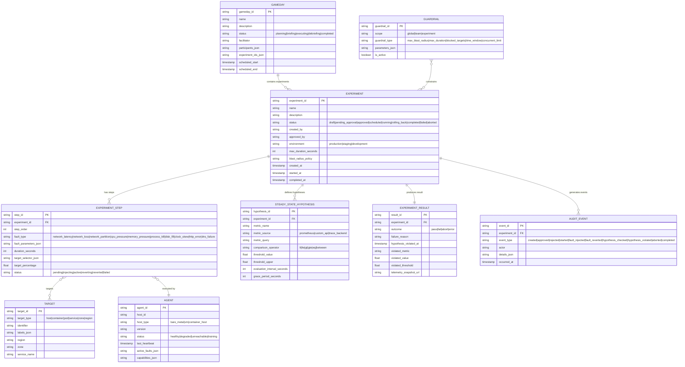
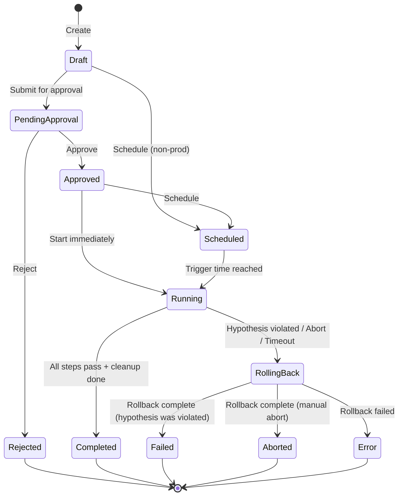

# Low-Level Design — Chaos Engineering Platform

## Data Model

### Core Entities



---

## API Design

### Experiment Management

```
POST   /api/v1/experiments                    Create new experiment
GET    /api/v1/experiments                    List experiments (filterable)
GET    /api/v1/experiments/{id}               Get experiment details + status
PUT    /api/v1/experiments/{id}               Update experiment (only in draft)
DELETE /api/v1/experiments/{id}               Delete experiment (only if not running)

POST   /api/v1/experiments/{id}/approve       Approve experiment for execution
POST   /api/v1/experiments/{id}/start         Start approved experiment
POST   /api/v1/experiments/{id}/abort         Abort running experiment
GET    /api/v1/experiments/{id}/results       Get experiment results
GET    /api/v1/experiments/{id}/timeline      Get experiment event timeline
```

### Steady-State & Monitoring

```
GET    /api/v1/experiments/{id}/hypothesis    Get current hypothesis status
GET    /api/v1/experiments/{id}/metrics       Get real-time metric values
GET    /api/v1/experiments/{id}/baseline      Get baseline measurements
```

### Blast Radius

```
POST   /api/v1/blast-radius/validate         Validate blast radius before experiment
GET    /api/v1/blast-radius/active            Get current aggregate blast radius (all experiments)
GET    /api/v1/blast-radius/dependency-graph  Get service dependency graph
```

### Agent Management

```
GET    /api/v1/agents                         List registered agents
GET    /api/v1/agents/{id}                    Get agent status and active faults
POST   /api/v1/agents/{id}/drain             Drain agent (revert all faults, stop accepting)
GET    /api/v1/agents/health                  Cluster-wide agent health summary
```

### GameDay

```
POST   /api/v1/gamedays                      Create GameDay event
GET    /api/v1/gamedays/{id}                  Get GameDay status
POST   /api/v1/gamedays/{id}/start           Start GameDay execution
POST   /api/v1/gamedays/{id}/advance         Advance to next phase
POST   /api/v1/gamedays/{id}/abort           Abort all GameDay experiments
GET    /api/v1/gamedays/{id}/report          Get post-GameDay report
```

### Guardrails

```
GET    /api/v1/guardrails                     List active guardrails
POST   /api/v1/guardrails                     Create guardrail
PUT    /api/v1/guardrails/{id}               Update guardrail
DELETE /api/v1/guardrails/{id}               Delete guardrail (requires admin)
```

---

## Core Algorithms

### Algorithm 1: Blast Radius Calculation

The blast radius controller computes the effective impact of an experiment by traversing the service dependency graph to find all services that would be affected by a fault on the target.

```
FUNCTION calculate_blast_radius(experiment):
    direct_targets = resolve_target_selector(experiment.target_selector)

    // Compute direct blast radius (percentage of target service affected)
    FOR EACH service IN unique_services(direct_targets):
        total_instances = count_instances(service)
        affected_instances = count(direct_targets WHERE service = service)
        direct_impact[service] = affected_instances / total_instances

    // Traverse dependency graph for indirect impact
    dependency_graph = load_service_dependency_graph()
    indirect_targets = SET()

    FOR EACH service IN direct_impact.keys():
        downstream = dependency_graph.get_dependents(service)
        FOR EACH dep IN downstream:
            // Indirect impact is proportional to direct impact × dependency weight
            dep_weight = dependency_graph.get_weight(service, dep)
            indirect_impact[dep] = direct_impact[service] × dep_weight
            indirect_targets.add(dep)

    // Check against guardrails
    all_guardrails = load_active_guardrails(experiment.scope)
    FOR EACH guardrail IN all_guardrails:
        IF guardrail.type = "max_blast_radius":
            FOR EACH service IN direct_impact ∪ indirect_impact:
                IF impact[service] > guardrail.max_percentage:
                    RETURN BlastRadiusResult(
                        approved = FALSE,
                        violation = "Service " + service + " impact " + impact[service]
                                    + " exceeds limit " + guardrail.max_percentage
                    )

        IF guardrail.type = "blocked_targets":
            FOR EACH target IN direct_targets:
                IF target IN guardrail.blocked_list:
                    RETURN BlastRadiusResult(approved = FALSE, violation = "Target is blocked")

    // Check concurrent experiment overlap
    active_experiments = load_active_experiments()
    FOR EACH active IN active_experiments:
        overlapping_targets = intersect(direct_targets, active.targets)
        IF overlapping_targets IS NOT EMPTY:
            RETURN BlastRadiusResult(
                approved = FALSE,
                violation = "Overlaps with experiment " + active.id
                            + " on targets: " + overlapping_targets
            )

    RETURN BlastRadiusResult(
        approved = TRUE,
        direct_impact = direct_impact,
        indirect_impact = indirect_impact,
        total_services_affected = len(direct_impact) + len(indirect_impact),
        total_instances_affected = len(direct_targets)
    )
```

### Algorithm 2: Steady-State Hypothesis Evaluation

```
FUNCTION evaluate_steady_state(experiment):
    hypotheses = load_hypotheses(experiment.id)

    FOR EACH hypothesis IN hypotheses:
        // Query the observability backend
        current_value = query_metric(
            source = hypothesis.metric_source,
            query = hypothesis.metric_query,
            window = hypothesis.evaluation_interval_seconds
        )

        IF current_value IS NULL OR current_value IS ERROR:
            // Observability system may be down — this is a safety concern
            consecutive_query_failures[hypothesis.id] += 1
            IF consecutive_query_failures[hypothesis.id] >= MAX_QUERY_FAILURES:
                RETURN HypothesisResult(
                    status = ABORT,
                    reason = "Cannot evaluate hypothesis: observability unavailable for "
                             + hypothesis.metric_name
                )
            CONTINUE  // Skip this cycle, try again next interval

        consecutive_query_failures[hypothesis.id] = 0

        // Compare against threshold
        violated = FALSE
        SWITCH hypothesis.comparison_operator:
            CASE "lt":  violated = current_value >= hypothesis.threshold_value
            CASE "lte": violated = current_value > hypothesis.threshold_value
            CASE "gt":  violated = current_value <= hypothesis.threshold_value
            CASE "gte": violated = current_value < hypothesis.threshold_value
            CASE "between":
                violated = current_value < hypothesis.threshold_value
                        OR current_value > hypothesis.threshold_upper

        IF violated:
            // Check grace period (allow brief transients)
            IF NOT in_grace_period(hypothesis):
                mark_grace_period_start(hypothesis)
                CONTINUE

            IF grace_period_elapsed(hypothesis):
                RETURN HypothesisResult(
                    status = VIOLATED,
                    metric = hypothesis.metric_name,
                    expected = hypothesis.threshold_value,
                    actual = current_value,
                    violated_at = NOW()
                )
        ELSE:
            // Metric is within bounds — reset grace period if any
            reset_grace_period(hypothesis)

    RETURN HypothesisResult(status = HEALTHY)
```

### Algorithm 3: Agent-Side Safety Timeout

```
FUNCTION agent_safety_loop():
    // Runs continuously on each fault injector agent
    WHILE agent_is_running:
        FOR EACH active_fault IN local_fault_registry:
            // Check 1: Has the safety timeout expired?
            elapsed = NOW() - active_fault.injected_at
            IF elapsed > active_fault.safety_timeout:
                LOG_WARNING("Safety timeout expired for fault " + active_fault.id)
                revert_fault(active_fault)
                report_autonomous_revert(active_fault, reason = "safety_timeout")
                REMOVE active_fault FROM local_fault_registry
                CONTINUE

            // Check 2: Have we lost contact with control plane?
            time_since_heartbeat_ack = NOW() - last_control_plane_ack
            IF time_since_heartbeat_ack > HEARTBEAT_TIMEOUT:
                // Control plane may be down — start partition timer
                IF NOT partition_timer_started:
                    partition_timer_started = TRUE
                    partition_timer_start = NOW()
                    LOG_WARNING("Lost contact with control plane")

                IF NOW() - partition_timer_start > PARTITION_SAFETY_TIMEOUT:
                    LOG_ERROR("Partition timeout: reverting all faults")
                    FOR EACH fault IN local_fault_registry:
                        revert_fault(fault)
                        report_autonomous_revert(fault, reason = "partition_timeout")
                    CLEAR local_fault_registry
            ELSE:
                partition_timer_started = FALSE

            // Check 3: Local health check (agent-side guardrail)
            IF active_fault.has_local_health_check:
                local_metric = measure_local_metric(active_fault.health_check_metric)
                IF local_metric > active_fault.health_check_threshold:
                    LOG_WARNING("Local health check failed: " + active_fault.health_check_metric)
                    revert_fault(active_fault)
                    report_autonomous_revert(active_fault, reason = "local_health_check")
                    REMOVE active_fault FROM local_fault_registry

        SLEEP(SAFETY_CHECK_INTERVAL)  // e.g., 1 second
```

### Algorithm 4: Progressive Escalation Orchestration

```
FUNCTION execute_scenario(scenario):
    steps = scenario.steps  // Ordered list of fault injection steps

    // Phase 1: Establish baseline
    baseline = measure_baseline(scenario.hypotheses, duration = 60 seconds)
    IF baseline.is_unstable:
        RETURN ScenarioResult(
            outcome = ABORT,
            reason = "System is not in steady state before experiment"
        )

    results = []

    FOR EACH step IN steps:
        // Phase 2a: Validate blast radius for this step
        blast_check = calculate_blast_radius(step)
        IF NOT blast_check.approved:
            rollback_all_previous_steps(results)
            RETURN ScenarioResult(outcome = FAIL, reason = blast_check.violation)

        // Phase 2b: Inject fault
        injection_result = inject_fault(step)
        IF injection_result.failed:
            rollback_all_previous_steps(results)
            RETURN ScenarioResult(outcome = ERROR, reason = injection_result.error)

        results.append(injection_result)

        // Phase 2c: Wait for observation period
        observation_start = NOW()
        WHILE NOW() - observation_start < step.duration:
            hypothesis_result = evaluate_steady_state(scenario)

            IF hypothesis_result.status = VIOLATED:
                // System cannot handle this level of fault
                rollback_all_previous_steps(results)
                RETURN ScenarioResult(
                    outcome = FAIL,
                    failed_at_step = step.order,
                    violation = hypothesis_result
                )

            IF hypothesis_result.status = ABORT:
                rollback_all_previous_steps(results)
                RETURN ScenarioResult(outcome = ABORT, reason = hypothesis_result.reason)

            SLEEP(scenario.evaluation_interval)

        // Phase 2d: Step passed — check if there's a next step
        IF step.revert_before_next:
            revert_fault(step)

    // Phase 3: All steps passed — clean up
    rollback_all_previous_steps(results)
    RETURN ScenarioResult(outcome = PASS, steps_completed = len(steps))
```

---

## Fault Injection Modules (Agent-Side)

### Network Fault Module

```
FUNCTION inject_network_latency(params):
    // Uses traffic control (tc) and network emulation (netem) subsystems
    target_interface = resolve_interface(params.target)

    command = BUILD_TC_COMMAND(
        interface = target_interface,
        delay_ms = params.latency_ms,
        jitter_ms = params.jitter_ms,
        correlation = params.correlation_percent,
        target_ips = params.target_ips,         // Optional: only affect specific destinations
        target_ports = params.target_ports      // Optional: only affect specific ports
    )

    // Record revert command BEFORE applying (critical for safety)
    revert_command = BUILD_TC_REVERT_COMMAND(interface = target_interface)
    store_revert_command(params.fault_id, revert_command)

    execute(command)
    verify_fault_applied(target_interface, expected_latency = params.latency_ms)

    RETURN FaultResult(status = APPLIED, revert_stored = TRUE)

FUNCTION inject_network_partition(params):
    // Uses firewall rules to drop traffic between specified endpoints
    FOR EACH target_ip IN params.blocked_ips:
        rule = BUILD_FIREWALL_RULE(
            action = DROP,
            direction = params.direction,   // ingress, egress, or both
            target_ip = target_ip,
            target_ports = params.target_ports
        )
        store_revert_command(params.fault_id, REVERT_RULE(rule))
        apply_firewall_rule(rule)

    RETURN FaultResult(status = APPLIED)
```

### Compute Fault Module

```
FUNCTION inject_cpu_pressure(params):
    // Spawns worker processes/threads that consume CPU
    num_workers = calculate_workers(
        target_cpu_percent = params.cpu_percent,
        available_cores = get_cpu_count()
    )

    worker_pids = []
    FOR i = 1 TO num_workers:
        pid = spawn_cpu_worker()  // Tight loop burning CPU cycles
        worker_pids.append(pid)

    // If targeting a specific container, constrain workers to same cgroup
    IF params.target_cgroup IS NOT NULL:
        FOR EACH pid IN worker_pids:
            assign_to_cgroup(pid, params.target_cgroup)

    store_revert_command(params.fault_id, KILL_PIDS(worker_pids))

    RETURN FaultResult(status = APPLIED, worker_pids = worker_pids)
```

---

## State Machine: Experiment Lifecycle



---

## Command Message Schema

```
ExperimentCommand:
    command_id:       string (UUID)
    experiment_id:    string
    step_id:          string
    command_type:     "inject" | "revert" | "revert_all" | "health_check"
    fault_type:       string
    fault_parameters: map<string, any>
    target_agent_id:  string
    safety_timeout:   int (seconds)
    issued_at:        timestamp
    expires_at:       timestamp  // Command is invalid after this time
    idempotency_key:  string     // Prevents duplicate execution

AgentAck:
    command_id:       string
    agent_id:         string
    status:           "applied" | "reverted" | "failed" | "expired"
    error_message:    string (optional)
    applied_at:       timestamp
    local_state:      map<string, any>  // Current fault state on this agent
```

---

## Algorithm 5: Experiment Conflict Detector

When multiple experiments could target overlapping services, the conflict detector identifies incompatible fault combinations before the BRC even evaluates blast radius.

```
FUNCTION detect_experiment_conflicts(new_experiment, active_experiments):
    conflicts = []

    new_targets = resolve_target_selector(new_experiment.target_selector)
    new_services = unique_services(new_targets)

    FOR EACH active IN active_experiments:
        active_targets = active.resolved_targets
        active_services = unique_services(active_targets)

        // Level 1: Direct target overlap
        overlapping_hosts = intersect(new_targets, active_targets)
        IF overlapping_hosts IS NOT EMPTY:
            // Check fault compatibility on overlapping hosts
            FOR EACH host IN overlapping_hosts:
                new_fault = new_experiment.fault_type
                active_fault = active.fault_type

                IF faults_conflict(new_fault, active_fault, host):
                    conflicts.append(Conflict(
                        type = "HOST_LEVEL",
                        host = host,
                        reason = new_fault + " conflicts with " + active_fault,
                        severity = BLOCKING
                    ))

        // Level 2: Service-level semantic conflict
        overlapping_services = intersect(new_services, active_services)
        IF overlapping_services IS NOT EMPTY:
            FOR EACH service IN overlapping_services:
                combined_impact = active.impact[service] + new_experiment.estimated_impact[service]
                IF combined_impact > service.blast_radius_ceiling:
                    conflicts.append(Conflict(
                        type = "SERVICE_LEVEL",
                        service = service,
                        reason = "Combined impact " + combined_impact + " exceeds ceiling",
                        severity = BLOCKING
                    ))

        // Level 3: Indirect dependency conflict
        new_deps = dependency_graph.get_all_dependents(new_services)
        active_deps = dependency_graph.get_all_dependents(active_services)
        indirect_overlap = intersect(new_deps, active_deps)
        IF indirect_overlap IS NOT EMPTY:
            conflicts.append(Conflict(
                type = "TRANSITIVE",
                services = indirect_overlap,
                reason = "Experiments share downstream dependency impact",
                severity = WARNING  // Not blocking, but noteworthy
            ))

    RETURN ConflictResult(
        has_blocking_conflicts = any(c.severity == BLOCKING for c in conflicts),
        conflicts = conflicts
    )

FUNCTION faults_conflict(fault_a, fault_b, host):
    // Same-layer faults on the same host always conflict
    IF fault_a.layer == fault_b.layer:
        // Exception: different ports or different target IPs can coexist
        IF fault_a.layer == "network":
            RETURN overlaps(fault_a.target_ports, fault_b.target_ports)
                OR overlaps(fault_a.target_ips, fault_b.target_ips)
        RETURN TRUE  // CPU stress + CPU stress = uncontrolled

    // Cross-layer faults are generally safe (network + CPU can coexist)
    RETURN FALSE
```

## Algorithm 6: GameDay Phase Transition Engine

GameDays progress through structured phases with automated gating between each phase.

```
FUNCTION execute_gameday(gameday):
    phases = [BRIEFING, INJECTION, OBSERVATION, ESCALATION, DEBRIEF]

    FOR EACH phase IN phases:
        // Phase entry gate: all prerequisites must be met
        prerequisites = get_phase_prerequisites(gameday, phase)
        FOR EACH prereq IN prerequisites:
            IF NOT prereq.is_satisfied():
                LOG("Waiting for prerequisite: " + prereq.description)
                WAIT_FOR(prereq, timeout = gameday.phase_timeout)
                IF NOT prereq.is_satisfied():
                    RETURN GameDayResult(
                        outcome = INCOMPLETE,
                        stalled_at = phase,
                        reason = "Prerequisite not met: " + prereq.description
                    )

        // Execute phase
        SWITCH phase:
            CASE BRIEFING:
                // Verify all participants are present
                verify_participant_attendance(gameday.participants)
                // Share experiment plan, success criteria, abort procedures
                publish_briefing_materials(gameday)
                // Wait for facilitator to advance
                WAIT_FOR_MANUAL_ADVANCE(gameday, timeout = 30 MINUTES)

            CASE INJECTION:
                // Start experiments in declared order
                FOR EACH experiment_group IN gameday.experiment_groups:
                    // Each group runs in parallel; groups run sequentially
                    FOR EACH experiment IN experiment_group:
                        start_experiment(experiment)
                    WAIT_FOR_ALL(experiment_group, completion_or_timeout)

                    // Gate: check if any experiment in the group failed
                    IF any_experiment_failed(experiment_group):
                        IF gameday.abort_on_failure:
                            abort_all_gameday_experiments(gameday)
                            GOTO DEBRIEF
                        ELSE:
                            record_failure_and_continue(experiment_group)

            CASE OBSERVATION:
                // Hold period: all experiments running, teams observe
                observation_duration = gameday.observation_duration
                WAIT(observation_duration)
                // Collect observations from each team
                FOR EACH team IN gameday.teams:
                    observations[team] = collect_team_observations(team)

            CASE ESCALATION:
                // Progressive increase in fault severity
                IF gameday.has_escalation_steps:
                    FOR EACH escalation IN gameday.escalation_steps:
                        apply_escalation(escalation)
                        WAIT(escalation.observation_period)
                        IF any_slo_violated(escalation.target_slos):
                            record_escalation_limit(escalation)
                            BREAK

            CASE DEBRIEF:
                // Auto-revert all remaining faults
                abort_all_gameday_experiments(gameday)
                // Generate GameDay report
                report = generate_gameday_report(gameday, observations)
                publish_report(report, gameday.distribution_list)

    RETURN GameDayResult(outcome = COMPLETED, report = report)
```

---

## Internal APIs (Agent ↔ Control Plane gRPC)

```
service ChaosAgentService {
    // Bidirectional stream for command delivery and health reporting
    rpc CommandStream(stream AgentStatus) returns (stream ExperimentCommand);

    // Agent registration on startup
    rpc RegisterAgent(AgentRegistration) returns (RegistrationAck);

    // Agent reports autonomous revert
    rpc ReportAutonomousRevert(RevertReport) returns (RevertAck);

    // Agent requests current expected state (for reconciliation)
    rpc GetExpectedState(AgentId) returns (ExpectedFaultState);
}

service ExperimentOrchestrationService {
    // Submit new experiment for validation and scheduling
    rpc SubmitExperiment(ExperimentDefinition) returns (SubmissionResult);

    // Get real-time experiment status
    rpc GetExperimentStatus(ExperimentId) returns (ExperimentStatus);

    // Abort a running experiment
    rpc AbortExperiment(AbortRequest) returns (AbortResult);

    // Validate blast radius without starting experiment
    rpc ValidateBlastRadius(BlastRadiusRequest) returns (BlastRadiusResult);
}
```

---

## Error Code Classification

| Range | Category | Examples |
|-------|----------|---------|
| **1000-1099** | Authentication/Authorization | 1001: Invalid token, 1010: Insufficient permissions, 1020: Cross-namespace violation |
| **2000-2099** | Blast Radius Validation | 2001: Exceeds ceiling, 2010: Target conflict, 2020: Blocked target, 2030: Stale dependency graph |
| **3000-3099** | Experiment Lifecycle | 3001: Invalid state transition, 3010: Approval required, 3020: Duration exceeded, 3030: Already running |
| **4000-4099** | Agent Communication | 4001: Agent unreachable, 4010: Command delivery timeout, 4020: Agent version incompatible |
| **5000-5099** | Safety System | 5001: Hypothesis evaluation failure, 5010: Observability unavailable, 5020: Orphaned fault detected, 5030: Emergency abort triggered |
| **6000-6099** | GameDay | 6001: Participant not present, 6010: Phase prerequisite not met, 6020: GameDay abort |
| **7000-7099** | Infrastructure | 7001: Database unavailable, 7010: Queue overloaded, 7020: Regional relay down |
