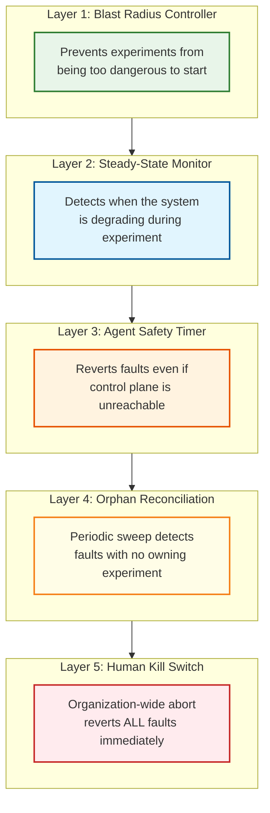
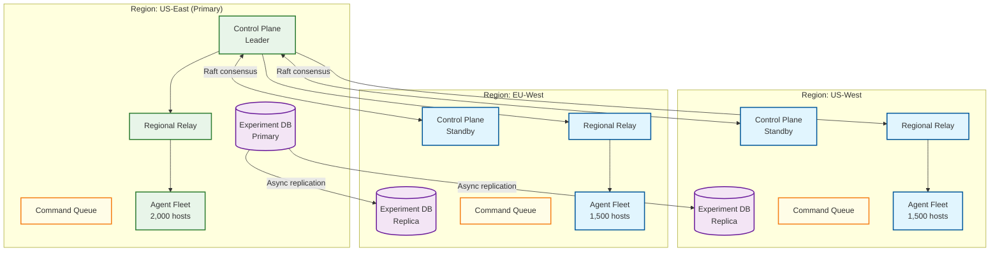

# Scalability & Reliability — Chaos Engineering Platform

## Scalability

### Horizontal vs. Vertical Scaling

| Component | Scaling Strategy | Rationale |
|-----------|-----------------|-----------|
| Experiment API | **Horizontal** | Stateless HTTP servers behind a load balancer; add instances for more concurrent users/CI pipelines |
| Experiment Orchestrator | **Vertical (leader)** | Single-leader with standby replicas; leader handles all state transitions for consistency |
| Blast Radius Controller | **Vertical (leader)** | Must maintain global view of active experiments; single authority for blast radius decisions |
| Steady-State Monitor | **Horizontal (partitioned)** | Partition by experiment — each SSM instance monitors a subset of experiments |
| Command Queue | **Horizontal** | Partitioned by agent group or region; independent scaling per partition |
| Fault Injector Agents | **Scale with infrastructure** | One agent per host; agents scale linearly with infrastructure size |
| Dashboard & Reporting | **Horizontal** | Stateless; scale based on user traffic |
| Audit Log | **Horizontal (append-only)** | Partitioned by time; write-optimized append-only stores |

### Auto-Scaling Triggers

| Component | Metric | Scale-Up Threshold | Scale-Down Threshold | Cooldown |
|-----------|--------|-------------------|----------------------|----------|
| Experiment API | Request latency p99 | >1s for 3 min | <200ms for 10 min | 5 min |
| SSM instances | Experiments per SSM | >20 concurrent | <5 concurrent | 10 min |
| Command queue consumers | Queue depth | >1,000 pending | <100 pending | 5 min |
| Dashboard | CPU utilization | >70% for 3 min | <30% for 10 min | 5 min |

### Scaling the Agent Fleet

The agent fleet scales linearly with infrastructure. Key design decisions for operating at scale:

**Agent Registration:** Agents self-register with the control plane on startup. Registration is idempotent (re-registering an existing agent updates its metadata). The control plane does not maintain a pre-configured list of agents — it discovers agents dynamically.

**Heartbeat Optimization:** With 5,000 agents heartbeating every 60 seconds, the control plane receives ~83 heartbeats/second — trivial. But during a GameDay with 50,000 agents across multiple environments, this becomes ~833/second. Optimizations:

| Strategy | Description | Benefit |
|----------|-------------|---------|
| Jittered intervals | Each agent heartbeats at 60s ± random(0-15s) | Prevents thundering herd |
| Regional aggregation | Regional proxies aggregate heartbeats before forwarding | Reduces cross-region traffic |
| Conditional heartbeat | Agent sends heartbeat only if state changed or interval elapsed | Reduces volume by ~50% during quiet periods |
| Batch health reporting | Control plane processes heartbeats in batches of 100 | Amortizes DB write overhead |

**Agent Upgrade:** Rolling upgrades across thousands of agents must not disrupt active experiments. The upgrade process:

1. Drain: agent stops accepting new experiments (existing faults continue)
2. Quiesce: wait for active experiments on this agent to complete or be migrated
3. Upgrade: replace binary, restart agent
4. Verify: agent re-registers, confirms no orphaned faults
5. Re-enable: agent accepts new experiments

### Scaling Experiments

| Scale Level | Concurrent Experiments | Agents Involved | Design Consideration |
|-------------|----------------------|-----------------|---------------------|
| Small (startup) | 1-5 | 10-50 | Single orchestrator, in-memory state, embedded SSM |
| Medium (enterprise) | 10-50 | 100-5,000 | Leader-elected orchestrator, DB-backed state, partitioned SSM |
| Large (hyperscale) | 50-200 | 5,000-50,000 | Regional orchestrators with global coordination, federated blast radius, hierarchical agent management |
| GameDay (burst) | 20-100 simultaneous | 1,000-10,000 | Pre-allocated capacity, pre-validated blast radius, dedicated SSM pool |

### Caching Layers

| Layer | What Is Cached | Size | TTL | Invalidation |
|-------|---------------|------|-----|-------------|
| BRC: dependency graph | Service dependency edges | 10-50 MB | 5 min | Event-driven (deployment, scaling) |
| BRC: active experiments | Current blast radius reservations | 1-10 MB | Real-time | Immediately on experiment state change |
| SSM: metric baselines | Pre-experiment metric values | 1-5 MB | Duration of experiment | Cleared on experiment completion |
| SSM: query results | Recent metric query results | 10-50 MB | 5-10 seconds | Time-based (stale data is dangerous) |
| API: experiment templates | Library of pre-built experiments | 5-20 MB | 1 hour | On template update |
| Agent: control plane state | Expected fault state from CP | 1-5 MB | Heartbeat cycle | On each heartbeat ACK |

---

## Reliability

### The Meta-Reliability Problem

The chaos engineering platform faces a unique reliability challenge: **it must be more reliable than the systems it tests.** If the platform fails during an experiment, injected faults may persist without monitoring or rollback capability. This means the chaos platform is arguably the most reliability-critical system in the entire infrastructure — which is ironic for a tool designed to test reliability.

### Failure Mode Analysis

| Failure | Impact | Mitigation |
|---------|--------|------------|
| **Orchestrator crash** | Active experiments lose coordination; no new experiments can start | Leader election promotes standby; new leader loads active experiments from DB and reconciles with agent states |
| **SSM crash** | Hypothesis monitoring stops; system may be degrading without detection | Redundant SSM with automatic failover; agents carry local safety timeouts as independent safety net |
| **BRC crash** | No new experiments can start (safe); active experiments continue normally | BRC restarts quickly; active experiment reservations are DB-persisted and survive crash |
| **Command queue failure** | Fault commands and rollback commands cannot be delivered | Agents detect lost connection and start partition timer; autonomous revert after timeout |
| **Agent crash** | Faults on that host may or may not persist depending on fault type | Agent startup reconciliation: check local fault registry, revert expired faults |
| **Database failure** | Experiment state is unavailable; new experiments rejected | Multi-AZ replication; read-only standby for critical reads (active experiment list) |
| **Observability system failure** | SSHE cannot evaluate hypotheses | SSHE aborts experiments after N consecutive query failures; agents have independent local health checks |
| **Network partition (CP ↔ agent)** | Agent cannot receive rollback commands | Agent-side partition timeout: autonomous revert after configurable duration |
| **Network partition (CP ↔ DB)** | Orchestrator cannot persist state changes | Orchestrator writes to local WAL; reconciles with DB on partition heal; rejects new experiments during partition |

### Defense-in-Depth: The Five Layers of Safety



**Layer 1 (Prevention):** The BRC prevents experiments from starting if they exceed safety limits. This is the cheapest safety mechanism — no fault is ever injected.

**Layer 2 (Detection):** The SSHE continuously monitors the system during experiments. If the system degrades beyond acceptable bounds, it triggers rollback. Time to detect: 5-30 seconds.

**Layer 3 (Autonomous Recovery):** Each agent carries a safety timer. If the control plane becomes unreachable or the experiment exceeds its maximum duration, the agent autonomously reverts all faults. No central coordination required.

**Layer 4 (Reconciliation):** A background reconciliation process periodically scans all agents for faults that have no corresponding active experiment in the database. These "orphaned faults" are reverted and logged. This catches edge cases that Layers 1-3 miss.

**Layer 5 (Human Override):** A "big red button" that sends a revert-all command to every agent in the fleet. This is the last resort, used during incidents when automated safety mechanisms are insufficient or untrustworthy.

### Disaster Recovery

| Scenario | RTO | RPO | Recovery Procedure |
|----------|-----|-----|--------------------|
| Control plane failure (single node) | <30s | 0 | Leader election promotes standby; active experiments continue |
| Control plane failure (total) | <5 min | 0 | Agent safety timers revert all faults; experiments are effectively aborted |
| Database corruption | <15 min | ~1 min | Restore from replica; reconcile with agent states |
| Agent fleet upgrade failure (partial) | <10 min | 0 | Roll back agent binary; new agents self-register |
| Chaos platform causes cascading failure | Immediate | N/A | All-agents revert (Layer 5); post-mortem to improve guardrails |

### Chaos-Testing the Chaos Platform

The platform should undergo its own chaos testing (recursive chaos). Key experiments:

| Test | Fault Injected | Expected Behavior |
|------|---------------|-------------------|
| Orchestrator crash during experiment | Kill orchestrator process | Standby takes over; experiment continues or safely aborts |
| Agent network partition | Block agent ↔ control plane traffic | Agent reverts faults after partition timeout |
| SSM metric query failure | Block SSM ↔ metrics backend traffic | SSHE aborts experiments after N failures |
| Database failover | Trigger DB failover during experiment creation | API retries; no duplicate experiments created |
| Simultaneous GameDay + unplanned incident | Real incident during GameDay | GameDay abort triggered; all GameDay faults reverted within 30s |

---

## Scaling Fault Injection Across Large Fleets

### Agent Fleet Scaling Challenges

As the agent fleet grows beyond 5,000 hosts, three scaling challenges emerge:

**1. Heartbeat Storm at Scale**

With 50,000 agents sending heartbeats at 1/minute, the control plane receives ~833 heartbeats/second. This is manageable, but during a fleet-wide experiment start/stop, heartbeat-like traffic spikes with status updates.

```
FUNCTION manage_agent_heartbeats(fleet_size):
  // Jittered heartbeat: each agent adds random delay [0, interval)
  heartbeat_interval = 60  // seconds
  jitter = RANDOM(0, heartbeat_interval)

  // Batch heartbeat processing
  heartbeat_buffer = []
  EVERY 5_SECONDS:
    batch = drain_heartbeat_buffer()
    update_agent_status_batch(batch)  // Single DB write for N agents

  // Tiered heartbeat frequency based on agent state
  IF agent.has_active_experiment:
    heartbeat_interval = 10  // More frequent during experiments
  ELSE:
    heartbeat_interval = 60  // Normal frequency

  // Heartbeat aggregation at regional level
  // Regional relays batch 100 agent heartbeats into 1 control plane message
  IF fleet_size > 10000:
    enable_regional_relay_aggregation()
```

**2. Command Fan-Out Latency**

Starting an experiment that targets 1,000 hosts requires delivering inject commands to 1,000 agents. Serial delivery takes 1,000 × RTT seconds. Parallel fan-out saturates the command queue.

**Resolution:** Hierarchical command distribution via regional relays:
- Control plane sends command to 3 regional relays (one per region)
- Each relay fans out to ~300 agents in parallel (50 concurrent connections)
- Total fan-out: <3 seconds for 1,000 agents (RTT to relay + relay fan-out)

**3. Blast Radius Lock Contention**

With 200 experiments/day, blast radius validation averages 1 validation per 7 minutes — trivial. During a GameDay with 20 experiments starting in 5 minutes, validations overlap.

**Resolution:** Partitioned blast radius locks by service group:
- Each service group has its own lock
- Experiments targeting non-overlapping service groups validate in parallel
- Only experiments targeting the same service group serialize
- Lock granularity: per-service (fine-grained) vs. per-service-group (coarser but fewer locks)

### Agent Deployment Strategy

| Environment | Deployment Method | Update Strategy |
|---|---|---|
| Virtual machines | System service (systemd/launchd) | Rolling binary replacement with health check |
| Kubernetes | DaemonSet with privileged access | Rolling update with maxUnavailable=10% |
| Serverless | Not applicable (no persistent agent) | Fault injection via API-level proxy (Toxiproxy) |
| Bare metal | OS package (deb/rpm) with auto-update | Canary update to 5% → 50% → 100% over 24h |

---

## Back-Pressure Mechanisms

### Experiment Submission Back-Pressure

When the platform is under stress (many concurrent experiments, agent fleet degraded, observability backend slow), accepting new experiments increases risk.

```
FUNCTION evaluate_experiment_admission(new_experiment, system_state):
  // Check 1: Concurrent experiment limit
  IF active_experiment_count >= MAX_CONCURRENT_EXPERIMENTS:
    RETURN REJECT("MAX_CONCURRENT_REACHED", retry_after=60)

  // Check 2: Agent fleet health
  healthy_agent_ratio = healthy_agents / total_agents
  IF healthy_agent_ratio < 0.90:
    RETURN REJECT("AGENT_FLEET_DEGRADED", healthy_pct=healthy_agent_ratio * 100)

  // Check 3: Observability health
  IF ssm_query_failure_rate > 0.10:
    RETURN REJECT("OBSERVABILITY_DEGRADED", "Cannot validate steady-state hypothesis")

  // Check 4: Recent rollback rate
  recent_rollback_rate = rollbacks_last_hour / experiments_last_hour
  IF recent_rollback_rate > 0.50:
    RETURN REJECT("HIGH_ROLLBACK_RATE", "Most recent experiments are failing")

  // Check 5: Blast radius budget
  total_active_blast_radius = sum_blast_radius(all_active_experiments)
  IF total_active_blast_radius + new_experiment.blast_radius > ORG_BLAST_RADIUS_CEILING:
    RETURN REJECT("BLAST_RADIUS_BUDGET_EXCEEDED")

  RETURN ACCEPT()
```

### Rollback Back-Pressure

Rollback commands must always be delivered — they are the safety mechanism. During overload:
- Rollback commands are prioritized over inject commands in the command queue
- Rollback commands bypass the blast radius controller (they reduce blast radius, not increase it)
- Rollback commands are retried with shorter intervals (1s, 2s, 4s) vs. inject commands (5s, 10s, 30s)

---

## Capacity Planning Formulas

```
Control plane sizing:
  api_nodes = CEIL(peak_experiments_per_hour / 100) × 2 (for HA)
  Example: 50 experiments/hour → 2 nodes (minimum HA cluster)

Agent fleet overhead:
  memory_per_agent = 30 MB (base) + 5 MB per active fault
  cpu_per_agent = <1% idle; 2-5% during active fault injection
  disk_per_agent = 50 MB (binary + local fault registry + logs)

Command queue sizing:
  messages_per_experiment = 2 × target_count (inject + revert per target)
  peak_messages_per_second = MAX_CONCURRENT_EXPERIMENTS × avg_targets × 2 / avg_experiment_duration
  Example: 15 concurrent × 100 targets × 2 / 300s = 10 messages/second

Observability query capacity:
  queries_per_second = concurrent_experiments × metrics_per_experiment / evaluation_interval
  Example: 15 × 8 metrics × 1/sec = 120 queries/second to metrics backend
```

### Hardware Reference Architecture

| Component | Count | Specification | Role |
|---|---|---|---|
| Control plane nodes | 3 | 4 vCPU, 16 GB RAM, 100 GB SSD | API + orchestrator + BRC (Raft cluster) |
| SSM nodes | 2 | 8 vCPU, 32 GB RAM | Steady-state hypothesis evaluation |
| Command queue | 3 | 4 vCPU, 8 GB RAM, 200 GB SSD | Message delivery with persistence (RF=3) |
| Experiment DB | 3 | 4 vCPU, 16 GB RAM, 500 GB SSD | Experiment state + results (Raft replicated) |
| Audit log store | 2 | 2 vCPU, 8 GB RAM, 1 TB SSD | Append-only audit trail |
| Regional relays | 3 | 2 vCPU, 4 GB RAM | One per region; heartbeat aggregation + command fan-out |
| Agents | 5,000 | 30 MB RAM per agent | One per target host (DaemonSet or system service) |

---

## Disaster Recovery

### Recovery Objectives

| Failure Scenario | RPO | RTO | Recovery Strategy |
|---|---|---|---|
| Control plane node failure | 0 (Raft replication) | <10 seconds (leader election) | Automatic failover to standby |
| All control plane nodes fail | 0 (committed state) | <5 minutes (restart cluster) | Agent safety timers revert all faults autonomously |
| Database corruption | <1 minute | <15 minutes | Restore from replica; reconcile agent-reported states |
| Agent crash on target host | 0 (local fault registry) | <30 seconds (agent restart) | Agent scans local fault registry on startup; reverts expired faults |
| Network partition (agent ↔ control plane) | N/A | Safety timeout (default: 60s) | Agent autonomously reverts all faults after timeout |
| Command queue failure | 0 (persistent messages) | <2 minutes (broker failover) | Commands redelivered from queue backlog |
| Regional relay failure | 0 | <30 seconds | Direct agent communication (bypasses relay); higher fan-out latency |

### Split-Brain Recovery

If a network partition causes the control plane and agents to disagree on experiment state:

```
FUNCTION reconcile_after_partition(agent, control_plane):
  agent_state = agent.get_active_faults()
  cp_state = control_plane.get_expected_agent_state(agent.id)

  // Case 1: Agent has faults that control plane doesn't expect
  // (Agent failed to receive rollback command)
  unexpected_faults = agent_state - cp_state
  FOR fault IN unexpected_faults:
    agent.revert(fault)
    audit_log("PARTITION_REVERT", agent.id, fault.id, "Agent had orphaned fault")

  // Case 2: Control plane expects faults that agent doesn't have
  // (Agent autonomously reverted during partition)
  missing_faults = cp_state - agent_state
  FOR fault IN missing_faults:
    control_plane.mark_reverted(fault, reverted_by="agent_autonomous")
    audit_log("PARTITION_RECONCILE", agent.id, fault.id, "Agent already reverted")

  // Case 3: Both agree — no action needed
  // This is the common case after normal operation
```

---

## Multi-Region Architecture



### Regional Failover Procedure

When the primary region fails:

```
FUNCTION failover_to_standby(failed_region, standby_region):
    // Step 1: Detect failure (heartbeat from primary CP stops)
    IF time_since_last_primary_heartbeat > FAILOVER_THRESHOLD:
        initiate_failover = TRUE

    // Step 2: Promote standby control plane
    standby_region.control_plane.promote_to_leader()
    // Standby DB becomes new primary (accepts writes)
    standby_region.db.promote_to_primary()

    // Step 3: Redirect regional relays
    // Agents in failed region will autonomously revert (safety timeout)
    // Agents in healthy regions reconnect to new leader
    FOR EACH relay IN all_regional_relays:
        IF relay.region != failed_region:
            relay.reconnect_to(standby_region.control_plane)

    // Step 4: Abort all experiments that targeted the failed region
    experiments_in_failed_region = get_experiments_targeting(failed_region)
    FOR EACH exp IN experiments_in_failed_region:
        mark_as_aborted(exp, reason = "Region failover: " + failed_region)

    // Step 5: Reconcile agent state when failed region recovers
    // (Agents in failed region will have autonomously reverted)
    WHEN failed_region.recovers:
        FOR EACH agent IN failed_region.agents:
            reconcile_after_partition(agent, standby_region.control_plane)
```

---

## Performance Tuning Guide

| Parameter | Default | Tuning Guidance | Impact |
|-----------|---------|----------------|--------|
| `heartbeat_interval` | 60s (idle), 10s (active) | Lower = faster partition detection, higher CP load | Affects partition detection speed |
| `partition_safety_timeout` | 60s | Lower = faster autonomous revert, risk of premature revert | Core safety vs. false-revert trade-off |
| `grace_period` | 10s (configurable per metric) | Lower = fewer missed real issues, more false rollbacks | Noise vs. impact trade-off |
| `ssm_evaluation_interval` | 1s | Lower = faster detection, higher observability load | Detection speed vs. query cost |
| `max_concurrent_experiments` | 15 | Higher = more testing coverage, more complex blast radius validation | Throughput vs. safety validation cost |
| `reconciliation_sweep_interval` | 5 min | Lower = faster orphan detection, higher agent polling load | Orphan detection speed vs. overhead |
| `brc_cache_ttl` | 5 min | Lower = fresher dependency data, more graph queries | Graph accuracy vs. query cost |
| `command_expiry` | 5 min | Lower = prevents stale commands, risk of missing delivery | Command freshness vs. delivery reliability |

---

## Chaos Testing the Chaos Platform (Recursive Chaos)

### Meta-Chaos Experiment Catalog

| # | Experiment | What Is Injected | Expected Behavior | Validated Safety Layer |
|---|-----------|-----------------|-------------------|----------------------|
| 1 | Control plane kill | Kill orchestrator leader process | Standby promotes via Raft; active experiments continue | Leader election, DB persistence |
| 2 | Agent partition | Block all agent ↔ CP traffic for 90s | All agents revert after 60s partition timeout | Agent safety timer (Layer 3) |
| 3 | DB failover under load | Trigger DB primary failover during 10 concurrent experiments | New primary accepts writes; no duplicate state | DB replication, optimistic locking |
| 4 | SSM observability failure | Block SSM → metrics backend traffic | SSHE aborts experiments after 3 consecutive failures | Fail-closed policy (Layer 2) |
| 5 | Command queue partition | Block queue → agent traffic | Agents detect lost connection; start partition timer | Queue HA, agent autonomy |
| 6 | Simultaneous GameDay + incident | Trigger real incident during GameDay | GameDay coordinator aborts all experiments within 30s | Incident integration, kill switch |
| 7 | Agent crash during active fault | Kill agent process on host with active fault | Agent restarts; revert-first pattern cleans up orphaned faults | Revert-before-inject (Layer 4) |
| 8 | Blast radius reservation leak | Abandon experiments after BRC reservation but before start | TTL expires; reservation released automatically | Reservation TTL mechanism |

---

## Resilience Score Calculation

The platform computes a per-service resilience score based on historical chaos experiment results:

```
FUNCTION calculate_resilience_score(service, time_window = 90 DAYS):
    experiments = get_experiments_targeting(service, time_window)

    IF len(experiments) == 0:
        RETURN ResilienceScore(value = 0, confidence = "none", reason = "Never tested")

    // Factor 1: Pass Rate (0-35 points)
    pass_rate = count(exp WHERE exp.outcome == PASS) / len(experiments)
    pass_score = pass_rate × 35

    // Factor 2: Fault Type Coverage (0-25 points)
    // How many different fault types have been tested?
    all_fault_types = ["network_latency", "network_partition", "cpu_pressure",
                       "memory_pressure", "process_kill", "disk_fill",
                       "clock_skew", "dns_failure"]
    tested_types = unique(experiments.map(e => e.fault_type))
    coverage_ratio = len(tested_types) / len(all_fault_types)
    coverage_score = coverage_ratio × 25

    // Factor 3: Blast Radius Tested (0-20 points)
    // What's the maximum blast radius the service survived?
    max_survived_radius = MAX(
        exp.blast_radius_pct
        FOR exp IN experiments
        WHERE exp.outcome == PASS
    )
    radius_score = MIN(max_survived_radius / 25 × 20, 20)  // 25% = full score

    // Factor 4: Recency (0-20 points)
    // Recent results weighted more than stale results
    most_recent = MAX(experiments.map(e => e.completed_at))
    days_since_test = (NOW() - most_recent).days
    IF days_since_test < 7: recency_score = 20
    ELIF days_since_test < 14: recency_score = 15
    ELIF days_since_test < 30: recency_score = 10
    ELIF days_since_test < 60: recency_score = 5
    ELSE: recency_score = 0  // Stale results provide low confidence

    total = pass_score + coverage_score + radius_score + recency_score

    RETURN ResilienceScore(
        value = ROUND(total),
        confidence = classify_confidence(len(experiments), days_since_test),
        breakdown = {pass_rate, coverage_ratio, max_survived_radius, days_since_test},
        trend = compute_trend(service, time_window)  // improving/stable/degrading
    )
```

### Resilience Score Dashboard

| Score Range | Label | Color | Meaning |
|-------------|-------|-------|---------|
| 80-100 | Excellent | Green | Service tolerates diverse faults at significant blast radius; recently tested |
| 60-79 | Good | Blue | Service passes most experiments; some fault types untested |
| 40-59 | Fair | Yellow | Service fails some experiments or has gaps in coverage |
| 20-39 | Poor | Orange | Service frequently fails chaos experiments; low coverage |
| 0-19 | Critical | Red | Service rarely tested or consistently fails |

### Trend Detection

```
FUNCTION compute_trend(service, window):
    // Split window into two halves and compare scores
    midpoint = window / 2
    first_half_score = calculate_resilience_score(service, first_half)
    second_half_score = calculate_resilience_score(service, second_half)

    delta = second_half_score.value - first_half_score.value

    IF delta > 5: RETURN "improving"
    ELIF delta < -5: RETURN "degrading"
    ELSE: RETURN "stable"
```

When a service's resilience score degrades, the platform automatically:
1. Alerts the service owner with the score delta and the experiments that failed
2. Correlates with recent deployments to identify the change that likely caused the regression
3. Suggests re-running the failed experiment to confirm the regression (not a transient failure)
