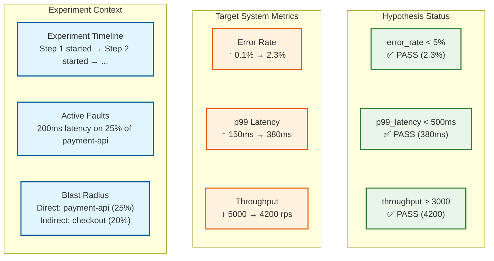

# Observability — Chaos Engineering Platform

## The Dual Observability Challenge

A chaos engineering platform has two distinct observability concerns:

1. **Observing the platform itself:** Is the orchestrator healthy? Are agents connected? Is the command queue flowing? This is standard platform observability.
2. **Observing experiments in progress:** Is the target system tolerating the fault? How do the experiment's metrics correlate with the target system's observability data? This is experiment-specific observability that must integrate with the organization's existing monitoring stack.

The second concern is unique to chaos engineering: the platform must provide a "lens" that overlays experiment context onto the target system's observability data, so engineers can distinguish "this latency spike is caused by our chaos experiment" from "this latency spike is a real problem."

---

## Platform Observability (Observing the Observer)

### Control Plane Metrics (USE/RED)

| Category | Metric | Type | Description | Alert Threshold |
|----------|--------|------|-------------|-----------------|
| **Utilization** | `orchestrator_active_experiments` | Gauge | Currently running experiments | >80% of configured max |
| **Utilization** | `orchestrator_cpu_seconds_total` | Counter | CPU consumed by orchestrator | >70% of limit sustained |
| **Utilization** | `orchestrator_memory_bytes` | Gauge | Memory usage | >80% of limit |
| **Saturation** | `command_queue_depth` | Gauge | Pending commands in queue | >500 pending |
| **Saturation** | `command_queue_oldest_age_seconds` | Gauge | Age of oldest unprocessed command | >30s (rollback may be delayed) |
| **Errors** | `orchestrator_state_transition_errors` | Counter | Failed experiment state transitions | >0 per 5 minutes |
| **Errors** | `blast_radius_check_failures` | Counter | BRC errors (not rejections — errors) | >0 per 5 minutes |
| **Rate** | `experiments_started_total` | Counter | Experiments started | N/A (informational) |
| **Rate** | `experiments_completed_total` | Counter (by outcome) | Experiments completed (pass/fail/abort) | N/A (informational) |
| **Duration** | `experiment_duration_seconds` | Histogram | End-to-end experiment duration | p99 >2× configured max_duration |

### Steady-State Monitor Metrics

| Metric | Type | Description | Alert Threshold |
|--------|------|-------------|-----------------|
| `ssm_evaluations_total` | Counter | Hypothesis evaluations performed | Rate drop >50% indicates SSM issue |
| `ssm_evaluation_latency_seconds` | Histogram | Time to evaluate one hypothesis | p99 >5s (evaluation lag) |
| `ssm_query_failures_total` | Counter | Failed metric queries to observability backend | >3 consecutive failures triggers experiment abort |
| `ssm_hypothesis_violations_total` | Counter | Number of hypothesis violations detected | N/A (expected during experiments) |
| `ssm_grace_period_entries_total` | Counter | Number of times a metric entered grace period | High rate indicates noisy hypothesis thresholds |
| `ssm_false_rollbacks_total` | Counter | Rollbacks triggered that were determined to be false positives (post-hoc) | Requires manual classification |

### Agent Fleet Metrics

| Metric | Type | Description | Alert Threshold |
|--------|------|-------------|-----------------|
| `agent_connected_total` | Gauge | Currently connected agents | Drop >5% of fleet in 5 minutes |
| `agent_heartbeat_age_seconds` | Gauge (per agent) | Time since last heartbeat | >120s (agent may be unreachable) |
| `agent_active_faults_total` | Gauge | Total faults currently injected across all agents | N/A (informational, useful for dashboards) |
| `agent_autonomous_reverts_total` | Counter | Faults reverted by agent safety timer (not by orchestrator) | >0 indicates control plane communication issue |
| `agent_fault_apply_latency_seconds` | Histogram | Time from command receipt to fault applied | p99 >10s |
| `agent_fault_revert_latency_seconds` | Histogram | Time from revert command to fault reverted | p99 >15s (critical — affects rollback SLO) |
| `agent_version_distribution` | Gauge (per version) | Number of agents per software version | >2 versions in production (upgrade stalled) |

### Rollback Metrics (Critical)

| Metric | Type | Description | Alert Threshold |
|--------|------|-------------|-----------------|
| `rollback_triggered_total` | Counter (by trigger) | Rollbacks by trigger type (hypothesis, timeout, manual, partition) | N/A (informational) |
| `rollback_completion_seconds` | Histogram | Time from rollback trigger to all faults reverted | p99 >30s (SLO violation) |
| `rollback_failures_total` | Counter | Rollbacks that did not complete successfully | >0 (critical — faults may be orphaned) |
| `orphaned_faults_total` | Gauge | Faults detected by reconciliation with no owning experiment | >0 (critical — investigate immediately) |

---

## Experiment Observability (Observing the Experiment)

### Experiment Dashboard: The Chaos Lens

During an active experiment, the platform provides a "chaos lens" dashboard that correlates three data streams:



### Experiment Annotations

The platform publishes time-stamped annotations to the organization's dashboarding system so that any engineer viewing system dashboards during a chaos experiment sees clear markers:

```
Annotation Events Published:
  - "Chaos experiment EXP-1234 started: 200ms latency on payment-api (25%)"
    → Published to: Grafana, Datadog, PagerDuty (suppression)
    → Timestamp: experiment start time
    → Tags: experiment_id, team, environment, fault_type

  - "Chaos experiment EXP-1234 Step 2: escalated to 50% of payment-api"
    → Same channels

  - "Chaos experiment EXP-1234 completed: PASS"
    → Same channels
    → Includes link to results report
```

This annotation system serves two critical purposes:
1. **Context for on-call engineers:** An on-call engineer paged for elevated latency can immediately see that a chaos experiment is running and is the likely cause.
2. **Alert suppression:** The platform can suppress non-critical alerts for target services during experiments to prevent alert fatigue. Critical alerts (SLO-violating) are never suppressed.

### Correlation Engine

Post-experiment, the platform correlates the experiment timeline with all available observability data to produce an impact report:

| Correlation | Source | Purpose |
|-------------|--------|---------|
| Experiment events ↔ Metric time series | Metrics backend | Show exactly when metrics shifted relative to fault injection/reversion |
| Experiment events ↔ Distributed traces | Trace backend | Identify specific request traces that were impacted by the fault |
| Experiment events ↔ Error logs | Log backend | Surface error messages that appeared during the experiment |
| Experiment events ↔ Deployment events | Deployment pipeline | Ensure metric changes are from the experiment, not a coincident deployment |
| Experiment events ↔ Auto-scaling events | Orchestration platform | Show if the system auto-scaled in response to the fault |

---

## Alerting

### Platform Safety Alerts (Never Suppress)

| Alert | Severity | Condition | Action |
|-------|----------|-----------|--------|
| **Orphaned fault detected** | Critical | `orphaned_faults_total > 0` | Page platform admin; investigate and manually revert |
| **Rollback timeout** | Critical | `rollback_completion_seconds > 60s` | Page platform admin; check agent connectivity |
| **Agent fleet disconnect** | Critical | `agent_connected_total` drops >10% in 5 min | Page platform admin; pause all experiments |
| **SSM evaluation failure** | High | `ssm_query_failures_total > 3` for any experiment | Auto-abort experiment; alert experiment owner |
| **Autonomous agent revert** | High | `agent_autonomous_reverts_total > 0` | Investigate control plane connectivity |
| **Command queue stall** | High | `command_queue_oldest_age_seconds > 30s` | Scale queue consumers; check for deadlock |

### Experiment-Specific Alerts (Experiment Owner)

| Alert | Severity | Condition | Action |
|-------|----------|-----------|--------|
| **Hypothesis violated** | High | Steady-state metric exceeded threshold after grace period | Auto-rollback triggered; notify experiment owner |
| **Experiment duration warning** | Medium | Experiment at 80% of max duration | Notify owner; experiment will auto-complete at 100% |
| **Blast radius approaching limit** | Medium | Progressive experiment reaching blast radius ceiling | Notify owner; next escalation step will be blocked |

### Alert Suppression During Experiments

```
Suppression Rules:
  1. When experiment starts:
     - Suppress INFO and WARNING alerts for directly targeted services
     - Never suppress ERROR or CRITICAL alerts
     - Add "chaos_experiment_active" label to all alerts from target services

  2. When experiment ends:
     - Remove all suppressions within 5 minutes
     - Any alerts that were suppressed are logged (not lost)
     - Alert "Chaos suppression lifted for {services}" sent to on-call

  3. Override:
     - If an alert matches the experiment's abort conditions, it is
       NOT suppressed — it triggers rollback instead
     - Manual override: on-call can re-enable all alerts at any time
```

---

## Dashboards

### Platform Health Dashboard

| Panel | Visualization | Data Source |
|-------|--------------|-------------|
| Active Experiments | Status cards (green/yellow/red) | Orchestrator API |
| Agent Fleet Health | Heatmap (connected/disconnected/degraded by region) | Agent heartbeats |
| Experiment Timeline | Gantt chart (running experiments with fault types) | Experiment DB |
| Rollback SLO | Time series (p50/p95/p99 rollback duration) | Rollback metrics |
| Command Queue | Time series (depth + processing rate) | Queue metrics |
| Orphaned Faults | Counter (should always be 0) | Reconciliation sweep |

### Experiment Deep-Dive Dashboard

| Panel | Visualization | Data Source |
|-------|--------------|-------------|
| Experiment Status | State indicator + timeline | Orchestrator |
| Hypothesis Status | Per-metric gauges with threshold bands | SSHE |
| Blast Radius | Dependency graph with heat overlay | BRC + observability |
| Target Metrics (RED) | Time series with experiment annotations | Metrics backend |
| Impacted Traces | Exemplar traces from fault window | Trace backend |
| Error Logs | Log stream filtered by target services + time window | Log backend |

---

## SLO Dashboard

### Platform Health SLOs

```
Dashboard: Chaos Platform Health
  Row 1: Control Plane Availability (target: 99.99%)
    - 30-day rolling availability percentage
    - Budget remaining (4.32 minutes/month)
    - Burn rate indicator (current vs. expected)

  Row 2: Rollback P99 Latency (target: <30 seconds)
    - Time series of rollback durations (p50/p95/p99)
    - SLO violation count in last 24 hours
    - Worst-case rollback duration in last 7 days

  Row 3: Orphaned Fault Counter (target: 0)
    - Current count (should always be 0)
    - Time since last orphaned fault
    - Reconciliation sweep results (last 24 hours)

  Row 4: Agent Fleet Health
    - Connected / disconnected / degraded agent counts
    - Agent version distribution (are all agents on latest version?)
    - Regional agent health breakdown

  Row 5: Experiment Success Rate
    - 7-day rolling pass/fail/abort ratio
    - Trend: are experiments passing more or less frequently?
    - Time to first rollback (are experiments failing faster?)
```

### Error Budget Policy

| Budget Remaining | Status | Actions |
|---|---|---|
| > 75% | **Green** | Normal operations; new experiments approved freely |
| 50–75% | **Yellow** | Review recent rollback failures; restrict production experiments to pre-approved |
| 25–50% | **Orange** | Pause all automated/scheduled experiments; manual-only with extra approval |
| 10–25% | **Red** | Pause all experiments; focus on platform reliability fixes |
| < 10% | **Exhausted** | Post-incident review mandatory; platform reliability sprint |

---

## Operational Runbooks

### Runbook 1: Orphaned Fault Detected

**Severity:** P1 — Active production degradation with no controlling experiment

**Detection:** Reconciliation sweep finds a fault registered on an agent that does not correspond to any active experiment.

**Steps:**
```
1. Identify the orphaned fault:
   - Which agent? Which host?
   - What fault type? (network latency, CPU stress, etc.)
   - When was it injected? (agent local fault registry timestamp)

2. Immediate action:
   - Send REVERT command to the agent for this specific fault
   - Verify revert confirmation within 30 seconds

3. If revert fails:
   - SSH to the host (emergency access)
   - Manually revert the fault using agent CLI: `chaos-agent revert --fault-id <id>`
   - If agent is unresponsive: restart the agent (startup revert-first pattern will clean up)

4. Root cause analysis:
   - Was the experiment that created this fault ever completed?
   - Did the rollback command fail to deliver? (check command queue delivery logs)
   - Did the agent crash between inject and ACK? (check agent crash logs)

5. Post-resolution:
   - File incident report
   - Update orphaned fault counter metric
   - Review reconciliation sweep frequency (should it run more often?)
```

### Runbook 2: Agent Fleet Degradation (>10% Disconnected)

**Severity:** P2 — Reduced experiment coverage; rollback delivery at risk

**Steps:**
```
1. Identify scope:
   - How many agents are disconnected? Which regions?
   - Are disconnected agents concentrated on specific host types?

2. Check network connectivity:
   - Can control plane reach agents directly? (bypass relay)
   - Are regional relays healthy?
   - DNS resolution for agent endpoints?

3. Check agent process health:
   - Are agent processes running on disconnected hosts?
   - Agent logs for crash loops or resource exhaustion?

4. Impact assessment:
   - Are any active experiments targeting disconnected agents?
   - If yes: abort those experiments immediately (cannot guarantee rollback delivery)

5. Resolution:
   - If network issue: resolve and verify agents reconnect
   - If agent crash: deploy fix; agents will reconcile on restart
   - If host issue: mark hosts as unavailable in blast radius controller
```

### Runbook 3: Steady-State Monitor Failing to Evaluate

**Severity:** P2 — Cannot validate experiment safety; must abort active experiments

**Steps:**
```
1. Check observability backend health:
   - Metrics API reachable? Response time?
   - Tracing API reachable? Response time?
   - Are other consumers of the metrics API also experiencing issues?

2. If observability is degraded:
   - Abort all active experiments (fail-closed policy)
   - Notify experiment owners: "Experiments aborted due to observability degradation"
   - Do NOT start new experiments until observability recovers

3. If SSM service itself is unhealthy:
   - Restart SSM nodes
   - Verify metric query connectivity
   - Reduce evaluation frequency temporarily (from 1/sec to 1/5sec) to reduce load

4. Post-resolution:
   - Verify SSM can evaluate all registered steady-state hypotheses
   - Re-enable experiment scheduling
   - Review observability dependency: should SSM have a dedicated metrics endpoint?
```

---

## Experiment Annotations for On-Call Context

### The On-Call Problem

When an on-call engineer receives a page at 3 AM for elevated error rates, they need to know: "Is this a real incident or is there a chaos experiment running?" Without this context, they waste precious incident response time investigating a deliberately injected fault.

### Annotation Architecture

The chaos platform pushes experiment annotations to all observability systems:

```
FUNCTION annotate_experiment_start(experiment):
  annotation = {
    "source": "chaos-engineering",
    "experiment_id": experiment.id,
    "title": "Chaos: " + experiment.name,
    "description": experiment.description + "\n\nTargets: " + experiment.targets_summary,
    "start_time": NOW(),
    "expected_end_time": NOW() + experiment.duration,
    "owner": experiment.creator,
    "contact": experiment.creator_slack_channel,
    "severity": "info",
    "tags": ["chaos", experiment.fault_type, experiment.environment]
  }

  // Push to all observability systems
  metrics_backend.create_annotation(annotation)
  tracing_backend.create_annotation(annotation)
  alerting_system.suppress_alerts(
    targets=experiment.target_services,
    duration=experiment.duration + GRACE_PERIOD,
    reason="Chaos experiment: " + experiment.id
  )
  oncall_dashboard.add_context(annotation)

FUNCTION annotate_experiment_end(experiment, result):
  // Update annotations with actual end time and result
  end_annotation = {
    "experiment_id": experiment.id,
    "end_time": NOW(),
    "result": result.status,  // "passed" | "failed" | "aborted"
    "summary": result.summary
  }
  // Resume suppressed alerts
  alerting_system.resume_alerts(targets=experiment.target_services)
```

### Alert Suppression Policy

| Alert Type | Suppression During Experiment | Rationale |
|---|---|---|
| Error rate alerts for target services | Suppressed | Expected increase due to fault injection |
| Latency alerts for target services | Suppressed | Expected degradation due to fault injection |
| Availability alerts for target services | **NOT suppressed** | May indicate experiment exceeded blast radius |
| Alerts for non-target services | **NOT suppressed** | May indicate unexpected cascading impact |
| Infrastructure alerts (disk, memory, CPU) | Suppressed only if fault type matches | CPU stress experiment should suppress CPU alerts |

---

## Health Check Endpoint

```
GET /health

Response:
{
  "status": "healthy",
  "timestamp": "2026-03-20T14:30:00Z",
  "components": {
    "orchestrator": {
      "status": "healthy",
      "leader": true,
      "active_experiments": 7,
      "max_experiments": 15
    },
    "blast_radius_controller": {
      "status": "healthy",
      "active_reservations": 7,
      "dependency_graph_age_seconds": 45,
      "lock_contention_p99_ms": 12
    },
    "steady_state_monitor": {
      "status": "healthy",
      "evaluations_per_second": 42,
      "query_failure_rate": 0.001,
      "active_hypotheses": 35
    },
    "command_queue": {
      "status": "healthy",
      "depth": 23,
      "oldest_message_age_seconds": 2,
      "delivery_rate_per_second": 15
    },
    "agent_fleet": {
      "status": "healthy",
      "total_agents": 5000,
      "connected": 4987,
      "degraded": 8,
      "unreachable": 5,
      "active_faults": 42
    },
    "experiment_database": {
      "status": "healthy",
      "replication_lag_ms": 3,
      "connection_pool_usage": 0.35
    },
    "audit_log": {
      "status": "healthy",
      "write_latency_p99_ms": 15,
      "entries_today": 12847
    }
  },
  "slos": {
    "control_plane_availability": {
      "target": "99.99%",
      "current_30d": "99.997%",
      "budget_remaining_minutes": 3.87
    },
    "rollback_p99": {
      "target_seconds": 30,
      "current_p99_seconds": 12.4,
      "violations_30d": 0
    },
    "orphaned_faults": {
      "target": 0,
      "current": 0,
      "last_detected": "never"
    }
  }
}
```

---

## Monitoring Anti-Patterns

| Anti-Pattern | Why It's Dangerous | Better Approach |
|-------------|-------------------|-----------------|
| **Alerting on experiment failure rate** | Experiment failures are expected (they discover weaknesses); alerting on them treats chaos failures as platform problems | Track experiment failure trends; alert only on platform operational failures (rollback timeout, orphaned faults) |
| **Sharing observability backend with experiment targets** | SSM queries compete with the application's own monitoring queries; under load, both degrade | Dedicated metrics query endpoint for SSM with priority queuing |
| **Single rollback SLO for all fault types** | Network fault reversion (remove tc rule) is much faster than state fault reversion (cache invalidation). A single SLO hides type-specific issues | Per-fault-type rollback SLOs: network <5s, compute <10s, state <30s |
| **Monitoring agent fleet health by count only** | "4,990 of 5,000 agents connected" doesn't indicate whether the 10 disconnected agents are actively running experiments | Track `agent_with_active_faults_disconnected` specifically — this is the dangerous metric |
| **Suppressing all alerts during experiments** | Over-suppression hides cascading impact beyond the declared blast radius | Only suppress alerts for directly targeted services; keep alerts for indirect dependencies active |

---

## Capacity Forecasting

```
FUNCTION forecast_platform_capacity(historical_data, growth_rate):
    // Project experiment volume growth
    current_experiments_per_day = historical_data.avg_experiments_per_day
    projected_experiments = current_experiments_per_day × (1 + growth_rate) ^ months_ahead

    // Project agent fleet growth
    current_agents = historical_data.current_agent_count
    projected_agents = current_agents × (1 + infra_growth_rate) ^ months_ahead

    // Check control plane capacity
    cp_headroom = MAX_CONCURRENT_EXPERIMENTS - historical_data.peak_concurrent
    months_until_cp_saturated = LOG(MAX_CONCURRENT / historical_data.peak_concurrent)
                                / LOG(1 + growth_rate)

    // Check SSM query capacity
    projected_ssm_qps = projected_experiments × avg_hypotheses_per_experiment
                        / avg_evaluation_interval
    months_until_ssm_saturated = LOG(MAX_SSM_QPS / historical_data.current_ssm_qps)
                                  / LOG(1 + growth_rate)

    // Check heartbeat capacity
    projected_heartbeats_per_second = projected_agents / avg_heartbeat_interval
    months_until_heartbeat_saturated = LOG(MAX_HEARTBEAT_RPS / historical_data.current_hb_rps)
                                        / LOG(1 + infra_growth_rate)

    RETURN CapacityForecast(
        Slowest part of the process = MIN(months_until_cp_saturated,
                        months_until_ssm_saturated,
                        months_until_heartbeat_saturated),
        recommendations = generate_scaling_recommendations()
    )
```

---

## Experiment Impact Scoring

Post-experiment, the platform generates an impact score that quantifies how much the system was affected:

```
FUNCTION calculate_impact_score(experiment_result):
    score = 0.0

    // Factor 1: Metric deviation (0-40 points)
    FOR EACH hypothesis IN experiment_result.hypotheses:
        baseline = hypothesis.baseline_value
        peak = hypothesis.peak_value_during_experiment
        deviation_pct = ABS(peak - baseline) / baseline × 100
        metric_score = MIN(deviation_pct × 2, 40)  // Cap at 40
        score += metric_score / len(experiment_result.hypotheses)

    // Factor 2: Recovery time (0-30 points)
    // Time from fault reversion to metrics returning to baseline
    recovery_time = experiment_result.recovery_time_seconds
    IF recovery_time < 10: recovery_score = 0      // Fast recovery
    ELIF recovery_time < 30: recovery_score = 10
    ELIF recovery_time < 60: recovery_score = 20
    ELSE: recovery_score = 30                       // Slow recovery
    score += recovery_score

    // Factor 3: Cascading impact (0-30 points)
    // Did non-targeted services degrade?
    indirect_services_affected = experiment_result.indirect_impact_count
    cascade_score = MIN(indirect_services_affected × 5, 30)
    score += cascade_score

    // Normalize to 0-100
    RETURN ImpactScore(
        value = MIN(score, 100),
        severity = classify(score),  // Low (<30), Medium (30-60), High (>60)
        details = {metric_deviation, recovery_time, cascade_impact}
    )
```
