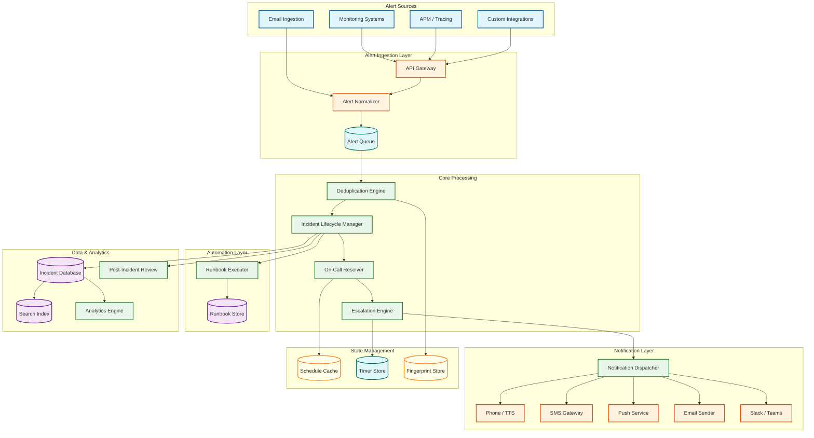
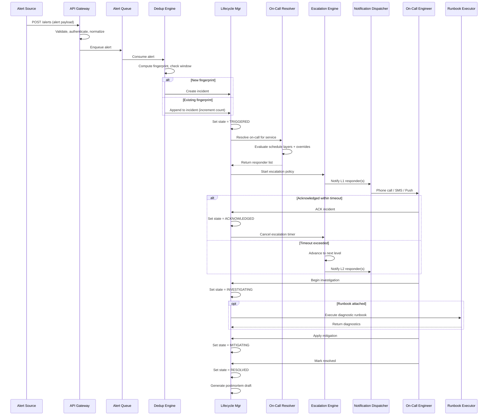
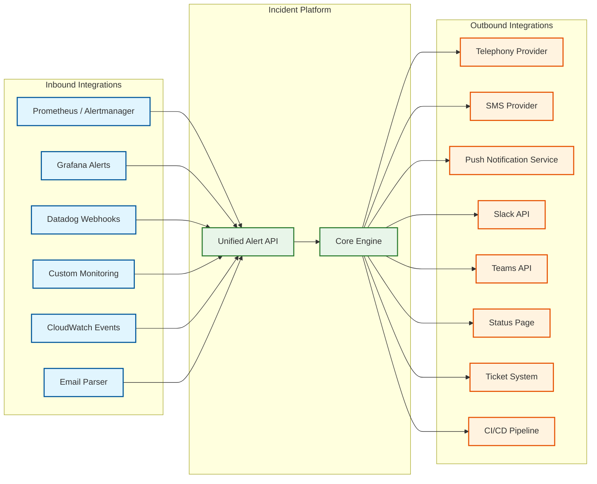

# High-Level Design — Incident Management System

## 1. Architecture Overview



---

## 2. Component Responsibilities

### 2.1 Alert Ingestion Layer

| Component | Responsibility |
|-----------|---------------|
| **API Gateway** | Rate limiting, authentication (API keys per integration), request validation, TLS termination |
| **Alert Normalizer** | Transforms heterogeneous alert formats into a canonical internal schema (source, severity, service, dedup_key, payload) |
| **Alert Queue** | Durable message queue that decouples ingestion from processing; survives processing-layer restarts without alert loss |

### 2.2 Core Processing

| Component | Responsibility |
|-----------|---------------|
| **Deduplication Engine** | Groups alerts by fingerprint (hash of dedup_key); maintains sliding window of active fingerprints; creates new incidents or appends to existing ones |
| **On-Call Resolver** | Evaluates the on-call schedule graph at the current timestamp to determine who to notify; handles schedule layers, overrides, and follow-the-sun |
| **Escalation Engine** | Manages escalation timers; fires next-level notifications when acknowledgment deadlines expire; implements the escalation state machine |
| **Incident Lifecycle Manager** | Central orchestrator for incident state transitions; enforces the state machine; coordinates with all other components |

### 2.3 Notification Layer

| Component | Responsibility |
|-----------|---------------|
| **Notification Dispatcher** | Routes notifications to the appropriate channel based on user preferences and incident severity; handles retry and failover logic |
| **Channel Adapters** (Phone, SMS, Push, Email, Chat) | Each adapter speaks the protocol of one external delivery system; manages rate limits, retries, and delivery confirmation |

### 2.4 Automation Layer

| Component | Responsibility |
|-----------|---------------|
| **Runbook Executor** | Sandboxed execution environment for diagnostic and remediation runbooks; captures output as incident context |
| **Runbook Store** | Version-controlled repository of runbook definitions with service-to-runbook mappings |

### 2.5 Data & Analytics

| Component | Responsibility |
|-----------|---------------|
| **Incident Database** | Durable storage for incidents, alerts, notifications, audit log; source of truth for incident state |
| **Search Index** | Full-text search over incidents, alerts, and postmortems for pattern discovery |
| **Analytics Engine** | Computes MTTA, MTTR, incident trends, on-call burden, SLA compliance |
| **Post-Incident Review** | Generates draft postmortems from timeline data; tracks action items to completion |

---

## 3. Data Flow: Alert-to-Resolution Lifecycle



---

## 4. Key Architectural Decisions

### Decision 1: Durable Queue Between Ingestion and Processing

**Choice:** All alerts pass through a durable message queue before processing.

**Rationale:** During an alert storm, the processing layer may be overwhelmed. The queue absorbs the burst, ensuring zero alert loss. If the deduplication engine restarts, unprocessed alerts are redelivered. This decoupling is critical because the ingestion layer must never reject an alert — every rejected alert is a potentially missed incident.

**Trade-off:** Adds 10-50ms latency per alert. Acceptable given the 30-second SLO.

### Decision 2: Fingerprint-Based Deduplication with Sliding Window

**Choice:** Deduplication uses a configurable fingerprint (hash of source + alert_class + service + custom fields) with a time-bounded sliding window (default 24 hours).

**Rationale:** Content-hash deduplication is deterministic, explainable, and fast. ML-based semantic grouping is more flexible but harder to debug when it over-groups (hiding a real incident) or under-groups (creating noise). The fingerprint approach provides a reliable baseline; semantic grouping can be layered on top.

**Trade-off:** Fingerprint-only dedup cannot group "related but different" alerts (e.g., "CPU high" and "memory exhausted" on the same host). This is handled by a separate correlation layer.

### Decision 3: Escalation as a Separate State Machine

**Choice:** The escalation engine is a dedicated component with its own persistent timer store, rather than being embedded in the incident lifecycle manager.

**Rationale:** Escalation timers are the most latency-sensitive component — a timer that fires 1 minute late can mean 1 minute of extended downtime. Isolating the escalation engine allows it to have its own scaling, its own persistence, and its own failure domain. If the lifecycle manager restarts, escalation timers continue firing.

**Trade-off:** Requires distributed coordination between ILM and escalation engine; adds complexity for consistency.

### Decision 4: Multi-Channel Notification with Per-User Preferences

**Choice:** The notification dispatcher consults user preference rules (severity × time-of-day → channel priority list) rather than using a single global channel.

**Rationale:** A phone call at 3 AM is appropriate for P1; an email is appropriate for P3. A single-channel approach either over-pages (alert fatigue) or under-pages (missed incidents). Per-user preferences also accommodate individual device availability and regional telecom constraints.

**Trade-off:** Complex preference evaluation at notification time; requires fallback chains when preferred channel fails.

### Decision 5: Active-Active Multi-Region for the Platform Itself

**Choice:** The incident management platform runs active-active across at least two geographic regions.

**Rationale:** This is the meta-reliability requirement. If the incident platform runs in a single region and that region goes down, the organization loses its ability to detect and respond to the very outage affecting them. Active-active ensures that a region-level failure affects at most 50% of alert processing capacity (with the other region absorbing the load), rather than causing complete blindness.

**Trade-off:** Requires conflict resolution for concurrent incident updates across regions; increases infrastructure cost by 2-3x.

---

## 5. Integration Architecture



The platform acts as a central hub with a normalized inbound API that accepts alerts from any monitoring system, and a fanout outbound layer that pushes notifications and status updates to all relevant channels. Each integration is an adapter that maps between the platform's canonical data model and the external system's protocol.

---

## 6. Cross-Cutting Concerns

### 6.1 Data Consistency Model

| Data Type | Consistency Model | Justification |
|---|---|---|
| **Alert ingestion** | At-least-once with idempotent processing | Zero alert loss; duplicate alerts are handled by dedup |
| **Incident state** | Strong (CP) within region; eventual across regions | State transitions must be atomic; cross-region uses conflict resolution |
| **Escalation timers** | Strong (single-writer per incident) | Timer accuracy is latency-critical; no split-brain allowed |
| **Schedules / policies** | Eventual (async replication, < 1s lag) | Config data changes infrequently; slight staleness acceptable |
| **Notification records** | Append-only, eventually consistent | Immutable once written; no conflicts |
| **Audit logs** | Append-only, cryptographically chained | Tamper-evident; never modified |

### 6.2 Multi-Tenant Architecture (SaaS Mode)

For SaaS deployment (serving multiple organizations), the platform adds tenant isolation:

| Concern | Implementation |
|---|---|
| **Data isolation** | Tenant ID on every row; row-level security policies; no cross-tenant queries |
| **Compute isolation** | Shared compute with per-tenant rate limits; dedicated compute for enterprise tier |
| **Noisy neighbor protection** | Per-tenant alert ingestion rate limits; per-tenant notification quotas |
| **Telephony isolation** | Separate phone numbers per tenant (caller ID trust); shared provider pooling |
| **Configuration isolation** | Schedules, policies, and integrations scoped to tenant |

### 6.3 ChatOps Integration Architecture

Modern incident response is increasingly Slack/Teams-native. The platform auto-creates an incident channel and supports command-based interaction:

```mermaid
---
config:
  theme: neutral
  look: neo
---
sequenceDiagram
    participant ILM as Incident Lifecycle Manager
    participant CHAT as Chat Platform (Slack/Teams)
    participant ENG as On-Call Engineer
    participant BOT as Incident Bot

    ILM->>CHAT: Create incident channel (#inc-12345)
    ILM->>CHAT: Post incident summary + runbook links
    ILM->>CHAT: Invite on-call responders

    ENG->>BOT: /incident ack
    BOT->>ILM: Acknowledge incident
    ILM-->>BOT: Confirmed
    BOT->>CHAT: "🟢 Incident acknowledged by @engineer"

    ENG->>BOT: /incident severity P1
    BOT->>ILM: Update severity
    ILM-->>BOT: Confirmed; re-escalating
    BOT->>CHAT: "⚠️ Severity escalated to P1; additional responders paged"

    ENG->>BOT: /incident resolve
    BOT->>ILM: Resolve incident
    ILM-->>BOT: Confirmed; postmortem scheduled
    BOT->>CHAT: "✅ Incident resolved. Postmortem draft: [link]"
```

### 6.4 Error Handling Philosophy

| Error Class | Strategy | User Experience |
|---|---|---|
| **Alert ingestion failure** | Return 5xx; client retries (monitoring systems have retry logic) | No alert loss; delayed by retry interval |
| **Dedup engine overload** | Queue absorbs burst; dedup catches up after storm | Increased alert-to-notification latency |
| **Notification channel failure** | Failover to next channel in preference chain | Engineer gets paged via different channel |
| **All notification channels down** | Escalation timer fires; pages next level via whatever works | Someone eventually gets notified |
| **Database unavailable** | Queue-based buffering; cached state for reads | New incidents queued; existing incidents visible from cache |
| **Escalation timer late** | On restart, fire all overdue timers immediately | Burst of escalation notifications (safe: better late than never) |

### 6.5 Versioning & Backward Compatibility

- **Alert API**: Versioned (`/v2/alerts`); old versions supported for 12 months after deprecation
- **Webhook payloads**: Additive-only field changes; new fields never break existing consumers
- **Escalation policies**: Versioned; executing policy uses the version at incident creation time (not current version)
- **Runbooks**: Immutable versions; executions reference a specific version
- **Schedule format**: Breaking changes require migration tool; dual-read during transition

### 6.6 Service Dependency Graph

```
Alert Ingestion Layer (stateless, horizontally scalable)
  └── Alert Queue (durable, absorbs bursts)
       └── Dedup Engine (stateful: fingerprint cache)
            └── Incident Lifecycle Manager (orchestrator)
                 ├── On-Call Resolver (reads schedule cache)
                 ├── Escalation Engine (independent timer store)
                 │    └── Notification Dispatcher (multi-channel fanout)
                 │         ├── Phone Provider A (external)
                 │         ├── Phone Provider B (external, failover)
                 │         ├── SMS Gateway (external)
                 │         ├── Push Service (external)
                 │         └── Chat API (external)
                 ├── Runbook Executor (sandboxed, isolated)
                 └── Incident Database (source of truth)
                      └── Search Index (async)
                      └── Analytics Engine (async)
```

*Key insight*: The escalation engine is deliberately isolated from the lifecycle manager. If the lifecycle manager restarts, escalation timers keep firing. If the escalation engine restarts, it reloads all pending timers from durable storage.

### 6.7 Failure Isolation Boundaries

The architecture uses blast-radius containment to prevent cascading failures:

| Boundary | What It Isolates | Failure Propagation Prevented |
|---|---|---|
| **Queue between ingestion and processing** | Ingestion layer from processing layer | Processing overload doesn't cause alert rejection |
| **Escalation engine separate process** | Timer execution from incident state management | ILM restart doesn't affect in-flight escalations |
| **Per-channel notification adapters** | Each notification channel from others | Telephony provider outage doesn't block push/Slack |
| **Runbook sandbox** | Runbook execution from platform core | Runbook crash or timeout doesn't affect alert processing |
| **Regional isolation** | Region A from Region B | Region failure affects at most 50% of capacity |
| **Meta-monitor on separate infrastructure** | Platform monitoring from platform itself | Platform failure doesn't prevent failure detection |

### 6.8 Rate Limiting Strategy

| API | Tier | Rate Limit | Burst | Enforcement |
|---|---|---|---|---|
| Alert Ingestion (`POST /alerts`) | Per-integration | 1,000/min | 5,000 | Token bucket; 429 with Retry-After |
| Alert Ingestion (`POST /alerts`) | Global | 100,000/min | 500,000 | Circuit breaker to protect dedup engine |
| Incident API (CRUD) | Per-user | 100/min | 200 | Token bucket |
| Schedule API | Per-user | 50/min | 100 | Token bucket |
| Webhook delivery (outbound) | Per-integration | 100/min | 500 | Queue-based throttle; excess queued, not dropped |
| Runbook execution | Per-team | 10/min | 20 | Approval gate for burst; prevents runbook storms |

### 6.9 Incident Correlation Engine

Beyond fingerprint deduplication, a correlation layer groups related but distinct incidents:

```
Correlation Signals:
  1. Temporal — Incidents created within a 5-minute window
  2. Topological — Incidents on services connected in the dependency graph
  3. Causal — Incident A's service is a dependency of Incident B's service
  4. Deployment — Incidents correlated with a recent deployment event

Correlation Output:
  - "Cluster" of related incidents with a suggested root cause
  - Single incident commander view across the cluster
  - Shared war room for all correlated incidents
  - Unified postmortem covering the entire cluster
```

This layer operates asynchronously and does not block notification — it enriches incident context after the initial routing is complete.

### 6.10 Multi-Tenant Architecture (SaaS Mode)

For SaaS deployment, the platform adds tenant-aware isolation at every layer:

| Concern | Implementation | Failure Isolation |
|---|---|---|
| **Data isolation** | Tenant ID on every row; row-level security; no cross-tenant queries | One tenant's data never visible to another |
| **Compute isolation** | Shared compute with per-tenant rate limits; dedicated compute for enterprise tier | Noisy tenant cannot exhaust shared resources |
| **Notification isolation** | Per-tenant phone numbers (caller ID trust); per-tenant notification quotas | One tenant's storm cannot exhaust another's notification budget |
| **Configuration isolation** | Schedules, policies, integrations all scoped to tenant | Misconfiguration affects only the owning tenant |
| **Encryption isolation** | Per-tenant encryption keys for alert payloads | Tenant key compromise does not affect other tenants |
| **Telephony isolation** | Separate caller IDs per tenant; shared provider pooling for cost efficiency | One tenant's reputation doesn't affect another's caller ID trust |
