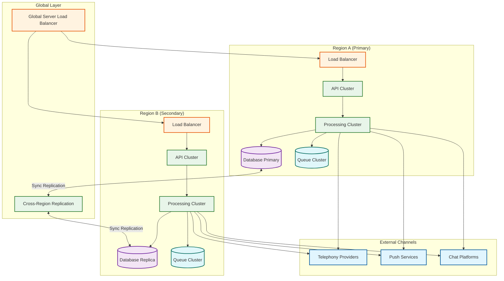

# Scalability & Reliability — Incident Management System

## 1. The Meta-Reliability Paradox

The incident management system has a unique reliability requirement that no other system in the infrastructure shares: **it must be more available than the systems it monitors.** When the database goes down, the incident platform must page the DBA. When the Kubernetes cluster fails, the platform must still deliver notifications. When the network partitions, the platform must still function on both sides of the partition.

This creates the "meta-reliability paradox": the system that alerts you about failures cannot itself depend on any system that might fail.

### 1.1 Dependency Minimization

| Dependency | Risk | Mitigation |
|-----------|------|------------|
| **Primary database** | DB failure = no incident state | Multi-region replicated database with automatic failover; degraded mode falls back to in-memory state |
| **Message queue** | Queue failure = alert processing stops | Multi-AZ queue cluster; fallback to direct processing (bypass queue) under failure |
| **Telephony provider** | Provider outage = no phone notifications | Multi-provider with automatic failover; hot standby provider |
| **DNS** | DNS failure = integrations can't reach the platform | Static IP endpoints published alongside DNS names; long TTLs on critical DNS records |
| **TLS certificates** | Cert expiry = API becomes unreachable | Certificate monitoring as a separate system with independent notification path |
| **Configuration store** | Config store failure = stale schedules/policies | Local config cache with hours-long TTL; the platform can operate on cached config indefinitely |

### 1.2 Independence from Shared Infrastructure

The incident platform must NOT share:
- **Compute clusters** with the applications it monitors (if the cluster goes down, the monitoring platform goes down with it)
- **Network segments** with the monitored infrastructure (network partition must not isolate the alerting path)
- **Identity providers** that could become unavailable during an outage (engineers must be able to log in and acknowledge incidents even if SSO is down)
- **Monitoring systems** that are themselves monitored (circular dependency)

---

## 2. Multi-Region Active-Active Architecture

### 2.1 Architecture Overview



### 2.2 Data Replication Strategy

| Data Type | Replication Mode | Conflict Resolution | Rationale |
|-----------|-----------------|---------------------|-----------|
| **Alert ingestion** | Write to local region only | No conflict (alerts are immutable) | Alerts are accepted at whichever region receives them |
| **Incident state** | Synchronous cross-region | Last-writer-wins with status precedence | Acknowledged > Triggered; Resolved > Acknowledged |
| **Escalation timers** | Active in one region per incident | Leader election by incident ID hash | Prevents duplicate escalation across regions |
| **Schedules & policies** | Async replication with <1s lag | Version vector with merge | Config changes are low-frequency and non-conflicting |
| **Notification records** | Write-local, async replicate | Append-only (no conflict) | Records are immutable once created |

### 2.3 Regional Failover

**Failure detection:** Each region monitors the other via health checks. The Global Server Load Balancer (GSLB) detects region unavailability within 30 seconds.

**Failover sequence:**
1. GSLB detects Region A is unhealthy → routes all traffic to Region B
2. Region B's processing cluster absorbs the additional load (pre-provisioned at 150% capacity)
3. Escalation timers owned by Region A are re-assigned to Region B (the timer store is replicated; Region B picks up where Region A left off)
4. Notifications in flight from Region A are retried by Region B (idempotent notification delivery prevents duplicates)

**Recovery sequence:**
1. Region A recovers → GSLB begins routing traffic to both regions
2. Database replication catches up (sync backlog)
3. Timer ownership is re-balanced across both regions

---

## 3. Scaling Alert Ingestion During Incident Storms

### 3.1 The Storm Profile

Normal: 100K alerts/day → ~70/minute
Storm: 5M alerts in 90 minutes → ~55,000/minute (800x normal)

The storm arrives suddenly (within seconds of the root cause) and sustains for 60-90 minutes.

### 3.2 Scaling Strategy

```
                    Normal Load          Storm Load
                    ──────────          ──────────
API Gateway:        4 pods              40 pods (auto-scale on request rate)
Alert Queue:        2 partitions        20 partitions (pre-provisioned)
Dedup Engine:       8 pods              20 pods (auto-scale on queue depth)
Notification:       6 pods              30 pods (auto-scale on queue depth)
```

**Pre-scaling triggers:**
- Alert rate exceeds 5x normal for 60 seconds → scale all components to storm capacity
- Single service exceeds 100 alerts/minute → scale dedup engine
- Notification queue depth exceeds 1000 → scale notification dispatcher

### 3.3 Backpressure Mechanisms

If scaling cannot keep up with the storm:

1. **Alert queue acts as buffer** — The durable queue absorbs the burst; processing catches up after the storm subsides. Queue retention is set to 7 days to survive extended outages.

2. **Ingestion-layer shedding** — If the queue itself is at capacity, the API Gateway returns `429 Too Many Requests` with a `Retry-After` header. Monitoring systems respect this and retry. This is the last resort — it means alerts are being delayed, not dropped.

3. **Dedup-window extension** — During storms, automatically extend the dedup window from 24h to 48h, causing more aggressive grouping and fewer new incidents.

4. **Notification priority queuing** — P1 notifications are processed immediately; P3/P4 notifications are deferred by up to 5 minutes during storms.

---

## 4. Fault Tolerance

### 4.1 Component Failure Matrix

| Component | Failure Impact | Recovery Strategy | RTO |
|-----------|---------------|-------------------|-----|
| **API Gateway** | New alerts not accepted | Auto-restart; health check removes unhealthy instances; clients retry | < 10s |
| **Alert Queue** | Processing paused; alerts buffered at gateway | Multi-AZ queue; automatic partition leadership handoff | < 30s |
| **Dedup Engine** | Alerts queue up; latency increases | Stateless restart; fingerprint state rebuilt from persistent store | < 60s |
| **Escalation Engine** | Timers may fire late | Timer store is durable; on restart, fires all overdue timers immediately | < 30s |
| **Notification Dispatcher** | Notifications delayed | Stateless restart; unprocessed notifications redelivered from queue | < 30s |
| **Primary Database** | Incident state reads/writes fail | Failover to replica; degraded mode uses cached state | < 60s |
| **Telephony Provider** | Phone calls fail | Automatic failover to backup provider | < 10s |
| **Entire Region** | 50% capacity loss | GSLB routes to surviving region; capacity pre-provisioned | < 30s |

### 4.2 Degraded Mode Operation

When dependencies fail, the platform enters degraded modes rather than becoming unavailable:

| Degraded Mode | Trigger | Behavior | User Impact |
|--------------|---------|----------|-------------|
| **Queue bypass** | Message queue unavailable | Alerts processed synchronously (skip queue) | Higher latency, lower throughput, but no alert loss |
| **Cache-only schedule** | Config store unavailable | Use cached schedule (may be up to 1 hour stale) | Overrides created in the last hour may not take effect |
| **Push-only notification** | Telephony providers down | Route all notifications to push + chat | No phone/SMS; push is less intrusive but still reaches the engineer |
| **Read-only mode** | Database in failover | Accept alerts (buffer in queue), serve cached incidents | New incidents queued; existing incidents visible but not updateable |

### 4.3 Chaos Engineering for the Alerting System

Since the incident platform is the system that responds to failures, it must be the most thoroughly chaos-tested system in the organization:

- **Provider failover drill** — Monthly: disable the primary telephony provider and verify failover to backup within 10 seconds
- **Region evacuation drill** — Quarterly: simulate complete region failure and verify the surviving region handles full load
- **Queue saturation drill** — Monthly: inject 100x normal alert volume and verify dedup, scaling, and backpressure behavior
- **Timer accuracy drill** — Weekly: create test incidents with known escalation timeouts and verify timers fire within ±5 seconds

---

## 5. Data Partitioning Strategy

### 5.1 Alert and Incident Partitioning

| Data | Partition Key | Strategy | Rationale |
|------|--------------|----------|-----------|
| **Alerts** | `fingerprint` hash | Hash partitioning across queue partitions | Same fingerprint → same partition → serialized dedup processing |
| **Incidents** | `incident_id` hash | Hash partitioning across database shards | Even distribution; no hotspots |
| **Notifications** | `user_id` hash | Hash partitioning | Prevents notification storms to a single user from overwhelming one partition |
| **Schedules** | `team_id` | Range partitioning | Low cardinality; co-locate team schedules for efficient resolution |
| **Timers** | `fire_at` time bucket | Time-range partitioning | Efficient "fire all timers in this second" queries |

### 5.2 Hot Partition Handling

During a storm, a single fingerprint may receive 10,000 alerts while other fingerprints receive zero. This creates a hot partition.

**Mitigation:**
- The hot partition handles only dedup counter increments (lightweight: atomic increment on `alert_count`)
- Heavy processing (incident creation, escalation) happens only once per fingerprint, not per alert
- If a single partition is overwhelmed, the queue rebalances by splitting the hot partition's key range

---

## 6. Capacity Planning

### 6.1 Scaling Dimensions

| Dimension | Metric | Scaling Action | Threshold |
|-----------|--------|---------------|-----------|
| Alert ingestion rate | Alerts/sec at API Gateway | Add API pods | > 500/sec sustained |
| Queue depth | Messages in alert queue | Add consumer pods | > 10,000 messages |
| Dedup cache size | Unique fingerprints in window | Increase memory / add cache nodes | > 1M active fingerprints |
| Notification throughput | Notifications/min | Add dispatcher pods | > 1000/min |
| Phone call concurrency | Active outbound calls | Add telephony provider capacity | > 80% of provider limit |
| Database write throughput | Writes/sec to incident store | Add database write replicas | > 5,000 writes/sec |

### 6.2 Growth Projections

| Year | Monitored Services | Daily Alerts | Peak Alerts/min | Active On-Call Users |
|------|-------------------|-------------|-----------------|---------------------|
| Year 1 | 10,000 | 20K | 10K | 2,000 |
| Year 2 | 30,000 | 60K | 30K | 5,000 |
| Year 3 | 50,000 | 100K | 58K | 10,000 |
| Year 5 | 100,000 | 200K | 120K | 20,000 |

Infrastructure cost scales sub-linearly because deduplication effectiveness improves with volume (more alerts per fingerprint → higher dedup ratio → fewer incidents → fewer notifications).

---

## 7. Back-Pressure Mechanisms

### 7.1 Ingestion-Layer Back-Pressure

| Pressure Level | Trigger | Response |
|---|---|---|
| **Normal** | Alert queue depth < 1K | Process all alerts normally |
| **Elevated** | Queue depth 1K–10K | Scale dedup engine 2×; extend dedup window |
| **Critical** | Queue depth 10K–100K | Scale dedup engine 4×; enable batch escalation; defer P3/P4 notifications |
| **Emergency** | Queue depth > 100K or processing lag > 60s | Apply ingestion-layer suppression rules; 429 for low-severity alerts; prioritize P1/P2 only |

### 7.2 Notification Pipeline Back-Pressure

```
FUNCTION AdjustNotificationPressure():
    phoneQueueDepth = PhoneQueue.Depth()
    providerConcurrency = TelephonyProvider.ActiveCalls()
    providerLimit = TelephonyProvider.ConcurrencyLimit()

    IF providerConcurrency > 0.8 * providerLimit:
        // Near provider capacity — prioritize by severity
        PhoneQueue.EnablePriorityMode()  // P1 first, P2 next, P3+ deferred
        DowngradeChannel(severity=P3, from=PHONE, to=SMS)
        DowngradeChannel(severity=P4, from=SMS, to=PUSH)

    IF providerConcurrency > 0.95 * providerLimit:
        // At provider capacity — failover for non-P1
        FailoverToBackupProvider(severity=[P1, P2])
        DowngradeChannel(severity=[P3, P4], from=PHONE, to=PUSH)

    IF AllProvidersAtCapacity():
        // All providers saturated — push + Slack only
        SetAllChannels(PUSH_AND_CHAT_ONLY)
        ALERT("All telephony providers at capacity — push/chat only mode")
```

---

## 8. Chaos Engineering Experiments

| # | Experiment | Hypothesis | Injection | Expected Behavior |
|---|---|---|---|---|
| 1 | **Primary telephony provider failure** | Backup provider activates within 10s | Block all API calls to primary telephony provider | Phone calls automatically route to backup provider; no notification delay for P1 |
| 2 | **Region A complete failure** | Region B absorbs full load within 30s | Terminate all Region A compute + database | GSLB routes to Region B; escalation timers resume; no alerts lost (queued) |
| 3 | **Alert storm (100× volume)** | Dedup engine scales and maintains SLO | Inject 100× normal alert volume for 30 minutes | Dedup engine auto-scales; queue depth < 100K; alert-to-notification p99 < 60s |
| 4 | **Database failover** | Incident state preserved; < 60s RTO | Kill primary database; promote replica | Automatic failover; in-flight transactions retry; no incident state loss |
| 5 | **Queue cluster partition** | Processing continues with degraded latency | Network-partition the message queue | Gateway switches to synchronous processing (queue bypass); higher latency but no alert loss |
| 6 | **Escalation engine crash** | Overdue timers fire on restart | Kill all escalation engine pods | On restart, loads all pending timers; fires overdue ones immediately; burst of escalation notifications |
| 7 | **Meta-monitor failure** | Primary platform continues operating; secondary meta-monitor takes over | Kill the meta-monitoring infrastructure | Primary platform unaffected; backup meta-monitor activates |
| 8 | **Clock skew injection** | Escalation timers still fire within acceptable bounds | Inject ±30s clock skew on escalation engine nodes | Timer fires within ±35s of expected time; NTP correction restores accuracy |

---

## 9. Capacity Headroom and Pre-Scaling Strategy

| Scenario | Detection Signal | Pre-Scaling Action | Lead Time |
|---|---|---|---|
| **Known maintenance window** | Calendar event for planned infra work | Scale dedup + notification 2× | 1 hour before window |
| **Major deploy rollout** | CI/CD pipeline event (50+ service deploy) | Scale dedup 1.5×; extend dedup window | On deploy start |
| **Quarterly DR drill** | Scheduled DR exercise notification | Pre-scale surviving region to 2× | 2 hours before drill |
| **External provider maintenance** | Provider status page announcement | Pre-activate backup provider; test failover | 4 hours before window |
| **Holiday/off-hours** | Time-of-day + calendar | Ensure backup providers warmed; verify on-call contacts reachable | Continuous |

---

## 10. Notification Delivery Guarantees

### 10.1 Delivery Contract

The platform guarantees **at-least-once delivery** to the notification channel (push service, telephony provider, etc.) but cannot guarantee end-to-end delivery to the human (phone may be off, push token expired, etc.).

| Guarantee Level | What It Means | How It's Achieved |
|---|---|---|
| **At-least-once to channel** | Every notification is sent to at least one channel provider | Persistent notification queue with retry; idempotent sends |
| **Multi-channel redundancy** | If primary channel fails, fallback channels are attempted | Per-user failover chain with automatic progression |
| **Escalation backstop** | If no human responds through any channel, the next escalation level is notified | Escalation timer fires regardless of delivery success |
| **Meta-monitoring backstop** | If the entire notification pipeline fails, meta-monitor detects and pages via independent path | Synthetic transaction monitoring with separate infrastructure |

### 10.2 End-to-End Delivery Rate

```
Composite delivery success rate (3-channel chain):
  Phone:  98% delivery × 85% human-answer = 83.3% effective
  SMS:    99% delivery × 70% read-within-5min = 69.3% effective
  Push:   99.5% delivery × 80% seen-within-5min = 79.6% effective

  P(at least one channel effective) = 1 - (1-0.833)(1-0.693)(1-0.796)
                                    = 1 - (0.167)(0.307)(0.204)
                                    = 1 - 0.0105
                                    = 98.95%

  With escalation backstop (L2 paged if L1 doesn't respond):
    P(at least one human engaged) > 99.99%
```

---

## 11. Scaling the On-Call Resolution Path

### 11.1 Schedule Resolution Caching Strategy

On-call resolution is the most frequently called function during storms (once per new incident). Caching is critical:

```
FUNCTION ResolveOnCall(team_id, timestamp):
    // Layer 1: Hot cache (local memory, per-pod)
    cacheKey = "oncall:{team_id}:{timestamp_bucket_5min}"
    result = LocalCache.Get(cacheKey)
    IF result != NULL:
        RETURN result

    // Layer 2: Distributed cache
    result = RedisCache.Get(cacheKey)
    IF result != NULL:
        LocalCache.Set(cacheKey, result, ttl=60s)
        RETURN result

    // Layer 3: Compute from schedule definition
    result = EvaluateScheduleLayers(team_id, timestamp)
    RedisCache.Set(cacheKey, result, ttl=300s)
    LocalCache.Set(cacheKey, result, ttl=60s)

    RETURN result
```

### 11.2 Cache Invalidation Events

| Event | Invalidation Scope | Latency |
|---|---|---|
| Override created/deleted | Team's on-call cache for affected time range | < 1s (event-driven) |
| Schedule definition edited | All cache entries for that schedule | < 1s (event-driven) |
| Rotation boundary crossed | Team's on-call cache for current bucket | Proactive (pre-computed) |
| User removed from rotation | All schedules containing that user | < 5s (event-driven) |

---

## 12. Telephony Provider Resilience

### 12.1 Multi-Provider Architecture

```
Provider Selection Logic:
  Primary Provider  → Active; handles 100% of calls during normal operation
  Backup Provider A → Hot standby; receives 5% of calls continuously (health check)
  Backup Provider B → Warm standby; tested weekly via synthetic calls

Failover Triggers:
  - Primary provider error rate > 5% for 30 seconds → route to Backup A
  - Primary provider latency p95 > 10s → route to Backup A
  - Backup A also degraded → activate Backup B
  - All providers degraded → downgrade to SMS + push only; alert platform SRE
```

### 12.2 Provider-Specific Considerations

| Concern | Implementation |
|---|---|
| **Caller ID trust** | Register dedicated phone numbers per provider; ensure caller ID shows company name to prevent spam-filter blocking |
| **Rate limits** | Each provider has concurrent call limits (typically 50-200); monitor utilization to trigger scale-up |
| **International routing** | Different providers have better coverage in different regions; route based on recipient country |
| **Voicemail detection** | Provider-side AMD (Answering Machine Detection); if voicemail detected, immediately failover to SMS |
| **IVR confirmation** | "Press 1 to acknowledge" via DTMF; only DTMF confirmation counts as "delivered to human" |

---

## 13. Data Lifecycle and Archival

| Data Type | Hot Tier | Warm Tier | Cold Tier | Deletion |
|---|---|---|---|---|
| Active incidents | Real-time DB | — | — | Never (moves to resolved) |
| Resolved incidents | 90 days in primary DB | 90 days–3 years in read-replica | 3–7 years in columnar archive | After 7 years (configurable) |
| Alert payloads | 30 days in primary DB | 30–90 days in object storage | — | After 90 days |
| Notification records | 90 days in primary DB | 90 days–1 year in read-replica | — | After 1 year |
| Audit logs | 1 year in primary DB | 1–7 years in append-only store | — | Never (regulatory) |
| Postmortems | Indefinite in primary DB | — | — | Never (knowledge base) |

Tier transitions are automated via background jobs that run during low-traffic windows (02:00-05:00 UTC).
