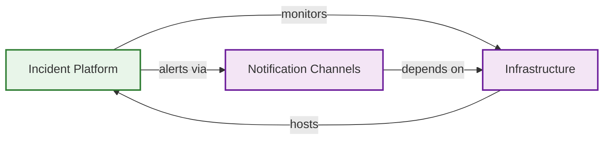
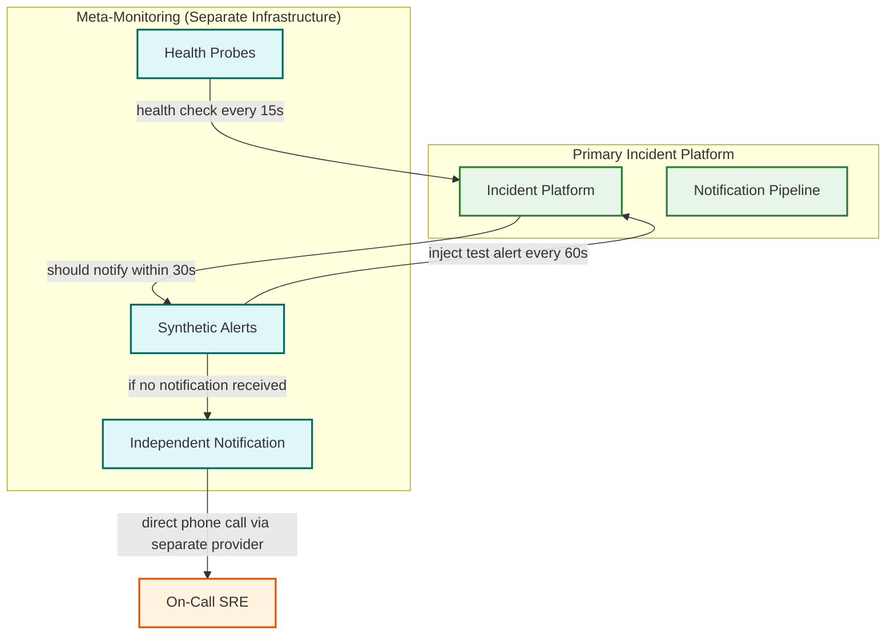

# Observability — Incident Management System

## 1. The Meta-Monitoring Challenge

Monitoring the incident management system creates a unique philosophical and architectural challenge: **how do you alert on failures in the system that sends alerts?** If the notification pipeline goes down, the system cannot notify anyone that the notification pipeline is down. This is the "meta-monitoring problem" — and solving it requires deliberately breaking the dependency cycle.

### 1.1 The Dependency Cycle



If any of these components fail, the cycle can collapse: infrastructure failure → platform failure → no alerts → no response → extended outage.

### 1.2 Breaking the Cycle: Independent Monitoring Path

The solution is a separate, minimal monitoring system that watches the incident platform and uses a completely independent notification path:



**Key principles for meta-monitoring:**
- **Separate infrastructure** — The meta-monitor runs on different compute, different network, different cloud account
- **Separate notification path** — Uses a different telephony provider, different phone numbers, different SMS gateway
- **Minimal complexity** — The meta-monitor is deliberately simple (< 1000 lines of code); complexity is the enemy of reliability
- **Synthetic transaction monitoring** — Injects a test alert every 60 seconds and verifies it flows through the entire pipeline (ingestion → dedup → routing → notification) within the SLO

---

## 2. Key Metrics

### 2.1 Incident Response Metrics (North Stars)

| Metric | Definition | Target | Measurement Point |
|--------|-----------|--------|-------------------|
| **MTTA** (Mean Time to Acknowledge) | Time from incident creation to first human acknowledgment | P1: < 5 min, P2: < 15 min | `incident.acknowledged_at - incident.created_at` |
| **MTTR** (Mean Time to Resolve) | Time from incident creation to resolution | P1: < 60 min, P2: < 4 hours | `incident.resolved_at - incident.created_at` |
| **MTTD** (Mean Time to Detect) | Time from failure occurrence to alert creation | < 5 min (depends on monitoring) | `alert.created_at - failure_start` (requires external correlation) |
| **MTTE** (Mean Time to Engage) | Time from notification to first meaningful action | < 10 min | First timeline event after acknowledgment |

### 2.2 Platform Health Metrics

| Metric | Definition | Alert Threshold | Dashboard |
|--------|-----------|----------------|-----------|
| **Alert ingestion rate** | Alerts accepted per second | > 5x normal → storm alert | Real-time |
| **Alert-to-notification latency** (p50, p95, p99) | Time from alert API receipt to notification dispatch | p99 > 20s → warning; > 30s → critical | Real-time |
| **Dedup ratio** | Alerts deduplicated / total alerts | < 10:1 during storm → dedup may be too conservative | Hourly |
| **Fingerprint store size** | Active fingerprints in sliding window | > 80% capacity → scale alert | Real-time |
| **Escalation timer accuracy** | |actual_fire_time - expected_fire_time| | > 10s → critical | Per-escalation |
| **Notification delivery rate** | Notifications successfully delivered / total sent | < 99% → critical | Per-channel, real-time |
| **Queue depth** (alert queue) | Messages waiting for processing | > 10K → auto-scale trigger; > 100K → critical | Real-time |
| **Queue consumer lag** | Time between message production and consumption | > 10s → warning; > 30s → critical | Real-time |

### 2.3 Notification Channel Metrics

| Channel | Latency (p50) | Delivery Rate | Key Failure Metric |
|---------|---------------|---------------|-------------------|
| **Phone** | 8s | 97% | No-answer rate, voicemail rate |
| **SMS** | 2s | 99% | Carrier rejection rate |
| **Push** | 1s | 99.5% | Token expiry rate |
| **Email** | 15s | 98% | Bounce rate, spam classification rate |
| **Slack** | 1s | 99.9% | Rate limit hit rate, token revocation |

### 2.4 On-Call Burden Metrics

| Metric | Definition | Purpose |
|--------|-----------|---------|
| **Pages per engineer per week** | Notifications received during on-call shift | Detect unfair distribution, alert fatigue |
| **After-hours pages** | Notifications received outside business hours | Quality-of-life, burnout prevention |
| **Sleep interruptions** | Phone calls between 22:00-06:00 local time | Most impactful quality metric |
| **Time-to-acknowledge per engineer** | Individual MTTA trend | Identify burnout (increasing MTTA = fatigue) |
| **Escalation rate** | % of incidents that escalate beyond L1 | High rate may indicate undertrained L1 or noisy alerts |

---

## 3. Distributed Tracing

### 3.1 Alert Lifecycle Trace

Every alert is assigned a trace ID at ingestion. This trace follows the alert through:

```
Span 1: API Gateway (receive, validate, normalize)
  └── Span 2: Alert Queue (enqueue, wait, dequeue)
       └── Span 3: Dedup Engine (fingerprint, lookup, decide)
            ├── Span 4a: Incident Create (if new)
            │    └── Span 5a: On-Call Resolution
            │         └── Span 6a: Escalation Start
            │              └── Span 7a: Notification Dispatch
            │                   ├── Span 8a: Phone Call (provider latency)
            │                   ├── Span 8b: Push Notification
            │                   └── Span 8c: Slack Message
            └── Span 4b: Incident Append (if dedup'd)
```

This trace allows answering: "Why did it take 45 seconds for Engineer X to get paged about this alert?" — by examining which span was the Slowest part of the process (queue wait time? dedup lookup? phone call setup?).

### 3.2 Notification Delivery Trace

Each notification gets a sub-trace tracking:
- Channel selection (which channel was chosen and why)
- Provider API call (request/response time, status)
- Delivery confirmation (when the provider confirmed delivery)
- User acknowledgment (when the engineer acknowledged)
- Failover events (if the first channel failed, when and why failover occurred)

---

## 4. Alerting on the Alerting System

### 4.1 Self-Monitoring Alerts

| Alert | Condition | Notification Path | Rationale |
|-------|-----------|-------------------|-----------|
| **Ingestion pipeline stalled** | No alerts processed for 5 minutes | Meta-monitor → direct phone call | May indicate queue failure or total platform outage |
| **Notification delivery degraded** | Delivery rate < 95% for 5 minutes per channel | Internal alert via all non-degraded channels | Channel-specific issue; use alternative channels |
| **Escalation timer drift** | Timer accuracy > ±10s | Internal alert (P2) | Indicates clock sync or timer store issues |
| **Synthetic alert not received** | Injected test alert not delivered within 60s | Meta-monitor → direct phone call | End-to-end pipeline validation failure |
| **Database replication lag** | Cross-region lag > 5s | Internal alert (P1) | Risk of stale incident state in failover |
| **Fingerprint store capacity** | > 85% of configured capacity | Internal alert (P2) | Risk of dedup failures under storm |
| **Telephony provider error rate** | > 5% call failures | Internal alert + failover to backup provider | Provider degradation |
| **Alert storm detected** | Alert rate > 10x normal for 2 minutes | Internal alert (informational) | Triggers auto-scaling and extended dedup windows |

### 4.2 The Synthetic Transaction Pipeline

The synthetic transaction is the most important self-monitoring mechanism:

```
Every 60 seconds:
  1. Meta-monitor sends a synthetic alert to the platform via API
     (tagged with synthetic=true, expected_recipient=meta-monitor-webhook)

  2. Platform processes the alert through the full pipeline:
     - Ingestion → normalization → dedup (synthetic alerts use unique fingerprints)
     - On-call resolution (synthetic alerts route to a test schedule)
     - Notification dispatch (sends to a webhook monitored by the meta-monitor)

  3. Meta-monitor checks:
     - Was the webhook called within 30 seconds? → pipeline healthy
     - Was the webhook called within 60 seconds? → pipeline degraded
     - Was the webhook NOT called within 60 seconds? → pipeline failure → page the platform SRE team via independent channel

  4. Metrics recorded:
     - Synthetic alert end-to-end latency (p50, p95, p99)
     - Synthetic alert success rate (should be 100%)
     - Time series of pipeline health (healthy/degraded/failed)
```

---

## 5. Dashboards

### 5.1 Real-Time Operations Dashboard

| Panel | Content | Refresh Rate |
|-------|---------|-------------|
| Alert ingestion rate | Time series: alerts/sec (5-min window) | 5s |
| Active incidents | Count by severity (P1/P2/P3/P4) with links | 10s |
| Notification pipeline | Per-channel success rate and latency | 10s |
| Escalation activity | Active escalations, timers due in next 5 min | 10s |
| Queue health | Depth and consumer lag for all queues | 5s |
| Synthetic health | Last 24h success/fail timeline | 60s |

### 5.2 Weekly Incident Report Dashboard

| Panel | Content |
|-------|---------|
| MTTA / MTTR trends | Week-over-week by severity |
| Incident volume by service | Top 10 noisiest services |
| On-call burden | Pages per engineer, sleep interruptions |
| Escalation analysis | % escalated, most common escalation reasons |
| Dedup effectiveness | Alerts suppressed, dedup ratio |
| Action item completion | Post-incident review action items completed vs overdue |

---

## 6. Logging Strategy

### 6.1 Structured Log Categories

| Category | Log Level | Content | Retention |
|----------|-----------|---------|-----------|
| **Alert processing** | INFO | Alert ID, fingerprint, dedup decision, incident ID | 30 days |
| **Notification delivery** | INFO | Notification ID, channel, user, delivery status, latency | 90 days |
| **Escalation events** | INFO | Incident ID, level, timer duration, outcome | 90 days |
| **Schedule resolution** | DEBUG | Schedule ID, resolved user, cache hit/miss | 7 days |
| **Runbook execution** | INFO | Runbook ID, incident ID, steps executed, output | 1 year |
| **Authentication** | INFO | User ID, method, success/failure, IP | 1 year |
| **API requests** | INFO | Endpoint, method, status code, latency, caller | 30 days |
| **Error events** | ERROR | Full stack trace, context, correlation ID | 90 days |

### 6.2 Correlation IDs

Every request entering the system is assigned a correlation ID that propagates through all downstream calls. This enables reconstructing the complete processing path of any alert:

```
correlation_id: "abc-123"
  → [API Gateway] Received alert from integration "prometheus-prod"
  → [Normalizer] Normalized to canonical schema, severity=critical
  → [Queue] Enqueued to partition 7
  → [Dedup] Fingerprint sha256:abc..., matched existing incident INC-4521
  → [Lifecycle] Appended to INC-4521, alert_count=47
  → (no new notification — dedup'd into existing incident)
```

---

## 7. Anomaly Detection Pipelines

Beyond static threshold alerts, the platform uses anomaly detection to catch subtle degradations:

| Pipeline | Input Signal | Detection Method | Alert Severity | Rationale |
|----------|-------------|-----------------|----------------|-----------|
| **Alert volume anomaly** | alerts/sec per integration | Z-score against 7-day seasonal baseline | P2 (internal) | Detects compromised integrations or alert flooding attacks |
| **MTTA drift** | Per-team MTTA over 7-day rolling window | Linear regression slope exceeding threshold | P3 (internal) | Early warning of on-call burnout or training gaps |
| **Notification latency creep** | p99 notification latency per channel | Percentile shift detection (current p99 > historical p95) | P2 (internal) | Provider degradation before SLO breach |
| **Dedup ratio collapse** | Dedup ratio drops below 5:1 during known storm | Ratio deviation from historical storm profile | P1 (internal) | Indicates dedup engine failure — noise will overwhelm responders |
| **Escalation rate spike** | % incidents escalating beyond L1 | Binomial test against 30-day rate | P3 (internal) | May indicate schedule misconfiguration or L1 skill gap |
| **Silent service detection** | Services with zero alerts for > 2x their historical alert interval | Time-since-last-alert exceeding expected interval | P2 (internal) | Monitoring gap — a service that normally alerts weekly but hasn't alerted in 3 weeks may have lost its monitoring |

---

## 8. Incident Classification and Severity Framework

### 8.1 Automated Severity Assessment

The platform uses signal analysis to recommend severity at incident creation:

```
FUNCTION RecommendSeverity(incident):
    score = 0

    // Signal 1: Affected service tier
    IF incident.service.tier == "revenue-critical":
        score += 40
    ELSE IF incident.service.tier == "customer-facing":
        score += 25
    ELSE IF incident.service.tier == "internal":
        score += 10

    // Signal 2: Alert volume (storm indicator)
    alert_count = incident.alert_count_in_first_5min
    IF alert_count > 100:
        score += 30
    ELSE IF alert_count > 20:
        score += 15

    // Signal 3: Blast radius (cross-service correlation)
    correlated_services = FindCorrelatedIncidents(incident, window=10min)
    IF correlated_services.count > 5:
        score += 30
    ELSE IF correlated_services.count > 2:
        score += 15

    // Map to severity
    IF score >= 70: RETURN P1
    IF score >= 45: RETURN P2
    IF score >= 20: RETURN P3
    RETURN P4
```

### 8.2 Incident Classification Framework

| Severity | Definition | MTTA Target | MTTR Target | Notification Strategy | Postmortem Required |
|----------|-----------|-------------|-------------|----------------------|-------------------|
| **P1 — Critical** | Revenue impact, data loss risk, or >10% of users affected | < 5 min | < 60 min | Phone call + all channels simultaneously | Yes — within 48h |
| **P2 — High** | Significant degradation affecting a subset of users or critical internal workflow | < 15 min | < 4 hours | Push + SMS; phone if after-hours | Yes — within 1 week |
| **P3 — Medium** | Minor degradation with workaround available, or non-customer-facing service | < 30 min | < 24 hours | Push + Slack | Optional |
| **P4 — Low** | Cosmetic issue, minor performance degradation, informational | Best effort | < 1 week | Slack only | No |

---

## 9. On-Call Experience Dashboard

### 9.1 Team Health View

The on-call experience dashboard surfaces metrics that predict burnout and drive schedule improvements:

| Panel | Metrics | Alert Threshold |
|-------|---------|----------------|
| **Sleep Interruptions** | Phone calls between 22:00-06:00 per engineer per week | > 3/week → manager notification |
| **Page Fairness Score** | Gini coefficient of pages across team members over 30 days | > 0.4 → schedule rebalancing recommended |
| **Toil Ratio** | % of pages that required no meaningful action (false positives, auto-resolved) | > 40% → alert tuning sprint recommended |
| **Escalation Reasons** | Breakdown: timeout vs. reassigned vs. policy-escalated | Timeout > 30% → investigate L1 availability |
| **Repeat Incident Rate** | % of incidents sharing root cause with a prior incident | > 20% → postmortem action item audit |
| **MTTA by Time-of-Day** | Heatmap of acknowledgment times across 24h×7days | After-hours MTTA > 2x business-hours → schedule adjustment |

### 9.2 Post-Incident Review Dashboard

| Panel | Content | Update Frequency |
|-------|---------|-----------------|
| Action item burndown | Open vs. completed action items by age and severity | Daily |
| Repeat incident tracker | Incidents matching root causes of previous postmortems with incomplete action items | Per-incident |
| Postmortem completion rate | % of required postmortems completed within deadline | Weekly |
| Top contributing causes | Pareto chart of root cause categories over 90 days | Weekly |
| Mean time to remediate | Average days from postmortem publication to all action items completed | Monthly |

---

## 10. Capacity Forecasting and SLO Tracking

### 10.1 Capacity Forecasting Metrics

| Metric | Trending Window | Forecast Method | Action Threshold |
|--------|----------------|----------------|-----------------|
| Alert ingestion rate | 90-day trend | Linear regression + seasonal decomposition | Forecast exceeds 70% of provisioned capacity within 30 days |
| Fingerprint store cardinality | 30-day trend | Linear growth rate extrapolation | Forecast exceeds 80% within 14 days |
| Notification volume per channel | 90-day trend | Seasonal ARIMA (weekly+daily patterns) | Forecast approaches provider rate limit within 7 days |
| Queue depth at peak | 7-day trend | Max-envelope tracking | Peak growing > 10% week-over-week |
| Database storage | 90-day trend | Linear with retention-adjusted decay | Forecast exceeds 75% within 60 days |
| Telephony cost per month | 30-day trend | Linear extrapolation | Forecast exceeds budget by > 10% |

### 10.2 SLO Compliance Tracking

```
SLO Burn Rate Dashboard:
  ┌─────────────────────────────────────────────────────┐
  │  SLO: Alert-to-Notification < 30s (p99)             │
  │  Budget: 43.2 min/month (99.9%)                     │
  │  Consumed: 12.8 min (29.6%)  ████████░░░░░░░░░░░░   │
  │  Burn rate: 0.98x (nominal)                         │
  │  Projected exhaustion: Never (at current rate)      │
  ├─────────────────────────────────────────────────────┤
  │  SLO: Notification Delivery > 99%                   │
  │  Budget: 7.2 hours/month                            │
  │  Consumed: 2.1 hours (29.2%) ████████░░░░░░░░░░░░   │
  │  Burn rate: 0.97x (nominal)                         │
  │  Projected exhaustion: Never                        │
  ├─────────────────────────────────────────────────────┤
  │  SLO: Escalation Timer Accuracy ±10s                │
  │  Budget: 0.1% of timers                             │
  │  Consumed: 0.02% ██░░░░░░░░░░░░░░░░░░               │
  │  Burn rate: 0.2x (well within budget)               │
  ├─────────────────────────────────────────────────────┤
  │  SLO: Synthetic Alert E2E < 30s                     │
  │  Budget: 43.2 failures/month (99.9%)                │
  │  Consumed: 3 failures ██░░░░░░░░░░░░░░░░░░           │
  │  Burn rate: 0.07x (excellent)                       │
  └─────────────────────────────────────────────────────┘
```

Multi-window burn rate alerting fires when short-term consumption rate threatens long-term budget:
- **Fast burn**: 14.4x budget consumption rate over 1 hour → P1 alert (will exhaust budget in ~2 days)
- **Slow burn**: 3x budget consumption rate over 6 hours → P2 alert (will exhaust budget in ~10 days)
