# 15.7 AI-Native Cybersecurity Platform

## Overview

An AI-Native Cybersecurity Platform provides unified threat detection, investigation, and response across endpoints, networks, cloud workloads, identities, and applications. Inspired by platforms such as CrowdStrike Falcon, SentinelOne Singularity, and Darktrace ActiveAI, the system ingests terabytes of telemetry daily, applies real-time ML-driven detection (EDR/XDR), builds behavioral baselines per entity (UEBA), correlates events into incidents (SIEM), and executes automated response playbooks (SOAR) — replacing the traditional collection of point solutions with a single AI-first security operations platform.

The platform embodies the "Enterprise Immune System" paradigm: rather than relying solely on signatures of known attacks, it learns what normal looks like for each organization, user, device, and workload, and detects deviations that signature-based tools fundamentally cannot see — novel malware, insider threats, supply-chain compromises, and living-off-the-land attacks.

## Autonomy Classification

**Tier: C — AI-Gated Action**

This is an **AI-gated action system** where AI interprets, generates, classifies, and executes within pre-approved policy boundaries. Actions outside those boundaries are escalated to human agents. All AI-initiated actions are logged, auditable, and reversible. AI detects threats, triages alerts, and generates security responses within pre-approved playbook boundaries, with SOC analysts reviewing escalated incidents.

| Boundary | AI Role | Human/System Authority |
|----------|---------|----------------------|
| **System of Record** | Platform state managed by transactional services; AI writes through validated APIs only | Transactional service layer |
| **System of Intelligence** | Interpretation, generation, classification, and decision-making within policy guardrails | AI engine with policy constraints |
| **Action Boundary** | Executes autonomously within pre-approved boundaries; escalates outside them | Policy engine + escalation rules |
| **Human Override** | SOC analysts review all AI-escalated incidents; automated responses limited to pre-approved containment playbooks | Domain expert |
| **Rollback Path** | All AI-initiated actions logged with full context; compensation transactions defined for every write path | Audit trail + compensation flows |

---

## Key Characteristics

| Characteristic | Description |
|----------------|-------------|
| **Write-heavy** | Millions of telemetry events per second from endpoint agents, network sensors, cloud connectors, and identity providers; TB-scale daily ingestion per large enterprise |
| **Read-heavy (threat hunting)** | Analysts perform ad-hoc queries over months of historical data; detection rules evaluate continuously against streaming and stored data |
| **Latency-critical** | Critical threat detection must occur in <1 second end-to-end; endpoint agents make local kill/quarantine decisions in <100ms |
| **Compute-intensive** | Real-time ML inference on streaming telemetry; behavioral baseline recomputation; graph-based alert correlation |
| **Multi-tenant** | Managed security service providers (MSSPs) operate thousands of customer tenants on shared infrastructure with strict isolation |
| **Asymmetric risk** | False negatives (missed attacks) can be catastrophic; false positives erode analyst trust and cause alert fatigue |

## Complexity Rating: **Very High**

The combination of real-time ML inference at massive scale, the false-positive vs. false-negative trade-off, multi-domain telemetry normalization (endpoints + network + cloud + identity), automated response with blast-radius control, and the meta-security challenge (securing the security platform itself) makes this one of the most demanding system designs in the cybersecurity domain.

### Why This Problem Is Architecturally Unique

| Dimension | What Makes It Different |
|-----------|------------------------|
| **Adversarial environment** | Unlike monitoring systems that observe cooperative software, cybersecurity platforms observe adversaries who actively try to evade detection — the "feature space" is non-stationary and hostile |
| **Extreme base rate imbalance** | With ~50 billion benign events per malicious event, even 99.99% precision produces millions of false alerts — no other domain operates at this imbalance |
| **Meta-security recursion** | The security platform itself is the highest-value target; compromising it blinds the entire organization — requiring the platform to defend against attacks on itself |
| **Response blast radius** | Automated actions (isolate endpoint, disable user, block IP) have real-world consequences — false positive responses cause operational outages |
| **Multi-domain correlation** | Attacks span email → identity → endpoint → network → cloud; detecting them requires joining events across fundamentally different telemetry schemas |
| **Regulatory fragmentation** | GDPR, HIPAA, PCI DSS, FedRAMP, and dozens of national regulations impose conflicting requirements on data residency, retention, and access |
| **GenAI copilot safety** | LLM-based analyst assistance introduces prompt injection risks where adversarial content in telemetry could manipulate the copilot |
| **Open schema evolution** | Migrating from proprietary schemas to OCSF while maintaining thousands of detection rules requires careful versioned migration strategies |
| **Cost at scale** | At ~$74/endpoint/year, the platform's cost structure is dominated by compute (69%), making decoupled compute and intelligent tiering critical economic levers |

## Target Audience

This design is relevant for:
- **Security engineers** building detection and response platforms
- **ML engineers** designing adversarial-robust classification systems at extreme scale
- **Platform engineers** architecting multi-tenant, multi-region data pipelines with compliance constraints
- **SOC architects** designing analyst workflows and automation

## Quick Links

| # | Section | Description |
|---|---------|-------------|
| 01 | [Requirements & Estimations](./01-requirements-and-estimations.md) | Functional/non-functional requirements, capacity planning, SLOs |
| 02 | [High-Level Design](./02-high-level-design.md) | Architecture diagram, data flow, key architectural decisions |
| 03 | [Low-Level Design](./03-low-level-design.md) | Data model, API design, core algorithms (Step-by-step plan in plain English) |
| 04 | [Deep Dive & Bottlenecks](./04-deep-dive-and-bottlenecks.md) | Real-time ML detection engine, behavioral analysis, SOAR executor |
| 05 | [Scalability & Reliability](./05-scalability-and-reliability.md) | Scaling telemetry ingestion, edge-cloud hybrid detection, multi-tenancy |
| 06 | [Security & Compliance](./06-security-and-compliance.md) | Meta-security, data sovereignty, RBAC, regulatory compliance |
| 07 | [Observability](./07-observability.md) | Detection pipeline health, model drift, MTTD/MTTR, alert fatigue |
| 08 | [Interview Guide](./08-interview-guide.md) | 45-minute pacing, trap questions, trade-off frameworks |
| 09 | [Insights](./09-insights.md) | Key architectural insights and non-obvious lessons |

## Technology Landscape

| Layer | Representative Examples | Role |
|-------|------------------------|------|
| Endpoint Detection (EDR) | CrowdStrike Falcon, SentinelOne | Lightweight agent collecting process, file, network, registry telemetry |
| Extended Detection (XDR) | Palo Alto Cortex XDR, Microsoft Defender XDR | Unified detection across endpoints, network, cloud, email, identity |
| Behavioral AI | Darktrace, Vectra AI | Unsupervised ML building per-entity behavioral baselines |
| SIEM / Security Data Lakehouse | Splunk, Elastic Security, Snowflake Security | Log aggregation, event correlation, compliance reporting — evolving to open lakehouse architectures |
| SOAR | Splunk SOAR, Palo Alto XSOAR | Playbook-driven automated incident response |
| Threat Intelligence | Recorded Future, MISP | IOC feeds, adversary tracking, STIX/TAXII distribution |
| UEBA | Exabeam, Microsoft Sentinel UEBA | User and entity behavior analytics with risk scoring |
| ITDR | CrowdStrike Falcon Identity, Silverfort | Identity threat detection — credential theft, privilege abuse, token manipulation |
| CNAPP | Wiz, Orca Security | Cloud-native application protection — CSPM, CWPP, runtime |
| GenAI Copilot | CrowdStrike Charlotte AI, SentinelOne Purple AI | LLM-powered analyst assistance — NL queries, incident summarization, playbook generation |
| ASM | Mandiant, Censys | External attack surface discovery — shadow IT, exposed services, certificate monitoring |

## Industry Context & Evolution (2024-2026)

The cybersecurity platform landscape has undergone a tectonic shift from best-of-breed point solutions to unified, AI-first platforms. Several converging forces drive this:

| Trend | Impact on Architecture |
|-------|----------------------|
| **GenAI-Powered Security Copilots** | LLM-based assistants (natural-language threat hunting, automated incident summarization, playbook generation) add a new inference layer between analysts and the detection engine, requiring prompt orchestration pipelines and context-window management for security data |
| **Security Data Lakehouse** | Platforms are migrating from proprietary SIEM indexes to open lakehouse architectures with columnar file formats and standard schemas (OCSF), decoupling storage from compute and reducing vendor lock-in by 10x on storage costs |
| **Identity Threat Detection and Response (ITDR)** | Identity has become the #1 attack vector; dedicated ITDR engines now run alongside EDR/NDR within XDR, analyzing authentication graphs, token theft, Entra ID/Okta abuse, and service principal compromise |
| **AI-Augmented Attack Techniques** | Attackers use generative AI for polymorphic malware, hyper-personalized phishing, and deepfake-assisted social engineering — forcing detection engines to shift from content-matching to behavioral-intent classification |
| **CNAPP Convergence** | Cloud-Native Application Protection Platforms (runtime protection, CSPM, CWPP) are merging with XDR/SIEM, creating a single pane for workload-to-alert visibility across cloud and on-premises environments |
| **Attack Surface Management (ASM)** | Continuous external ASM feeds now enrich the threat model with internet-exposed assets, shadow IT, and certificate expiry risk — prioritizing detections against known-exposed surfaces |
| **OCSF Schema Adoption** | The Open Cybersecurity Schema Framework standardizes event normalization across vendors, enabling multi-vendor data lakes and reducing the common-event-schema engineering burden |

## Core Security Concepts Referenced

- **MITRE ATT&CK** — Adversary tactics, techniques, and procedures (TTPs) framework for detection mapping
- **Kill Chain** — Multi-stage attack lifecycle model (reconnaissance → weaponization → exploitation → action on objectives)
- **IOC (Indicators of Compromise)** — Observable artifacts (hashes, IPs, domains) indicating potential intrusion
- **IOA (Indicators of Attack)** — Behavioral patterns indicating attack activity regardless of specific tools used
- **TTP (Tactics, Techniques, Procedures)** — High-level adversary behaviors that persist across tooling changes
- **STIX/TAXII** — Standards for structured threat intelligence exchange
- **Zero Trust** — "Never trust, always verify" — continuous authentication and authorization for every access request
- **OCSF** — Open Cybersecurity Schema Framework — vendor-neutral event schema for interoperable security telemetry
- **ITDR** — Identity Threat Detection and Response — dedicated detection for identity-layer attacks
- **CNAPP** — Cloud-Native Application Protection Platform — unified cloud workload security (CSPM + CWPP + runtime)
- **ASM** — Attack Surface Management — continuous discovery and monitoring of externally-exposed assets

## Related Patterns

This design connects to and builds on concepts from several other system design topics:

| Related Topic | Relationship | Key Insight |
|---------------|-------------|-------------|
| [15.1 Metrics & Monitoring System](../15.1-metrics-monitoring-system/00-index.md) | **Foundation** — The cybersecurity platform's observability layer (Section 07) is itself a metrics monitoring system; cardinality explosion from per-entity security metrics mirrors the challenges in 15.1 |
| [15.3 Log Aggregation System](../15.3-log-aggregation-system/00-index.md) | **Subsystem** — SIEM log aggregation is a specialized log pipeline; schema-on-read vs. schema-on-write tradeoffs from 15.3 directly apply to security event normalization |
| [15.6 Incident Management System](../15.6-incident-management-system/00-index.md) | **Integration** — The SOAR orchestrator and case management module implement patterns from incident management (escalation tiers, notification channels, post-incident review) |
| [12.13 Bot Detection System](../12.13-bot-detection-system/00-index.md) | **Parallel architecture** — Both systems solve real-time classification at massive scale with cascading ML models, behavioral baselines, and adversarial robustness; bot detection's score fusion techniques apply directly to multi-engine alert correlation |
| [1.5 Distributed Log-Based Broker](../1.5-distributed-log-based-broker/00-index.md) | **Infrastructure** — The partitioned streaming data bus that powers the ingestion pipeline is a log-based broker; partitioning by tenant + source_type applies the same patterns |
| [3.12 Recommendation Engine](../3.12-recommendation-engine/00-index.md) | **Algorithm pattern** — The ML model cascade (bloom → fast classifier → deep model) is architecturally analogous to the candidate generation → ranking → re-ranking pattern in recommendations, optimizing for compute cost at each stage |
| [2.10 Zero Trust Security Architecture](../2.10-zero-trust-security-architecture/00-index.md) | **Complementary** — Zero Trust provides the access control foundation; the cybersecurity platform provides the detection and response layer that validates whether Zero Trust policies are being enforced and detects policy bypasses |
| [15.4 eBPF-based Observability Platform](../15.4-ebpf-observability-platform/00-index.md) | **Telemetry source** — eBPF-based kernel instrumentation provides high-fidelity, low-overhead endpoint telemetry (process events, network flows, file access) that feeds the EDR collection layer |

## Design Dimensions at a Glance

```mermaid
%%{init: {'theme': 'neutral'}}%%
flowchart LR
    subgraph Detect["Detection Spectrum"]
        direction TB
        D1[Signatures<br/>Known Threats]
        D2[ML Classification<br/>Novel Patterns]
        D3[Behavioral Analysis<br/>Insider Threats]
        D4[GenAI Hunting<br/>Analyst Augmentation]
    end

    subgraph Respond["Response Spectrum"]
        direction TB
        R1[Automated<br/>High Confidence]
        R2[Semi-Auto<br/>Approval Gate]
        R3[Manual<br/>Analyst Driven]
    end

    subgraph Scale["Scale Challenges"]
        direction TB
        S1[2.2M Events/sec<br/>Ingestion]
        S2[190B Events/day<br/>Storage]
        S3[100K+ Endpoints<br/>Agent Management]
    end

    Detect --> Respond --> Scale

    classDef detect fill:#e8f5e9,stroke:#2e7d32,stroke-width:2px
    classDef respond fill:#fff3e0,stroke:#e65100,stroke-width:2px
    classDef scale fill:#f3e5f5,stroke:#6a1b9a,stroke-width:2px

    class D1,D2,D3,D4 detect
    class R1,R2,R3 respond
    class S1,S2,S3 scale
```

