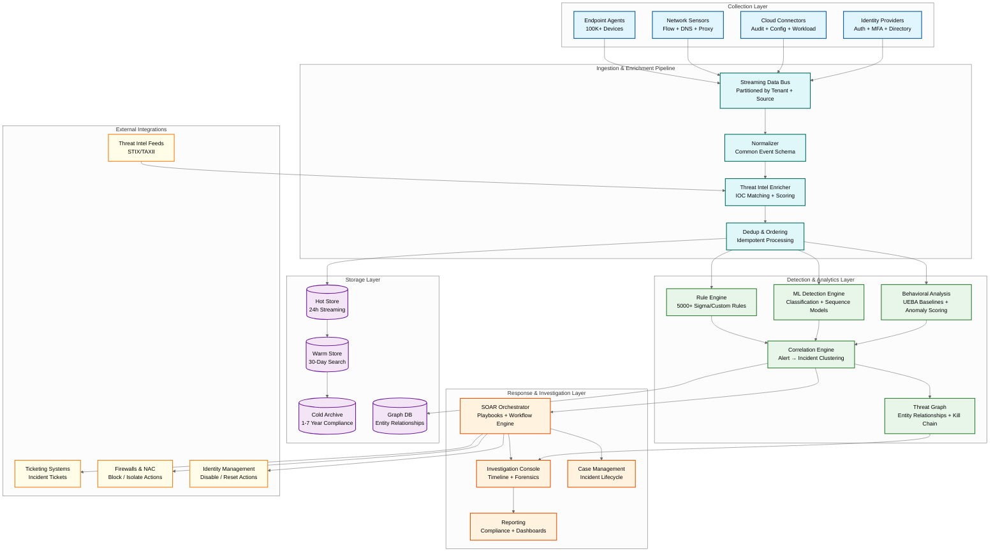
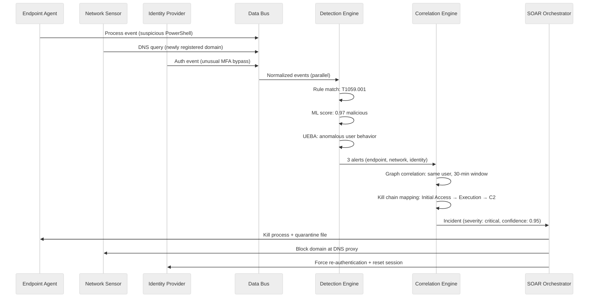
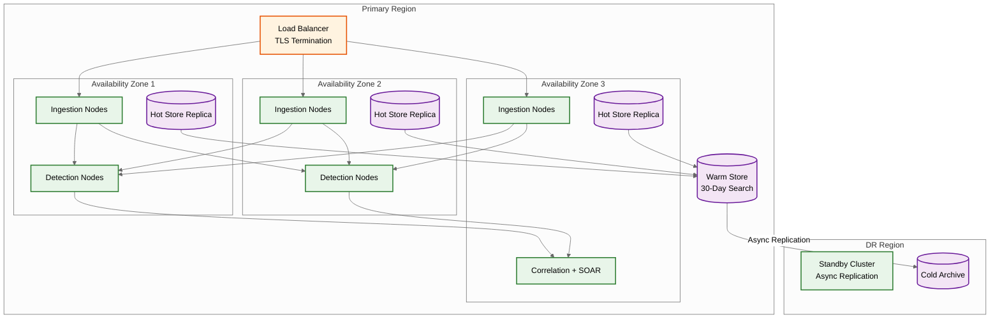
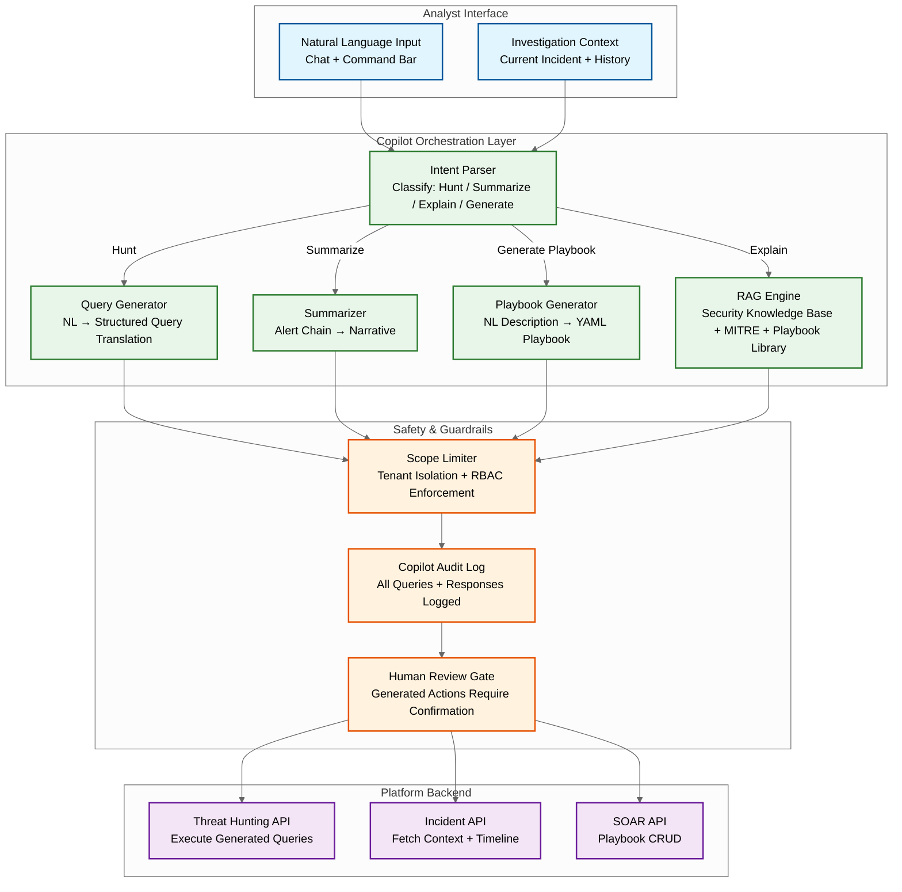
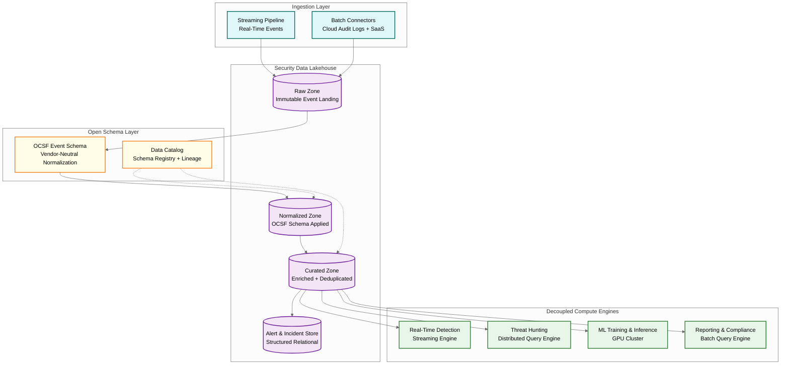
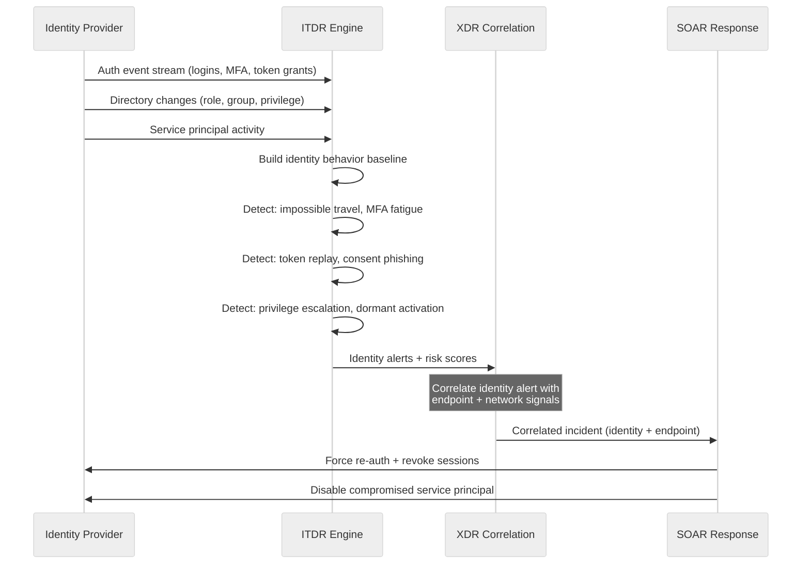

# High-Level Design — AI-Native Cybersecurity Platform

## Architecture Overview

The platform follows a **layered edge-cloud architecture** with four major tiers: (1) the **collection layer** (endpoint agents, network sensors, cloud connectors), (2) the **ingestion and enrichment pipeline** (streaming data bus, normalization, threat intel enrichment), (3) the **detection and analytics layer** (ML detection engine, rule engine, behavioral analysis, correlation engine), and (4) the **response and investigation layer** (SOAR orchestrator, investigation console, reporting).

---

## Data Flow: Threat Detection → Response Lifecycle

The platform processes every security event through a multi-stage pipeline that transforms raw telemetry into actionable incidents.

```mermaid
%%{init: {'theme': 'neutral'}}%%
flowchart LR
    subgraph Stage1["1. Collection"]
        A1[Raw Telemetry<br/>Process + File + Network]
    end

    subgraph Stage2["2. Normalization"]
        A2[Common Event Schema<br/>Mapped to MITRE ATT&CK]
    end

    subgraph Stage3["3. Enrichment"]
        A3[IOC Match<br/>+ Asset Context<br/>+ User Context]
    end

    subgraph Stage4["4. Detection"]
        A4[Rules: Known TTPs<br/>ML: Unknown Threats<br/>UEBA: Anomalies]
    end

    subgraph Stage5["5. Correlation"]
        A5[Alert Clustering<br/>Kill Chain Assembly<br/>Incident Creation]
    end

    subgraph Stage6["6. Response"]
        A6[Auto: Isolate/Block<br/>Semi-Auto: Approval Gate<br/>Manual: Analyst Action]
    end

    A1 --> A2 --> A3 --> A4 --> A5 --> A6

    classDef stage1 fill:#e1f5fe,stroke:#01579b,stroke-width:2px
    classDef stage2 fill:#e0f7fa,stroke:#00695c,stroke-width:2px
    classDef stage3 fill:#fffde7,stroke:#f57f17,stroke-width:2px
    classDef stage4 fill:#e8f5e9,stroke:#2e7d32,stroke-width:2px
    classDef stage5 fill:#fff3e0,stroke:#e65100,stroke-width:2px
    classDef stage6 fill:#f3e5f5,stroke:#6a1b9a,stroke-width:2px

    class A1 stage1
    class A2 stage2
    class A3 stage3
    class A4 stage4
    class A5 stage5
    class A6 stage6
```

### Detailed Event Lifecycle

1. **Collection:** Endpoint agent captures a process creation event — `cmd.exe` spawned by `outlook.exe` with a suspicious command-line argument containing a Base64-encoded PowerShell payload.

2. **Normalization:** Event is mapped to the Common Event Schema with fields: `source_type=endpoint`, `event_type=process_create`, `parent_process=outlook.exe`, `child_process=cmd.exe`, `command_line=<decoded>`, `mitre_technique=T1059.001` (Command and Scripting Interpreter: PowerShell).

3. **Enrichment:** Event is enriched with: (a) asset context — the endpoint belongs to the finance department, runs a legacy OS, has 3 unpatched critical CVEs; (b) user context — the user has admin privileges and recently completed security awareness training; (c) threat intel — the decoded PowerShell matches a known Cobalt Strike beacon pattern (IOC match, confidence: 0.92).

4. **Detection:** Three detection engines fire in parallel: (a) Rule engine matches Sigma rule "Suspicious PowerShell Execution from Office Application" (severity: high); (b) ML classifier scores the process tree as 0.97 malicious based on parent-child relationship and command-line features; (c) UEBA flags the user as anomalous — no previous PowerShell usage in 30-day baseline.

5. **Correlation:** The correlation engine links this alert with two earlier alerts from the same user: (a) a suspicious email attachment download (30 minutes earlier) and (b) an unusual DNS query to a domain registered 24 hours ago. These three alerts are clustered into a single incident: "Probable Phishing → Initial Access → Command Execution" with kill chain stages mapped.

6. **Response:** SOAR playbook triggers: (a) **Immediate (automated):** Endpoint agent kills the suspicious process and quarantines the associated file. (b) **Within 30 seconds (automated):** Block the suspicious domain at the DNS proxy and email gateway. (c) **Within 2 minutes (human approval):** Isolate the endpoint from the network (requires approval gate because isolation disrupts the user). (d) **Within 5 minutes (automated):** Create an incident ticket, notify the SOC team, and pull a forensic snapshot of the endpoint.

---

## Key Architectural Decisions

### Decision 1: Edge-Cloud Hybrid Detection

**Choice:** Split detection between the endpoint agent (edge) and the cloud platform.

| Detection Tier | Location | Latency | Examples |
|---------------|----------|---------|----------|
| **Tier 0: Agent-local** | On the endpoint | <100ms | Known malware hashes, process injection detection, ransomware canary monitoring |
| **Tier 1: Cloud real-time** | Streaming pipeline | <1s | ML model inference, rule evaluation, IOC matching |
| **Tier 2: Cloud behavioral** | Batch/micro-batch | <15 min | UEBA anomaly scoring, slow-and-low attack correlation |
| **Tier 3: Threat hunting** | Ad-hoc query | Minutes-hours | Analyst-driven hypothesis-based investigation |

**Rationale:** Tier 0 ensures the endpoint is protected even when cloud connectivity is lost (e.g., during a network attack). Tier 1 applies the full power of centralized ML and threat intel. Tier 2 catches attacks that unfold too slowly for real-time detection. Tier 3 discovers attacks that evade all automated detection.

**Trade-off:** Edge detection requires shipping model updates to 100K+ agents (model distribution challenge). Cloud detection requires reliable, low-latency event forwarding (bandwidth challenge).

### Decision 2: Stream Processing for Detection, Not Batch

**Choice:** The primary detection pipeline uses stream processing (event-at-a-time with windowed state) rather than batch processing.

**Rationale:**
- Threat detection is fundamentally a streaming problem — events arrive continuously, and detection latency directly impacts breach severity
- Rule evaluation against individual events is naturally streaming
- ML inference on single events or short sequences is low-latency
- Behavioral analysis uses streaming micro-batches (5-minute tumbling windows) feeding into daily batch baselines

**Trade-off:** Stream processing state management is complex (checkpointing, exactly-once semantics). Batch would be simpler but unacceptable for real-time detection.

### Decision 3: Unified Telemetry Schema (Common Event Model)

**Choice:** All telemetry — regardless of source — is normalized to a single Common Event Schema before entering the detection pipeline.

**Schema design:**
- ~200 standard fields covering process, file, network, identity, cloud, and email domains
- Every event maps to zero or more MITRE ATT&CK techniques
- Extensible key-value fields for source-specific metadata
- Deterministic event ID generation for idempotent deduplication

**Rationale:** Cross-domain correlation (XDR) is impossible without a common schema. An endpoint process event and a network flow event must share common fields (source IP, user, timestamp, asset ID) to be joinable.

**Trade-off:** Schema normalization adds ingestion latency (~5-10ms). Some source-specific fidelity is lost in translation. Schema evolution requires careful versioning.

### Decision 4: Layered Detection Architecture (Rules + ML + Behavioral)

**Choice:** Three independent detection engines operating in parallel, each with different strengths.

| Engine | Strength | Weakness | Use Case |
|--------|----------|----------|----------|
| **Rule Engine** | Deterministic, explainable, fast | Cannot detect unknown attacks | Known TTPs, compliance rules, IOC matching |
| **ML Detection** | Detects novel patterns | Black-box, requires training data | Malware classification, phishing detection, anomalous command-lines |
| **Behavioral (UEBA)** | Detects insider threats, slow attacks | High false positive rate, slow baseline | Impossible travel, privilege abuse, data exfiltration |

**Rationale:** No single detection approach covers all threat categories. Rules catch known attacks with near-zero false positives. ML catches novel variants that bypass rules. Behavioral analysis catches insiders and slow attacks that don't trigger point-in-time detections.

**Trade-off:** Running three engines in parallel triples compute cost. Alert fusion from three engines requires careful deduplication to avoid triple-counting.

### Decision 5: Graph-Based Alert Correlation

**Choice:** Model entities (users, devices, IPs, processes, files, domains) and their relationships as a graph. Use graph traversal to correlate alerts into incidents.

**Rationale:** Attacks are inherently graph-structured: an attacker compromises user A, uses user A's device to access server B, pivots from server B to database C. Linear event streams cannot capture this structure; a graph naturally represents it.

**Trade-off:** Graph databases have higher operational complexity than relational databases. Graph queries can be expensive for highly connected nodes (e.g., a domain controller touched by every user).

---

## Component Interaction: Multi-Domain Detection (XDR)

---

## Deployment Architecture

### Multi-Region Considerations

- **Primary region:** Handles all ingestion, detection, and response. Deployed across 3 AZs for fault tolerance.
- **DR region:** Receives async-replicated alert and incident data. Can be promoted to primary within 15 minutes if the primary region fails.
- **Data residency:** Customers in regulated industries (GDPR, data sovereignty) get dedicated regional deployments where telemetry never leaves the region.
- **Agent failover:** Endpoint agents maintain a prioritized list of ingestion endpoints across regions. If the primary is unreachable, they fail over to the DR region automatically.

---

## GenAI Security Copilot Architecture

The GenAI copilot adds an AI assistant layer that augments analyst workflows without replacing human judgment for response decisions.

### Copilot Design Decisions

| Decision | Choice | Rationale |
|----------|--------|-----------|
| **No autonomous response actions** | Copilot recommends but never executes | A hallucinated or incorrect action (isolate wrong endpoint) is worse than a delayed action; human confirmation is required |
| **RAG over fine-tuning** | Retrieval-augmented generation with security knowledge base | Security knowledge changes daily (new CVEs, new TTPs); fine-tuning lags by weeks while RAG reflects current threat intel |
| **Per-tenant context isolation** | Copilot context window scoped to tenant data only | Prevents cross-tenant data leakage through LLM context; each tenant's copilot session is isolated |
| **Query validation before execution** | Generated queries pass through a validator before hitting the search backend | Prevents LLM hallucination from generating destructive or overly broad queries (e.g., `SELECT * FROM events` without time bounds) |
| **Audit trail** | Every copilot interaction (input + output) is immutably logged | Compliance requirement; also enables copilot accuracy measurement and improvement |

---

## Security Data Lakehouse Architecture

Modern cybersecurity platforms are migrating from monolithic SIEM indexes to a lakehouse architecture that decouples storage from compute.

### Lakehouse Benefits for Security

| Benefit | Traditional SIEM | Lakehouse Architecture |
|---------|-----------------|----------------------|
| **Storage cost** | $3-10/GB/day (proprietary index) | $0.02-0.10/GB/day (object storage + columnar format) |
| **Vendor lock-in** | Complete (proprietary format) | Minimal (open file formats, standard schema) |
| **Query flexibility** | Limited to vendor query language | Any compute engine can query the same data |
| **Retention economics** | 30-90 days typical (cost-limited) | 1-7 years feasible at object storage prices |
| **ML integration** | Export data → train model → import predictions | ML engines read directly from the lakehouse |
| **Multi-tenant isolation** | Application-layer partitioning | File-system-level partitioning + per-tenant encryption keys |

---

## ITDR (Identity Threat Detection) Integration

### ITDR-Specific Detection Logic

| Attack Pattern | Detection Approach | False Positive Mitigation |
|---------------|-------------------|--------------------------|
| **Impossible travel** | Haversine distance / time between auth events from different geos | Exclude VPN exit nodes, known travel schedules, mobile device IP changes |
| **MFA fatigue / push bombing** | >3 MFA prompts within 5 minutes without successful auth | Check if user subsequently reports to helpdesk (legitimate forgotten password) |
| **Token replay from new device** | Session token used from device fingerprint not matching original auth device | Allow for legitimate device migration with grace period |
| **OAuth consent phishing** | New app registration + consent grant to unverified publisher within 24h | Reputation scoring of app publisher; known-good publisher allowlist |
| **Service principal key theft** | Service principal authenticating from unexpected IP range or at unexpected time | Per-principal behavioral baseline; differentiate from legitimate infrastructure changes |
| **Kerberoasting** | Abnormally high TGS requests for service accounts from a single user | Baseline per-user TGS request patterns; exclude known service desk activities |
