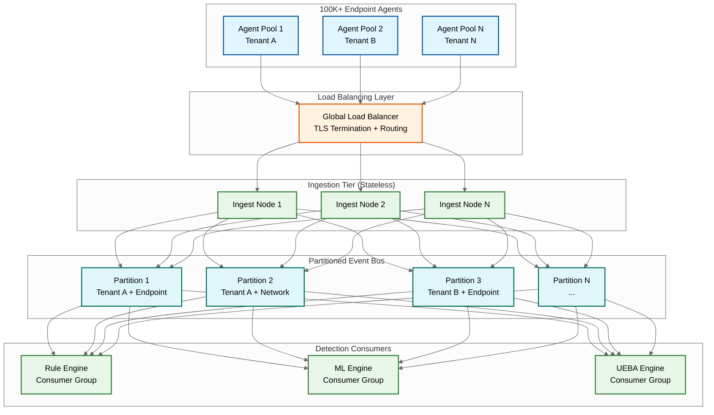
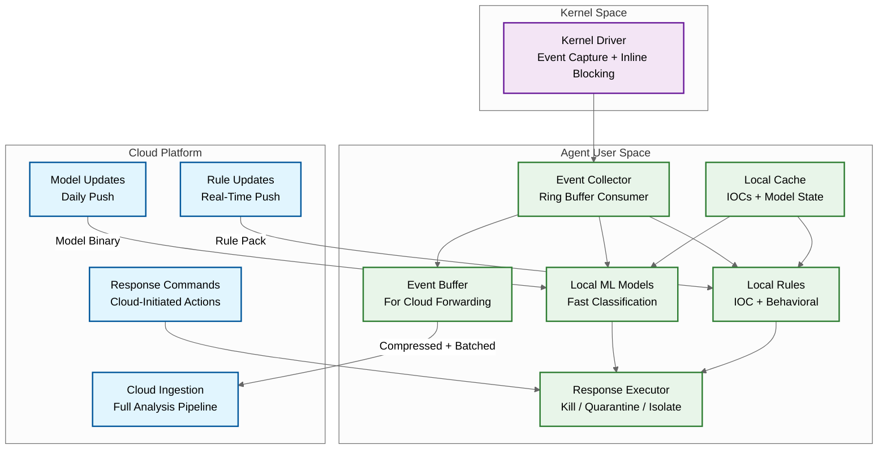
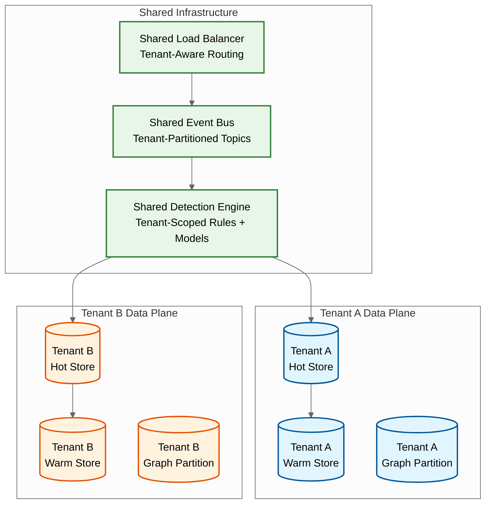
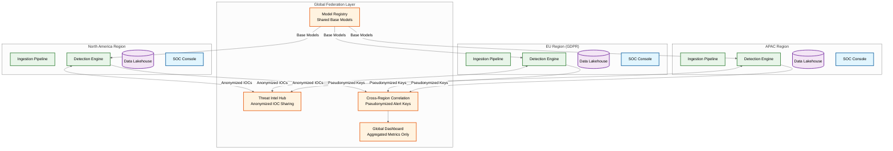

# Scalability & Reliability — AI-Native Cybersecurity Platform

## Scaling Telemetry Ingestion (Millions of Events/sec)

### Horizontal Scaling Architecture

The ingestion pipeline is designed for linear horizontal scaling by partitioning the event stream across multiple independent processing lanes.



### Scaling Dimensions

| Dimension | Strategy | Details |
|-----------|----------|---------|
| **Ingestion throughput** | Stateless horizontal scaling | Add ingestion nodes; each handles ~11K events/sec. Auto-scale based on queue depth. |
| **Event bus capacity** | Partition splitting | Add partitions as tenants or event volume grows. Re-partition without downtime using consumer group rebalancing. |
| **Detection compute** | Independent consumer groups | Rule engine, ML engine, and UEBA engine scale independently. Each reads from the same partitions but processes events in parallel. |
| **Storage throughput** | Write fan-out | Events are written to hot store, warm store (async), and graph store (alerts only) in parallel. Each storage tier scales independently. |

### Back-Pressure and Load Shedding

When ingestion rate exceeds processing capacity, the system applies graduated load shedding:

| Level | Trigger | Action |
|-------|---------|--------|
| **Level 0: Normal** | Queue depth < 10s | Full processing pipeline |
| **Level 1: Elevated** | Queue depth 10-60s | Disable low-priority enrichments (asset risk scoring, vulnerability correlation) |
| **Level 2: High** | Queue depth 60-300s | Skip deep ML model; rely on fast classifier + rules only |
| **Level 3: Critical** | Queue depth > 300s | Agent-side sampling: agents reduce telemetry to essential events only (process create, network connect, auth events) |

**Key principle:** Load shedding never drops security-critical events (alerts, response confirmations, agent health). It reduces the fidelity of routine telemetry to preserve the detection pipeline's capacity for what matters.

---

## Edge-Cloud Hybrid Detection Architecture

### The Detection Split

Security detection operates across a spectrum from edge (endpoint agent) to cloud (centralized platform), with each location offering different trade-offs.

| Detection Tier | Location | Latency | Model Complexity | Context Available | Update Frequency |
|---------------|----------|---------|-----------------|-------------------|-----------------|
| **Tier 0: Kernel-level** | Endpoint kernel driver | <1ms | Lightweight rules, hash matching | Local process + file only | Weekly (driver update) |
| **Tier 1: Agent-level** | Endpoint user-space agent | <100ms | Small ML models (gradient boosted trees), behavioral rules | Local process tree + recent history | Daily (model push) |
| **Tier 2: Cloud real-time** | Streaming pipeline | <1s | Large ML models (transformers), full rule engine | All telemetry, threat intel, asset context | Continuous (streaming model serving) |
| **Tier 3: Cloud batch** | Batch analytics | <15 min | UEBA baselines, graph analytics, threat hunting | Full historical data | Hourly (baseline recompute) |

### Agent Architecture for Edge Detection



### Offline Protection

When the endpoint loses cloud connectivity, the agent continues protecting with:

- **Local IOC cache:** Last-synced IOCs (typically refreshed daily) — catches known threats
- **Local ML models:** Last-pushed models — catches novel threats matching trained patterns
- **Local behavioral rules:** Process tree anomalies, ransomware canary detection (mass file encryption), credential dumping detection (LSASS access)
- **Event buffering:** Up to 48 hours of telemetry buffered locally (compressed), forwarded when connectivity restores

**Limitation:** During offline mode, the agent cannot access cloud-side context (other endpoints' telemetry, threat intel updates, UEBA baselines). Cross-endpoint correlation stops.

---

## Multi-Tenant Architecture for Managed Security

### Tenant Isolation Model



### Isolation Guarantees

| Layer | Isolation Method | Guarantee |
|-------|-----------------|-----------|
| **Network** | Tenant-specific TLS certificates; agent authenticates with tenant-scoped API keys | No cross-tenant network traffic |
| **Compute** | Shared detection engines operate on tenant-partitioned data; no cross-partition reads | Logical isolation; noisy neighbor limits via per-tenant rate limiting |
| **Storage** | Separate storage namespaces per tenant; encryption with per-tenant keys | Cryptographic isolation |
| **Detection rules** | Per-tenant rule sets with shared global rules (platform-provided) | Tenant cannot see or modify another tenant's custom rules |
| **ML models** | Shared base models + per-tenant fine-tuned models | Base model trained on anonymized aggregate data; fine-tuned model trained only on tenant's data |
| **SOAR playbooks** | Per-tenant playbook definitions; integration credentials stored in per-tenant vaults | Playbook from Tenant A cannot trigger actions in Tenant B |

### Noisy Neighbor Prevention

Large tenants (100K+ endpoints) can overwhelm shared resources. Prevention mechanisms:

- **Per-tenant ingestion rate limits:** Configurable events/sec quota per tenant with token-bucket rate limiting
- **Per-tenant detection compute quotas:** ML inference time allocated proportionally; burst capacity shared with preemption
- **Per-tenant query concurrency limits:** Max concurrent hunting queries per tenant
- **Weighted fair queuing:** Event bus consumers process events from all tenants fairly, weighted by tier (enterprise > SMB)

---

## Disaster Recovery

### Recovery Architecture

| Component | RPO | RTO | Strategy |
|-----------|-----|-----|----------|
| Telemetry ingestion | 0 (no data loss) | <5 min | Multi-AZ active-active; agents retry to alternate AZs |
| Detection pipeline | <1 min | <15 min | Standby consumers in DR region, activated on failover |
| Alert/incident state | <1 min | <15 min | Synchronous replication within region; async to DR |
| Warm search data | <1 hour | <4 hours | Async replication; some recent data may be re-indexed from hot store |
| SOAR playbook state | <1 min | <15 min | Playbook definitions replicated; in-flight executions may need restart |
| Configuration (rules, models) | <5 min | <15 min | Configuration store replicated to DR; agent configuration cached locally |

### Failover Scenarios

**Scenario 1: Single AZ failure**
- Agents failover to other AZs in the same region (automatic, <30 seconds)
- Detection pipeline rebalances across remaining AZs
- No data loss; brief increase in detection latency during rebalancing

**Scenario 2: Full region failure**
- Agents failover to DR region endpoints (automatic, <5 minutes)
- DR region detection pipeline activates from standby
- Alert state available from async replication (RPO <1 min)
- Warm search data may have up to 1 hour gap; agents re-send buffered events

**Scenario 3: Cloud platform failure (total outage)**
- Endpoint agents continue protecting locally (Tier 0 + Tier 1 detection)
- Events buffered locally for up to 48 hours
- No cloud-side correlation, threat hunting, or SOAR automation
- Recovery: agents drain buffered events on restoration; detection pipeline processes backlog

---

## Scaling for Growth

### Growth Vectors and Scaling Responses

| Growth Vector | Current | 2x Scale | 10x Scale |
|---------------|---------|----------|-----------|
| Endpoints | 100K | Add ingestion nodes (stateless) | Shard event bus; add regions for geo-distribution |
| Event volume | 2.2M/s | Increase partition count; add detection consumers | Tiered ingestion: pre-filter at edge; sample routine telemetry |
| Detection rules | 5,000 | Optimize rule engine with decision tree compilation | Partition rules by event type; evaluate only applicable rules per event |
| ML models | 10 models | Add GPU inference nodes | Model distillation; move lightweight models to edge |
| Tenants (MSSP) | 100 | Per-tenant resource pools | Dedicated infrastructure for large tenants; shared for SMB |
| Retention | 30 days | Add warm storage nodes | Tiered storage with intelligent archival (keep only alerts + context for >30d) |

---

## Global Federation Architecture

For multinational enterprises and large MSSPs, a single-region deployment cannot satisfy data residency requirements. The platform supports a federated architecture where regional deployments operate independently but share anonymized threat intelligence.



### Federation Design Principles

| Principle | Implementation | Why |
|-----------|---------------|-----|
| **Data sovereignty** | Telemetry never leaves its originating region | GDPR, national security requirements |
| **Anonymized threat sharing** | Only IOC hashes, MITRE technique IDs, and severity — no PII | Enables cross-region defense without privacy violations |
| **Shared model, local fine-tuning** | Base models trained on curated (non-customer) data; per-region fine-tuning | Best of both worlds: general detection + regional specificity |
| **Pseudonymized correlation** | Cross-region correlation uses hashed entity identifiers | Detects multi-region attacks without exposing identity details |
| **Regional autonomy** | Each region operates independently during federation outages | Federation is additive value, not a dependency |

---

## Lakehouse Storage Tiering and Cost Optimization

The security data lakehouse uses intelligent tiering to balance query performance against storage cost.

```mermaid
%%{init: {'theme': 'neutral'}}%%
flowchart LR
    subgraph Hot["Hot Tier (0-24h)"]
        H1[Streaming Platform<br/>In-Memory + SSD]
        H2[Real-Time Queries<br/>Sub-second Latency]
    end

    subgraph Warm["Warm Tier (1-30 days)"]
        W1[Columnar Store<br/>SSD + Object Storage]
        W2[Threat Hunting<br/>Seconds Latency]
    end

    subgraph Cold["Cold Tier (30 days - 1 year)"]
        C1[Object Storage<br/>Columnar Files + Partition Index]
        C2[Forensic Queries<br/>Minutes Latency]
    end

    subgraph Archive["Archive (1-7 years)"]
        A1[Infrequent-Access Object Storage<br/>Heavily Compressed]
        A2[Compliance Audits<br/>Hours Latency]
    end

    Hot -->|"Compaction + Rollover"| Warm
    Warm -->|"Age-Based Migration"| Cold
    Cold -->|"Compression + Sampling"| Archive

    classDef hot fill:#fff3e0,stroke:#e65100,stroke-width:2px
    classDef warm fill:#e8f5e9,stroke:#2e7d32,stroke-width:2px
    classDef cold fill:#e0f7fa,stroke:#00695c,stroke-width:2px
    classDef archive fill:#f3e5f5,stroke:#6a1b9a,stroke-width:2px

    class H1,H2 hot
    class W1,W2 warm
    class C1,C2 cold
    class A1,A2 archive
```



### Intelligent Data Lifecycle Policies

| Policy | Trigger | Action | Cost Impact |
|--------|---------|--------|-------------|
| **Hot → Warm rollover** | Event age > 24h | Compact, column-encode, write to warm store; remove from hot | 10x storage cost reduction |
| **Alert-aware archival** | Events not associated with any alert after 7 days | Move to cold tier with aggressive compression | 50x cost reduction vs. warm |
| **Context preservation** | Event associated with an alert or incident | Retain in warm tier for the incident's lifecycle (up to 1 year) | Ensures forensic context is queryable |
| **Selective sampling** | Cold → archive transition | For routine telemetry (non-alert), retain 1-in-100 sample + full metadata index | 100x reduction with query capability |
| **Compliance retention** | Regulatory requirement (GDPR 6yr, HIPAA 6yr, SOX 7yr) | Maintain full-fidelity data in archive with per-tenant retention policies | Minimum cost tier; encrypted at rest |

### Storage Cost Model (Annual, 100K Endpoints)

| Tier | Volume | $/GB/Month | Annual Cost | % of Total |
|------|--------|------------|-------------|------------|
| Hot (24h) | 15 TB | $0.50 | $90K | 3% |
| Warm (30d) | 450 TB | $0.05 | $270K | 10% |
| Cold (1yr) | 2 PB | $0.01 | $240K | 9% |
| Archive (7yr) | 5 PB | $0.004 | $240K | 9% |
| **Compute** | — | — | **$1.8M** | **69%** |
| **Total** | — | — | **$2.64M** | — |

**Key insight:** Compute dominates the cost structure (69%), not storage. The lakehouse architecture's decoupled compute model enables spinning compute up/down based on workload (detection is always-on; hunting is on-demand; compliance reporting is batch), reducing the effective compute cost by 30-40% compared to coupled SIEM architectures.

---

## Reliability Patterns for Security-Critical Systems

### Circuit Breaker for External Integrations

SOAR playbooks depend on external systems (firewalls, identity providers, ticketing systems) that may fail. A circuit breaker prevents cascading failures.

```
FUNCTION execute_integration_action(action, target_system):
    breaker = get_circuit_breaker(target_system)

    IF breaker.state == OPEN:
        // System is known-down; don't waste time
        IF action.is_critical:
            // Critical actions queue for retry when circuit closes
            enqueue_for_retry(action, max_retries = 10, backoff = exponential)
            notify_analyst("Action queued: {target_system} unreachable")
        RETURN CIRCUIT_OPEN

    TRY:
        result = execute_with_timeout(action, timeout = action.timeout)
        breaker.record_success()
        RETURN result

    CATCH TimeoutError, ConnectionError:
        breaker.record_failure()
        IF breaker.failure_count >= breaker.threshold:
            breaker.trip()  // CLOSED → OPEN
            notify_soc("Circuit opened for {target_system}: {breaker.failure_count} consecutive failures")

        IF action.is_critical:
            enqueue_for_retry(action)
        RETURN INTEGRATION_FAILURE
```

### Graceful Degradation Hierarchy

When components fail, the platform degrades gracefully rather than failing completely:

| Failure | Impact | Degraded Mode | Recovery |
|---------|--------|---------------|----------|
| GPU cluster down | No deep ML inference | Fast classifier + rules only (reduced novel-threat detection) | Auto-recover when GPUs restored; backfill inference on queued events |
| Graph database down | No graph-based correlation | Time-window + entity-overlap correlation (reduced multi-stage detection) | Rebuild graph from alert store on recovery |
| Threat intel service down | No real-time IOC enrichment | Agent-cached IOCs (stale by hours); rules and ML still operational | Bulk IOC sync on recovery |
| SOAR external integration down | Automated response actions fail | Queue actions; escalate to manual response; analyst executes via alternative channel | Drain retry queue on recovery |
| Warm storage down | No threat hunting queries | Recent events (24h) still queryable from hot store; historical queries unavailable | Redirect queries to cold store (slower) while warm recovers |
| GenAI copilot down | No natural-language assistance | Analysts use traditional query interface and manual investigation | Non-critical; analysts are trained to operate without copilot |

### Agent Resilience Under Adversarial Conditions

The endpoint agent must survive conditions that typical software never faces — active attempts by a sophisticated attacker to disable, blind, or corrupt it.

| Adversarial Scenario | Agent Defense | Fallback |
|---------------------|--------------|----------|
| Attacker kills agent process | Kernel watchdog auto-restarts agent within 5 seconds | If repeated kills, kernel driver continues minimal telemetry (process create, network connect) |
| Attacker blocks agent network traffic | Agent buffers events locally (up to 48h); uses multiple outbound channels (HTTPS, DNS-over-HTTPS, steganographic) | Network sensors detect missing agent traffic from active host |
| Attacker corrupts agent binary | Startup self-integrity check; kernel driver validates binary hash before allowing execution | Cloud-side push of clean binary via out-of-band channel |
| Attacker loads kernel rootkit | Agent monitors kernel callback tables; detects unexpected modifications | UEFI Secure Boot chain validates kernel and driver integrity at boot |
| Attacker sandboxes agent | Agent detects sandboxing via environmental checks (limited network, missing system components) | Reports sandbox detection as high-severity alert |

## AI Release Ladder

Every AI model or capability change in this system MUST follow this rollout sequence:

| Stage | Description | Gate Criteria |
|-------|-------------|---------------|
| 1. Offline Evaluation | Benchmark against historical ground truth | Meets baseline metrics |
| 2. Shadow Mode | Run in parallel with production, compare outputs | No regression on key metrics |
| 3. Canary (Blast-Radius Capped) | 1-5% traffic, human review of all outputs | Error rate < threshold |
| 4. Human-Reviewed Production | AI recommends, human approves all actions | Approval rate > 90% |
| 5. Limited Autonomous Production | AI acts within pre-approved boundaries | Continuous monitoring, no alerts |
| 6. Instant Rollback | One-click revert to previous model/rules | < 5 min rollback time |

**Note:** AI capabilities that directly interact with end users or execute actions on their behalf must reach Stage 4 (human-reviewed production) with domain-expert sign-off before deployment. Stage 5 limited autonomy applies only to well-bounded, low-risk action categories with established rollback procedures.
