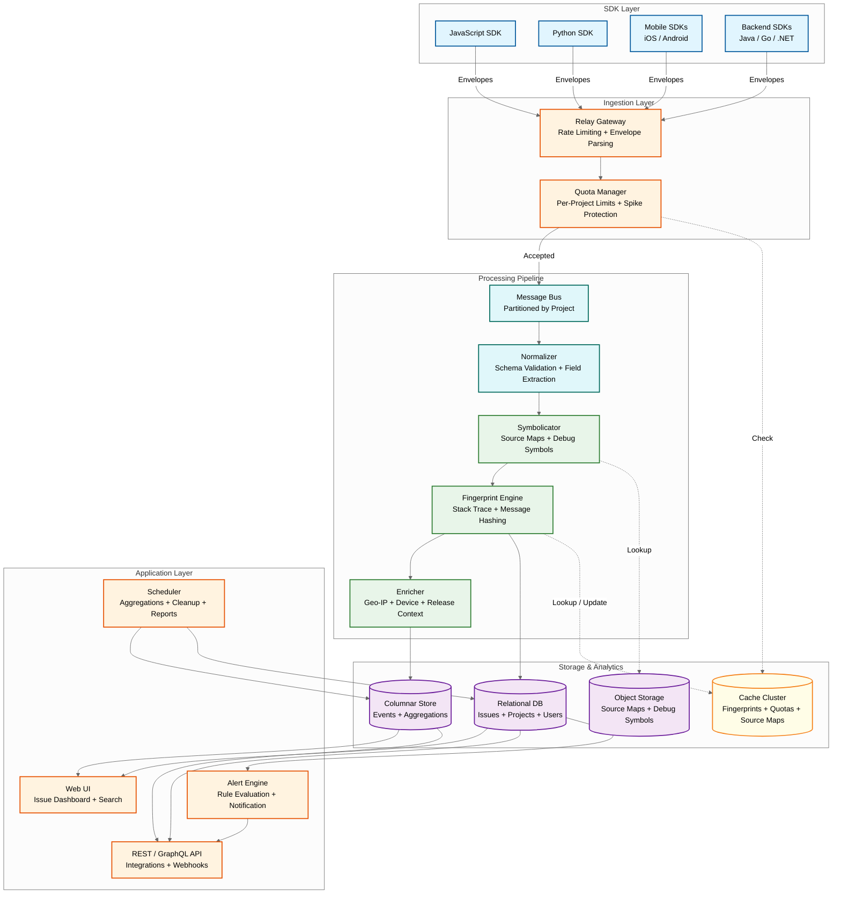
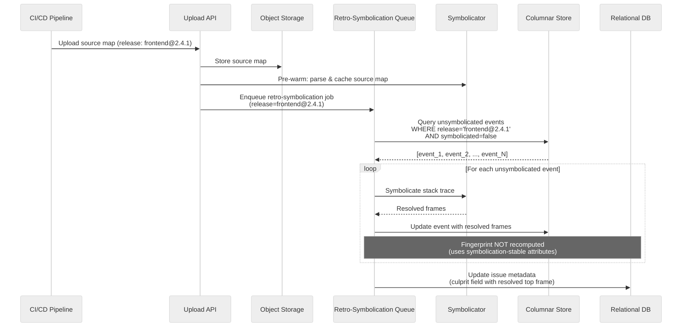
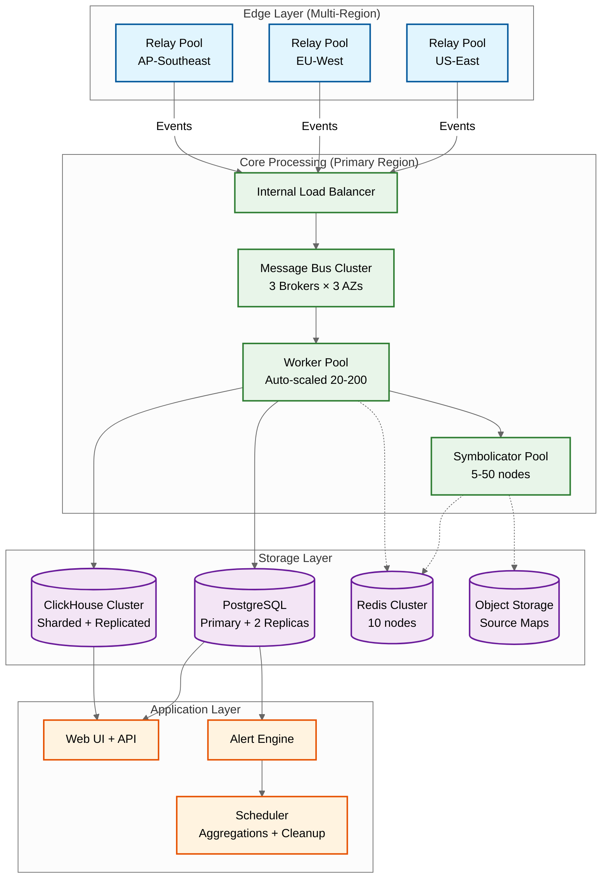

# High-Level Design — Error Tracking Platform

## Architecture Overview

The platform follows a **layered ingestion-processing-analytics architecture** with four major tiers: (1) the **SDK & Ingestion layer** (client SDKs, relay/gateway nodes), (2) the **Processing Pipeline** (message bus, normalization, fingerprinting, symbolication), (3) the **Storage & Analytics layer** (columnar event store, relational metadata store, object storage for source maps), and (4) the **Application layer** (web UI, alerting engine, API, integrations).



---

## Data Flow: Error Event Lifecycle

An error event traverses a multi-stage pipeline from SDK capture to developer notification.

```mermaid
%%{init: {'theme': 'neutral'}}%%
flowchart LR
    subgraph S1["1. Capture"]
        A1[SDK Catches Error<br/>+ Breadcrumbs + Context]
    end

    subgraph S2["2. Transport"]
        A2[Envelope Created<br/>Compressed + Batched<br/>→ Relay Gateway]
    end

    subgraph S3["3. Ingest"]
        A3[Rate Check<br/>Quota Check<br/>Spike Protection]
    end

    subgraph S4["4. Process"]
        A4[Normalize → Symbolicate<br/>→ Fingerprint<br/>→ Enrich]
    end

    subgraph S5["5. Store"]
        A5[Columnar: Event Data<br/>Relational: Issue Upsert<br/>Cache: Counters]
    end

    subgraph S6["6. Act"]
        A6[Alert Evaluation<br/>Notification Delivery<br/>Dashboard Update]
    end

    A1 --> A2 --> A3 --> A4 --> A5 --> A6

    classDef s1 fill:#e1f5fe,stroke:#01579b,stroke-width:2px
    classDef s2 fill:#e0f7fa,stroke:#00695c,stroke-width:2px
    classDef s3 fill:#fffde7,stroke:#f57f17,stroke-width:2px
    classDef s4 fill:#e8f5e9,stroke:#2e7d32,stroke-width:2px
    classDef s5 fill:#f3e5f5,stroke:#6a1b9a,stroke-width:2px
    classDef s6 fill:#fff3e0,stroke:#e65100,stroke-width:2px

    class A1 s1
    class A2 s2
    class A3 s3
    class A4 s4
    class A5 s5
    class A6 s6
```



### Detailed Event Lifecycle

1. **Capture:** The JavaScript SDK's global error handler catches an unhandled promise rejection in a React component. The SDK collects: exception type (`TypeError`), message (`Cannot read property 'id' of undefined`), stack trace (minified), breadcrumbs (last 100 user actions: page navigations, button clicks, XHR requests), user context (anonymized ID, email hash), device info (browser, OS, screen resolution), release tag (`frontend@2.4.1`), and environment (`production`).

2. **Transport:** The SDK packages the error into an envelope — a binary format containing the event payload, attachments (if any), and SDK metadata. The envelope is compressed (gzip) and sent to the relay gateway via HTTPS POST. If the relay is unreachable, the SDK queues the event locally (up to 30 events) and retries with exponential backoff.

3. **Ingest:** The relay gateway validates the DSN (Data Source Name — project auth token), checks the project's rate limit and quota. If spike protection has been triggered for this project, the event is sampled (e.g., keep 1 in 10). Accepted events receive a `200 OK` with an event ID; rejected events receive `429 Too Many Requests` with a `Retry-After` header that the SDK respects.

4. **Process:** The event enters the message bus (partitioned by project ID for ordering). Processing workers execute in sequence:
   - **Normalize:** Validate schema, extract structured fields, strip oversized payloads
   - **Symbolicate:** Look up the source map for `frontend@2.4.1`, resolve minified stack frames to original file/line/column
   - **Fingerprint:** Apply the grouping algorithm — normalize stack frames, strip data-like content from messages, compute SHA-256 hash
   - **Enrich:** Add geo-IP location, device classification, tag the release, compute "is-regression" flag

5. **Store:** The processed event is written to the columnar store (for search and aggregation). The fingerprint is used to upsert the issue in the relational store — if the fingerprint is new, a new issue is created; if it exists, the event count is incremented and last-seen timestamp is updated. Cache counters for the project's event rate are updated.

6. **Act:** The alert engine evaluates rules against the new event: "Is this a new issue?" → notify channel. "Has this issue regressed?" → page the on-call. "Has the error rate for this project exceeded 100/min?" → notify ops. Alerts are delivered via configured channels (email, Slack webhook, PagerDuty).

---

## Key Architectural Decisions

### Decision 1: Relay Gateway as First-Line Defense

**Choice:** Deploy a lightweight, stateless relay layer between SDKs and the processing pipeline.

| Aspect | Detail |
|--------|--------|
| **Rate limiting** | Per-project token bucket with quota-aware limits; returns `429` with `Retry-After` |
| **Spike protection** | Detects abnormal event rates using 7-day weighted historical baseline; auto-throttles when exceeded |
| **Envelope parsing** | Validates and decompresses SDK envelopes; rejects malformed payloads early |
| **DSN validation** | Authenticates project keys without hitting the relational database (cached) |
| **Protocol translation** | Accepts multiple SDK protocol versions; normalizes to internal format |

**Rationale:** The relay absorbs traffic spikes before they reach the processing pipeline. It can be horizontally scaled independently and deployed at edge locations for lower SDK latency. Stateless design means any relay can handle any request.

**Trade-off:** Adds a network hop (~5-10ms). Requires distributing project configuration (DSN validity, rate limits) to relay nodes via periodic sync or push-based invalidation.

### Decision 2: Message Bus for Spike Absorption

**Choice:** Kafka-style message bus between ingestion and processing, partitioned by project ID.

**Rationale:**
- **Spike absorption:** The bus acts as a buffer; ingestion can accept events faster than processing can handle them during spikes
- **Ordering:** Per-project partitioning ensures events from the same project are processed in order (important for first-seen detection)
- **Replay:** If a processing bug is discovered, events can be replayed from the bus
- **Decoupling:** Ingestion and processing scale independently

**Trade-off:** Adds latency (event sits in bus until consumed). Requires managing consumer lag and partition rebalancing. Bus itself must be highly available.

### Decision 3: Columnar Store for Event Analytics

**Choice:** Use a columnar database (e.g., ClickHouse) for event storage and analytics queries, separate from the relational store for issue metadata.

| Store | Data | Access Pattern |
|-------|------|---------------|
| **Columnar** | Raw events, tags, breadcrumbs, stack traces | Time-range scans, faceted filtering, aggregation (COUNT, percentiles) |
| **Relational** | Issues, projects, users, alert rules, assignments | Point lookups, state transitions, referential integrity |

**Rationale:** Error analytics queries are inherently columnar: "count of events by release, grouped by browser, in the last 7 days" scans two columns across millions of rows. A columnar store compresses these columns 10-20x and scans them 100x faster than a row-oriented database. Issue metadata requires transactional guarantees (resolve, assign, merge) that relational databases provide naturally.

**Trade-off:** Two storage systems add operational complexity. Maintaining consistency between the columnar event count and the relational issue count requires careful synchronization.

### Decision 4: Multi-Strategy Fingerprinting

**Choice:** Apply fingerprinting in priority order — client-side custom fingerprint → server-side fingerprint rules → stack trace-based grouping → exception-based grouping → message-based grouping.

**Rationale:** No single fingerprinting strategy works for all error types. Stack traces are the most reliable signal for groupable errors, but many errors (configuration errors, API failures, custom business logic exceptions) lack meaningful stack traces. The fallback chain ensures every event gets grouped while allowing developers to override when the default is wrong.

**Trade-off:** The multi-strategy approach makes grouping behavior harder to predict. Developers may be confused about which strategy was applied. The platform must expose the grouping reason in the UI.

### Decision 5: Asynchronous Symbolication with Fallback

**Choice:** Symbolicate stack traces asynchronously during event processing. If the source map is not yet uploaded, store the event with the raw (minified) stack trace and re-symbolicate when the source map arrives.

**Rationale:** In CI/CD pipelines, source map upload may lag behind deployment by seconds to minutes. Blocking event processing on source map availability would delay alerts. Storing raw frames and retro-symbolication preserves event data while allowing just-in-time resolution.

**Trade-off:** Events displayed before symbolication show minified stack traces, which confuses developers. The UI must clearly indicate "awaiting symbolication" status. Retro-symbolication requires re-processing stored events, adding computational cost.

---

## Architecture Pattern Checklist

- [x] **Sync vs Async:** Ingestion is synchronous (SDK waits for 200/429); processing is fully asynchronous via message bus
- [x] **Event-driven vs Request-response:** Event processing pipeline is event-driven; UI/API is request-response
- [x] **Push vs Pull:** SDKs push events to relay; processing workers pull from message bus; alerts push to notification channels
- [x] **Stateless vs Stateful:** Relay is stateless; fingerprint engine maintains state (issue→fingerprint mapping) in cache + relational DB
- [x] **Write-heavy optimization:** Message bus absorbs write spikes; columnar store optimized for append-heavy workloads with batch inserts
- [x] **Real-time vs Batch:** Event processing is real-time streaming; trend aggregations are pre-computed in batch (hourly/daily rollups)
- [x] **Edge vs Origin:** Relay can be deployed at edge for SDK latency; processing is centralized

---

## Component Interaction: New Issue Detection & Alert

```mermaid
%%{init: {'theme': 'neutral'}}%%
sequenceDiagram
    participant SDK as JavaScript SDK
    participant RLY as Relay Gateway
    participant BUS as Message Bus
    participant WRK as Processing Worker
    participant SYM as Symbolicator
    participant FP as Fingerprint Engine
    participant DB as Relational DB
    participant COL as Columnar Store
    participant ALT as Alert Engine
    participant SLK as Slack Webhook

    SDK->>RLY: POST /envelope (compressed)
    RLY->>RLY: Validate DSN + Check quota
    RLY-->>SDK: 200 OK {event_id}
    RLY->>BUS: Publish envelope (project partition)

    BUS->>WRK: Consume event
    WRK->>WRK: Normalize + validate
    WRK->>SYM: Symbolicate stack trace
    SYM->>SYM: Lookup source map (release: frontend@2.4.1)
    SYM-->>WRK: Resolved stack frames

    WRK->>FP: Compute fingerprint
    FP->>FP: Normalize frames → hash
    FP->>DB: Lookup fingerprint
    DB-->>FP: Not found (new issue!)
    FP->>DB: Create issue + link fingerprint

    WRK->>COL: Write event (with resolved frames)
    WRK->>ALT: Notify: new issue created
    ALT->>ALT: Evaluate alert rules for project
    ALT->>SLK: POST webhook (new issue alert)
```

---

## Retro-Symbolication Flow

When source maps arrive after events have already been processed with minified frames:



---

## Component Interaction Matrix

| | Relay | Message Bus | Workers | Symbolicator | Columnar Store | Relational DB | Cache | Alert Engine |
|---|---|---|---|---|---|---|---|---|
| **Relay** | — | Publish events | — | — | — | — | Rate limits, quotas, DSN validation | — |
| **Message Bus** | Receives events | — | Delivers events | — | — | — | — | — |
| **Workers** | — | Consume events | — | Request symbolication | Write events | Upsert issues | Read/write fingerprint cache | Emit alert triggers |
| **Symbolicator** | — | — | Return resolved frames | — | — | — | Source map LRU cache | — |
| **Columnar Store** | — | — | — | — | — | — | Query result cache | — |
| **Relational DB** | — | — | — | — | — | — | — | Read alert rules |
| **Cache** | Serve config | — | — | — | — | — | — | — |
| **Alert Engine** | — | — | — | — | Query event counts | Read rules, write history | Check dedup/frequency | — |

---

## Cross-Cutting Concerns

### Idempotency Strategy

| Operation | Idempotency Key | Mechanism | Conflict Resolution |
|-----------|----------------|-----------|-------------------|
| Event ingestion | `event_id` (SDK-generated UUID) | Deduplication at relay + columnar store | Reject duplicate silently; return original event_id |
| Issue creation | `(project_id, fingerprint_hash)` | UPSERT with unique constraint | Increment count on conflict |
| Source map upload | `(release, filename)` | Overwrite on conflict | Latest upload wins |
| Alert delivery | `(rule_id, issue_id, window)` | Frequency cap with cache key | Suppress duplicate within window |
| Quota decrement | `event_id` | Atomic increment + event_id dedup set | Skip already-counted events |

### Multi-Tenancy Strategies

| Layer | Isolation Mechanism | Rationale |
|-------|-------------------|-----------|
| Relay gateway | Per-project rate limiting; premium customer pools | Prevent noisy neighbor at ingestion |
| Message bus | Per-project partitions; priority topics for premium tier | Processing isolation; premium SLA guarantees |
| Columnar store | Partition by `(project_id, date)`; query-level tenant enforcement | Data isolation; efficient per-project scans |
| Relational DB | Row-level security; all queries include `org_id` filter | Prevent cross-tenant data leakage |
| Cache | Namespaced keys `{project_id}:{key}` | Prevent cache key collision across tenants |
| Object storage | Prefix-based isolation `/{org_id}/{project_id}/{release}/` | Source map isolation; IAM-level access control |

### Technology Stack Decisions

| Layer | Technology Choice | Why This Choice | Alternative Considered |
|-------|------------------|----------------|----------------------|
| Ingestion gateway | Custom relay (Rust) | Sub-millisecond latency; efficient envelope parsing; memory safety | NGINX + Lua — too limited for envelope protocol |
| Message bus | Kafka-compatible log | Partition ordering; replay capability; durable buffering | RabbitMQ — lacks partition ordering and replay |
| Event processing | Stateless workers (Python/Go) | Simple scaling; language ecosystem for SDK protocol handling | Stream processor (Flink) — overkill for per-event processing |
| Columnar analytics | ClickHouse | Best-in-class for time-series aggregation; MergeTree compression | Druid — more complex operational model for similar performance |
| Relational metadata | PostgreSQL | ACID for issue state; JSONB for flexible metadata; row-level security | MySQL — lacks JSONB, weaker partial index support |
| Source map parsing | Dedicated symbolicator service (Rust) | CPU-intensive VLQ decoding benefits from zero-copy parsing | In-process parsing — memory isolation needed to prevent OOM |
| Cache | Redis Cluster | Atomic operations for quotas; pub/sub for config invalidation | Memcached — lacks atomic increment and pub/sub |

---

## Real-World Architecture Patterns

### Pattern 1: Sentry Architecture (Open-Source Reference)

Sentry's architecture evolved from a Django monolith to a distributed pipeline:

- **Relay (Rust):** Edge-deployed ingestion gateway handling envelope parsing, rate limiting, PII scrubbing, and protocol translation. Processes 100K+ events/sec per node.
- **Kafka:** Central message bus with per-project partitioning. Separate topics for events, transactions, attachments, and sessions.
- **Snuba (ClickHouse):** Custom query layer over ClickHouse providing the event search and aggregation API. Manages schema migrations, query translation, and multi-tenant query isolation.
- **Symbolicator (Rust):** Dedicated service for source map resolution, ProGuard deobfuscation, and native symbol lookup. Maintains a multi-layer cache (in-memory LRU → Redis → object storage).
- **Post-processing pipeline:** Asynchronous workers handle commit association, code mapping, suspect commits, ownership rules, and integration notifications.
- **Key insight:** Sentry migrated issue metadata to ClickHouse for faster aggregation queries, moving away from PostgreSQL for event-heavy analytics — demonstrating the evolution toward unified columnar storage.

### Pattern 2: High-Scale Commercial Approach (Datadog-Inspired)

Commercial error tracking at massive scale (trillions of events/month) uses a different architecture:

- **Unified observability pipeline:** Errors are ingested through the same pipeline as logs and traces, enabling correlation. The intake layer performs unified sampling and routing.
- **Custom columnar storage:** Purpose-built storage engine optimized for high-cardinality tag indexing — going beyond ClickHouse's skip indexes to bitmap indexes for arbitrary tag combinations.
- **ML-powered grouping:** Machine learning models trained on historical merge/split actions to improve fingerprinting accuracy beyond rule-based approaches.
- **Key insight:** At trillion-event scale, the indexing strategy matters more than the storage engine. Bitmap indexes on tags enable sub-second faceted search across billions of events.

### Pattern 3: Lightweight Embedded Approach (Bugsnag-Inspired)

For organizations prioritizing simplicity and mobile-first error tracking:

- **Thin SDK layer:** SDKs focus on minimal overhead (< 0.5% CPU) with intelligent local sampling before transmission.
- **Server-side grouping customization:** Extensive UI for customizing grouping rules without code changes — "grouping overrides" that let product teams tune fingerprinting per-project.
- **Stability monitoring focus:** Primary metric is "stability score" (crash-free sessions) rather than individual error counts — shifting focus from debugging to release quality gates.
- **Key insight:** For mobile applications, crash-free session rate is a more actionable metric than error counts. The architecture prioritizes session tracking and release health dashboards over raw event search.

---

## Deployment Topology



### Multi-Region Strategy

| Region | Role | Components | Data Residency |
|--------|------|-----------|---------------|
| US-East | Primary processing + storage | Full stack (relay, bus, processing, storage, app) | Default for non-EU customers |
| EU-West | EU data residency + edge relay | Full stack for EU customers; relay-only for non-EU events | Mandatory for GDPR-compliant EU customers |
| AP-Southeast | Edge relay + read replica | Relay for low-latency SDK ingestion; read replica of columnar store for dashboard queries | Events forwarded to primary or EU region |

### Edge Relay Benefits

| Benefit | Metric | Details |
|---------|--------|---------|
| SDK latency reduction | -50-150ms | Relay in same region as application servers; SDK round-trip reduced |
| PII scrubbing at edge | Before transit | Sensitive fields stripped before events leave the region |
| Early rejection | 15-25% of events | Invalid DSN, malformed payloads, exceeded quotas rejected without crossing regions |
| Spike absorption | 100x buffer | Edge relay queues smooth spikes before they reach core processing |

---

## SDK Protocol Evolution (2024-2026)

The SDK-to-relay protocol has evolved significantly to support broader observability use cases:

| Version | Year | Key Changes | Impact |
|---------|------|------------|--------|
| v5 | 2020 | Envelope format introduced; replaced JSON-only payloads | Enabled mixed payloads (events + attachments) in single request |
| v7 | 2022 | Session tracking added; `X-Sentry-Rate-Limits` per-category | Enabled crash-free session metrics; granular rate limiting |
| v8 | 2024 | Structured spans embedded in envelopes; profile attachments | Unified error + performance + profiling in single transport |
| v9 | 2025 | Streaming envelope mode; incremental breadcrumb uploads | Reduced SDK memory pressure; better long-session support |
| v10 | 2026 | AI context fields (LLM call metadata, token usage, model version) | Error tracking for AI applications; LLM hallucination detection |

### Backward Compatibility Strategy

- Relay supports all protocol versions simultaneously (v5 through v10)
- Version detected from `sentry_version` header in `X-Sentry-Auth`
- Internal processing normalizes all versions to the latest internal format
- Deprecated fields are silently dropped; missing new fields are defaulted

---

## Processing Pipeline Internal Architecture

The processing pipeline is the most complex component, executing 5 sequential stages per event. Understanding the internal stage boundaries is critical for debugging latency issues and planning scale:

```mermaid
%%{init: {'theme': 'neutral'}}%%
flowchart LR
    subgraph Stage1["Stage 1: Normalize"]
        N1[Schema Validation]
        N2[Field Extraction]
        N3[Payload Trimming]
        N4[PII Scrubbing]
    end

    subgraph Stage2["Stage 2: Symbolicate"]
        S1[Source Map Lookup]
        S2[Cache Check]
        S3[VLQ Parsing<br/>if cache miss]
        S4[Frame Resolution]
    end

    subgraph Stage3["Stage 3: Fingerprint"]
        F1[Platform Detection]
        F2[Frame Normalization]
        F3[Strategy Selection]
        F4[Hash Computation]
        F5[Issue Upsert]
    end

    subgraph Stage4["Stage 4: Enrich"]
        E1[Geo-IP Resolution]
        E2[Device Classification]
        E3[Release Tagging]
        E4[Regression Check]
    end

    subgraph Stage5["Stage 5: Store & Notify"]
        W1[Columnar Write<br/>micro-batch]
        W2[Counter Update<br/>coalesced]
        W3[Alert Flag Emit]
    end

    N1 --> N2 --> N3 --> N4
    N4 --> S1 --> S2 --> S3 --> S4
    S4 --> F1 --> F2 --> F3 --> F4 --> F5
    F5 --> E1 --> E2 --> E3 --> E4
    E4 --> W1 & W2 & W3

    classDef norm fill:#e0f7fa,stroke:#00695c,stroke-width:1px
    classDef symb fill:#e8f5e9,stroke:#2e7d32,stroke-width:1px
    classDef fp fill:#fff3e0,stroke:#e65100,stroke-width:1px
    classDef enrich fill:#f3e5f5,stroke:#6a1b9a,stroke-width:1px
    classDef store fill:#fffde7,stroke:#f57f17,stroke-width:1px

    class N1,N2,N3,N4 norm
    class S1,S2,S3,S4 symb
    class F1,F2,F3,F4,F5 fp
    class E1,E2,E3,E4 enrich
    class W1,W2,W3 store
```



### Stage Latency Budget

| Stage | p50 | p99 | Slowest part of the process | Scale Strategy |
|-------|-----|-----|-----------|---------------|
| Normalize | 0.5ms | 2ms | Regex-based PII scrubbing | CPU-bound; more workers |
| Symbolicate (cache hit) | 2ms | 10ms | Redis lookup + binary search | Cache sizing |
| Symbolicate (cache miss) | 500ms | 3s | VLQ parsing (CPU-intensive) | Bounded concurrency; pre-warm |
| Fingerprint | 1ms | 5ms | DB round-trip for issue upsert | Write coalescing; cache |
| Enrich | 0.5ms | 2ms | Geo-IP DB lookup | In-memory MaxMind DB |
| Store + Notify | 1ms (amortized) | 10ms | Batch write flush | Micro-batch sizing |
| **Total** | **~5ms** | **~3s** | **Symbolication dominates** | **Pre-warm source maps** |
