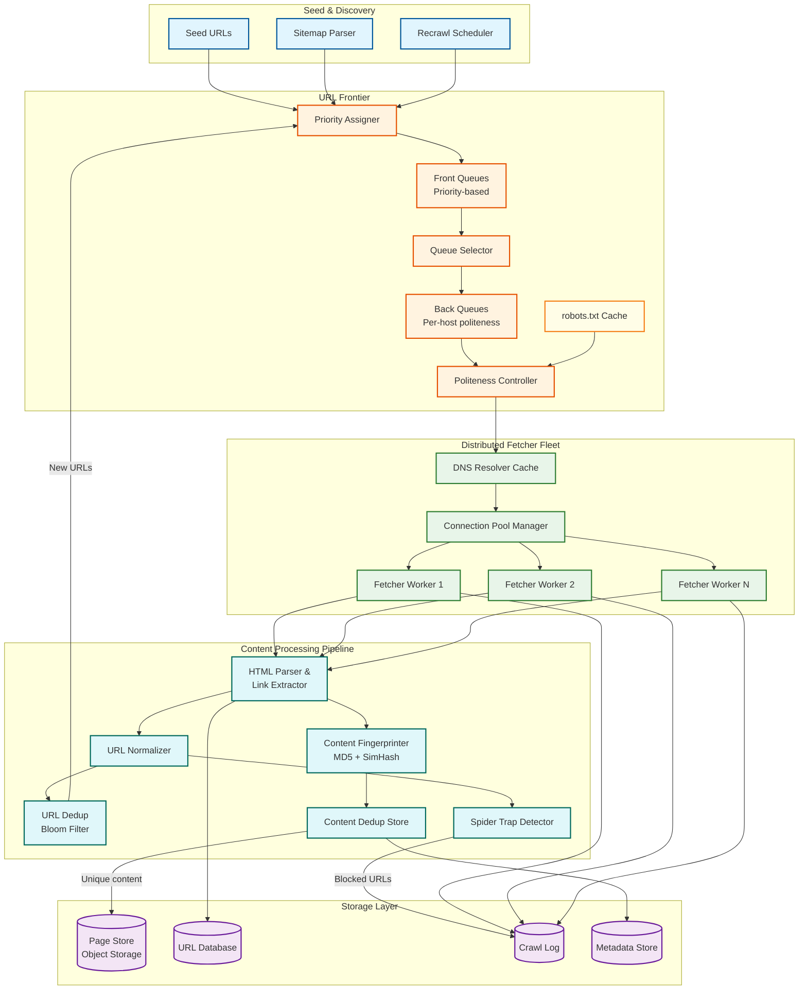
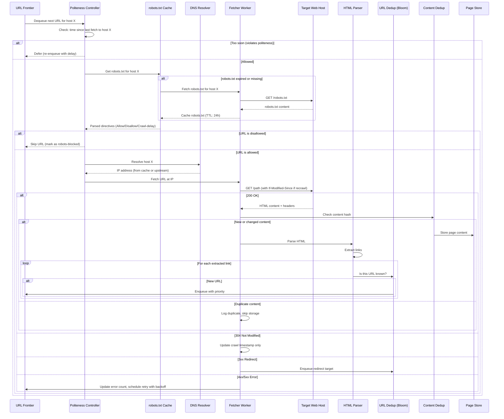
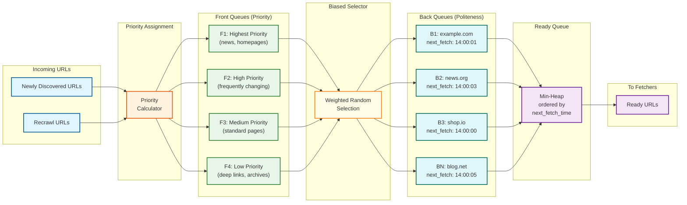

# High-Level Design — Web Crawlers

## System Architecture

The crawler follows a **pipeline architecture** with four major stages: **Frontier** (URL scheduling and politeness), **Fetching** (distributed page download), **Processing** (parsing, link extraction, deduplication), and **Storage** (content persistence and metadata management). A feedback loop connects the processing stage back to the frontier as newly discovered URLs are enqueued.



---

## Crawl Pipeline: Page Fetch Flow



---

## URL Frontier Architecture: Front Queues and Back Queues

The Mercator-style frontier architecture separates **what to crawl** (priority) from **when to crawl it** (politeness):



**Front Queues** implement priority: URLs are assigned to one of K priority levels based on importance signals (PageRank, change frequency, domain authority, content type). A biased selector draws from higher-priority queues more frequently.

**Back Queues** implement politeness: each back queue corresponds to a single host (or IP for shared hosting). A URL drawn from a front queue is routed to its host's back queue. The back queue tracks the next allowable fetch time. A min-heap orders back queues by their next fetch time, and the fetcher dequeues only from back queues whose next fetch time has passed.

---

## Key Architectural Decisions

### 1. Centralized Frontier vs. Distributed Frontier

| Aspect | Centralized Frontier | Distributed Frontier (Chosen) |
|--------|---------------------|-------------------------------|
| **Coordination** | Single service manages all URL scheduling | Frontier partitioned by host hash; each partition independently manages its hosts |
| **Politeness** | Perfect per-host enforcement (single authority) | Per-host enforcement is natural — each partition owns its hosts exclusively |
| **Throughput** | Slowest part of the process at ~100K URLs/sec even with optimization | Linear scaling — add partitions for more throughput |
| **Failure impact** | Single point of failure for entire crawl | Partition failure only halts crawling for hosts in that partition |
| **Recommendation** | Distributed frontier with consistent-hash-based partitioning; each partition is a self-contained Mercator mini-frontier for its assigned hosts |

### 2. Pull Model (Fetcher Pulls from Frontier) vs. Push Model

| Aspect | Pull Model (Chosen) | Push Model |
|--------|---------------------|------------|
| **Backpressure** | Natural — fetchers request URLs only when they have capacity | Frontier must track fetcher capacity; risk of overwhelming slow fetchers |
| **Politeness** | Frontier can enforce per-host timing when serving URLs | Frontier pushes URL, but fetcher may not be ready at the right time |
| **Fetcher utilization** | Optimal — fetchers are always working if URLs are available | May over-provision fetchers if push rate is miscalibrated |
| **Recommendation** | Pull model — fetcher calls `get_next_url(partition_id)` and the frontier returns the highest-priority URL whose host is ready for fetching |

### 3. Synchronous vs. Asynchronous Fetching

| Aspect | Synchronous (thread-per-fetch) | Asynchronous (event-driven) (Chosen) |
|--------|-------------------------------|--------------------------------------|
| **Concurrency per worker** | Limited by thread count (~100-200 threads) | Thousands of concurrent connections per worker via event loop |
| **Memory footprint** | ~1 MB stack per thread; 200 threads = 200 MB | Minimal per-connection overhead; 2,000 connections < 50 MB |
| **CPU efficiency** | Thread context switching overhead at high concurrency | Single-threaded event loop; minimal context switching |
| **Recommendation** | Asynchronous I/O with event-driven architecture; each fetcher worker maintains ~200-500 concurrent connections |

### 4. Deduplication Strategy: URL-Level vs. Content-Level

| Aspect | URL-Level Only | URL + Content (Chosen) |
|--------|---------------|------------------------|
| **Accuracy** | Misses content served at different URLs (mirrors, parameter variations) | Catches both URL duplicates and content duplicates across different URLs |
| **Cost** | Cheap (Bloom filter lookup) | Adds content hashing overhead per page |
| **Coverage** | ~70% of duplicates caught (many duplicate URLs are syntactically different) | ~95%+ of duplicates caught |
| **Recommendation** | Two-tier deduplication: fast Bloom filter for URL-level, then content hash + SimHash for fetched pages |

### 5. Page Storage: Inline vs. External

| Aspect | Inline (DB stores content) | External Object Storage (Chosen) |
|--------|---------------------------|----------------------------------|
| **Query flexibility** | Can query content and metadata together | Metadata in DB, content in object storage; requires two lookups |
| **Storage cost** | Expensive — relational/wide-column stores are costly per byte | Object storage is 10-50x cheaper per byte |
| **Scalability** | DB size grows to petabytes — operational nightmare | Object storage scales to exabytes with no operational burden |
| **Recommendation** | Store content in object storage with a content-addressed key (hash of content); store content key + metadata in the URL database |

---

## Architecture Pattern Checklist

- [x] **Sync vs Async communication decided** — Async (event-driven) for page fetching; sync for frontier queries and DNS resolution
- [x] **Event-driven vs Request-response decided** — Pipeline model: each stage processes and forwards; newly discovered URLs are events fed back into the frontier
- [x] **Push vs Pull model decided** — Pull: fetchers request URLs from the frontier when ready
- [x] **Stateless vs Stateful services identified** — Fetchers are stateless (no persistent state); frontier partitions are stateful (URL queues, politeness timers); DNS cache is stateful
- [x] **Read-heavy vs Write-heavy optimization applied** — Frontier is write-heavy (continuous URL insertion from link extraction); content store is write-heavy (continuous page storage); dedup is read-heavy (constant membership queries)
- [x] **Real-time vs Batch processing decided** — Real-time for crawl pipeline; batch for analytics (crawl coverage reports, freshness metrics)
- [x] **Edge vs Origin processing considered** — Fetcher workers deployed geographically close to target hosts to minimize network latency

---

## Component Interaction Summary

| Component | Inputs | Outputs | State |
|-----------|--------|---------|-------|
| Priority Assigner | New/recrawl URLs with signals (PageRank, change freq) | URLs assigned to front queue priority level | Stateless (reads signals from metadata store) |
| Front Queues | Prioritized URLs | URLs selected by biased random sampling | Per-priority-level queues (disk-backed) |
| Back Queues | URLs from front queue selector | URLs ready for fetching (politeness-approved) | Per-host queue + next-fetch timestamp |
| Politeness Controller | URL + host + robots.txt directives | Fetch permission (approved/deferred) | Per-host last-fetch time, robots.txt cache |
| DNS Resolver Cache | Hostnames | IP addresses | LRU cache with TTL awareness |
| Fetcher Worker | URL + IP address | Fetched page content + HTTP metadata | Stateless (connection pool is ephemeral) |
| HTML Parser / Link Extractor | Raw HTML | Extracted links + normalized URLs | Stateless |
| URL Dedup (Bloom Filter) | Normalized URL | New/Known decision | Bloom filter (in-memory, periodically checkpointed) |
| Content Fingerprinter | Page content | MD5 hash + SimHash fingerprint | Stateless |
| Content Dedup Store | Content fingerprints | Duplicate/Unique decision | Hash-to-URL mapping (distributed key-value store) |
| Spider Trap Detector | URL patterns per host | Block/Allow decision | Per-host URL counters, path depth stats |
| Page Store | Page content + content key | Storage confirmation | Object storage (content-addressed) |
| URL Database | URL metadata, crawl results | URL history, change frequency | Wide-column or relational store |
| Recrawl Scheduler | URL metadata (last crawl, change freq, importance) | Recrawl URLs enqueued to frontier | Reads from URL database on schedule |

---

## Component Responsibility Matrix

| Component | Scaling Axis | Failure Mode | Recovery Strategy | Owner Team |
|-----------|-------------|-------------|-------------------|------------|
| Priority Assigner | CPU (priority computation) | Drops to default priority | Stateless restart; no data loss | Frontier |
| Front Queues (F1-F4) | Disk (queue depth) | Priority starvation | Rebuild from URL database; ~30 min | Frontier |
| Back Queues (per-host) | Memory + disk (host count) | Politeness violation risk | Freeze affected hosts; standby takeover | Frontier |
| Politeness Controller | Memory (per-host timers) | Over-aggressive crawling | Circuit breaker triggers; host backoff | Frontier |
| robots.txt Cache | Memory (cached entries) | Stale directives | Conservative: block until refresh | Compliance |
| DNS Resolver Cache | Memory (cache size) | Fetch pipeline blocked | Fallback to upstream; accept latency | Infrastructure |
| Fetcher Workers | Horizontal (worker count) | Throughput reduction | Auto-scaler replaces; leased URLs re-enqueue | Fetching |
| Connection Pool | File descriptors (per worker) | Connection exhaustion | Evict idle connections; restart worker | Fetching |
| HTML Parser | CPU (parsing throughput) | Processing backlog | Scale horizontally; stateless | Processing |
| URL Normalizer | CPU | Non-normalized URLs enter frontier | Duplicates caught by Bloom filter | Processing |
| URL Dedup (Bloom) | Memory (filter size) | False positive increase | Scheduled rebuild from URL DB | Dedup |
| Content Fingerprinter | CPU | Skip dedup → duplicate storage | Accept duplicates; reconcile in batch | Dedup |
| SimHash Index | Memory + disk | Near-dedup disabled | Fall back to exact hash only | Dedup |
| Spider Trap Detector | Memory (per-host stats) | Trap URLs waste crawl budget | Host blocklist; URL budget enforcement | Quality |
| Page Store | Storage (petabytes) | Content cannot be stored | Local buffer on fetchers; retry | Storage |
| URL Database | Storage + IOPS | Metadata lost | Restore from backup; accept stale data | Storage |
| Crawl Log | Append throughput | Audit trail gap | Write-ahead log on fetchers; replay | Observability |
| Recrawl Scheduler | CPU (scheduling computation) | Freshness degrades | Restart; query URL DB for due recrawls | Scheduling |

---

## Architecture Decision Records (ADRs)

### ADR-1: Why Not a Single Message Queue for the Frontier?

**Context:** Many distributed systems use a message queue (Kafka, RabbitMQ) as their work distribution mechanism. A natural first instinct is to use a message queue as the URL frontier.

**Decision:** Custom Mercator-style frontier with front queues and back queues.

**Rationale:**
- Message queues do not natively support per-consumer (per-host) rate limiting — the core politeness requirement
- Priority in most message queues is coarse-grained (a few priority levels); the frontier needs continuous priority scoring with biased sampling
- Message queues do not support the "refill" pattern: when a back queue empties, the frontier must pull from front queues to refill it — a cross-queue operation no standard message queue supports
- At 10B URLs, message queue storage becomes impractical without the hot/cold partitioning the custom frontier provides
- The lease-based checkout pattern (URLs are "leased" to fetchers and re-enqueued on timeout) is more naturally expressed as a custom protocol than as message queue acknowledgment semantics

**Consequences:** Higher development cost; operational burden of maintaining a custom stateful service; but no viable alternative exists at web scale.

### ADR-2: Content-Addressed Storage Over Metadata-Keyed Storage

**Context:** Fetched pages could be stored keyed by URL (natural key) or by content hash (content-addressed).

**Decision:** Content-addressed storage (key = hash of page content).

**Rationale:**
- Multiple URLs often serve identical content (mirrors, CDN variants, www/non-www); content-addressed storage naturally deduplicates at the storage layer
- Idempotent writes: two fetchers simultaneously storing the same content write to the same key — no race condition, no duplicate storage
- Content-addressed keys are uniformly distributed, preventing hot spots in the storage layer
- URL-to-content mapping is maintained separately in the URL database (a lightweight metadata operation)

**Consequences:** Two-hop lookup required to retrieve a page by URL (URL DB → content hash → content store); cannot query pages by URL directly from the content store.

### ADR-3: Asynchronous Content Store Writes Over Synchronous

**Context:** After fetching a page, should the fetcher wait for the content store write to complete before proceeding to the next fetch?

**Decision:** Asynchronous content store writes with local buffering.

**Rationale:**
- Content store write latency (10-50ms p50, up to several seconds at p99) would block the fetcher from starting its next fetch
- Local disk buffer on each fetcher absorbs write bursts and survives transient content store outages
- The fetcher's primary job is fetching — write throughput should not constrain fetch throughput
- If the content store is unavailable, the fetcher can continue fetching and buffering locally for up to 1 hour of content before needing to slow down

**Consequences:** Content may be lost if a fetcher crashes with un-flushed local buffer (RPO: up to 1 hour of pages); acceptable because the same pages can be re-fetched.

---

## System Boundary Diagram

| External System | Interface | Direction | Data Exchanged |
|----------------|-----------|-----------|----------------|
| Target web hosts | HTTP/HTTPS | Outbound | Page content, robots.txt, DNS |
| Upstream DNS servers | DNS protocol | Outbound | Domain name → IP resolution |
| Search indexer (downstream) | Internal API / Message queue | Outbound | Fetched page content + metadata |
| Admin operators | REST API + Dashboard | Inbound | Crawl controls, seed URLs, blocklists |
| Monitoring platform | Metrics / Logs / Traces | Outbound | Crawl metrics, alerts, traces |
| Content delivery networks | HTTP/HTTPS | Outbound | Pages served through CDNs (transparent to crawler) |
| Certificate authorities | OCSP / CRL | Outbound | TLS certificate validation |
| IP geolocation services | API | Outbound | IP → timezone mapping for adaptive politeness |

---

## Data Flow: Recrawl Scheduling Pipeline

```mermaid
sequenceDiagram
    participant Scheduler as Recrawl Scheduler
    participant URLDB as URL Database
    participant Frontier as URL Frontier
    participant Fetcher as Fetcher Worker
    participant Host as Target Host
    participant Dedup as Content Dedup

    Scheduler->>URLDB: Query URLs where next_crawl_at <= NOW()
    URLDB-->>Scheduler: Batch of URLs due for recrawl

    loop For each URL in batch
        Scheduler->>Frontier: Enqueue(url, priority, reason="recrawl")
    end

    Note over Frontier: URL enters front queue based on priority
    Note over Frontier: URL routes to host's back queue
    Note over Frontier: Back queue waits for politeness timer

    Frontier->>Fetcher: Dequeue URL (when host ready)
    Fetcher->>Host: GET /page (If-Modified-Since: last_crawl_time)

    alt 304 Not Modified
        Host-->>Fetcher: Not Modified
        Fetcher->>URLDB: Update: content_unchanged, extend interval
        Note over URLDB: next_crawl_at = NOW() + interval * 1.5
    else 200 OK (content changed)
        Host-->>Fetcher: New content
        Fetcher->>Dedup: Check content hash
        Dedup-->>Fetcher: New content confirmed
        Fetcher->>URLDB: Update: content_changed, shorten interval
        Note over URLDB: next_crawl_at = NOW() + interval * 0.7
    else 404/410 Gone
        Host-->>Fetcher: Page removed
        Fetcher->>URLDB: Mark URL as dead; remove from frontier
    end

    classDef scheduler fill:#fff3e0,stroke:#e65100,stroke-width:2px
    classDef db fill:#f3e5f5,stroke:#6a1b9a,stroke-width:2px
    classDef frontier fill:#e8f5e9,stroke:#2e7d32,stroke-width:2px
    classDef fetcher fill:#e1f5fe,stroke:#01579b,stroke-width:2px
```

---

## Technology Decision Matrix

| Decision Point | Options Considered | Chosen | Rationale |
|---------------|-------------------|--------|-----------|
| Frontier implementation | Custom vs. Kafka vs. Redis | Custom Mercator | No existing system supports two-dimensional scheduling (priority + politeness) |
| URL database | Relational (PostgreSQL) vs. wide-column vs. key-value | Wide-column store | Write-heavy workload; host-based sharding natural fit; efficient range scans for recrawl scheduling |
| Content store | Block storage vs. object storage vs. database | Object storage | Petabyte-scale at lowest cost; content-addressed keys; built-in replication |
| DNS cache | System resolver vs. dedicated cache | Dedicated multi-tier cache | System resolver insufficient for 11.5K QPS; need per-worker and regional tiers |
| Bloom filter | In-memory vs. on-disk vs. distributed | In-memory (per-partition, checkpointed) | Sub-millisecond lookups required; partitioned to avoid cross-partition coordination |
| Content fingerprinting | MD5 vs. SHA-256 vs. xxHash | MD5 for content addressing; SimHash for near-dedup | MD5 is fast and collisions are acceptable (content-addressed overwrites are harmless); SimHash enables near-duplicate detection |
| Fetcher I/O model | Thread-per-connection vs. async event-driven | Async event-driven | 200-500 concurrent connections per worker; thread-per-connection uses excessive memory |
| Inter-service communication | REST vs. gRPC vs. message queue | gRPC (frontier ↔ fetchers); REST (admin API) | gRPC for high-throughput internal RPC with streaming support; REST for human-facing admin interface |
