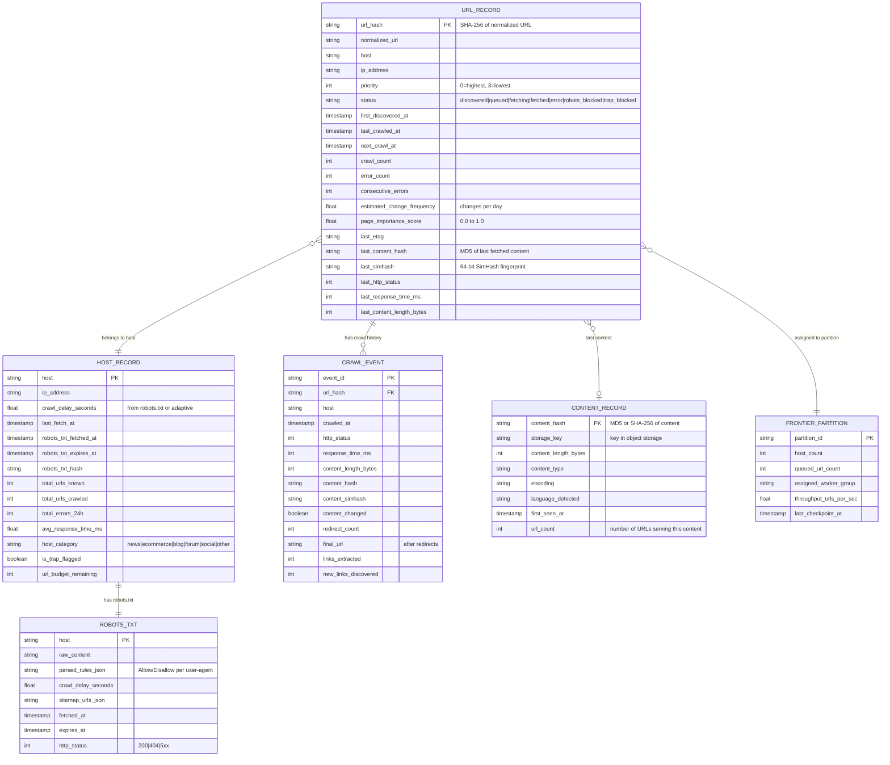

# Low-Level Design — Web Crawlers

## Data Model

### Core Entities



### Indexing Strategy

| Entity | Index | Purpose |
|--------|-------|---------|
| URL_RECORD | `(host, status, next_crawl_at)` | Frontier dequeue: find next URL for a host that is ready for crawl |
| URL_RECORD | `(url_hash)` | Primary key lookup for deduplication and metadata updates |
| URL_RECORD | `(priority, next_crawl_at)` | Recrawl scheduler: find highest-priority URLs due for recrawl |
| HOST_RECORD | `(ip_address)` | IP-based politeness: find all hosts sharing an IP |
| HOST_RECORD | `(robots_txt_expires_at)` | robots.txt refresh: find hosts with expiring robots.txt |
| CRAWL_EVENT | `(url_hash, crawled_at DESC)` | Recent crawl history for change frequency estimation |
| CONTENT_RECORD | `(content_hash)` | Content deduplication lookup |

### Partitioning / Sharding Strategy

| Entity | Shard Key | Rationale |
|--------|-----------|-----------|
| URL_RECORD | `host` (consistent hash) | All URLs for a host are co-located — essential for per-host politeness enforcement and frontier partitioning |
| HOST_RECORD | `host` (same partition as URL_RECORD) | Host metadata co-located with its URLs |
| CRAWL_EVENT | `url_hash` + time-based partitioning | Recent events are hot; old events are archived |
| CONTENT_RECORD | `content_hash` | Uniform distribution; lookups are always by hash |

### Data Retention Policy

| Data | Hot Retention | Cold Retention | Archive |
|------|--------------|----------------|---------|
| URL metadata | Indefinite (active frontier) | N/A | N/A |
| Crawl events | 90 days | 1 year (sampled) | 5 years (aggregated) |
| Page content (latest) | Indefinite | N/A | N/A |
| Page content (historical) | 30 days | 1 year | Deleted |
| robots.txt | Current + 7 days history | 90 days | Deleted |

---

## API Design

### Frontier Service (Internal gRPC)

```
// Fetcher workers call this to get URLs to crawl
rpc GetNextURLs(GetNextURLsRequest) returns (GetNextURLsResponse)
    Request:  { partition_id, batch_size (default: 50), worker_id }
    Response: { urls: [{ url, url_hash, host, ip_address, etag, priority }] }

// Processing pipeline reports crawl results
rpc ReportCrawlResult(CrawlResultRequest) returns (CrawlResultResponse)
    Request:  { url_hash, http_status, content_hash, simhash, content_changed,
                response_time_ms, content_length, links_extracted,
                redirect_chain: [url], error_message }
    Response: { acknowledged: bool }

// Link extractor enqueues newly discovered URLs
rpc EnqueueURLs(EnqueueURLsRequest) returns (EnqueueURLsResponse)
    Request:  { urls: [{ normalized_url, source_url, source_priority }] }
    Response: { accepted: int, rejected_duplicate: int, rejected_trap: int }

// Recrawl scheduler submits URLs due for recrawl
rpc ScheduleRecrawl(RecrawlRequest) returns (RecrawlResponse)
    Request:  { urls: [{ url_hash, priority, reason }] }
    Response: { scheduled: int }
```

### robots.txt Service (Internal)

```
rpc GetRobotsDirectives(RobotsRequest) returns (RobotsResponse)
    Request:  { host, user_agent }
    Response: { allowed: bool, crawl_delay_seconds: float,
                sitemap_urls: [string], cache_ttl_seconds: int }

rpc RefreshRobotsTxt(RefreshRequest) returns (RefreshResponse)
    Request:  { host }
    Response: { fetched: bool, http_status: int, directives_changed: bool }
```

### Admin / Monitoring API (REST)

```
GET    /api/v1/crawl/stats                    Overall crawl statistics
GET    /api/v1/crawl/stats/hosts/{host}       Per-host crawl statistics
GET    /api/v1/frontier/status                Frontier partition status
POST   /api/v1/frontier/seed                  Inject seed URLs
GET    /api/v1/frontier/partitions            List frontier partitions
POST   /api/v1/crawl/pause                    Pause all crawling
POST   /api/v1/crawl/resume                   Resume crawling
POST   /api/v1/hosts/{host}/block             Block a host from crawling
DELETE /api/v1/hosts/{host}/block             Unblock a host
GET    /api/v1/traps                          List detected spider traps
GET    /api/v1/dedup/stats                    Deduplication statistics
```

### Idempotency Handling

- **EnqueueURLs:** Idempotent by URL hash — re-enqueuing an already-known URL updates its priority but does not create a duplicate frontier entry
- **ReportCrawlResult:** Idempotent by `(url_hash, crawled_at)` — duplicate reports for the same crawl event are ignored
- **GetNextURLs:** Not idempotent by design — each call returns different URLs. However, URLs returned but not acknowledged within a timeout are re-enqueued (lease-based checkout)

### Rate Limiting

| Endpoint | Rate Limit | Rationale |
|----------|-----------|-----------|
| GetNextURLs | 1,000 RPS per partition | Bounded by fetcher fleet size |
| EnqueueURLs | 50,000 RPS aggregate | High volume from link extraction; must not overwhelm frontier |
| ReportCrawlResult | 25,000 RPS aggregate | One report per fetched page |
| Admin API | 100 RPS | Human-operated; prevent accidental overload |

---

## Core Algorithms

### Algorithm 1: URL Priority Calculation

```
FUNCTION calculate_priority(url, source_url, metadata):
    // Base priority from page importance (PageRank-like signal)
    base_score = metadata.page_importance_score  // 0.0 to 1.0

    // Boost for pages that change frequently (freshness value)
    IF metadata.estimated_change_frequency > 10:  // changes >10x/day
        freshness_boost = 0.3
    ELSE IF metadata.estimated_change_frequency > 1:
        freshness_boost = 0.2
    ELSE IF metadata.estimated_change_frequency > 0.1:
        freshness_boost = 0.1
    ELSE:
        freshness_boost = 0.0

    // Boost for shallow pages (closer to root = more important)
    path_depth = count_slashes(url.path)
    depth_boost = MAX(0, 0.2 - (path_depth * 0.03))

    // Penalty for pages with high error rates
    IF metadata.consecutive_errors > 3:
        error_penalty = 0.3
    ELSE IF metadata.consecutive_errors > 0:
        error_penalty = metadata.consecutive_errors * 0.05
    ELSE:
        error_penalty = 0.0

    // Bonus for pages from high-authority hosts
    host_authority = lookup_host_authority(url.host)  // 0.0 to 1.0
    authority_boost = host_authority * 0.15

    final_score = base_score + freshness_boost + depth_boost + authority_boost - error_penalty
    final_score = CLAMP(final_score, 0.0, 1.0)

    // Map score to priority bucket
    IF final_score >= 0.75: RETURN PRIORITY_HIGHEST  // Front queue F1
    IF final_score >= 0.50: RETURN PRIORITY_HIGH      // Front queue F2
    IF final_score >= 0.25: RETURN PRIORITY_MEDIUM    // Front queue F3
    RETURN PRIORITY_LOW                                // Front queue F4
```

**Time Complexity (Speed of the algorithm):** O(1) per URL
**Space Complexity (Memory usage of the algorithm):** O(1)

### Algorithm 2: Politeness-Aware URL Dequeue

```
FUNCTION get_next_url(partition):
    // The back queue heap is ordered by next_fetch_time
    WHILE TRUE:
        IF partition.back_queue_heap IS EMPTY:
            RETURN NULL  // No URLs ready

        // Peek at the back queue with the earliest next_fetch_time
        earliest_queue = partition.back_queue_heap.peek()

        IF earliest_queue.next_fetch_time > NOW():
            RETURN NULL  // No host is ready yet; caller should wait

        // Pop the ready back queue from the heap
        ready_queue = partition.back_queue_heap.pop()
        host = ready_queue.host

        // Get the next URL from this host's queue
        url = ready_queue.dequeue()

        IF url IS NULL:
            // This host's queue is empty; refill from front queues
            refill_back_queue(ready_queue, partition.front_queues)
            IF ready_queue IS EMPTY:
                CONTINUE  // Skip this host, try next
            url = ready_queue.dequeue()

        // Check robots.txt (must be fresh)
        robots = get_robots_directives(host)
        IF robots.is_expired():
            // Must refresh robots.txt before proceeding
            trigger_robots_refresh(host)
            ready_queue.enqueue_front(url)  // Put URL back
            ready_queue.next_fetch_time = NOW() + ROBOTS_REFRESH_DELAY
            partition.back_queue_heap.push(ready_queue)
            CONTINUE

        IF NOT robots.is_allowed(url.path):
            // URL is disallowed; mark and skip
            mark_url_robots_blocked(url)
            ready_queue.next_fetch_time = NOW()  // Try next URL immediately
            partition.back_queue_heap.push(ready_queue)
            CONTINUE

        // Calculate next fetch time for this host
        crawl_delay = MAX(robots.crawl_delay, adaptive_delay(host))
        ready_queue.next_fetch_time = NOW() + crawl_delay

        // Put the back queue back in the heap with updated next_fetch_time
        partition.back_queue_heap.push(ready_queue)

        RETURN url
```

**Time Complexity (Speed of the algorithm):** O(log H) per dequeue where H = number of hosts in partition (heap operations)
**Space Complexity (Memory usage of the algorithm):** O(H) for the heap

### Algorithm 3: URL Normalization

```
FUNCTION normalize_url(raw_url):
    // Step 1: Parse URL into components
    parsed = parse_url(raw_url)

    // Step 2: Lowercase scheme and host
    parsed.scheme = lowercase(parsed.scheme)
    parsed.host = lowercase(parsed.host)

    // Step 3: Remove default ports
    IF parsed.scheme = "http" AND parsed.port = 80:
        parsed.port = NULL
    IF parsed.scheme = "https" AND parsed.port = 443:
        parsed.port = NULL

    // Step 4: Remove fragment (anchors are client-side only)
    parsed.fragment = NULL

    // Step 5: Resolve path (remove dot segments)
    parsed.path = resolve_dot_segments(parsed.path)
    // "/a/b/../c" -> "/a/c"
    // "/a/./b" -> "/a/b"

    // Step 6: Decode unreserved percent-encoded characters
    parsed.path = decode_unreserved(parsed.path)
    // "%41" -> "A", "%7E" -> "~"

    // Step 7: Remove trailing slash for non-root paths
    IF parsed.path != "/" AND ends_with(parsed.path, "/"):
        parsed.path = remove_trailing_slash(parsed.path)

    // Step 8: Sort query parameters alphabetically
    IF parsed.query IS NOT NULL:
        params = parse_query_string(parsed.query)
        // Remove known tracking parameters
        REMOVE params WHERE key IN ["utm_source", "utm_medium", "utm_campaign",
                                     "utm_content", "utm_term", "fbclid",
                                     "gclid", "ref", "sessionid", "sid"]
        params = sort_by_key(params)
        parsed.query = rebuild_query_string(params)
        IF parsed.query IS EMPTY:
            parsed.query = NULL

    // Step 9: Reconstruct normalized URL
    RETURN reconstruct_url(parsed)
```

**Time Complexity (Speed of the algorithm):** O(n) where n = URL length
**Space Complexity (Memory usage of the algorithm):** O(n)

### Algorithm 4: SimHash Content Fingerprinting

```
FUNCTION compute_simhash(document, hash_bits = 64):
    // Step 1: Tokenize document into features (shingles)
    tokens = extract_shingles(document, shingle_size = 3)
    // "the quick brown fox" -> ["the quick brown", "quick brown fox"]

    // Step 2: Initialize bit vector
    bit_counts = ARRAY[hash_bits] initialized to 0

    // Step 3: For each token, compute hash and update bit counts
    FOR EACH token IN tokens:
        token_hash = hash_to_bits(token, hash_bits)  // 64-bit hash
        FOR i = 0 TO hash_bits - 1:
            IF bit(token_hash, i) = 1:
                bit_counts[i] += 1
            ELSE:
                bit_counts[i] -= 1

    // Step 4: Convert counts to fingerprint
    fingerprint = 0
    FOR i = 0 TO hash_bits - 1:
        IF bit_counts[i] > 0:
            fingerprint = set_bit(fingerprint, i)

    RETURN fingerprint

FUNCTION is_near_duplicate(simhash_a, simhash_b, threshold = 3):
    // Hamming distance = number of differing bits
    xor_result = simhash_a XOR simhash_b
    hamming_distance = popcount(xor_result)  // count set bits
    RETURN hamming_distance <= threshold
```

**Time Complexity (Speed of the algorithm):** O(n) where n = number of tokens in document
**Space Complexity (Memory usage of the algorithm):** O(hash_bits) = O(64) = O(1)

### Algorithm 5: Recrawl Scheduling (Adaptive Frequency)

```
FUNCTION schedule_recrawls(batch_size):
    // Query URLs that are due for recrawl
    candidates = query_url_db(
        WHERE status = "fetched"
        AND next_crawl_at <= NOW()
        ORDER BY priority ASC, next_crawl_at ASC
        LIMIT batch_size
    )

    FOR EACH url IN candidates:
        enqueue_to_frontier(url, priority = url.priority)

FUNCTION compute_next_crawl_time(url_record, crawl_result):
    // Use exponential moving average of change intervals
    IF crawl_result.content_changed:
        // Page changed — decrease interval (crawl more often)
        new_interval = url_record.current_interval * DECREASE_FACTOR  // e.g., 0.7
        new_interval = MAX(new_interval, MIN_CRAWL_INTERVAL)  // e.g., 1 hour
    ELSE:
        // Page unchanged — increase interval (crawl less often)
        new_interval = url_record.current_interval * INCREASE_FACTOR  // e.g., 1.5
        new_interval = MIN(new_interval, MAX_CRAWL_INTERVAL)  // e.g., 30 days

    // Weight by page importance
    importance_multiplier = 1.0 / (0.5 + url_record.page_importance_score)
    // High importance (1.0) -> multiplier 0.67 (crawl sooner)
    // Low importance (0.0) -> multiplier 2.0 (crawl later)

    adjusted_interval = new_interval * importance_multiplier

    RETURN NOW() + adjusted_interval
```

**Time Complexity (Speed of the algorithm):** O(1) per URL for interval computation
**Space Complexity (Memory usage of the algorithm):** O(1)

---

## URL Deduplication: Bloom Filter Design

### Sizing

For 10 billion URLs with a 1% false positive rate:

```
Optimal number of hash functions (k): k = (m/n) * ln(2)
Required bits (m): m = -n * ln(p) / (ln(2))^2

n = 10,000,000,000 (10B URLs)
p = 0.01 (1% false positive)

m = -10B * ln(0.01) / (ln(2))^2
m = -10B * (-4.605) / 0.4805
m ≈ 95.8 billion bits ≈ 12 GB

k = (95.8B / 10B) * 0.693 ≈ 6.6 ≈ 7 hash functions
```

### Operational Considerations

- **Partitioned Bloom filters:** Each frontier partition maintains its own Bloom filter for URLs in its shard. This avoids cross-partition queries and enables independent scaling.
- **Periodic rebuild:** Bloom filters cannot remove entries. As URLs are purged from the frontier (dead pages, permanent errors), the filter becomes increasingly pessimistic (higher effective false positive rate). Periodic rebuild from the URL database restores the optimal false positive rate.
- **Checkpoint to disk:** The in-memory Bloom filter is checkpointed to disk every N minutes. On restart, the checkpoint is loaded instead of rebuilding from scratch.

---

## Algorithm 6: Adaptive Politeness Engine

```
FUNCTION compute_adaptive_delay(host_record):
    // Base delay from robots.txt
    base_delay = host_record.robots_crawl_delay
    IF base_delay IS NULL:
        base_delay = DEFAULT_CRAWL_DELAY  // e.g., 1.0 seconds

    // Factor 1: Response time ratio
    // If host is slow (high response time), crawl more gently
    avg_response_time = host_record.avg_response_time_ms
    IF avg_response_time > 2000:
        response_factor = 3.0  // Very slow host — triple delay
    ELSE IF avg_response_time > 1000:
        response_factor = 2.0
    ELSE IF avg_response_time > 500:
        response_factor = 1.5
    ELSE:
        response_factor = 1.0

    // Factor 2: Error rate penalty
    // High error rates suggest the host is under stress
    error_rate_24h = host_record.total_errors_24h / MAX(host_record.total_requests_24h, 1)
    IF error_rate_24h > 0.20:
        error_factor = 5.0  // Host is struggling — back off significantly
    ELSE IF error_rate_24h > 0.10:
        error_factor = 3.0
    ELSE IF error_rate_24h > 0.05:
        error_factor = 2.0
    ELSE:
        error_factor = 1.0

    // Factor 3: Time-of-day awareness
    // Crawl more gently during host's peak hours
    host_timezone = estimate_timezone_from_ip(host_record.ip_address)
    host_local_hour = convert_to_local_hour(NOW(), host_timezone)
    IF host_local_hour BETWEEN 9 AND 17:  // Business hours
        time_factor = 1.5  // Slightly slower during peak
    ELSE IF host_local_hour BETWEEN 2 AND 6:  // Off-peak
        time_factor = 0.8  // Slightly faster during off-peak
    ELSE:
        time_factor = 1.0

    adaptive_delay = base_delay * response_factor * error_factor * time_factor
    adaptive_delay = CLAMP(adaptive_delay, MIN_DELAY, MAX_DELAY)  // e.g., 0.5s to 60s

    RETURN adaptive_delay
```

**Time Complexity (Speed of the algorithm):** O(1)
**Space Complexity (Memory usage of the algorithm):** O(1) — uses only host-level aggregate statistics

---

## Algorithm 7: Spider Trap Detection

```
FUNCTION evaluate_spider_trap(host, url, host_stats):
    trap_score = 0.0
    trap_signals = []

    // Signal 1: URL depth exceeds threshold
    path_depth = count_path_segments(url)
    IF path_depth > MAX_DEPTH_THRESHOLD:  // e.g., 15
        trap_score += 0.3
        trap_signals.append("excessive_depth: " + path_depth)

    // Signal 2: Repeating path segments
    // "/a/b/a/b/a/b" → repeating pattern detected
    segments = split_path(url)
    IF has_repeating_cycle(segments, min_cycle_length = 2):
        trap_score += 0.4
        trap_signals.append("repeating_cycle")

    // Signal 3: URL length exceeds threshold
    IF LENGTH(url) > MAX_URL_LENGTH:  // e.g., 2048 characters
        trap_score += 0.2
        trap_signals.append("excessive_length: " + LENGTH(url))

    // Signal 4: Host URL budget approaching limit
    IF host_stats.total_urls_known > HOST_URL_BUDGET * 0.8:
        trap_score += 0.2
        trap_signals.append("budget_pressure: " + host_stats.total_urls_known)

    // Signal 5: Low content uniqueness per host
    // If most pages from this host have near-identical SimHash
    IF host_stats.unique_content_ratio < 0.10:  // <10% unique pages
        trap_score += 0.5
        trap_signals.append("low_uniqueness: " + host_stats.unique_content_ratio)

    // Signal 6: Parameter explosion
    // URLs with many query parameters that look auto-generated
    param_count = count_query_params(url)
    IF param_count > 10:
        trap_score += 0.3
        trap_signals.append("param_explosion: " + param_count)

    // Decision
    IF trap_score >= TRAP_THRESHOLD:  // e.g., 0.6
        mark_url_as_trap(url)
        IF trap_score >= HOST_TRAP_THRESHOLD:  // e.g., 0.8
            flag_host_as_trap(host)
        log_trap_detection(host, url, trap_signals, trap_score)
        RETURN BLOCKED

    RETURN ALLOWED
```

**Time Complexity (Speed of the algorithm):** O(n) where n = URL path length (for cycle detection)
**Space Complexity (Memory usage of the algorithm):** O(n) for path segment storage

---

## Caching Strategy

| Cache Layer | What It Caches | Implementation | TTL | Size | Invalidation |
|------------|---------------|----------------|-----|------|-------------|
| **L1: Fetcher-local DNS** | DNS resolution results | In-memory LRU per worker | Respects DNS TTL (min 60s, max 24h) | ~100K entries (~50 MB) per worker | TTL expiry; eviction on capacity |
| **L2: Regional DNS** | Shared DNS results across all fetchers in a region | Distributed cache (shared) | Same as L1 | ~10M entries (~5 GB) per region | TTL expiry |
| **L1: robots.txt (per-fetcher)** | Parsed robots.txt directives | In-memory per worker | 24h (or `Cache-Control` if present) | ~50K hosts (~200 MB) per worker | TTL expiry; forced refresh on stale |
| **L2: robots.txt (regional)** | Shared robots.txt across all fetchers in a region | Distributed cache | 24h | ~5M hosts (~20 GB) per region | TTL expiry; event-driven on host change detection |
| **Content hash cache** | Recent content hashes for exact dedup | In-memory LRU per worker | 1h | ~1M entries (~64 MB) per worker | LRU eviction |
| **Host metadata cache** | Host crawl statistics, priority, trap flags | In-memory per frontier partition | 5 min | ~2M hosts per partition (~400 MB) | Refresh on crawl result report |
| **IP-to-host mapping** | Shared hosting IP resolution | Distributed cache | 1h | ~10M entries (~500 MB) | DNS-driven refresh |

### Cache Warming Strategy

| Cache | Warming Approach | Timing |
|-------|-----------------|--------|
| DNS | Pre-resolve hosts for URLs in the next 5-minute dequeue window | Continuous; triggered by frontier dequeue prediction |
| robots.txt | Pre-fetch robots.txt for hosts approaching TTL expiry | Background job; runs every 10 minutes |
| Content hash | No warming — populated on first fetch | N/A |
| Host metadata | Load from URL database on frontier partition startup | Partition startup; ~2 minutes per partition |

---

## Error Handling

### Retry Matrix

| Error Type | Retries | Initial Backoff | Max Backoff | Strategy |
|------------|---------|----------------|-------------|----------|
| HTTP 5xx (server error) | 5 | 1 hour | 7 days | Exponential; count toward host circuit breaker |
| HTTP 429 (rate limited) | 3 | Retry-After header (or 10 min) | 1 hour | Honor server's requested delay |
| DNS resolution failure | 3 | 10 seconds | 5 minutes | Exponential; switch to backup resolver |
| TCP connection timeout | 2 | 5 minutes | 30 minutes | Exponential; check host circuit breaker |
| TLS handshake failure | 1 | 1 hour | 1 hour | No retry if certificate invalid; retry on transient failure |
| robots.txt 5xx | 5 | 5 minutes | 24 hours | Exponential; use cached version if available; block host if no cache |
| Content store write failure | 5 | 1 second | 30 seconds | Exponential with jitter; buffer locally |
| Frontier enqueue failure | 3 | 100ms | 5 seconds | Exponential with jitter; drop URL on final failure (will be rediscovered) |
| SimHash index timeout | 2 | 1 second | 10 seconds | Skip near-dedup check; fall back to exact hash only |

### Dead Letter Queue

URLs that exhaust all retries are sent to a dead letter queue (DLQ) for investigation:

```
FUNCTION handle_permanent_failure(url, error_history):
    // Record the failure chain
    dlq_entry = {
        url_hash: url.hash,
        host: url.host,
        error_history: error_history,  // [{timestamp, error_type, http_status}]
        total_attempts: LENGTH(error_history),
        first_attempt: error_history[0].timestamp,
        last_attempt: error_history[-1].timestamp,
        resolution: "pending"
    }
    write_to_dlq(dlq_entry)

    // Update host statistics
    increment_host_permanent_failures(url.host)

    // If many URLs from the same host are failing permanently,
    // the host may be dead — flag for review
    IF get_host_permanent_failures(url.host) > HOST_FAILURE_THRESHOLD:
        flag_host_for_review(url.host, reason = "high_permanent_failure_rate")
```

### Idempotency Design

| Operation | Idempotency Key | Behavior on Duplicate |
|-----------|----------------|-----------------------|
| URL enqueue | `url_hash` | Update priority if higher; ignore if URL already in frontier |
| Crawl result report | `(url_hash, crawled_at)` | Ignore duplicate report; return `acknowledged: true` |
| Content store write | `content_hash` (content-addressed key) | Idempotent overwrite of identical bytes |
| Bloom filter insert | `url_hash` | Idempotent by construction (setting already-set bits) |
| Host metadata update | `(host, metric_type, window)` | Last-writer-wins for counters; max() for peak metrics |

---

## Algorithm 8: Redirect Chain Resolution

```
FUNCTION resolve_redirect_chain(initial_url, max_redirects = 10):
    visited = SET()
    current_url = initial_url
    redirect_chain = []

    FOR i = 0 TO max_redirects - 1:
        // Circular redirect detection
        IF current_url IN visited:
            log_warning("redirect_loop", initial_url, redirect_chain)
            RETURN {final_url: NULL, error: "redirect_loop", chain: redirect_chain}

        visited.ADD(current_url)

        response = fetch_with_no_follow_redirect(current_url)
        redirect_chain.APPEND({
            url: current_url,
            status: response.status,
            location: response.headers["Location"]
        })

        IF response.status IN [301, 302, 303, 307, 308]:
            redirect_target = resolve_relative_url(
                base = current_url,
                relative = response.headers["Location"]
            )

            // Cross-domain redirect: verify robots.txt for new host
            IF extract_host(redirect_target) != extract_host(current_url):
                robots_check = check_robots(extract_host(redirect_target), redirect_target)
                IF NOT robots_check.allowed:
                    RETURN {final_url: NULL, error: "robots_blocked_after_redirect", chain: redirect_chain}

            current_url = redirect_target
        ELSE:
            // Non-redirect response — we've reached the final URL
            RETURN {final_url: current_url, status: response.status, chain: redirect_chain, body: response.body}

    // Exceeded max redirects
    log_warning("too_many_redirects", initial_url, max_redirects)
    RETURN {final_url: NULL, error: "max_redirects_exceeded", chain: redirect_chain}
```

**Time Complexity (Speed of the algorithm):** O(max_redirects) network round-trips
**Space Complexity (Memory usage of the algorithm):** O(max_redirects) for visited set and chain

### Redirect Semantics

| Status | Meaning | Crawler Behavior |
|--------|---------|-----------------|
| 301 | Permanent redirect | Update URL record to point to new URL; future requests go directly to target |
| 302 | Temporary redirect | Follow but keep original URL in frontier; recrawl original URL later |
| 303 | See Other | Follow for GET; typically used after form POST (rare in crawling) |
| 307 | Temporary redirect (preserve method) | Same as 302 for GET requests |
| 308 | Permanent redirect (preserve method) | Same as 301; update URL record |

---

## Key Schema Relationships

### URL Lifecycle State Machine

```
States: discovered → queued → fetching → fetched → error → robots_blocked → trap_blocked → dead

Transitions:
  discovered → queued        [enqueued by link extractor or recrawl scheduler]
  queued → fetching           [dequeued by fetcher worker (lease acquired)]
  fetching → fetched          [successful fetch (200/304)]
  fetching → error            [fetch failed (5xx, timeout, DNS failure)]
  fetching → queued           [lease timeout (fetcher crashed without reporting)]
  error → queued              [retry scheduled after backoff]
  error → dead                [max retries exhausted]
  discovered → robots_blocked [robots.txt disallows URL]
  discovered → trap_blocked   [spider trap detector blocks URL]
  fetched → queued            [recrawl scheduler re-enqueues]
  robots_blocked → queued     [robots.txt updated to allow URL]
```

### Data Volume Per Entity

| Entity | Record Count | Avg Record Size | Total Storage | Growth Rate |
|--------|-------------|----------------|---------------|-------------|
| URL_RECORD | 10 billion | 200 bytes | ~2 TB | +500M/day (new URLs), cycled via retention |
| HOST_RECORD | 500 million | 150 bytes | ~75 GB | +50K/day (new hosts) |
| ROBOTS_TXT | 500 million | 2 KB (parsed) | ~1 TB | Refreshed on TTL expiry |
| CRAWL_EVENT | 365 billion/year | 100 bytes | ~36.5 TB/year | 1B/day; archived after 90 days |
| CONTENT_RECORD | 10 billion (unique) | 50 bytes (metadata only) | ~500 GB | +100M/day |
| FRONTIER_PARTITION | 256-512 | 200 bytes | Negligible | Scales with partitioning decisions |
