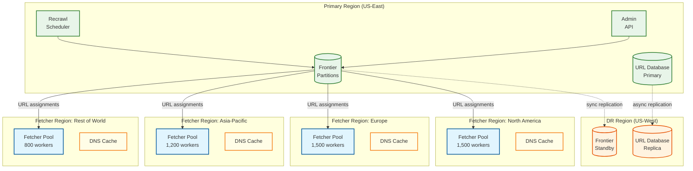

# Scalability & Reliability — Web Crawlers

## Scalability

### Horizontal vs. Vertical Scaling

| Component | Scaling Strategy | Rationale |
|-----------|-----------------|-----------|
| URL Frontier | **Horizontal (partitioned)** | Each partition owns a consistent-hash range of hosts; partitions operate independently; add partitions for more host capacity |
| Fetcher Workers | **Horizontal** | Stateless workers behind a work-queue pattern; add workers for more concurrent connections |
| DNS Resolver Cache | **Horizontal (sharded)** | Shard by host hash; each shard caches a subset of domains |
| Content Processing Pipeline | **Horizontal** | Stateless parsers and link extractors; scale with fetcher throughput |
| URL Dedup (Bloom Filter) | **Horizontal (per-partition)** | Each frontier partition maintains its own Bloom filter; no cross-partition queries |
| Content Dedup Store | **Horizontal (sharded)** | Shard by content hash; uniform distribution |
| Page Store (Object Storage) | **Horizontal (built-in)** | Object storage scales horizontally by design |
| URL Database | **Horizontal (sharded)** | Shard by host; all URLs for a host are co-located with their frontier partition |
| Recrawl Scheduler | **Horizontal (partitioned)** | Each instance handles a subset of frontier partitions |
| robots.txt Cache | **Horizontal (per-fetcher)** | Each fetcher worker group maintains its own cache; populated on-demand |

### Auto-Scaling Triggers

| Component | Metric | Scale-Up Threshold | Scale-Down Threshold | Cooldown |
|-----------|--------|-------------------|----------------------|----------|
| Fetcher Workers | Queue depth (URLs waiting) | >10,000 per partition for >5 min | <500 per partition for >15 min | 10 min |
| Content Processors | Processing lag | >30s lag behind fetchers | <5s lag for >15 min | 5 min |
| DNS Resolvers | Cache miss rate | >10% miss rate | <2% miss rate for >30 min | 15 min |
| Frontier Partitions | URLs per partition | >500M URLs per partition | <100M URLs per partition | 1 hour |

### Scaling the Fetcher Fleet

The fetcher fleet is the most horizontally scalable component. Each worker is stateless — it requests URLs from the frontier, fetches them, and reports results. Key scaling considerations:

**Geographic Distribution:** Fetcher workers are deployed in data centers worldwide to minimize network latency to target hosts. A fetcher in Europe handles European hosts; a fetcher in Asia handles Asian hosts. The frontier partitions route URLs to the geographically closest fetcher group.

| Region | Fetcher Workers | Estimated Hosts Covered |
|--------|----------------|------------------------|
| North America | 1,500 | ~150M hosts |
| Europe | 1,500 | ~150M hosts |
| Asia-Pacific | 1,200 | ~130M hosts |
| Rest of World | 800 | ~70M hosts |

**Connection Pool Management:** Each worker maintains persistent connection pools to frequently crawled hosts. The pool manager evicts connections idle for >30 seconds and limits total connections per worker to the OS file descriptor limit (~10,000). At 200-500 active connections per worker, 5,000 workers maintain ~1.5 million concurrent connections.

**Bandwidth Allocation:** Total inbound bandwidth is ~50 TB/day (~4.6 Gbps sustained). Distributed across 5,000 workers, each worker averages ~1 Mbps — well within a single machine's capability. Peak bandwidth is handled by temporary scale-up of workers.

### Scaling the Frontier

The frontier is the most challenging component to scale because it is stateful (it holds the URL queues and politeness state) and latency-sensitive (fetchers block on dequeue).

**Partition Strategy:**

```
partition_id = consistent_hash(host) % num_partitions
```

With 256 partitions, each partition manages ~2M hosts and ~40M URLs. Each partition runs on a dedicated machine with:
- ~500 MB for back queue heap and host mapping
- ~500 MB for Bloom filter (partition-local)
- ~2 GB for front queues (hot portion; cold URLs on disk)

**Rebalancing:** When adding partitions, hosts are redistributed via consistent hashing with virtual nodes. During rebalancing, affected hosts are temporarily frozen (no new fetches) until their URL state is migrated. Migration takes ~10 minutes per partition.

### Database Scaling Strategy

The URL database uses a wide-column store sharded by host:

| Shard Key | Rationale |
|-----------|-----------|
| `host` | All URLs for a host are co-located; enables efficient per-host queries (all URLs for a host, host crawl stats, etc.) |

**Read Replicas:** The URL database is read-heavy (recrawl scheduler scans, admin queries, analytics). Read replicas serve these workloads while the primary handles writes from crawl result reports.

**Time-Series Partitioning:** Crawl events are partitioned by time (daily tables). Old partitions are archived or dropped according to the retention policy.

### Caching Layers

| Layer | What It Caches | Size | TTL | Hit Rate |
|-------|---------------|------|-----|----------|
| L1: Fetcher-local | robots.txt, DNS, recent content hashes | ~1 GB per worker | robots.txt: 24h; DNS: varies; hashes: 1h | 95%+ for DNS |
| L2: Regional | robots.txt (shared across fetchers), popular host metadata | ~50 GB per region | 24h | 80%+ for robots.txt |
| L3: Bloom filter (per partition) | URL membership | ~500 MB per partition | Rebuilt every 24h | N/A (probabilistic) |

### Hot Spot Mitigation

| Hot Spot | Cause | Mitigation |
|----------|-------|------------|
| Popular hosts (news.example.com) | High volume of discovered URLs for a single host | Per-host URL budget in frontier; excess URLs stored in overflow queue |
| Frontier partition imbalance | Consistent hash maps a disproportionate number of high-volume hosts to one partition | Virtual nodes in consistent hashing; monitor per-partition queue depth; rebalance if skew >2x |
| Content dedup hot keys | Many pages share near-identical boilerplate, clustering SimHash queries | Dedicated hot-key shard; partition by SimHash prefix |

---

## Reliability & Fault Tolerance

### Single Points of Failure (SPOF) Identification

| Component | SPOF Risk | Mitigation |
|-----------|-----------|------------|
| Frontier partition | Loss of a partition halts crawling for ~2M hosts | Primary-standby replication; standby takes over within seconds |
| DNS resolver | DNS failure blocks all fetching | Multiple resolver instances; fallback to upstream resolvers |
| Content dedup store | Dedup service outage causes duplicate fetches | Degraded mode: skip dedup, accept duplicates; reconcile later |
| URL database | DB outage prevents crawl result storage | Write-ahead log on fetchers; replay on DB recovery |
| Object storage | Page content cannot be stored | Local disk buffer on fetcher machines; retry writes when storage recovers |

### Redundancy Strategy

- **Frontier:** Each partition runs primary + standby with synchronous replication of queue state. Standby monitors primary heartbeat and takes over within 5 seconds.
- **Fetcher Fleet:** N+20% over-provisioning. If 20% of workers fail, remaining workers absorb the load.
- **DNS Resolver:** 3 resolver instances per region with round-robin load balancing.
- **Content Store:** Object storage provides built-in replication (3 replicas by default).

### Failover Mechanisms

**Frontier Partition Failover:**
1. Primary sends heartbeat to standby every 1 second
2. Standby detects 3 missed heartbeats (3 seconds)
3. Standby promotes itself to primary
4. Fetchers reconnect to new primary (frontier client retries with backoff)
5. URLs in-flight (checked out by fetchers from old primary) are re-enqueued after lease timeout (5 minutes)

**Fetcher Worker Failure:**
- URLs checked out by the failed worker are not acknowledged within the lease timeout (5 minutes)
- Frontier automatically re-enqueues leased-but-unacknowledged URLs
- No data loss; minor delay in crawling those URLs

### Circuit Breaker Patterns

| Circuit | Triggers | Open Behavior | Half-Open Recovery |
|---------|----------|--------------|-------------------|
| Host circuit breaker | 5 consecutive 5xx errors from a host | Stop all fetching from host for 1 hour | Try 1 request; if success, close circuit |
| DNS resolver circuit breaker | >50% query failures in 1 minute | Switch to backup resolver | Try 10% of queries through primary |
| Content store circuit breaker | Write latency p99 > 5 seconds | Buffer writes locally; stop new writes to store | Resume writes at 10% rate |
| Frontier partition circuit breaker | Partition unresponsive for >10 seconds | Fetchers skip this partition; process URLs from other partitions | Reconnect and verify state |

### Retry Strategies

| Operation | Initial Delay | Max Delay | Max Retries | Backoff |
|-----------|--------------|-----------|-------------|---------|
| Page fetch (transient error) | 1 hour | 7 days | 5 | Exponential (1h, 4h, 1d, 3d, 7d) |
| DNS resolution failure | 10 seconds | 5 minutes | 3 | Exponential |
| robots.txt fetch failure | 5 minutes | 24 hours | 5 | Exponential |
| Content store write | 1 second | 30 seconds | 5 | Exponential with jitter |
| Frontier enqueue | 100ms | 5 seconds | 3 | Exponential with jitter |

### Graceful Degradation

| Scenario | Degraded Behavior | Recovery |
|----------|-------------------|----------|
| Content dedup service down | Fetch and store pages without dedup; accept duplicates | Batch dedup pass after service recovers |
| SimHash index down | Skip near-duplicate detection; exact-hash dedup still works | Rebuild SimHash index from content store |
| Recrawl scheduler down | No recrawls scheduled; continue first-crawl discovery | Resume recrawl scheduling from URL database on recovery |
| 50% of frontier partitions down | Crawl throughput drops by ~50%; surviving partitions continue | Restart or failover failed partitions |
| Object storage degraded | Buffer pages on local disk; slow down fetching to match write capacity | Drain local buffer to object storage when recovered |

### Bulkhead Pattern

The crawler uses bulkheads to isolate failure domains:

- **Per-region bulkhead:** Fetcher fleet in each region operates independently. A network issue in Asia does not affect European crawling.
- **Per-frontier-partition bulkhead:** Each partition is an independent crawl unit. Partition failure only affects hosts in that partition.
- **Per-host circuit breaker:** A single host's errors (5xx, timeouts) do not affect crawling of other hosts on the same partition.

---

## Disaster Recovery

### RTO (Recovery Time Objective)

| Component | RTO | Strategy |
|-----------|-----|----------|
| Frontier partitions | 30 seconds | Hot standby with automatic failover |
| Fetcher fleet | 5 minutes | Auto-scaling replaces failed workers |
| DNS cache | 2 minutes | Fallback to upstream resolvers; cache rebuilds passively |
| URL database | 15 minutes | Failover to read replica promoted to primary |
| Content store | 30 minutes | Switch to secondary object storage region |

### RPO (Recovery Point Objective)

| Data | RPO | Strategy |
|------|-----|----------|
| Frontier queue state | <5 seconds | Synchronous replication to standby |
| URL metadata | <1 minute | Continuous replication; worst case re-crawl a few pages |
| Fetched page content | <1 hour | Pages buffered on fetcher local disk; replay on recovery |
| Crawl events | <5 minutes | Write-ahead log on fetchers; async replication to crawl log store |

### Backup Strategy

- **URL database:** Daily full backup + continuous incremental (WAL shipping)
- **Frontier checkpoints:** Every 15 minutes to durable storage
- **Bloom filters:** Checkpointed hourly; can be rebuilt from URL database in ~30 minutes
- **Content store:** Object storage with cross-region replication (built-in)
- **Configuration (seed lists, trap blocklists, host overrides):** Stored in version control; deployed via CI/CD

### Multi-Region Deployment Architecture

The crawler inherently operates across regions (fetcher workers are deployed globally). The frontier and URL database can be deployed in a single primary region with fetcher workers pulling URLs over cross-region links.



**Deployment Models:**

| Model | Architecture | Trade-off |
|-------|-------------|-----------|
| **Active-Passive** | Primary region runs frontier + URL DB; DR region has standby replicas | Simple; higher RTO (minutes) due to promotion time |
| **Active-Active (partitioned)** | Each region owns a subset of frontier partitions; each region's fetchers pull from local frontier | Complex but low RTO; requires partition reassignment on region failure |
| **Centralized frontier, distributed fetchers** | Single frontier region; fetchers in 4+ regions pull URLs over cross-region links | Simplest; cross-region latency adds ~50-100ms per dequeue but fetchers are latency-tolerant |

**Cross-Region Latency Budget:**

| Operation | Same-Region | Cross-Region | Impact |
|-----------|-------------|--------------|--------|
| Frontier dequeue | <10ms | 60-110ms | Fetchers batch dequeue (50 URLs per request) to amortize |
| Crawl result report | <5ms | 50-100ms | Async; does not block fetcher from next fetch |
| DNS resolution | <1ms (cached) | N/A (always local) | Each region runs its own DNS cache |
| Content store write | <20ms | 80-150ms | Buffered locally; async write to primary store |

---

## Back-Pressure & Load Shedding

### Admission Control

The crawler pipeline must prevent cascading overload when downstream components (content store, URL database, dedup service) slow down or become unavailable.

```
FUNCTION admission_control(component_health):
    // Level 0: Normal — all systems healthy
    IF all_components_healthy():
        RETURN ADMIT_ALL

    // Level 1: Slow down — content store write latency elevated
    IF content_store.p99_latency > 2 * BASELINE:
        reduce_fetcher_concurrency(factor = 0.7)
        RETURN ADMIT_WITH_THROTTLE

    // Level 2: Shed low-priority — dedup service degraded
    IF dedup_service.error_rate > 5%:
        skip_simhash_dedup()  // Fall back to exact hash only
        drop_priority_4_urls()  // Stop fetching lowest priority
        RETURN SHED_LOW_PRIORITY

    // Level 3: Survival mode — frontier or URL DB severely degraded
    IF frontier.dequeue_latency > 500ms OR urldb.write_error_rate > 10%:
        reduce_fetcher_concurrency(factor = 0.3)
        drop_priority_3_and_4_urls()
        pause_recrawl_scheduling()  // Focus on in-flight URLs only
        RETURN SURVIVAL_MODE

    // Level 4: Emergency stop — critical component down
    IF frontier.unavailable OR urldb.unavailable:
        pause_all_fetching()
        buffer_in_flight_results_locally()
        RETURN EMERGENCY_STOP
```

### Load Shedding Priority Matrix

| Priority | URL Category | Shed At Level | Rationale |
|----------|-------------|---------------|-----------|
| P0 | robots.txt fetches | Never shed | Compliance requirement; must always be current |
| P1 | Top-1M page recrawls | Level 4 only | Core freshness SLO; shedding degrades search quality |
| P2 | High-priority new pages | Level 3 | Important but deferrable |
| P3 | Standard recrawls | Level 2 | Can tolerate staleness for hours |
| P4 | Low-priority discovery | Level 1 | Least time-sensitive; first to shed |

### Fetcher Fleet Flow Control

Each fetcher worker implements local flow control independent of the frontier's admission control:

| Signal | Threshold | Action |
|--------|-----------|--------|
| Local disk buffer > 80% full | 80% utilization | Reduce concurrent connections by 50% |
| Memory usage > 85% | 85% utilization | Evict connection pools for idle hosts; reduce batch size |
| Content store write failures > 3 consecutive | 3 failures | Pause fetching; drain local buffer first |
| DNS resolution queue > 1,000 pending | 1,000 pending | Throttle new fetch requests until DNS catches up |
| CPU > 90% sustained for 5 min | 90% for 5 min | Reduce HTML parsing parallelism; defer SimHash computation |

---

## Chaos Engineering Practices

### Experiment Catalog

| Experiment | What It Tests | Expected Behavior | Blast Radius |
|------------|--------------|-------------------|-------------|
| **Kill a frontier partition** | Standby failover; fetcher reconnection | Standby promotes within 5s; fetchers reconnect within 30s; leased URLs re-enqueued after timeout | ~2M hosts (1 partition) temporarily paused |
| **DNS resolver failure in one region** | Fallback to backup resolvers; cross-region DNS | Fetchers switch to backup resolver within 10s; DNS cache serves stale entries temporarily | Increased latency for cache misses in affected region |
| **Content store write latency spike** (inject 5s delay) | Back-pressure propagation; local buffering | Fetchers buffer locally; admission control reduces concurrency; no data loss | Temporary throughput reduction |
| **Bloom filter corruption** (flip random bits) | False positive rate increase; impact on coverage | False positive rate rises; rebuild triggered within 1 hour; duplicate fetches increase temporarily | Minor coverage loss until rebuild |
| **Network partition between fetchers and frontier** | Lease timeout and re-enqueue; fetcher isolation | Fetchers exhaust local URL batch; stop fetching after batch depleted; frontier re-enqueues after 5-min lease timeout | Regional fetcher fleet idles until partition heals |
| **Simulate robot.txt 5xx storm** (50% of hosts return 5xx for robots.txt) | Conservative fallback behavior; crawl rate impact | Crawler pauses affected hosts; uses cached robots.txt where available; throughput drops proportionally | Significant throughput reduction but no compliance violations |
| **Kill 30% of fetcher workers simultaneously** | Fleet resilience; auto-scaling response | Surviving workers absorb load (within over-provisioning margin); auto-scaler launches replacements within 5 min | Temporary 30% throughput reduction |

### Steady-State Hypothesis

Before each experiment, define the steady-state metrics that must hold:

| Metric | Steady State | Allowed Deviation During Experiment |
|--------|-------------|--------------------------------------|
| Pages fetched per second | 11,500 | -50% for up to 15 minutes |
| robots.txt violation count | 0 | 0 (no deviation allowed) |
| Frontier partition availability | 256/256 | 255/256 (1 partition down) |
| Content store write success rate | >99.9% | >95% |
| DNS resolution success rate | >99.99% | >99% |

---

## Capacity Planning

### Growth Model

| Metric | Year 1 | Year 2 | Year 3 | Growth Driver |
|--------|--------|--------|--------|--------------|
| Known URLs | 10B | 15B | 22B | Web growth + deeper discovery |
| Pages fetched/day | 1B | 1.5B | 2.2B | Proportional to URL growth |
| Fetcher workers | 5,000 | 7,000 | 10,000 | Linear with fetch volume |
| Frontier partitions | 256 | 384 | 512 | Proportional to host count |
| Bloom filter memory | 12 GB | 18 GB | 27 GB | Linear with URL count |
| Daily storage (raw) | 50 TB | 75 TB | 110 TB | Linear with fetch volume |
| Annual storage | 18 PB | 27 PB | 40 PB | Cumulative growth |
| DNS cache size | 50 GB/region | 75 GB/region | 100 GB/region | Linear with host count |

### Cost Optimization Strategies

| Strategy | Savings | Trade-off |
|----------|---------|-----------|
| Aggressive content retention (delete pages unchanged for 90 days from hot storage) | ~40% storage cost | Must re-fetch if page later changes; increases recrawl load |
| Tiered storage (hot → warm → cold based on access recency) | ~30% storage cost | Cold pages have higher retrieval latency |
| Spot/preemptible instances for fetcher workers | ~60% compute cost | Fetcher interruption; mitigated by lease-based URL checkout |
| Conditional GET for recrawls | ~25% bandwidth | Only works for hosts that support ETag/Last-Modified |
| Compression for cross-region frontier traffic | ~50% cross-region bandwidth | CPU overhead for compression/decompression |
| Regional content store replicas (avoid cross-region writes) | ~30% cross-region bandwidth | Higher storage cost; requires replication management |

### Scaling Decision Framework

| Trigger | Scaling Action | Automation |
|---------|---------------|------------|
| Frontier partition queue depth > 500M URLs | Add frontier partitions (rebalance hosts) | Semi-automated; requires operator approval for rebalancing |
| Fetcher queue starvation (>10s wait for URLs) | Add fetcher workers or redistribute across partitions | Fully automated via auto-scaler |
| Bloom filter false positive rate > 2% | Rebuild Bloom filter from URL database | Scheduled (weekly) with emergency trigger |
| Content store write latency p99 > 5s sustained | Scale content store capacity; add write shards | Manual; requires capacity planning |
| DNS cache miss rate > 10% sustained | Add DNS resolver capacity; increase cache size | Semi-automated |
| Cross-region bandwidth > 80% of provisioned | Upgrade interconnect or add regional content stores | Manual; requires infrastructure change |

---

## Real-World Case Study: E-Commerce Price Monitoring Crawler

**Scenario:** A price comparison service crawls 50 million product pages across 10,000 e-commerce sites daily. Unlike a general web crawler, this focused crawler has tight freshness requirements (prices can change hourly) and must handle JavaScript-rendered pages (many modern e-commerce sites use SPAs).

### Scaling Challenges

| Challenge | How It Manifested | Solution |
|-----------|-------------------|----------|
| **JavaScript rendering Slowest part of the process** | 60% of target sites require headless browser rendering; each render takes 3-5 seconds vs. 200ms for static HTML | Separate rendering farm with browser pool (2,000 headless instances); rendering is async — fetcher downloads raw HTML, queues render job, rendering farm returns extracted price data |
| **Flash sale traffic spikes** | During major sales events (Black Friday, Prime Day), prices change every few minutes; normal recrawl intervals miss critical changes | Event-triggered recrawl: monitor e-commerce sites' social media and promotional pages for sale announcements; trigger aggressive recrawl (5-min intervals) for affected product pages during sales windows |
| **Anti-bot detection** | E-commerce sites actively detect and block crawlers; IP blocks, CAPTCHAs, fingerprint-based detection | Residential proxy rotation with 50,000+ IPs; browser fingerprint randomization; request rate kept below 0.5 req/s per site; TLS fingerprint diversity |
| **Price extraction accuracy** | Page layout changes break scrapers; A/B testing serves different page variants | Extraction fallback chain: (1) structured data (JSON-LD, Microdata), (2) CSS selector with site-specific config, (3) ML-based price extraction model; accuracy monitored per-site with human-in-the-loop validation for drift detection |

### Architecture Adaptations

| Adaptation | General Crawler | E-Commerce Crawler |
|------------|----------------|-------------------|
| Recrawl interval | Adaptive (hours to weeks) | Fixed per-site tiers: Tier 1 (top retailers) every 2 hours, Tier 2 every 6 hours, Tier 3 daily |
| Rendering | Optional (most pages are static HTML) | Mandatory for 60% of sites; separate rendering pipeline |
| Politeness model | robots.txt + adaptive | robots.txt + site-specific negotiated rate limits + dynamic adjustment based on anti-bot signals |
| Content extraction | Full page storage | Structured data extraction (price, availability, title, image); raw page stored for debugging only |
| Freshness monitoring | SLO-based | Per-site SLA with contractual freshness guarantees to downstream price comparison product |

---

## Consistency Model

### Per-Component Consistency Requirements

| Component | Consistency Level | Rationale |
|-----------|------------------|-----------|
| URL Frontier (within partition) | Strong (sequential) | Politeness timers must be strictly ordered; double-fetching a host violates rate limits |
| URL Frontier (across partitions) | Eventual | A URL enqueued on partition A may temporarily be unknown to partition B; Bloom filter catches most duplicates |
| URL Database | Eventual | Metadata staleness (a few seconds) does not affect crawl correctness |
| Content Dedup Store | Eventual | A brief window of duplicate storage is acceptable; content-addressed keys make overwrites idempotent |
| robots.txt Cache | Strong (per-host) | Fetching with stale or missing robots.txt can cause compliance violations |
| Bloom Filter | Probabilistic | False positives accepted (1%); false negatives impossible by construction |
| Crawl Log | Append-only (eventual) | Logs are written asynchronously; ordering within a URL's crawl history is maintained by timestamp |

### Cross-Region Replication

| Data | Replication Strategy | Lag Tolerance |
|------|---------------------|---------------|
| Frontier queue state | Synchronous to standby (same AZ) | 0 (hot standby must be current) |
| URL database | Async cross-region | <5 minutes |
| Content store | Async cross-region (content-addressed) | <1 hour |
| Crawl logs | Async cross-region | <15 minutes |
| Bloom filter checkpoints | Periodic snapshot replication | <1 hour |
| robots.txt cache | Not replicated (each region fetches independently) | N/A |

---

## Failover Decision Matrix

| Scenario | Detection | Automated? | Failover Action | Expected Duration |
|----------|-----------|------------|-----------------|-------------------|
| Single frontier partition crash | Heartbeat miss (3 consecutive) | Yes | Standby promotes to primary | <5 seconds |
| Multiple frontier partitions crash (>10%) | Aggregate partition health check | Semi-auto | Alert on-call; approve batch failover | 2-5 minutes |
| Entire frontier region down | Cross-region health monitor | Manual | Promote DR replicas; redirect fetchers to DR frontier | 10-15 minutes |
| DNS resolver failure (single instance) | Health check failure | Yes | Round-robin excludes failed instance | <10 seconds |
| DNS resolver failure (all in region) | Regional health check | Semi-auto | Fetchers fall back to upstream resolvers; accept latency | 1-2 minutes |
| Content store degraded (high latency) | p99 monitoring | Yes | Admission control reduces fetcher concurrency; local buffering | Automatic |
| Content store unavailable | Write failures >90% | Semi-auto | Fetchers buffer locally; pause non-critical fetching | Until recovery |
| Fetcher fleet partial failure (<30%) | Worker count monitoring | Yes | Auto-scaler launches replacements; surviving workers absorb | 3-5 minutes |
| Fetcher fleet total failure in one region | Regional fleet health check | Semi-auto | Redistribute URLs to other regions' fetchers | 5-10 minutes |
| URL database primary down | Replication lag spike + connection failures | Semi-auto | Promote read replica to primary; redirect writes | 5-15 minutes |

---

## Operational Runbooks

### Runbook: Frontier Partition Rebalancing

**Trigger:** Adding or removing frontier partitions (scale-out/scale-in, hardware replacement)

**Steps:**
1. Freeze URL enqueues to affected partitions (new URLs buffered at link extractor)
2. Identify hosts moving between partitions via consistent hash recalculation
3. For each migrating host:
   a. Drain the host's back queue on the old partition (wait for in-flight URLs to complete or timeout)
   b. Export the host's queue state (URLs, politeness timer, metadata)
   c. Import into the new partition's back queue
   d. Update the Bloom filter on the new partition (insert all known URL hashes for this host)
4. Unfreeze URL enqueues; verify traffic flows to new partitions
5. Old partition's Bloom filter retains stale entries (cannot delete); schedule rebuild

**Duration:** ~10 minutes per partition; parallelizable across non-overlapping partitions
**Risk:** URLs in transit during migration may be temporarily lost → Bloom filter + URL database serve as safety net

### Runbook: Bloom Filter Emergency Rebuild

**Trigger:** False positive rate >3% (measured via sampling) or Bloom filter corruption detected

**Steps:**
1. Continue operating with degraded Bloom filter (elevated false positives → some new URLs rejected)
2. For each affected partition:
   a. Query URL database for all URL hashes in this partition's host range
   b. Construct a new Bloom filter from the URL database results
   c. Atomic swap: replace in-memory filter with new filter
   d. Checkpoint new filter to disk
3. Monitor false positive rate post-rebuild; expect return to <1%

**Duration:** ~30 minutes per partition (dominated by URL database scan)
**Risk:** During rebuild, any URLs enqueued after the database snapshot started may be missing from the new filter → they will be treated as new (re-enqueued), causing duplicate fetches

### Runbook: Handling a Major Host Blocking the Crawler

**Trigger:** A high-value host (top-1M by traffic) blocks the crawler's IP range or User-Agent

**Steps:**
1. Confirm the block: verify from multiple fetcher regions; check if block is IP-based or User-Agent-based
2. Pause all crawling to the affected host immediately (prevents further 403/429 responses from degrading host circuit breaker stats)
3. Review crawl history for the host: check for politeness violations, excessive request rate, or unusual crawl patterns
4. If crawl behavior was compliant:
   a. Contact the host's webmaster (via published abuse/contact channels)
   b. Provide evidence of compliance (crawl rate logs, robots.txt adherence)
   c. Request unblocking and negotiate an acceptable crawl rate
5. If crawl behavior was non-compliant:
   a. Identify root cause (bug in politeness engine, stale robots.txt cache, IP-sharing aggregate throttle failure)
   b. Fix the root cause
   c. Contact the host's webmaster with apology and evidence of fix
6. Until resolved: mark host as "blocked — awaiting resolution" in the URL database; do not retry

**Duration:** Resolution typically takes 3-7 business days
**Impact:** Coverage loss for the blocked host; may affect downstream search quality if host is high-value

---

## Performance Benchmarks

### Component Performance Targets

| Component | Metric | Target | Measurement Method |
|-----------|--------|--------|-------------------|
| Frontier dequeue | Throughput | >50,000 URLs/sec per partition | Load test with synthetic URL stream |
| Frontier enqueue | Throughput | >100,000 URLs/sec per partition | Load test with link extraction simulation |
| Bloom filter lookup | Latency | <1μs per lookup | Microbenchmark with warmed filter |
| SimHash computation | Throughput | >10,000 pages/sec per worker | Benchmark with representative HTML corpus |
| URL normalization | Throughput | >100,000 URLs/sec per worker | Benchmark with diverse URL set |
| Content hash (MD5) | Throughput | >50,000 pages/sec per worker | Benchmark with average 50 KB pages |
| DNS cache lookup | Latency | <1μs (hit), <500ms (miss) | Integration test with real DNS |
| robots.txt parsing | Throughput | >50,000 parses/sec | Benchmark with diverse robots.txt files |
