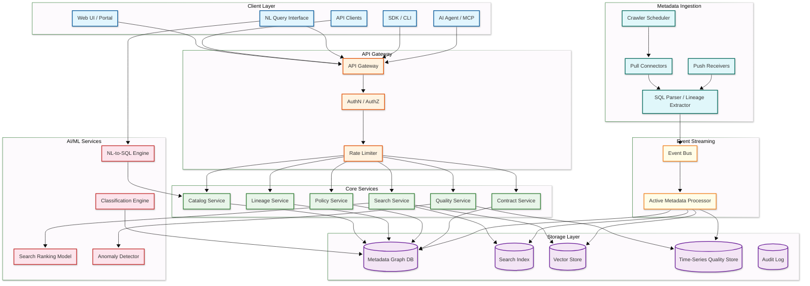
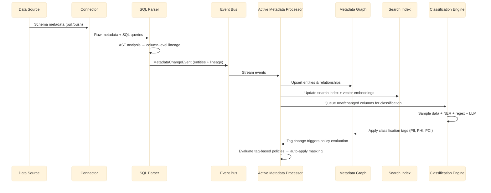
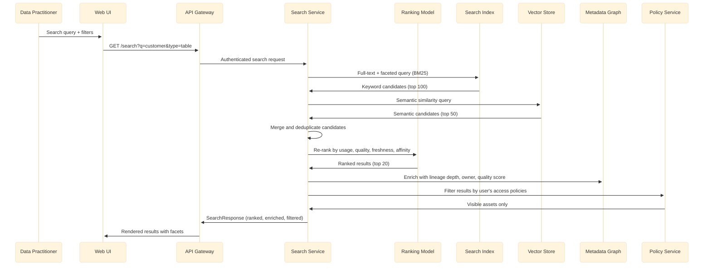
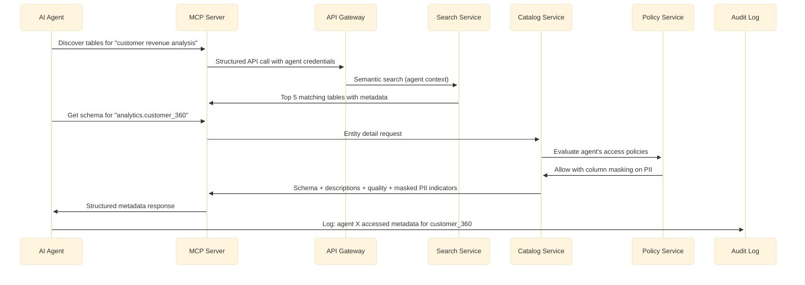
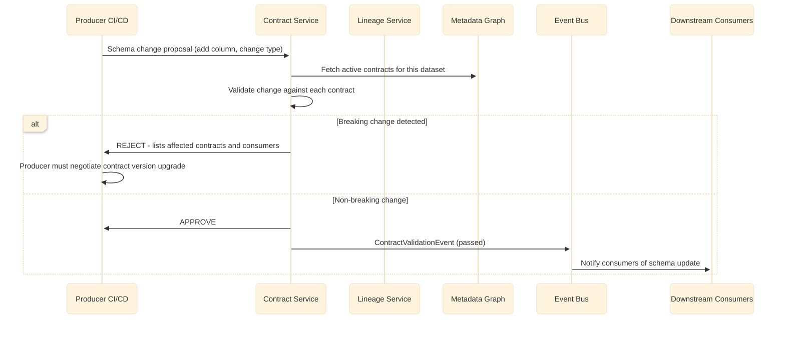
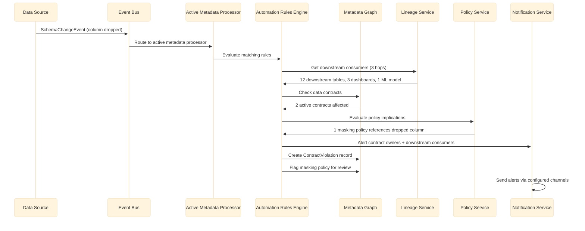
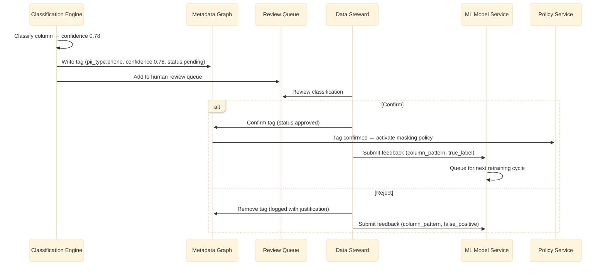

# High-Level Design — AI-Native Data Catalog & Governance

## System Architecture



## Component Descriptions

| Component | Responsibility | Key Interfaces |
|-----------|---------------|---------------|
| **API Gateway** | Routes requests, enforces authentication (OAuth2/OIDC), rate limiting, request validation | Ingress for all external traffic |
| **Search Service** | Full-text and faceted search with usage-weighted ranking, semantic search via embeddings | Reads from search index + vector store |
| **Catalog Service** | CRUD operations on metadata entities (tables, columns, pipelines, dashboards, glossary terms) | Primary interface to metadata graph |
| **Lineage Service** | Stores and traverses the column-level lineage graph; supports impact analysis queries | Reads/writes lineage edges in metadata graph |
| **Policy Service** | Evaluates tag-based access policies, column masking rules, and row filtering predicates | Reads policies and tags from metadata graph |
| **Quality Service** | Stores profiling results, computes quality scores, detects anomalies via statistical models | Writes to time-series store; reads from graph |
| **Contract Service** | Manages data contracts between producers and consumers; validates schema changes against active contracts | Reads contracts and lineage from graph |
| **Classification Engine** | Runs NER models and regex patterns against data samples to detect PII/PHI/PCI; LLM for ambiguous cases | Writes classification tags to graph |
| **NL-to-SQL Engine** | Converts natural language questions to SQL using LLM with catalog metadata as context | Reads schema + descriptions from catalog |
| **Search Ranking Model** | Learns-to-rank model combining text relevance, usage frequency, freshness, quality score, semantic similarity | Re-ranks search candidates |
| **Anomaly Detector** | Detects quality anomalies (distribution shifts, null spikes, freshness delays) using statistical models | Reads quality history; emits alerts |
| **Crawler Scheduler** | Orchestrates periodic and incremental metadata crawls across all connected sources | Manages connector lifecycle |
| **SQL Parser** | Parses SQL/dbt models to extract column-level lineage from AST analysis | Ingests SQL from connectors |
| **Event Bus** | Streams metadata change events (schema changes, quality signals, lineage updates) | Central nervous system of the platform |
| **Active Metadata Processor** | Event-driven automation: triggers notifications, policy checks, lineage updates, tag propagation on metadata changes | Consumes from event bus; writes to all stores |
| **Vector Store** | Stores entity description embeddings for semantic search | Indexed by entity ID |

---

## Data Flow: Metadata Ingestion Path



## Data Flow: Search & Discovery Path



## Data Flow: AI Agent Discovery Path



## Data Flow: Data Contract Validation Path



## Data Flow: Active Metadata Automation Path



## Data Flow: Classification Feedback Loop



---

## Key Design Decisions

| Decision | Choice | Alternative | Rationale |
|----------|--------|-------------|-----------|
| **Metadata storage** | RDBMS (PostgreSQL) with adjacency model | Native graph database | RDBMS handles ACID transactions, schema migrations, and operational familiarity; graph queries are handled via recursive CTEs and materialized lineage paths |
| **Search engine** | Dedicated search index (OpenSearch) | RDBMS full-text search | Search requires inverted indexes, faceting, fuzzy matching, and embedding-based semantic search at scale |
| **Semantic search** | Separate vector store + hybrid BM25/vector scoring | Search index only (BM25) | Vector embeddings capture semantic meaning (e.g., "revenue" matches "sales"); hybrid scoring combines keyword precision with semantic recall |
| **Ingestion model** | Hybrid push + pull | Pull-only crawling | Push for real-time sources (Airflow, Spark); pull for batch sources (warehouses, BI tools) |
| **Lineage extraction** | SQL AST parsing | Query log pattern matching | AST parsing gives column-level accuracy; pattern matching misses complex CTEs and subqueries |
| **Classification approach** | Hybrid NER + regex + LLM | Regex-only | NER catches unstructured PII in free-text columns; regex handles structured patterns (SSN, email); LLM resolves ambiguous cases |
| **Policy enforcement model** | Tag-based (ABAC) | Role-based (RBAC) only | Tags compose with classification — auto-classified PII columns automatically inherit masking policies |
| **Event architecture** | Event bus with active metadata processor | Polling-based sync | Real-time responsiveness for schema changes, quality alerts, and policy triggers |
| **NL-to-SQL** | LLM with RAG over catalog metadata | Rule-based NL parser | LLM handles open-ended questions; catalog metadata provides schema context for accurate SQL generation |
| **Agent access** | MCP-compatible structured API | REST-only API | MCP enables AI agents from any framework to connect to the catalog as a tool; structured responses optimize for agent consumption |

---

## Cross-Cutting Concerns

### Idempotency

All metadata write operations must be idempotent — connectors may retry failed writes, and event consumers may replay events:

| Operation | Idempotency Mechanism |
|-----------|----------------------|
| Entity upsert | `qualified_name` as natural key; upsert semantics (INSERT ON CONFLICT UPDATE) |
| Tag application | `(entity_id, tag_key)` uniqueness; re-application is a no-op |
| Lineage edge creation | `(source_id, target_id, pipeline_id)` composite key; duplicate writes update `last_observed` timestamp |
| Quality profile write | Deduplicate by `(entity_id, dimension, run_id)` |
| Event publishing | Event ID generated at source; consumers deduplicate by event_id with 24-hour window |

### Versioning & Backward Compatibility

| API Versioning | Strategy |
|---------------|----------|
| REST API | URL path versioning (`/api/v1/`, `/api/v2/`); deprecation warnings in response headers |
| Event schema | Schema registry with backward-compatible evolution; consumers specify minimum version |
| Search index | Index alias pointing to latest version; blue-green index rebuild for schema changes |
| Connector protocol | Connector SDK with version negotiation; older connectors continue working with degraded features |

### Multi-Tenancy (Domain Isolation)

In enterprise deployments, domains must be isolated while sharing infrastructure:

| Isolation Layer | Mechanism |
|----------------|-----------|
| **Data isolation** | Domain-scoped RDBMS rows (domain_id column on all tables); row-level security policies |
| **Search isolation** | Search results filtered by user's domain access list |
| **Policy isolation** | Policies scoped to domain; global policies override domain policies |
| **Ingestion isolation** | Connectors tagged to domains; connector credentials scoped per domain |
| **Audit isolation** | Audit queries scoped by domain; cross-domain audit requires admin role |
| **Data contracts** | Catalog-enforced schema contracts | External contract registry | Catalog has lineage to auto-discover consumers; no separate contract system needed |

### Decision Rationale Deep Dive: RDBMS vs. Graph Database

This is the most debated architectural choice. The analysis:

**Workload characterization of a data catalog:**

| Query Type | Frequency | Graph DB Advantage |
|-----------|-----------|-------------------|
| Entity lookup by ID or qualified name | 40% of queries | None (both O(1)) |
| Entity search with filters | 25% of queries | None (search index handles) |
| 1-hop lineage (direct upstream/downstream) | 20% of queries | Marginal (RDBMS JOIN is fast) |
| 2-3 hop lineage (impact analysis) | 10% of queries | Moderate (graph traversal is native) |
| 5+ hop deep traversal | 3% of queries | Strong (recursive CTEs are slow) |
| Tag-based policy evaluation | 2% of queries | None (index lookup in both) |

**Conclusion:** 95% of queries do not benefit from a graph database. The 3% that do (deep traversals) can be optimized via materialized transitive closure tables in RDBMS. The operational overhead of maintaining a graph database (backup/restore, schema evolution, monitoring, talent availability) is not justified unless deep traversal is the dominant query pattern.

**When to choose a graph database:** If the catalog is heavily used for lineage-first use cases (compliance auditing, impact analysis across 5+ hops) and lineage traversal comprises > 30% of queries, a graph database becomes worthwhile. LinkedIn's DataHub made this choice because their graph queries are proportionally higher than typical enterprise catalogs.

---

## Component Interaction Matrix

| | Search | Catalog | Lineage | Policy | Quality | Classification | NL-to-SQL | Active Metadata |
|---|---|---|---|---|---|---|---|---|
| **Search** | — | Read (enrich results) | Read (lineage depth) | Read (filter by access) | Read (quality scores) | — | — | — |
| **Catalog** | Write (index updates) | — | Read/Write | Read (access check) | Read (scores) | Read (tags) | Read (schema context) | Subscribe (events) |
| **Lineage** | — | Read (entity resolution) | — | — | — | — | Read (table relationships) | Subscribe (edge updates) |
| **Policy** | — | Read (entity tags) | — | — | — | Read (classification tags) | Read (masking rules) | Subscribe (policy changes) |
| **Quality** | — | Read (entity details) | Read (upstream trace) | — | — | — | Read (quality warnings) | Subscribe (quality events) |
| **Classification** | — | Read (column metadata) | — | Write (triggers policy) | — | — | — | Publish (tag events) |
| **Active Metadata** | Write (index) | Write (graph) | Write (lineage) | Trigger (policy eval) | Write (quality) | Trigger (classification) | — | — |

---

## Real-World Architecture Patterns

### Pattern: Event-Sourced Metadata (LinkedIn DataHub)

LinkedIn's DataHub processes millions of Metadata Change Events (MCEs) daily through Kafka. Every metadata mutation — schema update, tag applied, ownership changed — is an immutable event. The metadata graph, search index, and all derived views are materialized from this event stream. This enables:
- **Temporal queries**: Reconstruct the metadata state at any point in time
- **Full rebuild**: If any derived store (search, graph) corrupts, rebuild from event log
- **Multi-region replication**: Mirror the event stream to secondary regions
- **Audit trail**: The event log is the complete history of every metadata change

### Pattern: Metadata Lakehouse (Atlan)

Atlan's architecture stores metadata in an Iceberg-native format on object storage, enabling any Iceberg-compatible query engine to analyze metadata at scale. The key innovation is treating metadata as a first-class analytical dataset — queryable, joinable, and aggregatable using standard SQL. This supports use cases like: "Which domain has the highest ratio of undocumented tables?" or "Show the trend of PII column classification coverage over the last 6 months."

### Pattern: Simplified Stack (OpenMetadata)

OpenMetadata deliberately avoids graph databases, using a standard RDBMS with an `entity_relationship` table for graph-like queries. This reduces operational complexity — one database to manage instead of two (RDBMS + graph DB). The trade-off is that deep lineage traversals (5+ hops) use recursive CTEs instead of native graph queries, which is acceptable for most enterprise use cases where 1-3 hop queries dominate.

### Real-World: Collibra Enterprise Scale

Collibra manages over 12 billion data assets across 750+ enterprise customers, with 120,000+ active users (stewards, analysts, engineers). Their architecture emphasizes:
- **Business governance layer**: Sits above technical catalogs (e.g., Unity Catalog) and adds business context — ownership, glossary terms, policies — that technical catalogs lack.
- **Edge deployment**: Lightweight agents (Collibra Edge) deployed near data sources handle metadata extraction, avoiding the need to open network ports from source systems to the central catalog.
- **AI governance**: Captures lineage from source datasets through model training, inference, deployment, and usage — addressing EU AI Act conformity assessment requirements.

### Real-World: Alation Agentic Platform

Alation serves approximately 600 enterprises including 40% of Fortune 100. Their 2025 platform introduced three specialized AI agents:
- **Documentation Agent**: Automatically generates and maintains descriptions for tables and columns by analyzing query patterns, lineage, and existing documentation.
- **Data Quality Agent**: Continuously monitors quality metrics and proactively alerts stewards when degradation is detected.
- **Data Products Builder Agent**: Packages datasets with metadata, quality guarantees, and access policies into self-service "data products."
Key insight: AI output accuracy improves 30-60% when grounded in governed metadata context compared to unstructured prompts.

### Pattern: Federated Metadata Services (DataHub)

Rather than a monolithic metadata store, DataHub uses a federated model where each metadata aspect (schema, ownership, lineage, tags) is stored and served independently. This enables independent scaling — lineage reads can scale separately from tag writes — and supports data mesh architectures where each domain can own its metadata service while contributing to a centralized search index.

---

## Deployment Topology

### Single-Region Deployment

```
Load Balancer
     │
     ├──→ API Gateway (3 replicas)
     │         │
     │    ┌────┴─────────────────────────────┐
     │    │            Core Services          │
     │    │  Search (3)  Catalog (3)  Policy (3) │
     │    │  Lineage (2) Quality (2) Contract (2)│
     │    └──────────────────────────────────┘
     │         │              │
     │    ┌────┴────┐   ┌────┴────┐
     │    │ Storage  │   │  Event  │
     │    │ RDBMS(P+S)│  │  Bus    │
     │    │ Search(3) │  │  (3+)   │
     │    │ Vector(3) │  └────┬────┘
     │    │ Redis(3)  │       │
     │    └──────────┘  ┌────┴────┐
     │                  │ Workers  │
     │                  │ Ingest(5)│
     │                  │ Class(5) │
     │                  │ Active(3)│
     │                  └──────────┘

Total compute: ~40 pods minimum for enterprise scale
Total storage: ~2 TB (RDBMS) + 200 GB (Search) + 150 GB (Vector) + 100 GB (Cache)
```

### Technology Stack (Vendor-Neutral)

| Layer | Component | Options |
|-------|-----------|---------|
| **API** | Gateway + Auth | Envoy, Kong, or built-in service mesh |
| **Compute** | Container orchestration | Managed Kubernetes |
| **Primary DB** | Metadata graph (RDBMS) | PostgreSQL (operational maturity, recursive CTEs, JSONB) |
| **Search** | Full-text + facets | OpenSearch or equivalent |
| **Vector** | Semantic embeddings | Embedded in search cluster or dedicated vector store |
| **Cache** | Hot entity cache + policy decisions | Redis cluster with sentinel |
| **Event Bus** | Metadata change events | Kafka-compatible distributed log |
| **Object Storage** | Audit logs, backups | Any compatible object storage |
| **ML Inference** | Classification models | Containerized model servers (NER, transformers) |
| **LLM** | NL-to-SQL, disambiguation | API-based LLM provider or self-hosted |
