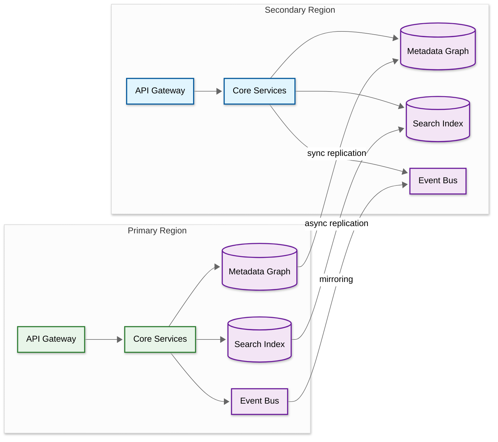

# Scalability & Reliability — AI-Native Data Catalog & Governance

## Horizontal Scaling Strategy

### Metadata Graph Scaling

The metadata graph (RDBMS-backed) is the core Slowest part of the process as the catalog grows beyond 10M entities:

| Strategy | When | How |
|----------|------|-----|
| **Read replicas** | Read QPS exceeds primary capacity | Route search enrichment and lineage reads to replicas; writes go to primary |
| **Functional sharding** | Graph exceeds single-node storage | Shard by entity type: lineage edges in one cluster, quality profiles in another, core entities in primary |
| **Caching layer** | Hot entities dominate reads | Redis cache for frequently accessed entities (top 5% by usage serve 80% of reads) with TTL-based invalidation |
| **Materialized views** | Lineage traversals are slow | Precompute 1-3 hop transitive closures as materialized tables, refreshed hourly |

**Scaling tiers based on catalog size:**

| Tier | Entities | Columns | Lineage Edges | Architecture |
|------|---------|---------|---------------|-------------|
| Small | < 500K | < 10M | < 50M | Single RDBMS primary + 1 replica; single search cluster |
| Medium | 500K-5M | 10M-100M | 50M-500M | RDBMS primary + 2 replicas; 3-node search cluster; Redis cache |
| Large | 5M-50M | 100M-500M | 500M-2B | Functionally sharded RDBMS; 5-node search cluster; dedicated lineage store; tiered cache |
| Very Large | 50M+ | 500M+ | 2B+ | Federated catalogs per domain; graph database for lineage; distributed search with index-per-domain |

### Search Index Scaling

| Scale Point | Solution |
|-------------|----------|
| < 5M entities | Single search cluster (3 nodes) |
| 5-50M entities | Sharded search cluster with index-per-entity-type |
| 50M+ entities | Time-partitioned indexes for quality history; tiered storage (hot: recent, warm: older) |

Index scaling is straightforward because search indexes are stateless replicas of the metadata graph — they can be rebuilt from the event stream.

**Search index memory estimation:**

| Component | Per-Entity Size | At 10M Entities | At 50M Entities |
|-----------|----------------|-----------------|-----------------|
| Text fields (name, description, tags) | ~500 bytes | 5 GB | 25 GB |
| Facet fields (type, domain, owner) | ~100 bytes | 1 GB | 5 GB |
| Vector embeddings (384-dim) | ~1.5 KB | 15 GB | 75 GB |
| Inverted index overhead | ~200 bytes | 2 GB | 10 GB |
| **Total per replica** | | **23 GB** | **115 GB** |

With semantic search enabled (vector embeddings), search memory requirements increase substantially. At 50M entities, a 3-replica cluster requires ~350 GB of RAM dedicated to search — a significant cost driver that must be budgeted.

### Ingestion Scaling

```
Ingestion Pipeline Scaling:

┌─────────────┐     ┌──────────────┐     ┌─────────────┐
│ 50+ Sources │────→│ Connector    │────→│ Event Bus   │
│ (parallel)  │     │ Workers (K8s)│     │ (partitioned│
└─────────────┘     │ Auto-scale   │     │  by source) │
                    │ 1-20 pods    │     └──────┬──────┘
                    └──────────────┘            │
                                    ┌───────────┼───────────┐
                                    │           │           │
                              ┌─────▼──┐  ┌────▼───┐  ┌───▼────┐
                              │ Graph  │  │ Search │  │ Class. │
                              │ Writer │  │ Indexer│  │ Worker │
                              └────────┘  └────────┘  └────────┘
```

- **Connector workers** scale horizontally per source (one pod per connector, auto-scaled by backlog depth)
- **Event bus** is partitioned by source ID, ensuring ordered processing per source while parallelizing across sources
- **Downstream consumers** (graph writer, search indexer, classification worker) each scale independently based on their throughput needs

**Ingestion throughput capacity planning:**

| Component | Capacity per Worker | Workers at Scale | Aggregate Throughput |
|-----------|-------------------|-----------------|---------------------|
| Connector (schema crawl) | 500 tables/min | 20 | 10,000 tables/min |
| SQL parser (lineage extraction) | 200 queries/min | 10 | 2,000 queries/min |
| Graph writer | 5,000 entity upserts/min | 5 | 25,000 upserts/min |
| Search indexer | 10,000 docs/min | 3 | 30,000 docs/min |
| Classification worker (regex) | 10,000 columns/min | 2 | 20,000 columns/min |
| Classification worker (NER) | 1,000 columns/min | 5 | 5,000 columns/min |
| Classification worker (LLM) | 50 columns/min | 3 | 150 columns/min |

### Classification Scaling

| Approach | Throughput | Cost |
|----------|-----------|------|
| Regex + name patterns | 10,000 columns/min | CPU only |
| NER model | 1,000 columns/min | CPU + model loading |
| Transformer classifier | 500 columns/min | GPU preferred |
| LLM disambiguation | 50 columns/min | GPU or API call |

Strategy: **Pyramid processing** — run cheap methods on all columns, NER only on text columns, LLM only on ambiguous cases. This means 90% of columns are classified at the cheapest tier.

**Classification scaling formula:**

```
Initial scan time (hours) = total_columns / (regex_throughput × regex_coverage
                          + ner_throughput × ner_coverage
                          + llm_throughput × llm_coverage)

Example: 40M columns
  Regex handles 70%: 28M / 10,000 = 2,800 min = 46.7 hours with 1 worker
  NER handles 25%:   10M / 1,000 = 10,000 min = 166.7 hours with 1 worker
  LLM handles 5%:    2M / 50 = 40,000 min = 666.7 hours with 1 worker

With parallel workers (20 regex, 10 NER, 5 LLM):
  Regex: 46.7 / 20 = 2.3 hours
  NER: 166.7 / 10 = 16.7 hours
  LLM: 666.7 / 5 = 133.3 hours → TOO SLOW

Optimization: Use LLM only for conflicting classifications (~0.5% of columns)
  LLM handles 0.5%: 200K / 50 = 4,000 min / 5 workers = 13.3 hours

Total initial scan with optimization: ~17 hours (NER is the Slowest part of the process)
Incremental daily: ~2% of columns change → 800K columns → ~2 hours
```

---

## Replication & Fault Tolerance

### Component Failure Handling

| Component | Failure Impact | Redundancy | Recovery | Detection Time |
|-----------|----------------|------------|----------|---------------|
| **Metadata Graph (RDBMS)** | All writes fail; reads degraded | Primary + standby + read replicas | Automatic failover (< 30s); RPO = 0 with synchronous replication | < 10s (health check) |
| **Search Index** | Search unavailable; discovery blocked | 3-node cluster with replica shards | Auto-rebalancing on node loss; full rebuild from event stream if needed | < 5s (cluster health) |
| **Event Bus** | Ingestion pipeline stalls | Multi-broker cluster with replication factor 3 | Auto-leader election; consumers resume from last committed offset | < 15s (ISR shrink) |
| **Classification Engine** | New PII goes undetected | Stateless workers behind load balancer | Workers auto-restart; backlog processed on recovery | < 30s (queue depth) |
| **NL-to-SQL Engine** | Natural language queries fail | Multiple LLM replicas; fallback to smaller model | Graceful degradation: show "NL query temporarily unavailable" | < 5s (health probe) |
| **Policy Service** | Access decisions blocked | Active-passive with shared policy cache | Failover < 5s; stale cache serves reads during failover | < 3s (heartbeat) |
| **Active Metadata Processor** | Events queue but aren't acted upon | Stateless consumer group with 3+ instances | Rebalance consumer group; resume from checkpoint | < 30s (consumer lag) |
| **Redis Cache** | Increased latency on metadata reads | Redis cluster with sentinel failover | Automatic failover; cache rebuild from graph on cold start | < 5s (sentinel) |

### Circuit Breaker Patterns

Each external dependency (data source connector, LLM API, search index) is wrapped in a circuit breaker to prevent cascade failures:

```
Circuit Breaker State Machine:

CLOSED (normal) ──[failure_count > threshold]──→ OPEN (failing)
    ↑                                                │
    │                                        [timeout expires]
    │                                                │
    └────[success_count > recovery_threshold]───── HALF-OPEN (testing)

Configuration per dependency:
  Connector circuit breaker:
    failure_threshold: 5 consecutive failures
    timeout: 60 seconds
    recovery_probes: 3 successful calls to close

  LLM API circuit breaker:
    failure_threshold: 3 consecutive failures or latency > 10s
    timeout: 120 seconds
    fallback: smaller fine-tuned model or cached responses

  Search index circuit breaker:
    failure_threshold: 10 failures in 30 seconds
    timeout: 30 seconds
    fallback: direct graph query (slower but functional)
```

### Data Durability Guarantees

- **Metadata graph:** WAL-backed RDBMS with point-in-time recovery (PITR). Retained for 30 days.
- **Event stream:** Event retention of 7 days. All downstream state (graph, search index, quality store) is derivable from the event stream — enabling full state reconstruction.
- **Search index:** Ephemeral — rebuilt from metadata graph if corrupted. Search is a derived view, not a source of truth.
- **Audit log:** Append-only with 7-year retention for compliance. Written to immutable object storage.

### Back-Pressure Mechanisms

When downstream systems cannot keep up with ingestion volume, back-pressure prevents data loss and resource exhaustion:

| Layer | Back-Pressure Signal | Response |
|-------|---------------------|----------|
| **Connector → Event Bus** | Event bus rejects writes (queue full) | Connector pauses crawling; retries with exponential backoff |
| **Event Bus → Graph Writer** | Consumer lag exceeds 10,000 events | Graph writer requests more workers; alert if lag > 50,000 |
| **Event Bus → Search Indexer** | Index update latency > 10s | Indexer batches more aggressively (larger batch, less frequent) |
| **Event Bus → Classification** | Classification queue depth > 100,000 | Pause NER/LLM tiers; process only regex tier until backlog clears |
| **API Gateway → Core Services** | Service response time > 2s | Rate limiter reduces per-user quota; shed non-critical requests |
| **NL-to-SQL → LLM API** | LLM latency > 8s or error rate > 5% | Switch to cached responses for known patterns; queue new queries |

---

## Disaster Recovery

| Metric | Target | Strategy |
|--------|--------|----------|
| **RTO** | < 1 hour | Standby replica in secondary region; DNS failover |
| **RPO** | < 1 minute | Synchronous replication for metadata graph; async for search index |

### Multi-Region Deployment



- **Normal mode:** All traffic routes to primary. Secondary serves as warm standby with read-only queries for disaster recovery testing.
- **Failover mode:** DNS switches to secondary. Secondary promotes to read-write. Event bus mirroring reverses direction once primary recovers.

### Failover Decision Matrix

| Scenario | Failover Decision | Justification |
|----------|-------------------|---------------|
| Primary DB unreachable (< 5 min) | Wait; serve from cache + replicas | Transient; failover cost exceeds wait cost |
| Primary DB unreachable (> 5 min) | Initiate failover to secondary | Extended outage; accept RPO loss |
| Primary region network partition | Failover if clients cannot reach primary | Catalog availability critical for governance |
| Search index corruption | DO NOT failover; rebuild index from graph | Search is derived; rebuilding is faster than region failover |
| Event bus failure | DO NOT failover; buffer events locally | Event bus recovers independently; metadata freshness degrades temporarily |
| Simultaneous DB + search failure | Initiate failover to secondary | Multiple component failure suggests region-level issue |

### Multi-Region Data Sovereignty (Federated Model)

For organizations subject to data residency requirements (GDPR, data localization laws), a federated catalog architecture ensures metadata stays within jurisdictional boundaries:

```
Region: EU                          Region: US
┌─────────────────────┐            ┌─────────────────────┐
│ EU Catalog Instance  │            │ US Catalog Instance  │
│ - EU data assets     │            │ - US data assets     │
│ - EU policies        │◄──────────►│ - US policies        │
│ - EU audit logs      │  Federation│ - US audit logs      │
│ - EU classifications │   Layer    │ - US classifications │
└─────────────────────┘            └─────────────────────┘
        │                                    │
    EU Storage Only                    US Storage Only

Federation Layer provides:
  - Cross-region search (user searches both catalogs)
  - Cross-region lineage (traces across boundaries)
  - Centralized policy templates (shared governance framework)

Federation Layer does NOT:
  - Replicate raw metadata across regions
  - Store PII-derived tags outside source region
  - Execute cross-region data access
```

---

## Performance Optimization

### Caching Strategy

| Cache Layer | What | TTL | Invalidation | Hit Rate Target |
|-------------|------|-----|-------------|----------------|
| **L1: API response cache** | Search results, entity details | 60s | Event-driven: invalidate on entity update | > 60% |
| **L2: Entity cache (Redis)** | Hot entities by usage | 5 min | Write-through: update cache on graph write | > 80% |
| **L3: Lineage path cache** | Precomputed 1-3 hop lineage | 1 hour | Rebuild on lineage edge change in path | > 90% |
| **L4: Policy decision cache** | (user, entity, action) → decision | 5 min | Invalidate on policy change or tag change | > 85% |
| **L5: LLM response cache** | NL question hash → SQL + explanation | 24 hours | Invalidate on schema change for referenced tables | > 30% |
| **L6: Schema context cache** | Source system schemas for SQL parsing | 1 hour | Refresh on schema change event | > 95% |

**Cache sizing formula:**

```
L2 Entity Cache sizing:
  Hot entities (top 5% by access) = total_entities × 0.05
  Average entity size in cache = 2 KB (serialized JSON)
  Example: 2M entities → 100K hot entities × 2 KB = 200 MB

  With headroom (2x for key overhead): 400 MB
  Serve 80% of entity reads from cache

L3 Lineage Cache sizing:
  Hot lineage paths (entities accessed in last 7 days): ~10% of entities
  Average path (3-hop closure) size: 50 KB (serialized graph fragment)
  Example: 2M entities → 200K hot paths × 50 KB = 10 GB

  Tradeoff: Memory cost vs traversal latency savings (500ms → 5ms per query)
```

### Search Optimization

- **Index warming:** Pre-load popular search terms into search engine's query cache on startup
- **Facet pre-computation:** Compute facet counts (by domain, type, tag) in background, serve from cache
- **Semantic embeddings:** Pre-compute vector embeddings for entity descriptions; store in vector index for semantic similarity search alongside BM25
- **Query suggestion:** Trie-based autocomplete using search log frequencies
- **Hybrid search scoring:** Combine BM25 text score (0.6 weight) with vector cosine similarity (0.4 weight) for results that match both keyword and semantic intent

### Connector Optimization

- **Incremental crawling:** Track high-water marks (last modified timestamp) per source; only fetch changed metadata
- **Change detection:** Use database information_schema change tracking, dbt manifest diffs, BI tool audit logs instead of full re-crawl
- **Parallel extraction:** Each connector extracts schema, lineage, and quality metadata in parallel streams
- **Backpressure:** If event bus is congested, connectors slow down extraction rate rather than dropping events
- **Connection pooling:** Each connector maintains a pool of connections to its source, avoiding reconnection overhead on each crawl cycle

---

## Capacity Planning Formulas

### Storage Growth Projection

```
Annual metadata growth:
  New entities/year = current_entities × growth_rate
  Typical growth_rate: 30-50% for fast-growing data organizations

Storage per entity:
  Graph storage: ~250 bytes (entity row + indexes)
  Relationship storage: ~100 bytes × avg_relationships_per_entity (typically 5-10)
  Tag storage: ~50 bytes × avg_tags_per_entity (typically 3-5)
  Quality history: ~200 bytes × measurements_per_day × retention_days

Example projection (starting at 2M entities, 40% growth):
  Year 1: 2M entities → 500 GB total storage
  Year 2: 2.8M entities → 700 GB
  Year 3: 3.9M entities → 980 GB
  Year 5: 7.6M entities → 1.9 TB
```

### Compute Capacity Formula

```
Search service:
  Required replicas = peak_QPS / queries_per_second_per_replica
  Example: 50 QPS / 25 per replica = 2 replicas (+ 1 for redundancy = 3)

Ingestion pipeline:
  Required workers = daily_events / (worker_throughput × hours_per_day × 3600)
  Example: 5M events / (1,000 events/sec × 8 hours × 3600) = 0.17 → 1 worker (+ 1 spare)

Classification:
  Steady-state workers = daily_new_columns / (worker_throughput × hours_per_day × 60)
  Example: 100K columns / (1,000 col/min × 8 hours × 60) = 0.21 → 1 NER worker
```

---

## Graceful Degradation

| Scenario | User Experience | Fallback | Recovery Signal |
|----------|----------------|----------|----------------|
| Search index down | Search unavailable; browsing by hierarchy still works | Direct metadata graph queries (slower but functional) | Search cluster health returns green |
| Classification engine down | New columns remain unclassified | Existing tags preserved; manual classification available | Classification worker heartbeat resumes |
| NL-to-SQL engine down | Natural language queries disabled | Standard search + manual SQL writing | LLM health check passes |
| Event bus congestion | Metadata freshness degrades from seconds to minutes | Batch sync catches up; stale indicators shown in UI | Consumer lag returns below threshold |
| LLM provider outage | NL queries and LLM classification unavailable | Regex + NER classification continues; NL queries queued for retry | LLM API returns 200 |
| Single connector failure | One source's metadata goes stale | Circuit breaker isolates failure; other sources unaffected; stale badge on affected assets | Connector health check succeeds |
| Redis cache failure | Increased latency on all reads (cache miss → graph query) | All reads served from graph (2-5x slower); no data loss | Redis sentinel promotes new primary |
| Graph primary failure | Writes blocked; reads from replicas | Automatic failover to standby (< 30s); writes resume on new primary | New primary accepts writes |

### Real-World: OpenMetadata Simplified Stack

OpenMetadata demonstrates that a data catalog can achieve enterprise scale without complex distributed architecture. Their approach:
- **Single RDBMS** (MySQL or PostgreSQL) stores all entities and relationships, avoiding the operational overhead of a separate graph database.
- **Single search engine** (Elasticsearch) for full-text, faceted, and (in v1.12+) vector-based semantic search.
- **entity_relationship table** provides graph-like query capabilities using recursive CTEs — sufficient for 1-3 hop lineage traversals that cover 95% of queries.
- **Python-based ingestion** with 90+ connectors that are easy to develop and maintain.
- Typical deployment: 2-4 weeks, compared to 4-8 weeks for more complex platforms.

This architecture trades deep traversal performance (no native graph DB) for operational simplicity — a valid trade-off for organizations prioritizing time-to-value.

### Real-World: DataHub Streaming Scale at LinkedIn

At LinkedIn, DataHub processes millions of Metadata Change Events (MCEs) daily through Kafka. Their scaling approach:
- **Federated metadata services**: Schema, ownership, lineage, and tags each have independent storage and serving layers, scaling independently based on access patterns.
- **Kafka partitioning**: Events partitioned by entity URN ensure ordered processing per entity while maximizing parallelism.
- **Graph + Search dual store**: Neo4j for traversal-heavy queries (lineage, impact analysis), Elasticsearch for search-heavy queries (discovery, faceted browse), avoiding the need to compromise on either.
- Production scale: 10M+ assets, approximately 1B relationships.

### Degradation Priority Matrix

When multiple components fail simultaneously, the system prioritizes recovery in this order:

| Priority | Component | Justification |
|----------|-----------|---------------|
| 1 (Critical) | Metadata Graph | All other services depend on it; policy enforcement requires it |
| 2 (Critical) | Policy Service | Governance enforcement cannot be bypassed |
| 3 (High) | Event Bus | Ingestion pipeline stops; metadata freshness degrades |
| 4 (High) | Search Index | Discovery blocked but governance continues |
| 5 (Medium) | Classification Engine | New PII goes undetected; existing classifications still active |
| 6 (Medium) | Active Metadata Processor | Automation pauses; manual workflows still available |
| 7 (Low) | NL-to-SQL Engine | Convenience feature; standard search covers the gap |

---

## Migration Strategy

### Migrating from Legacy Catalog to AI-Native Platform

Organizations rarely deploy a data catalog on a greenfield. Common migration scenarios:

| Migration Path | Complexity | Strategy |
|---------------|-----------|----------|
| No existing catalog → new deployment | Low | Standard deployment; focus on connector rollout |
| Single-system catalog (warehouse-native) → enterprise catalog | Medium | Import existing metadata; augment with cross-system lineage |
| Legacy catalog (manual, low adoption) → AI-native catalog | Medium | Parallel run; migrate domain-by-domain |
| Competitor catalog → new catalog | High | Full metadata export/import; connector reconfiguration; user migration |

**Parallel migration approach:**

```
Phase 1 (Weeks 1-4): Deploy new catalog alongside existing
  - Connect same sources to both catalogs
  - Validate metadata parity (entity counts, lineage coverage)
  - Do not direct users to new catalog yet

Phase 2 (Weeks 5-8): Shadow traffic
  - Route search queries to both catalogs
  - Compare results quality (relevance, freshness)
  - Train search ranking model on existing search logs

Phase 3 (Weeks 9-12): Domain-by-domain migration
  - Migrate one domain at a time (e.g., commerce first)
  - Domain team validates their metadata, lineage, policies
  - Redirect domain users to new catalog

Phase 4 (Weeks 13-16): Full cutover
  - All domains migrated
  - Decommission legacy catalog
  - Import historical audit logs for compliance continuity
```

### Load Testing Strategy

Before production deployment, validate system behavior under realistic load:

| Test Scenario | Load Profile | Success Criteria |
|--------------|-------------|-----------------|
| **Peak search load** | 50 QPS sustained for 30 min with varied queries | p99 < 1s; zero errors |
| **Ingestion burst** | 100K metadata change events in 5 min (simulating mass schema migration) | All events processed within 10 min; no data loss |
| **Classification pipeline** | 10K new columns requiring NER classification | Classified within 2 hours; precision > 90% |
| **Lineage traversal** | 100 concurrent 3-hop impact analysis queries | p99 < 2s; consistent results |
| **Policy evaluation under load** | 1000 concurrent policy evaluations with cache cold | p99 < 100ms; 100% correct decisions |
| **Event storm** | 500K events in 10 min from single source | Burst detection triggers; no downstream overload |
| **Failover test** | Kill primary RDBMS mid-operation | Failover < 30s; zero writes lost (synchronous replication) |
| **Search index rebuild** | Rebuild full search index from metadata graph | Complete within 4 hours for 2M entities; zero downtime |

### Connector Migration

The highest-risk migration step is connector reconfiguration:

| Risk | Mitigation |
|------|------------|
| Credential format incompatibility | Use secrets manager as abstraction layer; re-issue credentials if needed |
| Different metadata model mapping | Build translation layer; validate entity counts match |
| Lineage extraction differences | Run both lineage extractors; compare edge counts and confidence |
| Crawl schedule disruption | Match existing crawl schedules initially; optimize later |
| Custom connector logic | Rewrite custom connectors for new platform; test with synthetic metadata |

## AI Release Ladder

Every AI model or capability change in this system MUST follow this rollout sequence:

| Stage | Description | Gate Criteria |
|-------|-------------|---------------|
| 1. Offline Evaluation | Benchmark against historical ground truth | Meets baseline metrics |
| 2. Shadow Mode | Run in parallel with production, compare outputs | No regression on key metrics |
| 3. Canary (Blast-Radius Capped) | 1-5% traffic, human review of all outputs | Error rate < threshold |
| 4. Human-Reviewed Production | AI recommends, human approves all actions | Approval rate > 90% |
| 5. Limited Autonomous Production | AI acts within pre-approved boundaries | Continuous monitoring, no alerts |
| 6. Instant Rollback | One-click revert to previous model/rules | < 5 min rollback time |

**Note:** As a read-only analysis platform, this system's AI components do not modify production systems. The release ladder applies to model updates that affect analysis accuracy, alert generation, and insight quality.
