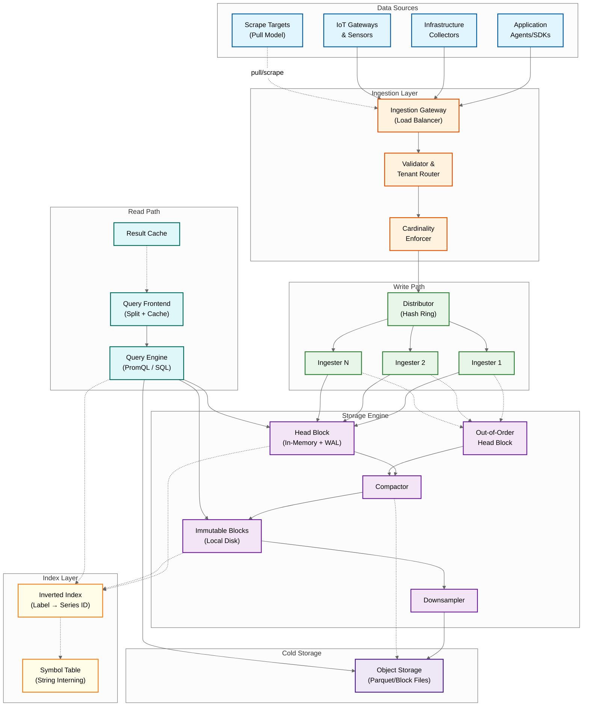
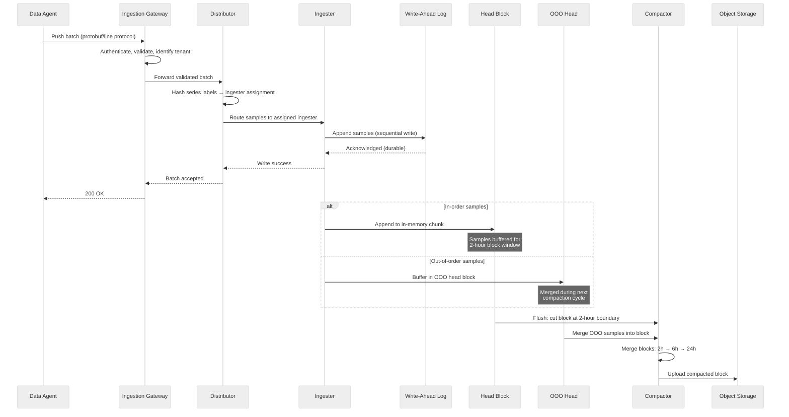
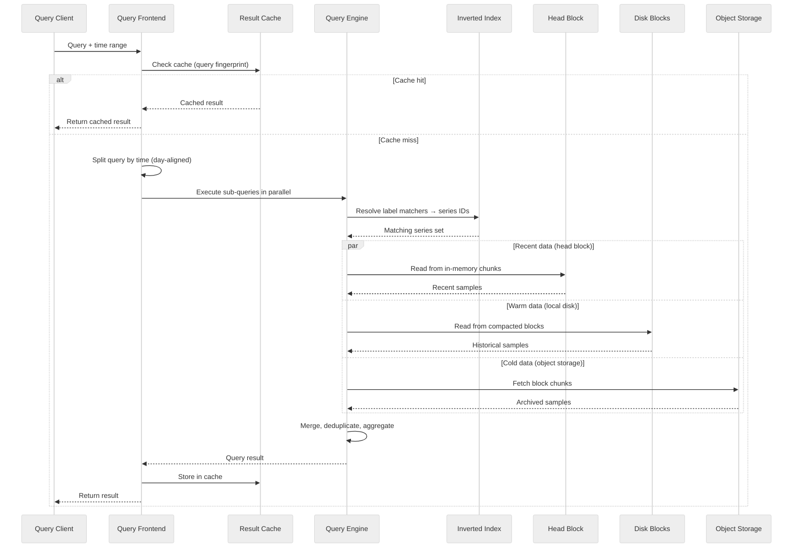
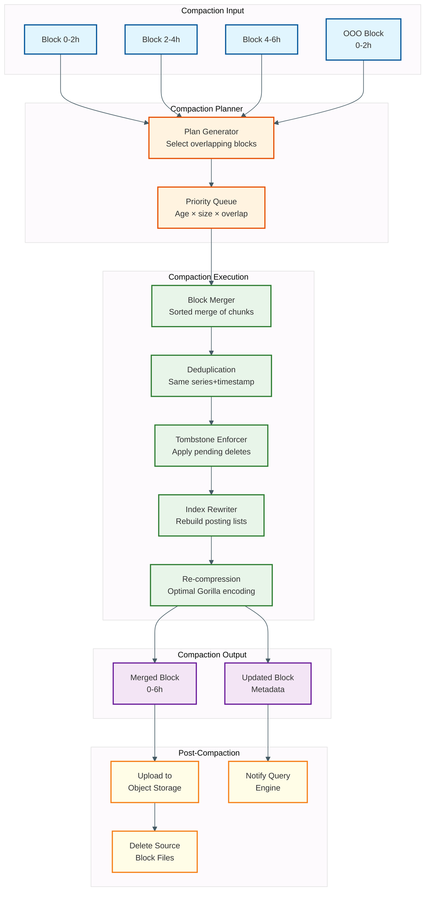
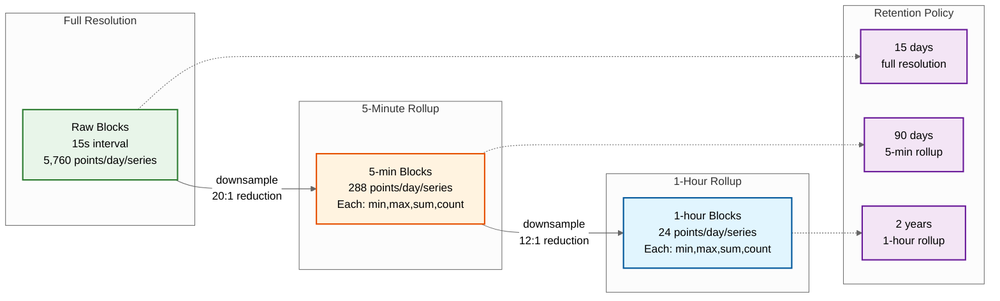
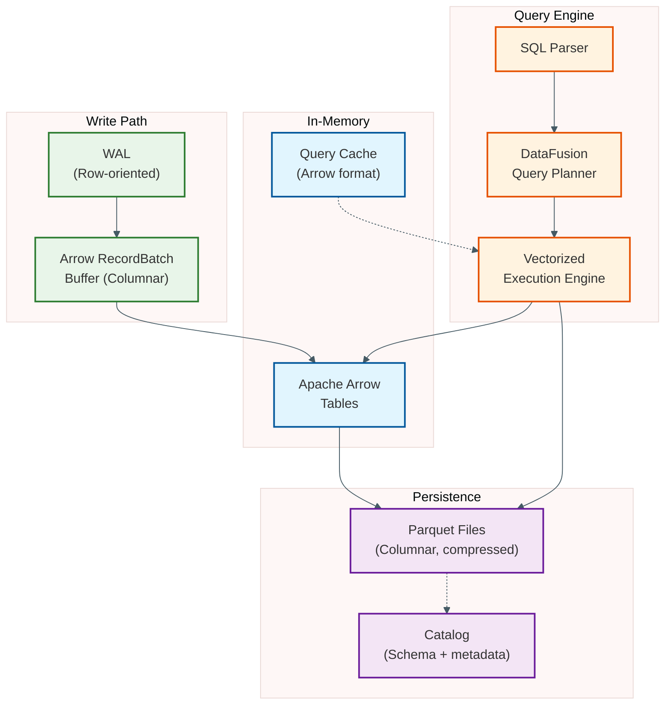

# High-Level Design --- Time-Series Database

## System Architecture



---

## Data Flow: Write Path

The write path is the most throughput-critical flow. It must handle millions of data points per second with sub-millisecond per-batch latency while guaranteeing durability.



### Write Path Components

| Component | Responsibility | Scaling Strategy |
|---|---|---|
| **Ingestion Gateway** | TLS termination, authentication, payload validation, tenant identification, request routing | Stateless horizontal scaling behind load balancer |
| **Distributor** | Consistent hash ring routing: hashes each series' label set to assign ingester ownership; enforces per-tenant rate limits and cardinality caps | Stateless; ring membership via gossip or coordination service |
| **Ingester** | Accepts samples for owned series; appends to WAL for durability; maintains in-memory head block; buffers out-of-order samples; flushes blocks to disk at time boundaries | Stateful (owns series state); horizontal scaling via ring rebalancing; replication factor of 3 |
| **WAL** | Sequential append-only log on local SSD; records every sample before acknowledgment; enables crash recovery via replay | Per-ingester local storage; segment rotation and checkpointing to bound recovery time |
| **Head Block** | In-memory buffer for recent data (last 2 hours); each active series has a Gorilla-compressed chunk; supports efficient recent-data queries | Memory-bound; ~120 bytes overhead per active series |
| **Out-of-Order Head** | Separate in-memory buffer for late-arriving samples within the OOO acceptance window; merged into the main timeline during compaction | Same memory model as head block; bounded by OOO window size |
| **Compactor** | Merges small blocks into larger ones (2h → 6h → 24h); rewrites index; applies tombstones; uploads to object storage | CPU-intensive; runs as separate process; parallelizable across non-overlapping time ranges |
| **Downsampler** | Creates rollup blocks at reduced resolution (5-min, 1-hour) from full-resolution blocks; stores (min, max, sum, count) per interval | Runs after compaction; idempotent; can backfill missed intervals |

---

## Data Flow: Read Path (Query)



### Read Path Optimization Strategies

| Optimization | How It Works | Impact |
|---|---|---|
| **Query splitting** | Frontend splits long time ranges into day-aligned sub-queries; each independently cacheable | Partial cache hits: 6 of 7 days cached means only 1 day computed |
| **Step alignment** | Queries aligned to step boundaries produce identical cache keys across users | Dramatically improves cache hit rate for shared dashboards |
| **Inverted index** | Label matchers resolved to series IDs via posting list intersection; O(n) in matched series | Avoids scanning all series; critical for high-cardinality environments |
| **Chunk Cutting off unnecessary steps** | Each chunk/block carries min/max timestamp; chunks outside query range skipped without decompression | Reduces I/O proportional to time range selectivity |
| **Multi-resolution routing** | Query engine selects appropriate resolution tier (raw, 5-min, 1-hour) based on query time range and step | 30-day query at 1-hour step reads 720 points per series instead of 172,800 |
| **Pre-aggregation (recording rules)** | Expensive queries pre-computed on schedule and stored as new series | Dashboard queries read 1 pre-aggregated series instead of fan-out across thousands |
| **Block-level caching** | Frequently accessed block index headers and chunk data cached in memory | Reduces object storage reads for repeatedly queried time ranges |

---

## Key Architectural Decisions

### Decision 1: Gorilla-Style Chunks vs. Columnar Parquet

| | Gorilla Chunks (Prometheus/VictoriaMetrics) | Columnar Parquet (InfluxDB 3.0/QuestDB) | **Recommendation** |
|---|---|---|---|
| **Compression** | 12x for regular metrics (1.37 bytes/point); degrades for irregular data | 10-20x with dictionary + run-length + delta; more robust across data types | **Hybrid**: Gorilla for hot head block (fast append); Parquet for cold storage (better columnar scan, ecosystem compatibility) |
| **Write performance** | Append to open chunk is O(1) with bit-level encoding | Batch-oriented columnar writes; higher per-write overhead | Gorilla wins for real-time ingestion; Parquet wins for batch loads |
| **Query performance** | Must decompress entire chunk to read any sample; no columnar Cutting off unnecessary steps | Column Cutting off unnecessary steps: read only needed columns; predicate pushdown; vectorized execution | Parquet wins for analytical queries; Gorilla wins for narrow time-range reads |
| **Ecosystem** | Proprietary format; Prometheus-specific tooling | Standard format; interoperable with data lake tools | Parquet enables open data lake integration |

### Decision 2: Monolithic vs. Disaggregated Architecture

| | Monolithic (Prometheus/VictoriaMetrics) | Disaggregated (Mimir/InfluxDB 3.0) | **Recommendation** |
|---|---|---|---|
| **Deployment** | Single process handles ingestion, storage, querying | Separate components: distributor, ingester, compactor, querier, store gateway | **Monolithic** for single-tenant <50M series; **Disaggregated** for multi-tenant or >50M series |
| **Scaling** | Vertical scaling; single-node memory limits cap capacity (~20-50M series) | Independent horizontal scaling per component | Disaggregated enables cost-efficient scaling of write vs. read paths |
| **Operational cost** | Simple deployment; few moving parts; low operational overhead | Requires coordination service, object storage, multiple deployable components | Monolithic for teams without dedicated platform engineers |
| **Failure isolation** | Compaction storm can degrade queries; memory pressure affects everything | Component-level isolation: compaction doesn't affect query latency | Disaggregated isolates failure domains |

### Decision 3: LSM-Tree vs. Custom Block-Based Storage

| | LSM-Tree (VictoriaMetrics/TDengine) | Custom Block-Based (Prometheus TSDB) | **Recommendation** |
|---|---|---|---|
| **Write amplification** | Higher due to level-based compaction; mitigated by time-windowed compaction | Lower; blocks are immutable once flushed; compaction is block merge, not key-level | **Block-based** for pure time-series; LSM for mixed workloads needing updates |
| **Read amplification** | May check multiple levels for a key; bloom filters mitigate | Direct block access via time-range routing; no level scanning | Block-based has simpler read path for time-ordered data |
| **Deletion** | Tombstone-based; space reclaimed on compaction | Block-level deletion: drop entire block file (O(1) for TTL-based retention) | Block-based enables instant retention enforcement |
| **Space amplification** | Temporary during compaction (1.5-2x for leveled) | Minimal; blocks are self-contained and independently compactable | Block-based is more space-predictable |

### Decision 4: Object Storage for Long-Term Retention

| | Local Disk Only | Object Storage Backend | **Recommendation** |
|---|---|---|---|
| **Cost** | ~$0.10/GB/month (SSD) | ~$0.02/GB/month (standard tier) | **Object storage** for blocks older than head block window (2 hours) |
| **Durability** | Dependent on disk redundancy | 99.999999999% (11 nines) built-in | Object storage provides superior durability |
| **Scalability** | Limited by cluster disk capacity | Virtually unlimited | Eliminates storage capacity planning |
| **Query latency** | Sub-millisecond random read | 10-100ms first-byte latency | Mitigated by block index caching and chunk prefetch |

---

## Architecture Pattern Checklist

- [x] **Sync vs Async**: Sync for write acknowledgment (WAL durability); Async for compaction, downsampling, and block upload to object storage
- [x] **Event-driven vs Request-response**: Request-response for ingestion and queries; event-driven for compaction triggers and retention enforcement
- [x] **Push vs Pull**: Hybrid ingestion model; push for most sources, pull for targets exposing metrics endpoints
- [x] **Stateless vs Stateful**: Distributors and query frontends are stateless; Ingesters are stateful (own series in hash ring); Compactors are stateless (operate on block files)
- [x] **Write-heavy optimization**: Append-only WAL, in-memory head block, batch writes, Gorilla compression, no in-place updates
- [x] **Real-time vs Batch**: Real-time for ingestion and recent-data queries; batch for compaction, downsampling, and long-term storage tiering
- [x] **Edge vs Origin**: Agents (edge) perform local pre-aggregation and buffering; TSDB cluster (origin) handles storage and querying

---

## Component Responsibility Matrix

| Component | Primary Responsibility | Secondary Responsibility | Failure Mode | Blast Radius |
|-----------|----------------------|-------------------------|--------------|-------------|
| **Ingestion Gateway** | TLS termination, tenant auth, payload validation | Request routing, batch splitting | Traffic rejected; agents buffer locally | No data loss (agents retry) |
| **Distributor** | Hash ring routing, cardinality enforcement | Rate limiting, replica forwarding | Ingestion stalls; agents see 503 | Partial: affects only tenants routed through failed distributor |
| **Ingester** | WAL append, head block maintenance, OOO buffering | Series creation, block flush | Series data in head block at risk | High: up to replication_factor - 1 ingesters can fail safely |
| **WAL** | Crash recovery, replication source | Ingestion durability guarantee | Data loss for samples since last checkpoint | Critical: WAL failure = potential data loss |
| **Head Block** | In-memory sample buffer for recent data | Fast recent-data query serving | Memory pressure; GC pauses | High: affects both ingestion throughput and query latency |
| **Compactor** | Block merging (2h → 6h → 24h) | Tombstone application, OOO resolution | Block accumulation; slower queries | Low: no data loss; degraded query performance |
| **Downsampler** | Create rollup blocks at reduced resolution | Retention tier migration | Downsampled data unavailable | Low: full-resolution data still queryable |
| **Query Frontend** | Query splitting, result caching, step alignment | Query deduplication, tenant routing | Queries fail; dashboards show errors | Medium: no data loss; user-visible |
| **Query Engine** | Series resolution, chunk scan, aggregation | Multi-source merge (head + disk + object) | Query failures or timeouts | Medium: affects read path only |
| **Inverted Index** | Label → series ID mapping via posting lists | Symbol table management | Queries cannot resolve series | High: entire read path depends on index |

## Technology Stack Considerations

| Layer | Option A | Option B | Trade-off |
|-------|----------|----------|-----------|
| **Ingestion protocol** | Protocol Buffers (remote write) | Line protocol (text-based) | Protobuf: 3-5x more compact, schema-validated; Line: human-readable, easier debugging |
| **Hash ring coordination** | Gossip protocol (memberlist) | Coordination service (etcd/Consul) | Gossip: no SPOF, eventual consistency; Coordination: strong consistency, faster convergence |
| **WAL format** | Custom binary (Prometheus-style) | Embedded LSM engine (RocksDB) | Custom: minimal overhead, purpose-built; LSM: battle-tested, richer features (compression, snapshots) |
| **Chunk compression** | Gorilla (bit-level encoding) | LZ4/Zstd (general-purpose) | Gorilla: 12x for regular data; LZ4: ~4x but robust for all data types |
| **Block index** | Custom inverted index (Prometheus TSDB) | Embedded search library | Custom: minimal dependencies, TSDB-optimized; Library: richer features, more maintenance |
| **Object storage format** | Custom block files | Apache Parquet | Custom: lower write overhead; Parquet: columnar scan, ecosystem interop, predicate pushdown |
| **Query language** | PromQL | SQL with time-series extensions | PromQL: purpose-built for metrics; SQL: familiar, richer joins/subqueries, but heavier parser |
| **In-memory data format** | Custom struct per series | Apache Arrow columnar | Custom: lower per-series overhead; Arrow: SIMD aggregation, zero-copy, ecosystem tools |

---

## Compaction Pipeline Architecture

Compaction is the background process that transforms a stream of small, overlapping blocks into larger, optimized blocks. It directly determines query performance, storage efficiency, and operational stability.



### Compaction Levels and Block Lifecycle

| Level | Time Range | Trigger | Block Count | Purpose |
|-------|-----------|---------|-------------|---------|
| L0 | 2 hours | Head block flush | 1 per ingester per 2h | Initial block from head block cut |
| L1 | 6 hours | 3 adjacent L0 blocks exist | ~3 merged L0 blocks | Reduce block count for recent data |
| L2 | 24 hours | 4 adjacent L1 blocks exist | ~4 merged L1 blocks | Daily blocks for medium-term queries |
| L3 | 7 days | 7 adjacent L2 blocks exist | ~7 merged L2 blocks | Weekly blocks for long-term storage |
| Cold | 7+ days | Retention policy + age threshold | Uploaded L2/L3 blocks | Object storage archival |

### Compaction Planner Algorithm

```
FUNCTION plan_compaction(blocks):
    // Group blocks by overlapping time ranges
    sorted = SORT blocks BY min_time
    groups = []
    current_group = [sorted[0]]

    FOR i = 1 TO LEN(sorted) - 1:
        IF sorted[i].min_time < current_group.last().max_time:
            // Overlapping — must compact together (OOO resolution)
            current_group.APPEND(sorted[i])
        ELSE IF consecutive_same_level(current_group.last(), sorted[i]):
            // Adjacent same-level blocks — merge to next level
            current_group.APPEND(sorted[i])
        ELSE:
            IF LEN(current_group) >= min_compaction_blocks:
                groups.APPEND(current_group)
            current_group = [sorted[i]]

    // Prioritize groups by urgency
    FOR EACH group IN groups:
        group.priority = calculate_priority(group)
        // Priority factors:
        //   - Overlapping blocks (highest: affects query correctness)
        //   - Many small blocks (high: degrades query performance)
        //   - Old uncompacted blocks (medium: delays object storage upload)
        //   - Tombstone-heavy blocks (low: reclaims space)

    RETURN SORT groups BY priority DESC

FUNCTION calculate_priority(group):
    overlap_score = count_overlapping_pairs(group) * 100
    block_count_score = LEN(group) * 10
    age_score = (NOW() - group.oldest_block.creation_time).hours
    tombstone_score = sum(b.tombstone_count FOR b IN group) * 0.1
    RETURN overlap_score + block_count_score + age_score + tombstone_score
```

### Compaction Resource Management

| Resource | Constraint | Management Strategy |
|----------|-----------|---------------------|
| **CPU** | Decompression + re-compression is CPU-bound; 1 core per concurrent compaction | Limit concurrent compactions to `num_cores / 3`; yield CPU to ingesters during high-write periods |
| **Memory** | Each compaction buffers all series from source blocks | Limit max source block total size to available compaction memory budget; spill to disk for oversized merges |
| **Disk I/O** | Read source blocks + write merged block saturates disk bandwidth | Separate compaction I/O from WAL I/O (different volumes); rate-limit compaction writes during peak ingestion |
| **Disk space** | Source + destination blocks coexist during compaction (2x temporary overhead) | Pre-check available space before starting; abort compaction if free space < 2x source size |
| **Object storage API** | Upload rate limits; multipart upload overhead | Batch uploads; use multipart for blocks > 64 MB; exponential backoff on 429 responses |

---

## Head Block Double-Buffer Architecture

The head block uses a double-buffer strategy to avoid blocking ingestion during block flush:

```
FUNCTION head_block_lifecycle():
    active_head = HeadBlock.new(current_time_window)

    LOOP:
        // Accept writes to active head
        sample = receive_sample()

        IF sample.timestamp > active_head.max_time:
            // Time window boundary reached — cut the head
            frozen_head = active_head        // Freeze current head
            active_head = HeadBlock.new(next_time_window)  // New head immediately

            // Flush frozen head in background (non-blocking)
            ASYNC:
                block = frozen_head.serialize_to_block()
                write_block_to_disk(block)
                register_block_in_metadata(block)
                frozen_head.release_memory()

        // Append to active head (never blocked by flush)
        series_ref = active_head.get_or_create_series(sample.labels)
        series_ref.chunk.append(sample.timestamp, sample.value)
```

### Head Block Memory Layout

| Component | Per-Series Overhead | At 25M Series | Notes |
|-----------|-------------------|--------------|-------|
| Series hashmap entry | 48 bytes | 1.2 GB | Hash → series reference lookup |
| Label set (interned) | 16 bytes | 400 MB | Pointer to symbol table entry |
| Chunk header | 24 bytes | 600 MB | Min/max time, sample count, encoding |
| Chunk data (Gorilla) | ~660 bytes | 16.5 GB | 480 samples × 1.37 bytes (2h at 15s) |
| Inverted index entries | 96 bytes | 2.4 GB | Posting list membership |
| **Total** | **~844 bytes** | **~21 GB** | **Per active series in 2-hour window** |

---

## Data Flow: Downsampling Pipeline

Downsampling reduces storage and query cost for aging data by creating lower-resolution rollups that preserve aggregation correctness.



### Why (min, max, sum, count) — Not Just Average

Storing only averages during downsampling is a common mistake that silently corrupts aggregation results:

| Aggregation Function | Reconstructable from (min, max, sum, count)? | If Only Average Stored? |
|---------------------|----------------------------------------------|------------------------|
| `avg()` | Yes: `sum / count` | Yes (but no reweighting possible) |
| `sum()` | Yes: `sum` directly | No — `avg × assumed_count` is wrong if count varies |
| `min()` | Yes: `min` directly | No — average hides actual minimum |
| `max()` | Yes: `max` directly | No — average hides actual maximum |
| `count()` | Yes: `count` directly | No — lost entirely |
| `rate()` | Approximate: `(sum_end - sum_start) / time_delta` | No — rate from averaged counters is meaningless |

### Downsampling Correctness Rule that never changes

```
// The fundamental Rule that never changes: aggregating downsampled data must produce
// the same result as aggregating the original raw data

FOR EACH aggregation_function IN [sum, min, max, avg]:
    FOR EACH query_time_range:
        raw_result = aggregate(raw_data, query_time_range, aggregation_function)
        downsampled_result = aggregate(rollup_data, query_time_range, aggregation_function)

        ASSERT abs(raw_result - downsampled_result) < epsilon
        // Holds exactly for min, max, sum
        // Holds approximately for avg (weighted vs. unweighted)
```

---

## Alternative Architecture: Columnar TSDB (2025 Pattern)

The emerging columnar TSDB architecture (InfluxDB 3.0, QuestDB) decouples the write format from the read format using Apache Arrow as the in-memory representation and Parquet as the on-disk format.



### Gorilla vs. Columnar Architecture Comparison

| Dimension | Gorilla-Based (Traditional) | Columnar Arrow/Parquet (Modern) |
|-----------|---------------------------|-------------------------------|
| **Write format** | Gorilla-encoded chunks (bit-level) | Row-oriented WAL → columnar Arrow batches |
| **Read format** | Same Gorilla chunks (decode to read) | Columnar Parquet with predicate pushdown |
| **In-memory model** | Per-series chunk with append pointer | Arrow RecordBatch (columnar, zero-copy) |
| **Query language** | PromQL (time-series specific) | SQL with time-series extensions |
| **Compression** | 12x for regular metrics | 10-20x with dictionary + RLE + delta |
| **Schema** | Implicit (metric name + labels) | Explicit table schema with typed columns |
| **Ecosystem** | Prometheus/Grafana-specific | Data lake interop (Spark, DuckDB, Polars) |
| **Best for** | Pure monitoring/alerting workloads | Analytical queries, mixed workloads, data lake |

---

## Hash Ring and Series Ownership

In a disaggregated architecture, the distributor uses a consistent hash ring to assign each time series to a specific ingester. This ensures that all samples for a given series land on the same ingester, enabling efficient Gorilla compression.

```
FUNCTION distribute_samples(batch, ring):
    // Group samples by target ingester
    ingester_batches = {}

    FOR EACH sample IN batch:
        // Hash the series identity (metric name + sorted labels)
        series_hash = fnv64a(canonical_label_string(sample.labels))

        // Find owning ingester(s) on the hash ring
        primary = ring.get_owner(series_hash)
        replicas = ring.get_replicas(series_hash, replication_factor=3)

        ingester_batches[primary].APPEND(sample)
        FOR EACH replica IN replicas:
            ingester_batches[replica].APPEND(sample)

    // Send batches in parallel
    results = PARALLEL FOR EACH (ingester, sub_batch) IN ingester_batches:
        RETURN ingester.push(sub_batch)

    // Quorum write: succeed if majority of replicas acknowledge
    FOR EACH series_hash IN unique_hashes(batch):
        acks = count_successes(results, series_hash)
        IF acks < ceil(replication_factor / 2) + 1:
            RETURN ERROR("quorum not met for series", series_hash)

    RETURN SUCCESS
```

### Hash Ring Rebalancing During Scale-Out

| Phase | Action | Duration | Impact |
|-------|--------|----------|--------|
| **Token assignment** | New ingester joins ring with virtual tokens; ownership ranges recalculated | Seconds | No data movement yet |
| **Series handoff** | Existing ingesters flush head blocks for series now owned by new ingester; new ingester begins accepting writes | Minutes | Brief write pause (~2s) for affected series during handoff |
| **Block transfer** | Recent blocks for transferred series copied to new ingester's local storage | Minutes to hours | Parallel background transfer; queries served from old ingester until complete |
| **Stabilization** | Old ingester marks transferred series as read-only; new ingester takes over fully | Seconds | Transparent to clients |
| **Cleanup** | Old ingester deletes transferred blocks after retention period (e.g., 1 hour) | Background | No impact |

---

## Failure Modes and Recovery

| Failure | Detection | Recovery | Data Loss Risk |
|---------|-----------|----------|---------------|
| **Ingester crash** | Heartbeat timeout (10s) | WAL replay on restart; ring redistributes ownership to remaining ingesters; replicas serve reads | Zero (WAL-protected) |
| **Ingester disk full** | Disk usage alert > 90% | Reject new series creation; accelerate compaction; emergency block upload to object storage | Low (backpressure prevents data loss) |
| **Object storage outage** | Upload failure + retry exhaustion | Buffer blocks on local disk; retry uploads with exponential backoff; extend local retention | Zero (local blocks preserved) |
| **Query engine OOM** | Process crash or OOM killer | Auto-restart with reduced query concurrency; add per-query memory limits | None (stateless) |
| **Compactor stuck** | Compaction lag exceeds 4 hours | Manual compaction trigger; identify blocked block; increase compaction concurrency | None (blocks accumulate; queries slow) |
| **Hash ring split** | Gossip protocol detects inconsistent ring views | Quorum-based ring membership; fencing tokens prevent split-brain writes | Low (duplicates resolved at query time) |
| **WAL corruption** | Checksum verification on replay | Skip corrupted segment; accept data loss for that segment; alert on gap | Partial (corrupted WAL segment only) |
| **Network partition** | Cross-AZ heartbeat failures | Each partition operates independently; replication ensures availability; dedup on reconnection | Zero (eventual consistency) |
