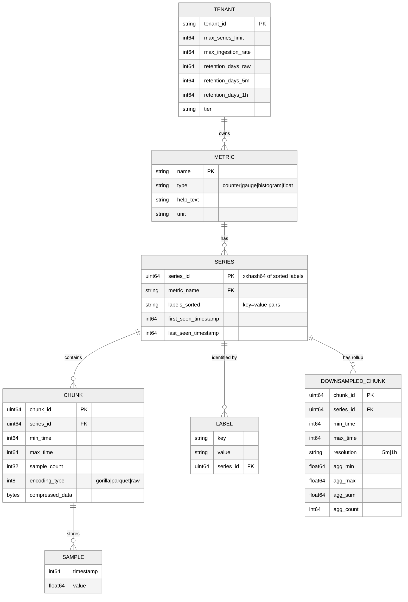

# Low-Level Design --- Time-Series Database

## Data Model

### Time-Series Data Model

A time series is uniquely identified by its **metric name** and a sorted set of **label key-value pairs**. Each series contains an ordered sequence of **(timestamp, value)** data points.

```
Series Identity:
  metric_name{label_1="value_1", label_2="value_2", ..., label_n="value_n"}

Example:
  cpu_usage_percent{host="web-01", region="us-east", env="prod", core="0"}

Data Points:
  [(t1, v1), (t2, v2), (t3, v3), ...]
  where t = int64 Unix timestamp (milliseconds), v = float64 value
```

### Entity Relationship Model



### Series Fingerprinting

Each unique time series requires a stable identifier for indexing and storage routing:

```
FUNCTION compute_series_id(labels):
    sorted_labels = SORT labels BY key ASC
    fingerprint_input = ""
    FOR EACH (key, value) IN sorted_labels:
        fingerprint_input += key + SEPARATOR + value + SEPARATOR
    RETURN xxhash64(fingerprint_input)
```

**Why xxHash64**: Non-cryptographic; 10+ GB/s throughput on modern CPUs; 64-bit output provides collision probability of ~5.4 x 10^-10 for 100M series (negligible). No need for cryptographic collision resistance in an internal identifier.

---

## Inverted Index Design

The inverted index is the most critical data structure for query performance. It maps label matchers to series IDs, enabling sub-second resolution of queries across millions of active series.

### Index Structure

```
Symbol Table (String Interning):
  Maps strings to integer IDs for compact storage.
  "host"    → 1,  "web-01" → 2,  "web-02" → 3
  "region"  → 4,  "us-east" → 5, "eu-west" → 6
  "env"     → 7,  "prod" → 8,    "staging" → 9
  "__name__"→ 10, "cpu_usage_percent" → 11

Posting Lists:
  Maps each (label_name_id, label_value_id) pair to a sorted list of series IDs.
  (1, 2)  → [101, 204, 307]        // host="web-01"
  (1, 3)  → [102, 205, 308]        // host="web-02"
  (4, 5)  → [101, 102, 307, 308]   // region="us-east"
  (10, 11) → [101, 102, 204, 205, 307, 308]  // __name__="cpu_usage_percent"
```

### Query Resolution via Posting List Intersection

```
QUERY: cpu_usage_percent{host="web-01", region="us-east"}

STEP 1: Resolve label matchers to posting lists
  P1 = postings[(__name__, "cpu_usage_percent")]  → [101, 102, 204, 205, 307, 308]
  P2 = postings[(host, "web-01")]                 → [101, 204, 307]
  P3 = postings[(region, "us-east")]              → [101, 102, 307, 308]

STEP 2: Intersect sorted lists (start with smallest)
  Sort by size: P2(3) < P3(4) < P1(6)
  temp = INTERSECT(P2, P3) = [101, 307]
  result = INTERSECT(temp, P1) = [101, 307]

STEP 3: Fetch chunks for series 101 and 307 within query time range

Time Complexity (Speed of the algorithm): O(min(|P1|, |P2|, |P3|)) for sorted list intersection
Space Complexity (Memory usage of the algorithm): O(result_size)
```

### Posting List Compression

For high-cardinality environments, posting lists can contain millions of series IDs. Roaring bitmaps provide significant compression:

```
FUNCTION compress_posting_list(series_ids):
    // Roaring bitmap: hybrid of bitmap and array containers
    // For dense ranges (>4096 IDs in a 65536-ID chunk): use bitmap (8 KB)
    // For sparse ranges: use sorted array (2 bytes per ID)
    bitmap = NEW RoaringBitmap()
    FOR EACH id IN series_ids:
        bitmap.add(id)
    RETURN bitmap

// Intersection of Roaring bitmaps: O(min(n1, n2))
// Union: O(n1 + n2) without decompression
// Memory: ~1 bit per series for dense ranges; ~16 bits for sparse
```

### Regex Matcher Optimization

```
FUNCTION resolve_regex_matcher(label_name, regex):
    matching_values = []
    FOR EACH value IN symbol_table WHERE label_name has value:
        IF regex.matches(value):
            matching_values.append(value)

    result = EMPTY_POSTING_LIST
    FOR EACH value IN matching_values:
        result = UNION(result, postings[(label_name, value)])

    RETURN result

// Optimization: cache compiled regex → posting list results
// For small value sets (status: 5 values), regex is fast
// For high-cardinality labels (pod_name: 50K values), regex scans are expensive
```

---

## Gorilla Compression Algorithm

The compression algorithm is the foundation of TSDB storage efficiency. It exploits two properties of real-world time-series data: regular timestamps and slowly-changing values.

### Delta-of-Delta Encoding (Timestamps)

```
FUNCTION encode_timestamp(t_current, t_previous, delta_previous):
    delta = t_current - t_previous
    delta_of_delta = delta - delta_previous

    IF delta_of_delta == 0:
        WRITE 1 bit: '0'                             // ~96% of cases
    ELSE IF delta_of_delta IN [-63, 64]:
        WRITE bits: '10' + 7-bit signed value          // ~3% of cases
    ELSE IF delta_of_delta IN [-255, 256]:
        WRITE bits: '110' + 9-bit signed value
    ELSE IF delta_of_delta IN [-2047, 2048]:
        WRITE bits: '1110' + 12-bit signed value
    ELSE:
        WRITE bits: '1111' + 32-bit signed value       // <0.01% of cases

    RETURN delta  // becomes delta_previous for next call

// Example: scrape interval = 15000ms
// Timestamps: 1000, 16000, 31000, 46000, 61000
// Deltas:     -,    15000, 15000, 15000, 15000
// DoD:        -,    -,     0,     0,     0
// Encoding:   header, header, '0',  '0',  '0'  ← 1 bit per sample
```

### XOR-based Float Compression (Values)

```
FUNCTION encode_value(v_current, v_previous):
    xor = FLOAT64_BITS(v_current) XOR FLOAT64_BITS(v_previous)

    IF xor == 0:
        WRITE 1 bit: '0'                              // ~51% of cases

    ELSE:
        leading = COUNT_LEADING_ZEROS(xor)
        trailing = COUNT_TRAILING_ZEROS(xor)
        significant = 64 - leading - trailing

        IF leading >= prev_leading AND trailing >= prev_trailing:
            // Reuse previous bit window
            meaningful = 64 - prev_leading - prev_trailing
            WRITE bits: '10' + meaningful bits of xor   // ~30% of cases, avg 26.6 bits
        ELSE:
            // New bit window
            WRITE bits: '11' + 5-bit leading + 6-bit significant_length + significant bits
                                                        // ~19% of cases, avg 36.9 bits

    RETURN (leading, trailing)

// Compression result: average 1.37 bytes per (timestamp, value) pair
// vs. 16 bytes uncompressed = ~12x compression ratio
```

### Chunk Format

```
CHUNK BINARY FORMAT:
┌──────────────────────────────────────────────────────────┐
│ Header (8 bytes)                                         │
│   encoding_type (1 byte): GORILLA=1, HISTOGRAM=2, RAW=3 │
│   sample_count  (2 bytes)                                │
│   min_timestamp  (4 bytes, relative to block base)       │
│   reserved       (1 byte)                                │
├──────────────────────────────────────────────────────────┤
│ First Sample (16 bytes, uncompressed)                    │
│   timestamp: int64 (absolute)                            │
│   value:     float64                                     │
├──────────────────────────────────────────────────────────┤
│ Compressed Samples (variable length, bit-packed)         │
│   delta-of-delta encoded timestamps                      │
│   XOR encoded values                                     │
│   NO byte alignment between samples                      │
├──────────────────────────────────────────────────────────┤
│ Padding to byte boundary                                 │
└──────────────────────────────────────────────────────────┘

Typical sizes:
  120 samples (2 hours @ 60s interval) ≈ 200 bytes  (1.67 bytes/sample)
  480 samples (2 hours @ 15s interval) ≈ 700 bytes  (1.46 bytes/sample)
  7200 samples (24 hours @ 12s interval) ≈ 10 KB    (1.39 bytes/sample)
```

---

## Block Format (On-Disk)

Each immutable block is a self-contained directory covering a fixed time range:

```
BLOCK DIRECTORY LAYOUT:
block-{ulid}/
├── meta.json       # Block metadata
│     {
│       "ulid": "01HXYZ...",
│       "minTime": 1709913600000,
│       "maxTime": 1709920800000,
│       "stats": { "numSeries": 150000, "numSamples": 72000000, "numChunks": 150000 },
│       "compaction": { "level": 1, "sources": ["01HXYA...", "01HXYB..."] },
│       "version": 1
│     }
├── chunks/
│   ├── 000001      # Chunk data file (max 512 MB)
│   └── 000002      # Additional chunk file if first exceeds limit
├── index           # Inverted index + series metadata for this block
│     - Symbol table (interned strings)
│     - Posting lists per (label, value) pair
│     - Series entries: labels + chunk references
└── tombstones      # Deletion markers (series_id, min_time, max_time)
```

---

## Downsampled Block Format

```
DOWNSAMPLED CHUNK FORMAT (per series, per interval):
┌─────────────────────────────────────────┐
│ Interval Start Timestamp (int64)        │
│ min_value   (float64)                   │
│ max_value   (float64)                   │
│ sum_value   (float64)                   │
│ count       (int64)                     │
└─────────────────────────────────────────┘

// 40 bytes per interval per series (uncompressed)
// Gorilla-compressed: ~8-12 bytes per interval (3-5x compression)
//
// Why store all four aggregations:
//   - min: preserves baselines, detects anomalous lows
//   - max: preserves spikes, critical for peak detection
//   - sum: enables rate computation (sum / count = avg, sum / time = rate)
//   - count: enables correct averaging across merge operations
//
// Any single aggregation is lossy in a different way:
//   avg loses spikes, max loses baselines, min loses peaks
```

---

## API Design

### Write API (Push Model)

```
POST /api/v1/write
Content-Type: application/x-protobuf
X-Tenant-ID: {tenant_id}
Authorization: Bearer {api_key}

Request Body (Protocol Buffers):
  WriteRequest {
    repeated TimeSeries timeseries = 1
  }

  TimeSeries {
    repeated Label labels = 1     // [{name: "__name__", value: "cpu_usage"}, ...]
    repeated Sample samples = 2   // [{timestamp_ms: 1709913600000, value: 72.5}, ...]
  }

Response:
  204 No Content       - All samples accepted
  400 Bad Request      - Invalid payload (malformed labels, timestamps in future)
  422 Unprocessable    - Cardinality limit exceeded (new series rejected)
  429 Too Many Requests - Ingestion rate limit exceeded
    Retry-After: {seconds}
    X-RateLimit-Limit: {samples_per_second}
    X-RateLimit-Remaining: {remaining}
  503 Service Unavailable - Ingestion pipeline overloaded
```

### Line Protocol API (Alternative Write Format)

```
POST /api/v1/write/line
Content-Type: text/plain
X-Tenant-ID: {tenant_id}

Request Body:
  cpu_usage,host=web-01,region=us-east value=72.5 1709913600000000000
  memory_used,host=web-01,region=us-east value=8589934592 1709913600000000000

// Format: measurement,tag1=val1,tag2=val2 field1=val1,field2=val2 timestamp_ns
```

### Query API

```
// Instant Query (single timestamp)
GET /api/v1/query?query={expression}&time={timestamp}

// Range Query (time series over interval)
GET /api/v1/query_range
  ?query={expression}
  &start={start_timestamp}
  &end={end_timestamp}
  &step={step_duration}

Example:
  GET /api/v1/query_range
    ?query=avg(rate(cpu_usage{region="us-east"}[5m])) by (host)
    &start=2026-03-10T09:00:00Z
    &end=2026-03-10T10:00:00Z
    &step=15s

Response:
  {
    "status": "success",
    "data": {
      "resultType": "matrix",
      "result": [
        {
          "metric": {"host": "web-01"},
          "values": [
            [1709913600, "0.72"],
            [1709913615, "0.74"],
            [1709913630, "0.71"]
          ]
        }
      ]
    }
  }
```

### Metadata API

```
// List all metric names
GET /api/v1/label/__name__/values

// List label values for a given label name
GET /api/v1/label/{label_name}/values?match[]={series_selector}

// Get series matching a selector
GET /api/v1/series?match[]={series_selector}&start={start}&end={end}

// Cardinality statistics
GET /api/v1/status/cardinality
Response:
  {
    "total_series": 25000000,
    "top_metrics": [
      {"name": "http_requests_total", "series_count": 450000},
      {"name": "container_cpu_usage", "series_count": 380000}
    ],
    "top_labels": [
      {"name": "pod", "unique_values": 12000},
      {"name": "container", "unique_values": 8500}
    ]
  }
```

### Rate Limiting Strategy

| Endpoint | Rate Limit | Scope | Enforcement |
|---|---|---|---|
| `/api/v1/write` | Configurable per tenant (default: 500K samples/s) | Per tenant | Token bucket; 429 with Retry-After |
| `/api/v1/query` | 100 req/s | Per tenant | Sliding window; concurrent limit 20 |
| `/api/v1/query_range` | 50 req/s | Per tenant | Sliding window; concurrent limit 20 |
| `/api/v1/series` | 20 req/s | Per tenant | Fixed window; expensive metadata scan |
| `/api/v1/label/*/values` | 50 req/s | Per tenant | Fixed window |

---

## Partitioning & Sharding Strategy

### Series-Based Sharding (Across Ingesters)

```
FUNCTION assign_ingester(series_labels, ring):
    fingerprint = compute_series_id(series_labels)
    primary = ring.get_node(fingerprint)
    replicas = ring.get_next_n_nodes(fingerprint, REPLICATION_FACTOR - 1)
    RETURN [primary] + replicas

// Ring: consistent hashing with 128 virtual nodes per ingester
// Rebalancing on node join/leave affects ~1/N of series
// Replication factor: 3 (tolerate 2 ingester failures)
```

### Time-Based Partitioning (Storage Blocks)

```
Block compaction levels:
  Level 0: 2-hour blocks (head block flush)
  Level 1: 6-hour blocks (3 x Level 0 merged)
  Level 2: 24-hour blocks (4 x Level 1 merged)
  Level 3: 72-hour blocks (3 x Level 2 merged, optional)

Each block is self-contained and independently queryable.
Blocks at different levels can coexist; the query engine
deduplicates overlapping samples by (series_id, timestamp).
```

### Data Retention Policy

```
FUNCTION apply_retention(block, config):
    age = NOW() - block.max_time

    IF age > config.raw_retention AND resolution(block) == "raw":
        IF NOT EXISTS downsample(block, "5m"):
            CREATE downsample(block, "5m")
        DELETE block

    IF age > config.medium_retention AND resolution(block) == "5m":
        IF NOT EXISTS downsample(block, "1h"):
            CREATE downsample(block, "1h")
        DELETE 5m_block

    IF age > config.long_retention AND resolution(block) == "1h":
        DELETE 1h_block  // data permanently removed

// Default retention tiers:
//   Raw:    15 days   (full 15s resolution)
//   Medium: 90 days   (5-minute aggregated)
//   Long:   13 months (1-hour aggregated)
```

---

## Error Handling and Retry Matrix

| Error Type | Source | Retryable? | Max Retries | Backoff | Action on Exhaustion |
|-----------|--------|-----------|-------------|---------|---------------------|
| WAL write failure | Disk full | No | 0 | — | Reject writes; alert P1; emergency WAL rotation |
| WAL corruption | Disk error | No | 0 | — | Skip corrupted segment; accept data loss for that segment |
| Head block OOM | Cardinality spike | No | 0 | — | Apply emergency cardinality cap; force head block flush |
| Compaction failure | I/O error | Yes | 3 | Exponential (10s → 5min) | Skip block; retry in next compaction cycle |
| Object storage upload | Network/service error | Yes | 5 | Exponential (1s → 60s) | Keep block locally; retry; alert if > 1 hour behind |
| Schema registry lookup | Service unavailable | Yes | 3 | Exponential (100ms → 2s) | Use cached schema; log warning |
| Query timeout | Resource exhaustion | No | 0 | — | Return partial results with timeout indicator |
| Scrape failure (pull) | Target unreachable | Yes | 2 | Fixed (1 scrape interval) | Mark target as down; record `up=0` metric |
| Replication failure | Network partition | Yes | Unlimited | Exponential (100ms → 30s) | Queue WAL segments; replay on reconnection |
| Downsampling failure | Block read error | Yes | 3 | Exponential (1s → 30s) | Skip; retry in next downsampling cycle |

### Dead Letter Processing for Failed Ingestion

```
FUNCTION handle_ingestion_failure(batch, error):
    CASE error.type:
        WHEN "cardinality_cap_exceeded":
            // Log which series were rejected, but don't retry
            FOR EACH sample IN batch.rejected_samples:
                emit_metric("tsdb.ingestion.rejected",
                    metric=sample.metric, tenant=batch.tenant,
                    reason="cardinality_cap")
            // Alert if rejection rate > 1% of ingestion
            IF batch.rejected_count / batch.total_count > 0.01:
                alert("High ingestion rejection rate", batch.tenant)

        WHEN "wal_write_failure":
            // Critical: WAL failure means data loss
            alert("WAL write failure — potential data loss", severity="P1")
            // Buffer in memory temporarily (bounded)
            IF memory_buffer.size < MAX_BUFFER_SIZE:
                memory_buffer.add(batch)
            ELSE:
                drop(batch)  // Accept data loss to prevent OOM

        WHEN "out_of_order_beyond_window":
            // Log OOO samples for debugging clock skew
            emit_metric("tsdb.ingestion.ooo_rejected",
                count=batch.ooo_count, max_age=batch.max_ooo_age)
            // Consider increasing OOO window if this is frequent

        WHEN "rate_limit_exceeded":
            // Return backpressure signal to client
            respond(batch.client, status=429, retry_after=5_seconds)
```

---

## Data Volume Estimation per Entity

| Entity | Record Size | Records/Day | Daily Volume | Storage Strategy |
|--------|-----------|------------|-------------|-----------------|
| Raw metric samples | 1.37 bytes (compressed) | 144B (25M series × 5760 samples) | 197 GB | Head block → compacted blocks |
| 5-min rollup samples | 5.48 bytes (4 aggregations) | 7.2B (25M × 288 intervals) | 39 GB | Separate rollup blocks |
| 1-hr rollup samples | 5.48 bytes (4 aggregations) | 600M (25M × 24 intervals) | 3.3 GB | Object storage cold tier |
| Inverted index entries | ~200 bytes per series | 25M (active series) | 5 GB (in-memory) | In-memory + periodic snapshot |
| WAL segments | ~200 bytes per sample | 144B | ~28.8 TB (uncompressed) | Append-only, rotated after compaction |
| Block metadata | ~500 bytes per block | ~400 blocks/day | 200 KB | Coordination service |
| Exemplars | ~200 bytes per exemplar | 125M (5 per series) | 25 GB | Separate exemplar store |
| Schema/metric metadata | ~1 KB per metric | ~50K unique metrics | 50 MB | In-memory + persistent store |

---

## Algorithm 6: Streaming Aggregation Engine

```
FUNCTION streaming_aggregate(query, matched_series, time_range, step):
    // Instead of materializing all series in memory, aggregate as chunks are decoded
    // This bounds memory to O(groups) instead of O(series)

    aggregation_groups = {}  // keyed by group-by labels

    FOR EACH series_id IN matched_series:
        group_key = extract_group_labels(series_id, query.group_by)

        IF group_key NOT IN aggregation_groups:
            aggregation_groups[group_key] = {
                count: 0, sum: 0.0, min: +INF, max: -INF,
                values_for_quantile: []  // only if quantile() requested
            }

        // Stream through chunks for this series in the time range
        FOR EACH chunk IN get_chunks(series_id, time_range):
            decoded_samples = gorilla_decode(chunk, time_range.start, time_range.end)

            FOR EACH sample IN decoded_samples:
                step_bucket = floor(sample.timestamp / step) * step
                group = aggregation_groups[group_key]

                // Apply aggregation function incrementally
                CASE query.aggregation:
                    WHEN "sum": group.sum += sample.value
                    WHEN "avg": group.sum += sample.value; group.count += 1
                    WHEN "max": group.max = max(group.max, sample.value)
                    WHEN "min": group.min = min(group.min, sample.value)
                    WHEN "count": group.count += 1

    // Finalize aggregations
    results = []
    FOR EACH (group_key, group) IN aggregation_groups:
        CASE query.aggregation:
            WHEN "avg": results.append({labels: group_key, value: group.sum / group.count})
            WHEN "sum": results.append({labels: group_key, value: group.sum})
            WHEN "max": results.append({labels: group_key, value: group.max})
            WHEN "min": results.append({labels: group_key, value: group.min})
            WHEN "count": results.append({labels: group_key, value: group.count})

    RETURN results

// Memory: O(G) where G = number of unique group-by combinations
// vs. O(N) where N = number of matched series (could be 100K+)
// Critical for high-cardinality queries that would otherwise OOM
```

---

## Algorithm 7: Stale Series Detection and Cleanup

```
FUNCTION detect_stale_series(head_block, staleness_threshold):
    // Mark series as stale when they haven't received samples
    // for > staleness_threshold (typically 2-3x scrape interval)

    current_time = NOW()
    stale_series = []

    FOR EACH series IN head_block.active_series:
        last_sample_time = series.last_append_timestamp

        IF (current_time - last_sample_time) > staleness_threshold:
            // Write StaleNaN marker to signal series is gone
            series.append(current_time, STALE_NAN)

            // Close the head chunk (saves memory)
            series.close_current_chunk()

            // Remove from active set (will be excluded from queries)
            head_block.mark_stale(series.id)

            stale_series.append(series.id)

    // Log stale series for operational visibility
    emit_metric("tsdb.series.stale_detected", count=len(stale_series))

    // Index entries remain until blocks age out via retention
    // This prevents "phantom" series in query results

    RETURN stale_series

// Frequency: run every scrape interval (e.g., every 15 seconds)
// Impact: reduces head block memory by evicting dead containers/pods
// At 20% daily churn and 25M series: ~5M stale series/day detected
```

---

## Algorithm 8: Ingester Health Self-Assessment

```
FUNCTION ingester_health_check():
    health = {}

    // Memory health
    head_memory_pct = head_block_memory_bytes / heap_max_bytes * 100
    health["memory"] = {
        status: "healthy" IF head_memory_pct < 60
                ELSE "warning" IF head_memory_pct < 80
                ELSE "critical",
        head_memory_pct: head_memory_pct,
        active_series: active_series_count,
        ooo_buffer_size: ooo_buffer_bytes
    }

    // WAL health
    wal_lag = NOW() - last_wal_checkpoint_time
    health["wal"] = {
        status: "healthy" IF wal_lag < 5 minutes
                ELSE "warning" IF wal_lag < 15 minutes
                ELSE "critical",
        checkpoint_lag_seconds: wal_lag,
        segment_count: wal_segment_count,
        disk_usage_pct: wal_disk_usage_pct
    }

    // Series creation health
    creation_rate = series_created_last_5min / 300  // per second
    health["cardinality"] = {
        status: "healthy" IF creation_rate < 100
                ELSE "warning" IF creation_rate < 1000
                ELSE "critical",
        creation_rate_per_sec: creation_rate,
        total_series: active_series_count,
        headroom_pct: (series_limit - active_series_count) / series_limit * 100
    }

    // Replication health
    replication_lag = max(replica_lag_seconds FOR EACH replica)
    health["replication"] = {
        status: "healthy" IF replication_lag < 5
                ELSE "warning" IF replication_lag < 30
                ELSE "critical",
        max_replica_lag_seconds: replication_lag,
        replicas_healthy: count_healthy_replicas
    }

    overall = "critical" IF ANY(h.status == "critical" FOR h IN health.values())
              ELSE "warning" IF ANY(h.status == "warning" FOR h IN health.values())
              ELSE "healthy"

    RETURN {overall: overall, components: health}
```

---

## Block Compaction Decision Engine

```
FUNCTION plan_compaction(blocks, config):
    // Decide which blocks to compact and in what order

    compaction_plan = []

    // Group blocks by time range
    time_groups = group_blocks_by_time_range(blocks, window=2h)

    FOR EACH (time_range, group_blocks) IN time_groups:
        // Skip if already at maximum compaction level
        IF ALL(b.level >= config.max_compaction_level FOR b IN group_blocks):
            CONTINUE

        // Skip if block is near retention expiry (wasteful compaction)
        IF time_range.max_time < NOW() - config.retention * 0.9:
            CONTINUE

        // Prioritize compaction by urgency
        urgency = calculate_compaction_urgency(group_blocks)
        //   High urgency: many Level 0 blocks (recent, uncompacted)
        //   Medium urgency: OOO blocks needing merge
        //   Low urgency: Level 1 → Level 2 (optimization)

        compaction_plan.append({
            source_blocks: group_blocks,
            target_level: min_level(group_blocks) + 1,
            urgency: urgency,
            estimated_duration: estimate_compaction_time(group_blocks),
            estimated_output_size: estimate_output_size(group_blocks)
        })

    // Sort by urgency (highest first)
    compaction_plan.sort(BY urgency DESC)

    // Apply concurrency limits
    RETURN compaction_plan[:config.max_concurrent_compactions]

FUNCTION calculate_compaction_urgency(blocks):
    level_0_count = COUNT(b FOR b IN blocks IF b.level == 0)
    has_ooo = ANY(b.has_ooo_data FOR b IN blocks)
    has_tombstones = ANY(b.tombstone_count > 0 FOR b IN blocks)

    IF level_0_count > 5:
        RETURN "critical"  // Too many uncompacted blocks; queries degrading
    ELIF has_ooo:
        RETURN "high"      // OOO data needs resolution
    ELIF has_tombstones:
        RETURN "high"      // Tombstones need application (GDPR compliance)
    ELIF level_0_count > 2:
        RETURN "medium"    // Normal compaction cycle
    ELSE:
        RETURN "low"       // Optimization compaction
```
