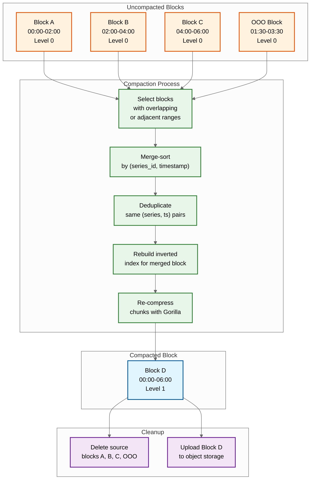

# Deep Dives & Bottlenecks --- Time-Series Database

## Critical Component 1: The Compaction Pipeline

### Why This Is Critical

Compaction is the background process that transforms many small, overlapping blocks into fewer, larger, optimally-organized blocks. Without compaction, the TSDB accumulates thousands of 2-hour block files per month, causing query performance to degrade linearly with retention duration (each query must open and scan more files). Compaction also merges out-of-order samples into the correct timeline, applies tombstone-based deletions, rewrites the inverted index for optimal read performance, and uploads merged blocks to object storage for long-term retention.

### How It Works Internally



### Compaction Algorithm

```
FUNCTION compact(blocks):
    // Phase 1: Select compaction group
    groups = plan_compaction(blocks)
    // Group overlapping time ranges; merge Level 0 blocks into Level 1
    // Group 3 Level 1 blocks (18h) into Level 2
    // Never compact across levels

    FOR EACH group IN groups:
        // Phase 2: Open all source blocks
        readers = [open_block_reader(b) FOR b IN group.blocks]
        merged_block = create_new_block(
            min_time = MIN(b.min_time FOR b IN group.blocks),
            max_time = MAX(b.max_time FOR b IN group.blocks),
            level = group.target_level
        )

        // Phase 3: Merge-sort all series across source blocks
        series_iterator = create_merge_iterator(readers)
        WHILE series_iterator.has_next():
            series_id, chunks = series_iterator.next()

            // Phase 4: Merge chunks, deduplicate, re-compress
            samples = merge_and_deduplicate(chunks)
            // Dedup: if two samples have same (series_id, timestamp),
            // keep the one from the higher-level source block

            // Apply tombstones
            samples = apply_tombstones(samples, tombstones[series_id])

            new_chunk = gorilla_compress(samples)
            merged_block.write_chunk(series_id, new_chunk)

        // Phase 5: Write index for merged block
        merged_block.write_index()

        // Phase 6: Atomic swap
        // Register new block in metadata BEFORE deleting sources
        register_block(merged_block)
        FOR EACH b IN group.blocks:
            mark_for_deletion(b)

    // Phase 7: Garbage collection (deferred)
    // Delete source blocks after confirming no active queries reference them
```

### Failure Modes and Mitigations

| Failure Mode | Impact | Mitigation |
|---|---|---|
| **Compaction storm** | CPU/IO saturation during catch-up compaction after downtime; queries slow | Rate-limit compaction concurrency; prioritize recent blocks; defer old-block compaction |
| **Disk space exhaustion during compaction** | Compaction needs temporary space for merged block before deleting sources (~2x space) | Monitor disk headroom; abort compaction if free space < threshold; object storage offloading reduces local disk pressure |
| **Crash during compaction** | Partially written merged block | Source blocks are only deleted after merged block is fully registered; restart re-reads source blocks; idempotent operation |
| **Overlapping block metadata** | Query returns duplicate data | Query engine deduplicates by (series_id, timestamp); compaction resolves overlap permanently |

---

## Critical Component 2: Out-of-Order Ingestion

### Why This Is Critical

Traditional TSDBs like early Prometheus rejected out-of-order samples---any sample with a timestamp older than the most recent sample for that series was dropped. This works for pull-based monitoring with a single scraper, but fails for push-based architectures where distributed agents have clock skew, network delays cause batches to arrive out of order, or late-arriving aggregations from edge collectors need to backfill recent gaps.

### How It Works Internally

```
FUNCTION ingest_sample(series_id, timestamp, value):
    head = get_head_block(series_id)

    IF timestamp >= head.max_timestamp:
        // In-order: append to main head chunk (fast path)
        head.append(timestamp, value)
        wal.append(series_id, timestamp, value)

    ELSE IF timestamp >= NOW() - OOO_WINDOW:
        // Out-of-order but within acceptance window
        ooo_head = get_ooo_head_block(series_id)
        ooo_head.insert(timestamp, value)
        wal.append_ooo(series_id, timestamp, value)
        ooo_metrics.increment("ooo_samples_total")

    ELSE:
        // Too old: reject
        REJECT("sample too old: timestamp outside OOO window")
        ooo_metrics.increment("ooo_rejected_total")

// OOO head block uses a different data structure:
// Instead of a single append-only chunk per series,
// it maintains a sorted tree of (timestamp, value) pairs
// that allows insertion at arbitrary positions.
// These are merged into the main timeline during compaction.
```

### OOO Memory Model

```
Main Head Block (in-order):
  Series 101: [t1=100, t2=115, t3=130, t4=145]  ← append-only, Gorilla-compressed
  Series 102: [t1=100, t2=115, t3=130]           ← append-only

OOO Head Block (out-of-order):
  Series 101: {t=110: v=42.3, t=125: v=43.1}    ← sorted tree, not compressed
  Series 102: {}                                  ← no OOO samples

After compaction merge:
  Series 101: [t1=100, t=110, t2=115, t=125, t3=130, t4=145]
  // Sorted, deduplicated, Gorilla-compressed in new block
```

### Failure Modes and Mitigations

| Failure Mode | Impact | Mitigation |
|---|---|---|
| **OOO window too small** | Legitimate late samples rejected; data gaps | Configure window based on worst-case agent delay (5-60 minutes); monitor rejection rate |
| **OOO window too large** | Excessive memory for OOO sorted trees; slow compaction merge | Bound OOO memory per series; shed oldest OOO samples under memory pressure |
| **Clock skew between agents** | Samples appear out-of-order even when sent in-order | NTP synchronization; server-side timestamp assignment option; relax OOO window |
| **OOO flood** | Memory exhaustion if many series suddenly send old data | Per-series OOO sample limit; circuit breaker on OOO ingestion rate |

---

## Critical Component 3: The Inverted Index Under Cardinality Pressure

### Why This Is Critical

The inverted index must fit in memory for acceptable query latency. At 25M active series with 8 labels each, the index consumes ~20 GB of RAM. A single developer adding an unbounded label (like `user_id` or `request_id`) to a popular metric can multiply series count by 10,000x in hours, causing OOM kills, query timeouts, and ingestion failures. Cardinality is the single most dangerous scaling threat to a TSDB.

### How Cardinality Explodes

```
Normal metric:
  http_requests_total{method="GET", endpoint="/api", status="200", region="us-east"}
  Labels: 4 dimensions, ~20 unique values each → 20^4 = 160,000 max series

Cardinality explosion (developer adds user_id):
  http_requests_total{method="GET", endpoint="/api", status="200", region="us-east", user_id="abc123"}
  Labels: 5 dimensions, user_id has 1M unique values → 160,000 x 1,000,000 = 160 BILLION max series
  // In practice, not all combinations exist, but even 1% = 1.6 BILLION series

Memory impact of 1.6B series:
  Index: 1.6B x 200 bytes ≈ 320 GB (exceeds any single node)
  Head block: 1.6B x 120 bytes ≈ 192 GB
  Total: 512+ GB → system OOM
```

### Cardinality Enforcement Pipeline

```
FUNCTION enforce_cardinality(tenant_id, series_labels):
    series_id = compute_series_id(series_labels)

    // Check 1: Is this an existing series? (fast path)
    IF series_exists(series_id):
        RETURN ACCEPT

    // Check 2: Per-tenant active series count
    tenant_series_count = get_tenant_series_count(tenant_id)
    IF tenant_series_count >= tenant_config.max_series:
        RETURN REJECT("tenant series limit exceeded")

    // Check 3: Per-metric cardinality
    metric_name = series_labels["__name__"]
    metric_series_count = get_metric_series_count(tenant_id, metric_name)
    IF metric_series_count >= tenant_config.max_series_per_metric:
        RETURN REJECT("metric cardinality limit exceeded")

    // Check 4: Series creation rate
    creation_rate = get_series_creation_rate(tenant_id, LAST_MINUTE)
    IF creation_rate >= tenant_config.max_series_creation_rate:
        RETURN REJECT("series creation rate limit exceeded")

    // Check 5: Label value cardinality check
    FOR EACH (key, value) IN series_labels:
        label_cardinality = get_label_value_count(tenant_id, key)
        IF label_cardinality >= tenant_config.max_label_values:
            RETURN REJECT("label " + key + " cardinality limit exceeded")

    RETURN ACCEPT
```

---

## Concurrency & Race Conditions

### Race Condition 1: Head Block Flush During Active Writes

```
Problem:
  Ingester receives writes to head block while compactor is flushing it to disk.

  Thread A (Writer): append sample to series 101 in head block
  Thread B (Flusher): iterate all series in head block to create disk block

  Risk: Writer sees a partially-flushed head block, or flusher misses samples
         written during the flush.

Solution: Double-buffering with atomic swap
  1. Flusher creates a NEW empty head block (head_new)
  2. Atomic pointer swap: head_current → head_new
  3. All new writes go to head_new immediately
  4. Flusher reads the OLD head block (no concurrent writes) at leisure
  5. Old head block converted to immutable disk block
  6. No locks on the write path; swap is a single atomic pointer update
```

### Race Condition 2: Concurrent Compaction on Overlapping Blocks

```
Problem:
  Two compaction workers select overlapping sets of source blocks.
  Both produce merged blocks covering the same time range.

Solution: Lease-based compaction ownership
  1. Compaction planner assigns non-overlapping block groups
  2. Each compaction job acquires a lease (block IDs → worker mapping)
  3. Lease stored in coordination service with TTL
  4. If worker crashes, lease expires and another worker can retry
  5. Block registration is idempotent: duplicate registration detected by ULID
```

### Race Condition 3: Query During Block Replacement

```
Problem:
  Query starts reading Block A. Compaction replaces Block A with Block B
  (merged from A + C). Block A is deleted while query is still reading.

Solution: Reference counting with deferred deletion
  1. Each block has a reference count
  2. Query increments ref count before reading; decrements after
  3. Compaction marks blocks for deletion but waits until ref count = 0
  4. Blocks with ref count > 0 are retained until all readers finish
  5. Timeout: if ref count doesn't reach 0 within N minutes, force cleanup
     (query will fail with "block not found" and retry against new block)
```

---

## Slowest part of the process Analysis

### Slowest part of the process 1: Memory Pressure from Head Block

| Aspect | Details |
|---|---|
| **Root cause** | Each active series consumes ~120 bytes in the head block (chunk header, append buffer, hash map entry). At 25M series, that's 3 GB just for overhead, plus chunk data (~15 GB for 2 hours of samples) |
| **Symptom** | Increasing garbage collection pauses; OOM kills during cardinality spikes; write latency spikes as memory allocator contends |
| **Mitigation** | (1) Reduce head block window from 2 hours to 1 hour (halves memory); (2) Use memory-mapped chunks that can be paged out; (3) Cardinality enforcement prevents unbounded growth; (4) Series that haven't received samples for >2x scrape interval are marked stale and their head chunk is closed |

### Slowest part of the process 2: Compaction I/O Contention

| Aspect | Details |
|---|---|
| **Root cause** | Compaction reads all source blocks, decompresses, merge-sorts, recompresses, and writes a new block. For large blocks (24 hours of data across 25M series), this can consume 100+ GB of I/O bandwidth |
| **Symptom** | Query latency spikes during compaction; disk I/O saturation alerts; compaction falling behind (growing block count) |
| **Mitigation** | (1) Rate-limit compaction I/O via cgroup or ionice; (2) Run compaction on dedicated nodes (disaggregated architecture); (3) Prioritize compaction of recent blocks (most queried); (4) Skip compaction for blocks that are about to age out of retention |

### Slowest part of the process 3: Query Fan-Out Across High-Cardinality Series

| Aspect | Details |
|---|---|
| **Root cause** | A query like `sum(rate(http_requests_total[5m])) by (service)` may match 100K series. The query engine must decompress chunks for all 100K series, compute rate for each, then aggregate by service label |
| **Symptom** | Query timeout (>30s); excessive memory allocation for intermediate results; query engine OOM |
| **Mitigation** | (1) Recording rules pre-compute high-fan-out aggregations; (2) Per-query memory limit with early termination; (3) Per-query series limit (e.g., max 500K series per query); (4) Streaming aggregation: aggregate as chunks are decompressed instead of materializing all series in memory |

### Slowest part of the process 4: WAL Replay After Crash

| Aspect | Details |
|---|---|
| **Root cause** | After an ingester crash, the WAL must be replayed to reconstruct the in-memory head block. A 2-hour head block at 1.67M samples/sec accumulates ~12B WAL entries (~190 GB). Full replay takes 3-5 minutes. |
| **Symptom** | Ingester unavailable during replay; write backpressure on upstream load balancer; monitoring gap during recovery |
| **Mitigation** | (1) WAL checkpointing: periodic snapshot of head block state reduces replay to delta-only (10-30 seconds); (2) Parallel WAL replay across CPU cores; (3) Shorter head block window (1 hour instead of 2); (4) Replication: other replicas serve queries and accept writes during recovery |

### Slowest part of the process 5: Index Rebuild During Scale-Out

| Aspect | Details |
|---|---|
| **Root cause** | When resharding series across ingesters (adding capacity), the inverted index for transferred series must be rebuilt on the new ingester. At 25M series with 8 labels each, full index construction takes 5-15 minutes. |
| **Symptom** | Elevated query latency during resharding; temporary inconsistency in label lookups; increased memory allocation as index populates |
| **Mitigation** | (1) Incremental resharding: transfer 5-10% of series at a time; (2) Index pre-warming: build index from block metadata before activating ingestion; (3) Consistent hashing with virtual nodes to minimize series movement during scale events |

---

## Deep Dive 5: Cardinality Enforcement Pipeline

### The Problem

Unbounded cardinality is the #1 operational risk in production TSDBs. A single deployment adding `request_id` as a label can create billions of series overnight, exhausting index memory and crashing ingesters. The enforcement pipeline must prevent this without rejecting legitimate metric growth.

### Multi-Stage Enforcement Architecture

```
FUNCTION enforce_cardinality(sample, tenant):
    series_key = compute_series_key(sample.metric, sample.labels)

    // Stage 1: Check per-metric cardinality cap
    metric_series_count = get_active_series_count(tenant, sample.metric)
    IF metric_series_count >= tenant.per_metric_cap:
        IF NOT is_existing_series(series_key):
            reject(sample, "per_metric_cap_exceeded")
            increment_metric("tsdb.cardinality.rejected", reason="per_metric_cap")
            RETURN

    // Stage 2: Check per-tenant total series cap
    tenant_series_count = get_total_active_series(tenant)
    IF tenant_series_count >= tenant.total_series_cap:
        IF NOT is_existing_series(series_key):
            reject(sample, "tenant_series_cap_exceeded")
            RETURN

    // Stage 3: Check series creation rate (anti-burst)
    creation_rate = get_series_creation_rate(tenant, window=1_minute)
    IF creation_rate > tenant.max_creation_rate_per_minute:
        reject(sample, "creation_rate_exceeded")
        RETURN

    // Stage 4: Check for known-bad label patterns
    FOR EACH label IN sample.labels:
        IF label.key IN ["request_id", "trace_id", "session_id", "uuid"]:
            reject(sample, "unbounded_label_detected: {label.key}")
            alert("Unbounded label detected", tenant, sample.metric, label.key)
            RETURN

    // All checks passed — accept and ingest
    accept(sample)
```

### Cardinality Analysis Dashboard

| Metric | Purpose | Alert Threshold |
|--------|---------|----------------|
| `tsdb.active_series` per tenant | Track total series count | > 80% of tenant cap |
| `tsdb.series_creation_rate` | Detect cardinality explosions | > 1000 new series/min sustained 5 min |
| `tsdb.series_churn_rate` | Detect high label churn (container restarts) | > 20% of active series created in last hour |
| `tsdb.compression_ratio` per metric | Detect irregular/high-entropy labels | < 4x (expected > 10x for regular metrics) |
| `tsdb.label_value_count` per label name | Find labels approaching unbounded growth | > 10K unique values for any single label |

---

## Deep Dive 6: Multi-Resolution Query Engine

### The Problem

A user querying 90 days of data at 1-hour resolution should read from the 1-hour downsampled tier, not the raw tier. But the boundary between tiers is not always clean: the most recent 15 days may be raw, the next 75 days downsampled. The query engine must seamlessly stitch data from different resolution tiers.

### Resolution Selection Algorithm

```
FUNCTION select_resolution_tier(query_start, query_end, query_step):
    // Determine which resolution tier to query for each time segment

    tiers = get_retention_tiers()
    // Example: [{name: "raw", max_age: 15d, resolution: 15s},
    //           {name: "5min", max_age: 90d, resolution: 300s},
    //           {name: "1hr", max_age: 365d, resolution: 3600s}]

    segments = []
    current = query_start

    WHILE current < query_end:
        age = now() - current
        // Select the lowest-resolution tier that covers this time range
        // AND has resolution <= query_step (don't upsample)
        eligible_tiers = [t for t in tiers
                         if age <= t.max_age AND t.resolution <= query_step]

        IF eligible_tiers is empty:
            // Data has aged out of all tiers
            break

        // Prefer the coarsest resolution that still meets the query step
        selected = max(eligible_tiers, key=lambda t: t.resolution)

        // Determine how far this tier extends
        tier_end = min(query_end, now() - tiers_finer_than(selected).max_age)
        segments.append({tier: selected, start: current, end: tier_end})
        current = tier_end

    RETURN segments

// Example: 90-day query at 1-hour step
// Segment 1: [0-15d ago] → raw tier (15s resolution, query at 1hr step)
// Segment 2: [15-90d ago] → 5min tier (300s resolution, query at 1hr step)
// If query_step were 30s, segment 2 would use raw tier for [0-15d] only
```

### Aggregation Correctness Across Tiers

| Aggregation | Raw Tier | Downsampled Tier | Stitch Strategy |
|-------------|----------|-----------------|-----------------|
| `avg()` | avg(values) | sum/count from rollup | Correct: avg = total_sum / total_count |
| `max()` | max(values) | max from rollup | Correct: max of maxes |
| `min()` | min(values) | min from rollup | Correct: min of mins |
| `sum()` | sum(values) | sum from rollup | Correct: sum of sums |
| `count()` | count(values) | count from rollup | Correct: sum of counts |
| `quantile()` | exact from raw values | **Not possible** from rollup | Approximation only: use histogram buckets or t-digest |

### The "Average of Averages" Problem

Downsampled `avg` cannot be naively stitched: averaging the averages of unequal-sized intervals produces incorrect results. The correct approach stores `(sum, count)` per downsampled interval and computes avg = total_sum / total_count at query time.

```
// WRONG: average of 5-minute averages
avg([avg(t0-t5), avg(t5-t10), avg(t10-t15)]) ≠ avg(all points from t0-t15)
// Because intervals may have different counts

// CORRECT: sum/count from rollup
total_sum = sum([rollup.sum for each interval])
total_count = sum([rollup.count for each interval])
correct_avg = total_sum / total_count
```

---

## Deep Dive 7: Exemplar Storage and High-Cardinality Trace Integration

### The Problem

Monitoring metrics alone can't pinpoint the root cause of a latency spike. Exemplars — individual trace IDs associated with specific metric samples — bridge the gap between metrics and traces. But storing exemplars within the TSDB is challenging because trace IDs are high-cardinality, which normally triggers cardinality enforcement.

### Design

| Component | Implementation |
|-----------|---------------|
| Storage | Separate exemplar store per series (not in the main chunk, which would destroy compression) |
| Capacity | 1-10 exemplars per series per window (not every sample gets an exemplar) |
| Selection | Probabilistic: sample exemplars biased toward extreme values (high latency, error responses) |
| Index | Exemplars indexed by series ID + time range; no label-based index (would create cardinality) |
| Query | Return exemplars alongside aggregated metric values; trace ID links to external trace store |

### Exemplar Selection Algorithm

```
FUNCTION select_exemplar(sample, current_exemplars, window):
    // Decide whether this sample should be stored as an exemplar

    IF len(current_exemplars) < MIN_EXEMPLARS_PER_WINDOW:
        // Always keep at least MIN exemplars per window
        RETURN STORE

    // Bias toward outliers: more likely to store extreme values
    IF sample.value > percentile(current_exemplars.values, 95):
        RETURN STORE  // High-value outlier — useful for debugging
    IF sample.value < percentile(current_exemplars.values, 5):
        RETURN STORE  // Low-value outlier

    // Probabilistic: 1% chance for normal values
    IF random() < 0.01:
        // Evict oldest exemplar if at capacity
        IF len(current_exemplars) >= MAX_EXEMPLARS_PER_WINDOW:
            evict_oldest(current_exemplars)
        RETURN STORE

    RETURN SKIP

// Memory: ~200 bytes per exemplar (trace ID + timestamp + value + labels)
// At 25M series with 5 exemplars each: ~25 GB additional memory
// Trade-off: exemplar density vs. memory cost
```

---

## Deep Dive 8: Recording Rules as Materialized Views

### The Problem

Dashboard panels that aggregate across thousands of series execute the same expensive query every refresh interval (10-30 seconds). Without pre-computation, query load scales with (number of dashboards × refresh rate × series per query).

### Recording Rule Engine

```
FUNCTION evaluate_recording_rules(rules, evaluation_interval):
    WHILE running:
        evaluation_start = now()

        FOR EACH rule IN rules:
            // Execute the PromQL/SQL expression
            result = query_engine.execute(
                expression = rule.expression,
                time = now(),
                timeout = rule.timeout  // typically 10s
            )

            IF result.is_error:
                increment_metric("tsdb.recording_rule.failures", rule=rule.name)
                continue

            // Write the result as a new time series
            FOR EACH series IN result.series:
                output_labels = merge(rule.output_labels, series.labels)
                output_series = create_series(rule.output_metric, output_labels)
                ingest(output_series, timestamp=now(), value=series.value)

            // Track evaluation performance
            emit_metric("tsdb.recording_rule.duration_seconds",
                       duration=now()-evaluation_start, rule=rule.name)

        sleep_until(evaluation_start + evaluation_interval)
```

### Recording Rule Impact Analysis

| Metric | Without Recording Rules | With Recording Rules |
|--------|------------------------|---------------------|
| Dashboard load time | 2-8 seconds (real-time aggregation) | 50-200 ms (pre-computed lookup) |
| Query fan-out | 10K-100K series per query | 1 series per query |
| Query engine CPU | High (proportional to series count) | Minimal (point lookup) |
| Storage overhead | None | ~5-20% additional series |
| Staleness | Real-time | Up to 1 evaluation interval (15s-60s) |
| Maintenance | None | Rule definitions must be maintained |

---

## Critical Component 9: Edge Cases

### Edge Case (Unusual or extreme situation) 1: Counter Reset Detection Across Block Boundaries

A counter (monotonically increasing value) resets to 0 when a process restarts. If the reset occurs at the boundary between two compacted blocks, the query engine may interpret the reset as a massive negative delta or miss the reset entirely because the pre-reset and post-reset values are in different blocks.

**Mitigation:** The `rate()` function checks for counter resets across chunk and block boundaries. If `value[i] < value[i-1]`, the engine assumes a reset occurred and adds `value[i-1]` to the accumulated total. This logic works across block boundaries by maintaining the last-seen value from the previous block's final chunk.

### Edge Case (Unusual or extreme situation) 2: Stale Series Detection and Cleanup

When a container terminates, its metrics stop arriving. Without explicit cleanup, the series persists in the head block and inverted index indefinitely, consuming memory and appearing in query results with no data.

**Mitigation:** Series that haven't received a sample for >5 minutes (2-3x the scrape interval) are marked as "stale" with a sentinel value (`StaleNaN`). Stale series are excluded from query results. Their head block memory is reclaimed. Index entries remain until the series ages out of all blocks via retention.

### Edge Case (Unusual or extreme situation) 3: Histogram Bucket Cardinality Explosion

A histogram metric with 20 buckets generates 22 series per unique label combination (20 buckets + sum + count). A metric with 5 label dimensions × 10 values each creates 100K combinations × 22 = 2.2M series from a single histogram.

**Mitigation:** Native histograms (Prometheus 2.40+) store the entire distribution in a single series using exponential bucketing — a 22x cardinality reduction. The trade-off is a more complex storage format and slightly less bucket flexibility.

### Edge Case (Unusual or extreme situation) 4: NaN and Infinity in Float Values

IEEE 754 special values (NaN, +Inf, -Inf) must be handled correctly throughout the pipeline. NaN samples must not be silently dropped or treated as zero. Infinity values must propagate through aggregation correctly.

**Mitigation:** Store NaN and Inf as their IEEE 754 bit patterns. XOR compression handles them naturally (they produce specific bit patterns). Aggregation functions define behavior: `sum(NaN, 5) = NaN`, `max(NaN, 5) = 5` (NaN is excluded from comparisons). Query results explicitly show NaN rather than omitting the data point.

### Edge Case (Unusual or extreme situation) 5: Clock Skew Between Pull and Push Sources

When both pull-based scraping and push-based agents feed the same TSDB, the server clock (used for pull timestamps) and agent clocks (used for push timestamps) may diverge by seconds to minutes. This causes the same logical time range to contain data at different real-world times, making cross-source correlation unreliable.

**Mitigation:** For pull-based metrics, the TSDB server timestamps samples at scrape time (server clock is canonical). For push-based metrics, the agent provides timestamps but the TSDB validates them: reject samples with timestamps more than `max_clock_skew` (e.g., 5 minutes) in the future; accept late samples within the OOO window. Log clock skew magnitude per agent for operational visibility.

### Edge Case (Unusual or extreme situation) 6: Compaction During Ingestion Spike

A sustained ingestion spike (e.g., 3x normal rate during a load test) generates head blocks faster than compaction can process them. Block count grows, query latency degrades, and disk usage accelerates. If the compaction backlog persists, the operator faces a choice: throttle ingestion or accept degraded query performance.

**Mitigation:** Prioritize Level 0 → Level 1 compaction (recent data compaction) over Level 1 → Level 2 (historical optimization). Set up auto-scaling for compaction workers triggered by pending job count. During extreme spikes, skip compaction for blocks near retention expiry — they will be deleted before compaction would have finished anyway.

---

## Real-World Case Studies

### Case Study 1: Prometheus TSDB Evolution

Prometheus TSDB evolved from a simple per-series file-based storage (v1) to a block-based storage engine (v2) to address fundamental scaling limitations:

| Generation | Architecture | Limitation Addressed |
|-----------|-------------|---------------------|
| V1 (pre-2017) | One file per series; LevelDB for index | At 1M series, opening 1M file descriptors; inode exhaustion; catastrophic GC pauses |
| V2 (2017+) | Block-based with inverted index; Gorilla compression | Reduced file count from O(series) to O(blocks); 12x compression; O(1) retention deletion |
| V2 + OOO (2022+) | Added out-of-order head block | Enabled push-based ingestion without data loss; critical for OpenTelemetry adoption |

**Key lesson:** The transition from per-series files to time-partitioned blocks was the single most impactful architectural change — it converted the storage engine from file-descriptor-bound to memory-bound, changing the scaling axis entirely.

### Case Study 2: VictoriaMetrics — Compression-First Architecture

VictoriaMetrics achieves higher compression than Prometheus (1.0 bytes/point vs. 1.37) by using a different encoding strategy: LZ4 compression on top of delta encoding, with per-series deduplication at query time rather than at write time. This trades slightly higher query CPU (deduplication cost) for better storage efficiency.

**Key lesson:** Compression algorithm choice creates second-order effects. Better compression → less storage → less I/O → faster queries. VictoriaMetrics demonstrates that investing in compression yields returns across the entire system, not just storage cost.

### Case Study 3: InfluxDB 3.0 — The Columnar Pivot

InfluxDB abandoned its custom TSM format for Apache Arrow (in-memory) and Parquet (on-disk), accepting higher write overhead in exchange for dramatically better analytical query performance and data lake ecosystem interoperability.

**Key lesson:** When the query pattern shifts from "narrow time range, few series" (operational monitoring) to "wide time range, many columns" (business analytics), the columnar format wins decisively. The hybrid approach (Gorilla for hot, Parquet for cold) is increasingly becoming the industry standard.
