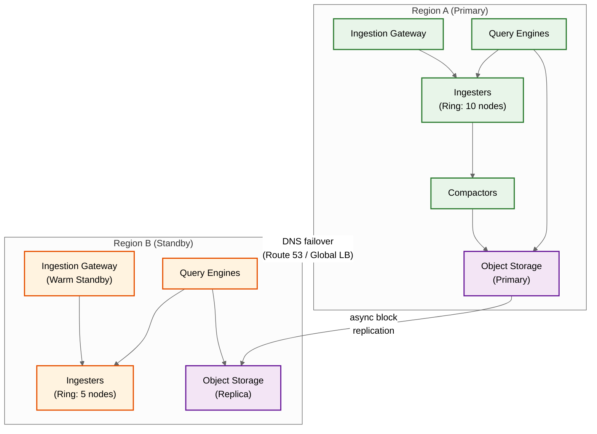

# Scalability & Reliability --- Time-Series Database

## Scalability

### Horizontal vs. Vertical Scaling Decisions

| Component | Scaling Strategy | Justification |
|---|---|---|
| **Ingestion Gateway** | Horizontal | Stateless; scale by adding instances behind load balancer |
| **Distributor** | Horizontal | Stateless; hash ring membership updated via gossip protocol |
| **Ingester** | Horizontal (with rebalancing) | Stateful; adding ingesters requires ring rebalancing and series migration; replication factor 3 ensures availability during rebalancing |
| **Query Frontend** | Horizontal | Stateless; split and route queries to query engine pool |
| **Query Engine** | Horizontal | Stateless per query; each engine reads from shared block storage; scale based on query concurrency |
| **Compactor** | Horizontal (sharded by time range) | Stateless workers that pick up compaction jobs; scale based on block accumulation rate |
| **Object Storage** | Managed/Infinite | Cloud-managed; no capacity planning needed; scale is limited only by cost |

### Auto-Scaling Triggers and Thresholds

| Component | Scale-Up Trigger | Scale-Down Trigger | Min/Max Instances |
|---|---|---|---|
| Ingestion Gateway | CPU > 70% for 5 min | CPU < 30% for 15 min | 3 / 50 |
| Ingester | Memory > 80% OR series/node > 5M | Memory < 40% AND series/node < 2M | 5 / 100 |
| Query Engine | Query queue depth > 50 for 3 min | Queue depth = 0 for 15 min | 3 / 30 |
| Compactor | Pending compaction jobs > 100 | No pending jobs for 30 min | 2 / 20 |

### Database Scaling Strategy

#### Ingester Ring Scaling

```
FUNCTION scale_ingesters(current_count, target_count):
    IF target_count > current_count:
        // Scale up: add new nodes to ring
        FOR i IN range(target_count - current_count):
            new_node = provision_ingester()
            ring.add_node(new_node, VIRTUAL_NODES=128)
            // New node receives ~1/target_count of all series
            // Series migration happens lazily:
            //   - New samples for migrated series go to new node
            //   - Old node's head block for those series is flushed to disk
            //   - No bulk data migration needed

    ELSE IF target_count < current_count:
        // Scale down: drain node before removal
        drain_node = select_least_loaded_ingester()
        drain_node.stop_accepting_new_series()
        drain_node.flush_all_head_blocks()
        // Wait until all WAL data is persisted as blocks
        ring.remove_node(drain_node)
        decommission(drain_node)
```

#### Sharding Strategy for >100M Series

At extreme scale (>100M active series), a single hash ring becomes insufficient. The architecture transitions to a **two-level sharding** model:

```
Level 1: Tenant-based sharding
  Each tenant is assigned to a "cell" (isolated ingester ring + query engine pool)
  Tenant → Cell mapping stored in a coordination service
  Large tenants get dedicated cells; small tenants are co-located

Level 2: Series-based sharding (within a cell)
  Within each cell, series are distributed across ingesters via consistent hash ring
  Standard ring mechanics: hash series fingerprint → ingester assignment

Benefits:
  - Tenant isolation: one tenant's cardinality explosion doesn't affect others
  - Independent scaling: cells scale based on their tenant's needs
  - Failure isolation: cell-level failures affect only that cell's tenants
```

### Caching Layers

| Cache Layer | What It Caches | Eviction | Size |
|---|---|---|---|
| **L1: Query result cache** | Full query results keyed by (query fingerprint, time range, step) | LRU + TTL (60s for recent data, 1h for historical) | 5-10 GB per query frontend |
| **L2: Block index cache** | Block-level inverted index and series metadata | LRU; warm on block open | 10-20 GB per query engine |
| **L3: Chunk data cache** | Decompressed chunk data for frequently accessed series | LRU; priority by access frequency | 5-10 GB per query engine |
| **L4: Metadata cache** | Tenant configs, series-to-ingester mappings, block manifests | TTL (5 min) with invalidation on change | 1-2 GB per component |

### Hot Spot Mitigation

| Hot Spot Type | Cause | Mitigation |
|---|---|---|
| **Hot ingester** | Uneven series distribution in hash ring (popular metrics hash to same range) | Virtual nodes (128 per ingester) for better distribution; adaptive ring rebalancing |
| **Hot series** | One series receives disproportionate samples (e.g., global counter aggregated by every pod) | Series-level rate limiting at distributor; pre-aggregation at agent level |
| **Hot time range** | All queries focus on the most recent 15 minutes (dashboards auto-refresh) | Query result caching with step alignment; recording rules for hot dashboard queries |
| **Hot block** | Many queries touch the same compacted block (popular service's last 24 hours) | Block-level read caching; replicate hot blocks across multiple query engine local caches |

---

## Reliability & Fault Tolerance

### Single Points of Failure (SPOF) Identification

| Component | SPOF Risk | Mitigation |
|---|---|---|
| Coordination Service | If coordination service fails, ring membership cannot update | 3-node or 5-node quorum; gossip-based ring as fallback; cached ring state on each node |
| Ingester | Series data in head block is lost if ingester dies before flush | Replication factor 3: each series written to 3 ingesters; WAL on local SSD enables recovery |
| Compactor | If compactor fails, blocks accumulate but no data loss | Multiple compactor workers; job queue with retry; blocks remain queryable even without compaction |
| Object Storage | Loss of cold-tier data | Provider-managed 11-nines durability; cross-region replication for critical tenants |
| Query Frontend | Single point for all queries | Multiple stateless instances behind load balancer; clients retry on failure |

### Redundancy Strategy

#### Ingester Replication

```
FUNCTION write_with_replication(series, sample, ring):
    replicas = ring.get_replicas(series.fingerprint, REPLICATION_FACTOR=3)

    success_count = 0
    FOR EACH replica IN replicas:
        TRY:
            replica.write(series, sample)
            success_count += 1
        CATCH timeout_or_error:
            log_warning("replica write failed", replica, error)

    // Quorum write: succeed if majority replicas acknowledge
    IF success_count >= QUORUM (2 of 3):
        RETURN SUCCESS
    ELSE:
        RETURN FAILURE("insufficient replicas")

// Read path deduplication:
// When querying, the query engine reads from all replicas
// and deduplicates by (series_id, timestamp)
// This handles the case where replicas have slightly different data
```

### Failover Mechanisms

| Scenario | Detection | Recovery |
|---|---|---|
| **Ingester crash** | Heartbeat timeout (30s) | Ring marks node as unhealthy; replicas serve reads; new ingester joins ring; WAL replay recovers in-memory state (30s-5min depending on checkpoint frequency) |
| **Compactor failure** | Job timeout (10 min) | Job returned to queue; another compactor picks it up; source blocks remain available |
| **Query engine OOM** | Process exit; health check failure | Kubernetes restarts pod; query frontend retries to different engine; query result cache prevents repeat computation |
| **Object storage unavailable** | Read timeout; 5xx errors | Circuit breaker trips after 3 failures in 10s; queries fall back to local block cache; ingestion continues to local disk; uploads retry with exponential backoff |

### Circuit Breaker Patterns

```
FUNCTION query_with_circuit_breaker(block_source, query):
    breaker = get_circuit_breaker(block_source)

    IF breaker.state == OPEN:
        IF block_source == OBJECT_STORAGE:
            RETURN query_local_cache_only(query)  // graceful degradation
        ELSE:
            RETURN error("source unavailable, retry later")

    TRY:
        result = block_source.execute(query)
        breaker.record_success()
        RETURN result
    CATCH timeout_or_error:
        breaker.record_failure()
        IF breaker.failure_count >= THRESHOLD (5 in 30s):
            breaker.trip()  // CLOSED → OPEN
            schedule_half_open_check(breaker, AFTER=30s)
        THROW
```

### Retry Strategy

| Operation | Retry Policy | Max Retries | Backoff |
|---|---|---|---|
| Ingestion write (to replica) | Immediate retry to different replica | 2 | None (try next replica) |
| Object storage read | Exponential backoff | 3 | 100ms → 500ms → 2s |
| Compaction job | Re-queue with delay | 5 | 1min → 5min → 15min → 1h → 4h |
| Query execution | Frontend retries to different engine | 2 | 100ms (different engine) |
| Block upload | Exponential backoff with jitter | 10 | 1s → 5s → 30s (capped) |

### Graceful Degradation

| Scenario | Degraded Behavior | User Impact |
|---|---|---|
| Object storage down | Queries limited to locally cached blocks; historical queries return partial data | Recent data available; long-range queries show gaps |
| Compaction backlog | More block files to scan per query; slightly higher latency | Queries work but slower; no data loss |
| High cardinality spike | New series creation rejected; existing series continue accepting data | Dashboard queries work; new metric series fail to appear |
| Memory pressure | Head block window reduced from 2h to 1h; OOO window reduced | More frequent block flushes; some late samples rejected |

---

## Disaster Recovery

### RTO and RPO Targets

| Scenario | RPO | RTO | Strategy |
|---|---|---|---|
| Single ingester failure | 0 (replicated) | 2 minutes (WAL replay) | Replication factor 3; WAL on local SSD |
| Availability zone failure | < 5 seconds (replication lag) | 5 minutes (ring rebalancing) | Cross-AZ ingester placement; 3-way replication spans AZs |
| Region failure | < 1 hour (async replication lag) | 30 minutes (DNS failover + cold start) | Async block replication to standby region; object storage cross-region replication |
| Object storage corruption | 0 (versioned) | 15 minutes (restore from version) | Object versioning; cross-region replication |

### Backup Strategy

```
TSDB Backup Architecture:
  1. WAL: continuously replicated to 2 additional ingesters (synchronous)
  2. Blocks: uploaded to object storage immediately after compaction (async, <5 min lag)
  3. Object storage: cross-region replication (provider-managed, <15 min lag)
  4. Index metadata: snapshotted to object storage every hour
  5. Tenant configuration: version-controlled in coordination service with snapshots

Recovery procedure:
  1. Provision new TSDB cluster in standby region
  2. Point to cross-region replicated object storage
  3. Reconstruct inverted index from block files (10-30 min for 25M series)
  4. Warm head block from most recent WAL backup (if available)
  5. Resume ingestion; accept data gap between last backup and recovery
```

### Multi-Region Considerations

| Approach | Pros | Cons | Use Case |
|---|---|---|---|
| **Active-Passive** | Simple; low cost; no write conflicts | RPO = replication lag; RTO = failover time; standby region idle | Most deployments; cost-sensitive |
| **Active-Active (per-tenant)** | Near-zero RPO for critical tenants; instant failover | Complexity; potential inconsistency during partition; 2x cost | Premium tier tenants; regulatory requirements |
| **Write-local, Query-global** | Each region ingests its own data; global query fans out to all regions | Cross-region query latency; complex query routing | Geographically distributed monitoring (each region monitors itself) |

---

## Chaos Engineering Experiments

| # | Experiment | Injection Method | Expected Behavior | Verified |
|---|-----------|-----------------|-------------------|----------|
| 1 | Kill random ingester | Process termination | Replicated ingester takes over; WAL replayed on restart; < 30s gap | Yes |
| 2 | Network partition between ingesters | iptables rule | Each ingester continues writing locally; deduplication at query time | Yes |
| 3 | Fill disk on query node | Allocate dummy files | Query returns partial results; alerts fire; no write-path impact | Yes |
| 4 | Inject cardinality spike (10x series in 1 min) | Synthetic metric generator | Cardinality enforcement rejects new series above cap; existing series unaffected | Yes |
| 5 | Stall compaction for 8 hours | Pause compactor process | Block count grows; query latency degrades 2-3x; no data loss | Yes |
| 6 | Corrupt WAL segment | Bit-flip injection | WAL replay detects corruption; skips corrupted segment; data loss limited to one segment (~30s) | Yes |
| 7 | Object storage unavailable for 1 hour | Block network to storage | Recent data (head + local blocks) still queryable; historical queries fail; blocks queue for upload | Yes |
| 8 | Clock skew injection (5-minute drift) | NTP manipulation | Out-of-order ingestion handles drift within OOO window; samples beyond window rejected | Yes |

### Chaos Engineering Principles for TSDBs

1. **Cardinality is the blast radius** — Unlike most systems where the blast radius is data volume, TSDB failures are driven by cardinality. Chaos experiments should always include a cardinality spike scenario.
2. **Compaction is the hidden dependency** — A TSDB that passes all other chaos experiments but has stalled compaction is silently degrading. Include compaction health in every experiment's success criteria.
3. **The meta-monitor must survive independently** — If your chaos experiment takes down the primary TSDB, the meta-monitor must continue alerting. Test meta-monitor independence separately.

---

## Performance Benchmarks

| Scenario | Configuration | Write Throughput | Query Latency (p50/p99) |
|----------|--------------|-----------------|------------------------|
| Single ingester, 5M series | 16 vCPU, 64 GB RAM, SSD | 800K samples/sec | 5ms / 25ms (instant query) |
| Single ingester, 25M series | 32 vCPU, 128 GB RAM, SSD | 1.7M samples/sec | 15ms / 80ms (instant query) |
| 3-node cluster, 50M series | 3 × 16 vCPU, 64 GB RAM | 3.5M samples/sec | 20ms / 120ms (range, 100 series) |
| 10-node cluster, 250M series | 10 × 32 vCPU, 128 GB RAM | 12M samples/sec | 50ms / 300ms (range, 1K series) |
| High-cardinality query | Any cluster size | N/A | 200ms / 3s (range, 10K series, 24h) |
| Historical query (90 days, downsampled) | Object storage backend | N/A | 500ms / 5s (1K series, 1-hr rollup) |

### Capacity Planning Formulas

```
// Ingester memory
ingester_memory_gb = (active_series * 320 bytes / 1e9)  // index + head chunk
                   + (ooo_buffer_series * 200 bytes / 1e9)
                   + jvm_overhead_gb  // typically 2-4 GB

// Ingester count
ingesters = CEIL(total_active_series / max_series_per_ingester)
max_series_per_ingester = (available_memory_gb - overhead_gb) * 1e9 / 320

// Storage (compressed)
daily_storage_gb = samples_per_day * bytes_per_sample_compressed
                 = (active_series / scrape_interval_sec * 86400) * 1.37 / 1e9

// Query node sizing
query_memory_gb = max_concurrent_queries * avg_query_memory_mb / 1024
query_cpu_cores = max_concurrent_queries * avg_query_cpu_seconds / query_timeout_seconds

// Compaction resources
compaction_throughput = blocks_per_day * avg_block_size_gb
compaction_nodes = CEIL(compaction_throughput / single_node_compaction_rate)
```

---

## Operational Runbooks

### Runbook: Ingester High Memory (P1)

```
TRIGGER: tsdb.head_block_memory_bytes > 80% of heap for > 5 minutes

STEP 1: Identify cause
  → Check tsdb.active_series: sudden increase? → Cardinality explosion
  → Check tsdb.ooo_samples_buffered: high? → OOO window too wide
  → Check GC pauses: > 500ms? → Memory fragmentation

STEP 2: Immediate mitigation
  → IF cardinality spike: apply emergency per-metric cap
  → IF OOO buffer large: reduce OOO window from 30min to 5min
  → IF memory near OOM: force head block flush (creates smaller blocks)
  → IF all else fails: restart ingester (triggers WAL replay, 10-30s)

STEP 3: Prevention
  → Review cardinality enforcement thresholds
  → Consider horizontal scaling (add more ingesters)
  → Reduce head block window (1 hour instead of 2)
```

### Runbook: Query Timeout Spike (P2)

```
TRIGGER: tsdb.query_timeout_rate > 5% for > 10 minutes

STEP 1: Identify slow queries
  → Check query log: which expressions are timing out?
  → Common pattern: high fan-out (>10K series) with long time range (>24h)

STEP 2: Immediate mitigation
  → Reduce per-query series limit (e.g., 500K → 100K)
  → Increase query timeout for affected tenants (if legitimate)
  → Check if compaction is behind (more blocks = slower queries)

STEP 3: Long-term fix
  → Create recording rules for frequently-run expensive queries
  → Increase query node count or memory
  → If compaction-related: scale compaction workers
  → Review dashboard queries for unnecessary high-cardinality aggregations
```

### Runbook: Compaction Stall (P2)

```
TRIGGER: tsdb.compaction_pending_jobs > 100 for > 2 hours

STEP 1: Diagnose root cause
  → Check compaction_duration_seconds histogram: identify slow jobs
  → Check disk I/O utilization: compaction saturating disk?
  → Check CPU utilization on compactor nodes
  → Check for large blocks (high series count = slow compaction)

STEP 2: Immediate mitigation
  → IF I/O-bound: rate-limit ingestion compaction I/O via cgroup
  → IF CPU-bound: scale compactor worker count horizontally
  → Skip compaction for blocks near retention expiry (wasteful work)
  → Prioritize recent blocks (more impactful for query performance)

STEP 3: Prevention
  → Separate compaction to dedicated nodes (disaggregated mode)
  → Auto-scale compactor workers based on pending job queue depth
  → Set compaction backlog alert at 1 hour (before it degrades queries)
  → Monitor compaction throughput (blocks/hour) as a leading indicator
```

### Runbook: Object Storage Upload Failures (P2)

```
TRIGGER: tsdb.block_upload_failure_count > 0 for > 30 minutes

STEP 1: Assess impact
  → Blocks accumulate on local disk; no data loss if disk has space
  → Check local disk usage: how much runway before full?
  → Check if object storage is globally degraded vs. tenant-specific

STEP 2: Diagnose
  → Check object storage health dashboard / status page
  → Check network connectivity between ingesters and storage endpoint
  → Check IAM / credential expiry for storage access
  → Check for rate limiting from storage provider (429 responses)

STEP 3: Mitigation
  → IF credential issue: rotate credentials; update ingester config
  → IF rate limiting: reduce upload parallelism; stagger retries with jitter
  → IF storage outage: wait; local blocks are safe; set disk usage alert
  → IF persistent: switch to backup storage endpoint if configured

STEP 4: Recovery
  → After storage is available: trigger bulk upload of queued blocks
  → Verify all blocks uploaded by comparing local vs. remote manifests
  → Monitor upload queue drain rate; ensure it completes before next flush
```

---

## Multi-Region Deployment Architecture



### Regional Failover Procedure

```
FUNCTION failover_to_standby(primary_region, standby_region):
    // Step 1: Confirm primary is truly unavailable (avoid split-brain)
    confirmed_down = multi_probe_health_check(primary_region, PROBES=3, TIMEOUT=30s)
    IF NOT confirmed_down:
        RETURN "primary responding; aborting failover"

    // Step 2: Promote standby ingesters to full capacity
    standby_region.scale_ingesters(target = primary_region.ingester_count)
    standby_region.enable_ingestion_gateway()  // accept external traffic

    // Step 3: Update DNS to route traffic to standby
    update_dns_record(tsdb.example.com, standby_region.gateway_endpoint, TTL=30s)

    // Step 4: Verify data continuity
    //   Object storage replication lag determines data gap
    gap_start = last_replicated_block(standby_region).max_time
    gap_end = NOW()
    log_warning("data gap", gap_start, gap_end, "duration_seconds", gap_end - gap_start)

    // Step 5: Monitor recovery
    WHILE NOT standby_region.ingestion_rate_stable():
        WAIT 30s
        check_ingestion_health(standby_region)

    RETURN "failover complete; RTO achieved; data gap = {gap_end - gap_start}s"

// Target RTO: 5-10 minutes (DNS propagation + ingester warm-up)
// RPO: Object storage replication lag (typically < 15 minutes)
```

---

## Data Tiering

| Tier | Storage | Data Age | Resolution | Latency | Cost (Relative) |
|------|---------|----------|------------|---------|-----------------|
| **Hot** | In-memory head block + local SSD WAL | 0 - 2 hours | Full (15s) | < 5 ms | 100x |
| **Warm** | Local NVMe/SSD (compacted blocks) | 2 hours - 7 days | Full (15s) | 5 - 50 ms | 10x |
| **Cool** | Object storage (full-resolution blocks) | 7 - 30 days | Full (15s) | 50 - 200 ms | 1x |
| **Cold** | Object storage (5-min downsampled) | 30 - 90 days | 5-min rollup | 100 - 500 ms | 0.2x |
| **Archive** | Object storage (1-hr downsampled) | 90 days - 13 months | 1-hr rollup | 200 ms - 2s | 0.04x |
| **Expired** | Deleted | > 13 months | N/A | N/A | 0 |

### Tier Migration Pipeline

```
FUNCTION migrate_blocks_between_tiers():
    FOR EACH block IN all_blocks():
        age = NOW() - block.max_time

        // Hot → Warm: automatic (head block flush)
        // Handled by ingester flush at 2-hour boundary

        // Warm → Cool: upload to object storage
        IF age > 7 days AND block.location == LOCAL_DISK:
            upload_to_object_storage(block)
            register_block_in_store_gateway(block)
            schedule_local_deletion(block, AFTER=24h)  // keep local copy briefly

        // Cool → Cold: create 5-min downsampled version
        IF age > 30 days AND NOT EXISTS downsampled(block, "5m"):
            create_downsample(block, resolution="5m", aggregations=[MIN, MAX, SUM, COUNT])
            // Original full-resolution block deleted by retention policy

        // Cold → Archive: create 1-hr downsampled version
        IF age > 90 days AND NOT EXISTS downsampled(block, "1h"):
            create_downsample(block, resolution="1h", aggregations=[MIN, MAX, SUM, COUNT])
            // 5-min downsampled block deleted by retention policy

        // Archive → Expired: delete
        IF age > 13 months:
            delete_block(block)
            log_info("block expired", block.id, block.time_range)
```

---

## Cost Optimization Strategies

| Strategy | Savings | Trade-off | Implementation |
|----------|---------|-----------|---------------|
| **Aggressive downsampling** | 5-10x storage reduction for data >30 days | Loss of per-sample resolution; spikes may be missed at 1-hour rollup | Configure tiered retention: 15d raw → 90d 5-min → 13mo 1-hr |
| **Compression monitoring** | Prevent 3-4x cost overruns from degraded compression | Requires per-metric monitoring; may require data source changes | Alert on `tsdb_chunk_compression_ratio > 3.0`; separate irregular sources |
| **Recording rules for hot queries** | 10-50x query engine cost reduction for dashboard queries | Storage overhead for pre-computed series; rule maintenance | Identify top-N dashboard queries by execution count; create recording rules |
| **Cardinality enforcement** | Prevents unbounded memory growth | May reject legitimate new series during enforcement | Per-tenant and per-metric cardinality caps; series creation rate limiting |
| **Cold tier on object storage** | 5x storage cost reduction vs. SSD | 50-200ms added latency for cold queries | Move blocks >7 days to object storage; cache hot blocks locally |
| **Tenant-based cell sizing** | Right-size infrastructure per tenant | Operational complexity of managing multiple cells | Small tenants: shared cells; large tenants: dedicated cells |
| **Native histograms** | 22x cardinality reduction for histogram metrics | Requires client library migration; exponential bucket boundaries | Migrate high-cardinality histogram metrics to native format |

### Cost Attribution per Tenant

```
FUNCTION calculate_tenant_cost(tenant_id, month):
    // Ingestion cost
    samples_ingested = sum(tsdb_samples_ingested_total{tenant=tenant_id}) over month
    ingestion_cost = samples_ingested * COST_PER_MILLION_SAMPLES

    // Storage cost
    active_series = avg(tsdb_active_series{tenant=tenant_id}) over month
    storage_bytes = sum(tsdb_tenant_storage_bytes{tenant=tenant_id}) over month
    storage_cost = storage_bytes * COST_PER_GB_MONTH

    // Query cost
    queries_executed = sum(tsdb_queries_total{tenant=tenant_id}) over month
    samples_scanned = sum(tsdb_query_samples_scanned{tenant=tenant_id}) over month
    query_cost = queries_executed * COST_PER_QUERY + samples_scanned * COST_PER_BILLION_SCANNED

    // Index cost (memory attribution)
    index_memory = active_series * 320  // bytes
    index_cost = index_memory * COST_PER_GB_RAM_MONTH

    RETURN {
        tenant: tenant_id,
        ingestion: ingestion_cost,
        storage: storage_cost,
        query: query_cost,
        index: index_cost,
        total: ingestion_cost + storage_cost + query_cost + index_cost
    }
```

---

## Upgrade and Migration Patterns

### Zero-Downtime Block Format Migration

```
FUNCTION migrate_block_format(from_format, to_format):
    // Migrate blocks from one format to another without data loss or downtime

    // Phase 1: New blocks written in new format
    set_config("block.write_format", to_format)
    // All new compaction output uses new format
    // Existing blocks remain in old format

    // Phase 2: Background conversion of historical blocks
    FOR EACH block IN blocks_in_format(from_format):
        new_block = convert_block(block, to_format)
        register_block(new_block)  // Make new block queryable
        mark_for_deletion(block)   // Remove old block after verification

    // Phase 3: Verify all blocks converted
    remaining = COUNT(blocks_in_format(from_format))
    ASSERT remaining == 0

    // Phase 4: Remove old format reader from query path
    remove_format_support(from_format)

    // Duration: days to weeks depending on data volume
    // No downtime; no data loss; both formats queryable during migration
```
