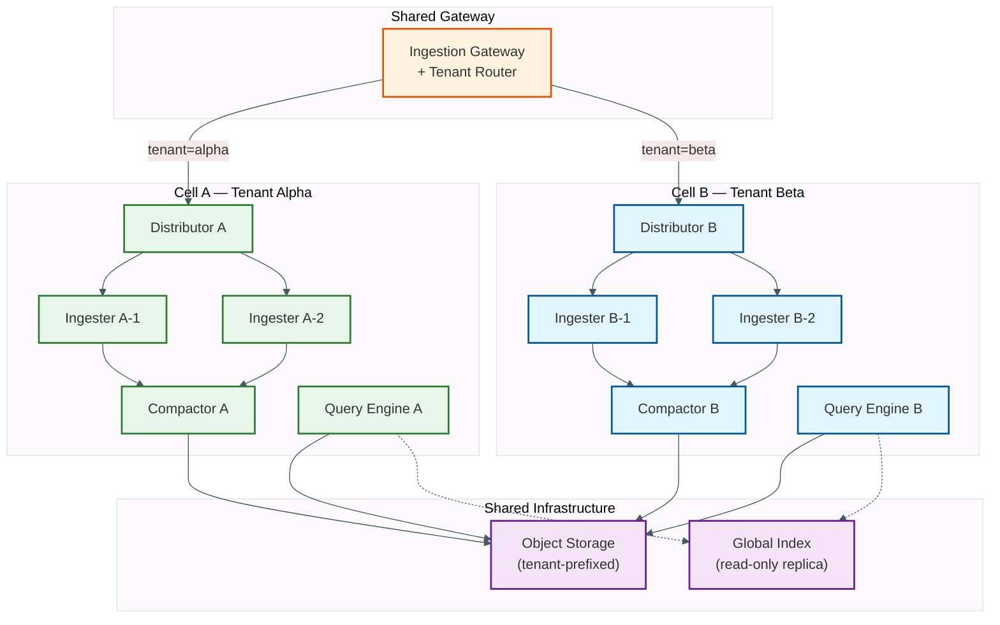
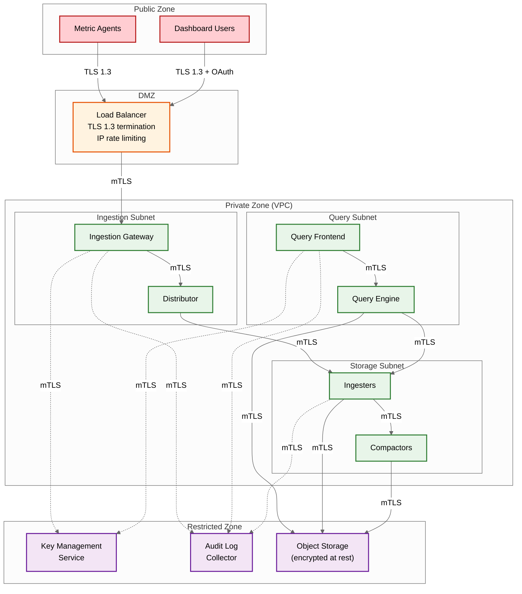

# Security & Compliance --- Time-Series Database

## Authentication & Authorization

### Authentication Mechanisms

| Mechanism | Use Case | Implementation |
|---|---|---|
| **API Keys** | Agent-to-TSDB ingestion; programmatic query access | Per-tenant API keys with configurable permissions (write-only, read-only, admin); key rotation without downtime via dual-key support |
| **OAuth 2.0 / OIDC** | Dashboard users; SSO for enterprise tenants | OIDC provider integration; JWT tokens with tenant claims; refresh token rotation |
| **mTLS** | Service-to-service communication between TSDB components | Certificate-based authentication for ingesters, compactors, query engines; cert rotation via coordination service |
| **Service Account Tokens** | Kubernetes-native workloads; automated integrations | Short-lived tokens bound to service accounts; audience-restricted |

### Authorization Model

```
RBAC Model for Multi-Tenant TSDB:

Roles:
  - tenant_admin: Full access within tenant scope (create/delete metrics, manage retention, configure alerts)
  - writer: Write data points; cannot query or manage configuration
  - reader: Query data and list metrics; cannot write or modify
  - operator: Platform-wide operations (compaction, rebalancing); no tenant data access
  - super_admin: Platform administration; cross-tenant visibility for debugging

Permission Matrix:
  ┌─────────────────┬──────────┬────────┬────────┬──────────┬─────────────┐
  │ Operation       │ t_admin  │ writer │ reader │ operator │ super_admin │
  ├─────────────────┼──────────┼────────┼────────┼──────────┼─────────────┤
  │ Write data      │ ✓        │ ✓      │ ✗      │ ✗        │ ✓           │
  │ Read data       │ ✓        │ ✗      │ ✓      │ ✗        │ ✓           │
  │ Create metric   │ ✓        │ ✓      │ ✗      │ ✗        │ ✓           │
  │ Delete metric   │ ✓        │ ✗      │ ✗      │ ✗        │ ✓           │
  │ Manage retention│ ✓        │ ✗      │ ✗      │ ✗        │ ✓           │
  │ View cardinality│ ✓        │ ✗      │ ✓      │ ✓        │ ✓           │
  │ Manage compactor│ ✗        │ ✗      │ ✗      │ ✓        │ ✓           │
  │ Cross-tenant ops│ ✗        │ ✗      │ ✗      │ ✗        │ ✓           │
  └─────────────────┴──────────┴────────┴────────┴──────────┴─────────────┘
```

### Token Management

```
FUNCTION authenticate_request(request):
    // Extract tenant context from request
    tenant_id = request.header("X-Tenant-ID")
    auth_header = request.header("Authorization")

    IF auth_header.starts_with("Bearer "):
        token = auth_header.remove_prefix("Bearer ")

        // Try API key first (faster, no JWT parsing)
        api_key = lookup_api_key(token)
        IF api_key AND api_key.tenant_id == tenant_id:
            RETURN AuthContext(tenant_id, api_key.role, api_key.permissions)

        // Try JWT token
        jwt = verify_jwt(token, PUBLIC_KEY)
        IF jwt.valid AND jwt.claims.tenant_id == tenant_id:
            IF jwt.exp < NOW():
                RETURN REJECT("token expired")
            RETURN AuthContext(tenant_id, jwt.claims.role, jwt.claims.permissions)

    RETURN REJECT("unauthorized")
```

---

## Data Security

### Encryption at Rest

| Data Type | Encryption | Key Management |
|---|---|---|
| WAL files (local SSD) | Volume-level encryption (dm-crypt or equivalent) | Platform-managed keys; rotated annually |
| Block files (local disk) | Volume-level encryption | Same as WAL |
| Object storage blocks | Server-side encryption with customer-managed keys | Per-tenant encryption keys stored in key management service; key rotation triggers block re-encryption during next compaction |
| Index metadata | Encrypted as part of block files | Inherits block encryption |
| Tenant configuration | Encrypted in coordination service | Platform-managed keys |

### Encryption in Transit

| Path | Protocol | Certificate |
|---|---|---|
| Agent → Ingestion Gateway | TLS 1.3 | Gateway presents server certificate; optional mTLS for high-security agents |
| Gateway → Distributor | mTLS | Internal PKI; service mesh sidecar or direct mTLS |
| Ingester → Object Storage | TLS 1.3 | Cloud provider managed |
| Query Client → Query Frontend | TLS 1.3 | Gateway server certificate |
| Inter-component communication | mTLS | Internal PKI with automatic certificate rotation |

### PII Handling in Metric Data

Time-series metric data has a unique PII profile: the **values** themselves (CPU percentage, request count) are rarely PII, but **labels** can contain PII if developers embed user identifiers, email addresses, or IP addresses as label values.

```
FUNCTION sanitize_labels(labels, sanitization_rules):
    sanitized = {}
    FOR EACH (key, value) IN labels:
        rule = sanitization_rules.get(key)
        IF rule == "drop":
            CONTINUE  // Remove label entirely
        ELSE IF rule == "hash":
            sanitized[key] = sha256_truncate(value, 16)  // Pseudonymize
        ELSE IF rule == "allow":
            sanitized[key] = value  // Permit as-is
        ELSE:
            // Default: check against PII patterns
            IF matches_pii_pattern(value):  // email, IP, SSN patterns
                sanitized[key] = "[REDACTED]"
                log_warning("PII detected in label", key)
            ELSE:
                sanitized[key] = value
    RETURN sanitized

// Applied at ingestion gateway BEFORE data reaches storage
// Ensures PII never reaches WAL, head block, or object storage
```

---

## Threat Model

### Top Attack Vectors

| # | Attack Vector | Risk Level | Description |
|---|---|---|---|
| 1 | **Cardinality bomb** | Critical | Malicious or misconfigured agent sends metrics with high-cardinality labels (random UUIDs as label values), causing memory exhaustion and denial of service for all tenants |
| 2 | **Query-of-death** | High | Crafted query that matches millions of series or requests unbounded time range, consuming all query engine memory and CPU |
| 3 | **Tenant data exfiltration** | High | Exploiting authorization gaps to query another tenant's metric data; especially dangerous if label values leak infrastructure topology |
| 4 | **Ingestion flood DDoS** | High | Volumetric attack overwhelming ingestion pipeline with valid-format but high-volume data |
| 5 | **Label injection** | Medium | Injecting label values that exploit downstream systems (dashboard rendering, alerting rule evaluation, log aggregation) |

### Mitigations

| Attack | Mitigation |
|---|---|
| **Cardinality bomb** | Per-tenant series creation rate limit (e.g., 1000 new series/min); per-metric cardinality cap; real-time cardinality monitoring with automatic label dropping; circuit breaker on new series creation when memory exceeds threshold |
| **Query-of-death** | Per-query memory limit (e.g., 512 MB); per-query series limit (e.g., 500K); query timeout (30s default); query cost estimation before execution with rejection of estimated-expensive queries |
| **Tenant data exfiltration** | Tenant ID enforced at every layer (gateway, distributor, ingester, query engine); series-level tenant tagging; query engine injects tenant filter into every query; no cross-tenant label resolution in inverted index |
| **Ingestion flood DDoS** | Per-tenant ingestion rate limiting (token bucket); global ingestion rate cap with admission control; backpressure propagation to agents via 429 + Retry-After; IP-level rate limiting at load balancer |
| **Label injection** | Label value validation: max length (128 chars), allowed character set (alphanumeric + limited special chars), no control characters; sanitization at ingestion gateway |

### Rate Limiting & DDoS Protection

```
Three-Layer Defense:

Layer 1: Network (Load Balancer)
  - IP-based rate limiting: 10K requests/s per source IP
  - Connection limiting: 100 concurrent connections per source IP
  - TLS termination with invalid certificate rejection

Layer 2: Application (Ingestion Gateway)
  - Per-tenant token bucket: configurable samples/s limit
  - Per-tenant concurrent request limit
  - Payload size limit: 10 MB per batch
  - Series creation rate limit: separate from sample rate

Layer 3: Storage (Ingester)
  - Per-series sample rate limit: max 4 samples/s per series (15s interval minimum)
  - Memory-based admission control: reject new series when memory > 80%
  - WAL write rate limit: bound disk I/O consumption
```

---

## Compliance

### GDPR Considerations

| Requirement | Implementation |
|---|---|
| Right to erasure | Tombstone-based deletion: mark specific series for deletion; compaction physically removes data; object storage versions cleaned after retention period |
| Data minimization | Retention policies enforce automatic deletion; downsampling reduces data resolution over time; label sanitization prevents unnecessary PII collection |
| Data portability | Export API supports standard formats (Prometheus remote-read, CSV, Parquet); tenants can export their complete dataset |
| Consent & purpose | Metric collection purposes documented in data processing agreement; tenants control which metrics are collected via agent configuration |
| Cross-border transfers | Data residency controls: tenant data pinned to specific regions; object storage bucket per region; no cross-region replication without explicit consent |

### SOC 2 Considerations

| Control | Implementation |
|---|---|
| Access logging | All API calls logged with tenant, user, operation, timestamp; query text logged (with PII scrubbing) for audit trail |
| Change management | Tenant configuration changes version-controlled; compaction and retention policy changes logged with before/after |
| Availability monitoring | Platform SLOs tracked and reported; incident history maintained; uptime dashboard per tenant |
| Encryption | At-rest and in-transit encryption as detailed above; key management via dedicated service |

### Financial Data Compliance

For TSDBs storing financial time-series (tick data, trading metrics):

| Requirement | Implementation |
|---|---|
| Data immutability | Blocks on object storage are write-once (immutable after upload); WAL is append-only; no in-place modification of stored data points |
| Audit trail | Block metadata includes creation timestamp, source block IDs, and compaction history; complete chain of custody from ingestion to storage |
| Retention requirements | Configurable per-tenant retention that can exceed default (e.g., 7 years for financial data); retention policy changes logged and approved |
| Data integrity | Checksums on block files and WAL segments; checksum verification on read; corruption detected and reported |

### HIPAA Considerations (if storing health telemetry)

| Requirement | Implementation |
|---|---|
| PHI isolation | Health-related metrics stored in tenant-isolated cells with separate encryption keys; no co-mingling with non-PHI tenants |
| Minimum necessary | Label sanitization rules prevent health identifiers in metric labels; only aggregate health metrics permitted (e.g., heart_rate_avg, not patient_id-labeled series) |
| Audit trail | Every query against PHI tenant logged with user identity, query text, timestamp, and result row count |
| BAA coverage | TSDB platform provider must be covered under Business Associate Agreement if storing any health data |
| Data at rest | Per-tenant encryption with tenant-managed keys; PHI data encrypted at block level in addition to volume-level encryption |

---

## Audit and Forensics

### Audit Trail Requirements

| Event | What to Log | Retention |
|-------|------------|-----------|
| Tenant creation/modification | Who created, configuration (series limit, retention, tier), timestamp | 2 years |
| API key creation/rotation | Who created, key identifier (NOT the key itself), permissions granted, expiry | 2 years |
| Ingestion rate limit hit | Tenant, current rate, limit value, rejected sample count, timestamp | 90 days |
| Cardinality cap hit | Tenant, metric name, current series count, cap value, rejected label set (sanitized) | 90 days |
| Query execution | Tenant, user, query text (PII-scrubbed), duration, series matched, samples scanned | 30 days |
| Retention policy change | Who changed, old/new values, approval record | 2 years |
| Block deletion (retention enforcement) | Block ID, time range, series count, reason (TTL/manual), who approved (if manual) | 2 years |
| GDPR deletion request | Tenant, series selectors for deletion, tombstone creation timestamp, compaction completion timestamp | Indefinite |
| Configuration change | Who changed, component, old/new values, timestamp | 2 years |
| Authentication failure | Source IP, attempted tenant, failure reason, timestamp | 90 days |

### Forensic Investigation: Unauthorized Data Access

```
FUNCTION investigate_data_access(tenant_id, time_range):
    // Determine who accessed this tenant's data and how

    // Step 1: Query access logs for the tenant
    query_logs = search_audit_log(
        filter = "event_type = 'query_execution' AND tenant = '{tenant_id}'",
        time_range = time_range
    )

    // Step 2: Identify unique accessors
    accessors = DISTINCT(query_logs.user_id)
    unauthorized = [a FOR a IN accessors IF NOT has_read_permission(a, tenant_id)]

    // Step 3: Check API key usage
    key_usage = search_audit_log(
        filter = "event_type = 'api_key_auth' AND tenant = '{tenant_id}'",
        time_range = time_range
    )
    revoked_keys = [k FOR k IN key_usage IF k.key_status == "revoked" AND k.auth_success]

    // Step 4: Check cross-tenant leakage
    cross_tenant = search_audit_log(
        filter = "event_type = 'query_execution' AND query_text CONTAINS '{tenant_id}'
                  AND tenant != '{tenant_id}'"
    )

    RETURN {
        total_queries: LEN(query_logs),
        unique_accessors: accessors,
        unauthorized_access: unauthorized,
        revoked_key_usage: revoked_keys,
        cross_tenant_leakage: cross_tenant,
        recommendation: "Review ACLs; rotate compromised keys; audit tenant isolation"
    }
```

---

## Security Hardening Checklist

| Category | Control | Priority | Status |
|----------|---------|----------|--------|
| **Network** | Ingesters in private subnet; no public internet access | Critical | |
| **Network** | mTLS between all internal components | Critical | |
| **Network** | Load balancer with TLS 1.3 minimum; reject TLS < 1.2 | Critical | |
| **Network** | IP allowlisting for management/admin API endpoints | High | |
| **Authentication** | Per-tenant API keys with role-based permissions | Critical | |
| **Authentication** | API key rotation policy (90-day maximum lifetime) | High | |
| **Authentication** | OAuth 2.0 / OIDC for dashboard user authentication | High | |
| **Authorization** | Tenant ID enforced at every layer (gateway → ingester → query engine) | Critical | |
| **Authorization** | No cross-tenant query capability except for super_admin role | Critical | |
| **Authorization** | Separate read and write API keys (no combined keys) | High | |
| **Data Protection** | Label sanitization at ingestion (PII detection + redaction) | Critical | |
| **Data Protection** | Volume-level encryption for WAL and local block storage | Critical | |
| **Data Protection** | Per-tenant encryption keys for object storage blocks | High | |
| **Data Protection** | Query text PII scrubbing in audit logs | High | |
| **Admission Control** | Per-tenant cardinality cap enforced at distributor | Critical | |
| **Admission Control** | Per-tenant ingestion rate limit (token bucket) | Critical | |
| **Admission Control** | Per-query memory and series limits | High | |
| **Admission Control** | Label value validation (max length, allowed charset) | High | |
| **Monitoring** | Authentication failure rate monitoring + alerting | High | |
| **Monitoring** | Cross-tenant query attempt detection | Critical | |
| **Monitoring** | API key usage anomaly detection (unusual source IPs, time patterns) | Medium | |
| **Compliance** | GDPR: tombstone + compaction pipeline for right-to-erasure | High | |
| **Compliance** | SOC 2: audit logging for all API operations | High | |
| **Compliance** | Data residency: tenant data pinned to specific regions | If applicable | |

---

## Multi-Tenancy Isolation Architecture

Multi-tenancy in a TSDB is uniquely challenging because the primary denial-of-service vector is not volumetric traffic but cardinality—a single misconfigured tenant can create millions of series and exhaust cluster-wide memory.

### Isolation Levels

| Level | Mechanism | Isolation Strength | Operational Cost |
|-------|-----------|-------------------|-----------------|
| **Logical** | Tenant ID prefix on all series; query engine injects tenant filter | Weak: noisy neighbor via shared resources | Low: single cluster |
| **Namespace** | Dedicated label namespace per tenant; separate posting lists in shared index | Medium: index isolation; shared storage/compute | Medium: index partitioning |
| **Cell-based** | Dedicated ingester set + compactor + query engine per tenant cell | Strong: compute/memory isolation | High: per-tenant infrastructure |
| **Cluster-based** | Physically separate TSDB cluster per tenant | Complete: no shared resources | Very high: per-tenant operations |

### Cell-Based Tenant Isolation Architecture



### Tenant Resource Quotas

```
FUNCTION enforce_tenant_quotas(tenant_id, operation, context):
    quotas = load_tenant_quotas(tenant_id)

    CASE operation OF:
        "ingest":
            // Rate limiting: token bucket per tenant
            IF NOT rate_limiter.try_acquire(tenant_id, context.sample_count):
                RETURN REJECT(429, "rate limit exceeded",
                    retry_after = rate_limiter.next_available(tenant_id))

            // Cardinality enforcement: cap active series count
            new_series = count_new_series(context.samples, tenant_id)
            current_series = get_active_series_count(tenant_id)
            IF current_series + new_series > quotas.max_active_series:
                // Drop only samples that would create new series
                context.samples = filter_existing_series_only(context.samples, tenant_id)
                emit_metric("tenant_cardinality_limited", tenant_id, new_series)

        "query":
            // Concurrent query limit
            active_queries = get_active_query_count(tenant_id)
            IF active_queries >= quotas.max_concurrent_queries:
                RETURN REJECT(429, "query concurrency limit exceeded")

            // Per-query resource limits
            estimated_cost = estimate_query_cost(context.query)
            IF estimated_cost.series > quotas.max_query_series:
                RETURN REJECT(422, "query would touch too many series",
                    estimated = estimated_cost.series, limit = quotas.max_query_series)
            IF estimated_cost.memory > quotas.max_query_memory:
                RETURN REJECT(422, "query memory estimate exceeds limit")

        "series_create":
            // Series creation rate limit (separate from sample rate)
            IF NOT creation_rate_limiter.try_acquire(tenant_id, 1):
                RETURN REJECT(429, "series creation rate exceeded")

    RETURN ALLOW
```

---

## Cardinality-Based Denial of Service Protection

Cardinality bombs are the most dangerous attack vector against a TSDB. Unlike volumetric DDoS (which can be mitigated with bandwidth limits), cardinality attacks consume memory quadratically because each new series requires index entries, head block allocation, and posting list updates.

### Cardinality Attack Detection

| Signal | Normal Pattern | Attack Pattern | Detection Threshold |
|--------|---------------|----------------|-------------------|
| New series/minute | 50-500 (deploy churn) | 10,000+ (unbounded label) | 5x rolling 1-hour average |
| Unique label values per key | 10-100 (region, service) | 10,000+ (user_id, trace_id) | Configurable per label key |
| Series:sample ratio | ~1:5,760/day (15s scrape) | 1:1 (each sample creates new series) | Ratio < 1:10 sustained 5 min |
| Memory growth rate | Linear with scrape cycle | Exponential with ingestion | > 1 GB/minute sustained |
| Posting list growth | Stable (same label sets) | Unbounded (new values per batch) | > 10,000 new posting entries/min |

### Multi-Stage Defense

```
FUNCTION cardinality_defense(samples, tenant_id):
    // Stage 1: Pre-ingestion label analysis (< 0.1 ms)
    label_stats = analyze_label_distribution(samples)
    FOR EACH (label_key, unique_values) IN label_stats:
        IF unique_values > per_label_cardinality_cap:
            // Block the high-cardinality label
            samples = drop_label_from_samples(samples, label_key)
            alert("cardinality_bomb_detected", tenant_id, label_key, unique_values)

    // Stage 2: Series creation rate check (< 0.1 ms)
    new_series_count = count_unseen_label_sets(samples, tenant_id)
    IF new_series_count > series_creation_rate_limit:
        // Allow existing series, reject new ones
        samples = filter_to_existing_series(samples, tenant_id)
        emit_metric("series_creation_throttled", tenant_id, new_series_count)

    // Stage 3: Memory pressure circuit breaker
    IF ingester_memory_usage() > 0.85:
        // Emergency: reject ALL new series creation
        samples = filter_to_existing_series(samples, tenant_id)
        IF ingester_memory_usage() > 0.95:
            // Critical: begin shedding load for this tenant
            RETURN REJECT(503, "cluster under memory pressure")

    // Stage 4: Retrospective analysis (async, every 5 minutes)
    ASYNC:
        tenant_cardinality = count_active_series(tenant_id)
        IF tenant_cardinality > 0.8 * tenant_quota:
            notify_tenant_admin("approaching cardinality limit",
                current = tenant_cardinality, limit = tenant_quota)
        IF tenant_cardinality > tenant_quota:
            enable_strict_mode(tenant_id)  // Only accept existing series

    RETURN samples
```

---

## Query Security and Cost Control

### Query Cost Estimation

Before executing a query, the query engine estimates resource consumption and rejects queries that would exceed safety thresholds. This prevents both accidental and malicious resource exhaustion.

```
FUNCTION estimate_query_cost(query, tenant_id):
    // Parse the query to identify series selectors and time range
    selectors = extract_selectors(query)
    time_range = extract_time_range(query)

    // Estimate matching series via inverted index (cheap: posting list count)
    estimated_series = 0
    FOR EACH selector IN selectors:
        matching = index.estimate_cardinality(selector, tenant_id)
        estimated_series += matching

    // Estimate data volume
    points_per_series = time_range.duration_seconds / scrape_interval
    estimated_points = estimated_series * points_per_series
    estimated_memory = estimated_points * 16  // 16 bytes per sample in memory

    // Estimate CPU cost (aggregation)
    cpu_cost = estimated_points * aggregation_cost_factor(query.aggregation_type)

    RETURN QueryCostEstimate(
        series = estimated_series,
        points = estimated_points,
        memory_bytes = estimated_memory,
        cpu_seconds = cpu_cost / cpu_speed_factor,
        storage_tier = determine_storage_tier(time_range),
        estimated_latency = compute_latency_estimate(estimated_points, storage_tier)
    )

FUNCTION enforce_query_limits(cost_estimate, tenant_quotas):
    violations = []
    IF cost_estimate.series > tenant_quotas.max_query_series:
        violations.APPEND("series limit exceeded: {cost_estimate.series} > {tenant_quotas.max_query_series}")
    IF cost_estimate.memory_bytes > tenant_quotas.max_query_memory:
        violations.APPEND("memory limit exceeded: {format_bytes(cost_estimate.memory_bytes)}")
    IF cost_estimate.estimated_latency > tenant_quotas.query_timeout:
        violations.APPEND("estimated latency exceeds timeout: {cost_estimate.estimated_latency}s")

    IF LEN(violations) > 0:
        RETURN REJECT(422, "query too expensive", violations, suggestions = [
            "Narrow the time range",
            "Add more specific label matchers",
            "Use a recording rule for this aggregation",
            "Request quota increase if this is a legitimate use case"
        ])
    RETURN ALLOW
```

### Query Audit Trail

| Field | Description | Indexing |
|-------|-------------|---------|
| `tenant_id` | Tenant executing the query | Primary index |
| `user_id` | Authenticated user or API key identifier | Secondary index |
| `query_text` | Full query text with PII scrubbed | Full-text indexed |
| `query_fingerprint` | Hash of normalized query (for identifying repeated patterns) | Indexed |
| `timestamp` | Query execution start time | Time-range index |
| `duration_ms` | Total execution time | For slow-query detection |
| `series_matched` | Number of series resolved by index | For cardinality monitoring |
| `samples_scanned` | Total samples read from storage | For cost attribution |
| `bytes_scanned` | Total bytes read (pre-decompression) | For I/O monitoring |
| `result_size` | Response payload size | For bandwidth monitoring |
| `storage_tiers_touched` | Which tiers were accessed (head/disk/object) | For cache effectiveness |
| `cache_hit` | Whether result was served from cache | For cache tuning |
| `source_ip` | Client IP address | For abuse detection |
| `status` | Success, timeout, error, rejected | For SLO tracking |

---

## Encryption Key Management

### Key Hierarchy

```
TSDB Encryption Key Hierarchy:

Root Key (HSM-backed, never leaves HSM)
  └── Platform Master Key (rotated annually)
        ├── Tenant Key Encryption Key (per-tenant, rotated quarterly)
        │     ├── WAL Encryption Key (per-ingester, rotated weekly)
        │     ├── Block Encryption Key (per-block, generated at compaction)
        │     └── Index Encryption Key (per-tenant, rotated quarterly)
        └── Platform Service Keys
              ├── Inter-component mTLS certificates (rotated monthly)
              ├── API signing key (rotated quarterly)
              └── Audit log encryption key (rotated annually)
```

### Key Rotation Without Downtime

| Key Type | Rotation Method | Downtime | Data Re-encryption |
|----------|----------------|----------|-------------------|
| WAL encryption key | New segments use new key; old segments readable with old key until replayed | Zero | No (old WAL segments expire naturally) |
| Block encryption key | New blocks at compaction use new key; old blocks re-encrypted during next compaction cycle | Zero | Lazy (during scheduled compaction) |
| Tenant key encryption key | Wrap new data keys with new KEK; old data keys remain wrapped with old KEK until re-wrapped | Zero | Background re-wrapping (hours) |
| mTLS certificates | Dual-certificate acceptance window during rotation; old cert accepted for 24 hours after new cert deployed | Zero | Not applicable |
| API keys | Dual-key acceptance: both old and new keys valid during 7-day rotation window; old key revoked after window | Zero | Not applicable |

---

## Network Security Architecture



### Network Segmentation Rules

| Source | Destination | Protocol | Port | Purpose |
|--------|-------------|----------|------|---------|
| Agents | Load Balancer | TLS 1.3 | 443 | Metric ingestion |
| Dashboard | Load Balancer | TLS 1.3 + OAuth | 443 | Query + visualization |
| Load Balancer | Ingestion Gateway | mTLS | 8080 | Validated traffic forwarding |
| Gateway | Distributor | mTLS | 9095 | Hash ring routing |
| Distributor | Ingesters | mTLS | 9095 | Sample distribution |
| Ingesters | Object Storage | TLS 1.3 | 443 | Block upload |
| Query Engine | Ingesters | mTLS | 9095 | Head block reads |
| Query Engine | Object Storage | TLS 1.3 | 443 | Cold data reads |
| All components | KMS | mTLS | 8200 | Key retrieval |
| All components | Audit Collector | mTLS | 9200 | Audit log shipping |
| **Denied** | Ingesters → Public Internet | — | — | No egress to public from storage tier |
| **Denied** | Object Storage → Ingesters | — | — | No inbound initiation from storage |
