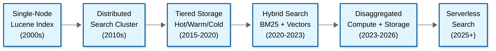

# 16.3 Design a Text Search Engine

## System Overview

A text search engine is a distributed information retrieval platform that ingests, indexes, stores, and queries massive corpora of semi-structured and unstructured text data, enabling sub-second full-text search, faceted navigation, relevance-ranked results, and real-time analytics across billions of documents. The core engineering challenge is building an indexing-and-retrieval pipeline that can ingest millions of documents per second, construct space-efficient inverted indexes with sub-linear query time, rank results by contextual relevance using statistical and neural scoring models, and distribute both the index and query workload across a horizontally scalable cluster---all while maintaining near-real-time visibility (documents searchable within one second of ingestion) and surviving node failures without data loss or query disruption. Unlike relational databases (which optimize for exact-match lookups on structured schemas) or key-value stores (which optimize for point reads by primary key), text search engines solve the fundamentally different problem of finding documents that *best match* a natural-language query across arbitrary text fields, requiring specialized data structures (inverted indexes, finite state transducers, skip lists), linguistic processing (tokenization, stemming, synonyms), and scoring algorithms (BM25, TF-IDF, learning-to-rank, hybrid neural-lexical fusion). Production search platforms like Elasticsearch power Wikipedia's 20+ billion monthly searches, handle GitHub's code search across 200M+ repositories, and serve eBay's product search across 1.9 billion listings. The defining architectural tension in text search is the four-way trade-off between indexing throughput, query latency, index freshness (near-real-time), and storage cost---where every decision about analyzers, refresh intervals, replica counts, and shard sizing cascades through every layer of the system.

---

## Key Characteristics

| Characteristic | Description |
|---|---|
| **Read Pattern** | Read-heavy (10:1 to 100:1 read-to-write ratio for user-facing search); queries range from simple keyword lookups (p50 < 10ms) to complex multi-clause boolean queries with aggregations (p99 < 500ms); result relevance matters more than result completeness---users expect the best 10 results on the first page, not all 50,000 matches |
| **Write Pattern** | Bulk ingestion of new documents, updates to existing documents (partial field updates), and deletions; writes must become searchable within 1 second (near-real-time); append-mostly with occasional updates; documents are immutable once written to a segment, updates create new versions |
| **Data Model** | Semi-structured documents with a mix of full-text fields (title, body, description), keyword fields (category, status, tags), numeric fields (price, rating), date fields, and nested objects; no fixed schema---different document types may have different fields; dynamic field mapping with type inference |
| **Indexing Strategy** | Per-field inverted index: full-text fields tokenized through configurable analysis chains (character filters, tokenizers, token filters); keyword fields indexed as exact terms; numeric and date fields indexed with BKD trees for range queries; optional vector fields indexed with HNSW graphs for semantic search |
| **Query Complexity** | Boolean queries (AND, OR, NOT), phrase queries (exact word sequences), fuzzy queries (edit distance tolerance), prefix/wildcard queries, range queries, geo-spatial queries, aggregations (terms, histograms, statistics), and hybrid lexical-plus-semantic search combining BM25 with vector similarity |
| **Relevance Model** | BM25 (probabilistic term frequency-inverse document frequency) as the default scoring function; field-level boosting; function scoring (decay functions for recency, geo-distance); learning-to-rank with gradient-boosted trees; hybrid scoring combining BM25 and dense vector similarity via reciprocal rank fusion |
| **Consistency Model** | Eventual consistency for search visibility (near-real-time, not real-time); strong consistency for document CRUD operations within a shard; primary-replica model where writes go to primary shard, then replicated asynchronously; read-after-write consistency achievable by refreshing the index or reading from the primary |

---

## Quick Navigation

| Document | Focus |
|---|---|
| [01 -- Requirements & Estimations](./01-requirements-and-estimations.md) | Functional requirements, capacity math for billions of documents, SLOs |
| [02 -- High-Level Design](./02-high-level-design.md) | Architecture, write path, read path, coordinator pattern, key decisions |
| [03 -- Low-Level Design](./03-low-level-design.md) | Inverted index internals, BM25 scoring, API design, analysis chains |
| [04 -- Deep Dives & Bottlenecks](./04-deep-dive-and-bottlenecks.md) | Segment merging, relevance tuning, distributed query execution, race conditions |
| [05 -- Scalability & Reliability](./05-scalability-and-reliability.md) | Horizontal scaling, shard allocation, replication, multi-region, disaster recovery |
| [06 -- Security & Compliance](./06-security-and-compliance.md) | Field-level security, document-level security, encryption, multi-tenancy isolation |
| [07 -- Observability](./07-observability.md) | Search latency metrics, slow query logging, shard health monitoring, cluster diagnostics |
| [08 -- Interview Guide](./08-interview-guide.md) | 45-min pacing, inverted index deep dive traps, relevance scoring discussion, scoring rubric |
| [09 -- Insights](./09-insights.md) | 12 non-obvious architectural insights unique to text search engine design |

---

## Complexity Rating: **Very High**

| Dimension | Rating | Justification |
|---|---|---|
| Data Model Complexity | High | Semi-structured documents with dynamic schemas; per-field analysis chains (tokenization, stemming, synonyms) add linguistic complexity; type conflicts across heterogeneous document collections; nested and parent-child document relationships |
| Write Path | High | Near-real-time indexing requires balancing refresh interval against throughput; segment merging competes for I/O with both indexing and querying; translog for durability adds write amplification; bulk indexing requires backpressure and retry logic |
| Read/Query Path | Very High | Distributed scatter-gather across shards with two-phase query-then-fetch; relevance scoring (BM25 + function scores + learning-to-rank) is computationally intensive; aggregations require full-shard traversal; hybrid lexical-plus-vector search adds a second retrieval dimension |
| Storage Architecture | High | Immutable Lucene segments with periodic merging; finite state transducer for term dictionary compression; stored fields for document retrieval; doc values for sorting and aggregation; BKD trees for numeric/geo range queries; HNSW graphs for vector search; each adds a separate on-disk structure |
| Operational Complexity | Very High | Shard sizing and allocation directly impact query latency and cluster stability; unbalanced shards create hot spots; segment merge storms can saturate disk I/O; mapping explosions from dynamic fields can OOM nodes; rolling upgrades require careful replica management |

---

## What Differentiates Naive vs. Production

| Dimension | Naive Approach | Production Reality |
|---|---|---|
| **Indexing** | Build a single inverted index in memory for all documents; full re-index on any change; no analysis chain---split on whitespace | Per-field inverted indexes built as immutable segments on disk; configurable analysis chains (character filters, tokenizers, token filters) per field; near-real-time refresh makes new documents searchable within 1 second; translog provides crash-recovery durability |
| **Search** | Sequential scan through all posting lists; no scoring beyond binary match; return all results unsorted | Two-phase query-then-fetch: first collect top-K doc IDs with scores from each shard, then fetch full documents for only the final result set; BM25 relevance scoring with field boosting; early termination when enough high-quality results are found |
| **Distribution** | Single-node index with full copy on each replica; all queries hit all replicas | Hash-based shard routing distributes documents across shards; coordinator node scatters query to relevant shards, gathers partial results, merges and re-ranks; adaptive replica selection routes to the shard copy with lowest queue depth |
| **Relevance** | TF-IDF with equal weight for all fields; no understanding of query intent | BM25 with field-level boosting, function scoring for recency/popularity, learning-to-rank models trained on click-through data, hybrid lexical-plus-vector scoring with reciprocal rank fusion; synonyms, stemming, and fuzzy matching for recall |
| **Schema** | Fixed schema required for all documents; reject documents with unknown fields | Dynamic field mapping with type inference; explicit mappings for critical fields; runtime fields for schema-on-read; type conflict resolution (first-write-wins within an index) |
| **Scaling** | Vertical scaling only; entire index must fit in memory | Horizontal scaling via sharding; time-based index rotation for append-heavy workloads; index lifecycle management for hot-warm-cold-frozen tiering; cross-cluster search for federated queries |
| **Multi-tenancy** | Single index for all users; no isolation | Per-tenant indexes for large tenants; shared indexes with document-level security for small tenants; per-tenant rate limiting and resource quotas; noisy-neighbor detection |
| **Observability** | Log query counts; no visibility into internal performance | Per-shard latency profiling; segment-level metrics; slow query log with full query body; distributed tracing from coordinator through data nodes; SLO-based alerting with error budgets |
| **Storage Tiering** | All data on same storage tier | Hot (NVMe SSD, active writes + reads), warm (HDD, read-only, force-merged), cold (searchable snapshots on object storage), frozen (on-demand fetch from object storage); ILM policies automate transitions |

---

## Key Terminology

| Term | Definition |
|---|---|
| **Inverted index** | A data structure that maps terms to the list of documents containing them, enabling fast full-text search |
| **Segment** | An immutable mini-index containing a subset of shard data; created during refresh; compacted during merge |
| **Shard** | A partition of an index; each shard is an independent Lucene index; distributes data across nodes |
| **Translog** | A write-ahead log that provides durability before segments are committed to disk |
| **Refresh** | The operation that makes newly indexed documents searchable by creating a new segment |
| **BM25** | The default probabilistic scoring algorithm; uses term frequency, inverse document frequency, and field-length normalization |
| **FST (Finite State Transducer)** | A compressed data structure for the term dictionary; enables O(key-length) lookups with minimal memory |
| **Doc values** | Column-oriented on-disk data used for sorting, aggregation, and scripting; the search engine equivalent of a columnar store |
| **Analysis chain** | A pipeline of character filters, tokenizer, and token filters that transforms raw text into indexed tokens |
| **Near-real-time (NRT)** | The property that documents become searchable within a configurable refresh interval (default: 1 second) |
| **Scatter-gather** | The distributed query pattern where a coordinator sends subqueries to all shards (scatter) and merges results (gather) |
| **Cross-cluster replication (CCR)** | Asynchronous replication of indexes from a leader cluster to follower clusters, typically for multi-region deployments |

---

## What Makes This System Unique

### The Inverted Index Is Not Just a Data Structure---It Is an Entire Storage Engine

Unlike B-trees (which are the storage engine for relational databases) or LSM trees (which are the storage engine for key-value stores), the inverted index is actually a *family* of co-located data structures that must work in concert: the term dictionary (stored as a finite state transducer for prefix-compressed O(key-length) lookups), posting lists (delta-encoded and bit-packed arrays of document IDs), stored fields (LZ4-compressed original documents for retrieval), doc values (column-oriented data for sorting and aggregation), norms (per-document field-length normalization factors for scoring), and optionally HNSW graphs (for approximate nearest-neighbor vector search). Each of these structures is independently built, independently compressed, and independently queried---but they must all be consistent within a segment. The Lucene segment is not a "file" but a mini-database with its own storage engine, and understanding segment lifecycle (creation, refresh, merge, delete) is essential to understanding text search engine performance.

### Relevance Is a First-Class Architectural Concern, Not a Feature

In a relational database, the query either matches or it doesn't. In a text search engine, every matching document has a *score* that determines its rank in the result set, and the difference between a good search engine and a great one is the quality of that score. BM25 scoring depends on three statistical properties that must be maintained at index time and recalculated during query execution: term frequency within the document, inverse document frequency across the corpus, and field-length normalization. Each of these creates architectural implications: IDF requires global statistics (which means distributed scoring needs either a pre-query DFS phase or per-shard approximation), field norms must be stored per-document (consuming 1 byte per field per document), and updates to the corpus change the IDF landscape (meaning the same query returns different rankings as documents are added or removed). Layering function scoring, learning-to-rank, and vector-based semantic similarity on top of BM25 creates a multi-stage ranking pipeline that is both the system's primary differentiator and its primary source of latency.

### Near-Real-Time Is a Specific Engineering Property, Not Just "Fast"

The term "near-real-time" in text search has a precise technical meaning: a document becomes searchable after the next *refresh* operation, which flushes the in-memory index buffer to a new, immutable Lucene segment. The default refresh interval is 1 second. This creates a fundamental tension: shorter refresh intervals mean faster visibility but create more small segments (which degrade query performance and increase merge overhead), while longer refresh intervals mean better throughput but longer visibility lag. The translog (transaction log) provides durability independently of the refresh cycle---a document is durable as soon as it is written to the translog, but it is not searchable until the next refresh. This separation of durability from searchability is a deliberate architectural choice that allows the system to optimize each concern independently, and understanding this distinction is critical for both system design and interview discussions.

### Disaggregated Storage Is Reshaping Search Cluster Economics

Traditional search clusters tightly couple compute (CPU/memory for query execution) with storage (local SSDs holding segment data). This coupling means scaling storage requires adding compute nodes, and scaling compute requires provisioning unnecessary storage. Modern search architectures are moving toward disaggregated storage: segment data lives in object storage, with a local cache on compute nodes for hot segments. This enables independent scaling of indexing throughput, query capacity, and storage volume---and transforms the cost model from "provision for peak" to "pay for actual usage." Searchable snapshots (where cold-tier indexes are served directly from object storage with an on-demand local cache) are the first production manifestation of this trend, reducing storage costs by 50-80% for time-based indexes older than 7 days. The full vision---where even hot-tier segments are stored remotely with a write-through cache---is the architectural direction that will define the next generation of search platforms.

### Quantized Vectors and Byte-Level Encodings Are Making Hybrid Search Economically Viable

Dense vector search (used for semantic/hybrid search) traditionally required float32 embeddings, consuming 3 KB per document for a 768-dimensional vector. At 2 billion documents, that is 6 TB just for vectors---often exceeding the inverted index itself. Scalar quantization (float32 → int8, 4x compression) and binary quantization (float32 → 1-bit, 32x compression with re-scoring) reduce this to 768 bytes or 96 bytes per document respectively, with less than 5% recall degradation when combined with re-scoring from the full-precision vectors. Matryoshka representation learning (MRL) takes a complementary approach: embeddings are trained so that truncated prefixes (e.g., the first 256 of 768 dimensions) remain useful, enabling progressive retrieval---fast initial filtering with short vectors, then re-ranking with full vectors. These techniques collectively reduce the storage and compute cost of hybrid search by 4-32x, removing the primary objection to deploying vector search alongside traditional BM25 in production.

---

## Related Patterns

Understanding text search engines benefits from knowledge of these related system designs, which share architectural patterns or interact directly in production architectures:

| Related System | Relationship | Link |
|---|---|---|
| **Web Crawlers** | Crawlers discover and fetch content that feeds into the search engine's indexing pipeline; politeness constraints and URL deduplication directly affect content freshness | [View](../16.1-web-crawlers/00-index.md) |
| **Time-Series Database** | Both use append-only storage with compaction/merge; TSDBs use inverted indexes for label lookups, sharing the cardinality explosion problem | [View](../16.2-time-series-database/00-index.md) |
| **Distributed Key-Value Store** | Search engines use KV-style get-by-ID for the fetch phase; the contrast between point lookups (KV) and ranked retrieval (search) illustrates fundamental storage engine trade-offs | [View](../1.3-distributed-key-value-store/00-index.md) |
| **Distributed Log-Based Broker** | Message brokers feed the indexing pipeline; backpressure, ordering guarantees, and exactly-once delivery affect search freshness and consistency | [View](../1.5-distributed-log-based-broker/00-index.md) |
| **Graph Database** | Knowledge graphs enhance search with entity relationships; graph traversal for query expansion and entity disambiguation complements keyword search | [View](../16.4-graph-database/00-index.md) |
| **Data Lakehouse Architecture** | Lakehouses store raw documents that search engines index; schema evolution in the lakehouse affects search mappings; both use immutable file-based storage | [View](../16.7-data-lakehouse-architecture/00-index.md) |
| **Change Data Capture (CDC)** | CDC pipelines stream database changes to search indexes, solving the dual-write problem; CDC lag directly determines search freshness for database-backed catalogs | [View](../16.8-change-data-capture-system/00-index.md) |
| **AI-Native Data Catalog & Governance** | Catalogs use search engines for metadata discovery; search quality directly determines catalog adoption; NL-to-SQL and semantic search share ranking infrastructure | [View](../16.10-ai-native-data-catalog-governance/00-index.md) |

---

## Historical Context and Evolution

| Era | Key Innovation | Impact |
|---|---|---|
| **1960s-1970s** | Boolean retrieval models | First automated text retrieval; AND/OR/NOT operators; no ranking |
| **1980s** | TF-IDF scoring (Salton) | First statistical relevance ranking; still no diminishing returns for repeated terms |
| **1990s** | BM25 (Robertson-Walker) | Probabilistic scoring with term saturation and length normalization; remains the default today |
| **2000s** | Lucene, Solr, Elasticsearch | Open-source full-text search engines; inverted index with immutable segments; near-real-time refresh |
| **2010s** | Distributed search at scale | Scatter-gather query execution; shard-based horizontal scaling; learning-to-rank; autocomplete |
| **2015-2020** | Dense vector search (word2vec, BERT) | Semantic search via embedding similarity; HNSW graphs for approximate nearest neighbor; hybrid lexical+vector search |
| **2020-2023** | Reciprocal Rank Fusion (RRF) | Standard method for combining lexical and semantic scores without normalization |
| **2023-2025** | Quantized vectors, disaggregated storage | Binary/scalar quantization reduces vector storage 4-32x; searchable snapshots decouple compute from storage; serverless search architectures |
| **2025-2026** | Synthetic _source, LogsDB mode, ESQL | Column-oriented storage for log workloads; SQL-like query language alongside JSON DSL; further compute-storage separation |

### Architecture Evolution Timeline

