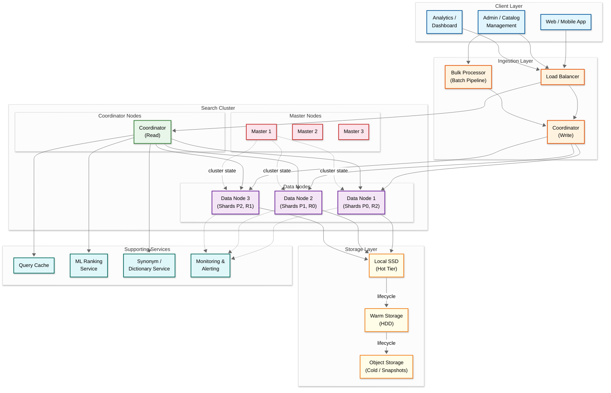
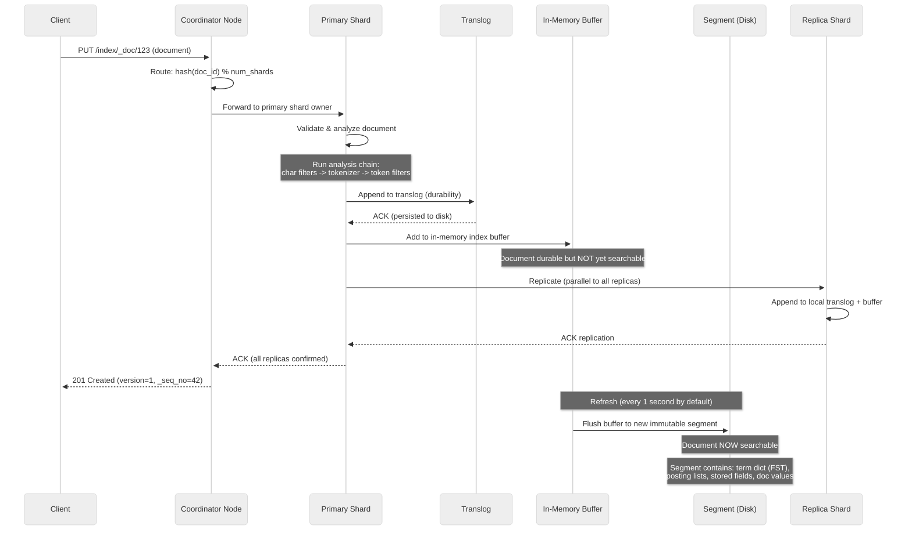
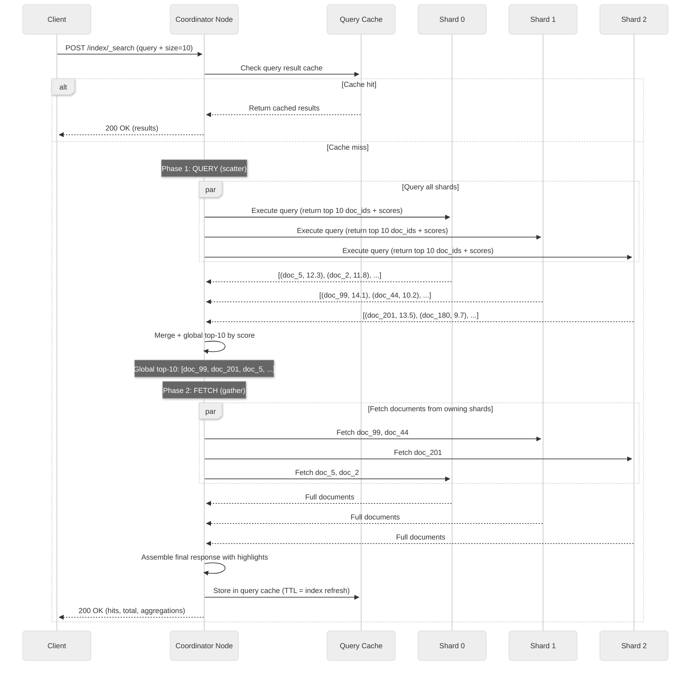
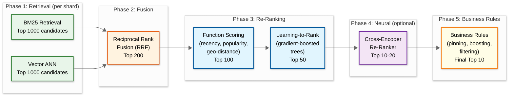
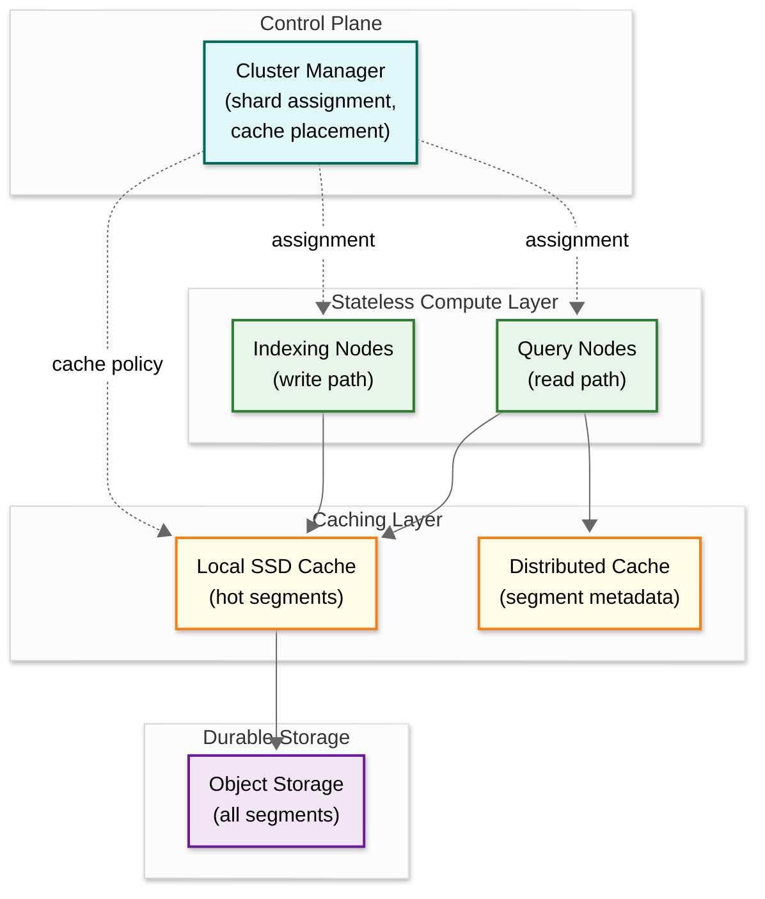

# 16.3 High-Level Design

## System Architecture

---

## Data Flow: Write Path (Indexing)

---

## Data Flow: Read Path (Search)

---

## Key Architectural Decisions

### 1. Coordinator-Based Scatter-Gather vs. Peer-to-Peer Query Routing

| Aspect | Peer-to-Peer | Coordinator Pattern (Chosen) |
|---|---|---|
| Query routing | Each node knows all shards, any node can scatter | Dedicated coordinator nodes handle query planning and merging |
| Resource isolation | Query execution competes with indexing on data nodes | Coordinators handle merge/sort without impacting data node indexing |
| Complexity | Lower (fewer node roles) | Higher (separate coordinator role) |
| Scalability | Limited (every node must handle coordination overhead) | Better (coordinators scale independently of data nodes) |
| **Decision** | | **Coordinator pattern**: separating coordination from data processing allows independent scaling; coordinators handle the CPU-intensive global merge and re-ranking without consuming data node resources; also provides a natural point for query caching and ML re-ranking |

### 2. Two-Phase Query-Then-Fetch vs. Single-Phase Query-and-Fetch

| Aspect | Single-Phase (Query-and-Fetch) | Two-Phase (Chosen) |
|---|---|---|
| Network round trips | 1 (query + full docs in one pass) | 2 (first doc IDs + scores, then fetch top-K docs) |
| Data transferred | Every shard sends full documents for its top-K | Only winning documents are fetched (saves bandwidth) |
| Result quality | Per-shard top-K may miss globally relevant docs | Global top-K from ID-only phase ensures best results |
| Latency | Lower for small result sets | Slightly higher (+1 RTT), but less data overall |
| **Decision** | | **Two-phase**: for a search engine returning 10-20 results from billions of documents across 50+ shards, transferring full documents from every shard would waste 95%+ of bandwidth; the two-phase approach transfers only ~500 bytes per shard in the query phase (doc_id + score) vs. ~50 KB per result in single-phase |

### 3. Inverted Index with Segments vs. B-Tree Index

| Aspect | B-Tree | Inverted Index with Segments (Chosen) |
|---|---|---|
| Update model | In-place updates; mutable | Append-only immutable segments; merging |
| Write throughput | Moderate (random I/O for updates) | Very high (sequential I/O for segment writes) |
| Full-text search | Poor (B-trees don't support term-frequency scoring) | Excellent (posting lists with term stats enable BM25) |
| Concurrency | Lock-based (read-write contention) | Lock-free reads (segments are immutable) |
| Space efficiency | Moderate | High (delta-encoded posting lists, FST term dictionary) |
| **Decision** | | **Inverted index with immutable segments**: the fundamental design choice for text search; immutability enables lock-free concurrent reads, sequential I/O for writes, and compact compression; the merge tax is the accepted trade-off for these benefits |

### 4. Scoring: BM25 vs. TF-IDF vs. Neural

| Aspect | TF-IDF | BM25 (Chosen as Default) | Neural (Dense Vectors) |
|---|---|---|---|
| Term saturation | Linear (no diminishing returns) | Logarithmic (diminishing returns after ~5 occurrences) | N/A (semantic similarity) |
| Document length normalization | Basic | Configurable (k1, b parameters) | N/A |
| Semantic understanding | None (lexical only) | None (lexical only) | High (understands synonyms, context) |
| Latency | Very fast | Very fast | Slower (ANN search + re-ranking) |
| **Decision** | | **BM25 as default with optional hybrid**: BM25's term saturation and length normalization produce significantly better rankings than TF-IDF for general text search; neural search via dense vectors is offered as an opt-in hybrid mode using reciprocal rank fusion (RRF) for use cases requiring semantic understanding |

### 5. Shard Routing Strategy

| Aspect | Random Routing | Hash-Based Routing (Chosen) |
|---|---|---|
| Document distribution | Requires broadcast for get-by-ID | Deterministic: hash(doc_id) % num_shards |
| Get-by-ID efficiency | O(N) shards queried | O(1) single shard |
| Search query | Scatter to all shards (same) | Scatter to all shards (same) |
| Data balance | Statistically even | Statistically even (with consistent hashing) |
| **Decision** | | **Hash-based routing**: deterministic routing enables O(1) get-by-ID lookups (critical for the fetch phase) and ensures even document distribution; search queries still scatter to all shards regardless of routing |

---

## Architecture Pattern Checklist

| Pattern | Decision | Justification |
|---|---|---|
| Sync vs Async communication | **Sync** for search queries, **Async** for bulk indexing | Search requires synchronous response; bulk indexing benefits from async batching and backpressure |
| Event-driven vs Request-response | **Request-response** for search, **event-driven** for index lifecycle | Interactive search is request-response; segment merging, shard rebalancing, and tier migration are event-driven background operations |
| Push vs Pull model | **Push** for indexing (client pushes documents), **Pull** for replication (replicas pull from primary) | Clients know when documents change; replicas pull the operation log from the primary shard for replication |
| Stateless vs Stateful services | **Stateless** coordinators, **stateful** data nodes | Coordinators hold no persistent state (only transient query context); data nodes own shard data and translogs |
| Read-heavy vs Write-heavy | **Read-heavy** (10:1 to 100:1) | User-facing search traffic dominates; optimize query path first, then indexing throughput |
| Real-time vs Batch processing | **Near-real-time** indexing, **batch** for bulk re-index and lifecycle management | 1-second refresh for NRT visibility; bulk API for initial load and re-indexing; lifecycle management as periodic batch |
| Edge vs Origin processing | **Edge** for query caching and autocomplete, **Origin** for full search execution | CDN/edge caches for autocomplete suggestions and popular query results; full search execution at origin cluster |

---

## Component Interaction Summary

### Coordinator Nodes
- **Stateless** query and indexing routers. Receive client requests, determine target shards via routing hash, scatter subqueries to data nodes, gather partial results, perform global merge/sort/re-rank, and return the final response. Maintain a query result cache (keyed by query hash, invalidated on index refresh). For indexing, route documents to the correct primary shard based on `hash(doc_id) % num_primary_shards`.

### Data Nodes
- **Stateful** nodes that host primary and replica shards. Each shard is a self-contained Lucene index. Data nodes handle: document analysis (running the analysis chain), translog writes (durability), in-memory buffer management, segment refresh (making documents searchable), segment merging (compacting small segments), and local query execution against their shards. Data nodes report shard health and resource utilization to the master.

### Master Nodes
- **Cluster state managers** (quorum of 3 for split-brain prevention). Maintain the cluster state: index metadata (mappings, settings), shard allocation table (which shard lives on which node), and node membership. Master nodes do NOT handle data or queries. They make allocation decisions (assigning unassigned shards, rebalancing across nodes) and propagate cluster state updates to all nodes.

### Bulk Processor
- **Batching and pipeline service** for high-volume catalog ingestion. Receives bulk indexing requests from catalog management systems, validates documents, applies ingest pipeline transformations (enrichment, normalization), and routes batches to the appropriate coordinator for primary shard routing. Implements backpressure via queue depth monitoring.

### ML Ranking Service
- **Sidecar or microservice** for learning-to-rank re-scoring. After the coordinator receives BM25-scored results from the query phase, it optionally forwards the top-N candidates (N=100-1000) to the ML ranking service for re-scoring using gradient-boosted trees or neural re-rankers. The ML service returns re-ordered scores, and the coordinator applies the final top-K selection.

### Synonym / Dictionary Service
- **Shared reference data** for query expansion. At query time, the coordinator optionally expands the user's query using synonym mappings (e.g., "laptop" -> "laptop OR notebook OR computer") and spell-correction dictionaries. Managed as a separate service to enable updates without re-indexing.

---

## Multi-Stage Ranking Pipeline

**Latency budget per phase:**

| Phase | Latency | Candidates In | Candidates Out |
|---|---|---|---|
| BM25 retrieval | 5-15ms | All docs in shard | 1,000 |
| Vector ANN retrieval | 5-20ms | All vectors in shard | 1,000 |
| RRF fusion | <1ms (coordinator) | 2,000 × N shards | 200 |
| Function scoring | 1-3ms | 200 | 100 |
| Learning-to-rank | 5-15ms | 100 | 50 |
| Cross-encoder (optional) | 10-50ms | 50 | 10-20 |
| Business rules | <1ms | 10-20 | 10 |
| **Total** | **27-105ms** | | |

---

## Disaggregated Storage Architecture

Modern search engines are evolving from coupled compute-storage to disaggregated architectures. This section describes the emerging pattern:

**Key differences from traditional architecture:**

| Aspect | Traditional (Coupled) | Disaggregated |
|---|---|---|
| Scaling | Add node = add compute + storage | Scale compute and storage independently |
| Cost model | Provision for peak; idle nodes waste both compute and storage | Pay for compute when active; storage is always-on, cheap |
| Recovery | Copy segment files from replica (minutes to hours) | Assign shard to new node; cache warms from object storage (seconds to minutes) |
| Storage cost | NVMe SSD for all tiers ($0.10-0.25/GB/mo) | Object storage for bulk ($0.01-0.02/GB/mo); local SSD only for cache |
| Durability | Replicas on separate nodes | Object storage provides 11-nines durability natively |
| Cold queries | Requires warm/cold nodes with local copies | Fetch from object storage on demand; cache for repeat access |

---

## Case Studies

### Case Study 1: E-Commerce Product Search (Shopify-Scale)

**Problem:** 100M+ products across 2M+ merchants, each with unique schemas, requiring sub-50ms search with per-merchant relevance.

**Architecture decisions:**
- **Index-per-merchant for large merchants** (>100K products): dedicated indexes with custom mappings and analysis chains
- **Shared index with routing for small merchants**: `routing=merchant_id` ensures co-location; document-level security filters per merchant
- **Time-weighted scoring**: `function_score` with exponential decay on `updated_at` to surface fresh inventory
- **Autocomplete via edge n-grams**: separate `title.suggest` field with `edge_ngram(1,20)` tokenizer for type-ahead
- **Flash sale handling**: dedicated indexing pipeline with priority queue; coordinator-level circuit breaker rejects complex aggregations during peak

**Results:** p50 search latency 12ms, p99 45ms across 100M products; 99.995% availability; 3x traffic spikes during sales handled without degradation.

### Case Study 2: Code Search (GitHub-Scale)

**Problem:** Full-text search across 200M+ repositories, supporting regex, exact-match identifiers, and file-path filtering with near-real-time updates on push.

**Architecture decisions:**
- **Custom tokenizer for code**: preserves camelCase splitting, dot-separated identifiers, and special characters (`::`, `->`, `.`) that standard text analyzers would discard
- **Trigram index for regex**: code search requires regex support; trigram index (3-character n-grams) enables pre-filtering to reduce regex execution to matching documents only
- **Repository-level routing**: `routing=repo_id` ensures all files for a repo are co-located on the same shard, enabling efficient "search within repo" queries
- **Separate indexes for code, issues, and PRs**: different analysis chains, update frequencies, and query patterns
- **Incremental indexing on git push**: CDC from repository events triggers indexing of changed files only, not the entire repo

**Results:** Sub-second search across 200M+ repositories; regex queries complete in under 2 seconds for 95% of cases.

### Case Study 3: Log Analytics Search (Observability-Scale)

**Problem:** 50 TB/day of log ingestion, 90-day retention, supporting ad-hoc queries across arbitrary fields with sub-10-second response.

**Architecture decisions:**
- **Time-based index rotation**: daily indexes (`logs-2026.03.20`) with automatic rollover; 7 days hot (SSD), 30 days warm (HDD), 90 days cold (searchable snapshots on object storage)
- **LogsDB index mode**: column-oriented storage with synthetic `_source` reconstruction from doc values, reducing storage by 40-60% compared to traditional stored fields
- **Aggressive refresh interval**: 5-second refresh for logs (freshness less critical than throughput)
- **Minimal replicas for hot tier**: 0 replicas during peak ingestion (translog provides durability); 1 replica added after rollover
- **Frozen tier for long retention**: searchable snapshots serve queries directly from object storage; acceptable latency of 5-30 seconds for historical queries

**Results:** 50 TB/day ingestion sustained; 90-day queryable retention at 60% lower storage cost than fully replicated; p95 query latency 3 seconds for 7-day queries, 15 seconds for 90-day queries.

### Case Study 4: Wikipedia Search

**Problem:** 60M+ articles across 300+ languages, serving 20B+ monthly searches with sub-100ms latency globally.

**Architecture decisions:**
- **Per-language indexes**: each language has its own analyzer (stemmers, stop words, tokenizers differ dramatically between languages)
- **Cross-language search**: query expansion using inter-language links (Wikidata entity mapping) to find relevant articles in the target language
- **Completion suggester**: FST-based prefix completion for article titles, weighted by page view popularity
- **Multi-region deployment**: read replicas in each geographic region; writes flow to a primary region and replicate asynchronously
- **Custom BM25 tuning**: `k1=1.2, b=0.75` with field boosts: title^5, headings^3, body^1, categories^2

**Results:** p50 search latency 30ms; 99.99% availability; supports 300+ languages with language-specific analysis chains.
