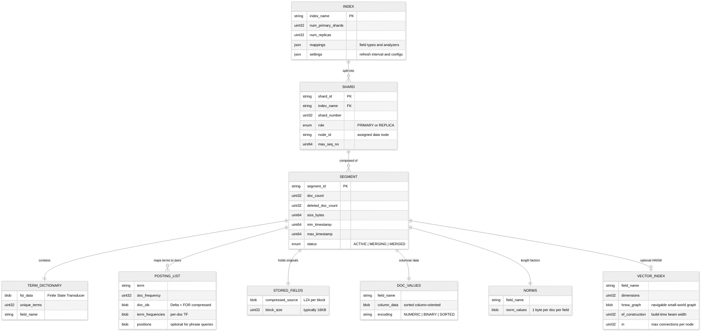

# 16.3 Low-Level Design

## Data Model

### Document Schema

```
SearchDocument {
    // --- Identity ---
    _id:                string          // Document unique ID (user-provided or auto-generated)
    _index:             string          // Index name (e.g., "products-v2")
    _version:           uint64          // Monotonically increasing version for optimistic concurrency
    _seq_no:            uint64          // Sequence number within the shard (for replication)
    _primary_term:      uint64          // Primary shard generation (for conflict detection)
    _routing:           string          // Custom routing value (defaults to _id)

    // --- Source Document ---
    _source: {                          // Original JSON document (stored, not indexed)
        title:          string          // Full-text analyzed field
        description:    string          // Full-text analyzed field (longer text)
        category:       string          // Keyword field (exact match, aggregatable)
        brand:          string          // Keyword field
        price:          float64         // Numeric field (range queries, sorting)
        rating:         float32         // Numeric field
        tags:           list<string>    // Multi-value keyword field
        location:       geo_point       // Latitude/longitude for geo queries
        created_at:     datetime        // Date field (range queries, sorting)
        updated_at:     datetime        // Date field
        in_stock:       boolean         // Boolean field (filtering)
        attributes:     map<string,any> // Dynamic nested fields
        embedding:      float32[768]    // Dense vector for semantic search (optional)
    }
}
```

### Index Segment Data Model



### Storage Layout

```
/data/{node_id}/
    indices/
        {index_uuid}/
            {shard_number}/
                index/
                    segments_N              # Segment infos (active segment list)
                    _0.cfs                  # Compound segment file (small segments)
                    _1.si                   # Segment info
                    _1.fdx                  # Stored field index
                    _1.fdt                  # Stored field data (LZ4-compressed)
                    _1.tip                  # Term index (FST root pointers)
                    _1.tim                  # Term dictionary (FST data)
                    _1.doc                  # Frequencies (term frequencies per doc)
                    _1.pos                  # Positions (term positions for phrases)
                    _1.dvd                  # Doc values data
                    _1.dvm                  # Doc values metadata
                    _1.nvd                  # Norms data
                    _1.nvm                  # Norms metadata
                    _1.kdd                  # BKD tree data (points/numerics)
                    _1.kdm                  # BKD tree metadata
                    _1.vec                  # Vector data (HNSW graph)
                    _1.vem                  # Vector metadata
                    _1_Lucene90_0.liv       # Live docs bitset (deleted doc tracking)
                translog/
                    translog-1.tlog         # Transaction log entries
                    translog-2.tlog
                    translog.ckp            # Translog checkpoint
                _state/
                    state-0.st              # Shard-level metadata
```

---

## Analysis Chain Design

### Text Analysis Pipeline

```
FUNCTION analyze(text: string, analyzer: AnalyzerConfig) -> List<Token>:
    // Phase 1: Character Filters (operate on raw character stream)
    char_stream = text
    FOR filter IN analyzer.char_filters:
        IF filter.type == "html_strip":
            char_stream = remove_html_tags(char_stream)
        ELSE IF filter.type == "pattern_replace":
            char_stream = regex_replace(char_stream, filter.pattern, filter.replacement)
        ELSE IF filter.type == "mapping":
            char_stream = apply_char_mapping(char_stream, filter.mappings)

    // Phase 2: Tokenizer (split into tokens)
    IF analyzer.tokenizer == "standard":
        tokens = unicode_word_tokenize(char_stream)     // UAX#29 word boundaries
    ELSE IF analyzer.tokenizer == "whitespace":
        tokens = split(char_stream, " ")
    ELSE IF analyzer.tokenizer == "ngram":
        tokens = generate_ngrams(char_stream, analyzer.min_gram, analyzer.max_gram)
    ELSE IF analyzer.tokenizer == "edge_ngram":
        tokens = generate_edge_ngrams(char_stream, analyzer.min_gram, analyzer.max_gram)
        // "search" -> ["s", "se", "sea", "sear", "searc", "search"] (for autocomplete)

    // Phase 3: Token Filters (transform individual tokens)
    FOR filter IN analyzer.token_filters:
        IF filter.type == "lowercase":
            tokens = [lowercase(t) for t in tokens]
        ELSE IF filter.type == "stop":
            tokens = [t for t in tokens if t not in STOP_WORDS]
        ELSE IF filter.type == "stemmer":
            tokens = [stem(t, filter.language) for t in tokens]
            // "running" -> "run", "better" -> "better" (irregular)
        ELSE IF filter.type == "synonym":
            expanded = []
            FOR t IN tokens:
                expanded.append(t)
                IF t IN filter.synonym_map:
                    expanded.extend(filter.synonym_map[t])
            tokens = expanded
        ELSE IF filter.type == "ascii_folding":
            tokens = [ascii_fold(t) for t in tokens]
            // "cafe" (with accent) -> "cafe"

    RETURN tokens
```

### Predefined Analyzers

| Analyzer | Char Filters | Tokenizer | Token Filters | Use Case |
|---|---|---|---|---|
| `standard` | None | Standard (UAX#29) | Lowercase | General-purpose full-text |
| `english` | None | Standard | Lowercase, Stop (English), Stemmer (English) | English language text |
| `keyword` | None | Keyword (no-op) | None | Exact match (categories, tags) |
| `autocomplete` | None | Edge N-gram (1-20) | Lowercase | Prefix completion suggestions |
| `html_content` | HTML Strip | Standard | Lowercase, Stop, Stemmer | Web page content |

---

## Inverted Index Construction

```
FUNCTION build_segment(documents: List<Document>, mappings: FieldMappings) -> Segment:
    // Per-field structures
    term_postings = HashMap<(field, term), PostingList>()
    doc_values = HashMap<field, ColumnBuilder>()
    stored_fields = BlockCompressor(block_size=16KB)
    norms = HashMap<field, List<uint8>>()
    bkd_builders = HashMap<field, BKDTreeBuilder>()
    hnsw_builders = HashMap<field, HNSWGraphBuilder>()

    FOR doc_id, doc IN enumerate(documents):
        // Store original document (compressed)
        stored_fields.add(doc_id, lz4_compress(serialize(doc._source)))

        FOR field_name, value IN doc._source.fields():
            field_type = mappings.get_type(field_name)

            IF field_type == FULL_TEXT:
                tokens = analyze(value, mappings.get_analyzer(field_name))
                // Track field length for BM25 normalization
                norms[field_name].append(encode_norm(len(tokens)))
                FOR position, token IN enumerate(tokens):
                    posting = term_postings.get_or_create((field_name, token))
                    posting.add(doc_id, term_freq=1, position=position)

            ELSE IF field_type == KEYWORD:
                posting = term_postings.get_or_create((field_name, value))
                posting.add(doc_id)
                doc_values[field_name].add(doc_id, value)

            ELSE IF field_type == NUMERIC or field_type == DATE:
                bkd_builders[field_name].add(doc_id, value)
                doc_values[field_name].add(doc_id, value)

            ELSE IF field_type == GEO_POINT:
                bkd_builders[field_name].add(doc_id, encode_geo(value))

            ELSE IF field_type == DENSE_VECTOR:
                hnsw_builders[field_name].add(doc_id, value)

    // Build compressed posting lists
    compressed_postings = {}
    FOR (field, term), posting IN term_postings:
        sorted_ids = sort(posting.doc_ids)
        deltas = compute_deltas(sorted_ids)
        compressed_postings[(field, term)] = {
            doc_ids: for_compress(deltas),   // Frame-of-Reference encoding
            term_freqs: vint_encode(posting.term_freqs),
            positions: vint_encode(posting.positions) IF field.index_positions
        }

    // Build FST term dictionaries per field
    fsts = {}
    FOR field IN unique_fields(term_postings):
        terms_sorted = sorted(unique_terms(term_postings, field))
        fsts[field] = build_fst(terms_sorted)  // Prefix-compressed automaton

    RETURN Segment(
        fsts, compressed_postings, stored_fields.flush(),
        doc_values, norms, bkd_builders, hnsw_builders,
        metadata=SegmentMetadata(doc_count=len(documents))
    )
```

**Complexity**: O(N * F * T) where N = documents, F = fields, T = tokens per field. Typical segment: 50K-500K documents, built in 1-5 seconds.

---

## BM25 Scoring Algorithm

```
FUNCTION bm25_score(query_terms: List<string>, document: DocID, field: string,
                    index_stats: IndexStats, k1: float = 1.2, b: float = 0.75) -> float:
    // BM25 parameters:
    //   k1: term frequency saturation (1.2 = moderate saturation)
    //   b:  field length normalization (0.75 = moderate normalization)

    score = 0.0
    avg_field_length = index_stats.avg_field_length(field)
    doc_field_length = index_stats.field_length(document, field)  // from norms
    total_docs = index_stats.total_doc_count

    FOR term IN query_terms:
        // Term frequency in this document (from posting list)
        tf = term_frequency(document, term, field)
        IF tf == 0:
            CONTINUE

        // Document frequency (number of documents containing this term)
        df = doc_frequency(term, field)

        // Inverse Document Frequency
        //   IDF = log(1 + (N - df + 0.5) / (df + 0.5))
        idf = log(1 + (total_docs - df + 0.5) / (df + 0.5))

        // Term frequency saturation
        //   Numerator: tf * (k1 + 1)
        //   Denominator: tf + k1 * (1 - b + b * dl/avgdl)
        tf_norm = (tf * (k1 + 1)) / (tf + k1 * (1 - b + b * (doc_field_length / avg_field_length)))

        score += idf * tf_norm

    RETURN score

    // Example:
    //   Query: "wireless bluetooth headphones"
    //   Document field length: 8 tokens, avg: 12 tokens
    //   "wireless" appears 2x in doc, in 50K of 1M docs
    //   IDF = log(1 + (1M - 50K + 0.5) / (50K + 0.5)) = 2.94
    //   tf_norm = (2 * 2.2) / (2 + 1.2 * (1 - 0.75 + 0.75 * 8/12)) = 1.63
    //   Score for "wireless" = 2.94 * 1.63 = 4.79
```

### Multi-Field Scoring with Boosting

```
FUNCTION multi_field_score(query: string, doc: DocID, field_boosts: Map<string, float>) -> float:
    // Score across multiple fields with per-field boosting
    // Strategy: take the maximum score across all fields (dis_max)

    best_score = 0.0
    FOR field, boost IN field_boosts:
        // field_boosts example: {title: 3.0, description: 1.0, tags: 2.0}
        field_score = bm25_score(tokenize(query), doc, field) * boost
        best_score = max(best_score, field_score)

    // Optionally add tie-breaking from other fields
    tie_breaker = 0.1
    other_scores = sum(bm25_score(tokenize(query), doc, f) * b
                       for f, b in field_boosts if f != best_field) * tie_breaker

    RETURN best_score + other_scores
```

---

## API Design

### Indexing API

```
// --- Index a single document ---
PUT /{index}/_doc/{id}
Headers:
    Content-Type: application/json
    Authorization: Bearer {api_key}
Body: {
    "title": "Wireless Bluetooth Headphones",
    "description": "Premium over-ear headphones with active noise cancellation...",
    "category": "electronics",
    "brand": "AudioPro",
    "price": 149.99,
    "rating": 4.5,
    "tags": ["wireless", "bluetooth", "noise-cancelling"],
    "in_stock": true
}
Query Parameters:
    ?routing=custom_value           // Custom shard routing
    ?refresh=wait_for               // Block until searchable (NRT)
    ?pipeline=enrichment            // Ingest pipeline to apply
Response:
    201 Created
    {
        "_index": "products",
        "_id": "prod_12345",
        "_version": 1,
        "_seq_no": 42,
        "_primary_term": 1,
        "result": "created"
    }

// --- Bulk indexing ---
POST /_bulk
Content-Type: application/x-ndjson
Body:
    {"index": {"_index": "products", "_id": "1"}}
    {"title": "Wireless Mouse", "price": 29.99, ...}
    {"index": {"_index": "products", "_id": "2"}}
    {"title": "Mechanical Keyboard", "price": 89.99, ...}
    {"delete": {"_index": "products", "_id": "3"}}
Response:
    200 OK
    {
        "took": 30,
        "errors": false,
        "items": [
            {"index": {"_id": "1", "status": 201, "result": "created"}},
            {"index": {"_id": "2", "status": 201, "result": "created"}},
            {"delete": {"_id": "3", "status": 200, "result": "deleted"}}
        ]
    }
```

### Search API

```
// --- Full-text search with filters, boosting, and aggregations ---
POST /{index}/_search
Body: {
    "query": {
        "bool": {
            "must": [
                {
                    "multi_match": {
                        "query": "wireless headphones",
                        "fields": ["title^3", "description", "tags^2"],
                        "type": "best_fields",
                        "tie_breaker": 0.1
                    }
                }
            ],
            "filter": [
                {"term": {"category": "electronics"}},
                {"range": {"price": {"gte": 50, "lte": 200}}},
                {"term": {"in_stock": true}}
            ]
        }
    },
    "sort": [
        {"_score": "desc"},
        {"rating": "desc"}
    ],
    "from": 0,
    "size": 10,
    "highlight": {
        "fields": {
            "title": {},
            "description": {"fragment_size": 150}
        }
    },
    "aggs": {
        "brands": {
            "terms": {"field": "brand", "size": 10}
        },
        "price_ranges": {
            "range": {
                "field": "price",
                "ranges": [
                    {"to": 50},
                    {"from": 50, "to": 100},
                    {"from": 100, "to": 200},
                    {"from": 200}
                ]
            }
        },
        "avg_rating": {
            "avg": {"field": "rating"}
        }
    }
}
Response: {
    "took": 15,
    "timed_out": false,
    "_shards": {"total": 5, "successful": 5, "skipped": 0, "failed": 0},
    "hits": {
        "total": {"value": 1847, "relation": "eq"},
        "max_score": 14.23,
        "hits": [
            {
                "_index": "products",
                "_id": "prod_12345",
                "_score": 14.23,
                "_source": {
                    "title": "Wireless Bluetooth Headphones",
                    "description": "Premium over-ear headphones...",
                    "price": 149.99,
                    "rating": 4.5
                },
                "highlight": {
                    "title": ["<em>Wireless</em> Bluetooth <em>Headphones</em>"]
                }
            }
        ]
    },
    "aggregations": {
        "brands": {
            "buckets": [
                {"key": "AudioPro", "doc_count": 342},
                {"key": "SoundMax", "doc_count": 256}
            ]
        },
        "price_ranges": {
            "buckets": [
                {"key": "*-50.0", "doc_count": 823},
                {"key": "50.0-100.0", "doc_count": 512},
                {"key": "100.0-200.0", "doc_count": 389},
                {"key": "200.0-*", "doc_count": 123}
            ]
        },
        "avg_rating": {"value": 4.12}
    }
}

// --- Hybrid search (lexical + semantic) ---
POST /{index}/_search
Body: {
    "query": {
        "hybrid": {
            "queries": [
                {
                    "multi_match": {
                        "query": "noise cancelling headphones for travel",
                        "fields": ["title^3", "description"]
                    }
                },
                {
                    "knn": {
                        "field": "embedding",
                        "query_vector": [0.12, -0.34, ...],   // 768-dim
                        "k": 50
                    }
                }
            ],
            "rank": {
                "rrf": {
                    "window_size": 100,
                    "rank_constant": 60
                }
            }
        }
    },
    "size": 10
}
```

### Autocomplete API

```
// --- Prefix-based completion ---
POST /{index}/_search
Body: {
    "suggest": {
        "product_suggest": {
            "prefix": "wire",
            "completion": {
                "field": "title.suggest",
                "size": 5,
                "fuzzy": {"fuzziness": 1}
            }
        }
    }
}
Response: {
    "suggest": {
        "product_suggest": [
            {
                "text": "wire",
                "options": [
                    {"text": "Wireless Bluetooth Headphones", "_score": 12.0},
                    {"text": "Wireless Gaming Mouse", "_score": 10.5},
                    {"text": "Wireless Charger Pad", "_score": 8.2}
                ]
            }
        ]
    }
}
```

---

## Partitioning & Sharding

### Shard Routing

```
shard_number = hash(routing_value) % num_primary_shards

// Default: routing_value = document _id
// Custom: routing_value = user-specified (e.g., tenant_id)
// hash function: murmur3 (fast, good distribution)
```

### Shard Sizing Guidelines

| Guideline | Value | Rationale |
|---|---|---|
| Target shard size | 10-50 GB | Shards < 10 GB waste coordinator overhead; shards > 50 GB slow recovery and rebalancing |
| Max shards per node | 20 per GB of heap | Too many shards consume heap for segment metadata and file handles |
| Shard count formula | `ceil(total_data_size / target_shard_size)` | Ensure even distribution; over-sharding is worse than under-sharding |
| Time-based index rotation | Daily or weekly indexes for append-heavy workloads | Old indexes can be force-merged, shrunk, and moved to warm/cold tiers |

### Index Lifecycle Management

```
FUNCTION manage_index_lifecycle(index_pattern: string, policy: LifecyclePolicy):
    // Phase 1: Hot (active writes + reads)
    //   - Primary + replicas on SSD nodes
    //   - Refresh interval: 1 second
    //   - Max age: 7 days or max size: 50 GB per shard

    // Phase 2: Warm (read-only, less frequent queries)
    //   - Move to HDD nodes
    //   - Force-merge to 1 segment per shard (reduce merge overhead)
    //   - Shrink shard count (e.g., 5 -> 1)
    //   - Reduce replicas from 2 to 1

    // Phase 3: Cold (infrequent queries, cost-optimized)
    //   - Searchable snapshot on object storage
    //   - No local replicas (object storage provides durability)
    //   - Queries may take seconds instead of milliseconds

    // Phase 4: Delete
    //   - Remove after retention period (e.g., 365 days)
    //   - Audit log before deletion
```

---

## Distributed Query Execution Internals

### Query Parsing and Planning

```
FUNCTION parse_and_plan(query_json: JSON, coordinator: CoordinatorNode) -> ExecutionPlan:
    // Step 1: Parse JSON query DSL into a query tree
    query_tree = parse_query_dsl(query_json)
    // query_tree: BoolQuery(must=[MatchQuery("wireless headphones", ["title", "description"]),
    //                       filter=[TermQuery("category", "electronics"),
    //                               RangeQuery("price", gte=50, lte=200)])

    // Step 2: Rewrite query tree (optimizations)
    rewritten = rewrite_pass(query_tree):
        // - Flatten nested bool queries
        // - Move pure filters (no scoring) to filter context (skip scoring, enable caching)
        // - Expand synonyms if synonym service configured
        // - Rewrite prefix queries as term unions if field is small cardinality

    // Step 3: Determine target shards
    target_shards = coordinator.routing_table.resolve(query_json.index):
        // - If custom routing specified: hash(routing) % num_shards -> single shard
        // - If no routing: all primary shards (or replicas via adaptive selection)
        // - Can-match optimization: skip shards whose min/max time range doesn't overlap query

    // Step 4: Build execution plan
    RETURN ExecutionPlan(
        query=rewritten,
        target_shards=target_shards,
        search_type=query_json.search_type,  // "query_then_fetch" or "dfs_query_then_fetch"
        from=query_json.from,
        size=query_json.size,
        timeout=query_json.timeout,
        aggregations=parse_aggregations(query_json.aggs),
        suggest=parse_suggestions(query_json.suggest)
    )
```

### Posting List Intersection Algorithms

```
FUNCTION intersect_posting_lists(lists: List<PostingList>) -> PostingList:
    // For AND queries: find documents present in ALL posting lists
    // Strategy depends on posting list sizes

    // Sort by ascending document frequency (smallest list first)
    sorted_lists = sort_by_doc_count(lists)

    IF sorted_lists[0].doc_count < 128:
        // Small leading list: use leap-frog / galloping intersection
        RETURN galloping_intersect(sorted_lists)
    ELSE:
        // Large lists: use skip-pointer intersection with SIMD acceleration
        RETURN skip_intersect(sorted_lists)

FUNCTION galloping_intersect(lists: List<PostingList>) -> PostingList:
    // Walk the smallest list; for each doc_id, gallop (binary search) in larger lists
    result = []
    smallest = lists[0]
    rest = lists[1:]

    FOR doc_id IN smallest:
        found_in_all = TRUE
        FOR list IN rest:
            IF NOT list.advance_to(doc_id):  // Skip-pointer / galloping search
                found_in_all = FALSE
                BREAK
        IF found_in_all:
            result.append(doc_id)

    RETURN result
    // Complexity: O(N * log(M)) where N = smallest list, M = largest list
    // Galloping finds the target in O(log(distance)) instead of O(M) for linear scan

FUNCTION union_posting_lists(lists: List<PostingList>) -> PostingList:
    // For OR queries: merge all posting lists, accumulate scores
    // Use a min-heap for efficient k-way merge
    heap = MinHeap()
    FOR i, list IN enumerate(lists):
        IF list.has_next():
            heap.push((list.next_doc_id(), i))

    result = []
    WHILE NOT heap.empty():
        current_doc_id = heap.peek().doc_id
        combined_score = 0.0

        // Drain all lists at current_doc_id
        WHILE NOT heap.empty() AND heap.peek().doc_id == current_doc_id:
            (doc_id, list_idx) = heap.pop()
            combined_score += bm25_score(doc_id, lists[list_idx])
            IF lists[list_idx].has_next():
                heap.push((lists[list_idx].next_doc_id(), list_idx))

        result.append((current_doc_id, combined_score))

    RETURN result
```

### Vector Search with HNSW

```
FUNCTION hnsw_search(query_vector: float32[D], index: HNSWGraph,
                     k: int, ef_search: int = 100) -> List<(DocID, float)>:
    // HNSW: Hierarchical Navigable Small World graph
    // ef_search: beam width (higher = better recall, slower)

    // Start at the top layer's entry point
    entry_point = index.entry_node
    current_layer = index.max_layer

    // Phase 1: Greedy search through upper layers (coarse navigation)
    WHILE current_layer > 0:
        entry_point = greedy_search(query_vector, entry_point, current_layer, ef=1)
        current_layer -= 1

    // Phase 2: Beam search at layer 0 (fine-grained)
    candidates = MinHeap(capacity=ef_search)
    visited = BitSet()

    candidates.push((distance(query_vector, entry_point.vector), entry_point))
    visited.set(entry_point.id)

    result = MaxHeap(capacity=k)  // Top-k closest neighbors

    WHILE NOT candidates.empty():
        closest = candidates.pop()
        IF result.size() >= k AND closest.distance > result.peek().distance:
            BREAK  // No better candidates possible

        // Explore neighbors of closest node
        FOR neighbor IN closest.node.neighbors[0]:  // Layer 0 neighbors
            IF NOT visited.get(neighbor.id):
                visited.set(neighbor.id)
                dist = distance(query_vector, neighbor.vector)
                IF result.size() < k OR dist < result.peek().distance:
                    candidates.push((dist, neighbor))
                    result.push((dist, neighbor))
                    IF result.size() > k:
                        result.pop()  // Remove farthest

    RETURN [(node.doc_id, dist) for (dist, node) in result]
    // Complexity: O(ef_search × M × log(ef_search)) where M = max neighbors per node
    // Typical: ef_search=100, M=16 -> ~1,600 distance computations for top-10

FUNCTION distance(a: float32[D], b: float32[D]) -> float:
    // Cosine similarity (most common for text embeddings)
    dot_product = sum(a[i] * b[i] for i in range(D))
    norm_a = sqrt(sum(a[i]^2 for i in range(D)))
    norm_b = sqrt(sum(b[i]^2 for i in range(D)))
    RETURN 1.0 - (dot_product / (norm_a * norm_b))
    // Returns 0 for identical vectors, 2 for opposite vectors
    // SIMD-accelerated: process 8 floats per cycle with AVX-256
```

### Scalar Quantization for Vector Compression

```
FUNCTION quantize_vectors(vectors: List<float32[D]>) -> QuantizedIndex:
    // Scalar quantization: float32 -> int8 (4x compression)
    // Calibrate per-dimension min/max from training data

    FOR dim IN range(D):
        values = [v[dim] for v in vectors]
        min_val[dim] = percentile(values, 0.5)   // Clip outliers
        max_val[dim] = percentile(values, 99.5)
        scale[dim] = (max_val[dim] - min_val[dim]) / 255.0

    quantized = []
    FOR v IN vectors:
        q = int8[D]
        FOR dim IN range(D):
            q[dim] = clamp(round((v[dim] - min_val[dim]) / scale[dim]), 0, 255)
        quantized.append(q)

    RETURN QuantizedIndex(
        quantized_vectors=quantized,
        scale=scale,
        min_val=min_val,
        original_vectors=vectors  // Keep for re-scoring
    )

    // Search: use quantized vectors for initial retrieval (fast, 4x less memory)
    // Re-score top-K with original float32 vectors for accuracy
    // Recall@100 degradation: typically < 2% with re-scoring
```

---

## Aggregation Execution

### Terms Aggregation Internals

```
FUNCTION terms_aggregation(field: string, size: int, shard: Shard) -> AggResult:
    // Collect top-K terms by document count
    // Uses doc_values (column-oriented data) for efficiency

    doc_values_reader = shard.open_doc_values(field)
    term_counts = HashMap<string, uint32>()

    // Iterate over all documents matching the query filter
    FOR doc_id IN query_match_bitset:
        value = doc_values_reader.get(doc_id)
        term_counts[value] += 1

    // Return top-size terms by count
    top_terms = top_k(term_counts, size * shard_size_factor)
    // shard_size_factor: 1.5x by default (over-collect to improve accuracy)

    RETURN AggResult(buckets=top_terms, doc_count_error=compute_error_bound())

    // Memory: O(cardinality) for the HashMap
    // For high-cardinality fields (>1M unique values): use shard_size parameter
    //   or composite aggregation for paginated traversal
```

### Composite Aggregation for Pagination

```
FUNCTION composite_aggregation(sources: List<AggSource>, size: int,
                                after_key: Map = null) -> CompositeResult:
    // Paginated aggregation: process one page at a time
    // Avoids loading all buckets into memory (critical for high cardinality)

    buckets = SortedMap()

    FOR doc_id IN query_match_bitset:
        composite_key = build_key(doc_id, sources)
        // composite_key example: {brand: "AudioPro", category: "electronics"}

        IF after_key IS NOT null AND composite_key <= after_key:
            CONTINUE  // Skip buckets from previous pages

        buckets[composite_key] += 1

        IF buckets.size() > size:
            buckets.remove_last()  // Keep only `size` buckets

    RETURN CompositeResult(
        buckets=buckets,
        after_key=buckets.last_key()  // Client sends this in next request
    )
    // Memory: O(size) instead of O(cardinality)
```
