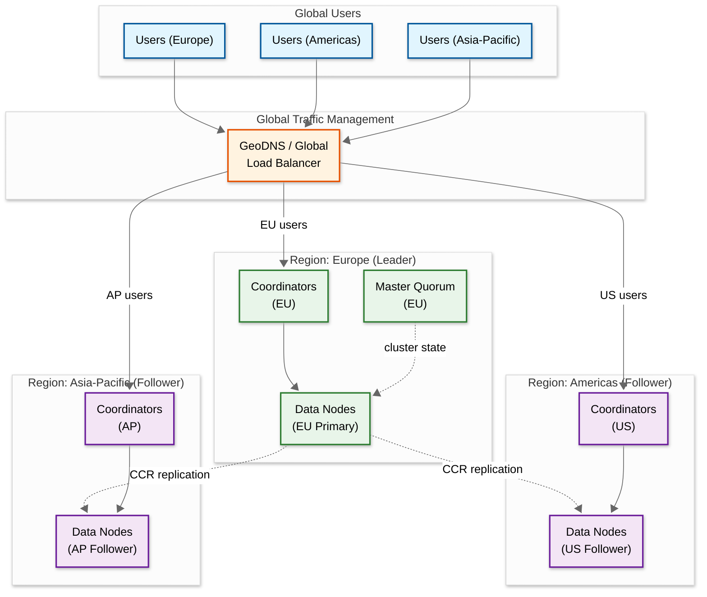

# 16.3 Scalability & Reliability

## Scalability

### Horizontal Scaling Strategy

| Component | Scaling Approach | Trigger |
|---|---|---|
| **Data nodes** | Add nodes; cluster auto-rebalances shards | Disk utilization > 75%, or average shard size approaching 50 GB per node |
| **Coordinator nodes** | Add stateless coordinators behind load balancer | Query queue depth > 100 or coordinator CPU > 70% |
| **Master nodes** | Fixed quorum of 3 (or 5 for very large clusters) | Only scale if cluster state operations become Slowest part of the process (>1000 indexes) |
| **Shard count** | Create new indexes with more shards; reindex from old | When individual shard size exceeds 50 GB |
| **Read throughput** | Add replicas (each replica can serve queries) | Search QPS saturates existing shard copies |
| **Write throughput** | Add primary shards (more parallel ingestion paths) | Requires reindexing; plan shard count for future growth at index creation |

### Shard Allocation and Rebalancing

```
FUNCTION allocate_shards(cluster_state: ClusterState):
    // Master node runs allocation algorithm on every cluster state change

    // Step 1: Allocate unassigned shards
    FOR shard IN unassigned_shards:
        // Primary shard allocation: prefer nodes with existing data (recovery from local disk)
        IF shard.is_primary:
            candidate_nodes = nodes_with_local_copy(shard)
            IF candidate_nodes.empty():
                candidate_nodes = all_eligible_nodes(shard)

        // Replica shard allocation: MUST be on different node than primary
        ELSE:
            candidate_nodes = all_eligible_nodes(shard)
            candidate_nodes.remove(node_hosting_primary(shard))

        // Score candidates by: disk space, shard count, allocation filters
        best_node = score_and_select(candidate_nodes, [
            disk_usage_weight=0.4,      // Prefer nodes with more free disk
            shard_count_weight=0.3,     // Prefer nodes with fewer shards
            zone_awareness_weight=0.3   // Spread replicas across failure zones
        ])

        assign(shard, best_node)

    // Step 2: Rebalance (move shards for even distribution)
    IF cluster_is_imbalanced(threshold=10%):
        moves = compute_rebalance_plan(
            max_concurrent_moves=2,     // Limit to avoid overloading network
            exclude_recently_relocated=True
        )
        FOR move IN moves:
            relocate_shard(move.shard, move.from_node, move.to_node)
```

### Index Lifecycle Management for Scale

```
// Time-based indexes enable scale management
// Example: "products-2026.03.10" created daily

POLICY rollover_policy:
    HOT phase:
        max_age: 7 days
        max_size: 200 GB (total index)
        num_shards: 5, num_replicas: 2
        refresh_interval: 1s
        node_type: hot (SSD)

    WARM phase (after rollover):
        force_merge: max_num_segments=1
        shrink: num_shards=1
        num_replicas: 1
        node_type: warm (HDD)
        // Reduces shard count 10x, segment count 5x -> faster search, less overhead

    COLD phase (after 30 days):
        searchable_snapshot: true
        storage: object_storage
        // Queries still work but with higher latency (500ms-2s)

    DELETE phase (after 365 days):
        delete_index: true
```

### Hot Spot Mitigation

| Hot Spot | Cause | Solution |
|---|---|---|
| **Uneven shard sizes** | Documents not uniformly distributed by routing key | Use `index.routing.allocation.total_shards_per_node` to cap shards per node; monitor shard sizes; reindex with better routing |
| **Popular search terms** | Head queries (top 1%) generate 30-40% of traffic | Query result cache at coordinator level; CDN/edge caching for autocomplete |
| **Single hot shard** | All queries for a specific routing value hit one shard | Use custom routing with `routing_partition_size` to spread a single routing value across multiple shards |
| **Bulk indexing flood** | Re-indexing job overwhelms a subset of shards | Rate-limit bulk requests; use `sliced_scroll` for parallel re-indexing; separate indexing coordinators from search coordinators |

---

## Reliability & Fault Tolerance

### Single Points of Failure

| SPOF | Risk | Mitigation |
|---|---|---|
| Master node | Loss of cluster state management; no shard allocation | 3-node master-eligible quorum; automatic leader election via Raft-like protocol; dedicated master nodes (no data or query load) |
| Primary shard | Write path blocked for that shard's documents | Replica promoted to primary within seconds; translog replayed on new primary; writes resume after promotion |
| Coordinator node | Queries to that coordinator fail | Multiple coordinators behind load balancer; stateless, so any coordinator can handle any request |
| Storage (single disk) | Shard data loss | Replicas on separate nodes (and separate failure zones); translog on separate disk if possible |

### Replication Model

```
FUNCTION primary_replica_replication(primary: Shard, replicas: List<Shard>, operation: WriteOp):
    // Step 1: Execute on primary
    result = primary.execute(operation)
    primary.translog.append(operation)

    // Step 2: Replicate to all in-sync replicas
    ack_count = 1  // Primary counts as 1
    FOR replica IN replicas:
        TRY:
            replica.execute(operation)      // Same analysis + indexing
            replica.translog.append(operation)
            ack_count += 1
        CATCH timeout_or_error:
            // Mark replica as stale; master will reassign
            report_replica_failure(replica)

    // Step 3: Respond to client
    IF ack_count >= required_acks:  // Default: all in-sync replicas
        RETURN success
    ELSE:
        // Some replicas failed but primary succeeded
        // Document is durable on primary; replicas will catch up
        RETURN success_with_warning(failed_replicas)

    // wait_for_active_shards parameter controls quorum:
    //   "all" = wait for all replicas (safest)
    //   "1"   = only primary (fastest, risk of data loss if primary fails before replication)
    //   "quorum" = majority of shard copies
```

### Failover Mechanisms

```
FUNCTION handle_node_failure(failed_node: NodeID, master: MasterNode):
    // Master detects node failure via heartbeat timeout (default: 30s)

    affected_shards = master.get_shards_on_node(failed_node)

    FOR shard IN affected_shards:
        IF shard.role == PRIMARY:
            // Promote a replica to primary
            best_replica = select_best_replica(shard, criteria=[
                "most_recent_seq_no",    // Least data loss
                "fastest_node",          // Best performance
                "different_zone"         // Prefer diverse zone
            ])
            promote_to_primary(best_replica)
            // New primary starts accepting writes immediately
            // Translog delta from old primary's last known seq_no is replayed

        // Allocate replacement replica on a healthy node
        new_replica_node = find_node_for_replica(shard)
        start_recovery(shard, source=new_primary, target=new_replica_node)
        // Recovery: copy segment files + replay translog delta
```

### Circuit Breaker Patterns

| Circuit Breaker | Threshold | Action |
|---|---|---|
| **Parent** | 95% of JVM heap | Reject all operations that would allocate memory |
| **Field data** | 40% of JVM heap | Reject aggregation queries loading field data |
| **Request** | 60% of JVM heap | Reject individual queries exceeding per-request memory limit |
| **In-flight requests** | 100% of JVM heap | Reject new requests when total in-flight memory is exceeded |
| **Accounting** | No limit (tracking only) | Track memory usage for monitoring and debugging |

### Retry Strategies

```
FUNCTION retry_with_exponential_backoff(operation, max_retries=3):
    FOR attempt IN range(max_retries):
        TRY:
            result = execute(operation)
            RETURN result
        CATCH retriable_error:    // 429 Too Many Requests, 503 Service Unavailable
            wait_time = min(base_delay * (2 ^ attempt) + random_jitter(), max_delay)
            // base_delay=100ms, max_delay=30s, jitter=0-100ms
            sleep(wait_time)
        CATCH non_retriable_error:  // 400 Bad Request, 409 Conflict
            RAISE error             // Do not retry client errors

    RAISE MaxRetriesExceeded
```

### Graceful Degradation

| Scenario | Degradation Strategy |
|---|---|
| Multiple shard failures | Return partial results with `_shards.failed > 0`; client-side "results may be incomplete" warning |
| High query latency | Disable expensive features: skip highlighting, reduce aggregation depth, increase `terminate_after` |
| Cluster overload | Activate adaptive query queue: reject low-priority queries; serve cached results for popular queries |
| Storage full | Block writes to full shards; redirect to shards with space; alert operators immediately |

---

## Disaster Recovery

### Recovery Objectives

| Metric | Target | Strategy |
|---|---|---|
| **RTO** (Recovery Time Objective) | < 15 minutes for search availability | Replica promotion for shard-level failures; cross-cluster replication for cluster-level failures |
| **RPO** (Recovery Point Objective) | < 5 seconds of data loss | Translog fsync'd every 5 seconds (async mode) or per-request (sync mode) |
| **Snapshot frequency** | Every 4 hours | Incremental snapshots to object storage; only changed segments are uploaded |
| **Snapshot retention** | 30 daily + 12 monthly | Enough to restore to any recent point in time |

### Multi-Region Strategy

```
FUNCTION cross_cluster_replication(leader_cluster, follower_cluster):
    // Leader cluster handles all writes
    // Follower cluster receives replicated changes with configurable lag

    // Per-index replication:
    FOR index IN leader_cluster.replicated_indexes:
        follower_index = follower_cluster.create_follower(index)

        // Follower polls leader for new operations
        WHILE running:
            new_ops = leader_cluster.get_changes(
                index, since=follower_index.last_seq_no,
                max_batch=1000)

            follower_index.apply_operations(new_ops)
            follower_index.update_checkpoint(new_ops.last_seq_no)
            // Typical replication lag: 100ms - 5s depending on network

    // On leader cluster failure:
    //   1. Promote follower cluster to accept writes
    //   2. Update DNS / load balancer to route traffic to follower
    //   3. Accept data loss for operations not yet replicated (RPO = replication lag)
    //   4. After leader recovery, reverse replication direction or reindex
```

### Backup Strategy

| Backup Type | Frequency | Storage | Retention |
|---|---|---|---|
| Incremental snapshot | Every 4 hours | Object storage | 7 days |
| Daily snapshot | Midnight UTC | Object storage | 30 days |
| Monthly snapshot | 1st of month | Object storage (archive tier) | 12 months |
| Translog (continuous) | Per-write or every 5s | Local disk + replicas | Until next flush |

---

## Multi-Region Architecture



### Multi-Region Design Decisions

| Decision | Approach | Rationale |
|---|---|---|
| **Write path** | Single-leader (EU) | Search writes are not latency-sensitive (near-real-time, not real-time); single-leader avoids conflict resolution complexity |
| **Read path** | Local reads from nearest follower | Search latency is user-facing; reading from local follower saves 100-200ms of cross-region RTT |
| **Replication** | Cross-cluster replication (CCR) per index | Follower clusters poll leader for new operations; typical lag 100ms-5s depending on write rate and network |
| **Failover** | Manual promotion of follower to leader | Automatic failover risks split-brain; manual promotion allows operators to verify data consistency |
| **Consistency** | Eventual (replication lag = staleness) | Users see slightly stale results from follower; acceptable for search (unlike financial transactions) |
| **DNS failover** | GeoDNS with health checks | Route users to healthy region; failover in 30-60 seconds based on TTL |

### Cross-Region Failover Procedure

```
FUNCTION failover_to_follower(failed_leader: Region, promoted_follower: Region):
    // Step 1: Verify leader is truly down (avoid false positive)
    //   - Check from multiple vantage points
    //   - Wait for heartbeat timeout (minimum 2 minutes to avoid flapping)

    // Step 2: Pause CCR on promoted follower
    //   - Follower must stop pulling from failed leader
    //   - Record last replicated seq_no (this determines RPO)

    // Step 3: Convert follower indexes to regular (writable) indexes
    //   - Follower indexes are read-only by default
    //   - Promoting them makes them writable

    // Step 4: Update DNS / global load balancer
    //   - Route ALL traffic (reads and writes) to promoted follower
    //   - DNS TTL determines how quickly users see the change

    // Step 5: RPO assessment
    //   data_loss = leader.last_seq_no - follower.last_replicated_seq_no
    //   // Typical: 0.1s - 5s of data loss depending on replication lag at failure time

    // Step 6: After leader recovery
    //   Option A: Reverse replication (new leader -> recovered old leader)
    //   Option B: Full reindex of recovered leader from new leader
    //   Option C: Accept old leader's data, merge any divergence manually
```

---

## Back-Pressure Mechanisms

```
FUNCTION back_pressure_control(cluster: SearchCluster):
    // Layer 1: Client-side throttling
    //   Bulk indexing client monitors 429 responses
    //   Exponential backoff with jitter on rejections
    //   Circuit breaker: stop sending if > 10% rejections

    // Layer 2: Coordinator-level admission control
    IF coordinator.in_flight_requests > max_in_flight:
        RETURN 429 Too Many Requests
        // max_in_flight based on available memory and thread pool size

    // Layer 3: Thread pool queue limits
    //   search thread pool: queue_size = 1000 (reject beyond this)
    //   write thread pool: queue_size = 200
    //   bulk thread pool: queue_size = 50 (intentionally small to surface backpressure early)

    // Layer 4: Indexing pressure
    //   Monitor in-memory buffer usage per shard
    IF shard.memory_buffer_usage > 90% of allocation:
        // Slow down indexing by introducing artificial delay
        // This gives the refresh cycle time to flush the buffer
        apply_indexing_throttle(shard)

    // Layer 5: Disk-based watermarks
    IF node.disk_usage > 85%:    // Low watermark
        // Stop allocating NEW shards to this node
        node.allocation_enabled = false

    IF node.disk_usage > 90%:    // High watermark
        // Begin moving shards OFF this node
        trigger_shard_relocation(node)

    IF node.disk_usage > 95%:    // Flood-stage watermark
        // Make all indexes on this node read-only
        // CRITICAL: this prevents disk full → node crash
        FOR index ON node:
            index.read_only_allow_delete = true
        ALERT "CRITICAL: Flood-stage watermark reached on {node}"
```

---

## Chaos Experiments

| Experiment | Procedure | Expected Outcome | Validates |
|---|---|---|---|
| **Data node kill** | Kill a random data node process without graceful shutdown | Replicas promote to primary within 30s; queries continue with partial shard coverage; recovery completes within 5 min | Replica promotion, translog replay, shard recovery |
| **Coordinator saturation** | Send 10x normal QPS to a single coordinator | Coordinator rejects excess queries (429); other coordinators continue serving; no cascade failure | Thread pool limits, circuit breakers, load balancer failover |
| **Network partition** | Isolate 1 of 3 master-eligible nodes from the cluster | Remaining 2 nodes maintain quorum; cluster continues operating; isolated node becomes non-master | Quorum-based leader election, split-brain prevention |
| **Disk I/O saturation** | Inject 100% disk utilization on a data node (simulating merge storm) | Query latency degrades on affected node; adaptive replica selection routes queries to other copies; no data loss | Adaptive replica selection, query timeout handling |
| **Full cluster restart** | Stop all nodes simultaneously; restart one at a time | Master nodes form quorum first; data nodes join and recover shards; search available within 5-15 min depending on translog size | Full cluster recovery, shard allocation priority, gateway recovery |
| **Mapping explosion** | Index documents with 5000+ unique field names | Cluster state grows but master remains stable; `total_fields.limit` rejects documents beyond threshold | Dynamic mapping limits, cluster state management |
| **Slow consumer (CCR)** | Throttle network between leader and follower cluster to 10 Mbps | Replication lag grows but does not crash; follower eventually catches up when throttle is removed | CCR resilience, lag monitoring, auto-recovery |
| **Memory pressure** | Configure a complex aggregation on a high-cardinality field | Circuit breaker trips before OOM; query is rejected with clear error message; other queries continue | Circuit breakers, memory accounting, graceful degradation |

---

## Capacity Planning Formulas

### Query Capacity

```
// Total query capacity for the cluster
total_qps_capacity = num_shard_copies × qps_per_shard_copy / shards_per_query

// Example:
//   50 primary shards, 1 replica = 100 shard copies
//   Each shard copy can handle 500 QPS (simple queries)
//   Each query hits all 50 shards
//   Capacity = 100 × 500 / 50 = 1,000 QPS
//   To serve 30K QPS: need 30 replicas (30 × 50 + 50 = 1,550 shard copies)
//   OR: reduce shard count to 10 (fewer shards per query)
//        Capacity = 20 × 2000 / 10 = 4,000 QPS per replica set

// The key insight: shard count is a DIVISOR of capacity
// Fewer, larger shards = more efficient query execution
// But: individual shard query time increases with size
// Sweet spot: 10-50 GB per shard, benchmark to find per-shard QPS
```

### Storage Capacity

```
// Storage growth model
storage_year_N = raw_data_year_N × index_overhead_factor × (1 + num_replicas)

// Example with 30% annual growth:
//   Year 1: 10 TB × 1.5 × 2 = 30 TB (hot) + 20 TB (warm) = 50 TB total
//   Year 2: 13 TB × 1.5 × 2 = 39 TB (hot) + 30 TB (warm) = 69 TB total
//   Year 3: 17 TB × 1.5 × 2 = 51 TB (hot) + 39 TB (warm) = 90 TB total

// With tiered storage (searchable snapshots for cold):
//   Year 3: 51 TB (hot SSD) + 20 TB (warm HDD) + 19 TB (object storage) = 90 TB
//   Cost: 51×$0.15 + 20×$0.04 + 19×$0.02 = $7.65 + $0.80 + $0.38 = $8.83/TB/mo avg
//   vs. all-SSD: 90×$0.15 = $13.50/TB/mo → 35% savings from tiering
```

### Indexing Throughput

```
// Indexing Slowest part of the process identification
max_indexing_rate = min(
    cpu_bound:    num_data_nodes × cores_per_node × docs_per_core_per_sec,
    io_bound:     num_data_nodes × disk_write_bandwidth / avg_doc_indexed_size,
    memory_bound: total_indexing_buffer / avg_doc_memory / refresh_interval,
    network_bound: total_network_bandwidth / avg_doc_size_with_replication
)

// Typical Slowest part of the process order:
//   1. CPU (analysis chain is compute-intensive)
//   2. Disk I/O (segment writes + merge I/O)
//   3. Memory (indexing buffer limited to 10% of heap)
//   4. Network (rarely the Slowest part of the process for intra-cluster)
```
