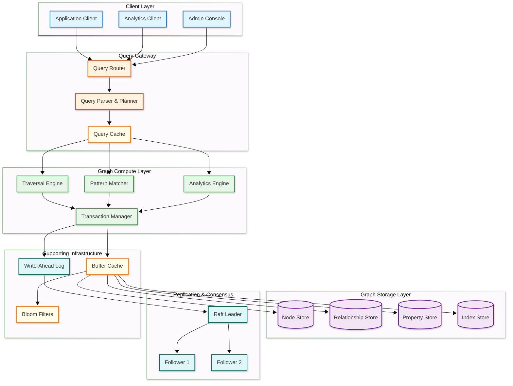
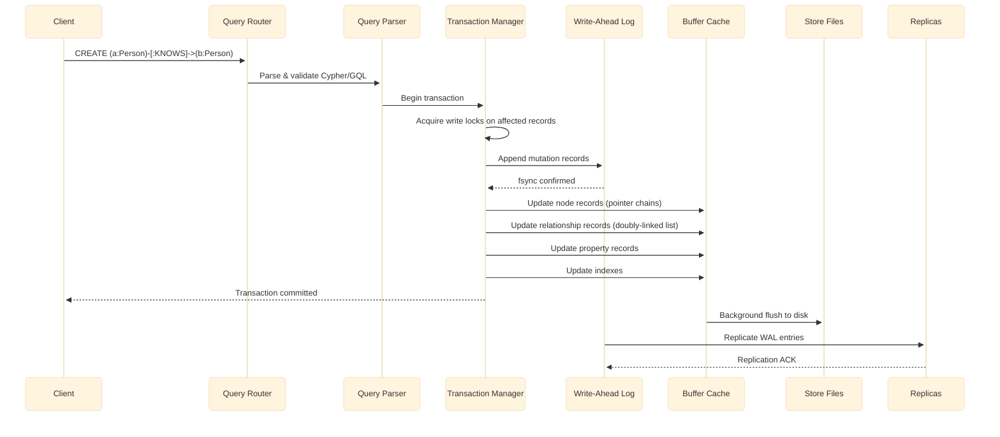
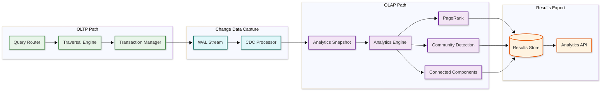
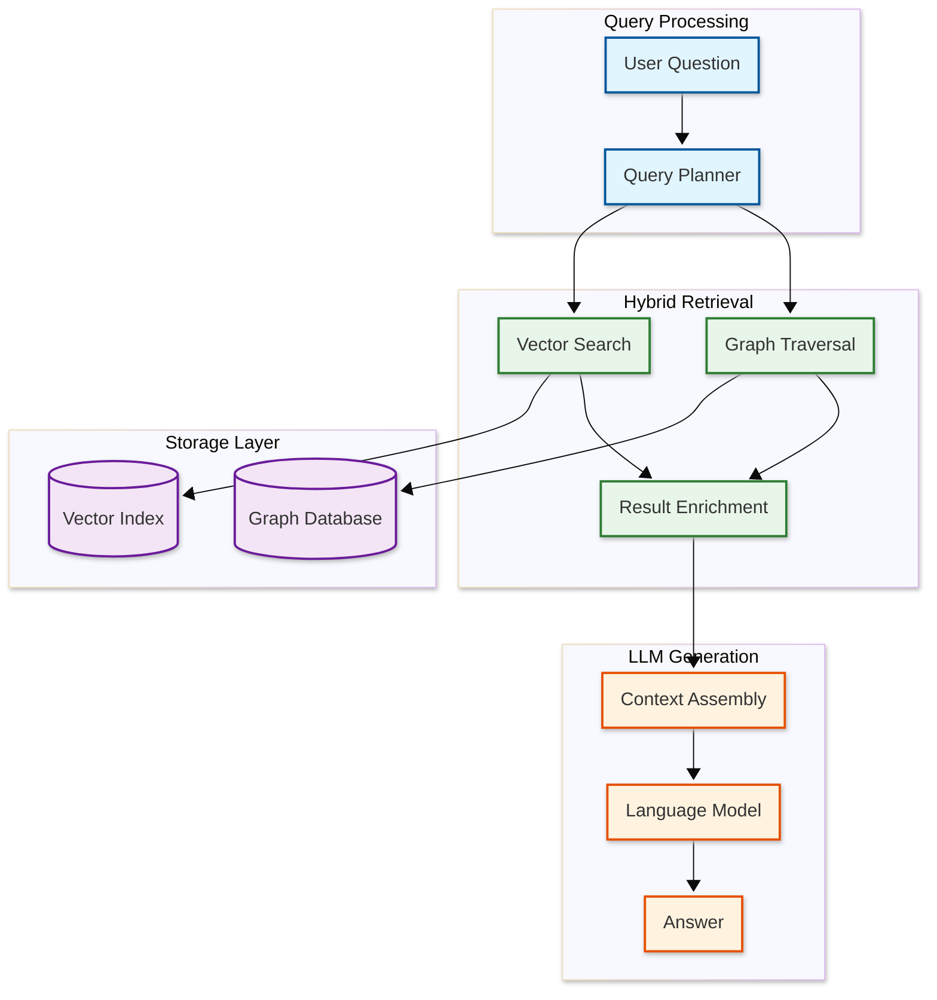
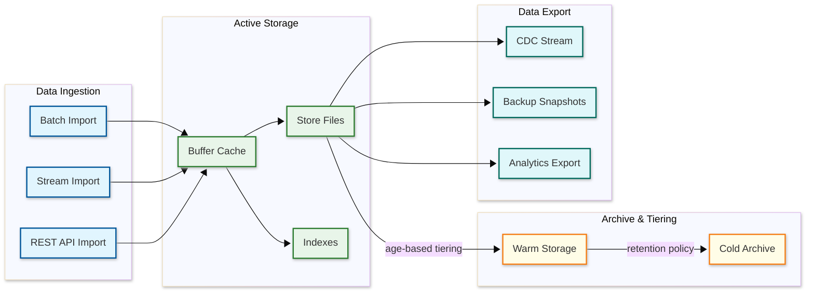
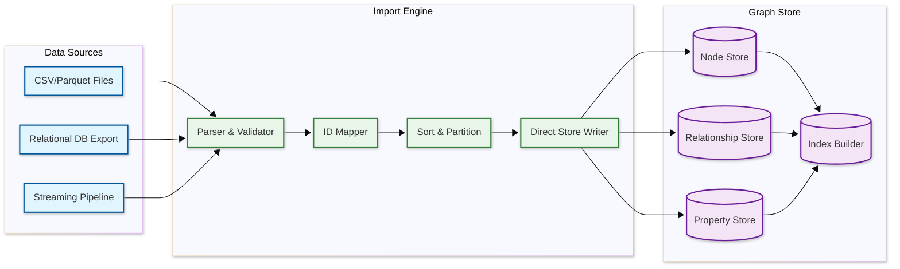

# High-Level Design — Graph Database

## System Architecture

---

## Data Flow

### Write Path (Node/Edge Creation)

**Write path key points:**

1. **WAL-first** — All mutations are durable in the write-ahead log before acknowledgment
2. **Pointer chain updates** — Creating an edge requires updating the adjacency lists of both endpoints (doubly-linked relationship chain)
3. **Lock granularity** — Record-level locks on the specific nodes and edges being modified
4. **Deferred flush** — Buffer cache absorbs writes; background thread flushes dirty pages to store files
5. **Replication** — WAL entries are streamed to followers for synchronous or asynchronous replication

### Read Path (Graph Traversal)

1. **Query parsing** — Cypher/GQL query is parsed into an abstract syntax tree (AST)
2. **Query planning** — The cost-based optimizer evaluates multiple execution plans using cardinality estimates, index availability, and data distribution statistics
3. **Plan selection** — The plan with lowest estimated cost is selected (index scan vs. label scan vs. full scan)
4. **Traversal execution** — The traversal engine follows physical pointers from the starting node through the relationship chain, filtering on labels, types, and property predicates
5. **Result assembly** — Matched patterns are materialized with requested properties and returned to the client
6. **Cache utilization** — Hot nodes and relationships are served from the buffer cache; cache misses trigger disk reads

---

## Key Architectural Decisions

### 1. Native Graph Storage vs. Graph Layer on Relational/Document Store

| Aspect | Native Graph Storage | Non-Native (Graph on RDBMS) |
|--------|--------------------|-----------------------------|
| Traversal performance | O(1) per hop via physical pointers | O(log n) per hop via index lookups |
| Storage efficiency | Fixed-size records, pointer-based | Tables with foreign keys, JOINs |
| Multi-hop queries | Constant Time (Same time regardless of data size) per hop | Exponential cost with hop count |
| Ecosystem maturity | Specialized tooling | Leverage existing RDBMS ecosystem |
| Analytics | Requires separate engine | Can reuse SQL analytics |

**Decision:** Native graph storage with index-free adjacency. The entire value proposition of a graph database depends on O(1) traversal — without it, we are building a slower relational database with graph syntax.

### 2. Property Graph vs. RDF Triple Store

| Aspect | Property Graph | RDF Triple Store |
|--------|---------------|-----------------|
| Data model | Nodes/edges with properties | Subject-predicate-object triples |
| Query language | Cypher, GQL, Gremlin | SPARQL |
| Schema | Flexible, optional constraints | Ontology-based (OWL, RDFS) |
| Traversal | Natural path expressions | SPARQL property paths |
| Use cases | Social, fraud, recommendations | Knowledge management, semantic web |
| Performance | Optimized for local traversals | Optimized for global pattern matching |

**Decision:** Property graph model. It maps more naturally to application data models (users, products, transactions have properties), supports richer edge semantics (typed, weighted, temporal edges), and has broader industry adoption for OLTP graph workloads.

### 3. Synchronous vs. Asynchronous Replication

| Aspect | Synchronous | Asynchronous |
|--------|-------------|--------------|
| Consistency | Strong — reads see latest writes | Eventual — replicas may lag |
| Write latency | Higher (wait for follower ACK) | Lower (acknowledge after local WAL) |
| Durability | No data loss on primary failure | Potential data loss (replication lag) |
| Availability | Reduced during partition | Higher (writes continue regardless) |

**Decision:** Synchronous replication with quorum writes (2 of 3 replicas) for OLTP workloads. Analytics replicas use asynchronous replication to avoid impacting write latency.

### 4. Query Language Strategy

**Decision:** Support GQL (ISO/IEC 39075) as the primary query language with Cypher compatibility. GQL combines the best features of Cypher, PGQL, and G-CORE into an ISO standard that provides pattern matching, path expressions, and graph DDL.

### 5. Caching Strategy

| Cache Layer | What It Caches | Eviction Policy |
|-------------|---------------|-----------------|
| Query result cache | Complete query results for repeated queries | LRU with TTL, invalidated on write |
| Buffer cache | Node, relationship, and property records | Clock-sweep (approximation of LRU) |
| Traversal context cache | Partial traversal state for incremental queries | Session-scoped, TTL-based |
| Index cache | B-tree inner nodes and leaf pages | Priority-based (inner nodes pinned) |

### 6. Message Queue Usage

**Decision:** Write-ahead log serves as the internal replication stream (no external message queue needed for core operations). An external event stream is used only for change data capture (CDC) to notify downstream systems of graph mutations.

---

## Architecture Pattern Checklist

- [x] **Sync vs Async communication** — Synchronous for OLTP queries; async replication to analytics replicas
- [x] **Event-driven vs Request-response** — Request-response for queries; event-driven CDC for downstream consumers
- [x] **Push vs Pull model** — Pull-based replication (followers pull WAL from leader); push-based CDC notifications
- [x] **Stateless vs Stateful services** — Query router is stateless; storage nodes are stateful (own their partition)
- [x] **Read-heavy vs Write-heavy** — Read-heavy (80:1); buffer cache and index-free adjacency optimize reads
- [x] **Real-time vs Batch processing** — Real-time for OLTP traversals; batch for analytics (PageRank, community detection)
- [x] **Edge vs Origin processing** — Origin processing; graph traversals cannot be meaningfully edge-cached due to personalization

---

## Component Responsibility Matrix

| Component | Responsibility | Inputs | Outputs | Key Metrics |
|-----------|---------------|--------|---------|------------|
| **Query Router** | Route queries to correct partition; merge distributed results | Client query | Unified result set | QPS, routing accuracy |
| **Query Parser** | Parse GQL/Cypher into AST; validate syntax and semantics | Query string | Abstract Syntax Tree | Parse latency, error rate |
| **Query Planner** | Generate and select optimal execution plan using cost-based optimization | AST + statistics | Physical execution plan | Plan cache hit ratio, optimization time |
| **Query Cache** | Cache complete query results for identical parameterized queries | Query fingerprint | Cached result set | Hit ratio, invalidation rate |
| **Traversal Engine** | Execute BFS/DFS traversals following physical pointers | Execution plan | Traversed node/edge set | Hops/sec, cache hit ratio |
| **Pattern Matcher** | Execute subgraph isomorphism for MATCH clauses | Pattern graph + data graph | Matched bindings | Candidates evaluated, match rate |
| **Analytics Engine** | Execute full-graph algorithms (PageRank, community detection) | Algorithm + parameters | Analytics result | Iteration time, convergence |
| **Transaction Manager** | ACID transaction coordination: locks, WAL, commit protocol | Transaction operations | Commit/rollback | Deadlock rate, commit latency |
| **Buffer Cache** | Cache store file pages in memory; manage eviction | Page read/write requests | Cached pages | Hit ratio, eviction rate |
| **Node Store** | Persist node records in fixed-size format | Node CRUD operations | Node records | Store size, fragmentation |
| **Relationship Store** | Persist relationship records with pointer chains | Relationship CRUD | Relationship records | Chain length, fragmentation |
| **Property Store** | Persist property key-value pairs with overflow chains | Property CRUD | Property records | Overflow ratio, avg chain length |
| **Index Store** | Maintain B+ tree and full-text indexes | Index lookups and updates | Index entries | Index size, lookup latency |
| **WAL** | Write-ahead log for durability and replication | Mutation records | Durable log entries | Fsync latency, WAL size |
| **Raft Leader** | Consensus protocol leader; coordinate replication | WAL entries | Replicated state | Election count, replication lag |

---

## Analytics Pipeline Architecture

For graph databases that support both OLTP (traversal) and OLAP (analytics) workloads, a separate pipeline prevents analytics from degrading transactional performance.

**Key design decisions:**

1. **Snapshot isolation for analytics:** The analytics engine operates on a point-in-time snapshot of the graph, replicated via CDC from the OLTP store. This prevents long-running PageRank computations from holding locks on the transactional graph.

2. **Incremental analytics:** Rather than recomputing PageRank on the full graph every time, the system maintains a delta of changed nodes/edges since the last computation and applies incremental updates to the existing rank vector. This reduces full-graph PageRank from O(V + E) to O(changed_nodes × avg_degree).

3. **Result materialization:** Analytics results (e.g., community assignments, centrality scores) are written back to the OLTP graph as computed properties on nodes. This enables queries like "find friends in my community" without invoking the analytics engine.

---

## GraphRAG Integration Architecture

Modern graph databases increasingly serve as the knowledge layer for retrieval-augmented generation (RAG) pipelines, combining structured graph traversal with vector similarity search.

**How GraphRAG works:**

1. **Entity extraction:** User's question is parsed to identify entities ("What medications interact with aspirin?")
2. **Dual retrieval path:**
   - Vector search finds semantically similar documents/nodes
   - Graph traversal finds structurally related entities (aspirin → interacts_with → other drugs)
3. **Context enrichment:** Graph traversal adds structured relationships and multi-hop context that vector search alone would miss
4. **LLM generation:** The combined context (vector-retrieved text + graph-traversed relationships) feeds the language model

**Why graph + vector outperforms vector-only RAG:**

| Capability | Vector-Only RAG | GraphRAG |
|-----------|----------------|----------|
| Semantic similarity | Strong | Strong (via vector index on nodes) |
| Multi-hop reasoning | Weak (limited to retrieved chunks) | Strong (graph traversal follows relationships) |
| Structured relationships | None | Native (edge types encode relationship semantics) |
| Provenance tracking | Document-level | Entity-level (every fact has a source path) |
| Global context | Local (chunk-level) | Hierarchical (communities, summaries) |

---

## Data Lifecycle

**Tiering strategy for graph data:**

| Tier | Data Age | Storage | Access Pattern |
|------|----------|---------|---------------|
| Hot | < 7 days | In-memory buffer cache | Real-time traversals at full speed |
| Warm | 7-90 days | NVMe SSD (store files) | On-demand traversals with cache miss penalty |
| Cool | 90-365 days | Standard SSD | Historical queries with higher latency tolerance |
| Cold | > 365 days | Object storage (compressed snapshots) | Restore-on-demand for compliance/audit |

**Graph-specific tiering challenge:** Unlike key-value data where items are independent, graph edges connect nodes across tiers. If node A (hot) connects to node B (cold), traversing from A to B requires a cross-tier read. The tiering engine must consider graph connectivity when deciding which nodes to tier down — nodes that are still connected to many hot nodes should remain warm even if they haven't been directly accessed recently.

---

## Bulk Import Architecture

Graph databases must support high-throughput initial data loading — often importing billions of nodes and edges from external sources (relational databases, CSV files, streaming pipelines).

### Bulk Import Pipeline

**Key optimizations for bulk import:**

| Optimization | Description | Impact |
|-------------|-------------|--------|
| **Bypass WAL** | Write directly to store files (no WAL needed during import) | 5-10x faster writes |
| **Pre-sorted relationships** | Sort edges by source node before importing | Sequential disk writes, optimal pointer chains |
| **Parallel import** | Multiple importer threads writing to different store file regions | Linear scaling with cores |
| **Deferred indexing** | Build indexes after all data is loaded (not incrementally) | 3-5x faster overall import |
| **Batch ID allocation** | Pre-allocate node/relationship IDs in blocks | Eliminates ID generator contention |

**Throughput target:** A well-optimized bulk importer can achieve 1-5 million nodes/second and 1-10 million edges/second on modern hardware, enabling a 1 billion node / 10 billion edge graph to be loaded in under 30 minutes.
