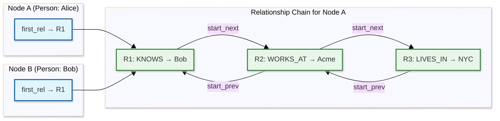

# Low-Level Design — Graph Database

## Data Model

### Physical Storage Layout

The graph database uses four dedicated store files, each with fixed-size records for O(1) positional lookups:

```
node_store:         64 bytes per record
relationship_store: 64 bytes per record
property_store:     variable (128 bytes average, overflow chains)
label_store:        32 bytes per record
```

### Node Record Structure

```
┌─────────────────────────────────────────────────────────────┐
│ Node Record (64 bytes)                                      │
├──────────────┬──────────────────────────────────────────────┤
│ in_use       │ 1 bit — is this record active?               │
│ node_id      │ 8 bytes — globally unique node identifier    │
│ first_rel_id │ 8 bytes — pointer to first relationship      │
│ first_prop_id│ 8 bytes — pointer to first property record   │
│ label_bitmap │ 8 bytes — inline label IDs (up to 4 labels)  │
│ label_ptr    │ 8 bytes — overflow pointer for >4 labels     │
│ dense_flag   │ 1 bit — true if node is a supernode          │
│ group_ptr    │ 8 bytes — pointer to relationship group      │
│              │          (used only for dense/supernodes)     │
│ reserved     │ remaining bytes for alignment and future use  │
└──────────────┴──────────────────────────────────────────────┘
```

### Relationship Record Structure

```
┌─────────────────────────────────────────────────────────────┐
│ Relationship Record (64 bytes)                              │
├──────────────┬──────────────────────────────────────────────┤
│ in_use       │ 1 bit — is this record active?               │
│ rel_id       │ 8 bytes — globally unique relationship ID    │
│ start_node   │ 8 bytes — pointer to source node record      │
│ end_node     │ 8 bytes — pointer to target node record      │
│ rel_type     │ 4 bytes — relationship type ID               │
│ start_prev   │ 8 bytes — prev relationship of start node    │
│ start_next   │ 8 bytes — next relationship of start node    │
│ end_prev     │ 8 bytes — prev relationship of end node      │
│ end_next     │ 8 bytes — next relationship of end node      │
│ first_prop   │ 8 bytes — pointer to first property record   │
│ flags        │ 2 bytes — direction, constraints metadata    │
└──────────────┴──────────────────────────────────────────────┘
```

**Key insight:** Each relationship record contains four pointers forming two doubly-linked lists — one for the source node's relationship chain and one for the target node's chain. This enables bidirectional traversal without index lookups.

### Relationship Chain Visualization



### Property Storage

Properties use a linked-list of fixed-size blocks with inline short values and overflow pointers for large values:

```
┌─────────────────────────────────────────────────────────┐
│ Property Record (128 bytes)                             │
├──────────────┬──────────────────────────────────────────┤
│ key_id       │ 4 bytes — property key (from key store)  │
│ type         │ 1 byte — INT, FLOAT, STRING, BOOL, etc.  │
│ value_inline │ 32 bytes — value stored inline if fits    │
│ value_ptr    │ 8 bytes — pointer to overflow (strings)   │
│ next_prop    │ 8 bytes — pointer to next property record │
│ entity_ref   │ 8 bytes — back-pointer to owning node/rel │
│ reserved     │ remaining bytes                           │
└──────────────┴──────────────────────────────────────────┘
```

### Indexing Strategy

| Index Type | Structure | Use Case |
|-----------|-----------|----------|
| **Label Index** | Bitmap index | Fast scan of all nodes with a given label |
| **Property Index** | B+ tree | Equality and range lookups on property values |
| **Composite Index** | B+ tree on (label, prop1, prop2) | Multi-property lookups |
| **Full-Text Index** | Inverted index (Lucene-style) | Text search across properties |
| **Vertex-Centric Index** | Per-node B+ tree on edge properties | Efficient neighbor filtering on supernodes |
| **Spatial Index** | R-tree | Geospatial point/range queries |

### Partitioning / Sharding Key Selection

| Strategy | How It Works | Pros | Cons |
|----------|-------------|------|------|
| **Hash on Node ID** | Nodes assigned to partitions by hash(node_id) | Even distribution | Random cuts through graph; many cross-partition edges |
| **Community-Based** | Detect communities (Louvain/Metis), colocate each community | Minimizes cross-partition edges | Expensive rebalancing; skewed partition sizes |
| **Property Sharding** | Graph topology on one shard; property data distributed | Traversals stay local | Properties require network fetch |
| **Label-Based** | Partition by node label (Users → Shard A, Posts → Shard B) | Predictable placement | Cross-label traversals always cross partitions |

**Recommendation:** Community-based partitioning for offline rebalancing, with hash-based assignment for new nodes between rebalancing cycles. Property sharding as a complementary strategy for supernodes whose properties dominate storage.

---

## API Design

### Query Endpoint (GQL/Cypher)

```
POST /db/{database}/query
Content-Type: application/json
Authorization: Bearer {token}

Request:
{
  "statement": "MATCH (a:Person {name: $name})-[:KNOWS]->(b:Person) RETURN b.name, b.age",
  "parameters": { "name": "Alice" },
  "timeout_ms": 5000,
  "read_consistency": "strong",
  "max_results": 100
}

Response:
{
  "results": [
    { "b.name": "Bob", "b.age": 30 },
    { "b.name": "Carol", "b.age": 28 }
  ],
  "metadata": {
    "rows_returned": 2,
    "execution_time_ms": 3.2,
    "db_hits": 47,
    "plan_cache_hit": true
  }
}
```

### Transaction Endpoint

```
POST /db/{database}/tx/begin
  → { "tx_id": "tx-abc-123", "expires_at": "..." }

POST /db/{database}/tx/{tx_id}/query
  → Execute query within transaction

POST /db/{database}/tx/{tx_id}/commit
  → Commit all mutations

POST /db/{database}/tx/{tx_id}/rollback
  → Discard all mutations
```

### Node/Edge CRUD (REST)

```
POST   /db/{database}/nodes                 → Create node
GET    /db/{database}/nodes/{id}            → Read node
PUT    /db/{database}/nodes/{id}/properties → Update properties
DELETE /db/{database}/nodes/{id}            → Delete node (and edges)

POST   /db/{database}/edges                 → Create edge
GET    /db/{database}/edges/{id}            → Read edge
DELETE /db/{database}/edges/{id}            → Delete edge
```

### Idempotency

- All write operations accept an optional `Idempotency-Key` header
- The server deduplicates writes by storing the key-to-result mapping in a TTL-bounded cache (24 hours)
- Transaction commits are inherently idempotent (same tx_id cannot commit twice)

### Rate Limiting

| Endpoint | Limit | Window |
|----------|-------|--------|
| Query (read) | 10,000/min per client | Sliding window |
| Query (write) | 2,000/min per client | Sliding window |
| Transaction begin | 500/min per client | Sliding window |
| Analytics query | 50/min per client | Fixed window |
| Admin operations | 100/min per client | Fixed window |

### Versioning

- API versioned via URL path: `/v1/db/{database}/query`
- GQL/Cypher language version specified in query metadata
- Schema version tracked per database for migration support

---

## Core Algorithms

### 1. Breadth-First Traversal (BFS)

```
FUNCTION bfs_traverse(start_node, max_depth, edge_filter, node_filter):
    visited = HashSet()
    queue = Queue()
    results = List()

    queue.enqueue((start_node, depth=0))
    visited.add(start_node.id)

    WHILE queue is not empty:
        (current, depth) = queue.dequeue()

        IF depth > max_depth:
            CONTINUE

        IF node_filter(current):
            results.add(current)

        // Follow relationship chain via physical pointers
        rel = current.first_relationship
        WHILE rel is not NULL:
            neighbor = rel.other_node(current)

            IF edge_filter(rel) AND neighbor.id NOT IN visited:
                visited.add(neighbor.id)
                queue.enqueue((neighbor, depth + 1))

            rel = rel.next_relationship_for(current)

    RETURN results

// Time:  O(V + E) where V = visited vertices, E = traversed edges
// Space: O(V) for visited set + queue
```

### 2. Bidirectional Dijkstra (Shortest Weighted Path)

```
FUNCTION bidirectional_dijkstra(source, target, weight_property):
    forward_dist = MinHeap()   // distance from source
    backward_dist = MinHeap()  // distance from target
    forward_visited = HashMap()  // node_id → best_distance
    backward_visited = HashMap()

    forward_dist.insert(source, 0)
    backward_dist.insert(target, 0)
    best_path_length = INFINITY
    meeting_node = NULL

    WHILE forward_dist is not empty AND backward_dist is not empty:
        // Expand forward frontier
        (f_node, f_dist) = forward_dist.extract_min()

        IF f_dist >= best_path_length:
            BREAK  // cannot improve

        forward_visited[f_node.id] = f_dist

        IF f_node.id IN backward_visited:
            candidate = f_dist + backward_visited[f_node.id]
            IF candidate < best_path_length:
                best_path_length = candidate
                meeting_node = f_node

        FOR EACH neighbor, weight IN f_node.outgoing_edges(weight_property):
            new_dist = f_dist + weight
            IF neighbor.id NOT IN forward_visited OR new_dist < forward_visited[neighbor.id]:
                forward_dist.insert(neighbor, new_dist)

        // Expand backward frontier (symmetric)
        (b_node, b_dist) = backward_dist.extract_min()

        IF b_dist >= best_path_length:
            BREAK

        backward_visited[b_node.id] = b_dist

        IF b_node.id IN forward_visited:
            candidate = b_dist + forward_visited[b_node.id]
            IF candidate < best_path_length:
                best_path_length = candidate
                meeting_node = b_node

        FOR EACH neighbor, weight IN b_node.incoming_edges(weight_property):
            new_dist = b_dist + weight
            IF neighbor.id NOT IN backward_visited OR new_dist < backward_visited[neighbor.id]:
                backward_dist.insert(neighbor, new_dist)

    RETURN reconstruct_path(forward_visited, backward_visited, meeting_node)

// Time:  O(V * log(V) + E) but explores ~sqrt(V) nodes compared to unidirectional
// Space: O(V) for distance maps and heaps
```

### 3. Pattern Matching (Subgraph Isomorphism)

```
FUNCTION match_pattern(pattern_graph, data_graph, bindings):
    // pattern_graph: the query pattern (e.g., (a)-[:R]->(b)-[:S]->(c))
    // bindings: partial mapping of pattern nodes → data nodes

    IF all pattern nodes are bound:
        RETURN [bindings]  // complete match found

    // Select next unbound pattern node with most constraints (Practical rule of thumb)
    p_node = select_most_constrained_unbound(pattern_graph, bindings)

    candidates = generate_candidates(p_node, pattern_graph, data_graph, bindings)

    results = List()
    FOR EACH candidate IN candidates:
        IF is_compatible(p_node, candidate, pattern_graph, bindings):
            new_bindings = bindings.copy()
            new_bindings[p_node] = candidate

            sub_results = match_pattern(pattern_graph, data_graph, new_bindings)
            results.extend(sub_results)

    RETURN results

FUNCTION generate_candidates(p_node, pattern, graph, bindings):
    // Use index-free adjacency: if a neighbor of p_node is already bound,
    // candidates are the actual neighbors of that bound node
    bound_neighbors = get_bound_neighbors(p_node, pattern, bindings)

    IF bound_neighbors is not empty:
        // Intersection of neighbor sets — much smaller than full scan
        candidate_sets = []
        FOR EACH (bound_node, rel_type) IN bound_neighbors:
            data_node = bindings[bound_node]
            neighbors = data_node.neighbors_of_type(rel_type)
            candidate_sets.append(neighbors)
        RETURN intersection(candidate_sets)
    ELSE:
        // No bound neighbors — use label index
        RETURN graph.nodes_with_label(p_node.label)

// Time:  Worst case O(n^k) where k = pattern nodes (subgraph isomorphism is NP-complete)
//        In practice, index-free adjacency and selectivity Cutting off unnecessary steps make it tractable
// Space: O(k) per recursive call for bindings
```

### 4. Vertex-Centric Index Lookup (Supernode Optimization)

```
FUNCTION supernode_neighbor_lookup(node, edge_type, property_filter, limit):
    // For supernodes (>10K edges), use vertex-centric index instead of
    // scanning the full relationship chain

    IF node.is_dense:
        // Use B+ tree index on (node_id, edge_type, property_value)
        index = node.vertex_centric_index
        cursor = index.seek(edge_type, property_filter.lower_bound)

        results = List()
        WHILE cursor.valid AND cursor.edge_type == edge_type AND results.size < limit:
            IF property_filter.matches(cursor.property_value):
                results.add(cursor.target_node)
            cursor.advance()

        RETURN results
    ELSE:
        // Regular node: walk the relationship chain (fast for <10K edges)
        RETURN linear_scan_relationships(node, edge_type, property_filter, limit)

// Time:  O(log(degree) + k) for supernode (B+ tree), O(degree) for regular node
// Space: O(k) for results
```

### 5. PageRank (Graph Analytics)

```
FUNCTION pagerank(graph, damping=0.85, iterations=20, tolerance=0.0001):
    num_nodes = graph.node_count()
    rank = HashMap()  // node_id → rank value

    // Initialize: equal rank for all nodes
    FOR EACH node IN graph.all_nodes():
        rank[node.id] = 1.0 / num_nodes

    FOR i = 1 TO iterations:
        new_rank = HashMap()
        diff = 0

        FOR EACH node IN graph.all_nodes():
            // Sum contributions from incoming edges
            incoming_sum = 0
            FOR EACH source IN node.incoming_neighbors():
                incoming_sum = incoming_sum + rank[source.id] / source.out_degree()

            new_rank[node.id] = (1 - damping) / num_nodes + damping * incoming_sum

            diff = diff + ABS(new_rank[node.id] - rank[node.id])

        rank = new_rank

        // Early termination if converged
        IF diff < tolerance:
            BREAK

    RETURN rank

// Time:  O(iterations × (V + E)) — each iteration touches every node and edge
// Space: O(V) for rank vectors
```

### 6. Community Detection (Louvain Algorithm)

```
FUNCTION louvain_community_detection(graph):
    // Phase 1: Local modularity optimization
    community = HashMap()  // node_id → community_id
    FOR EACH node IN graph.all_nodes():
        community[node.id] = node.id  // each node starts in its own community

    improved = true
    WHILE improved:
        improved = false
        FOR EACH node IN graph.all_nodes() (random order):
            best_community = community[node.id]
            best_gain = 0

            // Try moving node to each neighbor's community
            FOR EACH neighbor IN node.neighbors():
                gain = modularity_gain(node, community[neighbor.id], community, graph)
                IF gain > best_gain:
                    best_gain = gain
                    best_community = community[neighbor.id]

            IF best_community != community[node.id]:
                community[node.id] = best_community
                improved = true

    // Phase 2: Aggregate and repeat
    // Build a new graph where each community becomes a super-node
    // Edges between communities become weighted edges between super-nodes
    // Repeat Phase 1 on the aggregated graph until no improvement

    RETURN community

FUNCTION modularity_gain(node, target_community, community, graph):
    // Compute the change in modularity from moving node to target_community
    // Q = Σ [ (edges_within / total_edges) - (degree_sum / 2*total_edges)^2 ]
    ki = node.degree()                       // degree of node
    ki_in = edges_to_community(node, target_community, community)
    sigma_tot = total_degree_of_community(target_community, community, graph)
    m = graph.total_edges()

    RETURN (ki_in / m) - (sigma_tot * ki) / (2 * m * m)

// Time:  O(V + E) per iteration, typically 3-10 iterations
// Space: O(V) for community assignments
```

### 7. Transaction Lifecycle Management

```
FUNCTION begin_transaction(isolation_level, timeout_ms):
    tx = Transaction()
    tx.id = generate_tx_id()
    tx.start_time = now()
    tx.timeout = timeout_ms
    tx.isolation = isolation_level
    tx.state = ACTIVE

    IF isolation_level == SNAPSHOT:
        // Acquire a read snapshot — all reads see data as of this timestamp
        tx.snapshot_version = current_version()
    ELSE IF isolation_level == READ_COMMITTED:
        // Each statement sees the latest committed data
        tx.snapshot_version = NULL  // acquired per-statement

    tx_manager.register(tx)
    RETURN tx

FUNCTION execute_in_transaction(tx, operation):
    IF tx.state != ACTIVE:
        RETURN error("transaction not active")

    IF now() - tx.start_time > tx.timeout:
        rollback_transaction(tx)
        RETURN error("transaction timeout")

    IF operation.is_write:
        // Acquire write locks on affected records
        locks_needed = identify_locks(operation)

        // Lock ordering: always acquire in ascending record-ID order to prevent deadlock
        sort(locks_needed, by=record_id)

        FOR EACH lock IN locks_needed:
            result = try_acquire_lock(lock, tx, wait_timeout=5000ms)
            IF result == DEADLOCK_DETECTED:
                rollback_transaction(tx)
                RETURN error("deadlock — transaction aborted")
            IF result == TIMEOUT:
                rollback_transaction(tx)
                RETURN error("lock wait timeout")

        // Write to transaction-local buffer (not yet visible to others)
        tx.write_buffer.append(operation)

    ELSE:
        // Read operation — apply visibility rules
        IF tx.isolation == SNAPSHOT:
            RETURN read_at_version(operation, tx.snapshot_version)
        ELSE:
            RETURN read_at_version(operation, current_version())

FUNCTION commit_transaction(tx):
    IF tx.state != ACTIVE:
        RETURN error("transaction not active")

    // Phase 1: Validate (for optimistic concurrency)
    IF tx.isolation == SERIALIZABLE:
        conflicts = check_read_write_conflicts(tx)
        IF conflicts:
            rollback_transaction(tx)
            RETURN error("serialization conflict")

    // Phase 2: WAL write
    wal_entry = create_wal_entry(tx.write_buffer)
    wal.append(wal_entry)
    wal.fsync()

    // Phase 3: Apply to buffer cache
    FOR EACH operation IN tx.write_buffer:
        apply_to_buffer_cache(operation)

    // Phase 4: Release locks
    release_all_locks(tx)

    // Phase 5: Replicate
    replicate_wal_entry(wal_entry)

    tx.state = COMMITTED
    RETURN success

FUNCTION rollback_transaction(tx):
    // Discard write buffer
    tx.write_buffer.clear()

    // Release all held locks
    release_all_locks(tx)

    tx.state = ROLLED_BACK
```

---

## MVCC (Multi-Version Concurrency Control) for Graphs

### Version Chain Structure

Each node and relationship record maintains a version chain for concurrent read access:

```
┌─────────────────────────────────────────────────────────────┐
│ Version Chain for Node ID 42                                 │
├──────────────────────────────────────────────────────────────┤
│ Version 5 (current)  │ tx_id=105 │ name="Alice" │ age=31   │
│     ↓                                                        │
│ Version 4            │ tx_id=98  │ name="Alice" │ age=30   │
│     ↓                                                        │
│ Version 3            │ tx_id=72  │ name="Alice" │ age=29   │
│     ↓                                                        │
│ (garbage collected — no active snapshot references this)     │
└──────────────────────────────────────────────────────────────┘
```

### Visibility Rules

```
FUNCTION is_visible(record_version, reading_tx):
    creating_tx = record_version.created_by_tx

    IF creating_tx == reading_tx:
        RETURN true  // transaction sees its own writes

    IF creating_tx.state == COMMITTED:
        IF reading_tx.isolation == SNAPSHOT:
            RETURN creating_tx.commit_time <= reading_tx.snapshot_time
        ELSE:  // READ_COMMITTED
            RETURN true  // all committed versions are visible

    RETURN false  // uncommitted versions from other transactions are invisible
```

### Garbage Collection

Old versions that no longer need to be visible (no active transaction's snapshot references them) are garbage collected:

```
FUNCTION gc_old_versions():
    oldest_active_snapshot = min(tx.snapshot_time FOR tx IN active_transactions)

    FOR EACH version_chain IN all_version_chains:
        // Keep versions newer than oldest active snapshot
        // Remove versions older than oldest active snapshot (except the most recent one before it)
        cutoff = find_newest_version_before(version_chain, oldest_active_snapshot)
        remove_versions_older_than(version_chain, cutoff)
```

---

## Write-Ahead Log (WAL) Design

### WAL Record Format

```
┌───────────────────────────────────────────────────────────┐
│ WAL Record                                                 │
├──────────────┬────────────────────────────────────────────┤
│ record_type  │ 1 byte — BEGIN, DATA, COMMIT, ABORT, CHKPT │
│ tx_id        │ 8 bytes — transaction identifier            │
│ lsn          │ 8 bytes — log sequence number (monotonic)   │
│ prev_lsn     │ 8 bytes — previous LSN for this transaction │
│ timestamp    │ 8 bytes — wall clock at write time          │
│ data_length  │ 4 bytes — length of payload                 │
│ payload      │ variable — serialized mutation              │
│ checksum     │ 4 bytes — CRC32 of entire record           │
└──────────────┴────────────────────────────────────────────┘
```

### WAL Mutation Types

| Mutation Type | Payload Contents |
|--------------|-----------------|
| NODE_CREATE | node_id, labels, initial_properties |
| NODE_DELETE | node_id |
| NODE_SET_PROPERTY | node_id, property_key, old_value, new_value |
| REL_CREATE | rel_id, start_node, end_node, rel_type, properties |
| REL_DELETE | rel_id, start_node, end_node |
| POINTER_UPDATE | record_type, record_id, field_name, old_pointer, new_pointer |
| INDEX_ENTRY_ADD | index_id, key, value |
| INDEX_ENTRY_REMOVE | index_id, key, value |
| SCHEMA_CHANGE | ddl_type, schema_element, before, after |

### Checkpoint Protocol

```
FUNCTION perform_checkpoint():
    // Fuzzy checkpoint — does not block writes
    checkpoint_lsn = current_lsn()

    // Step 1: Record checkpoint start in WAL
    wal.append(CHECKPOINT_START, checkpoint_lsn)

    // Step 2: Flush all dirty pages from buffer cache to store files
    dirty_pages = buffer_cache.get_dirty_pages()
    FOR EACH page IN dirty_pages:
        flush_page_to_disk(page)
        page.mark_clean()

    // Step 3: Record checkpoint end in WAL
    wal.append(CHECKPOINT_END, checkpoint_lsn)

    // Step 4: Truncate WAL — entries before checkpoint are no longer needed for recovery
    wal.truncate_before(checkpoint_lsn)

// Recovery only needs to replay WAL entries after the last checkpoint
```

---

## Change Data Capture (CDC) Design

### CDC Event Format

```
{
    "event_id": "evt-abc-123",
    "timestamp": "2026-03-10T14:32:01.234Z",
    "database": "social_graph",
    "tx_id": "tx-789",
    "sequence": 42,
    "operation": "RELATIONSHIP_CREATED",
    "before": null,
    "after": {
        "rel_id": "r-456",
        "type": "FOLLOWS",
        "start_node": { "id": "n-100", "labels": ["Person"] },
        "end_node": { "id": "n-200", "labels": ["Person"] },
        "properties": { "since": "2026-03-10" }
    }
}
```

### CDC Consumer Patterns

| Pattern | Use Case | Delivery Guarantee |
|---------|----------|-------------------|
| **WAL tailing** | Real-time replication, search index sync | At-least-once (consumer tracks LSN offset) |
| **Polling** | Batch analytics, data warehouse sync | At-least-once (poll with checkpoint) |
| **Webhook** | External system notifications | At-least-once (retry on failure) |
| **Event stream** | Downstream microservices, event sourcing | At-least-once via message queue offset tracking |
