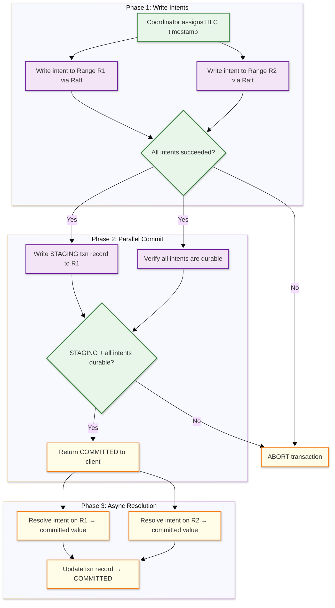

# Low-Level Design — NewSQL Database

## Data Model

### Key Encoding Scheme

All relational data is encoded into a sorted key-value representation. The key encoding determines how SQL tables map to the distributed KV store:

```
Key Format:
  /<table_id>/<index_id>/<encoded_column_values>/<timestamp>

Examples:
  /52/1/42/1709856000.000000001  → Table 52, primary index, row key=42, MVCC timestamp
  /52/2/"alice"/42/1709856000    → Table 52, secondary index on name, pointing to key=42
```

### MVCC Value Structure

```
┌─────────────────────────────────────────────────────────────┐
│ MVCC Key-Value Entry                                         │
├──────────────┬──────────────────────────────────────────────┤
│ key          │ encoded_table/index/columns                   │
│ timestamp    │ HLC timestamp (wall_time_ns + logical)        │
│ value_type   │ COMMITTED | INTENT                            │
│ txn_id       │ UUID (only for intents, NULL for committed)   │
│ value        │ encoded column data (protobuf / columnar)     │
│ prev_version │ pointer to previous MVCC version (optional)   │
└──────────────┴──────────────────────────────────────────────┘
```

### Range Descriptor

Each range is described by metadata stored in a system range:

```
┌─────────────────────────────────────────────────────────────┐
│ Range Descriptor                                             │
├──────────────┬──────────────────────────────────────────────┤
│ range_id     │ Globally unique range identifier              │
│ start_key    │ First key in the range (inclusive)            │
│ end_key      │ Last key in the range (exclusive)             │
│ replicas     │ List of (node_id, store_id, replica_type)     │
│ leaseholder  │ Node ID of current leaseholder                │
│ raft_term    │ Current Raft term number                      │
│ generation   │ Incremented on each split/merge               │
│ zone_config  │ Replication factor, placement constraints      │
└──────────────┴──────────────────────────────────────────────┘
```

### Transaction Record

```
┌─────────────────────────────────────────────────────────────┐
│ Transaction Record                                           │
├──────────────┬──────────────────────────────────────────────┤
│ txn_id       │ UUID                                          │
│ status       │ PENDING | STAGING | COMMITTED | ABORTED       │
│ write_ts     │ Commit timestamp (HLC)                        │
│ read_ts      │ Read timestamp (snapshot point)               │
│ max_ts       │ Upper bound for read uncertainty window        │
│ intents      │ List of (range_id, key) for all write intents │
│ heartbeat_ts │ Last heartbeat from coordinator               │
│ priority     │ LOW | NORMAL | HIGH (for conflict resolution) │
│ epoch        │ Incremented on coordinator restart             │
└──────────────┴──────────────────────────────────────────────┘
```

### LSM-Tree Storage Layout

```
┌──────────────────────────────────────────────┐
│ Memtable (in-memory, sorted skip list)       │
│   Active writes → sorted KV pairs             │
├──────────────────────────────────────────────┤
│ WAL (Write-Ahead Log)                         │
│   Sequential append of every write for        │
│   crash recovery                              │
├──────────────────────────────────────────────┤
│ Level 0 (flushed memtables, may overlap)     │
│   SST files: sorted, immutable                │
├──────────────────────────────────────────────┤
│ Level 1 (compacted, non-overlapping)         │
│   SST files: sorted, partitioned by key range │
├──────────────────────────────────────────────┤
│ Level 2-6 (progressively larger levels)      │
│   Each level ~10x size of previous            │
│   Compaction merges adjacent levels            │
└──────────────────────────────────────────────┘
```

### Lease Record

```
┌─────────────────────────────────────────────────────────────┐
│ Lease Record                                                 │
├──────────────┬──────────────────────────────────────────────┤
│ range_id     │ Range this lease covers                       │
│ replica_id   │ Replica holding the lease                     │
│ node_id      │ Node hosting the replica                      │
│ epoch        │ Monotonic lease epoch (incremented on transfer)│
│ start_ts     │ HLC timestamp when lease became active        │
│ expiration   │ Lease expiration timestamp                    │
│ sequence     │ Monotonic sequence for idempotency            │
│ observed_ts  │ Map of node_id → last observed timestamp      │
│ min_proposed │ Minimum timestamp for future proposals         │
└──────────────┴──────────────────────────────────────────────┘
```

### Node Descriptor

```
┌─────────────────────────────────────────────────────────────┐
│ Node Descriptor                                              │
├──────────────┬──────────────────────────────────────────────┤
│ node_id      │ Globally unique node identifier               │
│ address      │ RPC address (host:port)                       │
│ sql_address  │ SQL wire protocol address                     │
│ locality     │ Locality tiers: region=us-east, zone=us-east-1│
│ capacity     │ Disk capacity, available space, range count   │
│ server_ver   │ Binary version for rolling upgrade tracking   │
│ started_at   │ Node start timestamp                          │
│ cluster_id   │ UUID of the cluster this node belongs to      │
│ stores       │ List of store descriptors (disk mounts)       │
└──────────────┴──────────────────────────────────────────────┘
```

### Table Statistics (for Query Optimizer)

```
┌─────────────────────────────────────────────────────────────┐
│ Table Statistics                                             │
├──────────────┬──────────────────────────────────────────────┤
│ table_id     │ Table identifier                              │
│ total_rows   │ Estimated row count (from sampling)           │
│ total_bytes  │ Estimated data size                           │
│ columns      │ Per-column: distinct count, null fraction,    │
│              │   histogram (equi-depth buckets), avg_width   │
│ ranges       │ Range count, average range size               │
│ last_updated │ Timestamp of last statistics collection       │
│ auto_stats   │ Whether auto statistics collection is enabled │
└──────────────┴──────────────────────────────────────────────┘
```

### Indexing Strategy

| Index Type | Structure | Use Case |
|-----------|-----------|----------|
| **Primary index** | Encoded primary key → row data in LSM | Row lookups by primary key |
| **Secondary index (global)** | Encoded index columns → primary key; distributed across its own ranges | Cross-shard index lookups |
| **Secondary index (local)** | Co-located with base table range | Index lookups within a single range |
| **Covering index** | Index includes additional columns | Index-only scans without table lookup |
| **Hash-sharded index** | Hash prefix on sequential keys | Prevent write hot spots on sequential inserts |
| **Partial index** | Index only rows matching a predicate | Reduce index size for selective queries |
| **GIN index** | Inverted index on JSON/array columns | JSON field queries and array containment |
| **Spatial index** | R-tree on geometric columns | Geospatial queries (point-in-polygon, nearest neighbor) |

---

## API Design

### SQL Wire Protocol

```
Connection: PostgreSQL wire protocol (port 26257)

Client connects using any PostgreSQL driver:
  psql, JDBC, Go pgx, Python psycopg, Node pg

Session commands:
  SET CLUSTER SETTING ...       → Configure cluster parameters
  SET SESSION ...               → Configure session parameters
  SHOW RANGES FROM TABLE ...    → Inspect range distribution
```

### Transaction Lifecycle

```
BEGIN;                                    → Start transaction
  INSERT INTO orders (id, amount)
    VALUES (1001, 99.99);                 → Write intent to Range R1
  UPDATE accounts SET balance = balance - 99.99
    WHERE id = 42;                        → Write intent to Range R2
COMMIT;                                   → Parallel commit across R1, R2

-- Savepoints for partial rollback
BEGIN;
  INSERT INTO orders ...;
  SAVEPOINT sp1;
  UPDATE inventory ...;                   → If this fails:
  ROLLBACK TO sp1;                        → Undo only the UPDATE
  UPDATE inventory_v2 ...;                → Retry with different table
COMMIT;
```

### Administrative API

```
-- Range management
ALTER TABLE orders SPLIT AT VALUES (10000);     → Manual range split
ALTER TABLE orders SCATTER;                     → Redistribute ranges
SHOW RANGES FROM TABLE orders;                  → View range distribution

-- Zone configuration (placement)
ALTER TABLE orders CONFIGURE ZONE USING
  num_replicas = 5,
  constraints = '{+region=us-east: 2, +region=eu-west: 2, +region=ap-south: 1}',
  lease_preferences = '[[+region=us-east]]';

-- Schema change
ALTER TABLE orders ADD COLUMN status STRING DEFAULT 'pending';
CREATE INDEX CONCURRENTLY idx_orders_user ON orders (user_id);
```

### Follower Read API

```
-- Serve from any replica with at most 15 seconds of staleness
SELECT * FROM orders AS OF SYSTEM TIME '-15s' WHERE user_id = 42;

-- Exact timestamp read (useful for consistent snapshots across tables)
SELECT * FROM orders AS OF SYSTEM TIME '2026-03-10 14:30:00';

-- Follower read with bounded staleness (route to nearest replica)
BEGIN AS OF SYSTEM TIME with_max_staleness('10s');
  SELECT * FROM accounts WHERE id = 42;
  SELECT * FROM orders WHERE user_id = 42;
COMMIT;
-- Both SELECTs see a consistent snapshot ≤10 seconds old
```

### Error Code Classification

| Error Code | Category | Client Action |
|-----------|----------|---------------|
| 40001 | Serialization failure | Retry entire transaction (conflict detected at commit) |
| 40003 | Statement timeout | Retry with simpler query or higher timeout |
| 57014 | Query cancelled | User-initiated or admission control; retry after delay |
| 53300 | Too many connections | Wait and retry; check connection pool settings |
| XX000 | Internal error | Report to admin; do not retry automatically |
| 08006 | Connection failure | Reconnect to different node via load balancer |
| RETRY_SERIALIZABLE | Read uncertainty restart | Automatic (handled by database internally) |
| ABORT_REASON_PUSHER_ABORTED | Transaction pushed | Automatic retry with higher priority |

### Idempotency

- Transactions are identified by a unique `txn_id`; replaying the same transaction is detected and returns the original result
- Raft log entries carry a command ID; duplicate proposals are rejected by the state machine
- Client retries after ambiguous errors (timeout, network failure) use the same `txn_id` to check if the original transaction committed
- Idempotency tokens are stored in the transaction record; survive coordinator restarts via Raft

### Internal KV API (Node-to-Node)

```
// KV operations used by the distributed executor and transaction coordinator

// Point operations
Get(key, timestamp) → value, intent?
Put(key, value, txn_id, timestamp) → success/conflict
Delete(key, txn_id, timestamp) → success/conflict
ConditionalPut(key, expected_value, new_value, txn_id) → success/mismatch

// Range operations
Scan(start_key, end_key, timestamp, limit) → [(key, value)]
ReverseScan(start_key, end_key, timestamp, limit) → [(key, value)]
DeleteRange(start_key, end_key, txn_id) → deleted_count

// Transaction operations
HeartbeatTxn(txn_id) → success/not_found
EndTxn(txn_id, commit=true/false, intent_keys) → committed/aborted
PushTxn(pusher_txn, pushee_txn, push_type) → updated_txn_record
ResolveIntent(key, txn_id, status, commit_ts) → success
ResolveIntentRange(start_key, end_key, txn_id, status) → resolved_count

// Administrative operations
AdminSplit(split_key) → new_range_descriptor
AdminMerge(left_range, right_range) → merged_range_descriptor
AdminTransferLease(range_id, target_node) → success
AdminChangeReplicas(range_id, add/remove, node_id) → success
```

### CDC (Change Data Capture) Event Format

```
┌─────────────────────────────────────────────────────────────┐
│ CDC Event                                                    │
├──────────────┬──────────────────────────────────────────────┤
│ table        │ Table name (e.g., "orders")                   │
│ key          │ Primary key of the affected row               │
│ timestamp    │ HLC timestamp of the committed write          │
│ operation    │ INSERT | UPDATE | DELETE                      │
│ before       │ Previous row values (for UPDATE/DELETE)       │
│ after        │ New row values (for INSERT/UPDATE)            │
│ resolved_ts  │ Resolved timestamp (all events below this     │
│              │   timestamp have been emitted)                │
│ topic        │ CDC feed identifier                           │
└──────────────┴──────────────────────────────────────────────┘

// CDC guarantees:
//   - At-least-once delivery (consumer must deduplicate)
//   - Ordered per key (events for the same key in commit order)
//   - Resolved timestamp advances monotonically
//   - No event emitted before its transaction commits
```

### Rate Limiting

| Endpoint | Limit | Window |
|----------|-------|--------|
| SQL connections per client | 100 concurrent | Session-based |
| Queries per second per client | 10,000 | Sliding window |
| DDL operations | 10/min | Fixed window |
| Cluster-wide write throughput | Configurable per-range QPS | Admission control |
| Bytes scanned per query | 100 MB (configurable) | Per-query |
| CDC backlog per range | 1 GB | Per-range, blocks writes on overflow |

---

## Core Algorithms

### 1. Raft Consensus for Range Replication

```
FUNCTION raft_propose_write(range, key, value, txn_id):
    leader = range.raft_group.leader

    IF this_node != leader:
        RETURN redirect_to_leader(leader)

    // Create log entry
    entry = RaftLogEntry(
        term = current_term,
        index = next_log_index,
        command = WriteIntent(key, value, txn_id)
    )

    // Append to leader's log
    leader.log.append(entry)
    leader.wal.fsync(entry)

    // Send AppendEntries to followers in parallel
    ack_count = 1  // leader counts as one
    FOR EACH follower IN range.raft_group.followers:
        ASYNC send_append_entries(follower, entry)

    // Wait for quorum (majority)
    WAIT UNTIL ack_count >= majority(range.replica_count):
        ON follower_ack(follower_id):
            ack_count += 1

    // Commit: apply to state machine (LSM-tree)
    lsm_tree.put(key, value, txn_id, timestamp)
    advance_commit_index(entry.index)

    RETURN success

// Followers handle AppendEntries:
FUNCTION on_append_entries(leader_id, entries, leader_commit):
    IF entries.term < current_term:
        RETURN reject(current_term)

    FOR EACH entry IN entries:
        log.append(entry)
        wal.fsync(entry)

    // Apply committed entries to local LSM-tree
    WHILE commit_index < leader_commit:
        apply_to_state_machine(log[commit_index + 1])
        commit_index += 1

    RETURN ack(last_log_index)
```

### 2. Distributed Transaction with Parallel Commits



```
FUNCTION parallel_commit(txn, intents):
    // Phase 1: Write all intents in parallel
    results = PARALLEL FOR EACH intent IN intents:
        range = lookup_range(intent.key)
        raft_propose_write(range, intent.key, intent.value, txn.id)

    IF any result is FAILURE:
        abort_transaction(txn)
        RETURN ABORTED

    // Phase 2: Parallel commit
    //   Write STAGING record AND verify intents concurrently
    txn.status = STAGING
    txn.intent_keys = [intent.key FOR intent IN intents]

    staging_result = ASYNC raft_propose_write(
        txn_record_range, txn.id, txn.serialize()
    )

    // Verify all intents are durable (they already are from Phase 1)
    // The STAGING record + durable intents = implicitly committed

    WAIT staging_result

    // Client can be notified of success NOW
    // (one consensus round-trip, not two)
    RETURN COMMITTED

    // Phase 3: Async cleanup (background)
    ASYNC:
        FOR EACH intent IN intents:
            resolve_intent(intent.key, txn.id, COMMITTED)
        update_txn_record(txn.id, COMMITTED)
```

### 3. Hybrid Logical Clock Synchronization

```
FUNCTION hlc_now():
    physical = system_clock_ns()

    IF physical > local_hlc.wall_time:
        local_hlc.wall_time = physical
        local_hlc.logical = 0
    ELSE:
        // Physical clock hasn't advanced; increment logical
        local_hlc.logical += 1

    RETURN HLC(local_hlc.wall_time, local_hlc.logical)

FUNCTION hlc_update(received_hlc):
    // Called when receiving a message with a remote HLC timestamp
    physical = system_clock_ns()

    IF physical > local_hlc.wall_time AND physical > received_hlc.wall_time:
        local_hlc.wall_time = physical
        local_hlc.logical = 0
    ELSE IF received_hlc.wall_time > local_hlc.wall_time:
        local_hlc.wall_time = received_hlc.wall_time
        local_hlc.logical = received_hlc.logical + 1
    ELSE IF local_hlc.wall_time > received_hlc.wall_time:
        local_hlc.logical += 1
    ELSE:
        // Equal wall times
        local_hlc.logical = max(local_hlc.logical, received_hlc.logical) + 1

    RETURN HLC(local_hlc.wall_time, local_hlc.logical)

// Properties:
//   1. HLC is always >= physical clock (causality with real time)
//   2. If event A causes event B, then hlc(A) < hlc(B)
//   3. HLC advances monotonically on each node
//   4. No special hardware required (uses NTP)
```

### 4. SQL Query Distribution and Planning

```
FUNCTION plan_distributed_query(sql_text, schema):
    // Step 1: Parse SQL → AST
    ast = parse(sql_text)

    // Step 2: Logical plan
    logical_plan = ast_to_logical(ast, schema)
    //   Resolve table/column references
    //   Apply view expansion
    //   Normalize predicates

    // Step 3: Enumerate physical plans
    candidates = []
    FOR EACH join_order IN enumerate_join_orders(logical_plan):
        FOR EACH access_path IN enumerate_access_paths(join_order):
            plan = PhysicalPlan(join_order, access_path)
            plan.cost = estimate_cost(plan, statistics)
            candidates.append(plan)

    best_plan = min(candidates, key=lambda p: p.cost)

    // Step 4: Distribute plan across ranges
    distributed_plan = distribute(best_plan)
    //   For each table scan: identify affected ranges
    //   For each range: create a "leaf" plan fragment
    //   Pushdown: move filters, projections, limits to leaf fragments
    //   Determine coordinator node for result aggregation

    // Step 5: Pushdown optimizations
    FOR EACH leaf IN distributed_plan.leaves:
        push_down_predicates(leaf)    // WHERE clauses
        push_down_projections(leaf)   // SELECT columns
        push_down_limits(leaf)        // LIMIT / TOP-K
        push_down_aggregations(leaf)  // Partial SUM, COUNT, AVG

    RETURN distributed_plan

FUNCTION estimate_cost(plan, stats):
    total_cost = 0
    FOR EACH node IN plan.nodes:
        row_count = estimate_cardinality(node, stats)
        io_cost = row_count * COST_PER_ROW_IO
        cpu_cost = row_count * COST_PER_ROW_CPU
        network_cost = 0

        IF node.requires_cross_range_data:
            network_cost = row_count * COST_PER_ROW_NETWORK

        total_cost += io_cost + cpu_cost + network_cost

    RETURN total_cost

// Cost factors for distributed SQL:
//   - Number of ranges touched (network round-trips)
//   - Data volume transferred between nodes
//   - Whether predicate can be pushed to storage layer
//   - Index selectivity at each range
//   - Estimated rows at each plan node (cardinality)
```

### 5. Online Schema Change (Two-Version Protocol)

```
FUNCTION online_schema_change(table_id, change):
    // Schema changes propagate through version fences
    // Rule that never changes: at most 2 adjacent schema versions active

    current_version = get_current_schema_version(table_id)
    new_version = current_version + 1

    SWITCH change.type:
        CASE ADD_COLUMN:
            // Stage 1: DELETE-ONLY — new column exists in schema
            //   but is only populated on DELETE (for rollback safety)
            publish_schema_version(table_id, new_version, stage=DELETE_ONLY)
            wait_for_all_nodes_to_adopt(new_version, DELETE_ONLY)

            // Stage 2: DELETE_AND_WRITE_ONLY — new column written on
            //   INSERT/UPDATE but NOT yet visible to SELECT
            publish_schema_version(table_id, new_version, stage=WRITE_ONLY)
            wait_for_all_nodes_to_adopt(new_version, WRITE_ONLY)

            // Stage 3: BACKFILL — populate existing rows with default value
            backfill_column(table_id, change.column, change.default_value)
            //   Process in batches of 1000 rows
            //   Rate-limited to avoid impacting foreground traffic
            //   Checkpointed per range for crash recovery

            // Stage 4: PUBLIC — column visible to all operations
            publish_schema_version(table_id, new_version, stage=PUBLIC)
            wait_for_all_nodes_to_adopt(new_version, PUBLIC)

            // Drop the old schema version
            drop_schema_version(table_id, current_version)

        CASE CREATE_INDEX:
            // Similar stages: DELETE_ONLY → WRITE_ONLY → BACKFILL → PUBLIC
            // Backfill scans every row and creates index entries
            // During WRITE_ONLY stage, new writes maintain both old and new indexes
            // During backfill, temporary write fence prevents inconsistency

FUNCTION backfill_column(table_id, column, default_value):
    ranges = get_ranges_for_table(table_id)
    checkpoint = load_backfill_checkpoint(table_id, column)

    FOR EACH range IN ranges STARTING FROM checkpoint:
        batch = scan_range(range, batch_size=1000)
        FOR EACH row IN batch:
            IF row[column] IS NULL:
                update_row(row.key, column, default_value)

        save_backfill_checkpoint(table_id, column, range.end_key)
        rate_limit(max_rows_per_second=5000)
```

### 6. MVCC Garbage Collection

```
FUNCTION mvcc_garbage_collection(range):
    gc_threshold = hlc_now() - GC_WINDOW  // e.g., 25 hours ago

    // Scan all MVCC versions in the range
    iterator = range.lsm.new_iterator()

    WHILE iterator.valid():
        key = iterator.key()
        versions = collect_all_versions(iterator, key)

        // Keep the latest version unconditionally
        latest = versions[0]

        // For older versions: delete if below GC threshold
        FOR EACH version IN versions[1:]:
            IF version.timestamp < gc_threshold:
                IF version.type == INTENT:
                    // Unresolved intent below GC threshold
                    // The transaction must have been abandoned
                    abort_transaction(version.txn_id)
                    delete_version(version)
                ELSE:
                    // Old committed version — safe to delete
                    delete_version(version)

    // GC runs during LSM compaction:
    //   - No separate I/O pass needed
    //   - Dead versions simply not copied to output SST file
    //   - Called by the compaction filter on each key

    // Key considerations:
    //   - GC cannot delete a version if any active transaction
    //     might read it (read timestamp > version timestamp)
    //   - Protected timestamps: long-running operations (backups,
    //     CDC) can set a protected timestamp to prevent GC below it
    //   - GC must coordinate with intent resolution to avoid
    //     deleting intents that are still being resolved
```

### 7. Range Lease Transfer

```
FUNCTION transfer_lease(range, from_replica, to_replica):
    // Lease transfer is used during rebalancing, decommissioning,
    // or to move leaseholders closer to clients

    // Step 1: Current leaseholder proposes transfer via Raft
    transfer_request = LeaseTransfer(
        range_id = range.id,
        from = from_replica,
        to = to_replica,
        prev_lease_epoch = current_lease.epoch,
        new_lease_epoch = current_lease.epoch + 1,
        new_lease_start = hlc_now()
    )

    // Step 2: Replicate transfer through Raft
    raft_propose(range, transfer_request)
    // Must be committed by quorum to take effect

    // Step 3: On commit, all replicas update their lease state
    //   - Old leaseholder: stop serving reads immediately
    //   - New leaseholder: begin serving reads at new_lease_start
    //   - In-flight reads on old leaseholder:
    //     - Reads with timestamp < new_lease_start: complete normally
    //     - Reads with timestamp >= new_lease_start: redirect to new leaseholder

    // Step 4: Transfer observed timestamps
    //   The new leaseholder inherits the observed timestamps from the old one
    //   This prevents the read uncertainty window from widening after transfer
    new_leaseholder.observed_timestamps = merge(
        old_leaseholder.observed_timestamps,
        {from_replica.node_id: new_lease_start}
    )

    // Safety Rule that never changes: there is never a gap in lease coverage
    //   The new lease starts at or before the old lease expires
    //   Reads during the transition are either served by the old leaseholder
    //   (timestamp < transfer) or new leaseholder (timestamp >= transfer)
```

### 8. Admission Control and Backpressure

```
FUNCTION admission_control(request):
    // Multi-level admission control prevents overload cascades

    // Level 1: Connection admission
    IF active_connections >= MAX_CONNECTIONS:
        RETURN error("too many connections; retry later")

    // Level 2: CPU-based admission
    IF cpu_utilization > CPU_OVERLOAD_THRESHOLD:  // e.g., 85%
        IF request.priority < HIGH:
            queue_request(request, wait_time=estimate_wait())
            IF wait_time > request.timeout:
                RETURN error("server overloaded; retry later")

    // Level 3: Storage write admission (LSM backpressure)
    IF lsm_level0_file_count > L0_SLOWDOWN_THRESHOLD:  // e.g., 20
        // Slow down writes to let compaction catch up
        delay = (l0_count - threshold) * DELAY_PER_FILE  // e.g., 5ms
        sleep(delay)

    IF lsm_level0_file_count > L0_STOP_THRESHOLD:  // e.g., 36
        // Hard stop: reject writes until compaction clears backlog
        RETURN error("write stall: compaction backlog too high")

    // Level 4: Memory-based admission
    IF query_memory_usage > PER_QUERY_MEMORY_LIMIT:
        // Spill to disk or abort query
        IF request.allows_disk_spill:
            enable_disk_spill(request)
        ELSE:
            RETURN error("query exceeded memory limit")

    // Level 5: Per-range write rate limiting
    range = lookup_range(request.key)
    IF range.write_qps > MAX_RANGE_QPS:
        // Backpressure: suggest client retry after range split
        RETURN error("range overloaded; retry after split")

    RETURN allow(request)
```
