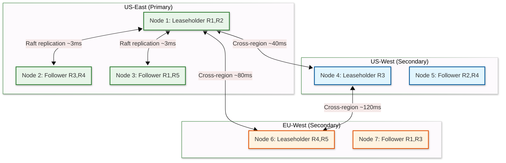

# Scalability & Reliability — NewSQL Database

## Scalability

### Horizontal vs. Vertical Scaling

| Aspect | Vertical Scaling | Horizontal Scaling |
|--------|-----------------|-------------------|
| Approach | Larger machines (more RAM, faster NVMe) | More nodes; ranges automatically rebalanced |
| Transaction performance | Optimal — no cross-node coordination | Cross-range transactions add consensus latency |
| Capacity ceiling | ~64 TB per node (practical limit) | Petabytes across hundreds of nodes |
| Operational complexity | Simple (single node tuning) | Complex (range rebalancing, clock sync, distributed debugging) |
| Cost efficiency | Expensive at scale | Cost-effective with commodity hardware |
| When to use | < 2 TB data, single region | > 2 TB data or multi-region requirement |

**Strategy:** Horizontal scaling is the primary scaling mechanism. Unlike traditional RDBMS, a NewSQL database is designed from the ground up for horizontal scaling — adding a node automatically triggers range rebalancing, distributing data and load without manual intervention.

### Range-Based Sharding

Data is automatically sharded into ranges (contiguous key spans) that are the unit of replication, distribution, and load balancing.

```
Table: orders (primary key: order_id INT)

Key space:  [/orders/0 ─────────────────────────── /orders/MAX]

Ranges:     [/orders/0,      /orders/10000)     → Range R1 (Node 1)
            [/orders/10000,  /orders/25000)     → Range R2 (Node 2)
            [/orders/25000,  /orders/50000)     → Range R3 (Node 3)
            [/orders/50000,  /orders/MAX)       → Range R4 (Node 1)
```

#### Automatic Range Splitting

```
FUNCTION check_split_needed(range):
    IF range.size > MAX_RANGE_SIZE:        // Size-based (default 512 MB)
        RETURN split_at_midpoint(range)

    IF range.qps > MAX_RANGE_QPS:          // Load-based
        RETURN split_at_load_midpoint(range)

    IF range.cpu_time > MAX_RANGE_CPU:     // CPU-based
        RETURN split_at_load_midpoint(range)

    RETURN no_split_needed
```

#### Automatic Range Rebalancing

```
FUNCTION rebalance_cluster():
    // Runs periodically (every 1 minute)
    node_loads = collect_node_metrics()  // ranges, QPS, disk, CPU

    FOR EACH node IN over_loaded_nodes(node_loads):
        source_range = select_range_to_move(node)  // least disruptive
        target_node = select_target_node(node_loads)  // most underloaded

        // Move range: add replica to target, wait for catch-up, remove from source
        add_learner_replica(source_range, target_node)
        WAIT until_replica_caught_up(source_range, target_node)
        promote_to_voter(source_range, target_node)
        transfer_lease(source_range, target_node)
        remove_old_replica(source_range, node)
```

### Replication Strategy: Raft Groups Per Range

Each range is independently replicated via its own Raft consensus group:

| Aspect | Configuration |
|--------|--------------|
| Replication factor | 3 (default), 5 for critical system ranges |
| Raft group per range | Independent leader election, log, and state machine |
| Leader and leaseholder | Typically co-located for performance; can be separated for geo-distribution |
| Learner replicas | Non-voting replicas used during rebalancing to catch up before becoming voters |

```
Range R1 (keys: [/orders/0, /orders/10000))
  ├── Node 1: Leader + Leaseholder (serves reads/writes)
  ├── Node 2: Follower (replicates via Raft)
  └── Node 3: Follower (replicates via Raft)

Range R2 (keys: [/orders/10000, /orders/25000))
  ├── Node 2: Leader + Leaseholder
  ├── Node 3: Follower
  └── Node 1: Follower
```

### Caching Layers

| Layer | Component | Strategy | Size |
|-------|-----------|----------|------|
| L1 | Block cache | LRU, caches SST data blocks | 25% of RAM per node |
| L2 | Row cache | LRU, caches deserialized rows | 5% of RAM per node |
| L3 | SQL plan cache | LRU, invalidated on schema change | 128 MB per node |
| L4 | Range descriptor cache | Invalidated on split/merge/move | 64 MB per node |
| L5 | Raft entry cache | Bounded ring buffer per Raft group | 16 MB per range |

### Hot Spot Mitigation

| Hot Spot Type | Cause | Mitigation |
|--------------|-------|------------|
| Sequential key inserts | Auto-increment IDs, timestamps | Hash-sharded indexes distribute writes across ranges |
| Popular row reads | Frequently accessed account/product | Read from follower replicas (follower reads) |
| Popular row writes | Global counter, inventory deduction | Application-level bucketing; scatter-gather pattern |
| Large range | Bulk data load into narrow key range | Pre-split ranges before bulk load |
| Leaseholder concentration | Ranges cluster on one node | Lease rebalancing spreads leaseholders evenly |

### Auto-Scaling Triggers

| Metric | Threshold | Action |
|--------|-----------|--------|
| CPU utilization | > 70% sustained 10 min | Add node; rebalancer moves ranges to new node |
| Disk utilization | > 70% | Add node or expand storage |
| Range count per node | > 10,000 | Add node (too many Raft groups per node) |
| Replication lag | > 10 seconds | Investigate slow follower; replace if necessary |
| Cross-range transaction ratio | > 50% | Review schema; consider key design changes |
| p99 latency | > 100ms sustained | Add nodes or split hot ranges |

---

## Reliability & Fault Tolerance

### Single Points of Failure

| Component | SPOF Risk | Mitigation |
|-----------|-----------|------------|
| Range leaseholder | Loss stops reads/writes for that range | Raft elects new leader in < 10 seconds |
| SQL gateway node | Loss drops client connections | Stateless; any node can serve SQL; load balancer re-routes |
| Metadata range | Loss prevents range lookups | System ranges replicated with higher factor (5x) |
| Single node | Loss affects ranges with replicas on that node | All ranges have 3+ replicas across different nodes |
| Entire availability zone | Loss of 1/3 of replicas | Cross-AZ placement ensures quorum survives |
| Clock source (NTP) | Clock drift increases uncertainty window | Multiple NTP sources; self-quarantine on excessive skew |

### Redundancy Strategy

- **3x replication** for each range (1 leader + 2 followers across different failure domains)
- **Cross-AZ placement** — each replica in a different availability zone
- **5x replication** for system metadata ranges (cluster configuration, range descriptors)
- **Stateless SQL layer** — any node serves any SQL query; no session affinity required
- **WAL** persisted on durable storage before acknowledging writes

### Failover Mechanisms

**Raft Leader Failure:**

```
1. Followers detect heartbeat timeout (3-5 seconds configurable)
2. Follower with most up-to-date log starts election (pre-vote)
3. Candidate requests votes from other replicas
4. Majority vote grants leadership
5. New leader applies any uncommitted log entries
6. Leaseholder transfers to new leader automatically
7. Clients retry in-flight operations (idempotency keys prevent duplication)

Total failover time: 5-10 seconds
```

**Node Failure:**

```
1. Health monitor detects node unresponsive (10 seconds)
2. All Raft groups with leaders on failed node trigger elections
3. New leaders elected on surviving nodes (parallel, independent)
4. Under-replicated ranges detected (replica count < target)
5. Rebalancer adds new replicas on healthy nodes from surviving copies
6. New replicas catch up via Raft snapshot + log replay

Full re-replication: minutes to hours depending on data size
```

### Circuit Breaker Pattern

| Circuit | Trigger | Open Duration | Fallback |
|---------|---------|---------------|----------|
| Cross-node RPC | > 50% failures in 30s | 30 seconds | Route to alternate replica |
| Raft proposal | > 3 consecutive timeouts | 15 seconds | Return "range unavailable" error |
| LSM compaction | Compaction backlog > 100 files | Until cleared | Throttle writes via admission control |
| CDC pipeline | > 10 failures in 120s | 120 seconds | Buffer changes locally |

### Retry Strategy

| Operation | Retry Count | Backoff | Notes |
|-----------|-------------|---------|-------|
| Point read | 3 | Exponential (50ms, 100ms, 200ms) | Retry on different replica if leaseholder unavailable |
| Write transaction | 2 | Exponential (100ms, 250ms) | Only for transient errors; serialization failures get full retry |
| Raft proposal | 5 | Exponential (50ms → 1s) | Leader steps down after repeated failures |
| Range lookup | 3 | Exponential (25ms, 50ms, 100ms) | Refresh range cache on failure |

### Graceful Degradation

| Severity | Condition | Degradation |
|----------|-----------|-------------|
| Level 1 | Single replica down | No user impact; range still has quorum |
| Level 2 | Leaseholder down | Writes pause 5-10s during election; reads continue on followers |
| Level 3 | Minority of nodes down | Affected ranges unavailable until election; majority of ranges unaffected |
| Level 4 | Loss of quorum for some ranges | Those ranges become read-only from surviving replicas (stale reads) |
| Level 5 | Majority of cluster down | Emergency read-only mode on surviving nodes |

### Bulkhead Pattern

| Bulkhead | Resources | Purpose |
|----------|-----------|---------|
| OLTP transactions | 60% of thread pool, 50% of admission tokens | Protect latency-sensitive reads/writes |
| Distributed SQL execution | 20% of thread pool | Multi-range queries don't starve point lookups |
| Raft replication | Dedicated thread pool | Consensus never blocked by query execution |
| Background maintenance | 10% of I/O bandwidth | Compaction, GC, stats collection |

### Performance Tuning Guide

| Parameter | Default | Tune When | Impact |
|-----------|---------|-----------|--------|
| `max_clock_offset` | 250ms | Using PTP or well-tuned NTP | Lower value → fewer read restarts → better read latency |
| `range_max_bytes` | 512 MB | Write-heavy workloads | Smaller → more parallelism; larger → fewer Raft groups |
| `gc.ttlseconds` | 90000 (25h) | Storage pressure or PITR needs | Shorter → less bloat; longer → more PITR flexibility |
| `kv.admission_control.enabled` | true | Understanding admission overhead | Prevents cascading overload; slight latency for queued requests |
| `sql.defaults.statement_timeout` | 0 (unlimited) | Preventing runaway queries | Set to 30-60s for OLTP; 300s for analytics |
| `sql.stats.automatic_collection` | true | Query plans degrading | Disable only if stats collection causes I/O spikes |
| `server.time_until_store_dead` | 5m | Faster/slower failover | Shorter → faster re-replication; risk of unnecessary moves |

---

## Scaling Case Studies

### Case Study: Scaling from 10 to 100 Nodes

**Phase 1 — Preparation (Week 1-2):**
- Profile current range distribution: identify ranges with >10K QPS or >1 GB size
- Pre-split large ranges to reduce rebalancing time after node addition
- Validate NTP synchronization across all new nodes (clock offset <50ms)

**Phase 2 — Rolling Node Addition (Week 2-4):**
- Add 5 nodes at a time; allow 24 hours for range rebalancing between batches
- Monitor: range count per node (target: ±20% of mean), Raft leader distribution, latency percentiles
- Key metric: `ranges_under_replicated` should return to 0 within 2 hours of each batch

**Phase 3 — Validation (Week 4-5):**
- Run production load test: verify p99 latency at target QPS
- Verify range distribution: no node should have >2x the average range count
- Chaos test: kill 2 nodes simultaneously; verify recovery <30 seconds

**Lessons learned:**
- Adding too many nodes simultaneously overwhelms Raft with snapshot transfers
- Range rebalancing is I/O-bound: disk bandwidth determines rebalancing speed
- Leaseholder distribution lags behind range distribution — explicit lease rebalancing may be needed

### Decommissioning a Node

```
FUNCTION decommission_node(node_id):
    // Mark node as decommissioning (stops receiving new ranges)
    set_node_status(node_id, DECOMMISSIONING)

    // Move all ranges to other nodes
    FOR EACH range WHERE node_id IN range.replicas:
        target = select_target_node(exclude=node_id)
        add_replica(range, target)
        WAIT until_replica_caught_up(range, target)
        remove_replica(range, node_id)

    // Verify no ranges remain on the node
    ASSERT range_count(node_id) == 0

    // Mark node as decommissioned (safe to shut down)
    set_node_status(node_id, DECOMMISSIONED)
    shutdown(node_id)

// Decommission time: ~hours for a fully loaded node
// Data moved: all ranges × range_size / disk_bandwidth
// Example: 5,000 ranges × 256 MB = 1.28 TB / 200 MB/s = ~107 minutes
```

---

## Disaster Recovery

### Recovery Objectives

| Metric | Target | Strategy |
|--------|--------|----------|
| RPO (single region) | 0 seconds | Synchronous Raft replication (quorum write) |
| RTO (single region) | < 10 seconds | Automatic Raft leader election |
| RPO (cross-region) | < 1 second | Synchronous cross-region quorum (5-replica) |
| RTO (cross-region) | < 30 seconds | Leader election + client reconnection |
| RPO (region failure) | 0 seconds (with cross-region quorum) | Surviving regions have committed data |
| RTO (region failure) | < 60 seconds | Elections in surviving regions + DNS update |

### Backup Strategy

| Backup Type | Frequency | Retention | Method |
|-------------|-----------|-----------|--------|
| Incremental | Continuous | 30 days | Export committed MVCC data to object storage |
| Full snapshot | Daily | 90 days | Consistent cluster-wide snapshot via distributed timestamp |
| Point-in-time recovery | Continuous within window | 7 days | MVCC version history allows reading at any past timestamp |
| Cross-region | Continuous | 7 days | Asynchronous replication to standby region |

### Multi-Region Deployment

| Topology | Write Latency | Read Latency | Survivability | Complexity |
|----------|--------------|-------------|---------------|------------|
| Single-region, multi-AZ | < 5ms | < 2ms | Survives AZ failure | Low |
| Multi-region, 3 replicas (one per region) | ~100ms (cross-region quorum) | < 2ms (local leaseholder) | Survives region failure | Medium |
| Multi-region, 5 replicas (2+2+1) | ~100ms (cross-region quorum) | < 2ms (local reads) | Survives region failure | High |
| Multi-region with locality config | < 5ms (local writes for pinned data) | < 2ms | Survives region failure for non-pinned data | High |

**Key multi-region technique: Lease preferences**

Pin leaseholders for specific tables to the region where those tables are most accessed. A `users` table for US customers has its leaseholders in `us-east`, while EU customer data has leaseholders in `eu-west`. Reads are always fast (local leaseholder), and writes for region-pinned data complete with local quorum.

### Multi-Region Architecture



---

## Scalability Limits and Ceiling Analysis

| Dimension | Theoretical Limit | Practical Limit | Slowest part of the process |
|-----------|-------------------|-----------------|-----------|
| Cluster size | Unlimited | ~500 nodes | Gossip protocol overhead; placement driver becomes Slowest part of the process |
| Range count | Unlimited | ~2M per cluster | Metadata range size; system table scan time |
| Ranges per node | ~50K | ~15K | Raft heartbeat overhead; memory for per-range state |
| Write QPS per range | ~5K | ~2,500 | Single Raft leader serialization |
| Total write QPS | Unlimited (with enough ranges) | Millions | Network bandwidth between nodes |
| Data size | Petabytes | Limited by cost | NVMe capacity × node count × replication factor |
| Concurrent connections | ~100K per node | ~10K per node | Memory per connection; goroutine overhead |
| Transaction span | All ranges | ~100 ranges | Intent resolution cost scales linearly |

---

## Capacity Planning Formulas

### Storage Capacity

```
total_logical_storage = total_rows × avg_row_size
mvcc_overhead = total_logical_storage × (1 + gc_window_hours / avg_row_lifetime_hours)
index_storage = total_logical_storage × index_overhead_factor  // typically 0.5-1.5x
wal_storage = write_rate_bytes_per_sec × wal_retention_seconds
total_per_replica = total_logical_storage + mvcc_overhead + index_storage + wal_storage
total_physical = total_per_replica × replication_factor

// Example: 10B rows × 256B = 2.56 TB logical
//   MVCC (25h window, 72h avg lifetime): 2.56 × 1.35 = 3.46 TB
//   Indexes: 2.56 × 1.0 = 2.56 TB
//   WAL: 50K writes/s × 256B × 3600s = 46 GB
//   Total per replica: ~6.1 TB
//   3x replication: ~18.3 TB cluster
```

### Compute Capacity

```
raft_cpu_per_range = 0.001 cores  // heartbeats, log management
foreground_cpu_per_qps = 0.00005 cores  // per read/write operation
compaction_cpu_per_tb = 0.5 cores  // background compaction I/O

total_cpu = (range_count × raft_cpu_per_range)
          + (total_qps × foreground_cpu_per_qps)
          + (total_storage_tb × compaction_cpu_per_tb)

// Example: 100K ranges + 250K QPS + 18 TB
//   Raft: 100K × 0.001 = 100 cores
//   Foreground: 250K × 0.00005 = 12.5 cores
//   Compaction: 18 × 0.5 = 9 cores
//   Total: ~122 cores → 8 nodes × 16 vCPU
```

### Memory Capacity

```
block_cache = hot_data_size × 0.3  // 30% of hot data in cache
raft_memory = range_count × 3 MB  // per-range Raft state
connection_memory = max_connections × 10 MB  // per-connection buffers
query_memory = concurrent_queries × avg_query_memory

total_memory_per_node = (block_cache + raft_memory + connection_memory + query_memory)
                        / node_count

// Example: 2 TB hot data, 100K ranges, 500 connections, 100 concurrent queries
//   Block cache: 600 GB cluster → 40 GB/node
//   Raft: 300 GB cluster → 20 GB/node
//   Connections: 5 GB cluster
//   Queries: 10 GB cluster
//   Total: ~65 GB/node → 64 GB RAM per node is tight; 128 GB recommended
```

---

## Chaos Engineering Experiments

| # | Experiment | Hypothesis | Procedure | Expected Outcome |
|---|-----------|-----------|-----------|-----------------|
| 1 | **Kill Raft leader** | Range recovers in <10s via election | Kill the process hosting leaseholder for a test range | New leader elected; clients see ~5s of errors then resume |
| 2 | **Network partition between AZs** | Ranges with quorum in surviving AZs remain available | Use iptables to partition one AZ from the other two | Ranges with majority in surviving AZs continue; partitioned ranges become unavailable |
| 3 | **Clock skew injection** | Nodes self-quarantine at threshold | Use faketime to advance one node's clock by 500ms | Node detects offset > max_clock_offset; stops serving reads; alerts fire |
| 4 | **Disk I/O latency injection** | Compaction backpressure triggers write throttling | Use tc to add 50ms latency to disk I/O on one node | L0 file count rises; admission control slows writes; latency increases on affected ranges |
| 5 | **Kill node during range split** | Split completes or rolls back cleanly | Kill a node while a range split is in progress | Raft ensures split is either committed (new ranges exist) or not (old range intact) |
| 6 | **Exhaust memory on one node** | OOM killer terminates node; ranges failover | Run memory-intensive query exceeding per-query limits | Query rejected by admission control; if OOM occurs, node restarts and ranges elect new leaders |
| 7 | **NTP source failure** | HLC continues but uncertainty window grows | Block NTP traffic to a node | Node's clock offset grows; after threshold, node self-quarantines; alerts on clock_offset_ms metric |

---

## Data Archival and Cold Storage Strategy

| Data Type | Hot Tier | Warm Tier | Cold Tier | Archive |
|-----------|---------|-----------|-----------|---------|
| Active transactions | NVMe SSD | — | — | — |
| Recent data (<30 days) | NVMe SSD | — | — | — |
| Historical data (30-365 days) | — | Network SSD | — | — |
| Archived data (>1 year) | — | — | Object storage | — |
| MVCC versions (within GC window) | NVMe SSD | — | — | — |
| MVCC versions (beyond GC window) | Deleted by GC | — | — | — |
| Backups (incremental) | — | — | Object storage | 30-day retention |
| Backups (full snapshots) | — | — | Object storage | 90-day retention |

**Tiered storage implementation:**
- Range-level age tracking: each range records the youngest and oldest key timestamps
- Ranges where all keys are older than the warm threshold are migrated to network SSD
- Migration is transparent: the range descriptor updates its store assignment; the rebalancer handles data movement
- Reads from warm/cold ranges incur higher latency but are served through the same SQL interface
- Promotion: a cold range accessed above a QPS threshold is automatically promoted to hot tier

---

## Disaster Recovery Runbook

### Phase 1: Detection (0-60 seconds)
1. Alerting system fires on `node_unreachable` or `raft_quorum_loss`
2. On-call engineer acknowledges alert
3. Check cluster dashboard: which nodes are down, which ranges are affected
4. Determine scope: single node, AZ failure, region failure

### Phase 2: Assessment (1-5 minutes)
1. Identify under-replicated ranges: `SHOW RANGES WHERE under_replicated = true`
2. Check Raft leader distribution: are elections completing?
3. Verify NTP synchronization on surviving nodes
4. Check for cascading failures (compaction backlog, connection pool exhaustion)

### Phase 3: Mitigation (5-30 minutes)
1. If single node failure: monitor automatic re-replication; no action needed if completing
2. If AZ failure: verify quorum maintained for all ranges; monitor write latency for cross-AZ quorum
3. If region failure: activate DNS failover to redirect clients to surviving regions; verify cross-region ranges have quorum
4. If data loss suspected: immediately pause MVCC GC (set protected timestamp to now)

### Phase 4: Recovery (30 minutes - hours)
1. Bring up replacement nodes or restore failed nodes
2. Monitor re-replication progress: `SELECT count(*) FROM system.replication_stats WHERE under_replicated = true`
3. Verify data integrity: run consistency checker on restored ranges
4. Resume normal MVCC GC after all ranges fully replicated

### Phase 5: Post-Incident (hours - days)
1. Conduct blameless post-mortem
2. Update runbook with any new failure modes discovered
3. Add chaos engineering test for the observed failure scenario
4. Review quorum placement — would a different replica configuration have reduced impact?
