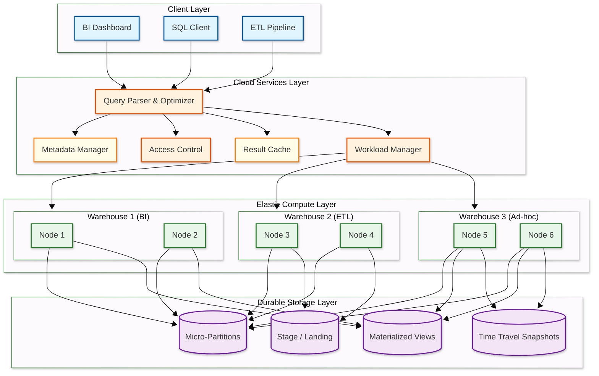
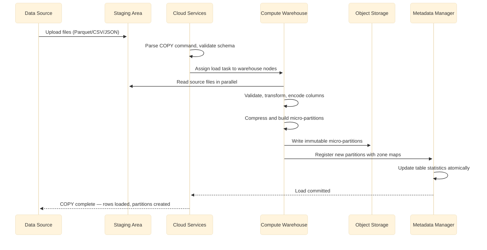
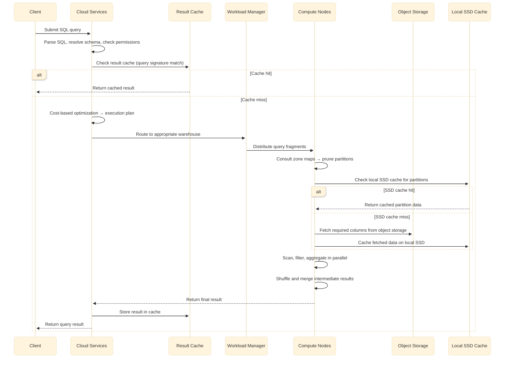
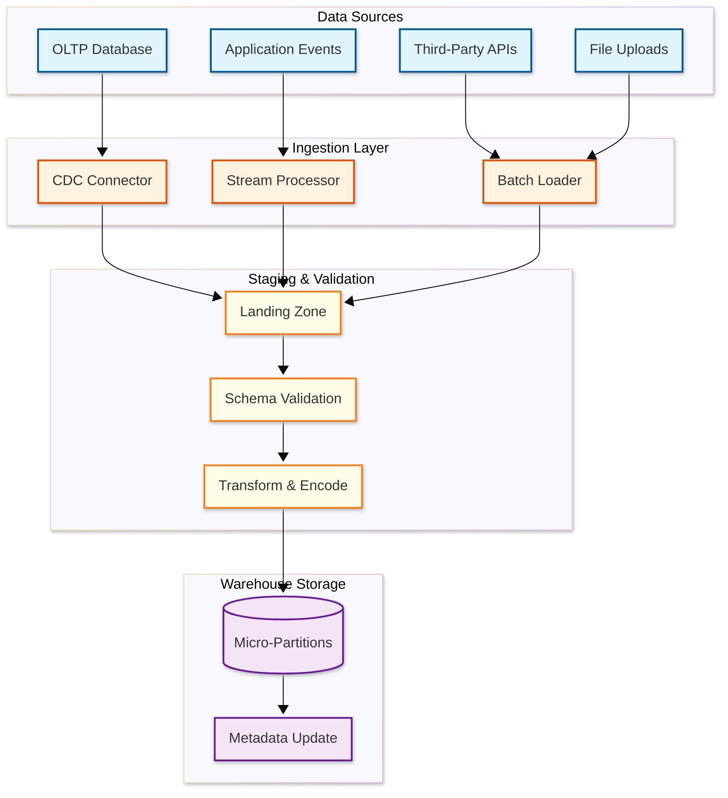

# High-Level Design — Data Warehouse

## System Architecture

### Component Descriptions

| Component | Responsibility |
|-----------|---------------|
| **Cloud Services Layer** | Stateless, always-on: query parsing, optimization, metadata management, authentication, result caching, and workload routing |
| **Metadata Manager** | Maintains table schemas, micro-partition statistics (zone maps), access policies, and query history |
| **Workload Manager** | Routes queries to appropriate compute warehouses based on workload class, priority, and resource availability |
| **Elastic Compute Layer** | Stateless compute clusters (warehouses) that can be independently started, stopped, and resized; each warehouse is a set of nodes that execute query fragments in parallel |
| **Durable Storage Layer** | Immutable micro-partitions stored in cloud object storage with 11-nines durability; shared across all compute warehouses |

---

## Data Flow

### Ingestion Path (Bulk Load)

**Ingestion key points:**

1. **Staging isolation** — Source files are uploaded to a staging area (internal or external) before being processed
2. **Parallel processing** — Each compute node processes a subset of source files simultaneously
3. **Columnar encoding** — During load, the engine selects optimal encoding per column (dictionary, RLE, delta, bit-packing)
4. **Immutable writes** — New data creates new micro-partitions; existing partitions are never modified
5. **Atomic commit** — All new partitions become visible simultaneously via metadata pointer swap

### Query Path (Analytical Query)

### Component Dependency Matrix

| Component | Depends On | Depended On By | Failure Impact |
|-----------|-----------|---------------|----------------|
| **Query Parser** | Metadata Manager (schemas) | Workload Manager | All queries fail to compile |
| **Metadata Manager** | Replicated key-value store | Query Parser, Compute Nodes, Result Cache | System-wide outage if unavailable |
| **Workload Manager** | Metadata Manager (warehouse status) | Compute Nodes | New queries cannot be routed |
| **Compute Node** | Object Storage, SSD Cache, Metadata Manager | Query results | Individual query fragments fail; retryable |
| **Object Storage** | Cloud infrastructure | Compute Nodes, Staging | Data unavailable; cached queries still work |
| **Result Cache** | Metadata Manager (invalidation) | Query Parser | Performance degradation; not a correctness issue |
| **SSD Cache** | Local NVMe hardware | Compute Node scan path | Higher latency (fall through to object storage) |
| **Staging Area** | Object Storage | Ingestion pipeline | Data loading blocked |
| **Access Control** | Metadata Manager (policies) | Query Parser | Authorization failures; queries blocked |

### Critical Path vs. Non-Critical Path

| Path | Components | Failure Consequence |
|------|-----------|-------------------|
| **Critical: Query Execution** | Parser → Metadata → Optimizer → Workload Manager → Compute → Storage | Query fails; user sees error |
| **Critical: Metadata** | Metadata Manager (schema, zone maps, policies) | All queries fail to compile or route |
| **Non-Critical: Result Cache** | Result cache lookup/store | Queries execute normally, just slower |
| **Non-Critical: SSD Cache** | Local SSD partition cache | Queries fetch from object storage; higher latency |
| **Non-Critical: Re-clustering** | Background re-clustering service | Partition Cutting off unnecessary steps degrades gradually |
| **Non-Critical: Materialized View Refresh** | Background view refresh | Views serve stale data until next refresh |

---

## Technology Selection Guidelines

| Decision | Option A | Option B | Selection Criteria |
|----------|----------|----------|-------------------|
| Metadata store | Embedded key-value (FoundationDB) | External database (PostgreSQL) | FoundationDB for ordered key ranges and ACID at scale; PostgreSQL for simplicity at smaller scale |
| Object storage format | Proprietary columnar format | Open format (Parquet/ORC) | Proprietary enables tighter optimization; open format enables ecosystem interoperability |
| Compression codec | Zstd (higher ratio, slower) | LZ4 (lower ratio, faster) | Zstd for cold/warm data; LZ4 for hot data and decompression-bound workloads |
| Query compilation | Interpreted vectorized | JIT code generation | Interpreted for predictable latency; JIT for compute-intensive expressions |
| Ingestion format | CSV/JSON (human-readable) | Parquet/Avro (binary, typed) | Parquet for production pipelines; CSV for ad-hoc loads |
| Cache eviction | LRU | LRU with frequency weighting (LRFU) | LRFU prevents scan queries from evicting frequently-used partitions |
| Result cache scope | Per-warehouse | Cross-warehouse (shared) | Cross-warehouse avoids redundant computation across workloads |
| Cluster orchestration | Managed containers | Custom VM orchestration | Containers for faster provisioning; VMs for performance isolation |

---

### Failure Domain Analysis

| Failure Domain | Scope | Blast Radius | Recovery |
|----------------|-------|-------------|----------|
| Single compute node | One node in one cluster | In-flight query fragments on that node | 10-30s: fragments redistributed to surviving nodes |
| Entire compute cluster | All nodes in one cluster | All queries on that cluster | 30-60s: queries routed to other clusters or new cluster provisioned |
| SSD cache corruption | One node's cache | Performance degradation for that node | Immediate: cache rebuild from object storage |
| Metadata store leader | Leader of 3-node cluster | Brief metadata unavailability | 5-10s: Raft election promotes follower |
| Object storage AZ | One availability zone | Reads from affected AZ partitions fail | < 1s: object storage transparently serves from other AZs |
| Object storage region | Entire region | All data access fails | 5-15 min: failover to DR region with replicated data |
| Cloud services layer | Query parsing/routing | No new queries accepted | 10s: stateless instances replaced behind load balancer |
| Network partition (compute ↔ storage) | Compute cannot reach storage | All uncached queries fail | Varies: cached queries continue; circuit breaker activates |

### Read vs. Write Path Asymmetry

| Aspect | Read Path (Query) | Write Path (Ingestion) |
|--------|-------------------|----------------------|
| Frequency | 100x more frequent | Bulk/micro-batch events |
| Latency sensitivity | High (user-facing dashboards) | Low (seconds to minutes acceptable) |
| Compute cost | Proportional to data scanned | Proportional to data encoded |
| Failure impact | Immediate user-visible error | Delayed freshness SLO breach |
| Concurrency | 200+ concurrent queries | 10-50 concurrent loads |
| Optimization priority | Partition Cutting off unnecessary steps, caching, vectorization | Parallel encoding, optimal compression |

---

## Key Architectural Decisions

### 1. Separation of Compute and Storage vs. Coupled Architecture

| Aspect | Separated (Cloud-Native) | Coupled (Traditional MPP) |
|--------|-------------------------|--------------------------|
| Scaling independence | Compute and storage scale independently | Must scale both together |
| Workload isolation | Separate warehouses share same data | Workloads compete for same resources |
| Cost efficiency | Pay only for active compute | Always-on cluster cost |
| Cold start latency | Seconds to provision; cache warm-up needed | Immediate — data is local |
| Data sharing | Zero-copy across warehouses | Requires data replication |

**Decision:** Separation of compute and storage. The ability to scale compute elastically, run isolated workloads over the same data, and pay only for active resources outweighs the cold-start penalty, which is mitigated by multi-tier caching (result cache → local SSD → object storage).

### 2. Immutable Micro-Partitions vs. Mutable Row Storage

| Aspect | Immutable Micro-Partitions | Mutable Row Storage |
|--------|--------------------------|-------------------|
| Write pattern | Append-only; updates create new partitions | In-place updates |
| Concurrency | No read-write contention (snapshot isolation) | Lock contention on hot rows |
| Time travel | Free — old partitions retained by policy | Expensive — requires separate versioning |
| Compression | Excellent — entire partition compressed at once | Poor — random updates fragment compression |
| Update cost | Expensive — rewrite entire partition for single-row update | Cheap per row |

**Decision:** Immutable micro-partitions. Analytical workloads are append-heavy with rare updates. Immutability enables zero-contention reads, excellent compression, and trivial time travel. The occasional UPDATE/DELETE is handled by copy-on-write at the partition level.

### 3. Columnar vs. Row-Oriented Storage

| Aspect | Columnar | Row-Oriented |
|--------|----------|-------------|
| Analytical query I/O | Read only needed columns (~3 of 50 = 94% I/O saved) | Read entire rows regardless |
| Compression ratio | 10:1 typical (homogeneous data per column) | 3:1 typical (mixed types per row) |
| Point lookups | Inefficient — must reconstruct row from columns | O(1) — row stored contiguously |
| Write throughput | Lower — must decompose rows into columns | Higher — append entire row |
| CPU efficiency | Vectorized processing on column batches | Row-at-a-time processing |

**Decision:** Columnar storage. The warehouse's primary workload is analytical queries that scan millions of rows but touch few columns. Columnar storage with vectorized execution provides 10-100x throughput improvement over row storage for this workload.

### 4. Eager Materialization vs. Late Materialization

| Aspect | Eager (construct tuples early) | Late (carry column references) |
|--------|-------------------------------|-------------------------------|
| Memory usage | Higher — materializes full rows early | Lower — carries only column offsets |
| Filter efficiency | All columns available for filtering | Filter on compressed columns, materialize only survivors |
| Join performance | Join on full tuples | Join on keys, fetch remaining columns post-join |
| Implementation complexity | Simpler | More complex column tracking |

**Decision:** Late materialization. Most analytical queries filter aggressively (WHERE clause eliminates 90%+ of rows) before projecting columns. Late materialization avoids reading and decompressing columns that will be discarded by filters.

### 5. Caching Strategy

| Cache Layer | What It Caches | Scope | Eviction |
|-------------|---------------|-------|----------|
| Result cache | Complete query results by query signature | Cross-warehouse (shared) | Invalidated on underlying data change |
| Metadata cache | Zone maps, schemas, statistics | Cloud services layer | LRU with refresh on DDL |
| Local SSD cache | Raw micro-partition data | Per compute node | LRU; survives warehouse suspend/resume |
| Partition header cache | Column statistics, Bloom filters | Per compute node | Pinned in memory |

---

## Architecture Pattern Checklist

- [x] **Sync vs Async communication** — Synchronous for interactive queries; async for bulk loading and materialized view refresh
- [x] **Event-driven vs Request-response** — Request-response for SQL queries; event-driven for ingestion notifications and view invalidation
- [x] **Push vs Pull model** — Pull-based query execution (compute pulls partitions from storage); push-based cache invalidation on data change
- [x] **Stateless vs Stateful services** — Cloud services and compute are stateless; all durable state lives in object storage and metadata store
- [x] **Read-heavy vs Write-heavy** — Read-heavy (100:1); columnar storage and caching optimize the read path
- [x] **Real-time vs Batch processing** — Batch-first with micro-batch for near-real-time freshness (< 60s latency)
- [x] **Edge vs Origin processing** — Origin processing; compute nodes pull data from centralized storage, no edge caching of analytical data

---

## Case Studies

### Case Study 1: Retail Analytics Migration (On-Premise MPP → Cloud Warehouse)

**Context:** A national retailer with 2,500 stores migrated from an on-premise MPP warehouse (16-node fixed cluster, 80 TB) to a cloud-native separated architecture.

**Challenge:** The on-premise system ran 24/7 at 60% utilization, but peak holiday traffic (Black Friday, Christmas) required 3x capacity for 6 weeks/year. The fixed cluster was sized for peak, wasting 70% of capacity during off-peak months.

**Solution:**
- Separated architecture with elastic compute: base 8-node cluster for daily BI + auto-scaling to 24 nodes during peak
- Auto-suspend on development/staging warehouses (active only during business hours)
- Materialized views for the 50 most-accessed dashboard queries
- Clustering on `sale_date` + `store_id` for the primary fact table (100B+ rows)

**Result:** 65% reduction in total cost of ownership. Peak query latency improved from 45s to 8s due to better partition Cutting off unnecessary steps (clustering depth reduced from 200 to 3). Data freshness improved from 6 hours (nightly batch) to 45 seconds (continuous micro-batch).

### Case Study 2: Multi-Tenant SaaS Analytics Platform

**Context:** A SaaS platform providing embedded analytics to 500 enterprise customers, each with 10-100 GB of data, totaling 15 TB across all tenants.

**Challenge:** Noisy neighbor problem — one customer's ad-hoc query scanning their entire dataset caused dashboard latency spikes for all other customers.

**Solution:**
- Per-tenant row-level security policies on shared fact tables (single database, shared schema)
- Dedicated compute warehouses for Tier 1 customers (top 20 by revenue)
- Shared multi-cluster warehouse for Tier 2-3 customers with per-tenant resource governors
- Query timeout enforcement: 30s for dashboard queries, 5 min for ad-hoc, 30 min for exports

**Result:** P99 dashboard latency reduced from 12s to 2.5s. Zero cross-tenant data leakage incidents. Compute cost allocated per-tenant for accurate margin tracking.

### Case Study 3: Financial Regulatory Reporting

**Context:** A bank with 7-year data retention requirements (regulatory mandate) storing 500 TB of historical transaction data across 50,000+ tables.

**Challenge:** Quarterly regulatory reports required full scans of multi-year datasets. Time travel needed for audit trails. GDPR right-to-erasure conflicted with retention mandates.

**Solution:**
- Tiered storage: hot (current year on NVMe), warm (1-3 years on standard object storage), cold (3-7 years on archive storage with WORM policy)
- Materialized views for quarterly report templates (pre-aggregated by regulatory dimension)
- GDPR pseudonymization layer: PII columns encrypted with per-customer keys; erasure = key destruction (crypto-shredding)
- Separate audit warehouse for compliance queries with immutable audit log

**Result:** Quarterly report generation reduced from 14 hours to 25 minutes. Storage cost reduced 60% via tiered lifecycle. GDPR compliance achieved within 72 hours of erasure request via crypto-shredding.

---

## Data Ingestion Architecture

---

## Architecture Decision Records (ADRs)

### ADR-1: Result Cache Invalidation Strategy

**Context:** Dashboard queries repeat every 30 seconds. Caching results eliminates redundant compute. However, data loads make cached results stale.

**Decision:** Invalidate result cache entries when any underlying table's metadata version changes. Use a dependency DAG (query → tables → views → materialized views) to propagate invalidation.

**Rationale:** Metadata-version-based invalidation is precise (no false invalidations) and fast (single version comparison per table). The alternative — TTL-based expiry — risks serving stale data when loads happen mid-TTL.

**Consequences:** Cache hit rates decrease during high-ingestion periods (frequent loads invalidate frequently). Mitigation: staggered invalidation and priority-based re-warming.

### ADR-2: Micro-Partition Size Target (50-500 MB Uncompressed)

**Context:** Smaller partitions enable finer Cutting off unnecessary steps but increase metadata overhead and object storage request count. Larger partitions reduce metadata overhead but decrease Cutting off unnecessary steps granularity.

**Decision:** Target 100 MB compressed (approximately 50-500 MB uncompressed depending on column types and encoding) per micro-partition.

**Rationale:** At 100 MB compressed, a 10 TB table has ~100,000 partitions — enough for fine-grained Cutting off unnecessary steps with manageable metadata size (~50 MB). Smaller partitions (10 MB) would create 1M partitions with 500 MB of metadata; larger partitions (1 GB) would reduce Cutting off unnecessary steps effectiveness by 10x.

**Consequences:** The re-clustering service must split oversized partitions and merge undersized ones. A monitoring alert triggers when median partition size deviates >2x from target.

### ADR-3: Metadata Store Technology Selection

**Context:** The metadata store must handle 500+ reads/second with strong consistency, survive node failures without data loss, and support atomic transactions for partition swaps.

**Decision:** 3-node replicated key-value store with Raft consensus.

**Rationale:** Raft provides linearizable reads, automatic leader election (< 5s failover), and write durability with write quorum of 2. Alternatives considered: (1) relational database — too much overhead for key-value metadata patterns; (2) distributed consensus service (like etcd/ZooKeeper) — viable but less control over performance tuning; (3) custom consensus — too complex to maintain.

**Consequences:** Metadata write throughput is limited by Raft consensus latency (~5ms per write). This is acceptable because metadata writes (partition commits, DDL) are infrequent relative to metadata reads (which are served from cache).

### ADR-4: Compression Codec Selection (LZ4 vs. Zstd)

**Context:** After column-level encoding (dictionary, RLE, delta), a general-purpose compression codec is applied. The choice affects both storage efficiency and decompression speed.

**Decision:** Use Zstd (level 3) as default for cold/warm data; LZ4 for hot partitions and real-time ingestion paths.

**Rationale:** Zstd at level 3 achieves 3-4x compression with 500 MB/s decompression speed. LZ4 achieves 2-2.5x compression but decompresses at 4 GB/s — 8x faster. For SSD-cached hot data where decompression speed matters more than storage savings, LZ4 keeps the CPU fed. For cold data where storage cost dominates, Zstd's better ratio reduces object storage bills.

**Consequences:** The partition footer must record the compression codec so the scan engine selects the correct decompressor. Re-clustering can opportunistically re-compress LZ4 partitions to Zstd as they age into cold tier.
