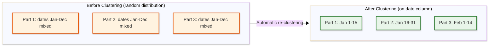
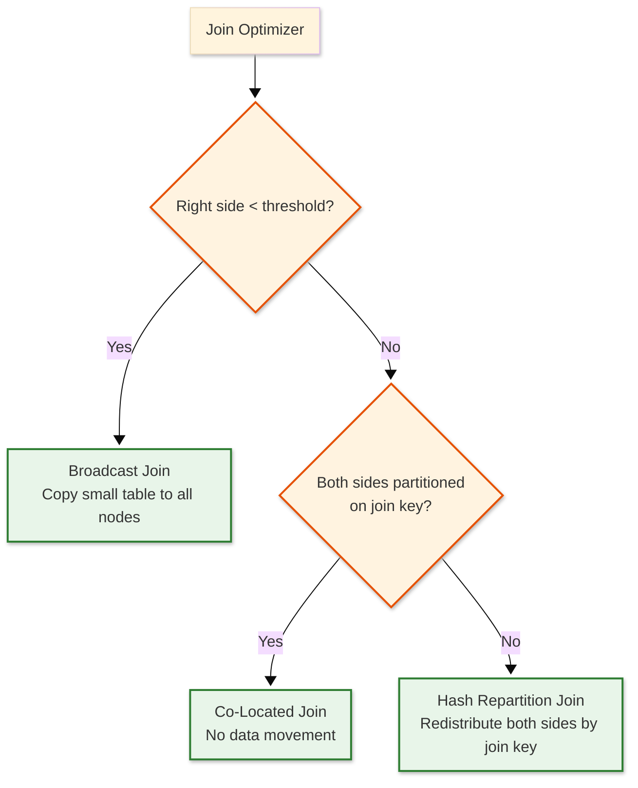

# Low-Level Design — Data Warehouse

## Data Model

### Micro-Partition Internal Structure

The data warehouse stores all table data as immutable micro-partitions. Each micro-partition is a self-contained columnar file containing 50-500 MB of uncompressed data (typically 50,000-500,000 rows).

```
┌──────────────────────────────────────────────────────────────┐
│ Micro-Partition File Layout                                   │
├──────────────────────────────────────────────────────────────┤
│                                                               │
│  ┌─────────────┐  ┌─────────────┐       ┌─────────────┐     │
│  │ Column Chunk │  │ Column Chunk │  ...  │ Column Chunk │     │
│  │  (col_0)     │  │  (col_1)     │       │  (col_N)     │     │
│  ├─────────────┤  ├─────────────┤       ├─────────────┤     │
│  │ Page 0      │  │ Page 0      │       │ Page 0      │     │
│  │ Page 1      │  │ Page 1      │       │ Page 1      │     │
│  │ ...         │  │ ...         │       │ ...         │     │
│  │ Page K      │  │ Page K      │       │ Page K      │     │
│  └─────────────┘  └─────────────┘       └─────────────┘     │
│                                                               │
│  ┌───────────────────────────────────────────────────────┐   │
│  │ Footer                                                 │   │
│  │  - Schema (column names, types, encoding)              │   │
│  │  - Column statistics (min, max, null_count, distinct)  │   │
│  │  - Page offsets and sizes                              │   │
│  │  - Bloom filters (optional, for high-cardinality cols) │   │
│  │  - Row count                                           │   │
│  │  - Compression codec per column                        │   │
│  └───────────────────────────────────────────────────────┘   │
│                                                               │
└──────────────────────────────────────────────────────────────┘
```

### Column Page Structure

Each column chunk is divided into pages (~1 MB each), the smallest unit of I/O and compression:

```
┌────────────────────────────────────────────────┐
│ Column Page (~1 MB compressed)                  │
├──────────────┬─────────────────────────────────┤
│ page_header  │ 32 bytes — encoding type, value │
│              │ count, compressed/uncompressed   │
│              │ sizes, CRC checksum              │
├──────────────┼─────────────────────────────────┤
│ repetition   │ Definition and repetition levels │
│ /definition  │ for nested/nullable columns      │
│ levels       │ (bit-packed)                     │
├──────────────┼─────────────────────────────────┤
│ encoded_data │ Column values in selected        │
│              │ encoding (dictionary, RLE,        │
│              │ delta, plain)                     │
├──────────────┼─────────────────────────────────┤
│ dictionary   │ Optional dictionary page for     │
│ (if used)    │ dictionary-encoded columns        │
└──────────────┴─────────────────────────────────┘
```

### Encoding Strategies

| Encoding | Best For | Mechanism | Compression Ratio |
|----------|----------|-----------|-------------------|
| **Dictionary** | Low-cardinality strings (country, status) | Replace repeated values with integer codes; store dictionary separately | 10-50x |
| **Run-Length (RLE)** | Sorted columns, boolean flags | Store (value, run_length) pairs for consecutive identical values | 5-100x |
| **Delta** | Timestamps, monotonic IDs | Store first value + deltas between consecutive values | 5-20x |
| **Bit-Packing** | Small integers, enum codes | Use minimum bits per value (e.g., 3 bits for values 0-7) | 2-10x |
| **Plain** | High-cardinality, high-entropy | Raw values with general-purpose compression (Zstd, LZ4) | 2-4x |

### Metadata Catalog Schema

```
┌─────────────────────────────────────────────────┐
│ Metadata Catalog (Replicated Key-Value Store)    │
├─────────────────────────────────────────────────┤
│                                                   │
│ tables/                                           │
│   {table_id}/                                     │
│     schema: [col_name, col_type, nullable, ...]   │
│     clustering_keys: [col_a, col_b]               │
│     partition_count: 12,450                       │
│     row_count: 2,180,000,000                      │
│     total_bytes: 45 GB (compressed)               │
│     created_at: timestamp                         │
│     last_modified: timestamp                      │
│                                                   │
│ partitions/                                       │
│   {table_id}/{partition_id}/                      │
│     file_path: "gs://bucket/db/tbl/part_0042"    │
│     row_count: 125,000                            │
│     size_bytes: 4,200,000                         │
│     zone_map:                                     │
│       col_a: {min: "2024-01-15", max: "2024-01-16"} │
│       col_b: {min: 100, max: 9999}                │
│       col_c: {distinct_count: 42, null_count: 7}  │
│     bloom_filter_columns: [col_d]                 │
│     encoding_per_column: {col_a: DELTA, ...}      │
│                                                   │
│ views/                                            │
│   {view_id}/                                      │
│     definition: SQL text                          │
│     source_tables: [table_id_1, table_id_2]       │
│     last_refresh: timestamp                       │
│     freshness_target: 300 seconds                 │
│                                                   │
└─────────────────────────────────────────────────┘
```

### Clustering Key Organization

Tables can define clustering keys that control how rows are physically organized within micro-partitions:



---

## API Design

### SQL Query Endpoint

```
POST /api/v1/warehouses/{warehouse_id}/queries
Content-Type: application/json
Authorization: Bearer {token}

Request:
{
  "sql": "SELECT region, SUM(revenue) FROM sales WHERE sale_date BETWEEN $1 AND $2 GROUP BY region ORDER BY SUM(revenue) DESC",
  "parameters": ["2024-01-01", "2024-03-31"],
  "timeout_seconds": 120,
  "result_format": "json",
  "max_rows": 10000,
  "warehouse_size": "medium"
}

Response:
{
  "query_id": "q-abc-123-def",
  "status": "completed",
  "results": [
    { "region": "North America", "sum_revenue": 4520000.00 },
    { "region": "Europe", "sum_revenue": 3180000.00 }
  ],
  "metadata": {
    "rows_returned": 2,
    "rows_scanned": 180000000,
    "partitions_scanned": 245,
    "partitions_pruned": 11800,
    "bytes_scanned": 720000000,
    "execution_time_ms": 2340,
    "compilation_time_ms": 85,
    "cache_hit": false,
    "spill_to_disk_bytes": 0
  }
}
```

### Data Loading Endpoint

```
POST /api/v1/warehouses/{warehouse_id}/loads
Content-Type: application/json

Request:
{
  "operation": "COPY_INTO",
  "target_table": "analytics.sales",
  "source": {
    "location": "@staging_area/sales/2024/",
    "format": "PARQUET",
    "pattern": "*.parquet"
  },
  "options": {
    "on_error": "SKIP_FILE",
    "purge": true,
    "match_by_column_name": true
  }
}

Response:
{
  "load_id": "load-xyz-789",
  "status": "completed",
  "files_processed": 48,
  "rows_loaded": 12500000,
  "rows_rejected": 0,
  "partitions_created": 95,
  "elapsed_time_ms": 18500
}
```

### Warehouse Management Endpoint

```
POST   /api/v1/warehouses                      → Create warehouse
GET    /api/v1/warehouses/{id}                 → Get warehouse status
PUT    /api/v1/warehouses/{id}/resize          → Scale up/down
POST   /api/v1/warehouses/{id}/resume          → Start warehouse
POST   /api/v1/warehouses/{id}/suspend         → Pause warehouse

GET    /api/v1/warehouses/{id}/queries         → List running queries
DELETE /api/v1/warehouses/{id}/queries/{qid}   → Cancel query
```

### Idempotency

- All load operations accept an idempotency key; re-submitting a completed load with the same key returns the original result
- Query submissions are inherently idempotent (same SQL + parameters produces same result from snapshot)
- DDL operations (CREATE, ALTER) use IF EXISTS / IF NOT EXISTS semantics

### Rate Limiting

| Endpoint | Limit | Window |
|----------|-------|--------|
| Query submission | 1,000/min per account | Sliding window |
| Data loading | 100/min per account | Sliding window |
| Warehouse management | 60/min per account | Sliding window |
| Metadata operations (DDL) | 200/min per account | Sliding window |
| Result download | 500/min per account | Sliding window |

### Versioning

- API versioned via URL path: `/api/v1/`, `/api/v2/`
- SQL dialect version specified in session parameters
- Schema evolution tracked per table with version history

---

## Core Algorithms

### 1. Columnar Scan with Predicate Pushdown

```
FUNCTION columnar_scan(table, predicates, projection_columns):
    // Phase 1: Partition Cutting off unnecessary steps using zone maps
    candidate_partitions = []
    FOR EACH partition IN table.partitions:
        zone_map = metadata.get_zone_map(partition.id)
        skip = FALSE
        FOR EACH predicate IN predicates:
            col_stats = zone_map[predicate.column]
            IF predicate.op == "=" AND (predicate.value < col_stats.min OR predicate.value > col_stats.max):
                skip = TRUE
                BREAK
            IF predicate.op == ">" AND predicate.value >= col_stats.max:
                skip = TRUE
                BREAK
            IF predicate.op == "<" AND predicate.value <= col_stats.min:
                skip = TRUE
                BREAK
            IF predicate.op == "IN" AND bloom_filter_exists(partition, predicate.column):
                IF NOT bloom_filter.might_contain(predicate.values):
                    skip = TRUE
                    BREAK
        IF NOT skip:
            candidate_partitions.add(partition)

    // Phase 2: Column-level scan with late materialization
    result_row_ids = NULL
    FOR EACH predicate IN predicates ORDERED BY selectivity ASC:
        col_data = read_column(candidate_partitions, predicate.column)
        matching_ids = evaluate_predicate(col_data, predicate)
        IF result_row_ids IS NULL:
            result_row_ids = matching_ids
        ELSE:
            result_row_ids = result_row_ids INTERSECT matching_ids

    // Phase 3: Materialize only surviving rows for projected columns
    result = []
    FOR EACH col IN projection_columns:
        col_data = read_column(candidate_partitions, col)
        result[col] = col_data.select(result_row_ids)

    RETURN result

// Time:  O(P) for Cutting off unnecessary steps + O(S * C) for scanning where S = surviving rows, C = predicate columns
// Space: O(batch_size) — processes in streaming batches
```

### 2. MPP Query Distribution and Shuffle

```
FUNCTION distribute_query(plan, cluster_nodes):
    // Phase 1: Decompose plan into pipeline-able fragments
    fragments = decompose_into_fragments(plan)

    // Phase 2: Assign fragments to nodes based on data locality
    assignments = HashMap()  // node → list of fragments
    FOR EACH fragment IN fragments:
        IF fragment.type == SCAN:
            // Assign scan fragments to nodes that have cached partitions
            target_partitions = fragment.partitions
            FOR EACH partition IN target_partitions:
                node = find_node_with_cache(partition, cluster_nodes)
                IF node IS NULL:
                    node = least_loaded_node(cluster_nodes)
                assignments[node].add(fragment.for_partition(partition))

        ELSE IF fragment.type == SHUFFLE:
            // Hash-partition intermediate results across all nodes
            FOR EACH node IN cluster_nodes:
                assignments[node].add(fragment.for_hash_range(node.range))

        ELSE IF fragment.type == AGGREGATE:
            // Two-phase: partial on each node, then merge on coordinator
            FOR EACH node IN cluster_nodes:
                assignments[node].add(fragment.partial())
            assignments[coordinator].add(fragment.merge())

    // Phase 3: Execute fragments with pipeline parallelism
    FOR EACH node, node_fragments IN assignments:
        node.execute_pipeline(node_fragments)

    // Phase 4: Collect and merge results
    RETURN coordinator.collect_and_merge()

// Time:  O(D/N) per node where D = total data, N = number of nodes
// Space: O(D/N) per node for intermediate results
```

### 3. Materialized View Incremental Refresh

```
FUNCTION incremental_refresh(materialized_view):
    // Step 1: Identify changed partitions since last refresh
    last_refresh_txn = materialized_view.last_refresh_transaction
    changed_partitions = metadata.get_partitions_modified_since(
        materialized_view.source_tables, last_refresh_txn
    )

    IF changed_partitions.is_empty:
        RETURN  // no changes, view is fresh

    // Step 2: Determine refresh strategy based on view definition
    view_def = materialized_view.definition

    IF view_def.is_aggregate_only:
        // Additive aggregates (SUM, COUNT, MIN, MAX) can be incrementally merged
        delta_result = execute_view_query(view_def, changed_partitions)
        merged = merge_aggregates(materialized_view.current_data, delta_result, view_def)
        write_new_partitions(materialized_view, merged)

    ELSE IF view_def.has_joins:
        // For join views, re-evaluate join for changed partitions only
        affected_keys = extract_join_keys(changed_partitions, view_def.join_columns)
        delta_result = execute_view_query_for_keys(view_def, affected_keys)
        upsert_view_partitions(materialized_view, delta_result, affected_keys)

    ELSE:
        // Complex views: full refresh
        full_result = execute_view_query(view_def, ALL_PARTITIONS)
        replace_view_data(materialized_view, full_result)

    // Step 3: Update view metadata
    materialized_view.last_refresh_transaction = current_transaction()
    materialized_view.last_refresh_time = now()

// Time:  O(delta) for aggregate views, O(delta * join_fanout) for join views
// Space: O(delta) for incremental, O(full_view) for full refresh
```

### 4. Cost-Based Query Optimizer

```
FUNCTION optimize_query(logical_plan, statistics):
    // Phase 1: Predicate pushdown
    pushed_plan = push_predicates_to_scans(logical_plan)

    // Phase 2: Join reordering using dynamic programming
    IF count_join_tables(pushed_plan) <= 10:
        // Exhaustive enumeration for small join graphs
        best_join_order = dp_join_enumeration(pushed_plan, statistics)
    ELSE:
        // Greedy Practical rule of thumb for large join graphs
        best_join_order = greedy_join_ordering(pushed_plan, statistics)

    // Phase 3: Select join strategies
    FOR EACH join IN best_join_order.joins:
        left_card = estimate_cardinality(join.left, statistics)
        right_card = estimate_cardinality(join.right, statistics)

        IF right_card < BROADCAST_THRESHOLD:
            join.strategy = BROADCAST_JOIN
        ELSE IF join.left.partition_key == join.key AND join.right.partition_key == join.key:
            join.strategy = CO_LOCATED_JOIN
        ELSE:
            join.strategy = HASH_REPARTITION_JOIN

    // Phase 4: Aggregate pushdown
    optimized = push_partial_aggregates_below_joins(best_join_order)

    // Phase 5: Materialized view matching
    FOR EACH subquery IN optimized.subqueries:
        matching_view = find_covering_materialized_view(subquery, statistics)
        IF matching_view IS NOT NULL AND matching_view.is_fresh:
            subquery.replace_with(scan(matching_view))

    // Phase 6: Cost estimation and plan selection
    physical_plan = select_physical_operators(optimized, statistics)
    physical_plan.estimated_cost = estimate_total_cost(physical_plan)

    RETURN physical_plan

// Time:  O(2^n) for DP join enumeration (n = number of tables, capped at 10)
// Space: O(2^n) for DP Memoization (Saving results to avoid repeating work) table
```

### 5. Automatic Re-Clustering Engine

```
FUNCTION auto_recluster(table):
    // Step 1: Measure clustering quality
    clustering_key = table.clustering_key
    depth = measure_clustering_depth(table, clustering_key)

    IF depth <= TARGET_CLUSTERING_DEPTH:
        RETURN  // already well-clustered

    // Step 2: Identify overlapping partition groups
    overlapping_groups = find_overlapping_partitions(table, clustering_key)

    FOR EACH group IN overlapping_groups ORDERED BY overlap_severity DESC:
        // Step 3: Read all partitions in the group
        combined_data = []
        FOR EACH partition IN group.partitions:
            combined_data.append(read_partition(partition))

        // Step 4: Sort by clustering key and re-partition
        combined_data.sort_by(clustering_key)
        new_partitions = split_into_partitions(
            combined_data, target_size=TARGET_PARTITION_SIZE
        )

        // Step 5: Write new partitions and update metadata atomically
        FOR EACH new_partition IN new_partitions:
            encoded = encode_columns(new_partition, select_optimal_encoding)
            compressed = compress(encoded)
            write_to_object_storage(compressed)

        atomic_metadata_swap(
            remove=group.partitions,
            add=new_partitions,
            update_zone_maps=TRUE
        )

        // Step 6: Respect resource budget (don't starve queries)
        IF recluster_budget_exhausted():
            BREAK  // continue in next maintenance window

    update_clustering_depth_metric(table)

// Time:  O(G * P * N * log N) where G = groups, P = partitions per group, N = rows per partition
// Space: O(P * N) for sorting one group at a time
```

### 6. Workload Management and Admission Control

```
FUNCTION admit_query(query, warehouse):
    // Step 1: Classify query by estimated resource requirements
    estimated_cost = optimizer.estimate_cost(query)
    query_class = classify(estimated_cost)
    //   LIGHT:  < 100 MB scan, < 1s estimated
    //   MEDIUM: 100 MB - 10 GB scan, 1-30s estimated
    //   HEAVY:  > 10 GB scan, > 30s estimated

    // Step 2: Check warehouse capacity
    available_slots = warehouse.max_concurrent - warehouse.active_queries
    memory_available = warehouse.total_memory - warehouse.allocated_memory

    IF available_slots <= 0:
        IF query_class == LIGHT AND warehouse.has_reserved_light_slots:
            // Reserve pool for light queries (dashboards)
            assign_to_reserved_pool(query)
        ELSE:
            enqueue(query, warehouse.query_queue)
            RETURN QUEUED

    // Step 3: Check per-query resource limits
    IF estimated_cost.memory > warehouse.per_query_memory_limit:
        IF warehouse.can_scale_up():
            suggest_larger_warehouse(query)
        RETURN REJECTED("Estimated memory exceeds per-query limit")

    IF estimated_cost.scan_bytes > warehouse.per_query_scan_limit:
        RETURN REJECTED("Estimated scan exceeds per-query limit")

    // Step 4: Apply timeout
    query.timeout = MIN(query.requested_timeout, warehouse.max_timeout)

    // Step 5: Assign to least-loaded cluster (multi-cluster)
    IF warehouse.multi_cluster_enabled:
        target_cluster = select_cluster(warehouse, query_class)
        IF target_cluster IS NULL AND warehouse.can_auto_scale:
            target_cluster = provision_new_cluster(warehouse)
    ELSE:
        target_cluster = warehouse.primary_cluster

    assign_query(query, target_cluster)
    RETURN ADMITTED

// Time:  O(1) for admission decision
// Space: O(Q) for query queue where Q = queued queries
```

### 7. Time Travel Query Resolution

```
FUNCTION resolve_time_travel_query(query, as_of_timestamp):
    // Step 1: Find metadata snapshot at the requested timestamp
    metadata_version = metadata_store.get_version_at(as_of_timestamp)

    IF metadata_version IS NULL:
        // Timestamp is before the earliest retained version
        RETURN ERROR("Time travel data not available — " +
                     "retention window is " + table.retention_days + " days")

    // Step 2: Resolve table schema at that point in time
    schema_at_time = metadata_version.get_schema(query.table)

    IF schema_at_time != table.current_schema:
        // Schema has evolved — need to handle added/dropped columns
        query = rewrite_query_for_schema(query, schema_at_time)

    // Step 3: Get partition set at that point in time
    partitions_at_time = metadata_version.get_partitions(query.table)

    // Step 4: Execute query against historical partition set
    // Zone map Cutting off unnecessary steps still works because zone maps are embedded in partition footers
    result = execute_query(query, partitions_at_time, schema_at_time)

    RETURN result

// Time:  O(log V) for version lookup + normal query execution time
// Space: O(1) additional — partitions already exist in object storage
```

### 8. Bloom Filter Construction for High-Cardinality Columns

```
FUNCTION build_bloom_filter(column_data, target_fpp):
    // target_fpp: target false positive probability (e.g., 0.01 = 1%)
    n = column_data.distinct_count

    // Calculate optimal filter size
    // m = -(n * ln(fpp)) / (ln(2))^2
    m_bits = CEIL(-(n * LN(target_fpp)) / (LN(2) * LN(2)))
    k_hashes = CEIL((m_bits / n) * LN(2))

    filter = BitArray(m_bits)

    FOR EACH value IN column_data:
        // Use double hashing: h(i) = h1(value) + i * h2(value)
        h1 = murmur3_hash(value)
        h2 = xxhash(value)
        FOR i IN 0..k_hashes:
            bit_index = (h1 + i * h2) MOD m_bits
            filter.set(bit_index)

    RETURN BloomFilter(filter, k_hashes, m_bits)

// Example: 1M distinct user IDs, 1% FPP
//   m = 9.6M bits = 1.2 MB (vs. storing 1M IDs = ~20 MB)
//   k = 7 hash functions
//   Enables partition Cutting off unnecessary steps for WHERE user_id = 'X' queries
//   on non-clustered columns where zone maps are useless

// Time:  O(n * k) to construct
// Space: O(m) = O(n * log(1/fpp)) bits
```

---

## Internal APIs

### Compute ↔ Storage Interface

```
// Partition Read API (Compute Node → Object Storage)
RPC ReadColumnChunks(request):
    partition_id:     string       // micro-partition identifier
    column_ids:       []int        // columns to read (late materialization)
    row_range:        (start, end) // optional: sub-partition row range
    → response:
        chunks:       []ColumnChunk // compressed column data
        zone_map:     ZoneMap       // partition-level statistics
        metadata:     PartitionMeta // schema, encoding info

// Partition Write API (Ingestion → Object Storage)
RPC WritePartition(request):
    table_id:         string
    encoded_columns:  []EncodedColumn  // pre-encoded, pre-compressed
    zone_map:         ZoneMap           // computed during encoding
    bloom_filters:    []BloomFilter     // optional per-column
    → response:
        partition_id:  string
        file_path:     string
        bytes_written: int64

// Metadata Commit API (Ingestion → Metadata Store)
RPC CommitPartitions(request):
    table_id:         string
    add_partitions:   []PartitionMeta  // new partitions to register
    remove_partitions: []string        // old partitions to deregister (for updates)
    expected_version:  int64           // optimistic concurrency control
    → response:
        committed:     bool
        new_version:   int64
```

### Query Execution Internal Protocol

```
// Fragment Execution (Coordinator → Compute Node)
RPC ExecuteFragment(request):
    query_id:         string
    fragment_id:      string
    plan:             PhysicalPlan      // scan, filter, join, aggregate operators
    partition_assignments: []string     // partitions this node should scan
    shuffle_targets:  []NodeAddress     // where to send shuffle output
    resource_budget:  ResourceBudget    // memory limit, CPU quota
    → response:
        result:        FragmentResult   // partial result or shuffle acknowledgment
        stats:         ExecutionStats   // rows processed, bytes scanned, spill info

// Shuffle Exchange (Compute Node → Compute Node)
RPC ShuffleData(request):
    query_id:         string
    source_fragment:  string
    target_fragment:  string
    partition_key:    HashRange         // hash range for this target
    data:             ColumnarBatch     // vectorized column batches
    → response:
        accepted:      bool
        backpressure:  bool            // true = slow down sending
```

### Error Code Classification

| Code Range | Category | Example | Retry? |
|-----------|----------|---------|--------|
| 1000-1099 | Query syntax | Invalid SQL, unknown column | No |
| 1100-1199 | Authorization | Insufficient privileges, RLS violation | No |
| 2000-2099 | Resource exhaustion | Memory exceeded, timeout, scan limit | Maybe (with larger warehouse) |
| 2100-2199 | Concurrency | Query queue full, warehouse suspended | Yes (after delay) |
| 3000-3099 | Storage | Partition not found, object storage error | Yes (transient) |
| 3100-3199 | Metadata | Schema mismatch, stale metadata cache | Yes (after cache refresh) |
| 4000-4099 | Internal | Node crash, fragment failure | Yes (automatic retry) |
| 5000-5099 | Data quality | Type mismatch during load, constraint violation | No |

---

### Join Strategy Selection Visualization



---

## Data Lifecycle Management

### Micro-Partition Garbage Collection

```
FUNCTION garbage_collect_partitions(table, policy):
    // Collect all partition versions for this table
    all_versions = metadata_store.get_all_partition_versions(table.id)

    FOR EACH old_partition IN all_versions:
        // Check if any active snapshot references this partition
        referenced_by_active_query = check_active_query_snapshots(old_partition)
        referenced_by_time_travel = check_time_travel_window(old_partition, policy.retention)
        referenced_by_clone = check_clone_references(old_partition)
        referenced_by_legal_hold = check_legal_hold(old_partition)

        IF NOT (referenced_by_active_query OR referenced_by_time_travel
                OR referenced_by_clone OR referenced_by_legal_hold):
            // Safe to delete
            schedule_deletion(old_partition.file_path, delay=SAFETY_BUFFER)
            metadata_store.remove_partition_version(old_partition)
            metrics.increment("gc.partitions_deleted")
            metrics.add("gc.bytes_reclaimed", old_partition.size_bytes)

    // Update storage metrics
    update_table_storage_metrics(table)

// Runs every 15 minutes per table
// Safety buffer: 1 hour delay between marking and deletion (protects against late-arriving queries)
```

### Copy-on-Write Update Flow

```
FUNCTION merge_update(target_table, source_data, merge_key):
    // Step 1: Identify affected partitions
    affected_partitions = identify_partitions_with_matching_keys(
        target_table, source_data, merge_key
    )

    new_partitions = []
    FOR EACH partition IN affected_partitions:
        // Step 2: Read existing partition data
        existing_data = read_partition(partition)

        // Step 3: Apply merge (update matching rows, insert new rows)
        merged = apply_merge(existing_data, source_data, merge_key)
        //   - Matched rows: updated with source values
        //   - Unmatched target rows: carried forward unchanged
        //   - Unmatched source rows: inserted as new rows

        // Step 4: Re-encode and write new partition
        encoded = encode_columns(merged, select_optimal_encoding)
        new_partition = write_to_object_storage(encoded)
        new_partitions.add(new_partition)

    // Step 5: Atomic metadata swap
    metadata_store.commit(
        table_id=target_table.id,
        remove=affected_partitions,
        add=new_partitions
    )

    // Old partitions retained for time travel; GC handles cleanup

// Write amplification: 1 row update rewrites entire partition (50-500 MB)
// Optimization: align merge key with clustering key to minimize affected partitions
```

### Query Result Caching

```
FUNCTION check_result_cache(query, metadata_snapshot):
    // Build cache key from normalized query + data versions
    cache_key = hash(
        normalize_sql(query.sql),
        query.parameters,
        get_table_versions(query.referenced_tables, metadata_snapshot)
    )

    cached_result = result_cache.get(cache_key)
    IF cached_result IS NOT NULL:
        // Verify data freshness: check if any referenced table
        // has been modified since the cached result was computed
        FOR EACH table IN query.referenced_tables:
            current_version = metadata_store.get_version(table.id)
            IF current_version != cached_result.table_versions[table.id]:
                result_cache.invalidate(cache_key)
                RETURN CACHE_MISS

        metrics.increment("cache.result_hits")
        RETURN cached_result.data

    metrics.increment("cache.result_misses")
    RETURN CACHE_MISS

// Cache invalidation is propagated through the dependency DAG:
//   table change → invalidates views depending on table
//                → invalidates materialized views depending on table
//                → invalidates cached results referencing any of the above
```
