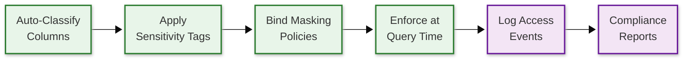

# Security & Compliance — Data Warehouse

## Threat Model

### Attack Vectors

| # | Threat | Impact | Likelihood | Mitigation |
|---|--------|--------|------------|------------|
| T1 | **SQL injection via BI tools** | Unauthorized data access, data exfiltration | Medium | Parameterized queries enforced at API layer; input sanitization; query allow-listing for programmatic access |
| T2 | **Privilege escalation via shared warehouses** | Cross-tenant data access in multi-tenant deployment | High | Row-level security policies; warehouse-level isolation; audit logging of cross-schema access |
| T3 | **Data exfiltration via query results** | Sensitive data extracted through analytical queries | High | Column-level security; dynamic data masking; query result size limits; data classification tags |
| T4 | **Credential theft / session hijacking** | Unauthorized access with stolen tokens | Medium | Short-lived tokens (1 hour); MFA enforcement; IP allowlisting; session binding |
| T5 | **Insider threat (admin abuse)** | Unrestricted access to all data by operators | Medium | Separation of duties; customer-managed encryption keys; break-glass access with mandatory audit |

---

## Authentication & Authorization

### Authentication Mechanisms

| Mechanism | Use Case | Details |
|-----------|----------|---------|
| **SSO / SAML** | Enterprise users via identity provider | Federated authentication; no warehouse-stored passwords |
| **OAuth 2.0 / OIDC** | Programmatic access, BI tools | Client credentials or authorization code flow |
| **API Key + Secret** | Service-to-service integration | Long-lived but scoped to specific operations |
| **MFA** | Interactive user sessions | Required for admin roles; optional for read-only |

### Token Management

| Token Type | Lifetime | Storage | Rotation |
|-----------|----------|---------|----------|
| Access token | 1 hour | Client memory only | Automatic refresh via refresh token |
| Refresh token | 24 hours | Encrypted at rest | Revoked on password change or admin action |
| API key | 90 days | Hashed in metadata store | Manual rotation with overlap period |
| Session token | 4 hours | Server-side session store | Invalidated on logout or IP change |

### Role-Based Access Control (RBAC)

```
Role Hierarchy:

ACCOUNT_ADMIN
  └── SYSADMIN (warehouse + database management)
        └── DATABASE_ADMIN (schema, table, view management)
              └── ANALYST (read + write on assigned schemas)
                    └── VIEWER (read-only on assigned objects)

SECURITY_ADMIN (parallel track)
  └── Manages roles, grants, security policies
      Cannot see data content — only metadata
```

| Role | Permissions | Scope |
|------|------------|-------|
| ACCOUNT_ADMIN | Full account management, billing, account-level settings | Account |
| SYSADMIN | Create/manage warehouses, databases, integrations | Account |
| DATABASE_ADMIN | DDL on schemas, tables, views; grant privileges | Database |
| ANALYST | SELECT, INSERT, CREATE VIEW on assigned schemas | Schema |
| VIEWER | SELECT on assigned tables/views | Table/View |
| ETL_SERVICE | INSERT, COPY INTO on staging schemas; CREATE TABLE | Schema |

### Object-Level Permissions

```
GRANT SELECT ON TABLE analytics.sales TO ROLE analyst;
GRANT SELECT ON ALL TABLES IN SCHEMA analytics TO ROLE viewer;
GRANT USAGE ON WAREHOUSE bi_warehouse TO ROLE viewer;

-- Future grants for new objects
GRANT SELECT ON FUTURE TABLES IN SCHEMA analytics TO ROLE analyst;
```

---

## Row-Level Security (RLS)

Row-level security restricts which rows a user can see based on their role or attributes, using security policies that inject additional WHERE clauses transparently.

**Implementation:**

```
Security Policy: sales_region_policy
  Table: analytics.sales
  Policy Function:
    IF current_role() == 'GLOBAL_ANALYST':
      RETURN TRUE  (see all rows)
    ELSE:
      RETURN sales.region == current_user_attribute('region')

At query time:
  SELECT * FROM analytics.sales WHERE revenue > 1000
  becomes:
  SELECT * FROM analytics.sales WHERE revenue > 1000
    AND sales.region = 'EMEA'  -- injected by RLS policy
```

**Key properties:**
- Policies are transparent to the user — no query modification required
- Multiple policies on the same table are combined with AND (restrictive)
- Policies apply to all access paths including views and joins
- Performance impact: additional predicate evaluation, but leverages zone map Cutting off unnecessary steps

---

## Column-Level Security

Column-level security controls access to specific columns, hiding sensitive data from unauthorized roles.

| Access Level | Mechanism | Example |
|-------------|-----------|---------|
| **Full access** | Standard GRANT SELECT | `SELECT ssn, name, salary FROM employees` |
| **Column restricted** | GRANT SELECT on specific columns | `SELECT name FROM employees` (ssn, salary hidden) |
| **Dynamic masking** | Masking policy applied at query time | `SELECT XXXX-XX-1234, name, ****` |

---

## Dynamic Data Masking

Masking policies transform sensitive column values at query time without modifying stored data.

| Masking Type | Input | Output | Use Case |
|-------------|-------|--------|----------|
| **Full mask** | `john@acme.com` | `XXXX@XXXX.XXX` | Email addresses for non-privileged roles |
| **Partial mask** | `4532-1234-5678-9012` | `XXXX-XXXX-XXXX-9012` | Credit card numbers — last 4 visible |
| **Hash mask** | `John Smith` | `a3f2b9c1...` | PII in analytics — preserves joins without revealing identity |
| **Date truncation** | `1985-06-15` | `1985-01-01` | Birth dates — year only for age-range analysis |
| **Null mask** | `$125,000` | `NULL` | Salary data hidden from unauthorized roles |

**Policy-based masking:**

```
Masking Policy: mask_email
  Column Type: VARCHAR
  Condition:
    IF current_role() IN ('ADMIN', 'SECURITY_ADMIN'):
      RETURN original_value
    ELSE:
      RETURN CONCAT(LEFT(original_value, 1), '***@***.***')

Applied to:
  ALTER TABLE customers ALTER COLUMN email SET MASKING POLICY mask_email;
```

**Tag-based masking:** Assign sensitivity tags (PII, FINANCIAL, HEALTH) to columns. Masking policies are defined per tag and automatically apply to all columns with that tag, ensuring consistent protection across the warehouse.

---

## Data Security

### Encryption at Rest

| Layer | Algorithm | Key Management |
|-------|-----------|----------------|
| Object storage | AES-256-GCM | Cloud-provider managed keys (default) |
| Object storage (enhanced) | AES-256-GCM | Customer-managed keys (CMK) — customer controls key lifecycle |
| Metadata store | AES-256 | Service-managed keys with automatic rotation |
| Local SSD cache | AES-256 | Ephemeral keys generated per compute session |
| Query result cache | AES-256 | Per-session encryption key |

**Customer-managed keys:** The customer provides their own encryption key (or key reference in a key management service). The warehouse wraps each micro-partition's data encryption key (DEK) with the customer's key encryption key (KEK). Revoking the KEK renders all data unreadable — even to the warehouse operator.

### Encryption in Transit

| Path | Protocol | Certificate |
|------|----------|-------------|
| Client → Cloud services | TLS 1.3 | Public CA-signed certificate |
| Cloud services → Compute | mTLS | Internal PKI, auto-rotated |
| Compute → Object storage | TLS 1.3 | Cloud-provider endpoint certificate |
| Cross-region replication | TLS 1.3 | Mutual authentication with pinned certificates |

### PII Handling

| PII Type | Classification | Treatment |
|----------|---------------|-----------|
| Email address | Sensitive | Dynamic masking for non-privileged roles |
| Social security number | Highly Sensitive | Column-level security + full masking |
| Credit card number | PCI-regulated | Partial masking + column access restricted to PCI-compliant roles |
| IP address | Moderate | Hashing or truncation for analytics use |
| Name + address | Sensitive | Row-level security by jurisdiction |

---

## Compliance

### GDPR Compliance

| Requirement | Implementation |
|-------------|---------------|
| Right to erasure | DELETE with cascading removal from all materialized views; time travel snapshots purged after retention window |
| Data minimization | Column-level security limits exposure; dynamic masking reduces unnecessary PII access |
| Purpose limitation | Row-level security policies scope data by authorized purpose |
| Data portability | COPY INTO / UNLOAD commands export data in open formats (Parquet, CSV) |
| Breach notification | Audit logging + anomaly detection on data access patterns |
| Data residency | Regional deployment with object storage geo-fencing |

### SOC 2 Compliance

| Control | Implementation |
|---------|---------------|
| Access control | RBAC with least privilege; MFA for admin roles |
| Audit logging | Immutable audit trail of all DDL, DML, and query activity |
| Change management | Schema version history; DDL audit log |
| Incident response | Automated alerting on anomalous access patterns |
| System monitoring | Continuous observability with alerting (see Section 07) |

### PCI-DSS Compliance

| Requirement | Implementation |
|-------------|---------------|
| Cardholder data protection | Column-level encryption; dynamic masking; restricted access |
| Access restriction | Need-to-know access via RBAC; quarterly access reviews |
| Audit trails | 90-day query history with user, timestamp, and data accessed |
| Network segmentation | Warehouse isolated in dedicated network; private endpoints only |
| Vulnerability management | Regular security assessments; dependency scanning |

### HIPAA Considerations

| Requirement | Implementation |
|------------|---------------|
| PHI access controls | Role-based access to PHI columns; row-level security by care team |
| Minimum necessary | Column-level security limits PHI exposure to authorized roles only |
| Audit trail | Complete audit log of all access to PHI tables with user identity and timestamp |
| Encryption | PHI columns encrypted at rest with customer-managed keys; TLS in transit |
| Business associate agreement | Warehouse operator is a business associate; BAA governs data handling |
| De-identification | Safe harbor method: remove 18 identifiers; limited dataset with data use agreement |

---

## Multi-Tenant Security Model

### Isolation Levels

| Level | Mechanism | Overhead | Use Case |
|-------|-----------|----------|----------|
| **Shared database, RLS** | Row-level security policies filter by tenant_id | Lowest | SaaS with many small tenants |
| **Separate schemas** | Per-tenant schema with cross-schema access denied | Low | Moderate isolation; simpler access control |
| **Separate databases** | Per-tenant database with RBAC | Medium | Regulated industries; per-tenant billing |
| **Separate warehouses** | Per-tenant compute and storage | Highest | Maximum isolation; dedicated performance |

### Tenant Isolation Invariants

1. **Query isolation:** A tenant's query can never return rows belonging to another tenant (enforced by RLS at SQL execution layer)
2. **Resource isolation:** One tenant's workload cannot degrade another tenant's latency (enforced by per-tenant warehouses or resource governors)
3. **Data residency:** Tenant data can be pinned to specific geographic regions for compliance
4. **Audit isolation:** Each tenant's audit trail is independently queryable and exportable
5. **Encryption isolation:** Per-tenant encryption keys enable tenant-specific key rotation and crypto-shredding
6. **Cost isolation:** Per-tenant compute and storage usage tracked for cost allocation

---

## Advanced Threat Scenarios

### Scenario 1: Data Exfiltration via Query Result Accumulation

**Threat:** An authorized analyst with SELECT access to PII tables runs thousands of small queries over time, each returning a few rows, accumulating a complete copy of sensitive data.

**Mitigations:**
- Cumulative data access tracking: monitor total rows returned per user per table per 24-hour window
- Alert on cumulative thresholds: > 100K rows of PII data accessed in 24 hours triggers review
- Dynamic masking: even authorized roles see masked PII unless specific "break-glass" access is granted
- Query pattern anomaly detection: flag unusual query patterns (many small queries vs. normal few large queries)

### Scenario 2: Metadata-Based Inference Attack

**Threat:** An attacker with access to zone maps (min/max statistics per partition) infers data distribution without accessing raw data. For example, zone maps on a `salary` column reveal salary ranges per department.

**Mitigations:**
- Zone map access restricted to the query optimizer internal path only; not exposed via user-accessible metadata queries
- Sensitive columns can be excluded from zone map generation (at the cost of losing partition Cutting off unnecessary steps for those columns)
- Differential privacy noise injection for exposed aggregate statistics

### Scenario 3: Time Travel as Data Recovery After Deletion

**Threat:** A user whose data has been deleted per GDPR "right to erasure" uses time travel to query a snapshot from before the deletion, recovering the supposedly erased data.

**Mitigations:**
- GDPR erasure cascades to time travel: when a row is deleted for compliance, the time travel snapshots containing that row are also invalidated
- The GC process accelerates purging of compliance-deleted partitions, not waiting for the normal retention window
- Audit logging tracks time travel queries against tables with compliance-deleted data

---

## Incident Response: Data Breach Playbook

### Severity Classification

| Severity | Criteria | Response Time |
|----------|---------|---------------|
| **P1 — Critical** | Confirmed data exfiltration; unauthorized access to production data; encryption key compromise | 15 minutes |
| **P2 — High** | Suspicious access pattern detected; RLS bypass attempt; failed authentication surge | 1 hour |
| **P3 — Medium** | Vulnerability discovered; dependency CVE; misconfigured access policy detected | 24 hours |

### Breach Response Flow

**Phase 1: Containment (0-30 minutes)**
1. Revoke compromised credentials immediately; disable affected API keys
2. If encryption key compromise: trigger emergency key rotation via KMS
3. Block suspicious IP addresses and geolocations
4. Freeze affected warehouse (suspend to prevent further access)

**Phase 2: Assessment (30 minutes - 4 hours)**
1. Query audit logs: identify all queries executed by compromised credentials
2. Determine data scope: which tables, columns, rows, and PII categories accessed
3. Quantify: total rows returned, total bytes downloaded, distinct tables accessed
4. Check for lateral movement: did the attacker escalate privileges or access other databases?

**Phase 3: Notification (4-72 hours)**
1. Notify affected data subjects per GDPR Article 72 (72-hour window)
2. File regulatory notifications per applicable breach notification laws
3. Notify data sharing partners if shared data was potentially exposed

---

## Audit Logging

### What Is Logged

| Event Type | Details Captured | Retention |
|-----------|-----------------|-----------|
| Authentication | User, timestamp, IP, success/failure, MFA status | 1 year |
| Query execution | User, SQL text (hashed), tables accessed, rows returned, duration | 90 days |
| Data access | User, table, columns accessed, row-level policy applied | 90 days |
| DDL operations | User, operation type, object affected, before/after schema | 1 year |
| Admin actions | User, action (role grant, policy change), target | 1 year |
| Data sharing | Sharer, consumer, shared objects, access time | 1 year |

### Audit Log Architecture

```
Query Execution
      │
      ▼
┌──────────────┐     ┌──────────────────┐     ┌────────────────┐
│ Access Log   │────▶│ Immutable Audit   │────▶│ SIEM / Alert   │
│ (inline)     │     │ Store (append)    │     │ Integration    │
└──────────────┘     └──────────────────┘     └────────────────┘
                              │
                              ▼
                     ┌──────────────────┐
                     │ Compliance       │
                     │ Reporting        │
                     └──────────────────┘
```

- Audit logs are written inline during query execution (minimal latency impact)
- Stored in an append-only, tamper-evident log (hash chaining)
- Exported to external security information and event management (SIEM) systems for correlation
- Queryable via SQL for self-service compliance reporting

### Audit Log Performance Impact

```
Audit Event Generation:
  - Inline capture: adds ~0.5ms per query (async write to audit buffer)
  - Buffer flush: every 100 events or 5 seconds (whichever comes first)
  - Storage overhead: ~500 bytes per audit event
  - At 50 QPS: ~25 KB/s audit write rate → ~2.2 GB/day
  - Compressed audit storage: ~200 MB/day
  - 1-year retention: ~73 GB compressed

Query-Level Audit Detail:
  - SQL text hashed (SHA-256) for deduplication; full text stored separately
  - Tables accessed: extracted from query plan (not just parsed SQL)
  - Columns accessed: tracked at scan operator level for column-level audit
  - Rows returned: captured from result set metadata
  - RLS policies applied: logged per-table for compliance verification
```

---

## Data Classification Framework

| Classification | Definition | Security Controls |
|---------------|-----------|-------------------|
| **Public** | Non-sensitive business data (product catalogs, published reports) | Standard RBAC; no masking |
| **Internal** | Business data not intended for public (operational metrics, internal reports) | RBAC; audit logging |
| **Confidential** | Sensitive business data (revenue, strategy documents, pricing) | RBAC + column security; audit logging; encryption at rest |
| **Restricted** | Regulated data (PII, PHI, PCI, financial records) | RBAC + RLS + column security + dynamic masking; customer-managed keys; enhanced audit; data residency |

### Tag-Based Governance Flow


