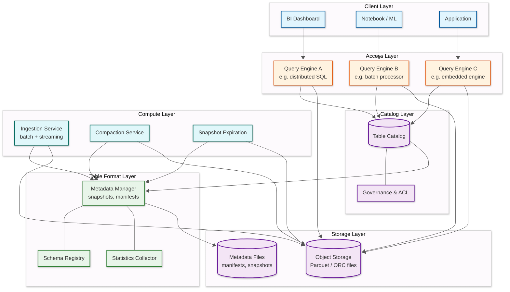
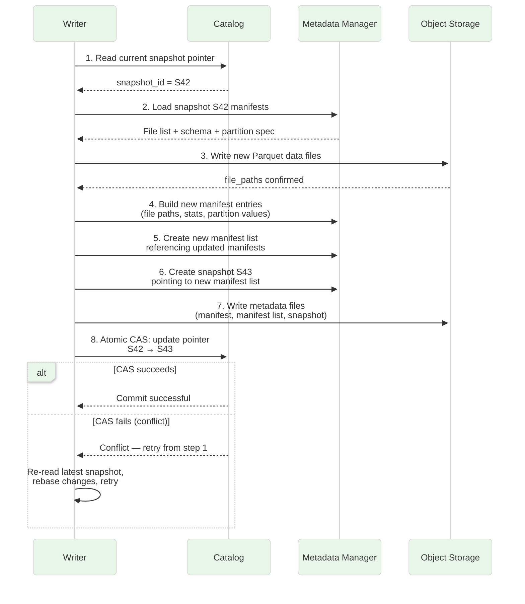
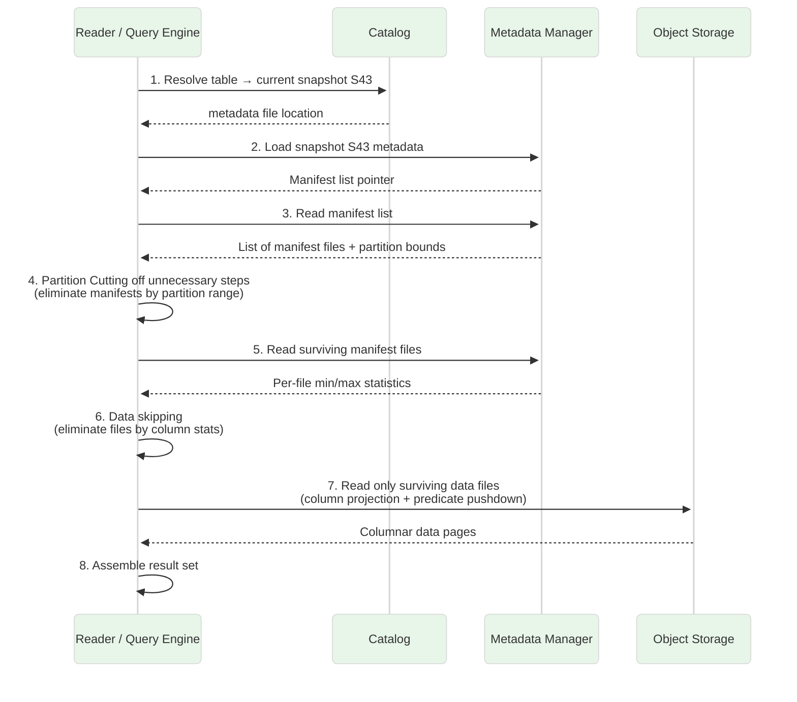
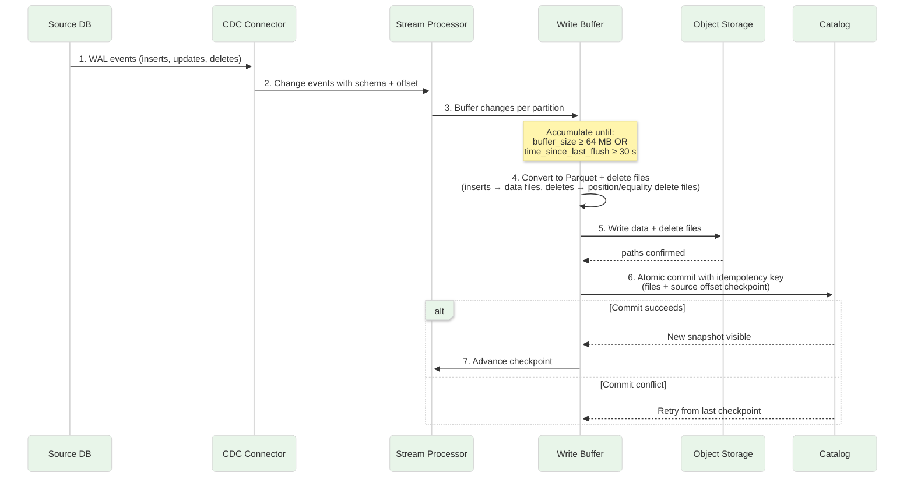
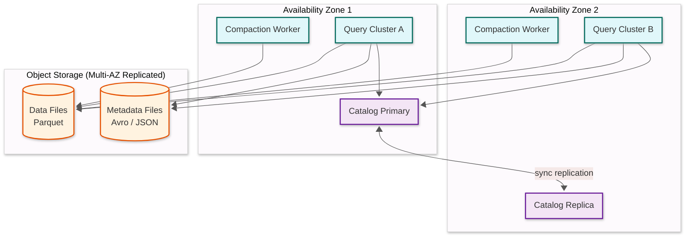

# High-Level Design — Data Lakehouse Architecture

## System Architecture



## Component Descriptions

### Catalog Layer

The catalog is the **single source of truth** for table identity. It maps a table name to the location of its current metadata file (the latest snapshot pointer). All commits go through the catalog to guarantee atomicity — a compare-and-swap on the metadata pointer ensures only one writer wins per commit cycle.

- **Table Catalog**: Stores table name -> current metadata location mapping. Implements atomic pointer updates via CAS or sequential log append.
- **Governance & ACL**: Enforces role-based access control, column-level masking, and credential vending so query engines receive scoped, short-lived tokens for object storage access.

### Table Format Layer

This layer sits logically between the catalog and the raw data files. It owns the metadata hierarchy that makes ACID possible on immutable object storage.

- **Metadata Manager**: Maintains the chain of snapshots -> manifest lists -> manifest files -> data file references. Each commit produces a new immutable snapshot.
- **Schema Registry**: Tracks column IDs, types, nullability, and evolution history. Column-ID-based tracking (rather than name or position) ensures correctness across renames and reorders.
- **Statistics Collector**: Gathers per-file and per-column statistics (min, max, null count, value count) and writes them into manifest entries for data-skipping decisions.

### Compute Layer

- **Ingestion Service**: Accepts batch loads and streaming micro-batches; writes Parquet files to object storage and commits new file references atomically.
- **Compaction Service**: Reads small files, rewrites them into optimally-sized files (128 – 256 MB), applies Z-ordering or sort-based clustering, and commits a replacement snapshot.
- **Snapshot Expiration (Vacuum)**: Removes data files that are no longer referenced by any live snapshot after a configurable retention period.

### Storage Layer

- **Object Storage**: Holds the actual data files (Parquet, ORC, or Avro). Provides virtually infinite capacity, high durability (11 nines), and pay-per-use economics.
- **Metadata Files**: Stores manifests, manifest lists, and snapshot metadata as small Avro or JSON files alongside data files. The table format layer reads these to reconstruct table state.

## Data Flow

### Write Path (ACID Commit)



**Key properties of the write path:**

1. **Optimistic concurrency** — writers proceed without locks; conflicts detected only at commit time (step 8).
2. **Immutable files** — new data files are written; existing files are never modified.
3. **Atomic visibility** — until the CAS succeeds, no reader sees the new files; after CAS, all readers see the complete set.
4. **Retry safety** — failed writers leave orphan data files that are cleaned up by the vacuum process.

### Read Path (Snapshot Isolation)



**Key properties of the read path:**

1. **Snapshot isolation** — the reader pins snapshot S43; concurrent writes creating S44 do not affect this query.
2. **Progressive Cutting off unnecessary steps** — manifests are pruned first (partition-level), then files (column-stats-level), minimizing I/O.
3. **No listing** — the reader never lists object-storage directories; all file references come from manifests, avoiding eventual-consistency hazards.
4. **Merge-on-read** (if applicable) — for tables using the MoR strategy, the reader merges base data files with delete files or log files before returning results.

## Key Design Decisions

| Decision | Choice | Trade-off |
|:---|:---|:---|
| **File-level tracking vs. directory listing** | File-level tracking in manifests | Higher metadata overhead but eliminates eventual-consistency issues with directory listings |
| **Optimistic concurrency vs. pessimistic locking** | OCC with CAS at commit | Higher conflict rate under heavy contention but zero lock overhead for the common case |
| **Copy-on-Write vs. Merge-on-Read** | Configurable per table | CoW optimizes reads at cost of write amplification; MoR optimizes writes but adds read-time merge cost |
| **Columnar format (Parquet) vs. row-oriented** | Parquet as default | Best for analytical scans; row-oriented access requires full-row reconstruction |
| **Centralized catalog vs. storage-level metadata** | Centralized catalog (REST protocol) | Single authority for governance and multi-engine consistency; catalog becomes an availability dependency |
| **Hidden partitioning vs. explicit partitioning** | Hidden (partition transforms derived from source columns) | Users write queries on source columns; physical layout is transparent and evolvable |
| **Embedded statistics vs. external statistics store** | Embedded in manifest files | Co-located with file references for single-fetch planning; limits statistics richness |

## Compaction Path

```mermaid
%%{init: {'theme': 'base', 'look': 'neo', 'themeVariables': {'primaryColor': '#e8f5e9', 'lineColor': '#555'}}}%%
sequenceDiagram
    participant SCHED as Compaction Scheduler
    participant COMP as Compaction Worker
    participant CAT as Catalog
    participant META as Metadata Manager
    participant OBJ as Object Storage

    SCHED->>CAT: 1. List partitions needing compaction
    CAT-->>SCHED: Partitions with small-file counts > threshold

    SCHED->>COMP: 2. Assign partition P7 for compaction
    COMP->>CAT: 3. Read current snapshot S43
    CAT-->>COMP: metadata location

    COMP->>META: 4. Load manifests for partition P7
    META-->>COMP: Files F1(2MB), F2(5MB), F3(1MB),<br/>F4(8MB), F5(3MB) + delete files D1, D2

    COMP->>OBJ: 5. Read all small files + delete files
    OBJ-->>COMP: Raw data

    COMP->>COMP: 6. Merge data, apply deletes,<br/>sort by clustering key,<br/>write to target size (256 MB)

    COMP->>OBJ: 7. Write compacted file F_new (19MB)
    OBJ-->>COMP: path confirmed

    COMP->>META: 8. Build replacement manifest<br/>(delete F1-F5, D1-D2; add F_new)
    COMP->>OBJ: 9. Write new metadata files

    COMP->>CAT: 10. CAS: S43 → S44 (replacement commit)
    alt CAS succeeds
        CAT-->>COMP: Compaction committed
    else CAS fails (concurrent modification)
        CAT-->>COMP: Conflict — retry with latest snapshot
        COMP->>COMP: Reload snapshot, re-evaluate<br/>affected files, retry
    end
```

## Streaming Ingestion Path (CDC → Lakehouse)



## Component Interaction Matrix

| | Catalog | Metadata Mgr | Object Storage | Query Engine | Ingestion | Compaction | Vacuum |
|:---|:---:|:---:|:---:|:---:|:---:|:---:|:---:|
| **Catalog** | — | reads metadata location | — | serves snapshot pointer | validates CAS | validates CAS | validates CAS |
| **Metadata Mgr** | pointer source | — | reads/writes Avro files | serves manifests | builds new manifests | builds replacement manifests | identifies orphans |
| **Object Storage** | — | stores metadata | — | serves data files | receives data files | reads + writes data | deletes orphan files |
| **Query Engine** | resolves snapshot | loads manifests | reads Parquet files | — | — | — | — |
| **Ingestion** | commits snapshot | builds manifests | writes Parquet files | — | — | may conflict | — |
| **Compaction** | commits replacement | rebuilds manifests | reads + rewrites files | — | may conflict | — | — |
| **Vacuum** | reads snapshot history | identifies unreferenced files | deletes files | — | — | — | — |

## Cross-Cutting Concerns

### Idempotency

Every commit carries an optional `idempotency_key`. The catalog rejects a commit whose key matches a previously committed snapshot, returning the existing snapshot instead. This makes streaming commit retries safe — a writer that crashes after writing data files but before checkpointing can replay the commit without creating duplicate data.

### Multi-Tenancy

| Strategy | Implementation | Trade-off |
|:---|:---|:---|
| **Namespace isolation** | Separate namespaces per tenant within one catalog | Shared catalog; simple; limited isolation |
| **Catalog-per-tenant** | Dedicated catalog instance per tenant | Strong isolation; higher operational cost |
| **Object storage prefix isolation** | Each tenant's data under a unique prefix; credential vending scoped per prefix | Cost-efficient; requires prefix-based access control |
| **Compute isolation** | Separate query engine clusters per tenant class | Prevents noisy-neighbor; complex scheduling |

### Technology Stack

| Layer | Component | Options |
|:---|:---|:---|
| **Catalog** | REST catalog | Polaris, Gravitino, Nessie, Unity, Hive Metastore (legacy) |
| **Table Format** | Metadata specification | Apache Iceberg, Delta Lake, Apache Hudi, Apache Paimon |
| **File Format** | Columnar storage | Apache Parquet (default), Apache ORC, Apache Avro (metadata) |
| **Object Storage** | Durable blob store | Any provider's object storage, HDFS (legacy) |
| **Query Engine** | SQL + analytics | Spark, Trino/Presto, Flink, DuckDB, Snowflake, Dremio, StarRocks |
| **Streaming** | Ingestion | Flink, Spark Structured Streaming, custom micro-batch |
| **Orchestration** | Compaction / vacuum | Airflow, custom schedulers, built-in table maintenance APIs |

## Real-World Architecture Patterns

### Pattern 1: Netflix (Iceberg at Exabyte Scale)

Netflix operates one of the largest Iceberg deployments, managing **exabytes of data** across thousands of tables. Key architectural choices:

- **Custom catalog** built on a proprietary metadata service with sub-100ms resolution at thousands of QPS.
- **Aggressive manifest caching** — query engines cache parsed manifests in memory with TTL-based invalidation tied to commit events.
- **Partition evolution** heavily used — tables start with coarse monthly partitions, evolve to daily as data volume grows, without data rewrites.
- **Compaction-as-a-service** — a dedicated, auto-scaling compaction cluster prioritizes tables by small-file debt score.
- **Write-Audit-Publish (WAP)** workflow for production data quality — writes land on a staging branch, undergo validation, then merge to the main branch via cherry-pick.

### Pattern 2: Uber (Hudi-Based Incremental Processing)

Uber pioneered the lakehouse concept with Apache Hudi for its ride data platform:

- **150+ PB** of data across hundreds of thousands of tables.
- **Merge-on-Read as default** — CDC from transactional databases flows into Hudi tables with MoR for low-latency upserts.
- **Inline compaction** — compaction runs within the ingestion job, bounding small-file accumulation at write time rather than requiring a separate service.
- **Timeline-based metadata** — Hudi's timeline (a commit log stored on object storage) provides an audit trail of every operation without a separate catalog dependency.
- **Multi-modal access** — the same tables serve both real-time dashboards (via Presto/Trino) and batch ETL pipelines (via Spark).

### Pattern 3: Databricks (Delta Lake + Unity Catalog)

Databricks' reference architecture demonstrates the centralized-catalog approach:

- **Unity Catalog** as the single governance layer across all compute — enforces RBAC, column masking, and row-level security at the catalog level.
- **Liquid Clustering** replaces both Z-ordering and explicit partitioning with an adaptive, incremental clustering strategy that re-clusters only newly ingested data.
- **Deletion Vectors** (a form of MoR) — instead of rewriting files for single-row deletes, a lightweight bitmap marks deleted rows. Reads filter marked rows with near-zero overhead.
- **Predictive I/O** — ML-based file Cutting off unnecessary steps that learns query patterns and pre-fetches likely needed files.
- **UniForm** — metadata interoperability layer that automatically generates Iceberg-compatible metadata alongside Delta logs, enabling non-Spark engines to read Delta tables natively.

## Architecture Pattern Checklist

| Pattern | Choice | Notes |
|:---|:---|:---|
| Synchronous / Asynchronous | Async writes, sync metadata commit | Data files written in parallel; single atomic commit |
| Event-driven | Yes | Commit events trigger compaction, cache invalidation, downstream consumers |
| Push / Pull | Pull for reads, push for ingest | Query engines pull data; ingestion pushes files to storage |
| Stateless / Stateful | Stateless compute, stateful catalog | Query engines are ephemeral; catalog and object storage hold state |
| Read-heavy / Write-heavy | Read-heavy (typical 10:1 – 100:1) | Optimized for analytical scan throughput |
| Real-time / Batch | Unified | Same table supports streaming micro-batch ingest and batch analytical queries |
| Edge / Origin | Origin (centralized storage) | Object storage in a single region; multi-region via replication |

## Deployment Topology

### Single-Region (Standard)



### Multi-Region (Active-Passive)

| Component | Primary Region | DR Region | Replication |
|:---|:---|:---|:---|
| Catalog | Active (read + write) | Passive (read-only) | Synchronous metadata replication |
| Object storage | Primary writes | Asynchronous replica | Object-level cross-region replication |
| Query engines | Full cluster | Warm standby (scaled down) | Scale up on failover |
| Compaction | Active | Inactive | Activate on promotion |

**Failover trigger**: Catalog health check fails for > 60 s → promote DR region → update DNS → scale up DR query cluster.

## Catalog Architecture Deep Dive

### Catalog Implementation Options

| Implementation | Mechanism | Strengths | Weaknesses |
|:---|:---|:---|:---|
| **REST Catalog** (Iceberg standard) | HTTP API with CAS semantics | Standard protocol; multi-engine; credential vending | Requires operational management |
| **Nessie** (Git-like) | Git-inspired branching with CAS commits | Branching, tagging, cross-table transactions | Additional infrastructure component |
| **Hive Metastore** (legacy) | Relational DB (MySQL/PostgreSQL) | Widely supported; existing deployments | No credential vending; limited multi-engine support; schema-locked |
| **Polaris** | REST catalog with Iceberg-native RBAC | Full governance; open-source | Newer; smaller ecosystem |
| **Unity Catalog** | Multi-format governance platform | Cross-format (Delta, Iceberg); RBAC + lineage | Vendor-aligned; emerging open-source |
| **Gravitino** | Unified catalog abstraction | Multi-catalog federation; format-agnostic | Additional abstraction layer |
| **DuckLake** | SQL database as catalog | SQL-queryable metadata; multi-table atomicity | Single-engine optimized; emerging |

### REST Catalog Protocol Design

The REST catalog protocol defines a standard HTTP interface that any engine can implement:

```
Core Operations:
  GET    /v1/config                              → catalog configuration
  GET    /v1/namespaces/{ns}/tables/{table}      → load table metadata
  POST   /v1/namespaces/{ns}/tables              → create table
  POST   /v1/namespaces/{ns}/tables/{table}/commits  → atomic commit

Governance Operations:
  POST   /v1/oauth/tokens                        → obtain access token
  GET    /v1/namespaces/{ns}/tables/{table}/credentials  → credential vending

Maintenance Operations:
  POST   /v1/namespaces/{ns}/tables/{table}/metrics     → report scan metrics
  DELETE /v1/namespaces/{ns}/tables/{table}/snapshots   → expire snapshots
```

**Key design principle**: The protocol is intentionally thin — it manages table identity, atomic commits, and access control. Query planning, data skipping, and execution are engine responsibilities. This separation allows new engines to adopt the lakehouse ecosystem by implementing only the catalog client.

## Format Convergence and Interoperability

### The Interoperability Problem

Organizations often accumulate multiple table formats: Delta Lake for Spark workloads, Iceberg for Trino, Hudi for streaming CDC. Without interoperability, each format requires separate metadata, separate tooling, and separate governance.

### Interoperability Approaches

| Approach | Mechanism | Trade-off |
|:---|:---|:---|
| **UniForm (Delta → Iceberg)** | Delta writes automatically generate Iceberg metadata alongside Delta log | Zero reader configuration; write-side overhead (~5%) |
| **XTable / OneTable** | Post-hoc metadata translation between any format pair | Flexible; adds a translation step with sync lag |
| **DuckLake (SQL catalog)** | Store all metadata in a SQL database; any format's files queryable | Simplest metadata model; tightly coupled to DuckDB |
| **Native multi-format catalog** | Catalog natively understands Delta, Iceberg, Hudi metadata | Single governance; complex catalog implementation |

### Convergence Timeline

| Feature | Delta Lake | Iceberg | Hudi | Status (2025–2026) |
|:---|:---:|:---:|:---:|:---|
| ACID commits | ✓ | ✓ | ✓ | Feature parity |
| Schema evolution (column ID) | ✓ | ✓ | ✓ | Feature parity |
| Time travel | ✓ | ✓ | ✓ | Feature parity |
| Hidden partitioning | ✓ (Liquid) | ✓ | Partial | Iceberg pioneered; others converging |
| MoR with deletion vectors | ✓ | ✓ | ✓ (log-based) | All support lightweight deletes |
| Branching & tagging | Partial | ✓ | ✓ (timeline) | Iceberg most mature |
| REST catalog protocol | ✓ (via UniForm) | ✓ (native) | ✓ (interop) | Iceberg's REST catalog becoming standard |
| Puffin statistics | — | ✓ | — | Iceberg-specific; potential cross-format adoption |
| Liquid Clustering | ✓ | — | — | Delta-specific; Iceberg exploring similar |
| Change data feed | ✓ (CDF) | ✓ (incremental) | ✓ (timeline) | All support incremental reads |
| Cross-table transactions | Partial | ✓ (via REST catalog) | — | Iceberg via multi-table commit |

## Write Path Optimization Strategies

### Adaptive Commit Batching

For high-throughput streaming workloads, the write path can be optimized by batching multiple micro-batches into a single catalog commit:

```
Standard (naive):       30s batch → commit → 30s batch → commit → ...
                        = 2 commits/min, 2 small files/min per partition

Adaptive batching:      30s batch → buffer → 30s batch → buffer → commit
                        = 1 commit/min, 1 larger file per partition
                        (commit triggered by size threshold OR time limit)
```

**Impact**: Halves catalog CAS operations and halves small-file creation rate, at the cost of doubling the worst-case data freshness latency (from 30 s to 60 s).

### File Group Isolation

For tables with many concurrent writers, file-group isolation prevents CAS contention:

```
Table: events
  ├── File Group 0 (owned by Writer A)
  │     ├── data-fg0-001.parquet
  │     └── data-fg0-002.parquet
  ├── File Group 1 (owned by Writer B)
  │     ├── data-fg1-001.parquet
  │     └── data-fg1-002.parquet
  └── File Group 2 (owned by Writer C)
        └── data-fg2-001.parquet

// Each writer only modifies its own file group
// Commits are non-conflicting → auto-rebase succeeds
// Compaction merges across file groups periodically
```

### Scan Planning Optimization

Query engines employ a multi-level planning strategy to minimize I/O:

| Planning Level | Input | Output | Cost |
|:---|:---|:---|:---|
| **Level 0: Catalog** | Table name | Snapshot pointer + metadata location | 1 HTTP call (~50 ms) |
| **Level 1: Manifest list** | Snapshot metadata | Surviving manifests (partition Cutting off unnecessary steps) | 1 Avro file read (~100 ms) |
| **Level 2: Manifests** | Surviving manifests | Surviving files (column stats Cutting off unnecessary steps) | N Avro file reads in parallel (~200 ms) |
| **Level 3: Puffin stats** | Surviving files | Further-pruned files (bloom filter) | Optional sidecar reads (~100 ms) |
| **Level 4: Parquet footer** | Surviving files | Surviving row groups (row-group stats) | N footer reads (batched with data) |
| **Level 5: Execution** | Surviving row groups | Query results | Parallel columnar scan |

**Progressive elimination example** (1 PB table, highly selective query):
- Level 1: 4 M files → 40 K surviving manifests (99% eliminated)
- Level 2: 40 K → 4 000 surviving files (90% eliminated)
- Level 3: 4 000 → 400 surviving files (bloom filter, 90% eliminated)
- Level 4: 400 files × 4 row groups → 200 surviving row groups (50% eliminated)
- **Result**: Query reads 200 × 128 MB = 25 GB from a 1 PB table (0.0025%)
