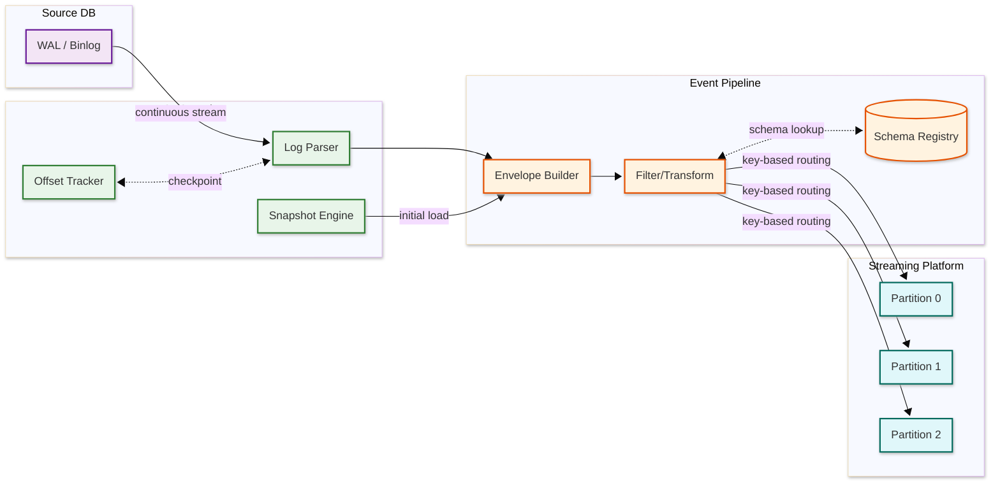

# Low-Level Design — Change Data Capture (CDC) System

## Data Model

### Change Event Envelope

Every change captured by the CDC system is wrapped in a standardized envelope that carries both the data and metadata needed for downstream processing:

```
┌─────────────────────────────────────────────────────────────────┐
│ Change Event Envelope                                           │
├──────────────────┬──────────────────────────────────────────────┤
│ schema           │ Schema ID + version (reference to registry)  │
│ payload          │ The actual change data (see below)           │
│   ├─ before      │ Row state before the change (NULL for INSERTs)│
│   ├─ after       │ Row state after the change (NULL for DELETEs)│
│   ├─ source      │ Source metadata block                        │
│   │   ├─ connector│ Connector name (e.g., "pg-orders")         │
│   │   ├─ db       │ Database name                              │
│   │   ├─ schema   │ Schema/namespace                           │
│   │   ├─ table    │ Table name                                 │
│   │   ├─ lsn      │ Log Sequence Number                        │
│   │   ├─ txId     │ Transaction ID                             │
│   │   ├─ ts_ms    │ Source database commit timestamp (ms)       │
│   │   └─ snapshot │ "true" if from snapshot, "false" if streaming│
│   ├─ op          │ Operation: "c" (create), "u" (update),      │
│   │              │ "d" (delete), "r" (read/snapshot)            │
│   ├─ ts_ms       │ CDC processing timestamp (ms)               │
│   └─ transaction │ Transaction metadata (optional)              │
│       ├─ id       │ Transaction ID string                      │
│       ├─ total    │ Total events in this transaction            │
│       └─ seq      │ Sequence number within transaction          │
└──────────────────┴──────────────────────────────────────────────┘
```

### Offset Storage Model

Offsets track the CDC connector's position in the source database's transaction log:

```
┌─────────────────────────────────────────────────────────────────┐
│ Connector Offset Record                                         │
├──────────────────┬──────────────────────────────────────────────┤
│ connector_name   │ String — unique identifier for this connector│
│ source_partition │ Map — identifies the specific source         │
│   ├─ server      │ Logical server name                         │
│   └─ database    │ Database name                               │
│ source_offset    │ Map — position in the transaction log        │
│   ├─ lsn         │ PostgreSQL: Log Sequence Number (int64)     │
│   ├─ file        │ MySQL: binlog file name                     │
│   ├─ pos         │ MySQL: binlog position (int64)              │
│   ├─ gtid        │ MySQL: Global Transaction ID set            │
│   ├─ txId        │ Current transaction ID                      │
│   ├─ ts_sec      │ Source timestamp (epoch seconds)            │
│   └─ snapshot    │ Boolean: currently in snapshot phase?        │
│ updated_at       │ Timestamp of last offset update             │
└──────────────────┴──────────────────────────────────────────────┘
```

### Schema History Store

Tracks DDL changes over time to correctly decode events from any point in the log:

```
┌─────────────────────────────────────────────────────────────────┐
│ Schema History Entry                                            │
├──────────────────┬──────────────────────────────────────────────┤
│ source           │ Map — connector + database + table           │
│ position         │ Map — log position where DDL was captured    │
│ database_name    │ String — database where DDL occurred         │
│ ddl              │ String — the DDL statement                   │
│ table_changes    │ List — structural changes to each table      │
│   ├─ type        │ "CREATE", "ALTER", "DROP"                   │
│   ├─ table       │ Fully-qualified table name                  │
│   └─ columns     │ List of column definitions (name, type, pk) │
│ ts_ms            │ Timestamp when DDL was captured              │
└──────────────────┴──────────────────────────────────────────────┘
```

### Event Key Structure

Each event has a key derived from the table's primary key, ensuring events for the same row land in the same partition for ordering:

```
Key = { "schema": <key_schema_id>, "payload": { <primary_key_columns> } }

Example (orders table with composite PK):
Key = { "payload": { "order_id": 42 } }
Value = { <full change event envelope> }
```

### Partitioning Strategy

| Strategy | How It Works | When Used |
|----------|-------------|-----------|
| **Primary key hash** | Hash the event key (PK) to determine partition | Default: per-row ordering guarantee |
| **Transaction ID** | Route all events in a transaction to one partition | When transaction atomicity at consumer is required |
| **Table-based** | One partition per table (for small deployments) | Simple setups with few tables |
| **Custom router** | Application-defined routing logic | Multi-tenant routing by tenant_id |

---

## API Design

### Connector Management API

```
POST /connectors
Content-Type: application/json
Authorization: Bearer {token}

Request:
{
  "name": "pg-orders-connector",
  "config": {
    "connector.class": "io.cdc.connector.postgresql.PostgresConnector",
    "database.hostname": "orders-db.internal",
    "database.port": 5432,
    "database.user": "cdc_replication_user",
    "database.dbname": "orders",
    "table.include.list": "public.orders,public.order_items",
    "slot.name": "cdc_orders_slot",
    "publication.name": "cdc_orders_pub",
    "snapshot.mode": "initial",
    "topic.prefix": "prod.orders",
    "schema.history.internal.topic": "schema-history.orders",
    "transforms": "filter",
    "transforms.filter.type": "io.cdc.transforms.Filter",
    "transforms.filter.condition": "op != 'r' OR table == 'orders'"
  }
}

Response:
{
  "name": "pg-orders-connector",
  "type": "source",
  "state": "RUNNING",
  "worker_id": "worker-03:8083",
  "tasks": [
    { "id": 0, "state": "RUNNING", "worker_id": "worker-03:8083" }
  ]
}
```

### Connector Lifecycle

```
GET    /connectors                        → List all connectors
GET    /connectors/{name}                 → Get connector status and config
POST   /connectors                        → Create a new connector
PUT    /connectors/{name}/config          → Update connector configuration
PUT    /connectors/{name}/pause           → Pause capture (retains offset)
PUT    /connectors/{name}/resume          → Resume from last offset
PUT    /connectors/{name}/restart         → Restart connector tasks
DELETE /connectors/{name}                 → Remove connector (offsets retained)
```

### Offset Management API

```
GET /connectors/{name}/offsets
Response:
{
  "offsets": [
    {
      "partition": { "server": "prod.orders" },
      "offset": {
        "lsn": 2847592016,
        "txId": 98234,
        "ts_sec": 1710072301,
        "snapshot": false
      }
    }
  ]
}

PUT /connectors/{name}/offsets
Request:
{
  "offsets": [
    {
      "partition": { "server": "prod.orders" },
      "offset": { "lsn": 2847590000 }
    }
  ]
}
// Rewind connector to a specific log position (requires connector to be stopped)
```

### Monitoring API

```
GET /connectors/{name}/status
Response:
{
  "name": "pg-orders-connector",
  "connector": { "state": "RUNNING", "worker_id": "worker-03:8083" },
  "tasks": [
    {
      "id": 0,
      "state": "RUNNING",
      "worker_id": "worker-03:8083"
    }
  ],
  "metrics": {
    "total_events_captured": 12847293,
    "events_per_second": 3421,
    "lag_ms": 234,
    "snapshot_completed": true,
    "last_event_ts": "2026-03-10T14:32:01.234Z"
  }
}
```

### Idempotency & Rate Limiting

**Idempotency:**
- Connector creation is idempotent by connector name (same name → same connector)
- Offset writes use conditional updates (compare-and-swap on version)
- Event production uses idempotent producer (sequence number deduplication)

**Rate Limiting:**

| Endpoint | Limit | Window |
|----------|-------|--------|
| Connector CRUD | 100/min per client | Sliding window |
| Offset management | 50/min per client | Sliding window |
| Monitoring reads | 1,000/min per client | Sliding window |
| Signal table writes | 10/min per connector | Fixed window |

---

## Core Algorithms

### 1. WAL / Binlog Parsing and Event Extraction

```
FUNCTION capture_changes(source_config, start_offset):
    connection = open_replication_connection(source_config)
    slot = ensure_replication_slot(connection, source_config.slot_name)
    schema_cache = load_schema_history(source_config)

    // Position to the last committed offset
    current_lsn = start_offset.lsn OR slot.confirmed_flush_lsn

    WHILE connector.is_running:
        // Read batch of WAL entries from logical decoding
        wal_entries = connection.read_logical_changes(
            slot_name = source_config.slot_name,
            start_lsn = current_lsn,
            max_batch_size = 1024,
            timeout_ms = 100
        )

        IF wal_entries is empty:
            // No new changes; emit heartbeat if configured
            IF heartbeat_interval_elapsed():
                emit_heartbeat_event(current_lsn)
            CONTINUE

        FOR EACH entry IN wal_entries:
            IF entry.type == DDL_CHANGE:
                // Schema change detected
                new_schema = parse_ddl(entry.ddl_statement)
                schema_cache.update(entry.table, new_schema, entry.lsn)
                persist_schema_history(entry)
                emit_schema_change_event(entry)

            ELSE IF entry.type == ROW_CHANGE:
                schema = schema_cache.get(entry.table, entry.lsn)
                event = build_change_event(entry, schema)
                emit_to_streaming_platform(event)

            current_lsn = entry.lsn

        // Periodically commit offset
        IF offset_commit_interval_elapsed():
            persist_offset(current_lsn)
            connection.confirm_flush(current_lsn)  // Allow WAL cleanup

// Time:  O(N) per batch where N = number of WAL entries
// Space: O(S) for schema cache where S = number of monitored tables
```

### 2. Consistent Initial Snapshot with Streaming Cutover

```
FUNCTION perform_snapshot(source_config, tables):
    connection = open_snapshot_connection(source_config)

    // Step 1: Acquire a consistent snapshot point
    connection.begin_transaction(isolation = REPEATABLE_READ)
    snapshot_lsn = connection.get_current_lsn()
    LOG("Snapshot started at LSN: {snapshot_lsn}")

    // Step 2: Read and emit each table in chunks
    FOR EACH table IN tables:
        schema = connection.get_table_schema(table)
        register_schema(table, schema)

        total_rows = connection.estimate_row_count(table)
        pk_columns = connection.get_primary_key_columns(table)

        // Chunked reading to avoid memory pressure
        last_pk = NULL
        WHILE true:
            rows = connection.execute_query(
                "SELECT * FROM {table} WHERE {pk_columns} > {last_pk}
                 ORDER BY {pk_columns} LIMIT {chunk_size}"
            )

            IF rows is empty:
                BREAK

            FOR EACH row IN rows:
                event = build_snapshot_event(table, row, snapshot_lsn, schema)
                emit_to_streaming_platform(event)

            last_pk = rows.last().pk_value
            persist_snapshot_progress(table, last_pk)
            LOG("Snapshot progress: {table} - {rows_emitted}/{total_rows}")

    // Step 3: Complete snapshot and transition to streaming
    connection.commit_transaction()
    persist_offset(snapshot_lsn, snapshot_complete = true)
    LOG("Snapshot complete. Transitioning to streaming from LSN: {snapshot_lsn}")

    // Step 4: Start streaming from snapshot position
    start_streaming(source_config, start_offset = snapshot_lsn)

// Time:  O(R) where R = total rows across all tables
// Space: O(chunk_size) for buffered rows
```

### 3. Incremental Snapshot via Watermark (DBLog Approach)

```
FUNCTION incremental_snapshot(table, source_config):
    // Non-blocking snapshot that interleaves with streaming
    // Uses watermark tokens written to a signal table

    pk_columns = get_primary_key_columns(table)
    chunk_boundaries = compute_chunk_boundaries(table, pk_columns, chunk_size)

    FOR EACH chunk IN chunk_boundaries:
        // Step 1: Write LOW watermark to signal table
        low_watermark_id = generate_uuid()
        write_to_signal_table(low_watermark_id, "LOW", chunk.start, chunk.end)
        // The CDC log reader will see this watermark in the WAL

        // Step 2: Execute SELECT for this chunk
        rows = execute_query(
            "SELECT * FROM {table}
             WHERE {pk_columns} >= {chunk.start}
               AND {pk_columns} < {chunk.end}"
        )

        // Step 3: Write HIGH watermark to signal table
        high_watermark_id = generate_uuid()
        write_to_signal_table(high_watermark_id, "HIGH", chunk.start, chunk.end)

        // Step 4: The log reader processes events in order:
        //   a) Log events before LOW watermark → emit normally
        //   b) Log events between LOW and HIGH → buffer
        //   c) Snapshot rows → emit, but deduplicate against buffered log events
        //   d) Buffered log events → emit (they are more recent than snapshot)
        //   e) Log events after HIGH watermark → emit normally

        process_watermark_window(low_watermark_id, high_watermark_id, rows)

        persist_incremental_snapshot_progress(table, chunk.end)

// Time:  O(R) where R = total rows in table
// Space: O(chunk_size + B) where B = buffered log events between watermarks
```

### 4. Offset Tracking and Exactly-Once Commit

```
FUNCTION commit_offset_exactly_once(connector_id, events_batch, new_offset):
    // Use transactional producer to atomically write events and offset

    producer.begin_transaction()

    TRY:
        // Step 1: Publish all events in the batch
        FOR EACH event IN events_batch:
            topic = compute_topic(event.source.table)
            key = extract_key(event)
            producer.send(topic, key, serialize(event))

        // Step 2: Write offset as part of the same transaction
        offset_record = build_offset_record(connector_id, new_offset)
        producer.send("__cdc_offsets", connector_id, serialize(offset_record))

        // Step 3: Commit transaction atomically
        producer.commit_transaction()

        LOG("Offset committed: connector={connector_id}, lsn={new_offset.lsn}")

    CATCH TransactionAbortException:
        producer.abort_transaction()
        LOG_WARN("Transaction aborted; will retry batch from previous offset")
        // Events will be re-read from the WAL and re-published
        // Idempotent producer ensures no duplicates

FUNCTION recover_offset(connector_id):
    // On restart, read the last committed offset
    offset_record = read_latest("__cdc_offsets", key = connector_id)

    IF offset_record is NULL:
        // No offset found; need full snapshot
        RETURN { snapshot_required: true }

    IF offset_record.snapshot_complete == false:
        // Snapshot was interrupted; resume from last progress
        RETURN {
            snapshot_required: true,
            resume_table: offset_record.snapshot_table,
            resume_pk: offset_record.snapshot_last_pk
        }

    RETURN { start_lsn: offset_record.lsn, snapshot_required: false }

// Time:  O(B) per commit where B = batch size
// Space: O(1) for offset storage per connector
```

### 5. Schema Change Detection and Propagation

```
FUNCTION handle_schema_change(ddl_entry, schema_cache, registry_client):
    table = extract_table_name(ddl_entry.statement)
    change_type = classify_ddl(ddl_entry.statement)
    // Types: ADD_COLUMN, DROP_COLUMN, RENAME_COLUMN, ALTER_TYPE, CREATE_TABLE, DROP_TABLE

    old_schema = schema_cache.get(table)
    new_schema = parse_new_schema(ddl_entry)

    // Check compatibility with schema registry
    compatibility = registry_client.check_compatibility(
        subject = compute_subject_name(table),
        schema = new_schema
    )

    IF NOT compatibility.is_compatible:
        // Breaking change detected
        LOG_ERROR("Incompatible schema change for {table}: {compatibility.errors}")
        emit_alert("SCHEMA_INCOMPATIBLE", table, ddl_entry)

        IF config.schema_change_policy == "FAIL":
            HALT connector with error
        ELSE IF config.schema_change_policy == "SKIP":
            LOG_WARN("Skipping incompatible events until schema is resolved")
            schema_cache.mark_incompatible(table)
            RETURN
        ELSE IF config.schema_change_policy == "LOG_AND_CONTINUE":
            // Log raw event to dead-letter topic
            emit_to_dead_letter(ddl_entry)

    // Register new schema version
    schema_id = registry_client.register(
        subject = compute_subject_name(table),
        schema = new_schema
    )

    // Update local cache
    schema_cache.put(table, new_schema, schema_id, ddl_entry.lsn)

    // Persist to schema history
    persist_schema_history_entry(ddl_entry, old_schema, new_schema)

    LOG("Schema updated: {table} v{schema_id} ({change_type})")

// Time:  O(1) per DDL event (registry call is network-bounded)
// Space: O(T) for schema cache where T = number of tables
```

### Data Flow Visualization



---

## Error Handling and Retry Matrix

| Error Type | Source | Retryable? | Max Retries | Backoff | Action on Exhaustion |
|-----------|--------|-----------|-------------|---------|---------------------|
| Connection refused | Source DB | Yes | Unlimited | Exponential (100ms → 30s) | Alert; wait for DB recovery |
| Replication slot not found | Source DB | No | 0 | — | Re-create slot; trigger re-snapshot |
| WAL segment missing | Source DB | No | 0 | — | Alert P1; re-snapshot required |
| Serialization failure | Schema registry | Yes | 3 | Exponential (50ms → 500ms) | Route event to dead-letter topic |
| Schema incompatible | Schema registry | No | 0 | — | Halt connector; alert for human review |
| Registry unreachable | Schema registry | Yes | 5 | Exponential (100ms → 2s) | Use cached schema; buffer events |
| Broker unavailable | Streaming platform | Yes | 10 | Exponential (100ms → 5s) | Pause capture; buffer in memory |
| Partition leader election | Streaming platform | Yes | 5 | Fixed (200ms) | Retry; typically resolves in < 1s |
| Offset commit failure | Streaming platform | Yes | 5 | Fixed (200ms) | Alert; at-least-once window extends |
| Out of memory | Connector JVM | No | 0 | — | Crash; restart; investigate large transaction |

### Dead Letter Queue Processing

```
FUNCTION process_dead_letter_event(event, failure_reason):
    dlq_event = {
        original_event: event,
        failure_reason: failure_reason,
        failed_at: now(),
        connector_id: current_connector_id,
        source_table: event.source.table,
        retry_count: 0,
        max_retries: 3
    }

    // Classify failure for routing
    CASE failure_reason:
        WHEN "schema_incompatible":
            dlq_event.priority = "HIGH"
            dlq_event.sla = "4 hours"
            dlq_event.action = "MANUAL_REVIEW"
        WHEN "serialization_error":
            dlq_event.priority = "MEDIUM"
            dlq_event.sla = "24 hours"
            dlq_event.action = "AUTO_RETRY_WITH_JSON"
        WHEN "oversized_event":
            dlq_event.priority = "LOW"
            dlq_event.sla = "48 hours"
            dlq_event.action = "TRUNCATE_AND_RETRY"
        WHEN "unknown":
            dlq_event.priority = "HIGH"
            dlq_event.sla = "4 hours"
            dlq_event.action = "MANUAL_REVIEW"

    // Apply same PII masking as normal pipeline
    dlq_event = apply_pii_masking(dlq_event)

    PUBLISH(dlq_event, topic="cdc.dead-letter.{source_table}")
    increment_metric("cdc.events.dead_letter_total", table=event.source.table)
```

---

## Data Volume Estimation per Entity

| Entity | Record Size | Records/Day | Daily Volume | Partition Strategy | Retention |
|--------|-----------|------------|-------------|-------------------|-----------|
| Order events | 1.2 KB avg | 5M | 6 GB | order_id hash | 7 days hot, 30 days warm |
| User profile events | 0.8 KB avg | 500K | 400 MB | user_id hash | 7 days hot, 90 days warm |
| Product catalog events | 2.5 KB avg | 200K | 500 MB | product_id hash | 7 days hot, 30 days warm |
| Inventory events | 0.5 KB avg | 10M | 5 GB | sku_id hash | 3 days hot |
| Payment events | 1.5 KB avg | 3M | 4.5 GB | payment_id hash | 7 days hot, 365 days archive |
| Session events | 0.3 KB avg | 50M | 15 GB | session_id hash | 1 day hot |
| Audit log events | 1.0 KB avg | 2M | 2 GB | entity_id hash | 365 days |
| Schema history | 5 KB avg | 50 | 250 KB | table name | Indefinite |
| Offsets | 0.1 KB avg | 100K commits | 10 MB | connector_id | Compacted (latest only) |

### Event Size Distribution

| Percentile | Event Size | Typical Content |
|-----------|-----------|-----------------|
| p25 | 200 bytes | Simple INSERT: few columns, small values |
| p50 | 800 bytes | Typical UPDATE: before/after images, moderate columns |
| p75 | 2 KB | Wide table UPDATE: 30+ columns, JSON fields |
| p90 | 5 KB | Large text/JSON columns in before/after images |
| p95 | 10 KB | Very wide tables or large BLOB references |
| p99 | 50 KB | Tables with embedded JSON documents |
| p99.9 | 200 KB+ | Exceptional: full-text columns, serialized objects |

---

## Algorithm 6: Connector Health Self-Assessment

```
FUNCTION self_assess_connector_health(connector):
    // Run periodically (every 30 seconds) by each connector
    health = {
        status: "HEALTHY",
        issues: [],
        score: 100
    }

    // Check 1: Replication lag
    lag_ms = get_current_lag_ms()
    IF lag_ms > 30000:
        health.score -= 30
        health.issues.append("HIGH_LAG: {lag_ms}ms behind source")
    ELIF lag_ms > 5000:
        health.score -= 10
        health.issues.append("MODERATE_LAG: {lag_ms}ms behind source")

    // Check 2: Memory pressure
    heap_used_pct = jvm_heap_used / jvm_heap_max * 100
    IF heap_used_pct > 90:
        health.score -= 40
        health.issues.append("MEMORY_CRITICAL: {heap_used_pct}% heap used")
    ELIF heap_used_pct > 75:
        health.score -= 15
        health.issues.append("MEMORY_PRESSURE: {heap_used_pct}% heap used")

    // Check 3: Error rate
    recent_errors = count_errors(window=60_seconds)
    IF recent_errors > 10:
        health.score -= 25
        health.issues.append("HIGH_ERROR_RATE: {recent_errors} errors/min")

    // Check 4: Schema cache effectiveness
    cache_hit_ratio = schema_cache_hits / (schema_cache_hits + schema_cache_misses)
    IF cache_hit_ratio < 0.9:
        health.score -= 10
        health.issues.append("SCHEMA_CACHE_COLD: {cache_hit_ratio} hit ratio")

    // Check 5: Offset commit health
    IF last_offset_commit_age > 30_seconds:
        health.score -= 20
        health.issues.append("OFFSET_STALE: last commit {last_offset_commit_age}s ago")

    // Determine overall status
    IF health.score >= 80:
        health.status = "HEALTHY"
    ELIF health.score >= 50:
        health.status = "DEGRADED"
    ELSE:
        health.status = "UNHEALTHY"

    publish_health_metric(connector.id, health)
    RETURN health
```

---

## 7. Heartbeat Event Generation

```
FUNCTION heartbeat_loop(connector_config):
    heartbeat_table = connector_config.heartbeat_table  // e.g., "cdc_heartbeat"
    heartbeat_interval_ms = connector_config.heartbeat_interval  // e.g., 10,000 ms

    WHILE connector.is_running:
        TRY:
            // Write heartbeat to source DB — creates a WAL entry that advances the slot
            source_connection.execute(
                "INSERT INTO {heartbeat_table} (connector_name, ts)
                 VALUES ({connector_config.name}, NOW())
                 ON CONFLICT (connector_name) DO UPDATE SET ts = NOW()"
            )

            heartbeat_event = {
                op: "heartbeat",
                connector: connector_config.name,
                source_ts: NOW(),
                captured_ts: NOW(),
                lsn: source_connection.get_current_lsn()
            }
            emit_to_streaming_platform(heartbeat_event, topic = "__cdc_heartbeat")

        CATCH ConnectionException:
            LOG_WARN("Heartbeat write failed; source DB may be unreachable")
            // Do NOT advance the slot — this signals connector health issue

        sleep(heartbeat_interval_ms)

// Time:  O(1) per heartbeat
// Space: O(1) — single row per connector in heartbeat table
// Key benefit: advances replication slot even when monitored tables have no writes
```

---

## 8. Event Transformation and Routing Engine

```
FUNCTION apply_transforms(event, connector_transforms):
    // Transforms applied in order; each modifies the event in-place

    FOR EACH transform IN connector_transforms:
        IF transform.type == "FILTER":
            IF NOT evaluate_predicate(event, transform.condition):
                RETURN NULL  // Event filtered out

        ELIF transform.type == "MASK":
            FOR EACH field IN transform.fields:
                IF event.after[field] IS NOT NULL:
                    event.after[field] = mask(event.after[field], transform.mask_type)
                IF event.before[field] IS NOT NULL:
                    event.before[field] = mask(event.before[field], transform.mask_type)

        ELIF transform.type == "ROUTE":
            IF evaluate_predicate(event, transform.condition):
                event.metadata.target_topic = transform.target_topic

        ELIF transform.type == "FLATTEN":
            FOR EACH field IN transform.fields:
                nested = parse_json(event.after[field])
                FOR EACH (key, value) IN nested:
                    event.after["{field}_{key}"] = value
                event.after.remove(field)

    RETURN event

FUNCTION mask(value, mask_type):
    SWITCH mask_type:
        CASE "SHA256":    RETURN sha256(value)
        CASE "TRUNCATE":  RETURN value[0:3] + "***"
        CASE "NULLIFY":   RETURN NULL
        CASE "TOKENIZE":  RETURN token_store.get_or_create(value)

// Time:  O(T × F) where T = number of transforms, F = fields per transform
// Space: O(1) — transforms applied in-place
```

---

## Topic Naming Convention

| Pattern | Example | When Used |
|---------|---------|-----------|
| `{server}.{database}.{table}` | `prod.orders.order_items` | Standard per-table topics (default) |
| `{server}.{database}.__transaction` | `prod.orders.__transaction` | Transaction boundary markers |
| `__cdc_offsets` | `__cdc_offsets` | Connector offset storage (internal) |
| `__cdc_heartbeat` | `__cdc_heartbeat` | Heartbeat events from all connectors |
| `cdc.dead-letter.{table}` | `cdc.dead-letter.orders` | Failed events per source table |
| `schema-history.{connector}` | `schema-history.pg-orders` | DDL history for connector recovery |

### Topic Configuration per Use Case

| Topic Type | Partitions | Replication | Retention | Cleanup Policy |
|-----------|-----------|-------------|-----------|----------------|
| CDC data topics | 6-24 (by throughput) | 3 | 7 days | Delete |
| Offset topic | 25 (fixed) | 3 | Indefinite | Compact |
| Schema history | 1 | 3 | Indefinite | Delete |
| Dead-letter | 3 | 3 | 30 days | Delete |
| Heartbeat | 1 | 3 | 1 day | Delete |
| Transaction markers | Same as data | 3 | Same as data | Delete |
