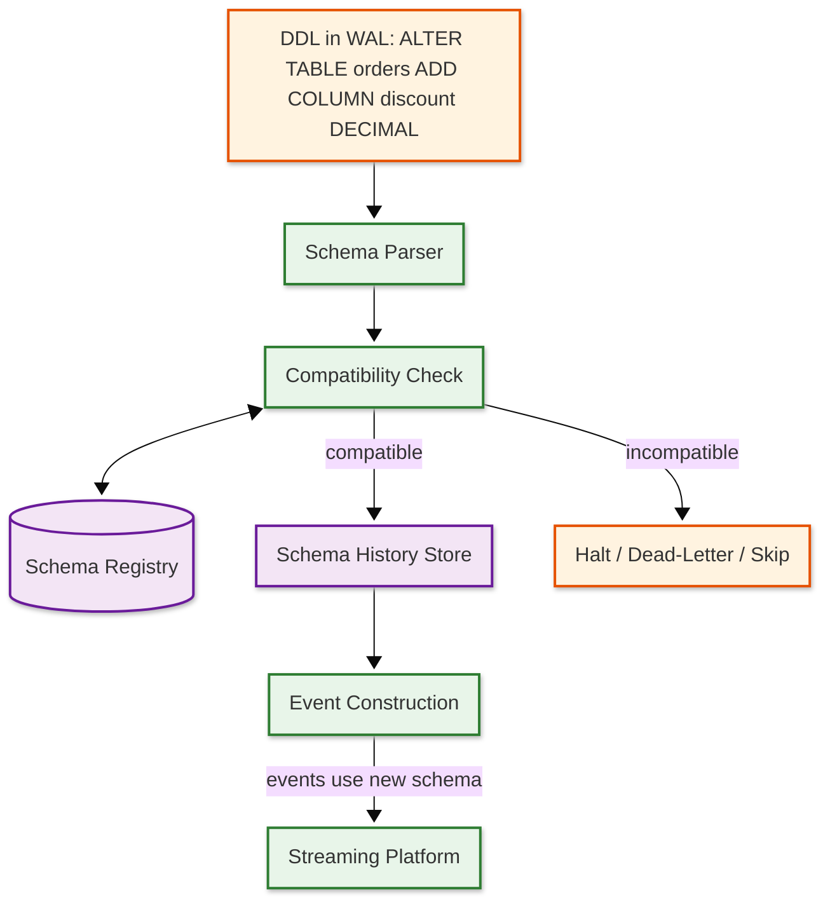
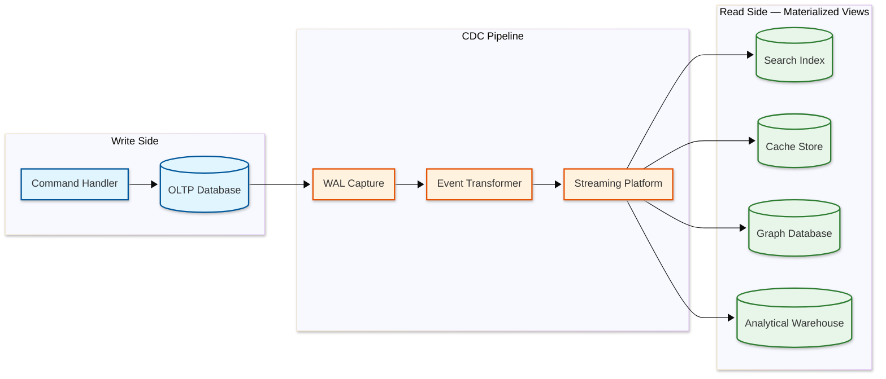

# Deep Dive & Bottlenecks — Change Data Capture (CDC) System

## Critical Component 1: WAL Retention and Disk Pressure

### Why Is This Critical?

The CDC connector reads from the source database's transaction log (WAL in PostgreSQL, binlog in MySQL). The database retains log segments as long as there is an active consumer (replication slot) that hasn't confirmed processing. If the CDC connector falls behind — due to downstream outages, slow consumers, or connector failures — the database must retain all unprocessed log segments, and WAL files accumulate indefinitely. On PostgreSQL, a stalled replication slot can fill the disk in hours on a write-heavy system, leading to database outage when the disk is full and no more transactions can be committed.

### How It Works Internally

**PostgreSQL WAL Retention:**

```
Normal Operation:
  WAL Segment 001 → confirmed by CDC → eligible for recycling ✓
  WAL Segment 002 → confirmed by CDC → eligible for recycling ✓
  WAL Segment 003 → being read by CDC → retained
  WAL Segment 004 → not yet read → retained

Stalled Connector (offline for 6 hours):
  WAL Segment 001 → NOT confirmed → RETAINED (cannot recycle)
  WAL Segment 002 → NOT confirmed → RETAINED
  ...
  WAL Segment 500 → NOT confirmed → RETAINED
  WAL Segment 501 → current → being written
  → 500 segments × 16 MB = 8 GB accumulated and growing
```

**MySQL Binlog Retention:**

MySQL binlog retention is controlled by `binlog_expire_logs_seconds` (or `expire_logs_days`). Unlike PostgreSQL's replication slot model, MySQL does not automatically retain binlogs for a specific consumer. If binlogs expire before the CDC connector processes them, events are permanently lost.

### Failure Modes

1. **PostgreSQL disk exhaustion** — A stalled replication slot prevents WAL recycling; disk fills up; database stops accepting writes.
   - **Mitigation:** Configure `max_slot_wal_keep_size` to cap WAL retention per slot. Monitor replication slot lag and alert at thresholds. Implement automatic slot drop after configurable retention limit (with data loss acknowledgment). Use heartbeat events to advance the slot even when tables have no writes.

2. **MySQL binlog gap** — Binlogs expire before CDC processes them; connector loses its position and cannot resume streaming.
   - **Mitigation:** Set binlog retention longer than maximum expected downtime. Monitor binlog reader position relative to the oldest available binlog. If gap is detected, trigger automatic re-snapshot of affected tables.

3. **Heartbeat starvation** — Tables with infrequent writes cause the replication slot to appear stalled even though the connector is healthy, because no new WAL entries reference that slot.
   - **Mitigation:** CDC connectors emit periodic heartbeat events by writing a timestamp to a dedicated heartbeat table, generating WAL entries that advance the slot position.

### Monitoring Points

| Metric | Alert Threshold | Action |
|--------|----------------|--------|
| `pg_replication_slots.wal_status` | "reserved" → "extended" → "lost" | Investigate connector lag; consider slot drop |
| Replication slot lag (bytes) | > 1 GB | Warn; investigate downstream Slowest part of the process |
| Replication slot lag (bytes) | > 10 GB | Critical; consider emergency slot drop |
| WAL disk usage (%) | > 80% | Critical; immediate investigation |
| Binlog reader position age | > 12 hours | Warn; verify connector health |

---

## Critical Component 2: Snapshot-to-Streaming Handoff

### Why Is This Critical?

The snapshot-to-streaming handoff is the most dangerous moment in a CDC connector's lifecycle. During initial snapshot, the connector reads the full table state via SELECT queries. Simultaneously, the source database continues accepting writes. When the snapshot completes, the connector must transition to streaming from the transaction log at the exact position where the snapshot began — without duplicating events for changes that occurred during the snapshot and without missing events that happened between the snapshot start and the streaming start.

### How It Works Internally

**The Handoff Problem:**

```
Timeline:
  T1: Snapshot begins, records LSN = 1000
  T2: Application writes Order #42 (LSN 1005) → included in snapshot SELECT
  T3: Application updates Order #42 (LSN 1010) → NOT in snapshot (already past that row)
  T4: Snapshot completes
  T5: Streaming begins from LSN 1000
  T6: Streaming processes LSN 1005 (Order #42 INSERT) → DUPLICATE with snapshot
  T7: Streaming processes LSN 1010 (Order #42 UPDATE) → NOT duplicate, must emit
```

**Resolution approach:**

```
Classic Snapshot (Lock-Based):
  1. Acquire global read lock (brief)
  2. Record current LSN
  3. Start REPEATABLE READ transaction
  4. Release global lock
  5. Read all tables within the transaction (consistent snapshot at recorded LSN)
  6. Commit transaction
  7. Start streaming from recorded LSN
  8. For events between recorded LSN and snapshot completion:
     - If event's row was included in snapshot → skip (snapshot has the later state)
     - If event's row was NOT in snapshot → emit

Watermark Snapshot (Lock-Free, DBLog approach):
  1. No global lock required
  2. Process tables in chunks, interleaving with streaming
  3. For each chunk: write LOW watermark → SELECT chunk → write HIGH watermark
  4. Buffer log events between LOW and HIGH watermarks
  5. Emit snapshot rows, replacing any that appear in the buffer
  6. Emit remaining buffered log events (they are more recent)
```

### Failure Modes

1. **Long-running snapshot transaction** — On very large tables (billions of rows), the snapshot transaction may run for hours, holding a MVCC snapshot that prevents vacuum from cleaning up dead tuples.
   - **Mitigation:** Use chunked snapshots with periodic transaction restarts. Accept slightly weaker consistency (use the watermark approach instead of a single transaction). Monitor `pg_stat_activity` for long-running snapshot transactions.

2. **Duplicate events at handoff** — If deduplication logic has a bug, downstream consumers receive both the snapshot event and the streaming event for the same row.
   - **Mitigation:** Consumer-side idempotency using primary key + operation timestamp. Snapshot events carry `op: "r"` which consumers can use to implement last-writer-wins logic.

3. **Gap at handoff** — If the recorded LSN is after the actual snapshot point (race condition), some changes are missed.
   - **Mitigation:** Record LSN inside the snapshot transaction before reading any data. Use the database's built-in `txid_snapshot` (PostgreSQL) or `SHOW MASTER STATUS` (MySQL) within the transaction context.

---

## Critical Component 3: Schema Evolution During Streaming

### Why Is This Critical?

Source databases undergo schema changes (ALTER TABLE) as applications evolve. The CDC system must handle DDL changes gracefully because: (1) the change event format changes mid-stream (new columns appear, columns are dropped, types change), (2) downstream consumers may not be ready for the new schema, (3) serialization frameworks (Avro, Protobuf) have strict compatibility rules, and (4) the schema change appears in the transaction log interleaved with data changes, requiring precise detection and handling.

### How It Works Internally

**Schema Change Processing Pipeline:**



**Compatibility levels enforced by schema registry:**

| Level | Rule | CDC Impact |
|-------|------|-----------|
| **BACKWARD** | New schema can read old data | Safe for adding optional columns with defaults |
| **FORWARD** | Old schema can read new data | Safe for removing optional columns |
| **FULL** | Both backward and forward | Safest; only allows compatible changes in both directions |
| **NONE** | No compatibility check | Dangerous; any change allowed |

### Failure Modes

1. **Breaking schema change** — A column type change (e.g., INT → VARCHAR) may be incompatible with the registered schema, causing serialization failures.
   - **Mitigation:** Schema registry rejects incompatible schemas. Connector pauses and alerts. Resolution: register a new subject version with a migration strategy, or use schema compatibility overrides with careful consumer coordination.

2. **Schema-data mismatch window** — Between the DDL execution and the schema cache update, events may be serialized with the wrong schema.
   - **Mitigation:** Schema history is keyed by LSN position. For any event, the connector looks up the schema that was active at that event's LSN, not the current schema. This ensures events always match their contemporary schema.

3. **Consumer deserialization failure** — A consumer running old code encounters events with new fields it doesn't understand.
   - **Mitigation:** Use BACKWARD compatibility (new reader can read old data) or FULL compatibility. Consumers using Avro/Protobuf automatically ignore unknown fields. JSON consumers require explicit handling.

---

## Critical Component 4: Large Transaction Handling

### Why Is This Critical?

Some database operations produce transactions that modify millions of rows — batch updates, bulk imports, partition maintenance. These "mega-transactions" create challenges at every layer: the WAL reader must buffer all events until the transaction commits (to avoid emitting events for transactions that roll back), the event pipeline must handle enormous batches, and downstream consumers face a flood of events.

### How It Works Internally

A large transaction (e.g., `UPDATE orders SET status = 'archived' WHERE created_at < '2025-01-01'`) modifying 10 million rows produces 10 million WAL entries, all sharing the same transaction ID. The CDC engine must:

1. **Detect transaction boundaries** — WAL entries include BEGIN and COMMIT markers
2. **Buffer or stream** — Either buffer all events until COMMIT (safe but memory-intensive) or stream events speculatively and mark them "uncommitted" (lower latency but complex)
3. **Handle rollback** — If the transaction rolls back, all buffered events must be discarded

**Strategies:**

| Strategy | Memory Cost | Latency | Complexity |
|----------|-----------|---------|-----------|
| **Full buffering** | O(transaction_size) | High (wait for COMMIT) | Low |
| **Disk spill** | O(1) memory, O(N) disk | High (wait for COMMIT) | Medium |
| **Streaming with commit markers** | O(1) | Low (stream immediately) | High (consumers must handle uncommitted events) |

### Failure Modes

1. **Out-of-memory on large transaction** — Buffering 10 million events in memory crashes the connector.
   - **Mitigation:** Configure `max.batch.size` and spill to disk for transactions exceeding the threshold. Use streaming mode with transaction markers for very large transactions.

2. **Consumer timeout during mega-transaction delivery** — The burst of millions of events overwhelms downstream consumers.
   - **Mitigation:** Rate-limit delivery; use consumer backpressure mechanisms. Consumers batch-process large transactions using the transaction boundary markers.

---

## Concurrency & Race Conditions

### Race Condition 1: Connector Restart During Offset Commit

**Scenario:** The connector has published events to the streaming platform but crashes before persisting the updated offset. On restart, it re-reads from the last committed offset and re-publishes those events.

**Resolution:** Use transactional offset commits — events and offset update are written in a single atomic transaction to the streaming platform. If the transaction didn't complete, neither the events nor the offset are visible, and the connector safely re-reads and re-publishes.

### Race Condition 2: Concurrent Snapshot and DDL

**Scenario:** While a snapshot is reading table X, an ALTER TABLE X ADD COLUMN runs. Some snapshot rows have the old schema, others have the new schema.

**Resolution:** The snapshot runs within a REPEATABLE READ transaction, which sees a consistent point-in-time view regardless of concurrent DDL. The schema change is captured in the streaming phase after the snapshot completes.

### Race Condition 3: Rebalancing During Event Processing

**Scenario:** In a distributed connector cluster, a worker failure triggers rebalancing. Tasks are reassigned to surviving workers. The failing worker may have published events but not committed offsets.

**Resolution:** The streaming platform's consumer group protocol handles this. During rebalancing, the new task owner reads from the last committed offset. Duplicate events may be published (at-least-once), but idempotent producers and consumer-side deduplication ensure exactly-once semantics.

---

## Critical Component 5: Connector Rebalancing Protocol

### Why Is This Critical?

In a distributed CDC platform with N worker nodes and M connectors, each connector is decomposed into tasks. When a worker joins, leaves, or crashes, tasks must be redistributed across surviving workers. This rebalancing protocol is one of the most operationally disruptive events in CDC — during rebalancing, all tasks on all workers are briefly paused, and if the protocol is not carefully implemented, it can cause minutes-long capture gaps.

### How It Works Internally

**The Rebalancing Lifecycle:**

```
                    Worker-1 crashes
                          │
                          ▼
           ┌──────────────────────────┐
           │ Controller detects miss- │
           │ ing heartbeat (10s)      │
           └──────────┬───────────────┘
                      │
                      ▼
           ┌──────────────────────────┐
           │ STOP: All workers pause  │
           │ their current tasks and  │
           │ flush pending events     │
           └──────────┬───────────────┘
                      │
                      ▼
           ┌──────────────────────────┐
           │ ASSIGN: Controller       │
           │ recomputes task-to-      │
           │ worker mapping           │
           └──────────┬───────────────┘
                      │
                      ▼
           ┌──────────────────────────┐
           │ START: Each worker       │
           │ receives its new task    │
           │ set and resumes from     │
           │ last committed offset    │
           └──────────────────────────┘
```

**Assignment Strategies:**

| Strategy | Behavior | Trade-off |
|----------|----------|-----------|
| **Eager (stop-the-world)** | All tasks revoked and reassigned | Simple but causes cluster-wide pause (seconds to minutes) |
| **Incremental cooperative** | Only affected tasks are reassigned; others continue | Minimal disruption but more complex protocol (2-round rebalancing) |
| **Sticky assignment** | Tasks prefer their previous worker on reassignment | Reduces connector restart cost (reuse cached schemas, warm connections) |

**Incremental Cooperative Rebalancing Protocol:**

```
FUNCTION cooperative_rebalance(workers, tasks, previous_assignment):
    // Round 1: Identify tasks to revoke
    desired = compute_balanced_assignment(workers, tasks)
    revocations = {}

    FOR EACH worker IN workers:
        current_tasks = previous_assignment[worker]
        desired_tasks = desired[worker]
        revoked = current_tasks - desired_tasks
        IF revoked is not empty:
            revocations[worker] = revoked

    // Only revoke tasks that need to move
    FOR EACH (worker, tasks_to_revoke) IN revocations:
        send_revoke(worker, tasks_to_revoke)
        // Worker stops only these tasks, keeps others running

    // Round 2: Assign revoked tasks to new owners
    WAIT for revocation acknowledgments
    unassigned_tasks = collect_revoked_tasks()
    final_assignment = assign_unassigned(workers, unassigned_tasks, desired)
    broadcast_assignment(final_assignment)

// Total disruption: only moved tasks experience downtime
// Non-moved tasks: zero downtime
```

### Failure Modes

1. **Rebalancing storm** — A flaky worker repeatedly joining and leaving triggers continuous rebalancing, preventing any task from making progress.
   - **Mitigation:** Configure `session.timeout.ms` high enough to tolerate transient network blips. Implement rebalancing backoff — delay reassignment for 30 seconds after the last rebalance to prevent cascading.

2. **Split-brain during rebalancing** — Two workers believe they own the same task and both read from the same replication slot.
   - **Mitigation:** Fencing via epoch numbers. Each task assignment carries a monotonically increasing epoch. The replication slot connection includes the epoch; only the latest epoch is accepted. The streaming platform producer also uses fencing — only the latest epoch's producer can write to the task's partition range.

3. **State loss after reassignment** — Task moves to a new worker that has no cached schemas, compiled filters, or warm database connections.
   - **Mitigation:** Persist task state (schema cache, filter compilation) to durable storage. New worker loads state on assignment. Design connectors to warm up quickly — schema lookups are cached after first event.

---

## Critical Component 6: Multi-Source Consistency and Ordering

### Why Is This Critical?

When CDC captures from multiple databases (e.g., an orders service DB and an inventory service DB), downstream consumers that need cross-service consistency face a fundamental challenge: there is no global clock across independent databases. An order created at T1 in the orders DB and an inventory decrement at T2 in the inventory DB may arrive at consumers in any order, because each CDC connector operates independently.

### How It Works Internally

```
Orders DB (connector A):     Inventory DB (connector B):
  T1: INSERT order #100        T2: UPDATE inventory (qty -= 1)
  LSN: 5000                    LSN: 3000

  Connector A lag: 200ms       Connector B lag: 800ms

Consumer sees:
  Event from A (T1) arrives at T1 + 200ms
  Event from B (T2) arrives at T2 + 800ms

If T2 - T1 < 600ms:
  Consumer sees B before A → inventory decremented before order exists
```

**Cross-Source Ordering Strategies:**

| Strategy | How It Works | Trade-off |
|----------|-------------|-----------|
| **Accept disorder** | Consumers tolerate out-of-order cross-source events | Simplest; works for independent sinks |
| **Event-time windowing** | Buffer events in a time window (e.g., 5s); sort by source commit timestamp before processing | Adds latency; handles moderate skew |
| **Causal ordering via correlation IDs** | Application embeds correlation IDs; consumer groups and orders correlated events | Requires application changes; handles complex flows |
| **Distributed timestamp authority** | Use a shared timestamp oracle (like Google Spanner's TrueTime) across databases | Highest consistency; impractical for most deployments |

### Failure Modes

1. **Phantom dependency** — Consumer enforces ordering between unrelated events because they share a timestamp range.
   - **Mitigation:** Only enforce ordering for events with explicit causal relationships (same entity, same transaction correlation ID). Independent events should be processable in any order.

2. **Clock skew across sources** — Source database clocks differ by seconds, making timestamp-based ordering unreliable.
   - **Mitigation:** Use NTP-synchronized clocks with bounded skew guarantees. Treat source timestamps as advisory, not authoritative, for cross-source ordering. Use consumer-side event-time watermarks with configurable allowed lateness.

---

## Critical Component 7: Real-World Case Studies

### Case Study 1: LinkedIn Databus (Pioneer of Log-Based CDC)

LinkedIn built Databus in 2012 as one of the first log-based CDC systems at scale, capturing changes from Oracle and MySQL databases to feed search indexing, social graph updates, and recommendation engines.

**Key Design Decisions:**
- **Relay-based architecture:** Changes flow from source → Databus Relay (in-memory circular buffer) → Databus Client (consumer). The relay decouples source capture rate from consumer processing rate.
- **Bootstrap service:** For initial snapshots, a separate Bootstrap service reads full table state and serves it alongside the relay stream, handling the snapshot-to-streaming handoff.
- **SCN-based ordering:** Used Oracle System Change Number (SCN) as the global ordering mechanism, equivalent to PostgreSQL LSN.

**Lessons Learned:**
- The relay's circular buffer with finite capacity means slow consumers can "fall off" the buffer and must bootstrap from scratch — a design tension between memory efficiency and consumer resilience.
- Oracle's proprietary change capture mechanisms required deep vendor-specific integration, motivating the industry's shift toward open protocols (PostgreSQL logical decoding, MySQL binlog).

### Case Study 2: Netflix DBLog (Watermark-Based Snapshots)

Netflix developed DBLog to solve the long-running snapshot transaction problem that caused vacuum delays and table bloat on PostgreSQL.

**The Innovation:**
Instead of a single REPEATABLE READ transaction for the entire snapshot, DBLog processes tables in chunks. Between chunks, it writes watermark tokens to a signal table. These watermarks appear in the WAL stream, creating precise boundaries:

```
WAL Stream:  ... event1 | LOW_WM(chunk3) | event2 | event3 | HIGH_WM(chunk3) | event4 ...
                         ↑                                   ↑
                    Start of chunk 3                    End of chunk 3

Snapshot Data: rows from SELECT for chunk 3

Resolution:
  - event1: emit normally (before chunk boundary)
  - event2, event3: buffer (between watermarks)
  - Snapshot rows for chunk 3: emit, but if row also in buffer → use buffer version (more recent)
  - event4: emit normally (after chunk boundary)
```

**Lessons Learned:**
- Watermark approach enables on-demand re-snapshots of individual tables without stopping the streaming pipeline — critical for schema migration recovery.
- The tradeoff is complexity: the deduplication logic between snapshot rows and buffered WAL events must handle edge cases (deletes during snapshot, updates to the same row multiple times between watermarks).

### Case Study 3: Shopify at Scale (1M+ Events/sec)

Shopify runs one of the largest CDC deployments, capturing changes from thousands of MySQL shards to power search indexing, analytics, and cross-shard consistency.

**Architecture Highlights:**
- **Shard-aware connectors:** Each MySQL shard has its own CDC connector; a shard router maps events to the correct downstream consumer partition.
- **Ghost table detection:** Online schema migration tools (like GitHub's gh-ost) create shadow tables during ALTER operations. The CDC connector must detect and filter ghost table events to avoid polluting the event stream with migration artifacts.
- **Binlog position federation:** A centralized service tracks binlog positions across all shards, enabling cross-shard consistency queries ("show me the state as of binlog position X on shard Y").

**Lessons Learned:**
- At thousands of shards, connector management itself becomes a distributed systems problem — auto-provisioning, health checking, and self-healing of connectors require their own infrastructure.
- Online schema migration tools fundamentally conflict with CDC because they rename tables, creating periods where the CDC connector may capture events from the wrong table name.

---

## Critical Component 8: Edge Cases

### Edge Case (Unusual or extreme situation) 1: TOAST Columns in PostgreSQL

PostgreSQL stores large column values (> 2 KB) in a separate TOAST table. The WAL logical decoding output may not include unchanged TOAST column values in UPDATE events — the log only records what changed, and the TOASTed column was not modified.

**Impact:** An UPDATE to a row with a large JSON column that only changes the `status` field will emit an event where the JSON column is missing (not NULL, but absent), unless the connector is configured to fetch the full row on each update.

**Mitigation:** Configure `REPLICA IDENTITY FULL` on tables with TOAST columns that consumers need, or use the connector's `column.propagate.source.type` to detect TOASTed columns and issue supplementary SELECT queries.

### Edge Case (Unusual or extreme situation) 2: Sequence Gaps in Transaction IDs

Databases may skip transaction IDs for various reasons (prepared transactions that never committed, internal system transactions, crash recovery). CDC consumers that assume sequential transaction IDs will incorrectly detect "missing" transactions.

**Mitigation:** Use LSN/binlog position for ordering, not transaction IDs. Transaction IDs are useful for grouping events within a transaction but not for detecting gaps.

### Edge Case (Unusual or extreme situation) 3: Time Zone Handling Across Regions

Source databases in different regions may store timestamps in different time zones (UTC, local time, or `TIMESTAMP WITH TIME ZONE`). The CDC event's `ts_ms` field is the source commit timestamp, but its interpretation depends on the database's `timezone` setting.

**Mitigation:** Normalize all timestamps to UTC in the event envelope. The connector must read the source database's time zone configuration and convert accordingly. Document which timestamp fields are UTC and which are source-local.

### Edge Case (Unusual or extreme situation) 4: Online Schema Migration Tools (gh-ost, pt-osc)

Tools like GitHub's gh-ost perform online ALTER TABLE by creating a shadow table, copying data, and then atomically renaming. During the migration:

1. Writes go to the original table (captured by CDC)
2. gh-ost copies rows to the shadow table (also captured by CDC as INSERTs to a "_gho" table)
3. gh-ost replays binlog changes to the shadow table (more shadow table INSERTs)
4. Atomic rename: original → _del, shadow → original

**Impact:** CDC captures events for both the original and shadow tables, producing duplicate data. After the rename, the topic name changes because the table name changed.

**Mitigation:** Configure the connector to filter tables matching ghost patterns (`_gho$`, `_ghc$`, `_del$`). After migration completes, the connector's schema history automatically picks up the new table structure. Some CDC platforms support "signal tables" that pause capture during migration windows.

---

## Slowest part of the process Analysis

### Slowest part of the process 1: Source Database Replication Slot Throughput

**Problem:** The logical decoding output plugin on the source database has a CPU cost per WAL entry decoded. Under heavy write load, the decoding can't keep up with the WAL generation rate, causing the replication slot to fall behind.

**Impact:** Growing replication lag; WAL retention increases; potential disk exhaustion.

**Mitigation:**
- Use parallel decoding where supported (PostgreSQL 15+ supports parallel apply on the subscriber side; source-side parallelism is limited)
- Filter tables at the publication level to reduce decoding work
- Use more efficient output plugins (pgoutput vs. wal2json)
- Consider dedicated read replicas for CDC to isolate CPU impact from the primary

### Slowest part of the process 2: Streaming Platform Ingestion Rate

**Problem:** During burst periods (flash sales, batch jobs), the event production rate may exceed the streaming platform's ingestion capacity.

**Impact:** Producer backpressure causes the CDC connector to slow down, increasing replication lag.

**Mitigation:**
- Pre-provision streaming platform capacity for peak load
- Use producer batching and compression (lz4/zstd) to reduce network and broker load
- Increase partition count for high-throughput topics
- Auto-scale streaming platform brokers based on ingestion rate metrics

### Slowest part of the process 3: Schema Registry as Synchronous Dependency

**Problem:** Every event serialization requires a schema lookup from the registry. If the registry is slow or unavailable, the entire pipeline stalls.

**Impact:** Increased end-to-end latency; potential pipeline halt if registry is down.

**Mitigation:**
- Client-side schema cache with TTL (schemas rarely change)
- Schema registry deployed as HA cluster (3+ nodes)
- Circuit breaker on registry calls with cached fallback
- Batch schema lookups for events in the same table (same schema)

### Slowest part of the process 4: Network Bandwidth Between Connector Workers and Streaming Platform

**Problem:** At 500K events/sec with 1 KB average event size, the connector cluster generates 500 MB/sec of raw event data. With 3x replication, the streaming platform must absorb 1.5 GB/sec of writes. Network bandwidth between connector workers and brokers becomes the throughput ceiling.

**Impact:** Producer backpressure, increased end-to-end latency, and potential event loss if buffers overflow.

**Mitigation:**
- Enable producer-side compression (LZ4 for speed, ZSTD for ratio) — typically achieves 3-5x compression on structured events
- Co-locate connector workers and streaming platform brokers in the same availability zone to minimize network latency
- Use multiple producer connections per worker to parallelize writes across brokers
- Monitor network throughput per worker and rebalance connectors to distribute load

### Slowest part of the process 5: Offset Commit Contention Under High Throughput

**Problem:** When multiple connector tasks on the same worker commit offsets simultaneously, they contend for the transactional producer's single write path to the offset topic. This serialization point limits the aggregate commit throughput per worker.

**Impact:** Offset commit latency increases, expanding the at-least-once window (more duplicate events on crash recovery).

**Mitigation:**
- Batch offset commits: each task accumulates events and commits offset at configurable intervals (e.g., every 1,000 events or 1 second)
- Use per-task producer instances instead of shared-per-worker producers when commit contention is measured
- Monitor `cdc.offset.commit_latency_ms` — if p99 exceeds 500ms, investigate contention

### Slowest part of the process 6: Consumer-Side Processing Speed

**Problem:** While CDC can capture events at 100K+/sec, downstream consumers (search indexers, cache updaters, warehouse loaders) may process at only 10K-50K/sec. The gap causes unbounded consumer lag growth.

**Impact:** Stale downstream systems; growing lag threatens streaming platform storage capacity.

**Mitigation:**
- Scale consumer instances within the consumer group (up to partition count)
- Use micro-batching at the consumer (batch 100 events into a single bulk index request)
- Separate slow consumers (warehouse loaders) from fast consumers (cache invalidation) into independent consumer groups
- Implement consumer-side compaction: for the same key, only process the latest event (skip intermediate updates)

---

## Deep Dive 9: CDC for Multi-Tenant Databases

### The Problem

Multi-tenant databases (shared schema with `tenant_id` column or schema-per-tenant) present unique CDC challenges: events from all tenants flow through the same WAL, but downstream consumers need tenant-isolated data streams.

### Architecture Options

| Approach | Mechanism | Pros | Cons |
|----------|-----------|------|------|
| Single connector, topic-level routing | Route events to `cdc.{tenant}.{table}` topics using SMT | Simple connector config; tenant isolation at topic level | Thousands of topics for large tenant counts; topic management overhead |
| Single connector, header-based routing | Add `tenant_id` header; consumers filter | Few topics; simple connector | Consumers receive all tenants' data; no hard isolation |
| Per-tenant connector | One connector per tenant schema | Complete isolation; independent lifecycle | Connector explosion; resource waste for low-volume tenants |
| Single topic with partitioning by tenant | `tenant_id` as partition key | Tenant ordering guaranteed; moderate topic count | Uneven partition sizes if tenants have different volumes |

### Tenant-Aware Event Routing

```
FUNCTION route_multi_tenant_event(event):
    tenant_id = extract_tenant_id(event)

    // Tier-based routing: high-volume tenants get dedicated topics
    IF tenant_id IN high_volume_tenants:
        topic = "cdc.dedicated.{tenant_id}.{table}"
    ELSE:
        // Shared topic with tenant_id partition key
        shard = hash(tenant_id) MOD num_shared_partitions
        topic = "cdc.shared.{table}"
        partition = shard

    // Apply tenant-specific transformations
    IF tenant_config[tenant_id].mask_pii:
        event = apply_pii_masking(event, tenant_config[tenant_id].pii_fields)

    IF tenant_config[tenant_id].filter_columns:
        event = filter_columns(event, tenant_config[tenant_id].allowed_columns)

    PUBLISH(event, topic, partition_key=tenant_id)
```

### Noisy Neighbor Mitigation

| Scenario | Detection | Mitigation |
|----------|-----------|------------|
| Single tenant generates 90% of events | Per-tenant event rate monitoring | Dedicated topic + connector task for large tenant |
| Tenant bulk import floods pipeline | Burst detection (10x baseline in 1 min) | Rate limiting per tenant at connector level |
| Tenant schema migration triggers DDL storm | DDL frequency monitoring | Tenant-level schema change approval workflow |

---

## Deep Dive 10: CDC-Powered CQRS Materialized Views

### The Connection

CDC is a natural complement to CQRS (Command Query Responsibility Segregation): commands modify the source database, and CDC streams those modifications to read-optimized materialized views. Unlike explicit event sourcing, CDC-based CQRS derives events from the existing write path — no application changes needed.

### Materialized View Pipeline



### Consistency Verification

```
FUNCTION verify_materialized_view_consistency(source_db, view_store, table, sample_size):
    // Periodic consistency check between source and materialized view
    sample_keys = source_db.query(
        "SELECT pk FROM {table} ORDER BY RANDOM() LIMIT {sample_size}"
    )

    mismatches = []
    FOR EACH key IN sample_keys:
        source_row = source_db.query("SELECT * FROM {table} WHERE pk = {key}")
        view_row = view_store.get(key)

        IF NOT rows_match(source_row, view_row, tolerance=lag_budget):
            last_cdc_event_ts = get_last_event_timestamp(table, key)
            IF (now() - last_cdc_event_ts) > staleness_budget:
                mismatches.append({key, source_row, view_row, last_cdc_event_ts})

    IF len(mismatches) / sample_size > 0.05:  // > 5% mismatch rate
        trigger_incremental_snapshot(table)

    RETURN {total: sample_size, mismatches: len(mismatches)}
```

### View Staleness Budget

| View Type | Staleness Budget | Rehydration Strategy |
|-----------|------------------|---------------------|
| Search index | 1-5 seconds | Full re-index from snapshot |
| Cache layer | < 1 second | TTL + CDC invalidation |
| Graph database | 5-30 seconds | Re-snapshot + relationship rebuild |
| Analytical warehouse | Minutes to hours | Micro-batch CDC + periodic full refresh |

---

## Deep Dive 11: Back-Pressure and Flow Control

### The Problem

CDC pipelines have no natural back-pressure mechanism: the source database produces WAL entries at whatever rate applications write, regardless of downstream capacity. Unlike request-response systems, CDC back-pressure is invisible until lag becomes catastrophic.

### Multi-Signal Back-Pressure Detection

```
FUNCTION manage_back_pressure(connector, metrics):
    signals = {
        memory_pressure: connector.buffer_usage_pct > 80,
        producer_blocked: metrics.producer_send_latency_p99 > 5000,  // ms
        lag_growing: metrics.lag_trend_5min == "increasing",
        consumer_stalled: any(cg.lag > 1_000_000 for cg in consumer_groups),
        wal_growing: metrics.wal_disk_pct > 70
    }

    pressure_score = sum(1 for s in signals.values() if s)

    IF pressure_score == 0:
        connector.set_read_rate(UNLIMITED)

    ELIF pressure_score <= 2:
        // Moderate: reduce batch size, increase commit frequency
        connector.set_batch_size(current_batch_size * 0.5)
        connector.set_commit_interval(current_interval * 0.5)
        alert("CDC back-pressure: moderate", signals)

    ELIF pressure_score <= 4:
        // High: throttle WAL read rate, pause non-critical consumers
        connector.set_read_rate(current_rate * 0.25)
        FOR EACH cg IN consumer_groups:
            IF cg.priority == "low":
                cg.pause()
        alert("CDC back-pressure: high", signals)

    ELSE:
        // Critical: pause capture entirely
        connector.pause_capture()
        alert("CDC back-pressure: CRITICAL — capture paused", signals)
        WHILE pressure_score > 2:
            sleep(10_seconds)
            recalculate(pressure_score)
        connector.resume_capture()
```

### Producer Configuration Impact

| Configuration | Throughput | Latency | Best For |
|--------------|-----------|---------|----------|
| No batching, no compression | 10K events/sec | < 5 ms | Low-latency, low-volume |
| Batch 1000/100ms, LZ4 | 80K events/sec | 100 ms | General production |
| Batch 5000/500ms, ZSTD | 150K events/sec | 500 ms | High-throughput |
| Batch 10000/1s, ZSTD L3 | 200K+ events/sec | 1 sec | Bulk migration |

### Consumer Lag Recovery

| Strategy | When to Use | Risk |
|----------|------------|------|
| Scale consumers | Lag < topic retention | Rebalancing stall |
| Skip-ahead | Non-critical, hours behind | Data gap until re-snapshot |
| Parallel replay | Critical, minutes behind | Brief duplicate processing |
| Re-snapshot | Lag exceeds retention | Extended staleness during rebuild |

---

## Deep Dive 12: CDC in Database Migration Scenarios

### The Problem

CDC enables zero-downtime database migrations: replicating data from old database to new while both serve traffic. The connector acts as a real-time replication bridge, potentially across different database engines.

### Migration Phases

| Phase | Traffic | CDC Role |
|-------|---------|----------|
| **1. Initial snapshot** | 100% old DB | Snapshot all tables to new DB |
| **2. Catch-up streaming** | 100% old DB | Stream changes accumulated during snapshot |
| **3. Dual-read verification** | Read: both, Write: old | CDC keeps new DB in sync; verify consistency |
| **4. Cutover** | Pause writes → switch | Stop CDC, verify final consistency, switch |
| **5. Reverse CDC** | 100% new DB | Reverse CDC for rollback capability |

### Cross-Engine Schema Translation

```
FUNCTION translate_event_cross_engine(event, source_engine, target_engine):
    translated = event.copy()

    FOR EACH field IN event.after:
        source_type = event.schema.field_type(field)
        target_type = TYPE_MAP[source_engine][target_engine][source_type]

        IF target_type != source_type:
            translated.after[field] = convert_value(
                event.after[field], source_type, target_type
            )

    // Handle engine-specific features
    IF source_engine == "PostgreSQL" AND target_engine == "MySQL":
        // PostgreSQL arrays → JSON arrays in MySQL
        IF is_array_type(source_type):
            translated.after[field] = to_json_array(event.after[field])
        // PostgreSQL JSONB → MySQL JSON
        IF source_type == "JSONB":
            translated.after[field] = normalize_json(event.after[field])

    RETURN translated
```

### Migration Verification

```
FUNCTION verify_migration_consistency(old_db, new_db, tables):
    results = {}
    FOR EACH table IN tables:
        old_count = old_db.query("SELECT COUNT(*) FROM {table}")
        new_count = new_db.query("SELECT COUNT(*) FROM {table}")
        count_match = abs(old_count - new_count) <= expected_cdc_lag_rows

        // Sample-based checksum for large tables
        IF old_count > 1_000_000:
            sample = old_db.query("SELECT pk FROM {table} TABLESAMPLE BERNOULLI(0.1)")
        ELSE:
            sample = old_db.query("SELECT pk FROM {table}")

        mismatches = 0
        FOR EACH key IN sample:
            old_hash = hash(old_db.query("SELECT * FROM {table} WHERE pk = {key}"))
            new_hash = hash(new_db.query("SELECT * FROM {table} WHERE pk = {key}"))
            IF old_hash != new_hash:
                mismatches += 1

        results[table] = {
            count_match, sample_size: len(sample),
            mismatch_rate: mismatches / len(sample)
        }

    // Cutover: proceed only if all tables < 0.01% mismatch
    RETURN results
```
