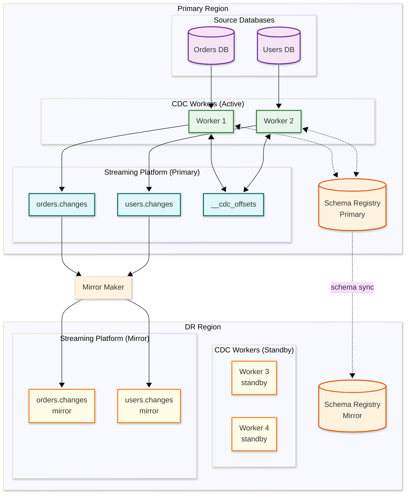

# Scalability & Reliability — Change Data Capture (CDC) System

## Scalability

### Horizontal vs. Vertical Scaling

| Aspect | Vertical Scaling | Horizontal Scaling |
|--------|-----------------|-------------------|
| Approach | Larger connector workers (more CPU, RAM) | More connector workers with task distribution |
| Throughput ceiling | ~200K events/sec per connector (single-threaded log reader) | Millions of events/sec across distributed workers |
| Operational complexity | Simple (single process per source) | Complex (task rebalancing, offset coordination) |
| Cost efficiency | Efficient up to single-source limits | Required for multi-source CDC platforms |
| When to use | Single database with moderate write rate | Multi-database CDC platform, high-throughput sources |

**Strategy:** Each source database has one logical connector (log reader), but the connector platform itself scales horizontally by distributing multiple connectors across worker nodes. Within a single connector, parallelism is achieved at the snapshot phase (parallel table reads) and the sink phase (parallel partition writers).

### Connector Distribution Architecture

```
┌──────────────────────────────────────────────────────────────┐
│ CDC Platform Controller                                       │
│ - Manages connector lifecycle                                 │
│ - Distributes tasks across workers                            │
│ - Handles rebalancing on worker failure                       │
└───────────────┬──────────────┬──────────────┬────────────────┘
                │              │              │
    ┌───────────▼──┐  ┌───────▼──────┐  ┌───▼───────────┐
    │ Worker Node 1 │  │ Worker Node 2 │  │ Worker Node 3 │
    │               │  │               │  │               │
    │ Task: pg-orders│  │ Task: pg-users│  │ Task: mysql-inv│
    │ Task: pg-items │  │ Task: pg-auth │  │ Task: mysql-pay│
    │               │  │               │  │ Task: mongo-cat │
    └──────────────┘  └──────────────┘  └───────────────┘
```

### Scaling the Streaming Platform

| Dimension | Scaling Approach | Trigger |
|-----------|-----------------|---------|
| Partitions per topic | Increase partitions for high-throughput tables | Single partition throughput > 50 MB/s |
| Broker count | Add brokers to distribute partition leadership | CPU > 70% or disk > 75% across brokers |
| Replication factor | Typically fixed at 3; increase for critical topics | Durability requirement changes |
| Consumer groups | Add consumers per group for higher read throughput | Consumer lag growing consistently |
| Retention | Adjust per-topic based on consumer replay needs | Consumer recovery SLA changes |

### Snapshot Parallelism

For large databases with many tables, snapshot time can be reduced through parallelism:

```
FUNCTION parallel_snapshot(tables, max_parallelism):
    // Sort tables by estimated size (largest first)
    sorted_tables = sort_by_estimated_rows(tables, descending)

    // Assign tables to parallel workers
    worker_pool = create_worker_pool(max_parallelism)

    // Step 1: Record consistent snapshot point
    snapshot_lsn = acquire_global_snapshot_lsn()

    // Step 2: Snapshot tables in parallel
    FOR EACH table IN sorted_tables:
        worker_pool.submit(snapshot_single_table, table, snapshot_lsn)

    // Step 3: Wait for all tables to complete
    worker_pool.await_all()

    // Step 4: Transition to streaming from snapshot_lsn
    start_streaming(snapshot_lsn)

// Parallelism factor: min(num_tables, max_parallelism, source_db_connection_limit)
```

### Caching Layers

| Layer | Component | Strategy | Size |
|-------|-----------|----------|------|
| L1 | Schema cache | LRU per connector; invalidated on DDL | ~10 MB per connector |
| L2 | Offset cache | In-memory; flushed periodically to durable store | ~1 KB per connector |
| L3 | Row filter cache | Compiled predicates cached per table | ~1 MB per connector |
| L4 | Serialization cache | Cached serializers per schema ID | ~50 MB per worker |

### Hot Spot Mitigation

| Hot Spot Type | Cause | Mitigation |
|--------------|-------|------------|
| Single-table flood | One table generates 90% of all events | Dedicated topic with more partitions; separate connector task |
| Burst from batch job | Batch UPDATE affects millions of rows | Rate-limit emission; use streaming transaction markers; alert on burst |
| Supernode table | Very wide table (100+ columns) producing large events | Column filtering to capture only needed columns; reduce event size |
| Rebalancing storm | Worker failures cause cascading task redistribution | Incremental rebalancing (move one task at a time); sticky task assignment |

### Auto-Scaling Triggers

| Metric | Threshold | Action |
|--------|-----------|--------|
| Connector lag (seconds) | > 60s sustained 5 min | Investigate; consider dedicated worker for lagging connector |
| Worker CPU utilization | > 80% sustained 10 min | Add worker node to cluster |
| Streaming platform disk | > 75% | Add broker or expand storage |
| Consumer group lag | > 1M messages | Scale consumer instances |
| Snapshot duration | > SLA threshold | Increase snapshot parallelism |

---

## Reliability & Fault Tolerance

### Single Points of Failure

| Component | SPOF Risk | Mitigation |
|-----------|-----------|------------|
| Source database | CDC depends on source being online | Capture from read replica; replica promotion doesn't disrupt CDC |
| Replication slot (PostgreSQL) | Slot is tied to one database instance | Auto-recreate slot after failover; use failover slots (PG 17+) |
| Connector worker | Worker crash stops its assigned tasks | Automatic task rebalancing to surviving workers |
| Streaming platform leader | Partition leader failure stops writes to that partition | Automatic leader election (ISR-based); sub-second failover |
| Schema registry | Registry failure blocks serialization | HA deployment (3+ nodes); client-side schema caching as fallback |
| Offset storage | Offset loss causes re-processing from unknown position | Offsets stored in replicated streaming platform topic |

### Redundancy Strategy

- **3x replication** for all streaming platform topics (events and offsets)
- **3-node schema registry cluster** with leader election
- **N+1 connector workers** — at least one spare worker for task redistribution
- **Source database read replica** for CDC to isolate from primary failures
- **Cross-AZ deployment** for all CDC infrastructure components

### Failover Mechanisms

**Connector Worker Failure:**

```
1. Worker heartbeat timeout detected by controller (10 seconds)
2. Controller marks worker as dead
3. Tasks from dead worker redistributed to surviving workers
4. Each reassigned task:
   a. Reads last committed offset from offset store
   b. Reconnects to source database replication slot
   c. Resumes streaming from last committed offset
5. Duplicate events may be published (at-least-once window)
6. Consumer-side idempotency handles deduplication

Total recovery time: 15-30 seconds
```

**Source Database Failover:**

```
1. Source database primary fails; replica promoted
2. CDC connector detects connection loss
3. Connector enters retry loop with exponential backoff
4. Connector reconnects to new primary (DNS-based failover)
5. For PostgreSQL: replication slot may need recreation on new primary
   → Failover slots (PG 17+) automatically migrate
   → Without failover slots: re-snapshot may be needed
6. For MySQL: GTID-based positioning enables seamless failover
   → Connector resumes from last GTID, regardless of binlog file

Recovery depends on database failover time: typically 15-60 seconds
```

### Circuit Breaker Pattern

| Circuit | Trigger | Open Duration | Fallback |
|---------|---------|---------------|----------|
| Schema registry calls | > 50% failures in 30s | 30 seconds | Use cached schemas; buffer events |
| Streaming platform writes | > 5 consecutive failures | 15 seconds | Buffer events in memory; retry after cooldown |
| Source DB connection | Connection refused 3x | 60 seconds | Exponential backoff reconnection |
| Sink connector delivery | > 10% failure rate in 60s | 60 seconds | Pause sink; events accumulate in streaming platform |

### Retry Strategy

| Operation | Retry Count | Backoff | Notes |
|-----------|-------------|---------|-------|
| WAL read | Unlimited | Exponential (100ms → 30s) | Must eventually succeed for liveness |
| Event publish | 10 | Exponential (100ms → 5s) | With idempotent producer |
| Offset commit | 5 | Fixed (200ms) | Critical for exactly-once |
| Schema registry lookup | 3 | Exponential (50ms → 500ms) | Fallback to cache on exhaustion |
| Snapshot chunk read | 3 | Exponential (1s → 10s) | Resume from last chunk boundary |

### Graceful Degradation

| Severity | Condition | Degradation |
|----------|-----------|-------------|
| Level 1 | Single consumer slow | Other consumers unaffected; slow consumer accumulates lag |
| Level 2 | Connector worker failure | Tasks rebalanced; brief event duplication; < 30s recovery |
| Level 3 | Schema registry unavailable | Events buffered; new schemas cannot register; existing schemas served from cache |
| Level 4 | Streaming platform partition leader failure | Sub-second leader election; brief write stall for affected partitions |
| Level 5 | Source database failover | CDC pauses during DB failover; resumes automatically; no event loss with GTID/failover slots |
| Level 6 | Full streaming platform outage | Connector buffers locally until memory limit; pauses capture; resumes when platform recovers |

### Bulkhead Pattern

Separate resource pools to prevent one source or sink from affecting others:

| Bulkhead | Resources | Purpose |
|----------|-----------|---------|
| Per-connector thread pool | Dedicated threads per source connector | Isolate slow sources from fast ones |
| Snapshot pool | Separate threads for snapshot operations | Prevent snapshots from blocking streaming |
| Producer pool | Per-topic producer buffers | Prevent one slow topic from blocking others |
| Consumer group isolation | Separate consumer groups per sink type | Search indexing failures don't affect cache invalidation |

---

## Disaster Recovery

### Recovery Objectives

| Metric | Target | Strategy |
|--------|--------|----------|
| RPO (same region) | 0 events | Synchronous replication of streaming platform; durable offsets |
| RTO (same region) | < 30 seconds | Automatic connector rebalancing and leader election |
| RPO (cross-region) | < 5 seconds | Async streaming platform mirroring to standby region |
| RTO (cross-region) | < 5 minutes | Activate standby connectors + switch consumers to mirror topics |

### Backup Strategy

| Backup Type | Frequency | Retention | Method |
|-------------|-----------|-----------|--------|
| Connector configs | On change | 90 days | Versioned config store (Git-backed) |
| Offset snapshots | Hourly | 7 days | Export from offset topic to object storage |
| Schema registry | On change | Indefinite | Schema export to versioned storage |
| Streaming platform | Continuous | 7 days (hot), 30 days (cold) | Topic mirroring + periodic snapshot to object storage |
| Schema history | Continuous | Indefinite | Replicated internal topic |

### Multi-Region Considerations

| Topology | Latency | Consistency | Complexity |
|----------|---------|-------------|------------|
| Single-region CDC | Lowest | Strong | Low |
| CDC with cross-region mirror | Low locally; mirror lag | Eventual for mirror consumers | Medium |
| Multi-region active-passive CDC | Low in primary | Strong in primary | Medium |
| Multi-region active-active CDC | Low locally | Eventual; conflict risk | Very High (avoid) |

**Recommendation:** Single-region CDC with cross-region topic mirroring. CDC connectors run in the source database's region for lowest latency. A mirror-maker replicates events to the standby region for DR consumers. Active-active CDC (capturing from databases in multiple regions) introduces event ordering challenges and is generally avoided in favor of active-passive database replication.

---

## Multi-Region Deployment Architecture



### Regional Failover Procedure

```
PROCEDURE regional_failover(failed_region, dr_region):

    // Step 1: Detect primary region failure (automated or manual)
    ASSERT primary_region.health_check() == FAILED
    ASSERT dr_region.mirror_lag_ms < 5000  // Verify mirror is recent

    // Step 2: Promote DR database replicas to primary
    dr_region.promote_database_replicas()

    // Step 3: Create replication slots on promoted databases
    FOR EACH database IN dr_region.promoted_databases:
        create_replication_slot(database, "cdc_slot")

    // Step 4: Activate standby CDC connectors
    FOR EACH connector IN dr_region.standby_connectors:
        connector.configure(
            source = dr_region.promoted_databases,
            snapshot_mode = "schema_only"  // Mirror has recent data; no full re-snapshot
        )
        connector.start()

    // Step 5: Switch consumer DNS to DR streaming platform
    update_dns("cdc.streaming.internal", dr_region.streaming_platform)

    // RTO: ~3-5 minutes (dominated by database promotion time)
    // RPO: mirror lag at time of failure (< 5 seconds typical)
```

---

## Chaos Engineering Experiments

| # | Experiment | Injection Method | Expected Behavior | Verified |
|---|-----------|-----------------|-------------------|----------|
| 1 | Kill random connector worker | Process termination | Tasks rebalanced to survivors within 30s; no event loss | Yes |
| 2 | Network partition: workers ↔ streaming platform | iptables rule | Workers buffer locally; resume publishing when partition heals; duplicates handled by idempotent producer | Yes |
| 3 | Source database failover | Promote read replica | Connector reconnects to new primary; resumes from last offset via GTID | Yes |
| 4 | Schema registry outage (30 min) | Stop registry service | Connectors use cached schemas for existing tables; new DDL changes queued; pipeline continues for known schemas | Yes |
| 5 | Disk fill on streaming platform broker | Allocate dummy files | Partition leaders migrate to brokers with space; brief write stall (<5s) | Yes |
| 6 | Slow consumer (1/10th normal speed) | Inject artificial delay | Consumer lag grows; other consumers unaffected; CDC pipeline unaffected | Yes |
| 7 | Stall replication slot for 2 hours | Pause connector | WAL grows to max_slot_wal_keep_size limit; slot invalidated; connector detects and triggers re-snapshot | Yes |
| 8 | Inject 1M-row transaction | Batch UPDATE statement | Connector spills to disk; transaction markers emitted; consumers batch-process; no OOM | Yes |

### Chaos Engineering Principles for CDC

1. **The WAL is the blast radius** — Any chaos experiment that affects the source database's WAL retention affects all applications using that database, not just CDC. Always test with `max_slot_wal_keep_size` set to a safe limit.
2. **Idempotency is the safety net** — Most failure modes in CDC result in duplicate events, not lost events. Chaos experiments should verify that consumer-side idempotency handles all duplicate scenarios.
3. **Schema cache is the hidden dependency** — Registry outages are survivable only if schema caches are populated. Test registry failures after cold-start (empty cache) separately from warm-state failures.

---

## Performance Benchmarks

| Scenario | Configuration | Throughput | Latency (p50 / p99) |
|----------|--------------|------------|---------------------|
| Single PostgreSQL, 10 tables | 1 connector, 1 worker | 85K events/sec | 120ms / 450ms |
| Single PostgreSQL, 100 tables | 1 connector, 1 worker | 95K events/sec | 150ms / 600ms |
| Single MySQL, 10 tables | 1 connector, 1 worker | 110K events/sec | 80ms / 350ms |
| 10 PostgreSQL databases | 10 connectors, 3 workers | 450K events/sec | 200ms / 800ms |
| 50 mixed databases (flash sale) | 50 connectors, 20 workers | 1.2M events/sec | 300ms / 1.5s |
| Snapshot: 500M-row table | 1 connector, parallel chunks | 65K rows/sec | N/A (bulk) |
| Snapshot: 500M-row table with concurrent streaming | 1 connector, watermark mode | 45K rows/sec + 30K stream events/sec | 250ms / 1.2s (stream) |

### Capacity Planning Formulas

```
// Connector worker sizing
workers_needed = CEIL(total_connectors / connectors_per_worker)
connectors_per_worker = MIN(5, FLOOR(worker_cpu_cores / 2))
worker_memory_gb = 2 + (connectors_per_worker * 1.5) + (snapshot_parallelism * 0.5)

// Streaming platform sizing
broker_count = MAX(3, CEIL(peak_throughput_mbps / broker_throughput_limit_mbps))
storage_per_broker_tb = (daily_volume_tb * retention_days * replication_factor) / broker_count
partitions_per_topic = MAX(6, CEIL(peak_events_per_sec_per_table / 10000))

// Network bandwidth
ingress_bandwidth_gbps = peak_events_per_sec * avg_event_size_kb / (1024 * 1024)
total_bandwidth_gbps = ingress_bandwidth_gbps * (1 + replication_factor)

// Schema registry sizing
registry_memory_mb = 256 + (total_schema_versions * 0.01)
registry_instances = 3  // Always 3 for HA
```

### Data Tiering and Lifecycle

| Tier | Age | Storage | Access Pattern | Retention Policy |
|------|-----|---------|----------------|-----------------|
| **Hot** | 0-24 hours | Streaming platform (SSD) | Real-time consumers, replay | Full retention, all replicas |
| **Warm** | 1-7 days | Streaming platform (HDD) | Late consumers, debugging | Full retention, reduced replicas |
| **Cool** | 7-30 days | Object storage (compressed) | Analytics, compliance audit | Compressed Avro files, queryable |
| **Cold** | 30-365 days | Archive storage | Legal hold, forensics | Encrypted, immutable, indexed by date + table |
| **Expired** | > 365 days | Deleted | N/A | Purged per retention policy |

---

## Operational Runbooks

### Runbook: Connector Lag Recovery

```
TRIGGER: cdc.source.lag_ms > 30,000 for 5 minutes

STEP 1: Identify the lagging connector
  → Check dashboard: which connector(s) show growing lag?
  → Check worker assignment: is the lagging connector on an overloaded worker?

STEP 2: Diagnose root cause
  → Source write rate spike? Check source DB write metrics.
  → Consumer backpressure? Check streaming platform disk and quota usage.
  → Worker resource exhaustion? Check worker CPU, memory, GC pauses.
  → Network issue? Check packet loss, latency between worker and broker.

STEP 3: Apply targeted fix
  → Source spike: temporary; lag will recover when spike subsides. Monitor.
  → Backpressure: increase streaming platform capacity or adjust quotas.
  → Worker overload: move connectors to a less loaded worker.
  → Network: investigate infrastructure; fail over to different AZ if needed.

STEP 4: Verify recovery
  → Monitor lag_ms: should be decreasing at >50% of the write rate.
  → If lag is not recovering: consider temporarily increasing batch size.
  → If lag exceeds max_slot_wal_keep_size threshold: prepare for re-snapshot.

STEP 5: Post-incident
  → Update capacity plan if source write rate has permanently increased.
  → Add auto-scaling trigger if lag threshold reached organically.
```

### Runbook: Emergency Replication Slot Management

```
TRIGGER: WAL disk usage > 85% AND replication slot lag > 10 GB

STEP 1: Identify the stalled slot
  → SELECT slot_name, active, pg_wal_lsn_diff(pg_current_wal_lsn(), restart_lsn)
    FROM pg_replication_slots;

STEP 2: Assess connector health
  → Is the connector running? Check connector status API.
  → If running but slow: the slot is being consumed but not fast enough.
  → If not running: the slot is completely stalled.

STEP 3: Decision tree
  → Connector running + lag < 50 GB + disk < 90%: WAIT. Monitor closely.
  → Connector stopped + disk < 90%: RESTART connector. Monitor lag recovery.
  → Disk > 90% (any connector state):
    a) ALERT: P1 database risk
    b) DROP the replication slot (accepting data loss)
    c) Record the dropped LSN for audit
    d) After disk recovers: re-create slot + trigger re-snapshot

STEP 4: Post-recovery
  → Verify event continuity: compare source row counts with event counts.
  → If slot was dropped: initiate incremental re-snapshot for affected tables.
  → Review max_slot_wal_keep_size setting — tighten if needed.
```
