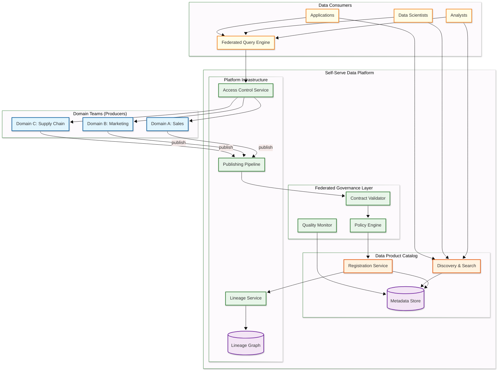
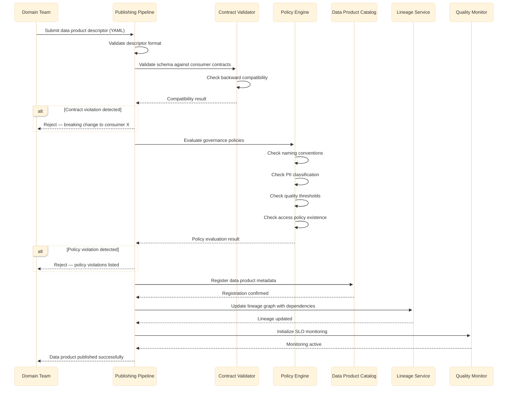
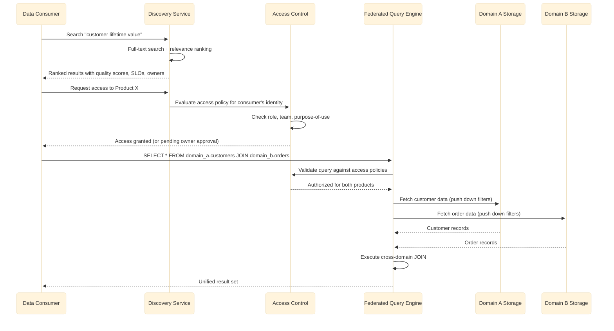
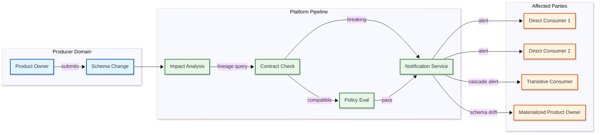
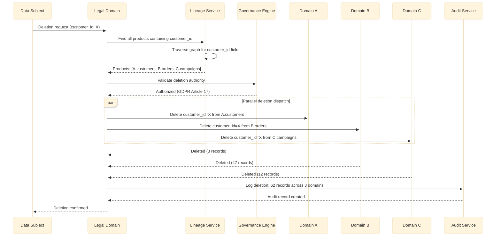
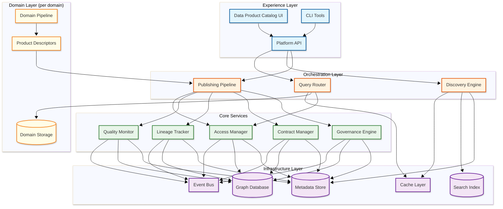

# High-Level Design — Data Mesh Architecture

## System Architecture

---

## Data Flow

### Data Product Publishing Flow

**Publishing flow key points:**

1. **Contract-first** — Schema compatibility with existing consumers is validated before governance policies, failing fast on breaking changes
2. **Policy-as-code** — All governance rules are machine-executable; no manual approval gates in the publishing pipeline
3. **Lineage capture** — Declared dependencies are recorded in the lineage graph at publish time, not discovered retroactively
4. **SLO activation** — Quality monitoring begins immediately upon publication with the declared freshness and quality thresholds
5. **Rejection with specifics** — Failed publications return actionable feedback identifying exactly which contracts or policies were violated

### Data Product Consumption Flow

---

## Component Responsibility Matrix

| Component | Primary Responsibility | Owns | Depends On | Failure Impact |
|-----------|----------------------|------|-----------|----------------|
| **Publishing Pipeline** | Orchestrates data product registration workflow | Publish state machine | Contract Validator, Policy Engine, Catalog, Lineage | Publishing blocked |
| **Contract Validator** | Validates schema compatibility against consumer contracts | Contract versions | Catalog (consumer list) | Cannot detect breaking changes |
| **Policy Engine** | Evaluates governance policies against product descriptors | Policy definitions, evaluation history | Policy store | Publishing defaults to fail-closed |
| **Registration Service** | Persists product metadata in catalog | Product records | Metadata Store, Search Index | No new products registered |
| **Discovery & Search** | Full-text + faceted search across product catalog | Search index | Metadata Store (source of truth) | Consumers cannot find products |
| **Quality Monitor** | Continuously evaluates data product SLOs | Quality history, SLO status | Metadata Store, domain storage (sampling) | Silent quality degradation |
| **Access Control Service** | Evaluates access policies per request | Access grants, audit log | Identity provider, product access policies | Unauthorized access or blocked access |
| **Lineage Service** | Maintains and queries the dependency graph | Lineage graph | Graph store | No impact analysis capability |
| **Event Bus** | Distributes lifecycle events to subscribers | Event topics | Message broker | Delayed notifications |
| **Federated Query Engine** | Executes SQL across domain storage systems | Query plans, caching | Domain storage endpoints, Access Control | Cross-domain queries unavailable |

## Data Flow: Schema Change Impact Propagation

## Data Flow: Right-to-Deletion (GDPR) Cross-Domain Propagation

## Self-Serve Platform Architecture Layers

## Technology Selection Guidelines

| Component | Recommended Approach | Rationale |
|-----------|---------------------|-----------|
| Metadata Store | Replicated document store | Flexible schema for evolving descriptors; strong consistency for registration |
| Lineage Graph | Native graph database | Adjacency traversal is the primary access pattern; BFS/DFS performance critical |
| Search Index | Dedicated full-text search engine | Inverted index, faceted search, and relevance ranking are specialized workloads |
| Event Bus | Distributed log-based message broker | Ordered, durable, replayable events for lifecycle notifications |
| Federated Query | SQL-on-anything engine | Must query heterogeneous sources (columnar, relational, object storage) via standard SQL |
| Contract Validation | Custom service | Domain-specific logic (compatibility rules, type widening) not served by off-the-shelf tools |
| Governance Engine | Custom rule engine with declarative policies | Must support YAML-defined rules evaluated at machine speed |
| Access Control | Policy decision point + policy enforcement point | Decouple policy evaluation from enforcement for flexibility |

---

## Key Architectural Decisions

### 1. Decentralized Data Ownership vs. Central Data Team

| Aspect | Decentralized (Data Mesh) | Centralized (Data Lake/Warehouse) |
|--------|--------------------------|----------------------------------|
| Ownership | Domain teams own their data products | Central data engineering team owns all pipelines |
| Slowest part of the process | No central Slowest part of the process; domains publish independently | Central team becomes Slowest part of the process as domains grow |
| Quality accountability | Producer is accountable; SLOs are contractual | Central team must understand every domain's data |
| Coordination cost | Higher (many teams must follow standards) | Lower (one team, one standard) |
| Scaling | Scales with organizational growth | Breaks at 20-30 domains (central team cannot keep up) |

**Decision:** Decentralized ownership with federated governance. The central data engineering team evolves into a platform team that provides self-serve infrastructure rather than building all pipelines. This is the architectural response to the observation that centralized data teams become organizational bottlenecks that scale linearly with headcount while data complexity grows exponentially.

### 2. Contract-Driven vs. Schema-on-Read

| Aspect | Contract-Driven | Schema-on-Read |
|--------|----------------|----------------|
| Producer burden | Must declare and maintain contracts | Minimal — publish data in any format |
| Consumer reliability | Consumers can depend on guaranteed structure | Consumers must handle any structure |
| Breaking change detection | Automated at publish time | Discovered at query time (production failure) |
| Flexibility | Lower (changes require contract negotiation) | Higher (any format, any time) |
| Trust | High (contractual guarantees) | Low (hope the data looks right) |

**Decision:** Contract-driven with automated validation. The overhead of maintaining contracts is significantly lower than the cost of debugging production failures caused by undocumented schema changes. Contracts are YAML descriptors versioned alongside the data product.

### 3. Embedded Governance vs. External Governance

| Aspect | Embedded (Policy-as-Code) | External (Manual Review) |
|--------|--------------------------|-------------------------|
| Enforcement speed | Milliseconds (automated) | Days/weeks (committee review) |
| Consistency | 100% — policies apply to every product | Variable — depends on reviewer attention |
| Scalability | Scales to thousands of products | Breaks at dozens of products |
| Flexibility | Rigid (rules are binary) | Flexible (human judgment) |
| Auditability | Complete (every evaluation is logged) | Partial (meeting notes, email threads) |

**Decision:** Policy-as-code with automated enforcement. Manual review committees do not scale beyond a handful of data products. Policies are encoded as executable rules (declarative YAML or code), evaluated automatically during the publishing pipeline, and produce deterministic pass/fail results with specific violation messages.

### 4. Federated Query Engine vs. Data Replication

| Aspect | Federated Query | Data Replication |
|--------|----------------|-----------------|
| Data freshness | Always current (queries source) | Stale by replication lag |
| Cross-domain JOINs | Network-bound, latency depends on sources | Local, fast after initial replication |
| Storage cost | No duplication | Copies of all consumed products |
| Governance | Access checked at query time | Access checked at replication time |
| Complexity | Query optimization across heterogeneous sources | Replication pipeline management |

**Decision:** Federated queries as the default with optional materialized views for high-frequency cross-domain joins. This preserves the single-source-of-truth principle while allowing performance optimization where needed.

### 5. Data Product Storage Strategy

**Decision:** Domain teams choose their own storage technology (columnar store, object storage, relational database) as long as the data product exposes a standard interface (SQL-accessible via the federated query engine or API). The platform provides recommended templates but does not mandate a single storage technology — this preserves domain autonomy while ensuring interoperability through interface standardization.

### 6. Event-Driven vs. Polling for Change Notification

**Decision:** Event-driven change notifications via a central event bus. When a data product is published, updated, deprecated, or has a quality SLO violation, an event is emitted. Consumers subscribe to events for products they depend on. This enables reactive lineage updates, automated quality alerting, and consumer-side cache invalidation without polling.

---

## Architecture Pattern Checklist

- [x] **Sync vs Async communication** — Synchronous for catalog queries and access control; async for publishing pipeline and governance evaluation
- [x] **Event-driven vs Request-response** — Event-driven for data product lifecycle notifications; request-response for discovery and federated queries
- [x] **Push vs Pull model** — Push-based notifications for data product changes; pull-based for data consumption and discovery
- [x] **Stateless vs Stateful services** — Catalog and governance services are stateless (state in metadata store); lineage service maintains graph state
- [x] **Read-heavy vs Write-heavy** — Read-heavy (100:1); discovery and consumption dominate; publishing is infrequent per product
- [x] **Real-time vs Batch processing** — Batch for data product publishing (daily/hourly cadence); real-time for governance enforcement and access control
- [x] **Edge vs Origin processing** — Origin processing; governance policies must be evaluated against the full catalog, not cached at the edge

---

## Real-World: Zalando's Data Mesh Journey

Zalando, a European e-commerce platform, was one of the earliest and most cited adopters of data mesh. Their journey illustrates the practical evolution from centralized data lake to domain-oriented data products.

**Before mesh:** A centralized data lake managed by a 30+ person data engineering team. Domain teams submitted tickets for new pipelines. Average time from data request to production pipeline: 4-6 weeks. The central team became a Slowest part of the process as the company grew to 20+ business domains.

**Mesh implementation:**
- Defined ~15 core domains: logistics, customer, catalog, payments, marketing, seller management, etc.
- Built an internal self-serve platform with data product templates, a catalog for discovery, and automated governance
- Migrated domain-owned datasets from the centralized lake to domain-managed storage over 18 months
- Achieved 100+ data products across domains within the first year
- Reduced average time-to-data from 4-6 weeks to days

**Key engineering decision:** Chose to keep a "data lake" domain that continued to serve as a shared exploration environment while governed data products became the source of truth for production analytics.

**Lesson:** The organizational change (convincing logistics teams to own their data) was harder than building the platform. They used "embedded data engineers" — platform team members who worked within domains for 3-6 months to build the first data products and train domain engineers.

---

## Real-World: Financial Services Data Mesh for Regulatory Reporting

A major global bank implemented data mesh to solve a specific problem: regulatory reporting required data from 40+ internal systems, and the centralized ETL pipeline took 72 hours to produce a single report, with frequent quality failures.

**Mesh approach:**
- Each business unit (trading, risk, compliance, operations) became a domain that published its own data products
- The "canonical identity" challenge was severe — "counterparty" had 14 different representations across systems
- Built a dedicated Identity Resolution domain that published a golden entity record consumed by all other domains
- Governance was non-negotiable: every data product required PII classification, encryption certification, and regulatory lineage before publication

**Results:**
- Regulatory report generation reduced from 72 hours to 8 hours
- Data quality issues in reports reduced by 60% due to contract-enforced schemas
- 47 global governance policies and 180+ domain-specific policies, all automated
- Time-to-publish for a standard data product: < 4 hours using the golden path template

**Key learning:** In regulated industries, governance is not a constraint on data mesh — it is the primary value proposition. The automation of compliance checks was what convinced leadership to fund the transformation.
