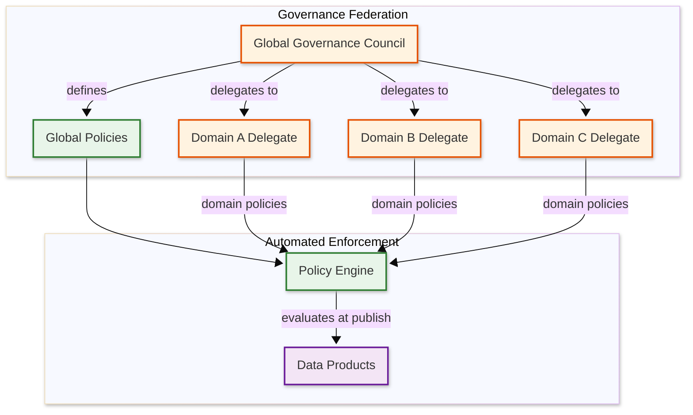

# Deep Dive & Bottlenecks — Data Mesh Architecture

## Critical Component 1: Cross-Domain Data Product Composition

### Why Is This Critical?

The value of a data mesh multiplies when data products from different domains can be composed — a marketing team joining customer lifetime value (Sales domain) with campaign performance (Marketing domain) to measure ROI. If cross-domain composition is slow, unreliable, or governance-bypassing, consumers will revert to copying data into local silos, defeating the mesh's purpose. Cross-domain composition is where the architectural promises of data mesh are either fulfilled or exposed as theoretical.

### How It Works Internally

**Federated Query Architecture:**

```
Consumer Query: SELECT c.name, c.ltv, o.total_orders
                FROM sales.customer_ltv c
                JOIN fulfillment.order_summary o ON c.customer_id = o.customer_id
                WHERE c.segment = 'enterprise'

Execution Plan:
  1. Query parser identifies two data products from different domains
  2. Access control validates consumer has access to both products
  3. Optimizer decides execution strategy:
     a. Push-down: Send filtered subqueries to each domain's storage
     b. Pull-up:   Fetch full datasets and join at the query engine
     c. Hybrid:    Push filters, pull results, join locally
  4. Federated engine sends subqueries to domain endpoints
  5. Results are joined at the query engine layer
  6. Combined result returned to consumer
```

**Optimization Strategies:**

| Strategy | Description | When Used |
|----------|-------------|-----------|
| Filter push-down | Push WHERE clauses to source domains | Always (reduces data transfer) |
| Projection push-down | Request only needed columns | Always (reduces data transfer) |
| Join push-down | Execute join at the source if both products are co-located | Same-domain joins |
| Broadcast join | Broadcast smaller table to all nodes | One side < 100 MB |
| Partition-aware join | Exploit compatible partitioning across domains | Both products partitioned on join key |

### Failure Modes

1. **Heterogeneous schema mismatch** — Domain A uses `customer_id` as STRING, Domain B uses INT64. The join fails or silently produces wrong results with implicit casting.
   - **Mitigation:** Data contracts declare canonical types for shared identifiers. The governance policy engine enforces that all products sharing a key type use the same data type.

2. **Temporal misalignment** — Sales data is refreshed hourly, fulfillment data is refreshed daily. A cross-domain join at 10 AM includes today's sales against yesterday's fulfillment data.
   - **Mitigation:** Data products declare their refresh cadence in the descriptor. The query engine annotates results with the "as-of" timestamp of each source. Consumers are warned when freshness differs by more than a configurable threshold.

3. **Fan-out explosion** — A query that joins five data products from five domains sends subqueries to five independent storage systems, each with different latency characteristics.
   - **Mitigation:** Query planner limits cross-domain fan-out. For queries exceeding 3 domains, the engine suggests materializing an intermediate data product rather than executing a 5-way federated join.

---

## Critical Component 2: Federated Governance Without Centralization

### Why Is This Critical?

Governance in a data mesh must balance two contradictory forces: global consistency (every data product must comply with security, compliance, and interoperability standards) and domain autonomy (each domain team must be free to make local decisions about schema design, technology choices, and publishing cadence). If governance is too centralized, the mesh devolves into a rebranded centralized data team. If governance is too loose, the mesh devolves into incompatible data silos.

### How It Works Internally

**Governance Federation Structure:**



**Policy Layering:**

| Layer | Scope | Examples | Mutability |
|-------|-------|----------|------------|
| Global mandatory | All products | PII classification required, access policy mandatory, naming conventions | Only governance council can modify |
| Global recommended | Advisory | Quality score > 0.8, documentation completeness | Can be overridden by domain with justification |
| Domain mandatory | One domain | Finance: encryption required on all monetary fields | Domain delegate defines |
| Domain recommended | One domain | Marketing: UTM tag standardization | Domain delegate defines |

**Policy Conflict Resolution:**

```
FUNCTION resolve_policy_conflict(global_policy, domain_policy):
    // Global mandatory always wins
    IF global_policy.scope == GLOBAL AND global_policy.severity == ERROR:
        RETURN global_policy

    // Domain can be more restrictive than global, never less
    IF domain_policy.is_more_restrictive_than(global_policy):
        RETURN domain_policy  // Domain adds additional constraints

    // Domain tries to be less restrictive — violation
    RETURN {
        error: "Domain policy cannot weaken global policy",
        global: global_policy,
        domain: domain_policy,
        resolution: "Adjust domain policy to meet or exceed global standard"
    }
```

### Failure Modes

1. **Governance drift** — Over time, global policies become outdated as domains evolve. New data products pass technically valid but substantively outdated rules.
   - **Mitigation:** Policy versioning with mandatory review cycles. The governance council reviews and updates global policies quarterly. Policies have an `expires_at` field; expired policies trigger a review workflow rather than silently continuing enforcement.

2. **Policy explosion** — Too many policies (hundreds) make the evaluation slow and the results incomprehensible. Domain teams cannot understand why their products fail governance.
   - **Mitigation:** Policy grouping into "policy packs" (e.g., "PII pack", "finance compliance pack"). Clear categorization and priority ordering. Governance evaluation reports group violations by category with actionable remediation steps.

3. **Shadow data products** — Teams bypass governance by sharing data directly (file shares, ad-hoc queries) rather than publishing through the platform.
   - **Mitigation:** Observability layer detects data movement outside the mesh (audit logs, network traffic analysis). Executive-level metrics track "governance coverage" — the percentage of known analytical datasets that are registered as governed data products.

---

## Critical Component 3: Data Product Versioning and Deprecation

### Why Is This Critical?

Data products evolve — schemas change, quality definitions tighten, fields are added or removed. Unlike microservice APIs where the producer controls all consumers, data mesh consumers may be unknown or from different domains. A breaking schema change in a Sales data product could silently break a Finance team's automated reporting pipeline. The versioning and deprecation strategy determines whether the mesh can evolve without cascading failures.

### How It Works Internally

**Semantic Versioning for Data Products:**

| Version Change | Meaning | Compatibility |
|----------------|---------|---------------|
| PATCH (1.0.x) | Bug fixes, data corrections | Fully compatible; consumers unaffected |
| MINOR (1.x.0) | New columns added, quality improvements | Backward compatible; existing consumers work without changes |
| MAJOR (x.0.0) | Breaking changes: removed columns, type changes, renamed fields | Not backward compatible; consumers must update |

**Deprecation Workflow:**

```
Phase 1: ANNOUNCE (Day 0)
  - Owner marks version as DEPRECATED in catalog
  - All registered consumers receive notification
  - Catalog shows deprecation warning on discovery

Phase 2: SUNSET PERIOD (Day 0 → Day 90)
  - Both old and new versions are published simultaneously
  - Quality monitoring continues on deprecated version
  - Migration guide published with mapping from old to new schema
  - Consumer adoption of new version is tracked

Phase 3: RETIREMENT WARNING (Day 60)
  - Consumers still using deprecated version receive escalated alerts
  - Owner contacts remaining consumers directly
  - Lineage shows which downstream products depend on deprecated version

Phase 4: RETIREMENT (Day 90)
  - Deprecated version is removed from discovery (not deleted)
  - Direct access remains for 30 additional days (grace period)
  - After grace period, data is archived but no longer queryable
```

### Failure Modes

1. **Version sprawl** — Domain teams maintain too many versions simultaneously, increasing operational burden and confusion.
   - **Mitigation:** Global policy limits active versions to 2 (current + previous). Versions older than N-2 must be retired. Automated alerts when a product has >2 active versions.

2. **Consumer orphaning** — Consumers never migrate from deprecated versions because migration requires effort and the old version "still works."
   - **Mitigation:** Forced deprecation deadlines with automatic access revocation. Track consumer migration progress in the catalog. Provide automated schema migration tooling where possible.

---

## Critical Component 4: Data Product Lifecycle State Machine

### Why Is This Critical?

A data product is not a static entity — it transitions through a well-defined lifecycle from initial draft through active publication to eventual retirement. Mismanaging these transitions creates zombie products (published but unmaintained), orphaned consumers (depending on products that silently stopped updating), and catalog pollution (retired products cluttering discovery). The lifecycle state machine must be enforced by the platform to prevent entropy.

### How It Works Internally

**State Machine Definition:**

```
                  ┌──────────┐
                  │  DRAFT   │ ← Domain team creates descriptor
                  └────┬─────┘
                       │ submit for validation
                  ┌────▼─────┐
                  │VALIDATING│ ← Contract + governance evaluation
                  └────┬─────┘
                       │ pass          │ fail
                  ┌────▼─────┐   ┌─────▼────┐
                  │PUBLISHED │   │ REJECTED  │
                  └────┬─────┘   └──────────┘
                       │
            ┌──────────┼──────────┐
            │          │          │
       ┌────▼─────┐ ┌──▼───┐ ┌───▼──────┐
       │DEPRECATED│ │UPDATE│ │ DEGRADED  │ ← SLO violation detected
       └────┬─────┘ └──┬───┘ └───┬──────┘
            │          │         │ SLO restored
            │          └─→ VALIDATING
            │                    │
       ┌────▼─────┐         ┌───▼──────┐
       │ RETIRING │         │PUBLISHED │
       └────┬─────┘         └──────────┘
            │ grace period expires
       ┌────▼─────┐
       │ ARCHIVED │
       └──────────┘
```

**Transition Rules:**

| From | To | Trigger | Side Effects |
|------|-----|---------|-------------|
| DRAFT → VALIDATING | Team submits descriptor | Lock product for concurrent edits |
| VALIDATING → PUBLISHED | All checks pass | Register in catalog, update lineage, start monitoring |
| VALIDATING → REJECTED | Any ERROR-level check fails | Record failure reasons, notify submitter |
| PUBLISHED → DEPRECATED | Owner initiates deprecation | Notify all consumers, start sunset timer |
| PUBLISHED → DEGRADED | SLO violation sustained > threshold | Alert owner and consumers, mark in catalog |
| DEGRADED → PUBLISHED | SLO restored for > recovery window | Clear degradation flag, resume normal monitoring |
| DEPRECATED → RETIRING | Sunset period expires | Escalated consumer notifications |
| RETIRING → ARCHIVED | Grace period expires | Remove from discovery, archive data, retain metadata |
| PUBLISHED → VALIDATING | Owner submits updated descriptor | Re-validate with new schema/contract |

**Invariants the state machine enforces:**
- A product cannot be discoverable in the catalog unless its status is PUBLISHED or DEPRECATED
- A DEGRADED product remains discoverable but shows a health warning badge
- An ARCHIVED product's metadata is retained indefinitely for lineage auditing, but its data is no longer queryable
- Only the product owner (or platform admin) can initiate state transitions
- All transitions are logged in an immutable audit trail

### Failure Modes

1. **Zombie products** — Products in PUBLISHED state that are no longer maintained (owner left, team disbanded, source system decommissioned). Data stops refreshing but no one deprecates the product.
   - **Mitigation:** Automated staleness detection. If a product has not been refreshed within 3x its declared freshness SLO and the owner has not acknowledged the staleness alert within 48 hours, the platform automatically transitions it to DEGRADED. After 30 days in DEGRADED with no owner action, it is auto-deprecated.

2. **Premature archival** — A product is archived while unknown consumers still depend on it (dark consumption).
   - **Mitigation:** During the RETIRING phase, the platform monitors query logs for any access to the product. If access is detected from unregistered consumers, retirement is paused and the accessing teams are identified and contacted.

3. **State oscillation** — A product rapidly flips between PUBLISHED and DEGRADED due to intermittent SLO violations (e.g., borderline freshness).
   - **Mitigation:** Hysteresis in state transitions. Transition to DEGRADED requires SLO violation sustained for > 2 consecutive monitoring intervals. Transition back to PUBLISHED requires SLO compliance sustained for > 3 consecutive intervals.

---

## Critical Component 5: Canonical Identifier Resolution

### Why Is This Critical?

Cross-domain data products can only be composed if they share common identifiers. But in a decentralized architecture, different domains naturally develop their own identifier schemes: Sales uses `salesforce_account_id`, Support uses `zendesk_customer_id`, Marketing uses `campaign_contact_id`, and Fulfillment uses `shipping_customer_id`. Without canonical identifier resolution, cross-domain joins require ad-hoc ID mapping that is fragile, incomplete, and unauditable.

### How It Works Internally

**Identifier Registry:**

The platform maintains a canonical identifier registry — a governed mapping from domain-local identifiers to global canonical identifiers:

```
Canonical: customer_id (type: STRING, format: UUID)

Domain Mappings:
  sales:     salesforce_account_id  → customer_id  (via lookup table: sales.account_customer_map)
  support:   zendesk_customer_id    → customer_id  (via transformation: prefix strip + UUID cast)
  marketing: campaign_contact_id    → customer_id  (via lookup table: marketing.contact_customer_map)
  fulfillment: shipping_customer_id → customer_id  (via direct mapping: same ID format)
```

**Resolution Strategy:**

```
FUNCTION resolve_canonical_id(domain_id, source_domain, target_canonical):
    mapping = identifier_registry.get_mapping(source_domain, target_canonical)

    IF mapping.type == DIRECT:
        RETURN domain_id  // Same format, no transformation needed

    ELSE IF mapping.type == TRANSFORMATION:
        RETURN apply_transformation(domain_id, mapping.transform_function)

    ELSE IF mapping.type == LOOKUP:
        canonical = lookup_table.get(domain_id)
        IF canonical is NULL:
            RETURN {
                error: "UNRESOLVABLE_ID",
                domain_id: domain_id,
                suggestion: "Register mapping in canonical registry or verify ID validity"
            }
        RETURN canonical

// Time:  O(1) for direct/transformation, O(log n) for lookup (indexed)
// Space: O(1) per resolution
```

### Failure Modes

1. **Incomplete mappings** — Not all domain-local IDs have mappings to the canonical ID. A cross-domain join produces partial results because 10% of Sales records cannot be mapped to a customer_id.
   - **Mitigation:** Governance policy requires > 99% mapping coverage for shared identifiers. The quality monitor tracks mapping coverage as a metric and alerts when it drops below the threshold.

2. **Stale mapping tables** — Lookup tables for ID resolution are not refreshed frequently enough, causing recently created IDs to fail resolution.
   - **Mitigation:** Mapping tables are themselves data products with freshness SLOs (e.g., < 1 hour). The lineage graph tracks that cross-domain data products depend on mapping products, so mapping freshness is visible in impact analysis.

3. **Ambiguous mappings** — One domain-local ID maps to multiple canonical IDs (many-to-many relationship). A `salesforce_account_id` maps to three `customer_id` values because one account has three associated customers.
   - **Mitigation:** The identifier registry explicitly declares cardinality (1:1, 1:N, N:1, N:M). The federated query engine handles cardinality appropriately — a 1:N mapping produces multiple joined rows, which is documented in the query result metadata.

---

## Edge Cases and Corner Scenarios

### Edge Case (Unusual or extreme situation) 1: Circular Lineage Dependencies

**Scenario:** Product A declares Product B as upstream. Product B is updated to declare Product A as upstream. The lineage graph now has a cycle, violating the DAG Rule that never changes.

**Impact:** Impact analysis enters an infinite loop. Governance evaluation using lineage (e.g., "all products upstream of a PII source must be classified as PII") cannot terminate.

**Resolution:** The lineage service validates the DAG Rule that never changes on every edge insertion. If adding a new edge would create a cycle, the publish is rejected with an error identifying the cycle path. The only way to resolve a legitimate bidirectional dependency is through a mediating product C that both A and B feed into.

### Edge Case (Unusual or extreme situation) 2: Cascade Deprecation

**Scenario:** Product X is deprecated. Product Y depends on X. Product Z depends on Y. Product W depends on Z. The deprecation of X should trigger awareness across the entire dependency chain.

**Impact:** Without cascade notifications, downstream products Y, Z, and W will break when X is retired — and their owners may not realize X is being deprecated because they depend on it transitively, not directly.

**Resolution:** Deprecation triggers a transitive impact analysis. All products in the downstream subgraph of X receive a "transitive deprecation warning" — not blocking, but informational. The catalog surfaces the deprecation chain: "Product W depends on Product Z, which depends on Product Y, which depends on Product X (DEPRECATED — retiring on 2026-06-01)."

### Edge Case (Unusual or extreme situation) 3: Schema Divergence in Materialized Cross-Domain Products

**Scenario:** A consuming team creates a materialized product that pre-joins Sales.CustomerLTV and Marketing.CampaignPerformance. Sales updates CustomerLTV with a MINOR version (adds a column). The materialized product does not update its schema because it uses the old version and ignores the new column.

**Impact:** The materialized product presents a stale view of the upstream data. Consumers of the materialized product miss the new column and may not realize they should query the upstream directly for the latest schema.

**Resolution:** The platform's lineage-aware quality monitor detects schema divergence between a materialized product and its upstream sources. When an upstream product adds fields, downstream materialized products receive a "schema drift" notification suggesting they update. If the upstream has a MAJOR version bump, the materialized product receives a blocking alert.

### Edge Case (Unusual or extreme situation) 4: Governance Policy Retroactive Enforcement

**Scenario:** A new global policy is added (e.g., "all products must classify PII fields"). There are 500 existing products that were published before this policy existed. Are they now non-compliant?

**Impact:** Retroactive enforcement could instantly mark hundreds of products as non-compliant, overwhelming domain teams and potentially disrupting consumers if non-compliant products are delisted.

**Resolution:** New policies have a `retroactive` flag and a `grace_period`:
- `retroactive: false` — Only applies to new publishes; existing products are grandfathered until their next update
- `retroactive: true, grace_period: 90 days` — Existing products have 90 days to comply; after the grace period, non-compliant products are flagged (not automatically delisted)
- The governance dashboard shows a "compliance backlog" metric tracking how many products need to be updated for new policies

---

## Concurrency & Race Conditions

### Race Condition 1: Simultaneous Schema Updates by Producer and Consumer Contract Change

**Scenario:** A producer publishes a new schema version while a consumer simultaneously updates their contract subscription, creating a window where the contract references a schema that is being replaced.

**Resolution:** Optimistic concurrency control on contracts. Each contract has a version number. The update operation includes the expected version; if it has changed (another party modified it), the update is rejected and must be retried with the latest version.

### Race Condition 2: Governance Policy Update During Product Evaluation

**Scenario:** A data product is mid-evaluation when a governance council member updates a global policy, potentially changing the evaluation result.

**Resolution:** Snapshot isolation for evaluations. When evaluation begins, the policy engine captures a consistent snapshot of all applicable policies. The evaluation completes against this snapshot regardless of concurrent policy changes. The evaluation result records which policy versions were used.

### Race Condition 3: Concurrent Publishing from Same Domain

**Scenario:** Two team members publish different versions of the same data product simultaneously.

**Resolution:** Distributed lock per data product ID. The publishing pipeline acquires an advisory lock on the product URN before starting evaluation. The second publish request waits (with timeout) or fails fast with a "concurrent publish in progress" error.

---

## Slowest part of the process Analysis

### Slowest part of the process 1: Federated Query Performance Across Domains

**Problem:** Cross-domain queries route through a federated query engine that must communicate with multiple independent storage systems. Each domain may use different storage technology (columnar store, object storage, relational database) with different performance characteristics.

**Impact:** Cross-domain query latency is dominated by the slowest source domain. A 3-way join where one domain responds in 100ms, another in 2 seconds, and a third in 15 seconds takes at least 15 seconds total.

**Mitigation:**
- Asynchronous parallel subquery execution (all domains queried simultaneously)
- Timeout per domain with partial result return (respond with available data + "domain X timed out" warning)
- Materialized cross-domain views for frequently joined products (maintained by the consuming team)
- Caching layer for repeated subquery results with TTL aligned to source freshness

### Slowest part of the process 2: Governance Evaluation Latency at Scale

**Problem:** As the number of global policies grows (50+ policies) and products increase (2,000+ products), the time to evaluate all applicable policies during publishing increases. Complex policies (e.g., PII detection across all fields) are computationally expensive.

**Impact:** Publishing latency grows from seconds to minutes, frustrating domain teams and discouraging frequent publishing.

**Mitigation:**
- Incremental evaluation: if only metadata changed (not schema), skip schema-related policies
- Policy caching: cache expensive policy results (PII classification) and only re-evaluate when schema changes
- Parallel policy evaluation: evaluate independent policies concurrently
- Policy tiering: fast policies (naming conventions) run first; slow policies (PII scanning) run asynchronously with results posted later

### Slowest part of the process 3: Catalog Discovery at Scale

**Problem:** As the catalog grows to thousands of products with rich metadata, full-text search becomes slower and ranking accuracy degrades (too many results for broad queries).

**Impact:** Consumers cannot find relevant data products, leading to duplicate product creation or direct data sharing outside the mesh.

**Mitigation:**
- Faceted search with pre-computed aggregations per domain, quality tier, and tag category
- Personalized ranking using consumer's domain, past consumption patterns, and team affiliation
- AI-assisted recommendation: "consumers who used Product X also used Product Y"
- Data product curation: domain champions manually highlight recommended products

### Slowest part of the process 4: Lineage Graph Growth and Query Complexity

**Problem:** As the mesh matures, the lineage graph grows from thousands to hundreds of thousands of nodes (products, columns, transformations, consumers). Graph queries — especially transitive impact analysis ("what downstream products are affected if this product changes?") — become exponentially more expensive as depth increases.

**Impact:** Impact analysis queries that took < 1 second with 5,000 nodes take > 30 seconds with 100,000 nodes, making them impractical as part of the interactive publishing workflow. Domain teams either wait or skip impact analysis.

**Mitigation:**
- Pre-computed impact summaries: maintain materialized impact sets for each product, updated incrementally when lineage edges change
- Bounded traversal: limit impact analysis to 5 hops by default (covering 99% of practical dependencies); full-graph traversal available as an async background job
- Graph partitioning: partition the lineage graph by domain, with cross-domain edges stored separately for federated traversal
- Tiered graph storage: active lineage (last 90 days) in high-performance graph database; historical lineage in cold storage for compliance auditing

### Slowest part of the process 5: Event Bus Backlog During Bulk Operations

**Problem:** End-of-quarter or compliance-driven bulk operations (e.g., 100 domains simultaneously updating PII classifications) generate event storms. The event bus consumers — lineage updater, quality monitor, notification service — fall behind, creating cascading delays.

**Impact:** Consumers receive delayed notifications about product changes. Quality monitoring gaps during the backlog period. Lineage graph becomes temporarily inconsistent.

**Mitigation:**
- Priority-based event routing: lifecycle events (PUBLISHED, DEPRECATED) routed to a high-priority queue; metadata-only updates to a lower-priority queue
- Back-pressure signaling: event producers receive throttle signals when consumer lag exceeds threshold, spreading bulk operations over a longer window
- Idempotent event processing: consumers can safely replay events without side effects, enabling catch-up after backlog clearance
- Dedicated burst capacity: auto-scale event consumers when queue depth exceeds baseline by > 5x

---

## Algorithm Complexity Deep-Dive

### Governance Evaluation Complexity

The governance evaluation pipeline processes P policies against a product with F fields, C consumers, and L lineage edges:

| Operation | Complexity | Dominant Factor |
|-----------|-----------|-----------------|
| Policy collection (filter applicable) | O(P) | Total policy count |
| Schema-based checks (naming, types) | O(P_schema × F) | Fields per product |
| Quality rule evaluation | O(P_quality × S) | Sample size S for statistical checks |
| Contract compatibility (per consumer) | O(C × F) | Consumers × fields |
| Lineage-based checks (PII propagation) | O(L × D) | Lineage edges × traversal depth D |
| **Total worst case** | **O(P × F × C)** | Fields × consumers dominates |

For a product with 50 fields, 20 consumers, and 80 applicable policies: 50 × 20 × 80 = 80,000 rule evaluations. At 0.1ms each = 8 seconds. This explains why governance evaluation latency grows with mesh maturity and why incremental evaluation (skip unchanged dimensions) is critical.

### Federated Query Cost Model

Cross-domain query cost depends on data transfer volume, not just row count:

```
FUNCTION estimate_query_cost(query_plan):
    total_cost = 0

    FOR EACH subquery IN query_plan.subqueries:
        // Data transfer cost (dominant factor)
        estimated_rows = subquery.source.estimated_row_count * subquery.selectivity
        estimated_bytes = estimated_rows * subquery.avg_row_size
        transfer_cost = estimated_bytes / network_bandwidth

        // Source processing cost
        source_cost = estimate_source_scan_cost(subquery)

        total_cost += MAX(transfer_cost, source_cost)  // Parallel execution

    // Join cost at query engine
    join_cost = estimate_join_cost(query_plan.join_strategy, query_plan.intermediate_sizes)
    total_cost += join_cost

    RETURN {
        estimated_latency: total_cost,
        data_transfer_gb: sum(subquery.estimated_bytes) / 1e9,
        cost_tier: categorize(total_cost)  // LOW (<5s), MEDIUM (5-30s), HIGH (>30s)
    }
```

### Real-World: Large Financial Institution Data Mesh

A major financial services firm with 60+ business domains implemented data mesh to break free from a centralized data lake that had become a Slowest part of the process for regulatory reporting. Their experience:

- **Scale:** 1,200+ data products across 60 domains within 18 months of launch
- **Key challenge:** Cross-domain identity resolution — "customer" had 14 different definitions across domains
- **Solution:** A dedicated "Canonical Identity" domain that published a golden customer record as a data product, with mapping tables consumed by all other domains
- **Publishing time:** Reduced from 4-6 weeks (central team pipeline) to 2-3 days (self-serve platform), eventually reaching < 4 hours for standard data products following the golden path
- **Governance:** 47 global policies, 180+ domain-specific policies. Policy evaluation averaged 6 seconds per publish
- **Engineering decision:** Chose federated query as default but mandated materialized products for any cross-domain query accessed > 100 times/day
- **Lesson learned:** The hardest technical problem was not building the platform — it was achieving consistent data quality across domains with different levels of engineering maturity

### Real-World: E-Commerce Platform Data Mesh

A large e-commerce company adopted data mesh to enable their marketplace analytics teams to self-serve cross-domain insights (buyer behavior, seller performance, logistics, payments).

- **Scale:** 800+ data products, 15,000+ active consumers (analysts, ML pipelines, dashboards)
- **Key challenge:** Temporal misalignment — buyer events were real-time, payment settlement was T+2 days, seller payout was T+14 days. Cross-domain reports mixed data with fundamentally different temporal semantics.
- **Solution:** Every data product declared a "temporal resolution" in its descriptor (real-time, daily, weekly, monthly). The federated query engine annotated cross-domain results with the effective temporal window and warned when joining products with > 2x temporal resolution difference.
- **Governance:** Fully automated with zero manual review gates. Publishing rejection rate was 15% in month 1 (teams learning the standards) and dropped to 3% by month 6.
- **Cost attribution:** Implemented per-product storage costs and per-query compute costs. Storage costs decreased 35% in the first quarter as domain teams cleaned up unused products and implemented retention policies.
