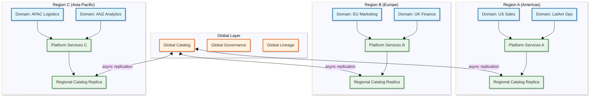

# Scalability & Reliability — Data Mesh Architecture

## Scalability

### Organizational Scaling (The Primary Scaling Dimension)

Unlike most system designs where scaling means adding servers, data mesh scaling is primarily organizational: adding new domains, new teams, and new data products without degrading the platform's ability to govern, discover, and compose them.

| Growth Dimension | Scale Challenge | Strategy |
|-----------------|----------------|----------|
| More domains (10 → 100) | Governance federation becomes unwieldy | Hierarchical governance: domain clusters with delegates |
| More products per domain (5 → 50) | Catalog noise; discovery becomes harder | Faceted search, domain-curated collections, quality scoring |
| More consumers (100 → 10,000) | Access management overhead; query load | Self-serve access policies; federated query engine scaling |
| More cross-domain dependencies | Lineage graph complexity; impact analysis cost | Graph database scaling; materialized impact summaries |
| More governance policies | Evaluation latency; policy conflicts | Policy tiering, caching, incremental evaluation |

### Platform Infrastructure Scaling

| Component | Scaling Strategy | Trigger |
|-----------|-----------------|---------|
| Catalog Service | Horizontal (stateless instances behind load balancer) | QPS > 100 per instance |
| Search Index | Shard by domain; replicate for read throughput | Index size > 50 GB or search latency > 500ms p99 |
| Governance Engine | Horizontal (stateless; policies loaded from store) | Evaluation queue depth > 50 |
| Lineage Graph Store | Vertical first (graph fits in memory); horizontal via graph partitioning | Graph exceeds 1M nodes |
| Contract Validator | Horizontal (stateless computation) | Validation queue depth > 20 |
| Access Control | Horizontal + caching (policy decisions are cacheable) | Evaluation QPS > 1,000 |
| Federated Query Engine | Horizontal (add worker nodes) | Concurrent queries > 50 |
| Event Bus | Partition by domain | Event throughput > 10K/s |
| Metadata Store | Replicated document store with read replicas | Read QPS > 500 |

### Data Product Storage Scaling

Each domain manages its own storage, but the platform provides guidance and templates:

| Pattern | When to Use | Approach |
|---------|-------------|----------|
| Small products (< 1 GB) | Reference data, dimension tables | Single-file Parquet on object storage |
| Medium products (1-100 GB) | Transactional aggregates, feature stores | Partitioned Parquet/Iceberg tables |
| Large products (100 GB - 10 TB) | Event history, behavioral logs | Iceberg/Delta tables with time-based partitioning |
| Very large products (> 10 TB) | Raw event streams, sensor data | Partitioned object storage with columnar format |

### Caching Layers

| Layer | Component | Strategy | Size |
|-------|-----------|----------|------|
| L1 | Catalog search results | LRU with TTL (5 min), invalidated on product update | 2 GB per instance |
| L2 | Governance policy evaluations | Cache by (product_schema_hash, policy_version) | 1 GB per instance |
| L3 | Access control decisions | TTL-based (15 min), keyed by (consumer_id, product_id) | 512 MB per instance |
| L4 | Lineage subgraphs | LRU (1 hour TTL), invalidated on lineage edge mutation | 4 GB per instance |
| L5 | Federated query subresults | TTL aligned to source product freshness | 8 GB per query engine node |

### Hot Spot Mitigation

| Hot Spot Type | Cause | Mitigation |
|--------------|-------|------------|
| Popular product discovery | Everyone searches for the same high-quality product | Cache popular product metadata at edge; replicate search results |
| Cross-domain query load | Key products are joined by many consumers | Materialized views for popular cross-domain joins |
| Governance Slowest part of the process | Many products publishing simultaneously (end-of-quarter) | Auto-scale governance workers; priority queue for first-time publishes |
| Single-domain event storm | Domain publishes many products rapidly | Rate limiting per domain with burst allowance |

### Auto-Scaling Triggers

| Metric | Threshold | Action |
|--------|-----------|--------|
| Catalog API latency (p99) | > 500 ms for 5 min | Scale catalog service horizontally |
| Search latency (p99) | > 1 second for 5 min | Add search index replicas |
| Governance queue depth | > 50 pending evaluations | Scale governance workers |
| Federated query concurrency | > 80% of capacity | Add query engine workers |
| Event bus consumer lag | > 1,000 events behind | Scale event consumers |

---

## Reliability & Fault Tolerance

### Single Points of Failure

| Component | SPOF Risk | Mitigation |
|-----------|-----------|------------|
| Catalog metadata store | Loss prevents all discovery and registration | 3-way replicated document store across AZs |
| Governance engine | Loss prevents publishing (new products blocked) | Stateless; 3+ instances; fail-open for reads, fail-closed for writes |
| Lineage graph store | Loss prevents impact analysis and compliance auditing | Replicated graph database; periodic snapshot to object storage |
| Search index | Loss prevents discovery | Replicated search cluster; fallback to direct catalog query (slower) |
| Event bus | Loss delays lifecycle notifications | Replicated message broker; local buffering on event producers |
| Federated query engine | Loss prevents cross-domain queries | Stateless workers; multiple instances; individual domain queries still work |

### Redundancy Strategy

- **3x replication** for all stateful stores (metadata, lineage graph, search index)
- **Cross-AZ deployment** for all platform services
- **Stateless services** (catalog API, governance engine, contract validator) run 3+ instances behind health-checked load balancers
- **Domain independence** — individual domain storage failure affects only that domain's products; other domains remain available
- **Graceful degradation** — platform services degrade independently (governance down → publishing blocked but discovery/consumption continues)

### Failover Mechanisms

**Metadata Store Failure:**

```
1. Primary replica fails
2. Replication protocol promotes secondary (< 10s for managed document store)
3. Catalog service reconnects to new primary
4. In-flight registrations retry automatically (idempotent)
5. Brief read stale window (< 5s) during promotion

Impact: < 15 seconds of elevated latency; no data loss
```

**Governance Engine Failure:**

```
1. Health check detects governance instance failure
2. Load balancer removes instance from rotation
3. Remaining instances absorb load
4. Pending evaluations are retried by the publishing pipeline

Impact: Slight increase in evaluation latency; no publishes lost
Key: Publishing pipeline retries governance evaluation on transient failures
```

**Domain Storage Failure:**

```
1. Domain team's storage becomes unavailable
2. Federated query engine receives timeout from domain
3. Cross-domain queries return partial results with warning
4. Data product's SLO monitoring records availability violation
5. Catalog marks product as DEGRADED
6. Consumer notifications sent

Impact: Isolated to one domain; other domains unaffected
```

### Circuit Breaker Pattern

| Circuit | Trigger | Open Duration | Fallback |
|---------|---------|---------------|----------|
| Domain storage query | > 50% failures in 30s | 60 seconds | Return cached results (if available) with staleness warning |
| Governance evaluation | > 3 timeouts in 60s | 30 seconds | Queue evaluation for retry; block publish until evaluated |
| Search index | > 5 failures in 60s | 60 seconds | Fall back to direct metadata store query (slower, no ranking) |
| Lineage graph query | > 3 timeouts in 60s | 60 seconds | Return shallow lineage (1 hop only) from cached data |
| Cross-domain federated query | > 50% timeout in 60s | 120 seconds | Reject multi-domain queries; single-domain queries continue |

### Retry Strategy

| Operation | Retry Count | Backoff | Notes |
|-----------|-------------|---------|-------|
| Catalog read | 3 | Exponential (100ms, 200ms, 400ms) | Route to different replica on retry |
| Product registration | 2 | Exponential (500ms, 2s) | Idempotent; safe to retry |
| Governance evaluation | 3 | Exponential (1s, 5s, 15s) | Evaluation is idempotent |
| Federated subquery | 2 | Fixed (2s) | Retry on different query worker |
| Event publish | Unlimited | Exponential with cap (100ms → 30s) | Must eventually deliver for consistency |

### Graceful Degradation

| Severity | Condition | Degradation |
|----------|-----------|-------------|
| Level 1 | Single service instance down | Traffic redistributed; no user impact |
| Level 2 | Governance engine fully down | Publishing blocked; discovery and consumption continue |
| Level 3 | Search index down | Discovery falls back to metadata store browse; no full-text search |
| Level 4 | Metadata store degraded | Read from stale replica; writes queued |
| Level 5 | Multiple platform services down | Domains operate independently; no cross-domain operations |

### Bulkhead Pattern

Separate resource pools for different workload types:

| Bulkhead | Resources | Purpose |
|----------|-----------|---------|
| Discovery & search | 40% of catalog service capacity | Protect consumer-facing discovery |
| Registration & publishing | 30% of catalog service capacity | Ensure domain teams can publish |
| Governance evaluation | Dedicated instances | Prevent slow evaluations from affecting discovery |
| Federated queries | Dedicated query engine pool | Prevent expensive queries from affecting simple lookups |
| Background jobs (lineage, quality) | 20% of compute | Prevent batch processing from affecting interactive operations |

---

## Disaster Recovery

### Recovery Objectives

| Metric | Target | Strategy |
|--------|--------|----------|
| RPO (platform metadata) | < 1 minute | Synchronous replication of metadata and lineage stores |
| RTO (platform services) | < 5 minutes | Auto-scaling + automated failover |
| RPO (data products) | Domain-specific | Determined by each domain's SLO declaration |
| RTO (data products) | Domain-specific | Determined by each domain's infrastructure choices |

### Backup Strategy

| Backup Type | Frequency | Retention | Method |
|-------------|-----------|-----------|--------|
| Metadata store | Continuous | 30 days | Replicated document store with point-in-time recovery |
| Lineage graph | Hourly | 7 days | Graph snapshot to object storage |
| Governance policies | On every change | Unlimited | Version-controlled in git repository |
| Search index | Rebuildable | N/A | Rebuilt from metadata store on demand |
| Data products | Domain-managed | Domain-specific | Platform provides backup templates |

### Multi-Region Considerations

| Topology | Use Case | Complexity |
|----------|----------|------------|
| Single region, multi-AZ | Most enterprises; all domains in one region | Low |
| Active-passive cross-region | DR compliance requirement | Medium — replicate metadata store; data products stay in primary |
| Active-active cross-region | Global enterprise with region-specific domains | High — partition the mesh by region; cross-region discovery via federation |

**Recommendation:** Single region with multi-AZ deployment for the platform. Data products in different regions are registered in a global catalog with region annotations. Cross-region federated queries are supported but with latency warnings.

---

## Multi-Region Deployment Strategy

### Architecture for Global Data Mesh

For global enterprises operating across multiple geographic regions, the data mesh must handle region-specific data residency requirements while maintaining global discoverability.



### Multi-Region Data Residency Model

| Data Type | Residency Rule | Implementation |
|-----------|---------------|----------------|
| Data products (raw data) | Must remain in declared region | Region-local storage; no cross-region replication |
| Product metadata (schema, SLOs) | Global replication allowed | Async replicated to global catalog; all regions see all products |
| Governance policies | Global | Replicated to all regions; evaluated locally |
| Lineage graph | Global (metadata only) | Stores references, not data; no residency concern |
| Access control decisions | Region-local evaluation | Policy cached locally; evaluated at the region where query executes |
| Query results | Must not cross regions for PII | Cross-region queries strip PII columns unless both regions allow it |

### Cross-Region Query Handling

```
FUNCTION handle_cross_region_query(query, consumer_region):
    source_regions = identify_source_regions(query.data_products)

    IF all sources in consumer_region:
        // Normal federated query — no cross-region concerns
        RETURN execute_local_federated_query(query)

    FOR EACH remote_region IN source_regions - {consumer_region}:
        // Check data residency policy
        remote_products = get_products_in_region(query, remote_region)
        FOR EACH product IN remote_products:
            IF product.residency_policy == STRICT_LOCAL:
                // Cannot transfer data out of region
                RETURN error("Product {product.id} has strict residency; cannot serve cross-region query")
            ELSE IF product.residency_policy == FILTERED:
                // Strip PII columns for cross-region transfer
                query.projections[product] = remove_pii_columns(query.projections[product])

    // Execute with region-aware routing
    RETURN execute_cross_region_federated_query(query, source_regions)
```

### Cross-Region Latency Budget

| Operation | Same-Region | Cross-Region | Strategy |
|-----------|-------------|--------------|----------|
| Catalog discovery | < 200ms | < 500ms | Regional catalog replicas |
| Governance evaluation | < 5s | < 5s (local) | Policies replicated; evaluation always local |
| Federated query (single region) | < 30s | N/A | Standard query engine |
| Federated query (cross-region) | N/A | < 60s | Parallel cross-region subqueries |
| Lineage traversal | < 2s | < 5s | Global lineage graph with regional caching |
| Product registration | < 30s | < 30s (local) + < 60s (global replication) | Register locally, replicate async |

---

## Back-Pressure Mechanisms

### Publishing Pipeline Back-Pressure

When the governance evaluation or catalog registration services are under heavy load, the publishing pipeline must signal producers to slow down rather than dropping requests or degrading evaluation quality.

| Signal | Threshold | Response |
|--------|-----------|----------|
| Governance queue depth > 100 | Moderate load | Return `429 Too Many Requests` with `Retry-After: 30s` header |
| Governance queue depth > 500 | High load | Reject non-critical publishes (PATCH versions); prioritize MAJOR/MINOR |
| Catalog write latency > 10s | Storage pressure | Queue registrations; process in FIFO (First-In-First-Out, like a line at a store) order; notify producers of estimated wait |
| Event bus consumer lag > 10,000 | Event storm | Throttle event production; batch notifications instead of individual delivery |

### Query Engine Back-Pressure

| Condition | Detection | Response |
|-----------|-----------|----------|
| Concurrent queries > 80% capacity | Worker pool utilization metric | Reject new cross-domain queries; single-domain queries continue |
| Single domain subquery latency > 30s | Per-subquery timeout | Cancel subquery; return partial results with warning |
| Memory pressure on query workers | JVM heap > 85% | Spill intermediate results to disk; reduce parallelism |
| Consumer exceeds query cost budget | Per-consumer cost tracking | Reject query with cost estimate; suggest optimization or materialization |

### Adaptive Load Shedding

```
FUNCTION admission_control(request, system_load):
    // Priority-based admission
    priority = classify_priority(request)
    // P0: governance enforcement, access control (never shed)
    // P1: publishing pipeline, catalog registration
    // P2: discovery searches, lineage queries
    // P3: cross-domain federated queries, bulk exports

    IF priority == P0:
        RETURN ADMIT  // Always admit critical path

    load_threshold = {P1: 0.9, P2: 0.8, P3: 0.7}

    IF system_load > load_threshold[priority]:
        IF request.has_retry_token:
            RETURN ADMIT  // Honor retry commitments
        ELSE:
            RETURN REJECT_WITH_RETRY(
                retry_after = exponential_backoff(system_load),
                reason = "System load exceeds threshold for priority " + priority
            )

    RETURN ADMIT
```

---

## Capacity Planning Formulas

### Catalog Service Sizing

```
instances_needed = CEIL(
    (catalog_search_qps * avg_search_latency_seconds) /
    (target_utilization * requests_per_instance_per_second)
)

Example:
  QPS = 50, avg_latency = 0.2s, target_util = 0.7, capacity = 100 req/s/instance
  instances = CEIL((50 * 0.2) / (0.7 * 100)) = CEIL(0.14) = 1
  Minimum 3 for HA → 3 instances
```

### Governance Engine Sizing

```
instances_needed = CEIL(
    (daily_publishes / seconds_per_day) * avg_evaluation_seconds /
    target_utilization
)

Example:
  publishes/day = 500, avg_eval = 6s, target_util = 0.6
  instances = CEIL((500 / 86400) * 6 / 0.6) = CEIL(0.058) = 1
  Minimum 3 for HA → 3 instances
  Peak (end-of-quarter 5x): 3 * 5 = 15 instances during bursts
```

### Lineage Graph Storage Sizing

```
graph_size_bytes = (nodes * avg_node_size) + (edges * avg_edge_size) + index_overhead

nodes = data_products + (data_products * avg_columns_per_product) + transformations + consumers
edges = declared_dependencies + column_lineage_edges + consumer_edges

Example:
  products = 2,000, avg_columns = 25, transforms = 5,000, consumers = 5,000
  nodes = 2,000 + 50,000 + 5,000 + 5,000 = 62,000
  edges = 10,000 + 125,000 + 15,000 = 150,000
  graph_size = (62,000 * 2 KB) + (150,000 * 0.5 KB) + 20% overhead
            = 124 MB + 75 MB + 40 MB ≈ 240 MB (fits in single graph instance memory)
```

### Federated Query Engine Sizing

```
workers_needed = CEIL(
    peak_concurrent_queries * (1 + cross_domain_ratio * additional_overhead) /
    queries_per_worker
)

Example:
  peak_concurrent = 100, cross_domain_ratio = 0.4, overhead = 2x, capacity = 5/worker
  workers = CEIL(100 * (1 + 0.4 * 2) / 5) = CEIL(36) = 36 workers
```

### Storage Growth Projection

```
yearly_storage_growth = new_products_per_year * avg_product_size +
                        existing_products * avg_growth_rate

Example:
  Year 1: 500 products * 250 GB avg = 125 TB
  Year 2: 300 new * 250 GB + 500 existing * 1.2x = 75 TB + 150 TB = 225 TB (total 350 TB)
  Year 3: 200 new * 250 GB + 800 existing * 1.15x = 50 TB + 402 TB = 452 TB (total 577 TB)
```

---

## Platform Evolution and Long-Term Resilience

### Platform Versioning Strategy

The self-serve data platform must evolve without breaking existing domain integrations. This requires treating the platform's own APIs and interfaces with the same contract discipline it enforces on data products.

| Platform Change Type | Migration Strategy | Impact on Domains |
|---------------------|-------------------|-------------------|
| API version bump (v1 → v2) | Run both versions concurrently for 6 months; migrate domains incrementally | Domains opt-in to new API version on their schedule |
| Descriptor format change | Automated migration tool converts existing descriptors; both formats accepted during transition | Minimal — migration tool handles 95% of cases |
| New governance policy | Grace period for existing products; new publishes must comply immediately | Clear communication of compliance timeline |
| Platform infrastructure migration | Blue-green deployment; traffic shifted gradually | Zero downtime; domains unaware of migration |

### Chaos Engineering for Data Mesh

Testing the mesh's resilience requires injecting failures at multiple levels:

| Experiment | Method | Expected Outcome |
|-----------|--------|-----------------|
| Domain storage outage | Kill a domain's storage endpoint | Federated queries return partial results with warning; other domains unaffected |
| Governance engine crash | Kill all governance instances | Publishing blocked; discovery and consumption continue; auto-recovery < 60s |
| Catalog metadata corruption | Inject invalid metadata for a single product | Quality monitor detects anomaly; product flagged for manual review |
| Event bus backlog | Pause event consumers for 30 minutes | Events queue; consumers catch up after resume; no data loss |
| Network partition between regions | Block traffic between Region A and Region B | Each region operates independently; cross-region queries fail gracefully |
| Concurrent bulk publishing | 50 domains publish simultaneously | Back-pressure kicks in; publishes queued and processed; no dropped submissions |

### Capacity Reservation for Critical Operations

| Operation | Reserved Capacity | Justification |
|-----------|------------------|---------------|
| Governance evaluation | 20% of compute always reserved | Publishing must never be blocked by background workloads |
| Catalog discovery | 30% of search capacity | Consumer-facing — high visibility impact |
| Access control evaluation | 15% of compute | Security-critical — cannot be delayed |
| Lineage graph queries | 10% of graph database capacity | Impact analysis during incidents must be fast |
| Quality monitoring | 10% of compute | SLO monitoring is the early warning system |

### Data Product SLA Tiers

| Tier | Availability | Freshness | Quality Score | Support Response |
|------|-------------|-----------|---------------|-----------------|
| **Platinum** | 99.99% | < 1 hour | > 0.95 | 15 min (page owner) |
| **Gold** | 99.9% | < 4 hours | > 0.90 | 1 hour |
| **Silver** | 99.5% | < 24 hours | > 0.80 | 4 hours |
| **Bronze** | 99.0% | < 7 days | > 0.70 | Next business day |

Tier assignment is based on data product classification (critical, standard, experimental) and consumer impact (number of downstream products and consumers). The platform enforces monitoring intensity based on tier — Platinum products are monitored at 1-minute intervals; Bronze products at 1-hour intervals.
