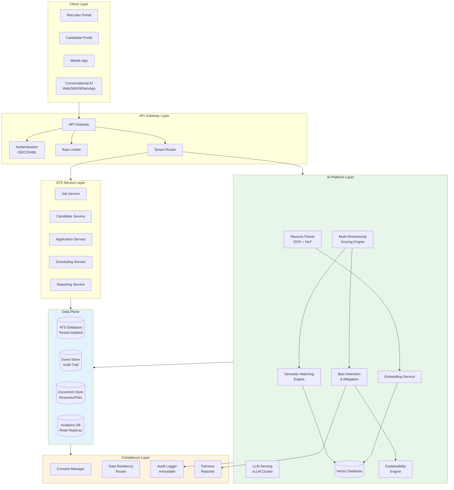

# AI Native ATS Cloud SaaS - System Design

[Back to System Design Index](../README.md)

---

## System Overview

An **AI Native ATS (Applicant Tracking System) Cloud SaaS** is a next-generation talent acquisition platform where artificial intelligence is embedded as a first-class architectural component rather than a bolt-on feature. Unlike traditional ATS platforms that rely on keyword matching and boolean filters, this system employs **semantic understanding** through self-hosted LLMs, achieving 87% accuracy in predicting job-candidate fit versus 52% for keyword-based approaches.

The defining architectural challenges include: (1) **self-hosted AI infrastructure** for privacy-first candidate data processing with no external API transmission, (2) **semantic matching engine** using vector embeddings for contextual understanding beyond keywords, (3) **multi-dimensional scoring** evaluating skills, experience, culture fit, and career trajectory simultaneously, (4) **bias detection and mitigation** with real-time fairness monitoring and explainable AI, and (5) **compliance-first design** supporting GDPR, CCPA, EEOC requirements, and EU AI Act (which classifies hiring as "high-risk" AI).

Modern AI-native ATS platforms like Workday Recruiting (ASOR multi-agent architecture), Ashby (citation-based AI with FairNow bias audits), and Paradox (conversational ATS with Olivia AI) demonstrate this architectural shift toward semantic understanding, autonomous agents, and privacy-preserving AI infrastructure.

---

## Autonomy Classification

**Tier: B — AI-Augmented**

| Boundary | Description |
|----------|-------------|
| **What AI decides alone** | Resume parsing and field extraction, embedding generation, semantic similarity computation, interview slot suggestions |
| **What AI recommends** | Candidate ranking and multi-dimensional scores, shortlist generation with evidence citations, bias mitigation adjustments |
| **What requires human approval** | Candidate advancement/rejection decisions, offer generation, scoring model updates, bias threshold configuration changes |
| **Deterministic source of truth** | ATS Database (candidate profiles, application state, hiring decisions) — AI scores are advisory; all hiring decisions require recruiter confirmation |
| **Rollback path** | Immutable audit trail of all AI scores and human decisions; model version rollback via registry; bias-flagged decisions automatically queued for human re-review |

---

## Key Characteristics

| Characteristic | Value | Implication |
|----------------|-------|-------------|
| **Traffic Pattern** | Read-heavy (recruiters reviewing), Write-spiky (application deadlines) | CQRS pattern, read replicas, queue-based ingestion |
| **Consistency Model** | Strong for applications/scores, Eventual for analytics | Hybrid consistency, event sourcing for audit |
| **Availability Target** | 99.9% core ATS, 99.5% AI scoring | Graceful AI degradation, fallback to basic matching |
| **Latency Target** | <200ms UI, <500ms AI scoring, <2s full ranking | Edge caching, pre-computed embeddings, async scoring |
| **Privacy Requirement** | Critical - candidate PII, self-hosted AI | Zero external API transmission, tenant encryption |
| **Compliance Requirement** | Multi-framework (GDPR, CCPA, EEOC, EU AI Act) | Bias auditing, right to explanation, data residency |
| **AI Integration** | Native - self-hosted LLMs, semantic matching | GPU infrastructure, vector DB, explainable AI |

---

## Complexity Rating

| Aspect | Rating | Reason |
|--------|--------|--------|
| **Overall** | Very High | AI infrastructure + compliance + bias mitigation + multi-tenancy |
| **Self-Hosted LLM Infrastructure** | Very High | GPU cluster management, model serving, inference optimization |
| **Semantic Matching Engine** | High | Vector embeddings, similarity computation, ranking algorithms |
| **Bias Detection & Mitigation** | High | Fairness metrics, real-time monitoring, explainable decisions |
| **Resume Parsing Pipeline** | High | OCR, NLP extraction, normalization across formats |
| **Compliance & Explainability** | High | GDPR/EEOC mapping, decision audit trails, right to explanation |
| **Multi-Tenant Data Isolation** | Medium | Tenant-specific encryption, data residency routing |

---

## Quick Navigation

| Document | Description |
|----------|-------------|
| [01 - Requirements & Estimations](./01-requirements-and-estimations.md) | Functional/Non-functional requirements, capacity planning, SLOs |
| [02 - High-Level Design](./02-high-level-design.md) | Architecture, AI platform, data flows, key decisions |
| [03 - Low-Level Design](./03-low-level-design.md) | Data model, API design, matching algorithms, scoring Step-by-step plan in plain English |
| [04 - Deep Dive & Bottlenecks](./04-deep-dive-and-bottlenecks.md) | Resume parsing, semantic matching, bias detection deep dives |
| [05 - Scalability & Reliability](./05-scalability-and-reliability.md) | GPU scaling, multi-tenant isolation, disaster recovery |
| [06 - Security & Compliance](./06-security-and-compliance.md) | GDPR/CCPA, EEOC compliance, bias auditing, explainability |
| [07 - Observability](./07-observability.md) | Metrics, logging, tracing, fairness dashboards |
| [08 - Interview Guide](./08-interview-guide.md) | 45-min pacing, trap questions, trade-offs |

---

## Core ATS Modules

| Module | Responsibility | AI Enhancement |
|--------|----------------|----------------|
| **Job Management** | Job descriptions, requirements, workflows | Skill extraction, requirement inference |
| **Candidate Intake** | Resume upload, profile creation, source tracking | Intelligent parsing, deduplication |
| **Screening & Scoring** | Candidate evaluation, qualification checks | Semantic matching, multi-dimensional scoring |
| **Interview Scheduling** | Calendar coordination, availability matching | Conversational AI, autonomous scheduling |
| **Pipeline Management** | Stage tracking, workflow automation | Predictive analytics, Slowest part of the process detection |
| **Offer Management** | Compensation, approval workflows | Market benchmarking, negotiation insights |
| **Analytics & Reporting** | Hiring metrics, funnel analysis | Bias auditing, quality-of-hire prediction |
| **Compliance & Audit** | EEOC reporting, decision trails | Explainability engine, fairness reports |

---

## AI Capabilities Matrix

| Capability | Technology | Use Cases |
|------------|------------|-----------|
| **Resume Parsing** | OCR + NLP + LLM extraction | Convert PDF/DOCX to structured profiles |
| **Semantic Matching** | Vector embeddings + similarity | Job-candidate fit beyond keywords |
| **Multi-Dimensional Scoring** | ML scoring + LLM reasoning | Skills, experience, culture, trajectory |
| **Conversational Screening** | LLM + dialog management | Candidate Q&A, qualification verification |
| **Interview Scheduling** | Conversational AI + calendar API | Autonomous scheduling via chat/SMS |
| **Bias Detection** | Fairness metrics + statistical analysis | Real-time disparate impact monitoring |
| **Explainable Decisions** | SHAP/LIME + citation generation | Decision reasoning with evidence |

---

## Architecture Overview



---

## AI-Native vs Traditional ATS

| Aspect | Traditional ATS | AI-Native ATS |
|--------|-----------------|---------------|
| **Resume Screening** | Keyword matching, boolean filters | Semantic understanding, contextual inference |
| **Candidate Ranking** | Manual sorting, simple scores | Multi-dimensional AI scoring (skills + experience + culture + trajectory) |
| **Matching Accuracy** | ~52% (keyword-based) | ~87% (semantic vectors) |
| **Scheduling** | Manual email coordination | Conversational AI (SMS/WhatsApp) |
| **Bias Detection** | Post-hoc annual audits | Real-time monitoring, proactive mitigation |
| **Explainability** | None | Decision citations, feature attribution, override capability |
| **AI Data Privacy** | External API calls (data leaves system) | Self-hosted LLM, zero external transmission |
| **Skill Inference** | Explicit keywords only | Implicit skill inference from context |

---

## When to Use This Design

**Use AI Native ATS When:**
- Organization requires data sovereignty (candidate data must not leave premises)
- High-volume hiring (>10K applications/month) requires automated screening
- Compliance mandates audit trails for AI hiring decisions (GDPR, EU AI Act)
- Quality-of-hire improvement is a strategic priority
- Conversational candidate experience differentiates employer brand
- Bias mitigation is a legal or ethical requirement

**Do NOT Use When:**
- Small hiring volume (<100 hires/year) - traditional ATS sufficient
- No AI compliance requirements - simpler solutions available
- Limited budget for GPU infrastructure
- No internal ML/AI operations expertise
- Simple job matching without semantic understanding needs

---

## Real-World Implementations

| System | Architecture | AI Innovation |
|--------|--------------|---------------|
| **Workday Recruiting + Illuminate** | ASOR multi-agent, 800B-parameter LLM | Autonomous agents for sourcing, screening, mobility |
| **Ashby** | Citation-based AI, no customer data training | FairNow bias audits, explainable recommendations |
| **Paradox (Olivia)** | Conversational ATS, multi-channel | SMS/WhatsApp scheduling, natural language screening |
| **SmartRecruiters (Winston)** | Hub-and-spoke, agentic AI (June 2025) | Autonomous multi-step recruiting workflows |
| **Eightfold AI** | Deep learning on 1.6B+ career profiles | Skills ontologies, career trajectory prediction |
| **HireVue** | Video AI, structured assessment | Multi-modal scoring (text 92% + video 90% + audio 88%) |

### Agentic Workflow Architecture (2025-2026)

```
┌─────────────────────────────────────────────────────────────────┐
│  AGENTIC ATS WORKFLOW                                           │
├─────────────────────────────────────────────────────────────────┤
│                                                                 │
│  Agent-driven autonomous hiring pipeline:                       │
│                                                                 │
│  1. SOURCING AGENT                                              │
│     • Scans candidate profiles across 850M+ records            │
│     • Semantic match against job description rubric             │
│     • Generates shortlist with evidence citations               │
│                                                                 │
│  2. OUTREACH AGENT                                              │
│     • Drafts personalized messages per candidate                │
│     • Omnichannel: email, LinkedIn, SMS                        │
│     • 48% response rate vs 8-12% manual outreach               │
│                                                                 │
│  3. SCREENING AGENT                                             │
│     • Conducts 24/7 voice/chat screening interviews            │
│     • Validates soft skills and functional knowledge            │
│     • Bias check before sharing shortlist with recruiter        │
│                                                                 │
│  4. SCHEDULING AGENT                                            │
│     • Calendar-aware, timezone-handling                         │
│     • Natural language via SMS/WhatsApp                        │
│     • Auto-reschedule on conflicts                             │
│                                                                 │
│  Human-in-the-loop: Recruiter approves final decisions         │
│  Result: 40-70% reduction in time-to-hire                      │
│                                                                 │
│  TRAPS Framework: Trusted, Responsible, Auditable,             │
│  Private, Secure                                                │
│                                                                 │
└─────────────────────────────────────────────────────────────────┘
```

---

## Technology Stack (Reference)

| Layer | Technology Options | Selection Criteria |
|-------|-------------------|-------------------|
| **LLM Serving** | vLLM, TensorRT-LLM, Triton | Throughput, GPU efficiency, latency |
| **Vector Database** | Milvus, Pinecone, Weaviate, Qdrant | Scale, hybrid search, filtering |
| **Embedding Models** | BGE, E5, Instructor, OpenAI Ada | Accuracy, inference speed, fine-tuning |
| **Resume Parsing** | Apache Tika, Textract, custom OCR | Format coverage, extraction quality |
| **NLP Extraction** | SpaCy, HuggingFace NER, LLM | Entity accuracy, customization |
| **ATS Database** | PostgreSQL, CockroachDB | ACID, multi-region, tenant isolation |
| **Event Store** | Kafka, Pulsar, EventStoreDB | Durability, replay, audit trails |
| **Fairness Tools** | FairML, AI Fairness 360, Aequitas | Bias metrics, debiasing algorithms |

---

## Quick Reference Card

```
┌─────────────────────────────────────────────────────────────────┐
│           AI NATIVE ATS CLOUD SAAS - QUICK REFERENCE            │
├─────────────────────────────────────────────────────────────────┤
│                                                                 │
│  SCALE TARGETS               KEY PATTERNS                       │
│  ─────────────               ────────────                       │
│  • 10K+ tenants              • Self-hosted LLM (vLLM)           │
│  • 1M candidates/month       • Semantic matching (vectors)      │
│  • 100M match scores/day     • Multi-dimensional scoring        │
│  • 10K concurrent users      • Conversational AI (scheduling)   │
│  • 99.9% availability        • Real-time bias detection         │
│                                                                 │
├─────────────────────────────────────────────────────────────────┤
│                                                                 │
│  ATS MODULES                 AI CAPABILITIES                    │
│  ───────────                 ───────────────                    │
│  • Job Management            • Resume parsing (OCR+NLP)         │
│  • Candidate Intake          • Semantic matching                │
│  • Screening/Scoring         • Multi-dim scoring                │
│  • Interview Scheduling      • Conversational AI                │
│  • Pipeline Management       • Bias detection                   │
│  • Offer Management          • Explainable decisions            │
│                                                                 │
├─────────────────────────────────────────────────────────────────┤
│                                                                 │
│  COMPLIANCE                  PRIVACY                            │
│  ──────────                  ───────                            │
│  • GDPR (Art. 22)            • Self-hosted LLM                  │
│  • CCPA/CPRA                 • Zero external API calls          │
│  • EEOC (4/5 rule)           • Tenant-specific encryption       │
│  • EU AI Act (high-risk)     • Data residency routing           │
│  • NYC bias audits           • Immutable audit logs             │
│                                                                 │
├─────────────────────────────────────────────────────────────────┤
│                                                                 │
│  INTERVIEW KEYWORDS                                             │
│  ─────────────────                                              │
│  Self-hosted LLM, Vector embeddings, Semantic matching,         │
│  Cosine similarity, SHAP/LIME, Disparate impact, 4/5 rule,      │
│  Right to explanation, Bias mitigation, Resume parsing,         │
│  Conversational ATS, Multi-dimensional scoring, EEOC, GDPR      │
│                                                                 │
└─────────────────────────────────────────────────────────────────┘
```

---

## Interview Readiness Checklist

| Topic | Must Know | Deep Dive |
|-------|-----------|-----------|
| Semantic Matching | Vector embeddings, cosine similarity | ANN algorithms (HNSW, IVF), hybrid search |
| Resume Parsing | OCR → NLP → normalization pipeline | Layout detection, entity extraction, format handling |
| Bias Detection | Disparate impact, 4/5 rule, protected classes | Fairness metrics (DI, SPD, EOD), debiasing techniques |
| Self-Hosted LLM | vLLM, GPU serving basics | PagedAttention, continuous batching, KV cache |
| Explainability | SHAP, LIME, feature attribution | Citation generation, decision trails |
| Compliance | GDPR Art. 22, EEOC, EU AI Act | NYC audit law, CCPA automated decision rights |
| Multi-Tenancy | Logical isolation, encryption | Data residency, tenant-specific keys |

---

## Related Patterns

| Pattern | Relationship | Link |
|---------|-------------|------|
| **AI Native Cloud ERP SaaS** | Shared AI platform architecture for enterprise SaaS | [2.18 AI Native ERP](../2.18-ai-native-cloud-erp-saas/00-index.md) |
| **RAG System** | RAG underpins resume-to-JD contextual matching | [3.15 RAG System](../3.15-rag-system/00-index.md) |
| **LLM Gateway & Prompt Management** | Prompt routing, cost control for multi-model ATS pipelines | [3.21 LLM Gateway](../3.21-llm-gateway-prompt-management/00-index.md) |
| **AI Guardrails & Safety** | Bias guardrails and fairness constraints for hiring AI | [3.22 AI Guardrails](../3.22-ai-guardrails-safety-system/00-index.md) |
| **AI Native Customer Service** | Shared conversational AI patterns for candidate chatbots | [3.33 AI Customer Service](../3.33-ai-native-customer-service-platform/00-index.md) |
| **Identity & Access Management** | AuthN/AuthZ, RBAC for multi-tenant ATS | [2.5 IAM](../2.5-identity-access-management/00-index.md) |
| **Event Sourcing System** | Immutable audit trails for compliance | [1.18 Event Sourcing](../1.18-event-sourcing-system/00-index.md) |
| **Feature Store** | Candidate feature pipelines for ML scoring models | [3.16 Feature Store](../3.16-feature-store/00-index.md) |

---

## References

- Workday Illuminate ASOR - Multi-agent architecture for talent acquisition
- Ashby AI Platform - Citation-based AI, FairNow bias auditing partnership
- Paradox Conversational ATS - Olivia AI for scheduling and screening
- EU AI Act - Emotion recognition in hiring banned (Feb 2025), full high-risk compliance mandatory (Aug 2026)
- NYC Local Law 144 - Annual bias audit requirements for automated employment decisions
- California FEHA AI Regulations (Oct 2025) - Meaningful human oversight, proactive bias testing
- AutoScreen-FW (2026) - LLM framework for resume screening via in-context learning
- Adversarial attacks on LLM resume screening - 80%+ success rate (arXiv 2512.20164)
- Multi-modal hiring assessment - Fusion scoring: text 92.3%, video 89.8%, audio 87.6% accuracy
- AI Fairness 360 - IBM toolkit for bias detection and mitigation
- Eightfold AI - Deep learning on 1.6B+ career profiles for skills ontology

---

> **Vendor freshness**: Product names and version numbers quoted in this document reflect publicly available information as of the document's last-updated date and may have changed since.
