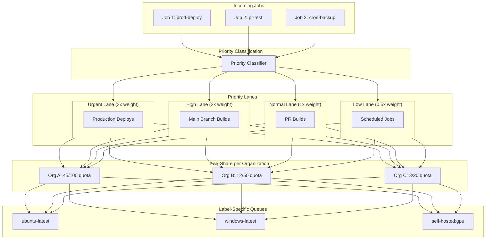
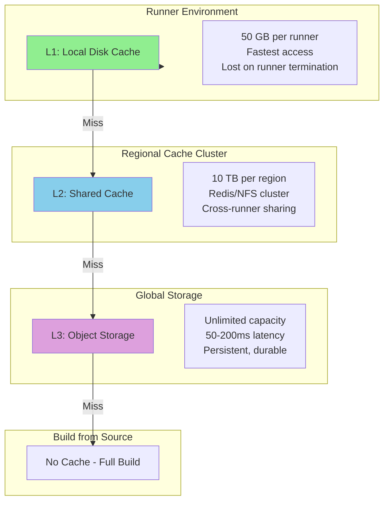
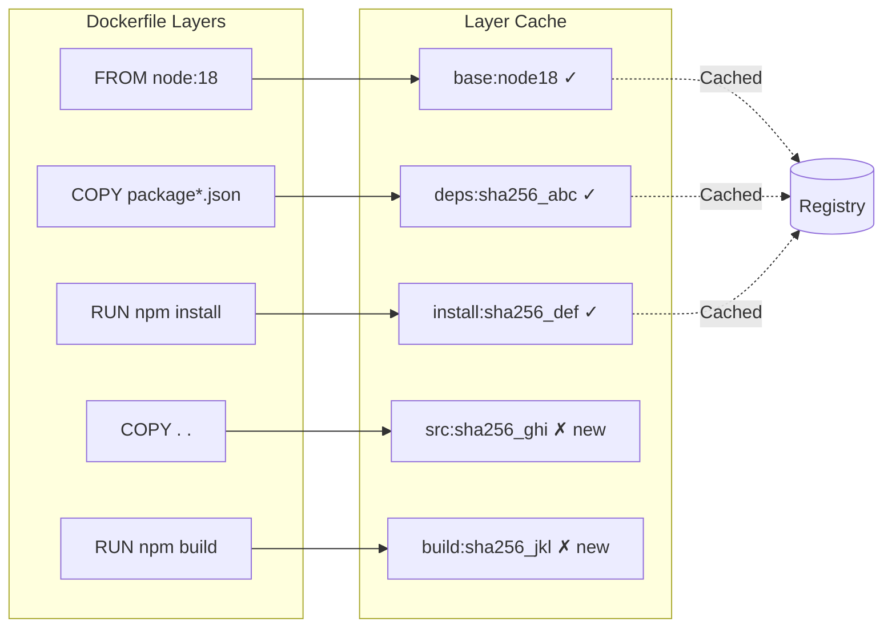
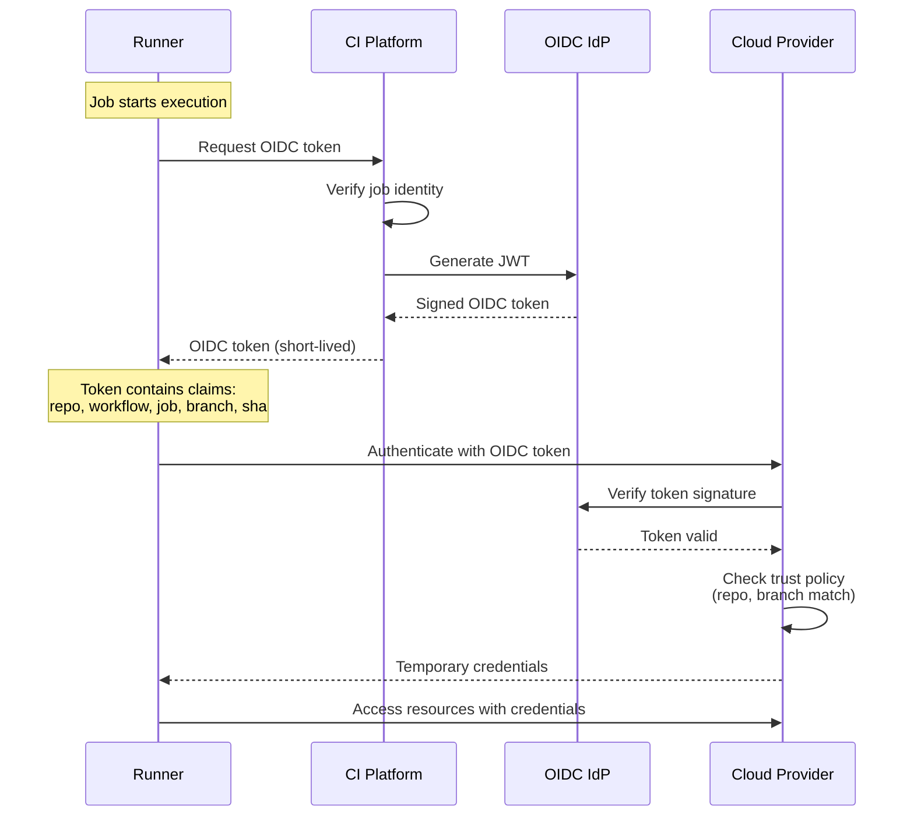
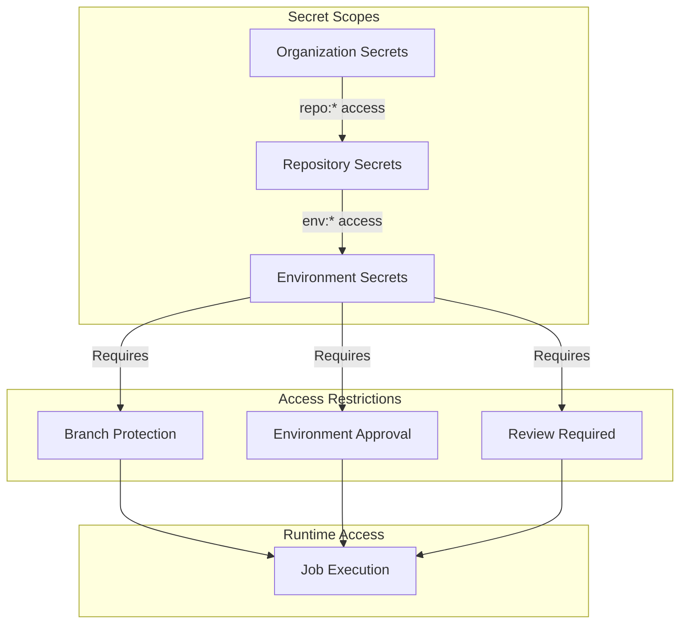

# Deep Dive & Bottlenecks

[← Back to Index](./00-index.md)

---

## Deep Dive 1: Job Scheduling at Scale

### The Scheduling Challenge

At 100K+ concurrent jobs with bursty traffic patterns, the scheduler must:
- Process 10K+ job decisions per second at peak
- Balance priority (urgent deployments) with fairness (prevent starvation)
- Handle heterogeneous runner labels (ubuntu-latest, windows, self-hosted, gpu)
- React quickly to runner availability changes

### Multi-Level Queue Architecture



### Fair-Share Algorithm

The scheduler implements a Dominant Resource Fairness (DRF) inspired algorithm:

```python
def calculate_org_priority_modifier(org_id):
    """
    Calculate priority modifier based on organization's resource usage.

    Returns value between 0.5 (penalized) and 1.5 (boosted):
    - Orgs using 0% of quota get 1.5x priority
    - Orgs using 100% of quota get 1.0x priority
    - Orgs using 200%+ of quota get 0.5x priority
    """
    running_jobs = get_running_jobs(org_id)
    quota = get_org_quota(org_id)

    if quota == 0:
        return 0.5  # No quota = minimum priority

    usage_ratio = running_jobs / quota

    if usage_ratio <= 0:
        return 1.5
    elif usage_ratio >= 2.0:
        return 0.5
    else:
        # Linear interpolation: 1.5 at 0%, 0.5 at 200%
        return 1.5 - (usage_ratio * 0.5)

def select_next_job(available_runners):
    """
    Select highest effective priority job matching available runners.
    """
    best_job = None
    best_score = -1

    for runner in available_runners:
        compatible_queues = get_queues_for_labels(runner.labels)

        for queue in compatible_queues:
            job = peek_highest_priority(queue)
            if job:
                effective_score = calculate_effective_score(job)
                if effective_score > best_score:
                    best_job = job
                    best_score = effective_score
                    best_runner = runner

    if best_job:
        claim_job(best_job, best_runner)

    return best_job, best_runner
```

### Queue Sharding Strategy

To avoid single-queue bottlenecks:

```
Label Hash Sharding:
- Jobs with labels ["ubuntu-latest"] → queue:hash("ubuntu-latest") → queue:a3f2
- Jobs with labels ["ubuntu-latest", "self-hosted"] → queue:hash("self-hosted,ubuntu-latest") → queue:7b91

Partition Strategy:
- 256 queue shards
- Consistent hashing on sorted label string
- Each scheduler instance handles subset of shards
- Leader election per shard for exactly-once assignment
```

---

## Deep Dive 2: Build Caching Architecture

### Cache Hierarchy



### Cache Key Strategy

```yaml
# Example workflow cache configuration
- name: Cache node modules
  uses: actions/cache@v3
  with:
    path: ~/.npm
    key: ${{ runner.os }}-node-${{ hashFiles('**/package-lock.json') }}
    restore-keys: |
      ${{ runner.os }}-node-
      ${{ runner.os }}-
```

**Key Generation Algorithm:**

```python
def generate_cache_key(spec, context):
    """
    Build deterministic cache key from specification.

    Components (in order):
    1. Explicit prefix (user-defined)
    2. Platform (os-arch)
    3. File content hash (lockfiles)
    4. Environment variables (if specified)
    """
    components = []

    # Prefix provides namespace
    components.append(spec.prefix or "cache")

    # Platform ensures binary compatibility
    components.append(f"{context.os}-{context.arch}")

    # Content hash captures dependency versions
    if spec.hash_files:
        file_hash = hash_files(spec.hash_files)
        components.append(file_hash[:16])

    return "-".join(components)

def hash_files(patterns):
    """SHA-256 of matched file contents."""
    hasher = hashlib.sha256()

    files = []
    for pattern in patterns:
        files.extend(glob.glob(pattern, recursive=True))

    for f in sorted(files):  # Deterministic order
        hasher.update(f.encode())  # Include path
        hasher.update(open(f, 'rb').read())

    return hasher.hexdigest()
```

### Cache Invalidation Patterns

| Scenario | Invalidation Trigger | Strategy |
|----------|---------------------|----------|
| Lockfile change | File hash differs | New key, old cache unused |
| Major version bump | User updates prefix | New namespace |
| Cache corruption | Checksum mismatch on restore | Delete and rebuild |
| TTL expiration | Time-based (7-30 days) | LRU eviction |
| Manual purge | User API call | Delete all matching keys |

### Docker Layer Caching



**Optimization techniques:**
1. **Inline cache** - Push cache metadata to registry with image
2. **Cache-from** - Pull cache layers from previous builds
3. **BuildKit cache mounts** - Persistent package manager caches

---

## Deep Dive 3: Secrets Management

### OIDC-Based Authentication Flow



### Token Claims Structure

```json
{
  "iss": "https://token.actions.example.com",
  "sub": "repo:org/repo:ref:refs/heads/main",
  "aud": "https://example.com",
  "exp": 1642345678,
  "iat": 1642342078,

  "repository": "org/repo",
  "repository_owner": "org",
  "workflow": "deploy.yml",
  "job_workflow_ref": "org/repo/.github/workflows/deploy.yml@refs/heads/main",
  "ref": "refs/heads/main",
  "sha": "abc123def456",
  "actor": "username",
  "event_name": "push",
  "environment": "production",
  "runner_environment": "github-hosted"
}
```

### Secret Scoping and Restrictions



### Secret Injection Security

```python
class SecretInjector:
    """
    Securely inject secrets into job execution environment.
    """

    def prepare_secrets(self, job, job_token):
        """
        Prepare encrypted secrets bundle for runner.
        """
        # 1. Resolve applicable secrets based on scope
        secrets = self.resolve_secrets(job)

        # 2. Check environment protection rules
        if job.environment:
            self.check_environment_rules(job)

        # 3. Filter secrets based on branch/tag restrictions
        filtered = self.filter_by_restrictions(secrets, job)

        # 4. Encrypt bundle with job-specific key
        encrypted = self.encrypt_bundle(filtered, job_token)

        # 5. Generate OIDC token if configured
        oidc_token = self.generate_oidc_token(job)

        return {
            'encrypted_secrets': encrypted,
            'oidc_token': oidc_token,
            'key_id': job_token.key_id
        }

    def mask_in_logs(self, log_line, secrets):
        """
        Replace secret values with *** in log output.
        """
        masked = log_line
        for secret in secrets:
            # Mask the value
            masked = masked.replace(secret.value, '***')
            # Also mask common encodings
            masked = masked.replace(base64.b64encode(secret.value), '***')
            masked = masked.replace(urllib.parse.quote(secret.value), '***')
        return masked
```

---

## Slowest part of the process Analysis

### Slowest part of the process 1: Queue Contention at Scale

**Problem:** Single Redis instance becomes Slowest part of the process at 50K+ operations/second.

**Symptoms:**
- High latency on ZADD/ZPOPMAX operations
- Redis CPU saturation
- Job pickup latency increases

**Solutions:**

```
1. Redis Cluster with Queue Sharding
   - Shard queues by label hash
   - Each shard handles subset of label combinations
   - Horizontal scaling: add shards as load increases

2. Local Scheduler Caches
   - Scheduler caches available runners locally
   - Reduces Redis reads for runner state
   - Eventual consistency acceptable (heartbeat interval)

3. Batch Operations
   - Batch multiple job enqueues in pipeline
   - Reduce round-trips to Redis
   - Trade latency for throughput

Implementation:
┌─────────────┐     ┌─────────────┐     ┌─────────────┐
│ Scheduler 1 │     │ Scheduler 2 │     │ Scheduler 3 │
└──────┬──────┘     └──────┬──────┘     └──────┬──────┘
       │                   │                   │
       ▼                   ▼                   ▼
┌──────────────────────────────────────────────────────┐
│                  Redis Cluster                        │
│ ┌─────────┐ ┌─────────┐ ┌─────────┐ ┌─────────┐     │
│ │ Shard 1 │ │ Shard 2 │ │ Shard 3 │ │ Shard N │     │
│ │ a-f     │ │ g-m     │ │ n-s     │ │ t-z     │     │
│ └─────────┘ └─────────┘ └─────────┘ └─────────┘     │
└──────────────────────────────────────────────────────┘
```

### Slowest part of the process 2: Artifact Upload Throughput

**Problem:** End of parallel jobs causes artifact upload storm.

**Symptoms:**
- Object storage rate limiting
- Upload failures, retries
- Pipeline completion delays

**Solutions:**

```
1. Multipart Upload with Parallelism
   - Split large artifacts into chunks
   - Upload chunks in parallel (10-50 concurrent)
   - Assemble on completion

2. Pre-signed URL Offloading
   - Generate signed URLs from control plane
   - Runners upload directly to storage
   - Reduces control plane bandwidth

3. Regional Upload Endpoints
   - Route to nearest storage region
   - CDN for download acceleration
   - Cross-region replication async

4. Rate Limiting with Backoff
   - Per-org upload rate limits
   - Exponential backoff on 429
   - Priority for smaller artifacts

Upload Pipeline:
┌────────┐    ┌─────────────┐    ┌────────────────┐
│ Runner │───>│ Get Signed  │───>│ Direct Upload  │
│        │    │ URL from    │    │ to Object      │
│        │    │ Control     │    │ Storage        │
└────────┘    │ Plane       │    └────────────────┘
              └─────────────┘           │
                                        ▼
                               ┌────────────────┐
                               │ Confirm Upload │
                               │ to Control     │
                               │ Plane          │
                               └────────────────┘
```

### Slowest part of the process 3: Log Aggregation Throughput

**Problem:** 10M+ log lines/second from concurrent jobs.

**Symptoms:**
- Log delivery latency > 5s
- Dropped log lines
- Log service saturation

**Solutions:**

```
1. Local Buffering with Batch Flush
   - Buffer logs in runner memory
   - Flush every 100 lines or 1 second
   - Reduce API call overhead

2. Dedicated Log Ingestion Pipeline
   - Separate from control plane
   - Kafka/Kinesis for high throughput
   - Consumers write to log storage

3. Log Compression
   - Gzip compression at runner
   - 5-10x reduction in bandwidth
   - Decompress on read

4. Tiered Log Storage
   - Hot: Elasticsearch (7 days)
   - Warm: Object storage (30 days)
   - Cold: Compressed archive (90 days)

Architecture:
┌──────────┐    ┌──────────────┐    ┌─────────────┐
│ Runners  │───>│ Log Ingestion│───>│ Kafka       │
│ (batch)  │    │ Gateway      │    │ Partitioned │
└──────────┘    └──────────────┘    │ by job_id   │
                                    └──────┬──────┘
                                           │
                    ┌──────────────────────┼───────────────────────┐
                    ▼                      ▼                       ▼
            ┌──────────────┐      ┌──────────────┐       ┌──────────────┐
            │ Elasticsearch│      │ Live Stream  │       │ Object       │
            │ (Search)     │      │ (WebSocket)  │       │ Storage      │
            └──────────────┘      └──────────────┘       └──────────────┘
```

### Slowest part of the process 4: Runner Startup Latency

**Problem:** Cold runner startup adds 30-60s to job execution.

**Symptoms:**
- High p99 job pickup latency
- Poor utilization during ramp-up
- User complaints about slow starts

**Solutions:**

```
1. Warm Pool Maintenance
   - Keep percentage of runners warm
   - Pre-boot during low-traffic periods
   - Predictive scaling based on patterns

2. MicroVM Snapshot Restore
   - Firecracker snapshot after base init
   - Restore in ~125ms vs 30s boot
   - Pre-cached base images

3. Container Pre-pulling
   - Pull common images during idle
   - Layer cache across runners
   - Parallel image pulls

4. Runner Affinity
   - Route similar jobs to same runner
   - Maximize cache reuse
   - Reduce setup time

Warm Pool Strategy:
Time       ──────────────────────────────────────>
Load:      ▁▁▂▂▃▄▅▆▇█▇▆▅▄▃▂▂▁▁▁▁▁▁▂▃▄▅▆█
Warm Pool: ▂▂▂▂▃▃▄▅▆▇▇▆▅▄▃▃▂▂▂▂▂▂▃▃▄▅▆▇

- Scale warm pool ahead of expected load
- Use historical patterns (day of week, hour)
- Monitor queue depth for reactive scaling
```

---

## Race Conditions & Edge Cases

### Race Condition 1: Duplicate Job Execution

**Scenario:** Network partition causes scheduler to assign same job twice.

```python
# Problem: Two runners claim same job
Runner A: ZPOPMAX queue:ubuntu → job_123
Runner B: ZPOPMAX queue:ubuntu → job_123 (before A's removal propagates)

# Solution: Distributed lock with atomic claim
def claim_job(job_id, runner_id):
    # Atomic lock acquisition
    lock_key = f"job_lock:{job_id}"
    acquired = redis.set(lock_key, runner_id, nx=True, ex=300)

    if not acquired:
        return None  # Another runner claimed it

    # Verify job still in queue and remove
    removed = redis.zrem(f"queue:{job.labels_hash}", job_id)
    if removed == 0:
        redis.delete(lock_key)
        return None  # Job was already claimed

    # Update database state
    db.update_job_status(job_id, 'running', runner_id)

    return job_id
```

### Race Condition 2: DAG Dependency Resolution

**Scenario:** Two jobs complete simultaneously, both try to unblock same dependent.

```python
# Problem: Both jobs decrement dependency counter
Job A completes: deps_remaining[C] = 2 - 1 = 1
Job B completes: deps_remaining[C] = 2 - 1 = 1  # Wrong! Should be 0

# Solution: Atomic decrement with Lua script
DECR_AND_CHECK = """
local remaining = redis.call('DECR', KEYS[1])
if remaining == 0 then
    redis.call('LPUSH', KEYS[2], ARGV[1])  -- Add to runnable queue
    return 1
end
return 0
"""

def on_job_complete(job_id, run_id):
    for dependent in get_dependents(job_id):
        key = f"dag:{run_id}:{dependent}:deps"
        queue = f"runnable:{run_id}"
        result = redis.eval(DECR_AND_CHECK, [key, queue], [dependent])
        if result == 1:
            notify_scheduler(dependent)
```

### Edge Case (Unusual or extreme situation): Circular Dependency Detection

```python
def validate_workflow(workflow_def):
    """Detect cycles in job dependencies."""
    jobs = workflow_def['jobs']
    graph = {name: job.get('needs', []) for name, job in jobs.items()}

    visited = set()
    rec_stack = set()

    def has_cycle(node):
        visited.add(node)
        rec_stack.add(node)

        for neighbor in graph.get(node, []):
            if neighbor not in visited:
                if has_cycle(neighbor):
                    return True
            elif neighbor in rec_stack:
                return True

        rec_stack.remove(node)
        return False

    for job_name in jobs:
        if job_name not in visited:
            if has_cycle(job_name):
                raise ValidationError(f"Circular dependency detected involving {job_name}")
```

### Edge Case (Unusual or extreme situation): Runner Crash Mid-Job

```python
def detect_stale_jobs():
    """
    Find jobs where runner stopped heartbeating.
    Requeue for execution on different runner.
    """
    stale_threshold = timedelta(minutes=5)

    stale_jobs = db.query("""
        SELECT j.id, j.runner_id
        FROM jobs j
        JOIN runners r ON j.runner_id = r.id
        WHERE j.status = 'running'
        AND r.last_heartbeat < NOW() - INTERVAL '5 minutes'
    """)

    for job in stale_jobs:
        # Mark runner as offline
        db.update_runner_status(job.runner_id, 'offline')

        # Requeue job (idempotent)
        requeue_job(job.id, reason='runner_timeout')

def requeue_job(job_id, reason):
    """Requeue job for retry on different runner."""
    job = db.get_job(job_id)

    if job.retry_count >= MAX_RETRIES:
        db.update_job_status(job_id, 'failed', conclusion='runner_failure')
        return

    db.execute("""
        UPDATE jobs
        SET status = 'queued',
            runner_id = NULL,
            retry_count = retry_count + 1,
            queued_at = NOW()
        WHERE id = %s
    """, (job_id,))

    # Re-add to queue
    scheduler.enqueue_job(job)
```

---

## Deep Dive 4: Merge Queue with Speculative Execution

### The Broken-Main Problem

When multiple PRs merge in rapid succession, each tested against a stale base:

```
Timeline:
  t=0:  main = commit A
  t=1:  PR#1 tests against A → PASS
  t=2:  PR#2 tests against A → PASS
  t=3:  PR#1 merges → main = A + PR#1
  t=4:  PR#2 merges → main = A + PR#1 + PR#2
                       ↑ PR#2 was never tested against A + PR#1!

Semantic conflict example:
  PR#1: Renames function foo() → bar()
  PR#2: Adds new call to foo()
  Both pass CI independently. Combined: broken main (foo undefined).
```

### Speculative Merge Algorithm

```python
class MergeQueue:
    """
    Serialized merge queue with speculative execution.
    Guarantees every commit on main has passed CI against
    the exact state it will land on.
    """

    def __init__(self, config):
        self.queue = []              # Ordered list of PRs
        self.max_lookahead = config.get('lookahead', 5)
        self.batch_size = config.get('batch_size', 3)
        self.speculative_runs = {}   # pr_id → ci_run

    def add_to_queue(self, pr, priority='normal'):
        """Add PR to merge queue at appropriate position."""
        position = len(self.queue)

        if priority == 'hotfix':
            position = 0  # Front of queue

        self.queue.insert(position, pr)
        self.trigger_speculative_tests()

    def trigger_speculative_tests(self):
        """
        Launch CI runs for queued PRs with speculative base commits.

        Each PR is tested against main + all preceding PRs in queue.
        """
        base = self.get_main_head()

        for i, pr in enumerate(self.queue[:self.max_lookahead]):
            speculative_base = self.create_merge_commit(
                base=base,
                branches=[p.head_sha for p in self.queue[:i]],
                target=pr.head_sha
            )

            if self.needs_retest(pr, speculative_base):
                run = self.create_ci_run(pr, speculative_base)
                self.speculative_runs[pr.id] = run

    def on_ci_complete(self, pr_id, result):
        """Handle CI completion for a queued PR."""
        pr = self.find_in_queue(pr_id)

        if result == 'success' and self.is_first_in_queue(pr):
            # First in queue passed - merge it
            self.merge_pr(pr)
            self.queue.remove(pr)

            # Speculative results for subsequent PRs may still be valid
            self.validate_speculative_results()

        elif result == 'failure':
            # Remove from queue, invalidate dependent speculative results
            position = self.queue.index(pr)
            self.queue.remove(pr)
            self.notify_author(pr, 'merge_queue_failure')

            # Invalidate all speculative results after this position
            for subsequent_pr in self.queue[position:]:
                if subsequent_pr.id in self.speculative_runs:
                    self.cancel_run(self.speculative_runs[subsequent_pr.id])
                    del self.speculative_runs[subsequent_pr.id]

            # Re-trigger speculative tests with updated queue
            self.trigger_speculative_tests()

    def validate_speculative_results(self):
        """
        Check if speculative results are still valid after queue changes.

        A speculative result is valid if and only if the base commit
        it was tested against matches the current expected merge base.
        """
        base = self.get_main_head()

        for i, pr in enumerate(self.queue[:self.max_lookahead]):
            expected_base = self.create_merge_commit(
                base=base,
                branches=[p.head_sha for p in self.queue[:i]],
                target=pr.head_sha
            )

            run = self.speculative_runs.get(pr.id)
            if run and run.base_sha != expected_base:
                # Base changed - speculative result invalid
                self.cancel_run(run)
                del self.speculative_runs[pr.id]

        # Re-test any PRs that lost their speculative runs
        self.trigger_speculative_tests()
```

### Queue Partitioning for Monorepos

```
Monorepo with independent paths can run parallel merge queues:

Path-Based Partitions:
  /frontend/**  → Queue A (frontend team)
  /backend/**   → Queue B (backend team)
  /shared/**    → Queue C (blocks both A and B)

Queue A: [PR#1, PR#3, PR#5]  ← test independently
Queue B: [PR#2, PR#4]         ← test independently
Queue C: [PR#6]               ← blocks A and B until merged

Conflict detection:
  If PR touches files in multiple partitions → assign to shared queue
  If PR in partition A depends on PR in partition C → wait for C first
```

---

## Deep Dive 5: Flaky Test Detection and Quarantine

### Statistical Detection Model

```python
class FlakyTestDetector:
    """
    Detect flaky tests using statistical analysis of test results
    across multiple CI runs.
    """

    def __init__(self, config):
        self.min_samples = config.get('min_samples', 50)
        self.quarantine_threshold = config.get('quarantine_threshold', 0.03)  # 3%
        self.unquarantine_threshold = config.get('unquarantine_threshold', 0.01)  # 1%
        self.window_size = config.get('window_size', 100)  # Rolling window

    def record_test_result(self, test_id, passed, run_id, metadata):
        """Record individual test result for tracking."""
        db.test_results.insert({
            'test_id': test_id,
            'passed': passed,
            'run_id': run_id,
            'timestamp': datetime.utcnow(),
            'branch': metadata.get('branch'),
            'runner_labels': metadata.get('runner_labels'),
            'commit_sha': metadata.get('commit_sha')
        })

    def analyze_test(self, test_id):
        """
        Analyze test flakiness using sliding window.

        Returns:
            FlakinessReport with failure_rate, sample_count, verdict
        """
        results = db.test_results.find(
            {'test_id': test_id},
            sort=[('timestamp', -1)],
            limit=self.window_size
        )

        if len(results) < self.min_samples:
            return FlakinessReport(
                test_id=test_id,
                sample_count=len(results),
                verdict='insufficient_data'
            )

        failure_count = sum(1 for r in results if not r['passed'])
        failure_rate = failure_count / len(results)

        # Check for environment-specific flakiness
        env_analysis = self.analyze_by_environment(test_id, results)

        # Check for time-of-day correlation
        time_analysis = self.analyze_by_time(test_id, results)

        verdict = 'stable'
        if failure_rate > self.quarantine_threshold:
            verdict = 'quarantine'
        elif failure_rate > self.unquarantine_threshold:
            verdict = 'warning'

        return FlakinessReport(
            test_id=test_id,
            failure_rate=failure_rate,
            sample_count=len(results),
            verdict=verdict,
            env_correlation=env_analysis,
            time_correlation=time_analysis
        )

    def auto_quarantine(self, test_id):
        """Move flaky test to quarantine suite."""
        db.quarantined_tests.upsert({
            'test_id': test_id,
            'quarantined_at': datetime.utcnow(),
            'reason': 'auto_detected',
            'failure_rate': self.get_failure_rate(test_id)
        })

        # Notify test owner
        owner = self.resolve_test_owner(test_id)
        notify(owner, f"Test {test_id} quarantined: "
               f"{self.get_failure_rate(test_id):.1%} failure rate")

    def check_unquarantine(self, test_id):
        """
        Check if quarantined test has been fixed.
        Uses quarantine-mode results (runs but doesn't block).
        """
        recent_results = db.test_results.find(
            {'test_id': test_id, 'quarantine_mode': True},
            sort=[('timestamp', -1)],
            limit=self.min_samples
        )

        if len(recent_results) < self.min_samples:
            return False

        failure_rate = sum(1 for r in recent_results if not r['passed']) / len(recent_results)

        if failure_rate <= self.unquarantine_threshold:
            db.quarantined_tests.delete({'test_id': test_id})
            owner = self.resolve_test_owner(test_id)
            notify(owner, f"Test {test_id} un-quarantined: "
                   f"failure rate dropped to {failure_rate:.1%}")
            return True

        return False
```

### Impact of Flaky Tests on Pipeline Reliability

```
Suite of N independent tests, each with flakiness rate f:

Pipeline failure probability = 1 - (1-f)^N

f=1%,  N=100:  1 - 0.99^100 = 63.4% pipeline failure rate
f=2%,  N=100:  1 - 0.98^100 = 86.7% pipeline failure rate
f=5%,  N=100:  1 - 0.95^100 = 99.4% pipeline failure rate
f=1%,  N=500:  1 - 0.99^500 = 99.3% pipeline failure rate

Even 1% per-test flakiness destroys CI reliability at scale.
Quarantine reduces N_effective by removing flaky tests from blocking path.
```
