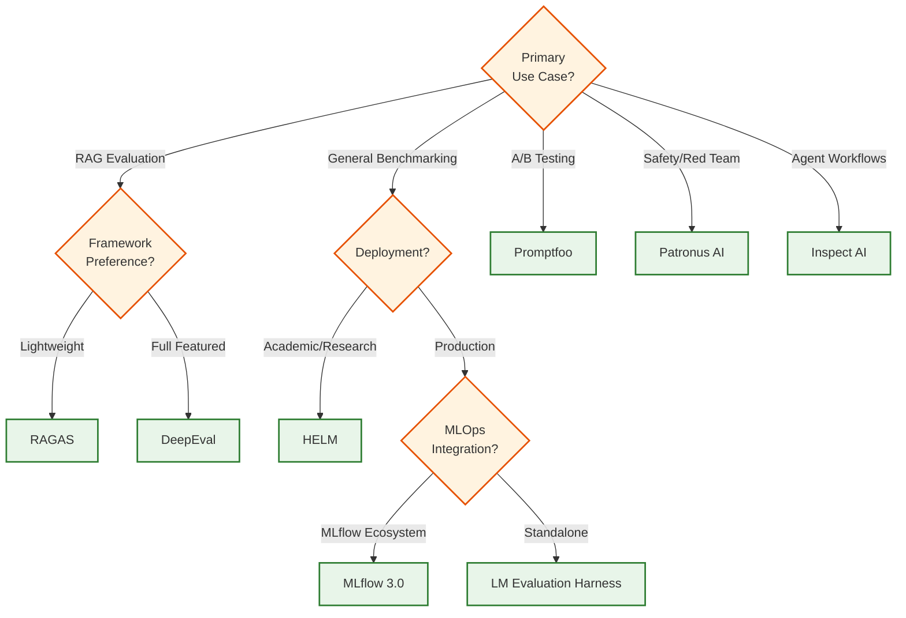
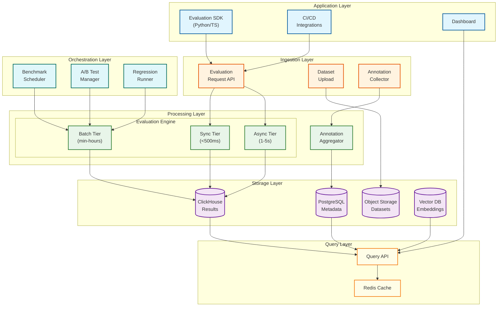

# AI Model Evaluation & Benchmarking Platform

## System Overview

An AI Model Evaluation & Benchmarking Platform provides systematic quality assessment, ground truth management, and benchmarking capabilities for LLM applications. Unlike observability platforms (which focus on runtime monitoring and debugging), this system emphasizes measuring model quality through automated evaluation, human annotation, standardized benchmarks, and A/B testing.

The platform enables teams to evaluate model outputs using LLM-as-Judge, programmatic metrics, and human feedback; manage versioned datasets with ground truth; run benchmark suites like MMLU and HumanEval; conduct statistically rigorous A/B tests; and detect quality regressions in CI/CD pipelines.

**Complexity Rating:** `High`

---

## Autonomy Classification

**Tier: A — AI-Assisted**

This is an **observability and analysis system** where AI processes data and surfaces insights but performs no system writes. The platform benchmarks models against evaluation datasets and surfaces quality metrics without modifying production model deployments.

| Boundary | AI Role | Human/System Authority |
|----------|---------|----------------------|
| **System of Record** | Owned by upstream source systems; AI reads only | Source system owners |
| **System of Intelligence** | Monitoring, analysis, pattern detection, evaluation, and reporting | AI analytics layer |
| **Action Boundary** | Read-only — generates dashboards, reports, and alerts; never modifies monitored systems | Operators act on insights |
| **Human Override** | ML engineers review evaluation results and decide on model promotion or rollback | Domain expert |
| **Rollback Path** | No AI-initiated writes to roll back; historical views available natively | Time-range selectors restore prior state |

---

## Quick Navigation

| Document | Description |
|----------|-------------|
| [01 - Requirements & Estimations](./01-requirements-and-estimations.md) | Functional/non-functional requirements, capacity planning |
| [02 - High-Level Design](./02-high-level-design.md) | System architecture, evaluation pipelines, data flows |
| [03 - Low-Level Design](./03-low-level-design.md) | Data models, APIs, core algorithms |
| [04 - Deep Dive & Bottlenecks](./04-deep-dive-and-bottlenecks.md) | Critical components, cost optimization |
| [05 - Scalability & Reliability](./05-scalability-and-reliability.md) | Scaling strategies, fault tolerance |
| [06 - Security & Compliance](./06-security-and-compliance.md) | Data protection, EU AI Act, audit trails |
| [07 - Observability](./07-observability.md) | Meta-observability (monitoring the platform itself) |
| [08 - Interview Guide](./08-interview-guide.md) | Pacing, trap questions, trade-offs |

---

## Key Characteristics

| Characteristic | Description |
|----------------|-------------|
| **Multi-Evaluator Architecture** | Combines LLM-as-Judge, programmatic scorers, and human annotation |
| **Dataset-Centric** | Versioned test datasets with ground truth management |
| **Benchmark Native** | First-class support for standard suites (MMLU, HumanEval, HellaSwag) |
| **Statistical Rigor** | A/B testing with frequentist and Bayesian significance testing |
| **Cost-Aware** | Tiered evaluation strategies to manage LLM-as-Judge expenses |
| **CI/CD Integration** | Regression testing gates for model and prompt changes |
| **Human-in-the-Loop** | Annotation workflows with inter-annotator agreement tracking |

---

## Evaluation vs Observability

| Aspect | Evaluation (This System) | Observability (3.25) |
|--------|--------------------------|----------------------|
| **Primary Goal** | Measure quality systematically | Monitor runtime behavior |
| **Timing** | Pre-production + periodic | Production real-time |
| **Ground Truth** | Required for many evaluations | Not applicable |
| **Human Involvement** | Core workflow (annotation) | Exception handling |
| **Datasets** | Curated test sets | Production traffic |
| **Output** | Quality scores, benchmarks | Traces, metrics, alerts |

---

## Platform Comparison (2025-2026)

| Platform | Type | Strengths | Best For |
|----------|------|-----------|----------|
| **DeepEval** | OSS Framework | 14+ metrics, Pytest-like, G-Eval | CI/CD integration, RAG evaluation |
| **RAGAS** | OSS Framework | RAG Triad metrics, agentic extensions | RAG-specific evaluation |
| **LM Evaluation Harness** | OSS Framework | 250+ tasks, powers Open LLM Leaderboard | Standardized benchmarking |
| **Promptfoo** | OSS Tool | A/B testing, security testing, 51K+ users | Prompt comparison, red teaming |
| **HELM** | Academic | Holistic evaluation, VHELM/HEIM multimodal | Research, comprehensive benchmarks |
| **Patronus AI** | Commercial | Lynx evaluator, safety-first | Enterprise safety evaluation |
| **MLflow 3.0** | OSS Platform | GenAI evals, hallucination detection | MLOps integration |
| **Inspect AI** | OSS Framework | Agentic evaluation, UK AI Safety Institute | Agent workflow testing |

### Platform Selection Decision Tree

---

## Core Capabilities

### LLM-as-Judge Evaluation

Automated quality assessment using LLMs:

| Method | Description | Accuracy | Cost |
|--------|-------------|----------|------|
| **G-Eval** | Chain-of-thought prompting with rubrics | 80-85% human agreement | $0.002/eval |
| **Pairwise Comparison** | Judge picks better of two outputs | 85%+ for relative ranking | $0.003/eval |
| **Reference-Free** | Score without ground truth | 75-80% correlation | $0.002/eval |
| **Multi-Criteria** | Score across multiple dimensions | Varies by criterion | $0.005/eval |

### Benchmark Suite Management

Standard evaluation suites:

| Benchmark | Tasks | Domain | Metrics |
|-----------|-------|--------|---------|
| **MMLU** | 57 subjects, 14K+ questions | General knowledge | Accuracy |
| **MMLU-Pro** | Harder variant, 10 options | Advanced reasoning | Accuracy |
| **HumanEval** | 164 problems | Code generation | Pass@k |
| **HellaSwag** | 10K sentences | Commonsense | Accuracy |
| **TruthfulQA** | 817 questions | Factuality | MC1/MC2/Bleu |
| **GSM8K** | 8.5K problems | Math reasoning | Exact match |
| **GPQA** | Graduate-level science | Expert knowledge | Accuracy |

### Human Annotation System

Structured labeling workflows:

| Capability | Description |
|------------|-------------|
| **Task Management** | Create annotation projects with instructions and schemas |
| **Multi-Annotator** | Assign items to multiple annotators for agreement |
| **Agreement Metrics** | Krippendorff's Alpha, Cohen's Kappa, Fleiss' Kappa |
| **Calibration** | Intersperse known items to detect quality degradation |
| **Consensus Resolution** | Adjudication workflows for disagreements |
| **Ground Truth Export** | Resolved annotations become ground truth |

### A/B Testing Framework

Statistically rigorous experimentation:

| Feature | Description |
|---------|-------------|
| **Experiment Configuration** | Define variants, traffic allocation, primary metrics |
| **Statistical Methods** | Frequentist (t-test) and Bayesian analysis |
| **Guardrail Metrics** | Safety thresholds that halt experiments |
| **Sequential Testing** | Early stopping with valid p-values |
| **Effect Size** | Cohen's d for practical significance |

### Regression Testing Engine

CI/CD integration for quality gates:

| Feature | Description |
|---------|-------------|
| **Baseline Management** | Store expected scores for comparison |
| **Threshold Alerts** | Fail builds on significant degradation |
| **Diff Reports** | Highlight changed test cases |
| **Prompt Versioning** | Track which prompt version produced which scores |
| **Model Versioning** | Evaluate new model versions against baselines |

---

## Architecture Overview

---

## Key Metrics Reference

### Latency Targets

| Operation | P50 | P95 | P99 |
|-----------|-----|-----|-----|
| Sync evaluation (programmatic) | 20ms | 100ms | 200ms |
| Sync evaluation (fast LLM) | 200ms | 500ms | 1s |
| Async evaluation (full LLM-as-Judge) | 1.5s | 3s | 5s |
| Batch benchmark (per 1K items) | 60s | 120s | 180s |
| Dataset upload (per 100MB) | 5s | 15s | 30s |
| Results query | 50ms | 200ms | 500ms |

### Throughput Targets

| Metric | Target | Notes |
|--------|--------|-------|
| Sync evaluations | 1K/sec | Programmatic + fast LLM |
| Async evaluations | 10K/sec | Queue-based processing |
| Benchmark throughput | 1M test cases/hour | Parallelized across workers |
| Human annotations | 10K/hour | Across annotator pool |
| Dataset versions | 100/hour | Upload + validation |

### Cost Targets

| Evaluation Type | Cost per Eval | Notes |
|-----------------|---------------|-------|
| Programmatic (BLEU/ROUGE) | $0.00001 | Compute only |
| BERTScore | $0.0001 | Embedding compute |
| LLM-as-Judge (GPT-4o-mini) | $0.0005 | API cost |
| LLM-as-Judge (GPT-4o) | $0.003 | API cost |
| Human annotation | $0.10-0.50 | Per item, varies by complexity |

---

## Evaluation Metrics Taxonomy

### Classical Metrics (Reference-Based)

| Metric | Type | Best For |
|--------|------|----------|
| **BLEU** | n-gram overlap | Translation, short text |
| **ROUGE** | Recall-based overlap | Summarization |
| **METEOR** | Enhanced BLEU | Translation (handles synonyms) |
| **Exact Match** | String equality | QA, classification |
| **F1 Score** | Overlap precision/recall | Token-level comparison |

### Semantic Metrics (Embedding-Based)

| Metric | Type | Best For |
|--------|------|----------|
| **BERTScore** | Contextual embedding similarity | Any text comparison |
| **Semantic Similarity** | Sentence embedding cosine | Paraphrase detection |
| **Entailment Score** | NLI-based | Faithfulness checking |

### LLM-Based Metrics (Judge-Based)

| Metric | Type | Best For |
|--------|------|----------|
| **G-Eval** | CoT with rubric | General quality |
| **Faithfulness** | Groundedness to context | RAG evaluation |
| **Relevance** | Answer-to-question fit | QA, RAG |
| **Coherence** | Logical flow | Long-form content |
| **Safety** | Harmful content detection | All applications |

### RAG-Specific Metrics (RAG Triad)

| Metric | Measures | Direction |
|--------|----------|-----------|
| **Context Precision** | Relevant chunks retrieved | Query → Context |
| **Context Recall** | All relevant info retrieved | Query → Context |
| **Faithfulness** | Response grounded in context | Context → Response |
| **Answer Relevancy** | Response addresses query | Query → Response |

---

## Interview Checklist

### Must Know
- [ ] Difference between evaluation and observability platforms
- [ ] LLM-as-Judge (G-Eval) methodology and cost implications
- [ ] Tiered evaluation strategy (programmatic → LLM → human)
- [ ] Inter-annotator agreement metrics (Krippendorff's Alpha)
- [ ] A/B testing statistical significance (frequentist vs Bayesian)
- [ ] Standard benchmarks (MMLU, HumanEval, HellaSwag)

### Should Know
- [ ] RAG Triad evaluation (Faithfulness, Context Relevance, Answer Relevancy)
- [ ] BERTScore vs BLEU/ROUGE trade-offs
- [ ] Human annotation workflow design
- [ ] Benchmark suite orchestration and parallelization
- [ ] Regression testing in CI/CD pipelines
- [ ] Cost optimization strategies for LLM-as-Judge

### Nice to Know
- [ ] Specific platform implementations (DeepEval, RAGAS, HELM)
- [ ] Agentic evaluation challenges (multi-step, tool use)
- [ ] EU AI Act implications for model evaluation
- [ ] Multimodal evaluation (VHELM, HEIM)
- [ ] Semantic entropy for hallucination detection

---

## Related Patterns

| Pattern | Relationship | Key Insight |
|---------|-------------|-------------|
| [AI Observability & LLMOps](../3.25-ai-observability-llmops-platform/) | **Runtime complement** | Observability monitors production behavior; evaluation measures quality systematically. Evaluation results can enrich traces with quality scores for post-hoc debugging |
| [MLOps Platform](../3.4-mlops-platform/) | **Quality gate** | Evaluation scores feed into model registry stage transitions. A model cannot be promoted from staging to production without passing benchmark and regression thresholds |
| [RAG System](../3.15-rag-system/) | **Primary evaluation target** | RAG pipelines are the most common evaluation workload. The RAG Triad (Faithfulness, Context Relevance, Answer Relevancy) requires specialized metrics beyond standard LLM evaluation |
| [Agent Orchestration Platform](../3.17-ai-agent-orchestration-platform/) | **Emerging evaluation frontier** | Agent workflows require trajectory-level evaluation (multi-step tool use, planning), not just single-turn output scoring. Inspect AI and agentic RAGAS extensions address this gap |
| [AI Guardrails & Safety System](../3.22-ai-guardrails-safety-system/) | **Safety evaluation overlap** | Guardrail rules and safety evaluators share detection logic. Evaluation provides offline red-team testing; guardrails provide runtime enforcement. Both need the same toxicity/bias classifiers |
| [LLM Gateway & Prompt Management](../3.21-llm-gateway-prompt-management/) | **Prompt versioning handoff** | Prompt versions managed by the gateway flow into evaluation as test variants. A/B test results feed back to inform which prompt version becomes the default |
| [Feature Store](../3.16-feature-store/) | **Training-evaluation alignment** | Feature stores ensure that the features used during model training match those used during evaluation, preventing training-evaluation skew that produces misleading benchmark scores |
| [ML Models Deployment System](../3.2-ml-models-deployment-system/) | **Pre-deployment validation** | Evaluation platform validates models before deployment. Regression test results serve as deployment gates — models with score degradation are blocked from canary rollout |

---

## Emerging Trends (2025-2026)

| Trend | Impact on Evaluation | Design Implication |
|-------|---------------------|-------------------|
| **Agentic Evaluation** | Agent workflows (multi-step tool use, planning, coding) require trajectory-level evaluation, not just single-turn scoring | Evaluation engine must support step-by-step trajectory scoring, tool use accuracy metrics, and task completion rate measurement |
| **Multimodal Benchmarks** | Vision-language models (GPT-4o, Claude 3.5 Sonnet) require image+text evaluation (VHELM, HEIM) | Dataset management must handle image/audio/video artifacts; evaluation metrics must support cross-modal faithfulness |
| **EU AI Act Compliance** | High-risk AI systems require documented evaluation with bias testing, red-teaming, and continuous monitoring (enforcement phased 2025-2027) | Audit trail must capture evaluation methodology, dataset composition, and bias metrics with immutable provenance |
| **LLM-as-Judge Calibration** | Research shows LLM judges exhibit position bias, verbosity bias, and self-enhancement bias | Evaluation engine must implement debiasing techniques: position randomization, multiple judge aggregation, and calibration against human labels |
| **Evaluator Model Distillation** | Organizations train smaller, domain-specific judge models to reduce cost while maintaining quality | Platform must support custom evaluator model hosting and benchmarking evaluators against human labels |
| **Synthetic Evaluation Data** | LLM-generated test cases enable rapid coverage expansion for edge cases and adversarial scenarios | Dataset management must track synthetic vs. organic provenance and support human-in-the-loop validation of synthetic items |
| **Continuous Evaluation** | Shift from periodic benchmarks to real-time evaluation integrated into production traffic | Evaluation engine must support streaming evaluation at production scale with sampling and cost controls |
| **Cross-Organizational Benchmarks** | Industry-specific benchmark consortia (finance, healthcare, legal) create shared evaluation standards | Benchmark orchestrator must support federated evaluation where test data stays on-premises but scores aggregate centrally |

---

## References

### Open-Source Frameworks
- [DeepEval Documentation](https://docs.confident-ai.com/)
- [RAGAS Documentation](https://docs.ragas.io/)
- [LM Evaluation Harness](https://github.com/EleutherAI/lm-evaluation-harness)
- [Promptfoo](https://www.promptfoo.dev/docs/)
- [HELM - Stanford CRFM](https://crfm.stanford.edu/helm/)
- [Inspect AI](https://inspect.ai-safety-institute.org.uk/)

### Research & Standards
- [G-Eval Paper: Using LLMs for NLG Evaluation](https://arxiv.org/abs/2303.16634)
- [RAGAS: Automated Evaluation of RAG](https://arxiv.org/abs/2309.15217)
- [Judging LLM-as-a-Judge](https://arxiv.org/abs/2306.05685)
- [OpenAI-Anthropic Joint Safety Evaluation (Dec 2025)](https://openai.com/index/openai-anthropic-safety-evaluation/)

### Engineering Blogs
- [Confident AI Blog (DeepEval)](https://www.confident-ai.com/blog)
- [Patronus AI Research](https://www.patronus.ai/blog)
- [Arize AI Evaluation Best Practices](https://arize.com/blog/)
- [Eugene Yan - Evaluating LLM Applications](https://eugeneyan.com/writing/llm-evaluators/)
