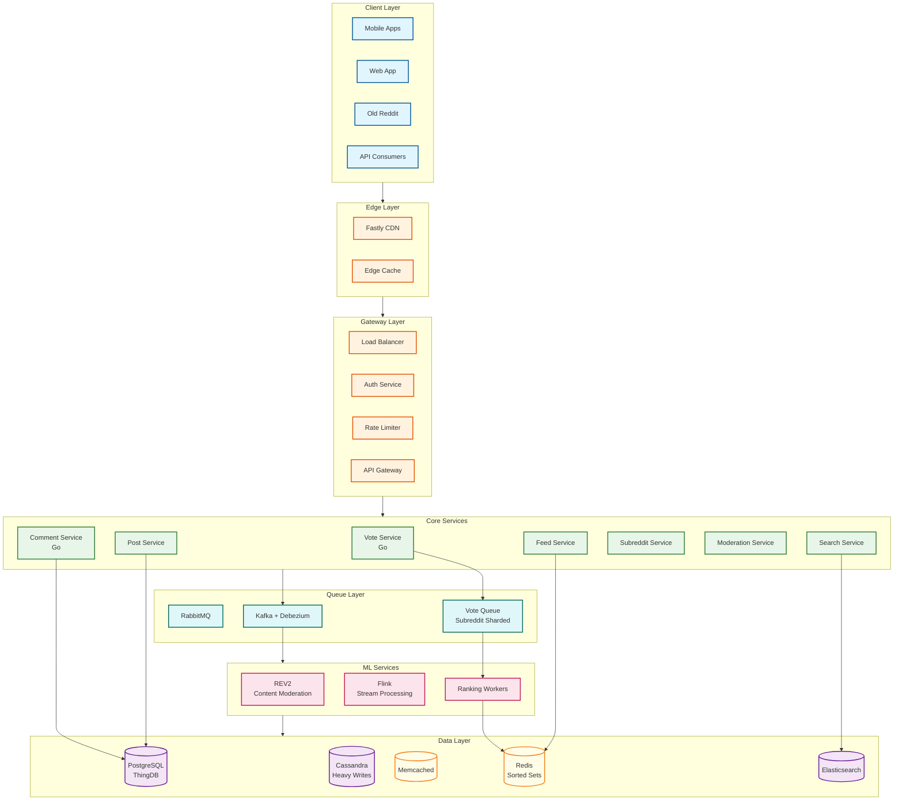

# Reddit System Design

## Overview

Reddit is a **community-driven content aggregation and discussion platform** enabling 121M+ daily active users (Q4 2025) to submit, vote on, and discuss content within topic-based communities called **subreddits**. The core engineering challenges center on the **democratic voting system** (Hot, Best, Rising, Controversial algorithms), **hierarchical comment threading**, and **subreddit-based content isolation** at massive scale. Following its March 2024 IPO, Reddit has accelerated infrastructure modernization — migrating core services from Python to Go, adopting gRPC federation, implementing server-driven UI for mobile feeds, and launching AI-powered search ("Reddit Answers") that reached 15M weekly active users by Q4 2025.

**Key differentiator from Twitter/Facebook:** Reddit uses community-based organization (subreddits) rather than user-based graphs (followers/friends). Content ranking is determined by **community voting** rather than ML-driven engagement prediction, creating unique challenges around vote manipulation prevention and hot spot isolation. The platform's pseudonymous identity model and community governance make it architecturally distinct from every major social network.

---

## System Characteristics

| Characteristic | Value | Implication |
|----------------|-------|-------------|
| Traffic Pattern | Read-heavy, vote-heavy | Multi-tier caching, async vote processing |
| Latency Target | <500ms feed, <150ms vote | Precomputed hot lists, optimistic UI |
| Consistency Model | Eventual (votes), Strong (posts) | Vote counts update within seconds |
| Availability Target | 99.99% | Multi-region, graceful degradation |
| Data Model | ThingDB (Thing + Data tables) | Flexible schema evolution |
| Scale | 121M DAU, 58M votes/day | Subreddit-based sharding |
| Ranking Model | Algorithmic + ML hybrid | Background score computation + personalization |
| Migration State | Python monolith → Go microservices | Comments/Accounts complete, Posts/Subreddits in progress |
| IPC Protocol | Thrift → gRPC (transitional shim) | Gradual migration with IDL converter |

---

## Complexity Rating

| Component | Complexity | Key Challenge |
|-----------|------------|---------------|
| **Overall System** | Very High | Democratic voting + threading + moderation at scale |
| Voting System | High | Hot algorithm, manipulation prevention, 58M votes/day |
| Comment Threading | High | Hierarchical trees, "load more" pagination, depth limiting |
| Content Ranking | High | Multiple algorithms (Hot, Best, Rising, Controversial, New) + ML personalization |
| Subreddit Isolation | High | Hot spot handling, vote queue sharding |
| Moderation System | High | Per-subreddit rules, AutoModerator, REV2 ML pipeline, AI-content detection |
| Search / Reddit Answers | High | Full-text + AI-powered conversational search across billions |
| Internationalization | Medium | AI translation across 22 languages, 55%+ international DAU |
| Service Migration | High | Python → Go with tap-compare, Thrift → gRPC with transitional shim |

---

## Quick Navigation

| Document | Description |
|----------|-------------|
| [01 - Requirements & Estimations](./01-requirements-and-estimations.md) | Functional/non-functional requirements, capacity planning |
| [02 - High-Level Design](./02-high-level-design.md) | Architecture, data flows, key decisions |
| [03 - Low-Level Design](./03-low-level-design.md) | ThingDB schema, APIs, ranking algorithms |
| [04 - Deep Dives & Bottlenecks](./04-deep-dive-and-bottlenecks.md) | Vote pipeline, comment trees, hot algorithm |
| [05 - Scalability & Reliability](./05-scalability-and-reliability.md) | Scaling strategies, Go migration, fault tolerance |
| [06 - Security & Compliance](./06-security-and-compliance.md) | Vote manipulation, moderation, GDPR |
| [07 - Observability](./07-observability.md) | Metrics, logging, tracing, alerting |
| [08 - Interview Guide](./08-interview-guide.md) | Pacing, trap questions, trade-offs |

---

## Core Modules

| Module | Responsibility | Key Challenge | Scale |
|--------|----------------|---------------|-------|
| **Vote Service** | Vote processing, score aggregation | 58M votes/day, manipulation prevention | ~2K QPS peak |
| **Feed Service** | Content ranking, personalization | Multiple algorithms, subreddit hot spots | ~20K QPS |
| **Comment Service** (Go) | Threaded comments, tree construction | Deep nesting, "load more" pagination | 7.5M/day |
| **Post Service** | Post CRUD, media handling | Cross-post, flair, media processing | 1.2M/day |
| **Subreddit Service** | Community management, rules | Hot subreddit isolation | 100K+ subreddits |
| **Moderation Service** | Content filtering, spam detection | REV2 ML + AutoModerator + AI-content flags | Real-time |
| **Search / Answers** | Full-text + AI conversational search | Semantic understanding, multi-language | 80M WAU (search) |
| **Translation Service** | AI-powered content translation | 22 languages, 4x DAU uplift in translated markets | 55%+ intl DAU |
| **Developer Platform** (Devvit) | Third-party apps, mod tools | Interactive games, utilities, Gold integration | Growing ecosystem |

---

## Architecture Overview



---

## Reddit vs Twitter vs Facebook

| Aspect | Reddit | Twitter | Facebook |
|--------|--------|---------|----------|
| **Graph Type** | Community membership | Unidirectional (follow) | Bidirectional (friend) |
| **Content Organization** | Subreddits (communities) | Timeline (chronological/ML) | News Feed (ML) |
| **Ranking Model** | Democratic voting | ML engagement prediction | ML engagement prediction |
| **Hot Spot Pattern** | Subreddit-based (r/pics viral) | Celebrity-based (Elon tweets) | Celebrity-based (pages) |
| **Identity** | Pseudonymous (throwaways OK) | Public identity | Real name |
| **Content Length** | Unlimited text | 280 characters | Unlimited |
| **Threading** | Hierarchical (deep nesting) | Flat replies | Single-level comments |
| **Unique Challenge** | Vote manipulation prevention | Celebrity fan-out (150M) | Social graph consistency |

### Reddit's Unique Technical Challenges

```
COMMUNITY-BASED VS USER-BASED:

Twitter/Facebook:
  - Content distribution follows user graph
  - Celebrity = many followers = fan-out problem
  - Solution: Push/pull hybrid based on follower count

Reddit:
  - Content distribution follows subreddit membership
  - Hot subreddit = many subscribers = isolation problem
  - Solution: Subreddit-based queue sharding

DEMOCRATIC RANKING:

Twitter/Facebook:
  - ML predicts what you'll engage with
  - Algorithm decides visibility

Reddit:
  - Community votes determine ranking
  - Hot algorithm: log(score) + time_decay
  - Users explicitly control content value
  - Creates vote manipulation vulnerability
```

---

## Technology Stack

| Layer | Technology | Purpose |
|-------|------------|---------|
| **Backend (Legacy)** | Python (r2 monolith) | Being retired service-by-service |
| **Backend (Modern)** | Go microservices | Comments, Accounts complete; Posts, Subreddits in progress |
| **IPC (Legacy)** | Thrift | Being migrated via transitional shim |
| **IPC (Modern)** | gRPC | Replacing Thrift with IDL converter |
| **API Layer** | GraphQL Federation | Federated graph across Go microservices |
| **Primary Database** | PostgreSQL | ThingDB model (Things + Data tables) |
| **Media Metadata** | Aurora PostgreSQL | 100K+ reads/sec, <5ms p90 latency |
| **Write-Heavy Storage** | Cassandra | High-volume writes, resilience |
| **Read Cache** | Memcached | Sub-second reads |
| **Ranking Cache** | Redis | Sorted sets for hot lists, CDC events |
| **CDN** | Fastly | Edge routing, static content, domain-path logic |
| **Message Queue** | RabbitMQ | Async job processing (votes, submissions) |
| **Event Streaming** | Kafka + Debezium | Change data capture, replication |
| **Stream Processing** | Flink + Stateful Functions | REV2 safety rules, recommendations |
| **Search** | Elasticsearch | Full-text search |
| **AI/ML** | LLM-based systems | Reddit Answers, translation, content moderation |
| **Orchestration** | Kubernetes (kops) | Multi-AZ container orchestration |
| **CI/CD** | Buildkite + Bazel | 30% faster builds, ~5s queue times |
| **Observability** | Prometheus + Grafana + Istio | Metrics, dashboards, service mesh |

---

## Key Scale Numbers

| Metric | Value | Context |
|--------|-------|---------|
| DAU | 121.4 million | Q4 2025 (19% YoY growth) |
| WAU | 471.6 million | Q4 2025 (24% YoY growth) |
| MAU | 1+ billion | Monthly active users |
| International DAU | 55.52% | Over half of daily users are non-US |
| Votes/day | 58 million | Upvotes + downvotes |
| Upvotes/month | 2.8 billion | Average monthly |
| Comments/day | 7.5 million | New comments |
| Posts/year | 430+ million | New posts |
| Subreddits | 100,000+ | Active communities |
| Hot algorithm decay | 45,000 seconds | 12.5 hours per order of magnitude |
| Vote QPS (peak) | ~2,000 | Vote submissions |
| Feed QPS (peak) | ~20,000 | Feed loads |
| Go migration impact | 50% | P99 latency reduction |
| Reddit Answers WAU | 15 million | Q4 2025 (from 1M in Q1 2025) |
| Search WAU | 80 million | Q4 2025 (from 60M) |
| Revenue (2025) | $2.2 billion | 69% YoY growth |
| Data licensing | $140 million | 2025 (22% YoY growth) |
| AI citation share | 40.1% | #1 most-cited source in AI models |

---

## Ranking Algorithms Overview

### Hot Algorithm (Default Sort)

```
HOT_SCORE = sign(score) × log₁₀(max(|score|, 1)) + (seconds / 45000)

Where:
  score = upvotes - downvotes
  seconds = post_created_utc - 1134028003 (Reddit epoch: Dec 8, 2005)

Properties:
  - 12.5 hours to decay one order of magnitude
  - 10 upvotes ≈ 100 upvotes + 12.5 hours age
  - Negative scores decay faster (appear lower)
  - Time-weighted: newer content surfaces faster
```

### Best Algorithm (Wilson Score)

```
BEST_SCORE = (p + z²/2n - z×√(p(1-p)/n + z²/4n²)) / (1 + z²/n)

Where:
  n = upvotes + downvotes
  p = upvotes / n
  z = 1.96 (95% confidence)

Properties:
  - Confidence-weighted vote ratio
  - Favors items with more votes (higher confidence)
  - 1 up, 0 down scores LOWER than 100 up, 20 down
  - Primary sort for comments
```

### Rising Algorithm

```
RISING_SCORE = vote_velocity × freshness_boost

Where:
  vote_velocity = score / max(age_hours, 1)
  freshness_boost = 2.0 - (age_hours / 2) if age < 2 hours, else 1.0

Properties:
  - Identifies trending content early
  - Predicts tomorrow's hot posts
  - High velocity = rapid upvoting
```

---

## Interview Readiness Checklist

Before your interview, ensure you can:

- [ ] Explain subreddit-based sharding vs user-based fan-out
- [ ] Derive the Hot algorithm formula and explain time decay
- [ ] Describe Wilson score for comment ranking (Best sort)
- [ ] Walk through vote processing pipeline with queue sharding
- [ ] Calculate capacity estimates (votes/day, QPS, storage)
- [ ] Compare Reddit to Twitter/Facebook architecturally
- [ ] Explain ThingDB's two-table model and benefits
- [ ] Discuss vote manipulation prevention strategies
- [ ] Handle hierarchical comment threading with "load more"
- [ ] Describe the Go migration and tap-compare testing

---

## Quick Reference Card

```
┌─────────────────────────────────────────────────────────────────┐
│                      REDDIT QUICK REFERENCE                     │
├─────────────────────────────────────────────────────────────────┤
│  SCALE (Q4 2025):                                               │
│    DAU: 121M | WAU: 472M | MAU: 1B+ | Votes/day: 58M           │
│    Comments/day: 7.5M | Posts/year: 430M+ | Intl: 55%+         │
│    Revenue: $2.2B/yr | Reddit Answers: 15M WAU                 │
│                                                                 │
│  HOT ALGORITHM:                                                 │
│    sign(score) × log₁₀(|score|) + seconds/45000                │
│    12.5 hours = 1 order of magnitude decay                     │
│    10 upvotes ≈ 100 upvotes + 12.5 hours                       │
│                                                                 │
│  BEST ALGORITHM (Comments):                                     │
│    Wilson score lower bound (95% confidence)                    │
│    Favors more votes over high ratio                           │
│                                                                 │
│  VOTE PROCESSING:                                               │
│    Subreddit-sharded queues: subreddit_id % N                  │
│    Async score recalculation                                    │
│    Optimistic UI (instant feedback)                            │
│                                                                 │
│  DATA MODEL (ThingDB):                                          │
│    Thing Table: id, type, ups, downs, created_utc              │
│    Data Table: thing_id, key, value (flexible schema)          │
│                                                                 │
│  COMMENT THREADING:                                             │
│    Hierarchical (parent_id references)                          │
│    Depth limiting (~10 levels)                                  │
│    "Load more" stubs for pagination                            │
│                                                                 │
│  SERVICE MIGRATION (Python → Go):                               │
│    Comments: ✅ | Accounts: ✅ | Posts: 🔄 | Subreddits: 🔄     │
│    IPC: Thrift → gRPC (transitional shim)                      │
│    50% P99 latency reduction, 62% memory reduction             │
│                                                                 │
│  UNIQUE CHALLENGES:                                             │
│    Vote manipulation (rings, bots, velocity, shadowban)         │
│    Subreddit hot spots (r/all aggregation)                     │
│    Democratic ranking (users decide, not ML)                   │
│    AI-generated content moderation (only 1.2% have policies)   │
│    22-language translation with community governance            │
└─────────────────────────────────────────────────────────────────┘
```

---

## Related Patterns

| Pattern | System | Connection |
|---------|--------|------------|
| [Distributed Rate Limiter](../1.1-distributed-rate-limiter/00-index.md) | 1.1 | Per-user/subreddit vote velocity limiting, API tier throttling |
| [Distributed Message Queue](../1.6-distributed-message-queue/00-index.md) | 1.6 | RabbitMQ-based async vote processing and job queues |
| [Content Delivery Network](../1.15-content-delivery-network-cdn/00-index.md) | 1.15 | Fastly CDN for edge routing, logged-out feed caching |
| [Event Sourcing System](../1.18-event-sourcing-system/00-index.md) | 1.18 | Kafka + Debezium CDC for vote events and cross-service replication |
| [Content Moderation System](../12.17-content-moderation-system/00-index.md) | 12.17 | REV2 ML pipeline, AutoModerator, Flink-based safety rules |
| [Twitter/X](../4.2-twitter/00-index.md) | 4.2 | Contrasting user-based fanout vs Reddit's community-based sharding |
| [Facebook](../4.1-facebook/00-index.md) | 4.1 | TAO cache comparison; contrasting ML-driven vs democratic ranking |
| [Recommendation Engine](../3.12-recommendation-engine/00-index.md) | 3.12 | Feed personalization, ML-based content ranking evolution |

---

## References

- [Reddit Engineering - Migrating Comment Backend to Go](https://www.infoq.com/news/2025/11/reddit-comments-go-migration/)
- [ByteByteGo - How Reddit Migrated Comments](https://blog.bytebytego.com/p/how-reddit-migrated-comments-functionality)
- [ByteByteGo - Reddit's Architecture Evolution](https://blog.bytebytego.com/p/reddits-architecture-the-evolutionary)
- [ByteByteGo - How Reddit Delivers Notifications](https://blog.bytebytego.com/p/how-reddit-delivers-notifications)
- [InfoQ - Reddit Migrates Media Metadata to Aurora PostgreSQL](https://www.infoq.com/news/2024/03/reddit-metadata-s3-postgres/)
- [InfoQ - Reddit Adopts Server-Driven UI](https://www.infoq.com/news/2023/09/reddit-feed-server-driven-ui/)
- [InfoQ - Evolution of Reddit.com's Architecture](https://www.infoq.com/presentations/reddit-architecture-evolution/)
- [GitHub - reddit-archive/reddit Wiki](https://github.com/reddit-archive/reddit/wiki/architecture-overview)
- [Kevin Burke - Reddit's Database Has Two Tables](https://kevin.burke.dev/kevin/reddits-database-has-two-tables/)
- [Cornell - AI-Generated Content a Triple Threat for Reddit Moderators](https://news.cornell.edu/stories/2025/10/ai-generated-content-triple-threat-reddit-moderators)
- [Buildkite - Reddit Accelerates Innovation](https://buildkite.com/about/press/reddit-accelerates-innovation-and-slashes-build-times-with-buildkite/)
- [Medium - How Reddit Ranking Algorithms Work](https://medium.com/hacking-and-gonzo/how-reddit-ranking-algorithms-work-ef111e33d0d9)
