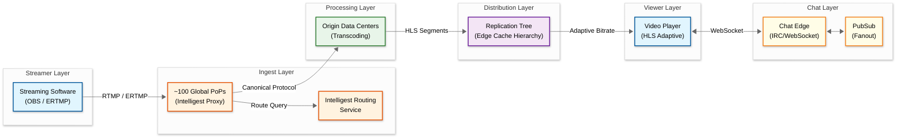
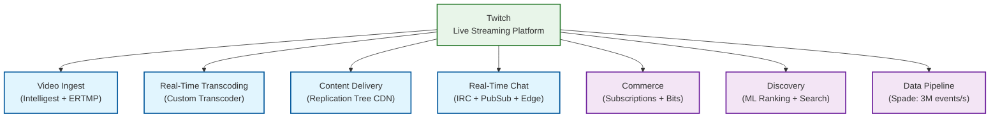

# Twitch - Live Video Streaming Platform

## System Overview

Twitch is the world's leading live video streaming platform, enabling millions of creators to broadcast real-time video content to a global audience. Unlike Video-on-Demand (VOD) platforms, Twitch's core challenge is **real-time ingest, transcode, and delivery** of live video at sub-second latency while simultaneously managing the world's largest real-time chat system—processing hundreds of billions of messages per day. The platform combines live video infrastructure with a creator economy (subscriptions, Bits, ads) and community features (chat, clips, raids).

## Key Characteristics

| Characteristic | Description |
|----------------|-------------|
| **Traffic Pattern** | Read-heavy (100:1 viewer-to-streamer ratio), bursty during events |
| **Latency Sensitivity** | Ultra-low latency (~2s glass-to-glass) for live interaction |
| **Data Type** | Live video (RTMP ingest → HLS delivery), real-time chat (IRC/WebSocket) |
| **Scale** | 2.5M average concurrent viewers, 7M monthly streamers, 1.3T yearly minutes watched |
| **Consistency Model** | Eventual consistency for chat/metadata, strong consistency for payments |
| **Unique Challenge** | Real-time transcoding at scale + massive chat fanout + creator monetization |

## Complexity Rating

**Very High** — Combines real-time video processing (custom transcoder, global ingest routing), massive chat fanout (hundreds of billions of messages/day), multi-layered CDN (Replication Tree), and a complex monetization engine (40+ commerce microservices).

## Quick Navigation

| Document | Description |
|----------|-------------|
| [01 - Requirements & Estimations](./01-requirements-and-estimations.md) | Functional/non-functional requirements, capacity planning, SLOs |
| [02 - High-Level Design](./02-high-level-design.md) | Architecture diagrams, data flow, key decisions |
| [03 - Low-Level Design](./03-low-level-design.md) | Data model, API design, algorithms (Step-by-step plan in plain English) |
| [04 - Deep Dive & Bottlenecks](./04-deep-dive-and-bottlenecks.md) | Critical components, race conditions, Slowest part of the process analysis |
| [05 - Scalability & Reliability](./05-scalability-and-reliability.md) | Scaling strategies, fault tolerance, disaster recovery |
| [06 - Security & Compliance](./06-security-and-compliance.md) | Threat model, AuthN/AuthZ, compliance |
| [07 - Observability](./07-observability.md) | Metrics, logging, tracing, alerting |
| [08 - Interview Guide](./08-interview-guide.md) | 45-min pacing, trap questions, trade-offs |

## Architecture at a Glance

## Key Technical Differentiators

1. **Intelligest Routing System** — Custom ingest routing replacing HAProxy, using randomized greedy algorithms with real-time capacity monitoring (Capacitor + Well services)
2. **Custom Transcoder** — Purpose-built transcoder (not FFmpeg) for IDR frame alignment, metadata injection, and frame rate downsampling across variants
3. **Enhanced Broadcasting (ERTMP)** — Client-side multi-encode allowing streamers to send pre-transcoded multi-track streams, reducing server-side transcoding load by up to 10x
4. **Hierarchical Chat Fanout** — Go-based Edge + PubSub architecture delivering hundreds of billions of messages/day with IRC protocol compatibility
5. **Replication Tree CDN** — Directed graph hierarchy of data centers with demand-based dynamic replication per channel

## Real-World Scale (2023 Metrics)

| Metric | Value |
|--------|-------|
| Average concurrent viewers | 2.5 million |
| Yearly minutes watched | 1.3 trillion |
| Monthly individual streamers | 7 million |
| Daily page loads | 230 million |
| Chat messages delivered | Hundreds of billions/day |
| Events ingested into data lake | 3 million/second |
| Data platform storage | 100+ petabytes |
| Third-party API applications | 25,000+ |
| AWS accounts managed | 2,000+ |
| Commerce microservices | 40+ |

## Related Patterns

| Pattern | Relationship | Reference |
|---------|-------------|-----------|
| **CDN Design** | Twitch's Replication Tree is a custom CDN optimized for live streaming | `2.3-cdn-design` |
| **WebSocket System** | Chat Edge nodes use WebSocket for bidirectional real-time messaging | `4.4-whatsapp` |
| **Payment System** | Commerce layer (subscriptions, Bits, ads) requires payment processing | `8.1-digital-wallet` |
| **Notification System** | Go-live alerts, raid notifications, subscription events | `4.6-notification-system` |
| **Recommendation System** | Stream discovery uses ML-based ranking | `3.4-recommendation-engine` |
| **Rate Limiter** | API gateway, chat rate limiting, ingest throttling | `1.7-distributed-rate-limiter` |
| **Video Processing Pipeline** | VOD archiving, clip creation share patterns with offline video systems | `5.1-youtube` |
| **Real-Time Analytics** | Spade event pipeline (3M events/s) feeds real-time dashboards | `15.1-metrics-monitoring-system` |

## Pattern Relationships

## Evolution Timeline

| Year | Milestone |
|------|-----------|
| 2007 | Justin.tv launches (predecessor) |
| 2011 | Twitch.tv spins out as gaming-focused platform |
| 2013 | Twitch surpasses HBO Go, Hulu in peak internet traffic |
| 2014 | Amazon acquires Twitch for $970M; 55M monthly unique viewers |
| 2017 | Custom transcoder replaces FFmpeg; 10M daily active users |
| 2019 | Search system rebuilt with ML-based ranking (OpenSearch) |
| 2020 | COVID-19 surge: peak concurrent viewers doubles |
| 2022 | Intelligest routing system deployed; monolith decomposition accelerates |
| 2023 | Enhanced Broadcasting (ERTMP) beta; 2.5M average concurrent viewers |
| 2024 | AV1 encoding support; continued investment in client-side encoding |

## References

- [Ingesting Live Video Streams at Global Scale — Twitch Engineering Blog (2022)](https://blog.twitch.tv/en/2022/04/26/ingesting-live-video-streams-at-global-scale/)
- [Live Video Transmuxing/Transcoding: FFmpeg vs TwitchTranscoder — Twitch Engineering Blog (2017)](https://blog.twitch.tv/en/2017/10/10/live-video-transmuxing-transcoding-f-fmpeg-vs-twitch-transcoder-part-i-489c1c125f28/)
- [Breaking the Monolith at Twitch — Twitch Engineering Blog (2022)](https://blog.twitch.tv/en/2022/03/30/breaking-the-monolith-at-twitch/)
- [Twitch State of Engineering 2023 — Twitch Engineering Blog](https://blog.twitch.tv/en/2023/09/28/twitch-state-of-engineering-2023/)
- [Introducing the Enhanced Broadcasting Beta — Twitch Engineering Blog (2024)](https://blog.twitch.tv/en/2024/01/08/introducing-the-enhanced-broadcasting-beta/)
