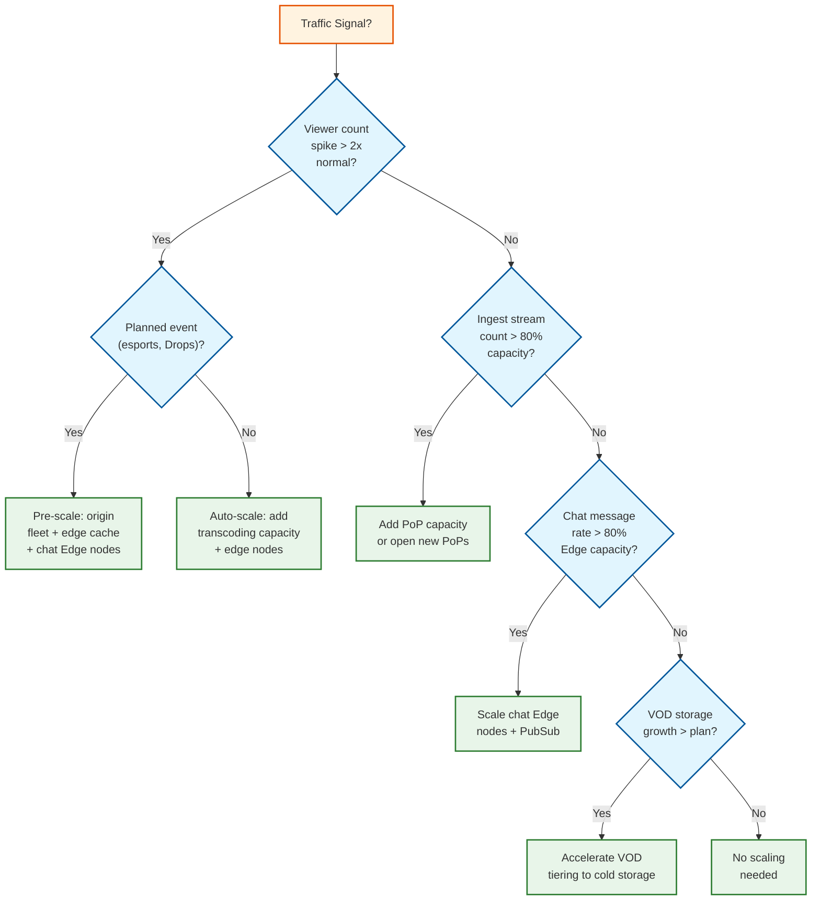

# Requirements & Capacity Estimations

## 1. Functional Requirements

### Core Features (In Scope)

| # | Feature | Description |
|---|---------|-------------|
| F1 | **Live Video Ingest** | Streamers broadcast live video via RTMP/ERTMP from streaming software (OBS, etc.) |
| F2 | **Real-Time Transcoding** | Convert incoming streams to multiple bitrates/resolutions (quality ladder) for adaptive playback |
| F3 | **Live Video Delivery** | Deliver HLS segments to viewers with adaptive bitrate switching and sub-3s latency |
| F4 | **Real-Time Chat** | Per-channel chat rooms with IRC-compatible protocol, moderation tools, emotes |
| F5 | **Stream Discovery** | Browse/search live streams by category, tags, viewer count; personalized recommendations |
| F6 | **Channel Subscriptions** | Tiered subscriptions (Tier 1/2/3) with custom emotes, badges, ad-free viewing |
| F7 | **Bits & Cheering** | Virtual currency system — viewers purchase Bits to cheer in chat with animated emotes |
| F8 | **Clips & VOD** | Clip creation from live streams; automatic VOD archival of past broadcasts |
| F9 | **Notifications** | Stream-go-live alerts, raid notifications, subscription events |
| F10 | **Raids & Hosts** | Transfer viewers from one channel to another at end of stream |

### Explicitly Out of Scope

- Video game distribution/sales (Twitch attempted this and shut it down)
- Long-form VOD-first content (Netflix/YouTube territory)
- Non-live content creation tools (video editing, post-production)
- Merchandise/physical goods marketplace

---

## 2. Non-Functional Requirements

### CAP Theorem Choice

| Dimension | Choice | Justification |
|-----------|--------|---------------|
| **Video Delivery** | AP (Availability + Partition Tolerance) | Viewers must always see video; a few dropped frames are acceptable over a full outage |
| **Chat** | AP | Message delivery is best-effort; losing a message is better than chat going down for millions |
| **Payments/Subs** | CP (Consistency + Partition Tolerance) | Financial transactions require strong consistency — no double-charging or missed payouts |
| **Stream Metadata** | AP | Viewer counts, stream titles can be eventually consistent |

### Consistency Model

| Component | Consistency | Rationale |
|-----------|-------------|-----------|
| Live video segments | Eventual | Segments propagate through Replication Tree; slight delay acceptable |
| Chat messages | Eventual | Messages fan out through PubSub hierarchy; ordering is best-effort |
| Subscription state | Strong | User entitlements (emotes, badges, ad-free) must be immediately accurate |
| Viewer counts | Eventual | Approximate counts are fine; exact counts updated periodically |
| Payment ledger | Strong (ACID) | Financial records require strict consistency |

### Availability Targets

| Component | Target | Justification |
|-----------|--------|---------------|
| Video ingest | 99.99% (52 min/year) | Streamer trust requires near-perfect uptime |
| Video delivery | 99.95% (4.4 hrs/year) | Brief viewer-side interruptions tolerable with buffering |
| Chat service | 99.9% (8.8 hrs/year) | Chat outages are frustrating but not revenue-critical |
| Payment system | 99.99% | Financial operations must be highly reliable |
| API (Helix) | 99.9% | Third-party integrations expect stable API |

### Latency Targets

| Operation | p50 | p95 | p99 |
|-----------|-----|-----|-----|
| Glass-to-glass video latency | 1.5s | 2.5s | 4s |
| Chat message delivery | 100ms | 300ms | 500ms |
| Stream discovery page load | 200ms | 500ms | 1s |
| Subscription purchase | 500ms | 1s | 2s |
| Clip creation | 1s | 3s | 5s |
| Go-live notification | 5s | 15s | 30s |

### Durability Guarantees

| Data Type | Durability | Strategy |
|-----------|------------|----------|
| VOD recordings | 99.999999999% (11 nines) | Object storage with cross-region replication |
| Chat logs | 99.99% | Write-ahead log + async replication |
| Payment records | 99.999999999% | ACID database with synchronous replication |
| Stream metadata | 99.99% | Replicated database clusters |

---

## 3. Capacity Estimations (Back-of-Envelope)

### Assumptions

- Based on publicly available Twitch 2023 metrics
- Peak multiplier: 3x average (major events like The Game Awards, drops campaigns)

| Metric | Estimation | Calculation |
|--------|------------|-------------|
| **MAU** | 140M | Industry reports |
| **DAU** | 35M | ~25% of MAU |
| **Average concurrent viewers** | 2.5M | Published metric |
| **Peak concurrent viewers** | 7.5M | 3x average (major events) |
| **Concurrent live streams** | 100K | ~7M monthly streamers, ~1.4% live at any time |
| **Read:Write Ratio** | 25:1 | 2.5M viewers : 100K streamers |
| **Video Ingest QPS** | 100K streams | Each stream = 1 continuous RTMP connection |
| **HLS Segment Requests (avg)** | 1.25M/s | 2.5M viewers × 1 segment/2s |
| **HLS Segment Requests (peak)** | 3.75M/s | 7.5M viewers × 1 segment/2s |
| **Chat Messages (avg)** | ~200K/s | Hundreds of billions/day ÷ 86,400s |
| **Chat Messages (peak)** | 600K/s | 3x average during major events |

### Storage Estimations

| Metric | Estimation | Calculation |
|--------|------------|-------------|
| **Live video bandwidth (ingest)** | 500 Gbps | 100K streams × 5 Mbps avg bitrate |
| **Live video bandwidth (delivery)** | 12.5 Tbps | 2.5M viewers × 5 Mbps avg |
| **Peak delivery bandwidth** | 37.5 Tbps | 7.5M × 5 Mbps |
| **VOD storage (daily)** | ~5.4 PB | 100K streams × 4 hrs avg × 5 quality variants × 3 Mbps avg |
| **VOD storage (Year 1)** | ~2 EB | 5.4 PB × 365 days |
| **Chat storage (daily)** | ~2 TB | 200K msg/s × 86,400s × 100 bytes avg |
| **Total data platform** | 100+ PB | Published metric (historical + analytics) |
| **Transcoding compute** | ~500K vCPUs | 100K streams × 5 variants × ~1 vCPU per encode |
| **Cache size (hot segments)** | ~500 GB | Top 10K streams × 5 variants × 10 segments × 1 MB |

### Bandwidth Breakdown

```
Ingest: 100K streams × 5 Mbps = 500 Gbps
  ↓ Transcode (5 variants each)
Origin Output: 100K × 5 × 3 Mbps avg = 1.5 Tbps
  ↓ Replication Tree (cache hit ratio ~90%)
Edge Delivery: 2.5M × 5 Mbps = 12.5 Tbps
```

---

## 4. SLOs / SLAs

| Metric | SLO Target | Measurement Method |
|--------|------------|-------------------|
| **Video Ingest Availability** | 99.99% | % of time PoPs accept RTMP connections |
| **Glass-to-Glass Latency (p99)** | < 4 seconds | End-to-end: encoder → viewer player |
| **Chat Delivery Latency (p99)** | < 500ms | Time from send to delivery at recipient |
| **Segment Delivery Success Rate** | 99.9% | % of HLS segment requests returning 200 |
| **Transcoding Start Time** | < 10 seconds | Time from stream connect to first HLS segment available |
| **Error Rate (API)** | < 0.1% | 5xx responses / total requests |
| **Subscription Fulfillment** | < 5 seconds | Time from payment confirmation to entitlement activation |
| **Stream Discovery Freshness** | < 30 seconds | Time from go-live to appearing in browse/search |

### SLA Tiers

| Tier | Availability | Use Case |
|------|-------------|----------|
| **Platform SLA** | 99.9% | Overall platform uptime commitment |
| **Partner SLA** | 99.95% | Enhanced SLA for partnered streamers |
| **API SLA** | 99.9% | Third-party developer API (Helix) |
| **Commerce SLA** | 99.99% | Payment processing and subscription management |

---

## 5. Key Design Constraints

1. **Real-time processing** — Unlike VOD, transcoding must happen faster than real-time; any processing delay directly increases viewer latency
2. **Heterogeneous ingest** — Streamers send wildly varying quality (720p30 to 4K60), codecs (H.264, AV1), and protocols (RTMP, ERTMP)
3. **Power-law distribution** — Top 0.1% of streams consume disproportionate resources (100K+ concurrent viewers per channel)
4. **Bursty traffic** — Game launches, esports finals, and Drops campaigns cause 3-10x traffic spikes within minutes
5. **Chat at video scale** — Chat rooms for popular channels must handle 10K+ messages/second with real-time moderation

---

## 6. Cost Estimation

### Infrastructure Cost Model (Monthly)

| Component | Unit Cost | Scale | Monthly Cost |
|-----------|----------|-------|-------------|
| **Ingest PoPs** | ~$50K/PoP (hosting + bandwidth) | 100 PoPs | $5M |
| **Transcoding compute** | ~$0.02/stream-hour (5 variants) | 100K streams × 720 hours | $1.4M |
| **Edge delivery bandwidth** | ~$0.01/GB at scale | 12.5 Tbps avg × 2.6M seconds | $40M+ |
| **Chat infrastructure** | ~$200/Edge node/month | 500 nodes | $100K |
| **Object storage (VODs)** | ~$0.004/GB/month | 5.4 PB active | $22M |
| **PostgreSQL** | ~$5K/host/month | 125 hosts | $625K |
| **Data pipeline (Spade)** | ~$0.001/million events | 3M/s × 2.6M seconds | $8M |
| **Total estimated** | | | **~$75-80M/month** |

**Key cost drivers:** Bandwidth (delivery) dominates at ~50% of total infrastructure spend, followed by storage and transcoding compute.

### Cost Optimization Levers

| Lever | Savings Potential | Trade-off |
|-------|------------------|-----------|
| **Enhanced Broadcasting adoption** | 30-50% transcoding cost | Requires streamer GPU capability |
| **AV1 encoding** | 30% bandwidth at same quality | Higher encode compute; limited decoder support |
| **Demand-based replication** | 40% edge bandwidth | Cold start latency for small streams |
| **VOD tiering (hot/warm/cold)** | 50% storage cost | Increased latency for cold VODs |
| **Chat message sampling** | 60% chat fanout cost | Some messages not delivered to all viewers |

---

## 7. Capacity Planning Decision Tree



---

## 8. Workload Characterization

### Stream Size Distribution

```
Concurrent Viewers per Stream:

  0-10:       ████████████████████████████████████████████  75%
  11-100:     ████████████  15%
  101-1K:     ████  5%
  1K-10K:     ██  3%
  10K-100K:   █  1.5%
  100K+:      ▏  0.5%

Key: Power-law distribution — top 0.5% of streams consume ~40% of resources
```

### Traffic Patterns by Time of Day (NA Region)

```
Concurrent Viewers (millions):

  5M ┤
     │                                    ╭──────╮
  4M ┤                                   ╭╯      ╰╮
     │                                  ╭╯        ╰╮
  3M ┤                                 ╭╯          ╰╮
     │                                ╭╯            ╰╮
  2M ┤                    ╭──────────╯              ╰╮
     │              ╭────╯                            ╰╮
  1M ┤         ╭───╯                                   ╰───╮
     │    ╭───╯                                            ╰──╮
  0M ┼───╯                                                    ╰──
     └────┬────┬────┬────┬────┬────┬────┬────┬────┬────┬────┬────
         00   02   04   06   08   10   12   14   16   18   20   22

  Peak: 7-11 PM local time (after work/school)
  Trough: 4-8 AM local time
  Peak-to-trough ratio: ~5x
```

### Bandwidth Profile per Stream

| Quality Variant | Resolution | Bitrate | % of Viewers | Bandwidth Share |
|----------------|-----------|---------|-------------|----------------|
| **Source** | 1080p60 | 6,000 kbps | 25% | 38% |
| **High** | 720p60 | 3,000 kbps | 35% | 27% |
| **Medium** | 480p30 | 1,500 kbps | 20% | 8% |
| **Low** | 360p30 | 800 kbps | 12% | 2% |
| **Mobile** | 160p30 | 400 kbps | 8% | 1% |
| **Audio only** | — | 128 kbps | varies | <1% |

---

## 9. Failure Mode Analysis

| Failure Mode | Probability | Impact | Detection Time | Recovery Time | Mitigation |
|-------------|------------|--------|----------------|---------------|------------|
| **PoP outage** | Medium | Streams in that PoP region disconnected (~1K streams) | <5s (health check) | 10-30s (auto-reroute) | IRS reroutes to next-closest PoP; streamer auto-reconnects |
| **Origin DC failure** | Low | Streams on that origin lose transcoding (~10K streams) | <10s (health check) | 30-60s (IRS reroute) | IRS redirects to remaining origins; capacity headroom absorbs |
| **Transcoding CPU exhaustion** | Medium (during events) | New streams queued; existing streams unaffected | <30s (queue depth) | 1-5 min (auto-scale) | Quality ladder reduction; Enhanced Broadcasting fallback |
| **Edge cache miss storm** | Medium (go-live) | Viewer rebuffering; origin overloaded | <10s (cache miss rate) | 10-30s (cache fills) | Request coalescing; pre-warming; staggered notifications |
| **PubSub cluster failure** | Low | Chat delayed or lost for affected channels | <5s (health check) | 30-60s (failover) | Edge nodes continue local delivery; PubSub failover |
| **Database primary failure** | Low | Writes blocked; reads continue on replicas | <10s (connection error) | 30-120s (standby promotion) | Async replication; read replicas; connection routing |
| **Payment gateway timeout** | Medium | Subscriptions and Bits purchases fail temporarily | <5s (timeout) | <30s (retry or fallback gateway) | Backup payment gateway; retry with idempotency |
| **DNS failure** | Very Low | Global outage; no viewer can resolve domain | <30s (synthetic monitoring) | 5-30 min | Multiple DNS providers; client-side DNS caching |
| **Spade pipeline backlog** | Medium | Analytics delayed; no impact on live features | <60s (lag metric) | 5-30 min (auto-scale consumers) | Buffered ingestion; consumer auto-scaling |
